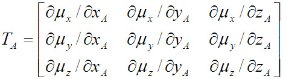
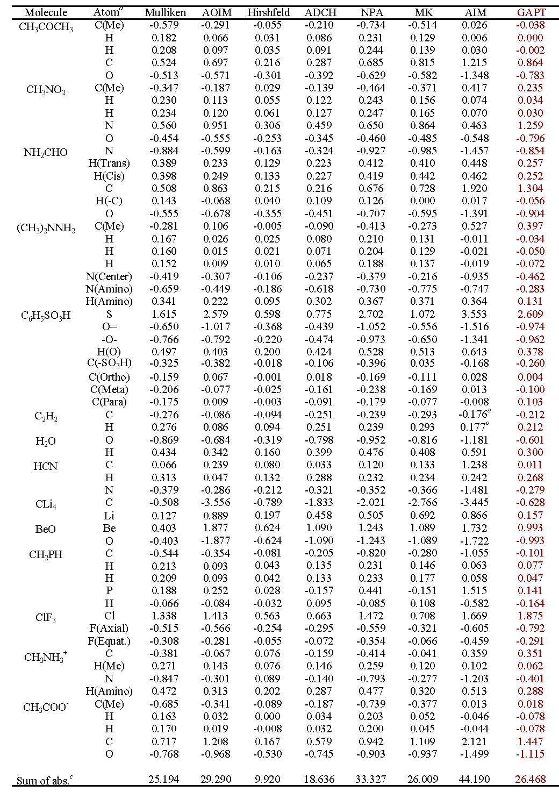
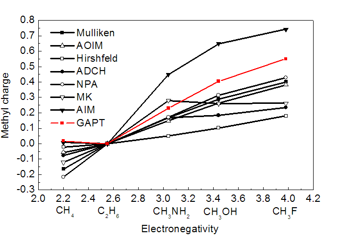
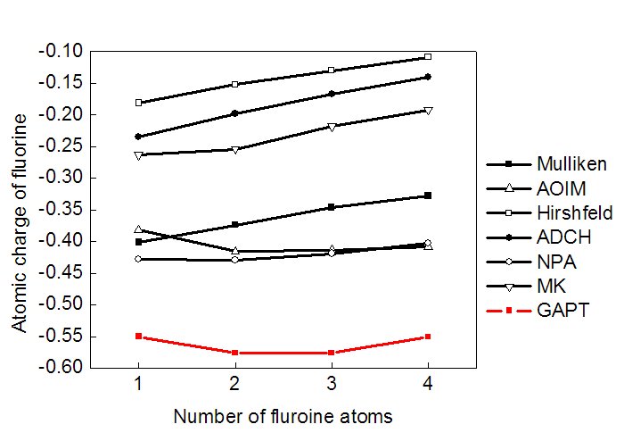
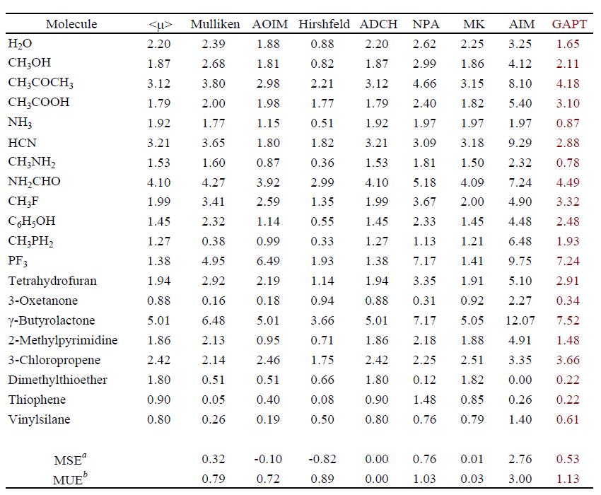
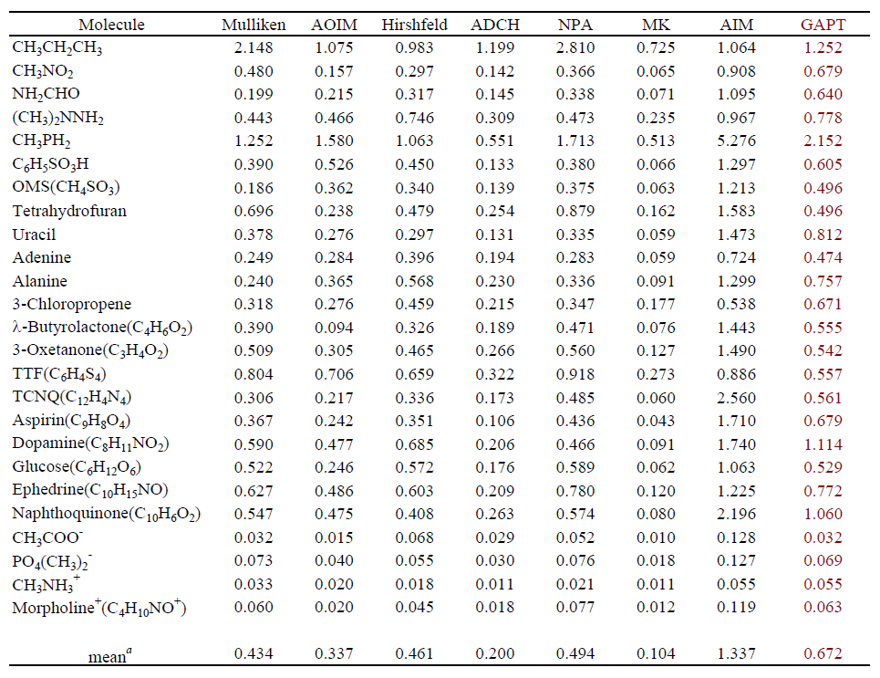
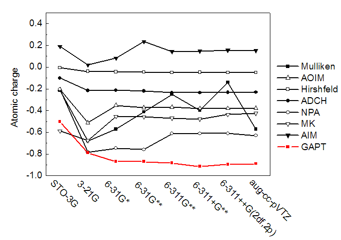
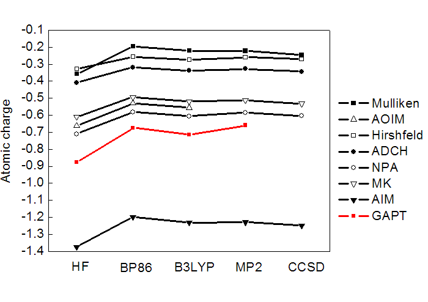

**GAPT电荷的原理和性质**The principles and properties of GAPT charges

文/Sobereva @[北京科音](http://www.keinsci.com/)   2013-11-5

在《物理化学学报》上有一篇《原子电荷计算方法的对比》（2012, 28, 1-18，<http://www.whxb.pku.edu.cn/CN/abstract/abstract27818.shtml>），简要介绍并详细比较了诸多常用计算原子电荷的方法。但由于篇幅所限，再加上GAPT电荷没什么实用价值，文中没有对GAPT的讨论。但是时而有人提及GAPT电荷，不知什么原因想要计算这种无聊的原子电荷，甚至在论坛上有人说昏话“...都很粗糙，一般计算原子极化张量电荷（APT）才比较准确”。于是本文就简要介绍一下GAPT电荷，并且通过一些实际数据来说明GAPT电荷的性质，算是对那篇文章的一点补充。

## 1 GAPT电荷简介

GAPT全称是Generalized Atomic Polar Tensors（广义原子极化张量），是J. Cioslowski于1989年在JACS,111,8333和PRL,62,1469中提出的计算原子电荷的方法。

原子极化张量是个3*3矩阵，比如对于A原子，其定义为

其中μ是分子偶极矩，下标是它的各个笛卡尔分量。x,y,z是A原子的坐标。GAPT电荷就是原子极化张量的三个对角元的平均值。

GAPT电荷的原理不难理解。假设某原子电荷为q_A，乘上它的x_A坐标，即q_A*x_A就是它对分子偶极矩x分量的贡献。于是此原子x坐标的微小变化导致体系偶极矩x分量的变化量就为q_A*Δx_A=Δμ_x，所以令μ_x对x_A求偏导就得到了原子A的电荷。但是偶极矩有三个分量，于是三个方向的导数的平均值就被定义为了GAPT电荷。GAPT电荷的物理思想比较简洁、清楚、明确，不过最后取平均的做法缺乏显著物理意义。

GAPT电荷投入实际应用的一个最大困难就是计算GAPT电荷十分昂贵，因为这要求能量的二阶导数，所以计算耗时等同于做简正振动分析的耗时。GAPT可以算是计算最最耗时的原子电荷方法，甚至慢于计算AIM电荷。对于没有解析二阶导数的方法更要命。

APT电荷实际上有不同的定义，但通常在计算化学领域提及的APT电荷就是指GAPT电荷。GAPT电荷和APT电荷往往不加区分地使用。

## 2 GAPT电荷的计算

在Gaussian中，在优化好的结构下只要用freq关键词做振动分析，程序就顺便把GAPT电荷给出来了，既不需要额外关键词，也不需额外耗费计算量。例如甲烷的结果  
 APT atomic charges:  
              1  
     1  C   -0.087802  
     2  H    0.021950  
     3  H    0.021950  
     4  H    0.021950  
     5  H    0.021950  
 Sum of APT charges=   0.00000  
如果有兴趣的话，也可以在用freq的同时用IOp(7/33=1)把分子偶极矩对各个原子的坐标的导数给输出出来（DipoleDeriv部分），然后自行根据GAPT电荷的公式去计算。  
PS：即便不加IOp(7/33=1)，在频率计算任务最末尾部分也能看到DipoleDeriv的输出，不过其格式不好读取。

## 3 GAPT电荷的一些性质

我们来通过实例考察一下GAPT电荷的一些性质。计算GAPT电荷时所用的条件和《原子电荷计算方法的对比》文中的完全一致。

对14种普通的分子计算了GAPT电荷，列于下表。其它一些常用的原子电荷计算方法的结果也列出来了以兹对比。最后一行是所有原子电荷的绝对值的加和，由此可以直接看出原子电荷整体偏大还是偏小。

由数据可见，GAPT电荷数值整体大小和Mulliken差不多，属于中游。对于大部分分子，GAPT电荷还算合理，电负性关系也能定性正确表现。但是GAPT对CLi4的电荷严重低估！此体系Li向C转移的电子量很大，但C的GAPT电荷仅-0.63。虽说Mulliken给出的C的电荷才-0.51，但是不能跟Mulliken比，Mulliken电荷对于离子性体系低估极性是众所周知的。也别跟Hirshfeld电荷比，Hirshfeld电荷总是过于偏小也是众所周知的问题。对于某些体系，GAPT算出的甲基的C比H电荷还正，违背了电负性的相对大小，因此也显得不合理。所以，用GAPT电荷讨论问题不保险。

让甲烷接上电负性不同的原子，然后看看甲基的GAPT电荷是否能正确表现出电负性的变化。由下图可见，GAPT的确很好地反映了这一点。但是还是如刚才所说，GAPT没有表现出C比H的电负性更大，甲烷中氢带了微小负电荷。

下图显示了CH4的氢被不同数目F取代后每个氟原子的电荷变化。碳就那么多给电子的能力，氟越多，每个氟分到的电子就越少，因此氟取代数目越多时理应每个氟的电荷绝对值变得越小。可见大部分计算原子电荷的方法都反映了这个趋势，即曲线整体斜向上。但是GAPT却完全没有反映出这一点。  

下图基于原子电荷计算了一批分子的偶极矩，并与在相应级别下基于电子密度精确计算的偶极矩进行对比，MSE和MUE分别代表平均含符号误差和平均无符号误差，单位是Debye。可见GAPT电荷虽然计算原理上和分子偶极矩直接相关，但是对于偶极矩重现性巨差！从MUE值来看倒数第二烂。同时也看到J.Theor.Comp.Chem., 11, 163-183 (2012)中提出的ADCH电荷能够完全精确重现分子偶极矩，误差为0。  

下图显示了在分子表面区域各种原子电荷产生的静电势与同级别下基于电子密度精确计算的静电势的差异，差异值通过RRMSE（相对方均根偏差）衡量，数值越大偏差越大。可见GAPT电荷对静电势的重现性和对偶极矩一样烂，排在倒数第二。这也就是说，根本别指望用GAPT电荷当做分子力场的电荷，通过这样的电荷计算的静电相互作用误差甚大！而ADCH电荷的静电势重现性则甚好，仅次于Merz-Kollman拟合静电势电荷。  

下图考察了GAPT电荷对基组的依赖性，原子取的是乙酸的甲基碳。可见GAPT电荷随基组增大收敛很快，到了6-31G*后基本就不变了，这是GAPT电荷的一个优点。所以计算GAPT电荷没必要用大基组。

下图考察了GAPT电荷对理论方法的依赖性。可见GAPT像其它原子电荷计算方法一样，是否考虑电子相关会不小程度地影响结果。不过GAPT也和其它方法一样，对于以什么方式考虑电子相关不是很敏感，用GGA、杂化泛函还是MP2所得结果相差不算太大，因此通常用最俗的B3LYP来计算就可以了。由于CCSD在Gaussian里没有解析二阶导数，因此图中就没有在CCSD下面算GAPT电荷。

## 4 总结

GAPT电荷虽然原理比较清楚，但是缺点甚多。GAPT电荷计算极耗时，没什么实用价值。而且GAPT电荷虽然在多数情况下结果还说得过去，但对于一些体系结果比较差、缺乏化学意义。而且，对偶极矩、静电势这样的可观测性质重现性巨糟。因此从实际角度来看GAPT电荷是战五渣，除非自己很清楚自己为什么要计算GAPT电荷，否则根本别用GAPT电荷！也尽量少提及它。
