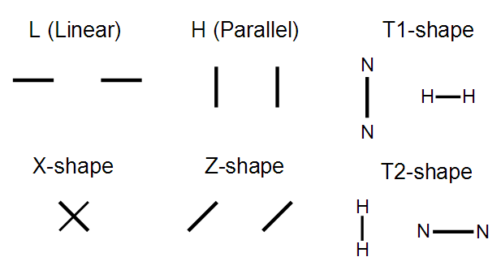
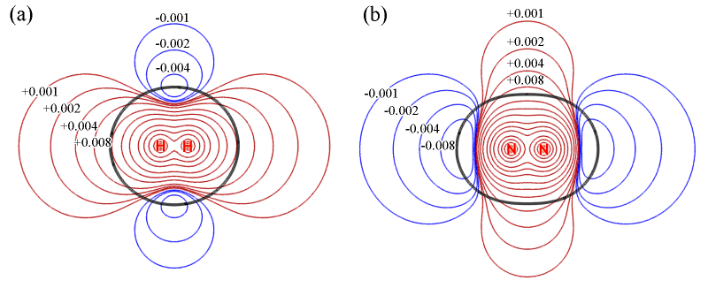
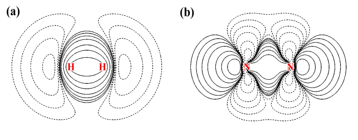
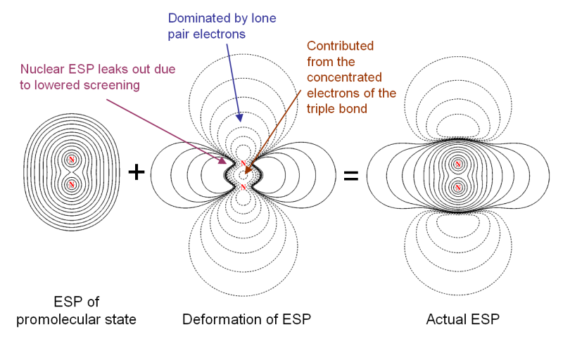
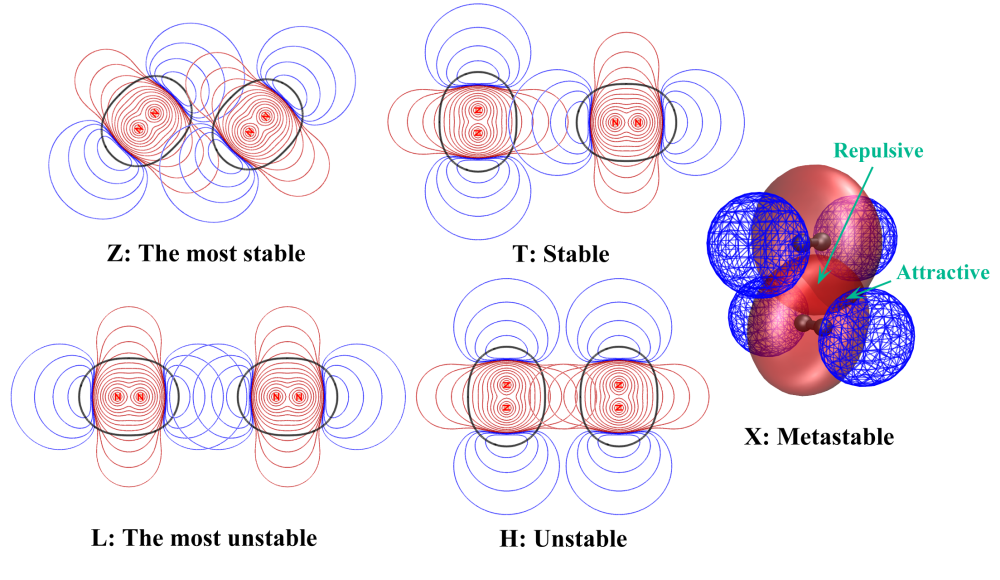
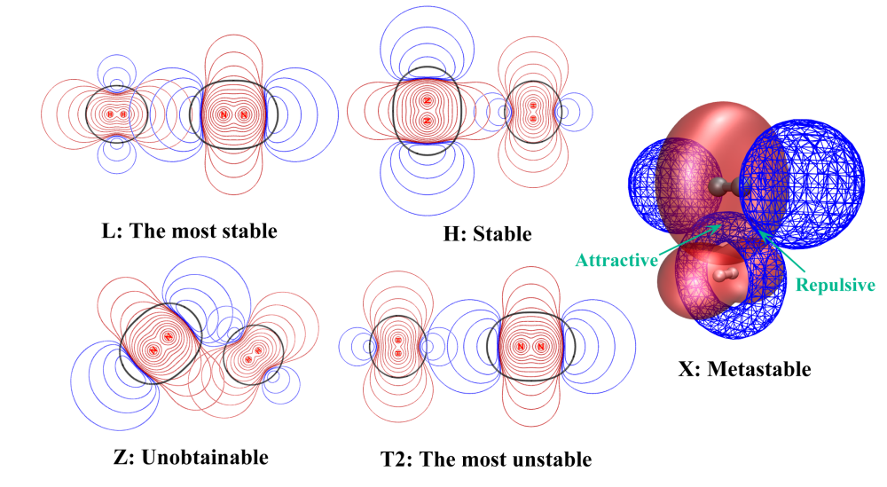

**静电效应主导了氢气、氮气二聚体的构型**Electrostatic effect dominates the configuration of hydrogen and nitrogen dimers

文/Sobereva @[北京科音](http://www.keinsci.com/)  2013-Nov-6

氢气和氮气分子是最基本、最简单的无极性分子。由于没有极性，所以人们普遍认为由它们构成的二聚体(H2)2、(N2)2和(H2)(N2)都是范德华二聚体，也就是分子间相互作用纯粹靠范德华作用。然而，笔者发表于J. Mol. Model., 19, 5387-5395（<http://link.springer.com/article/10.1007%2Fs00894-013-2034-2>）的名为Revealing the nature of intermolecular interaction and configurational preference of the nonpolar molecular dimers (H2)2, (N2)2, and (H2)(N2)的文章则打破了这个传统观念，明确指出了静电效应对氢气、氮气二聚体产生的关键性的影响，证明了二聚体的构型倾向性完全由静电效应所控制。在此帖就介绍一下这个观点新颖、内容有趣且有重要理论意义的工作。值得一提的是，在《Angew. Chem.上发表了全面介绍各种共价和非共价相互作用可视化分析方法的综述》（<http://sobereva.com/746>）中介绍的笔者的综述文章的2.5.2节还专门对这篇文章采用的静电势互补思想和图像叠加分析做了专门介绍，非常欢迎阅读和引用。

文章是针对二聚体的构型倾向性问题来进行讨论的。氢气、氮气在形成二聚体时，有以下典型构型

(H2)2、(N2)2和(H2)(N2)的构型倾向性以前有不少文章都研究过。此文在MP2/jun-cc-pVTZ对二聚体进行优化，并且通过aug-cc-pVnZ (n=T, Q)来外推得到CCSD(T)/CBS相互作用能，并考虑了BSSE，这比以往研究所用级别都高，但结论相仿佛。根据能量高低，确定出二聚体的构型稳定性顺序是：

(H2)2：T>Z>X>H>L  
(N2)2：Z>T>X>H>L  
(H2)(N2)：L>H>X>T1>T2

可见(N2)2和(N2)2这样的由同种分子构成的二聚体都喜欢T和Z构型，但是L构型最不稳定；而H2和N2构成的混合二聚体(H2)(N2)的构型倾向性则最倾向于L构型，而讨厌T构型。为什么二聚体会存在构型倾向性？为什么同种分子和异种分子构成的二聚体的构型倾向性截然相反？这篇文章提出了一种新的基于静电势的分析方法，以十分简单直观的方式完美地说明了这个问题，显示出静电作用的重要性。

在讨论分子间作用前，先研究下H2和N2的静电势的特征。以下是它们的静电势平面图。红色和蓝色等值线分别代表静电势为正和为负的区域。黑色等值线对应分子范德华表面（电子密度=0.001 a.u.）。由于分子间弱相互作用与范德华表面内部关系不大，所以不用管黑色等值线内部的区域。

由上图可见，H2和N2的静电势分布不仅显示出十分显著的各向异性特征，而且，它们的静电势特征几乎完全相反！H2在分子轴上静电势为正，然而N2却明显为负。H2在环绕分子轴的区域静电势为负，而N2却为正。这样奇怪的静电势分布是怎么来的？通过考察它们的电子变形密度图我们可以得到答案，如下所示

图中实线代表原子形成分子后电子密度增加的区域，虚线代表减少的区域。分子的静电势由两部分构成，电子密度贡献负值，原子核电荷贡献正值。对于H2，形成分子后电子密度往两个氢中间移动构成共价键，相应地在分子轴向上电子密度就降低了。于是，分子两端由于电子密度抵消不掉核的贡献，静电势就成了正值。而由于共价键区域电子密度增加，对静电势的贡献超越了核电荷，因此在环绕分子轴的区域静电势为负（但是离原子核很近的区域还是远远抗衡不了核的贡献，静电势依然为正）。

对于N2，形成分子后分子两端出现了孤对电子，对静电势有很大的负贡献，这是为什么分子两端静电势明显为负。然而，虽然形成了三重键，电子密度已经往分子中间凝聚了很多，为何绕分子轴的区域的静电势却还是正的？结合着静电势变形图去观察，原因就一目了然了

图中ESP of promolecular state代表两个孤立状态的氮原子的静电势相叠加的静电势图，这对应于形成分子前状态（promolecular状态）的静电势。有人证明过，孤立原子的静电势肯定处处为正，所以promolecular状态的静电势图处处为正是理所应当的。图中Deformation of ESP显示了从promolecular状态到实际分子状态过程中静电势是如何变化的。可以看到的确由于形成了三重键使得电子密度向分子中央转移，从而导致了分子中间静电势变得明显更负了。但是，这却使得图中紫色箭头附近的电子密度明显降低（对照变形密度图上能明显看到），于是原子核产生的静电势就仿佛从紫色箭头所示区域“漏”了出来，最终导致绕着分子轴的区域的静电势明显为正。实际的分子静电势，正是ESP of promolecular state和Deformation of ESP这两幅图的叠加。可见通过考察静电势变形图，对于搞明白当前体系的静电势是如何形成的是极有帮助的。

考察完了单体的静电势图，现在将图根据体系二聚体构型进行叠加，各种构型的稳定性的差异就变得一目了然了！对于(N2)2如下所示。(H2)2和这极为类似，就不给出了

基于静电势互补思想，文章假设两个分子间静电势以符号相反的方式重叠程度越大，则静电吸引作用越强，体系越稳定；反之，以符号相同的方式重叠程度越大，则静电互斥作用越大，体系越不稳定。从图中来看，这个假设完全合理，可以完美解释为何(N2)2的构型稳定性顺序是Z>T>X>H>L。对于Z构型，红蓝等值线重叠程度比其它构型都大，解释了为什么Z构型是(N2)2最稳定的构型。T构型的红蓝重叠程度比Z略小，因此比Z构型稳定性稍弱。X构型当中既有符号相同方式重叠的区域，也有符号相反方式重叠的区域，所以是亚稳的状态（为了表现清楚重叠区域文章将之作成了等值面图）。H和L构型的静电势都是以符号相同方式重叠的，而且L构型重叠程度更大，因此H不稳定，L更不稳定。注意这里说的稳定与否是相对而言的，不稳定并非代表不能形成相应构型的二聚体，毕竟分子间还有色散作用来稳定它们，但是色散作用的取向性很弱，对这些小分子的构型取向的影响远远抵不过静电作用。

再来通过静电势叠加图看看为什么(H2)(N2)的构型稳定性顺序与(H2)2和(N2)2截然相反，即L>H>X>T1>T2

由于H2和N2在轴向上静电势正好相反，并且以L构型可以让它们的重叠程度最大，所以L最稳定。H、X、T2的相对稳定性顺序也可以按照前述方法通过考察静电势重叠方式和重叠程度来圆满解释。Z构型根本得不到，因为这种情况下，如图所示，静电势在两个区域同时以符号相同方式重叠，由于静电互斥很强，即便一开始把体系摆成Z构型，在优化过程也会立刻跑到L构型去。

可见这种静电势分析方法非常简单直观而且可靠。不仅可以解释已知的稳定性顺序，对于新颖的体系，包括多聚体体系，还可以以这种方式通过摆弄静电势图来预测构型稳定性，“设计”出稳定的构型，就像乐高玩具一样。这和前线分子轨道理论某种程度也有点相仿佛，前线轨道理论要求反应过程中HOMO与LUMO尽可能好地以符号相同方式重叠，而静电势叠加分析则表示，若想形成稳定二聚体，应当以静电势符号相反方式尽可能多地重叠。不过这种静电势分析也并非没有局限性，对于范德华作用强的情况，比如pi-pi堆积，或者体系电子云容易发生极化并且又遇上带净电荷或高极性体系而使得静电势分布会发生较大改变的情况，就得考虑更多因素。

值得一提的是，通常人们分析静电势一般都是讨论分子表面上的静电势，虽然对于此文的体系也可以尝试这么讨论，但是显然没有单体的静电势图叠加这样能把静电势的互补程度这么直观、显著地展现出来。静电势叠加图分析是个很有用的静电势的新的分析方法，建议大家在研究中尝试。用Multiwfn程序（<http://sobereva.com/multiwfn>）可以非常容易地作出这种静电势平面图，也包括promolecular状态的静电势图、静电势变形图，以及电子变形密度图。

通过四极矩-四极矩相互作用模型进行分析，也能对这些二聚体的构型倾向性问题进行一定程度的解释，详见文中3.3节的讨论。实际上以前也有人通过这种模型去讨论(H2)2和(N2)2的构型倾向性问题，但是远没有用静电势图叠加分析这么直观，而且四极矩也只是对非极性分子电荷分布的最低阶近似描述，没静电势分析更准确。

文中还做了DFT-SAPT能量分解分析，这种分析相对于传统的SAPT（对称匹配微扰理论）更精确，关键是令分子内相关作用通过交换相关泛函来表现，以DFT计算取代了SAPT所用的HF。在文章的补充材料里对原理和细节进行了很详细的讲解，很值得一看。DFT-SAPT分析表明导致这些二聚体不同构型稳定性差异的原因确实是静电作用，和静电势图叠加分析的结论完全一致。而色散作用的大小则与构型稳定性顺序缺乏相关性，因此不是影响构型的主导因素。甚至于，对于稳定的构型，静电作用能和色散作用能已经在同一水平上，若缺失了静电作用的话二聚体的结合能都要大打折扣。

文章在计算这几个二聚体时用了很多方法，以CCSD(T)作为金标准来比较其它方法的可靠性。结果表明DFT-SAPT算的结合能与CCSD(T)极其接近，计算量却小了不少，还免得考虑BSSE问题。MP2不好。各种DFT方法中B3LYP-D3表现差强人意，起码是所有泛函中最好的，因此若想研究N2、H2团簇的话，若高级别后HF算不动，则B3LYP-D3是首选。而M11很坑爹，虽然比M06-2X新，而且在拟合参数时也考虑了弱相互作用，但结果甚烂。明尼苏达系列泛函真是后继无人，江郎才尽了，新版本净是胡搞瞎搞，乱拟合。PM7是专门考虑了弱相互作用的半经验方法，对于弱相互作用起关键作用的大体系（如蛋白、长链烷烃）的计算是很好的选择，不过通过对这些二聚体的计算来看，PM7对于精细活儿还是不行。而B3LYP这老东西，众所周知对色散作用没辙，实测结果可见，就连束缚态都得不到（相互作用能全都为正！），让它算的话二聚体就崩了。
