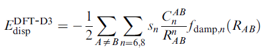
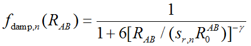
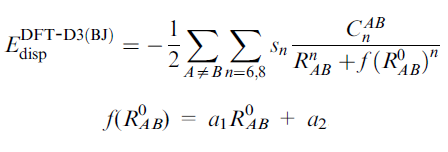

**注**：本文主要讲DFT-D3。笔者后来又写了文章专门介绍DFT-D4，见《DFT-D4色散校正的简介与使用》（<http://sobereva.com/464>）。

**DFT-D色散校正的使用**Use of DFT-D dispersion correction

文/Sobereva @[北京科音](http://www.keinsci.com)

First release: 2013-Nov-7  Last update: 2024-Apr-8 

## 1 前言

很多传统的交换-相关泛函，诸如B3LYP，由于相关势的长程行为不对，完全不能描述色散作用，而诸如常见的PBE、PW91对色散作用描述也极差。因此它们用于研究色散作用主导的问题结果差得一塌糊涂，比如物理吸附、长链烷烃之类的大分子构象、弱极性分子团簇等等。解决这些泛函对色散作用描述能力很差的最有效的方法就是引入经验的色散校正项。不同的人提出过不同的色散校正方法，如TS、XDM、VV10等，其中最成功、也是目前最为流行的是Grimme提出的DFT-D，有以下版本  
(1) JCC,25,1463(2004)：DFT-D1。已过时  
(2) JCC,27,1787(2006)：DFT-D2。已过时  
(3) JCP,132,154104(2010)：DFT-D3。比DFT-D2更严谨，整体精度更好，支持元素更多（支持从H到Pu），对几乎所有主流泛函都提供了参数，而且几乎不令计算耗时有任何增加，实现也很容易，如今几乎所有主流量化程序都支持DFT-D3  
(4) JCP,147,034112(2017)：DFT-D4。比DFT-D3的改进在于可以考虑实际电子结构对色散校正能的影响，但计算方式复杂得多，目前只有较少程序支持  
  
DFT-D对原本描述色散作用很差的泛函在色散作用描述上的改进立竿见影，例如笔者在J. Mol. Model., 19, 5387 (2013) <http://link.springer.com/article/10.1007%2Fs00894-013-2034-2>一文中比较了B3LYP加和不加DFT-D3校正时对氢气、氮气二聚体的计算结果，数据表明B3LYP根本没法得到二聚体稳定构型，或者说实际存在的构型下算得的二聚体相互作用能都是正的。而加上DFT-D3校正后，即B3LYP-D3，对这些二聚体的相互作用能计算结果则与金标准CCSD(T)起码定性一致。读者可以在自己的文章中引用这篇文章来说明色散校正的重要性。即便是静电主导的弱相互作用，诸如氢键、卤键，尽管传统泛函也能勉强凑合用，经过DFT-D校正后也能令计算精度显著提高。由于DFT-D同时也改进了中程的相关作用的描述，因此顺便对DFT泛函的热力学性质（尤其是牵扯过渡金属的）的计算精度也带来少许改进。可以说加上DFT-D校正有益无害。自从DFT-D流行起来后，曾经密度泛函对弱相互作用描述不好的老黄历彻底被颠覆，密度泛函摇身一变成了最为有效的计算弱相互作用的方法，特别针对是较大体系。同时大量相关的测试文章的涌现也让很多人清楚认识到了传统泛函对弱相互作用有多差。也应当了解的是，色散校正是一大类方法，除DFT-D之外还有很多其它的色散校正方法，诸如TS、XDM、VV10、vdW-DF、MBD等等，只不过DFT-D是最最流行、被支持最广泛而且也是最便宜的。其它的各种色散校正方法笔者在北京科音中级量子化学培训班（<http://www.keinsci.com/workshop/KBQC_content.html>）里会专门讲。  
  
原则上说，DFT-D3可以与任何交换相关泛函相结合。甚至对于弱相互作用描述已经很不错的双杂化泛函、M06-2X，加上DFT-D3后性能也能得到稍微的改进。但是也有一些出名的泛函本身就标配了特定形式的色散修正项，比如B97D、ωB97XD和B2PLYPD，在泛函定义的时候就专门给它们标配了DFT-D2形式的校正，显然就不能再给它们加上DFT-D3修正了。泛函结合DFT-D3校正后通常用“泛函名”+“-D3”来称呼，例如BLYP结合DFT-D3就叫BLYP-D3。  
  
关于DFT-D在笔者另外的帖子里有更多讨论，见《乱谈DFT-D》（<http://sobereva.com/83>）和《谈谈“计算时是否需要加DFT-D3色散校正？”》（<http://sobereva.com/413>）。本文的重点是介绍一下DFT-D校正能如何通过Grimme的DFT-D3程序来计算，以及DFT-D如何在Gaussian、ORCA和GAMESS-US中启用。但在此之前先把目前用得最多的DFT-D3的形式介绍一下。

在《使用Multiwfn图形化展现原子对色散能的贡献以及色散密度》（<http://sobereva.com/705>）一文中，还介绍了怎么基于DFT-D3色散校正，通过Multiwfn考察原子对色散能及其变化的贡献，对于讨论化学体系中的色散作用极其有用，非常建议一看。

## 2 DFT-D3的两种形式

DFT-D3实际上有两个版本，差异在于阻尼函数形式。阻尼函数用来调节色散校正在近程、中程距离时的行为，以避免double-counting问题（传统DFT泛函能够较好描述近距离的相关作用，如果近距离时校正能还较大的话就导致重复了）。DFT-D3原文当中用的是零阻尼(zero-damping)形式，这也是通常说的DFT-D3。而后来在JCC,32,1456(2011)中通过比较，发现使用物理意义更明确的Becke-Johnson阻尼(BJ-damping)可以让结果稍微更好点，对分子内色散作用的描述优势更显著些，这种校正形式通常被称为DFT-D3(BJ)。不过多数文章中在使用DFT-D3校正时并不做显著区分，表面写的是DFT-D3但实际上可能用的是DFT-D3(BJ)。  
  

### 2.1 零阻尼

DFT-D校正能加到原先泛函计算的体系能量上就是校正后的能量。基于零阻尼的DFT-D3校正能写为  
  

  
其中R_AB代表AB原子间的距离，上标n就代表了距离的n次方。C是原子间色散校正系数，依据一定规则进行计算（相关知识参考《使用Multiwfn计算原子的C6色散系数》<http://sobereva.com/709>）。s_n是刻度因子。零阻尼函数f的表达式为  

其中R0_AB是原子对的截断半径，定义为√(C8_AB / C6_AB)。sr,n是刻度因子，γ是预设常数。之所以叫零阻尼，是因为随原子间距离R_AB减小阻尼函数逐渐衰减为0，使得DFT-D3校正能在较近距离时精确为0。  
  
零阻尼形式对于每个泛函有4个可调参数，即s6、s8、sr,6、sr,8。实际上所有泛函的sr,8都是1。对于普通泛函，s6也为1。所以DFT-D3用于普通泛函时只需要拟合两个参数s8和sr,6即可。对于双杂化泛函，s6是一个小于1的值，也需要进行拟合来确定。  
  

### 2.2 BJ阻尼

基于BJ阻尼的DFT-D校正能的形式为  

对于每个泛函有四个参数，即a1、a2、s6、s8。依然是对于普通泛函s6为1，故一般只需要拟合三个参数，而双杂化泛函还得拟合它。  
  
BJ阻尼使得中、近程距离的色散校正能虽很小，却并不接近于0。对于HF也可以用DFT-D3校正（HF对色散作用能完全无力），但只能用BJ而不能用零阻尼形式。对于M05/06/08系列明尼苏达系列泛函，如M06-2X，只能用零阻尼而不能用BJ阻尼，因为这类泛函已经表现出了中程相关，所以要用零阻尼形式来避免因引入中程校正而导致的double-counting。之后发展的某些明尼苏达系列泛函如MN15倒是也能结合BJ阻尼。  
  
上面的式子表明DFT-D3校正是基于原子对的，每一对原子对校正能有各自的贡献，但实际上的色散作用不是精确的对可加和的，还有多体项。于是DFT-D3还包含了三体项对校正能贡献。但由于对结果影响很小，所以考虑DFT-D3校正时一般不计算三体项，不过一些研究表明对于很大体系，考虑三体项还是会有不可忽略的改进的。  
  
由于DFT-D的形式简单，一阶和二阶解析导数很容易得到，所以原先DFT能做到几阶解析导数在校正后依然能做到几阶。而三体项，目前只有一阶解析导数。  
  

## 3 DFT-D3程序的使用

Grimme的DFT-D3程序是用来计算DFT-D色散校正能的，程序一直在更新，下载地址见<https://www.chemie.uni-bonn.de/grimme/de/software/dft-d3/get_dft-d3>。用户只需要提供原子坐标，程序就能立刻算出校正能以及校正能的导数。对于常用的泛函，DFT-D3的参数基本上都已经齐全。不过由于目前主流量子化学程序都已经直接支持了DFT-D3，所以Grimme这个程序一般没必要单独去用。  
  
编译过程很简单。对于Linux系统，下载后解压，进入目录输入make命令即得到了dftd3可执行程序，默认调用的是ifort来编译。对于Windows系统，假设使用的是Intel visual fortran，编译方式是新建项目，然后把压缩包内的.f文件以及param文件都加入项目然后编译即可。笔者编译好的Linux 64bit版和Windows版的DFT-D3程序都可以在这里下载：[/usr/uploads/file/20150609/20150609203011_54761.rar](http://sobereva.com/usr/uploads/file/20150609/20150609203011_54761.rar)。压缩包内带有.exe后缀的是windows版，不带后缀的是Linux版。  
  
程序压缩包里包含手册，对运行参数介绍得很清楚。在Linux下，下面命令计算的是DFT-D3(BJ)对test.xyz里的体系的针对BLYP泛函的色散校正能  
./dftd3 test.xyz -func b-lyp -bj  
如果你用的是Windows，需要进入命令行模式（cmd或powershell）然后同样以如上方式通过命令行指令来使用DFT-D3。因为DFT-D3程序没有交互式的界面，因此无法靠双击dftd3.exe图标来运行，必须通过命令行方式来运行！  
  
程序会输出一堆参数，最后给出校正能  
Edisp /kcal,au:    -3.3486 -0.00533628  
以a.u.为单位的色散校正能会同时写入到当前目录下的.EDISP文件中。  
  
例子中的test.xyz是体系的xyz格式的坐标：  
6  
ltwd  
 C                  0.00000000    0.42021400    0.00000000  
 H                 -0.45599500    1.43114200    0.00000000  
 O                  1.20173900    0.23372100    0.00000000  
 N                 -0.94137600   -0.56316900    0.00000000  
 H                 -0.64194700   -1.52713700    0.00000000  
 H                 -1.92633700   -0.35287300    0.00000000  
第一行是原子数，第二行是标题，之后就是原子名和以埃为单位的坐标。  
  
-func后面接的是所用的泛函，必须按照turbomole的泛函写法来写，诸如b3-lyp、pbe0、pbe、b2-plyp、cam-b3lyp、b2gp-plyp、m062x。如果不知道怎么写，可以到dftd3.f源文件里去搜b3-lyp，然后就能看到各种泛函的写法以及相应的参数，比如会看到  
...  
case ("tpss0")  
     rs6 =0.3768  
     s18 =1.2576  
     rs18=4.5865  
case ("pbe0")  
     rs6 =0.4145  
     s18 =1.2177  
     rs18=4.8593  
...略  
  
-bj代表用BJ阻尼，-zero代表用零阻尼。若写-old代表用DFT-D2形式。  
  
DFT-D3程序默认不计算三体项，如果要计算的话就加上-abc。  
  
加上-grad的话程序还会计算各个原子的色散校正能的梯度并写入到当前目录下的dftd3_gradient文件中。  
  
加上-anal的话程序还会输出每个原子对对色散校正能的贡献。例如  
 analysis of pair-wise terms (in kcal/mol)  
pair  atoms         C6              C8            E6       E8       Edisp  
   1   2    6  1    0.889542D+01    0.166327D+03  -0.1088  -0.1480  -0.25679  
   1   3    6  8    0.177185D+02    0.428060D+03  -0.1695  -0.2748  -0.44422  
   1   4    6  7    0.198682D+02    0.501857D+03  -0.1813  -0.3033  -0.48467  
...略  
就说明比如1号和3号原子之间的作用对色散校正能的贡献是-0.44422 kcal/mol。  
  
用-anal的时候可以定义片段。方法是在当前目录下写一个名为fragment的文件，每行代表每个片段包含的原子，例如内容为  
2-4  
1,6  
这代表第一个片段包含2、3、4号原子，第二个片段包含1、6号原子。剩下的第5号原子就自动作为第三个片段。程序会输出  
 group #        atoms   
   1      2-   4   
   2      1   6   
   3      5   
  group i      j     Edisp  
        1 --   1   -0.74  
        2 --   1   -1.58  
        2 --   2   -0.25  
        3 --   1   -0.43  
        3 --   2   -0.35  
        3 --   3    0.00  
由此可见片段1内的3个原子彼此间色散校正能是-0.74 kcal/mol，1、2号片段之间色散校正能是-1.58 kcal/mol。片段3就一个原子，所以片段内的没有色散校正能。以上数值加和就是总的校正能。  
  
对于诸如B3LYP这样的泛函，由于完全表现不了色散作用，因此对于诸如B3LYP这样的泛函的DFT-D3校正能就可以近似视为是色散作用能。因此，利用DFT-D3程序我们可以直接计算出分子间色散作用能的大小。但注意这样计算的色散作用能和SAPT方法给出的色散项不同，详细讨论见《使用sobEDA和sobEDAw方法做非常准确、快速、方便、普适的能量分解分析》（<http://sobereva.com/685>）。此文介绍的又快又好的sobEDA和sobEDAw能量分解给出的色散部分就是基于DFT-D色散校正能得到的，但后者还做了额外考虑使得其色散项和SAPT给出的色散项能够有可比性。还有一种获得色散作用能的做法是使用Multiwfn (<http://sobereva.com/multiwfn>)做基于力场的能量分解，既可以给出色散作用能，还可以分解成原子对、任意方式定义的片段间的贡献，见《使用Multiwfn做基于分子力场的能量分解分析》（<http://sobereva.com/442>）。

下面介绍下怎么在几个常见的量子化学程序中直接用DFT-D校正。

## 4 在Gaussian中使用DFT-D校正

### 4.1 Gaussian03

在G03中完全不支持DFT-D。G03里计算弱相互作用体系比较令人为难，支持的泛函对弱相互作用都不好。相对而言最好的就是M05-2X，但只有G03后期版本才支持。

### 4.2 Gaussian09 A、B、C版

在G09 D.01版之前不支持DFT-D3，但是支持了一些标配DFT-D2校正的泛函，即B97D、ωB97XD、B2PLYPD，另外还支持了2008年提出的对弱相互作用很好的M06-2X。靠ωB97XD和M06-2X，基本上就足矣对付各种弱相互作用体系了，二者的性能在伯仲之间，后者略微占优。这两个泛函在G09里分别写为wB97XD和M062X。不过这两个泛函计算速度比起B3LYP这样传统的泛函要慢很多。若想精度更高可以用双杂化结合色散校正的泛函B2PLYPD。  
  
在使用B97D、ωB97XD和B2PLYPD计算很重的原子时可能会出现诸如这样的提示R6DR0: No vdW radius available for IA= xx，这就代表由于DFT-D2不含序号为xx的元素的参数而无法计算。解决办法只有升级到D.01及以后的版本改用参数更全的DFT-D3校正，或者用其它合适的泛函或后HF方法。  
  
虽然前面介绍了免费的DFT-D3程序，但是DFT-D3程序只能在给定结构上计算色散校正能和梯度，没法直接让DFT-D3校正在Gaussian进行优化的时候就体现出来，然而色散作用对弱相互作用体系构型影响却往往很大，所以不在优化时就表现色散校正的话没有意义。但实际上，如果不怕麻烦倒也是有办法让G09与DFT-D3程序直接相结合来进行优化的。在G09当中有个external关键词，可以在Route section中添加诸如external='./dftdopt.sh'，这样在优化过程中Gaussian就会试图通过调用外部脚本./dftdopt.sh来得到它传回来的当前坐标下的能量、受力（甚至Hessian矩阵）。而外部脚本自身也可以调用g09。因此，如果我们自行编写这个脚本，让这个脚本读取优化过程中传递出来的当前步的坐标，并调用另一个g09计算出此坐标下的能量和受力（用force关键词），然后再让脚本调用DFT-D3程序算出色散校正的梯度并加到刚才的受力上，就得到了包含DFT-D3色散校正的当前坐标下的受力，再将受力传回给G09的优化进程。这样就等于G09在优化时就带着DFT-D3校正的效果了。但是据我所知没有这样的现成的脚本，自己写的话需要一定水平（难者不会，会者不难），大家有兴趣的话可以参考post-G程序（<http://faculty1.ucmerced.edu/ejohnson29/2.cfm?pm=432&lvl=2&menuid=618>）里提供的一个脚本，此脚本的目的是让优化时能带着XDM校正的效果（XDM算是另一种色散校正形式，依赖于波函数，目前远不如DFT-D3普及）。还可以参考《将Gaussian与Grimme的xtb程序联用搜索过渡态、产生IRC、做振动分析》（<http://sobereva.com/421>）和《将Gaussian与ORCA联用搜索过渡态、产生IRC、做振动分析》（<http://sobereva.com/422>）文章当中的脚本对external关键词的利用。

### 4.3 Gaussian09 D.01版及之后

从G09 D.01开始直接支持DFT-D3。使用方法很简单，原先的泛函名字不用动，只要额外写上EmpiricalDispersion=GD2就做DFT-D2校正；写上EmpiricalDispersion=GD3就做零阻尼的DFT-D3校正；写上EmpiricalDispersion=GD3BJ就做DFT-D3(BJ)校正。例如# B3LYP/aug-cc-pVDZ EmpiricalDispersion=GD3BJ opt就代表让B3LYP结合DFT-D3(BJ)校正来进行几何优化，也即使用B3LYP-D3(BJ)方法进行优化。如果嫌写EmpiricalDispersion=GD3或GD3BJ太罗嗦，也可以简写为em=GD3或GD3BJ。  
  
启用了DFT-D校正后，若用了#P，在Gaussian计算时会看到这样的信息  
R6Disp:  Grimme-D3(BJ) Dispersion energy=       -0.0018363766 Hartrees.  
 Nuclear repulsion after empirical dispersion term =       41.9082499513 Hartrees.  
显然，Gaussian在计算时实际上是将DFT-D校正能先加到核互斥能里面了。最后输出的总能量就是DFT-D校正后的能量。  
  
对于G09 D.01及之后，以下含有DFT-D校正的泛函直接用写关键词就行了，可以不必用“原始泛函名”+“EmpiricalDispersion”的方式来调用  
B2PLYPD3、B97D3、mPW2PLYPD、B97D、wB97XD、B2PLYPD  
其中末尾是D3的结合的都是DFT-D3(BJ)，其余的结合的都是DFT-D2。  
  
从G09 D.01开始还支持了在JCTC,8,4989中提出的一种包含色散校正的泛函APF-D（Austin-Petersson-Frisch），并且这种泛函里的色散校正形式也可以像DFT-D一样通过EmpiricalDispersion=PFD加在其它泛函上。不过可靠性很难讲，不建议用。  
  
B3LYP-D3(BJ)是当前笔者很推荐的计算弱相互作用的泛函，精度好，可靠性高，速度也比M06-2X和wB97XD都快很多。不过论相互作用能计算的绝对精度，比M06-2X-D3(0)稍差一点。总的来说，在杂化泛函里，B3LYP-D3(BJ)的精度是名列前茅的，这点从Phys. Chem. Chem. Phys., 19, 32184 (2017)文章补充材料的表20可以体现。  
  
注意G09 D.01版D3(BJ)计算频率时色散校正的贡献是不完全准确的，因为忽略掉了依赖于r^-8的那项。对于力常数较大（较硬）的振动模式这个问题的影响可忽略，但对于力常数较小（较软）的振动模式就会造成一定误差，往往会导致虚频的出现（即便优化后已经准确处在极小点位置了）。但是零阻尼没有这个问题，所以G09 D.01的用户如果要算频率的话，还是在零阻尼下优化为宜。不过D3(BJ)的这个问题在G09 E.01版已经得到了修正。

从D.01版开始还支持了对PM6半经验方法加DFT-D3校正，直接写PM6D3即可。

### 4.4 关于在Gaussian09/16中自定义DFT-D3参数

-----  
**2020-Jul-1补充**：下文说的通过环境变量自定义DFT-D3参数的做法只适合Gaussian 16 B.01及之前，从G16 C.01开始需要通过IOp直接定义，具体来说，把以下IOp设为NNNNNNNN代表把相应参数设为NNNNNNNN/1000000  
IOp(3/174)：S6  
IOp(3/175)：S8  
IOp(3/176)：SR6  
IOp(3/177)：A1  
IOp(3/178)：A2  
例如  
用TPSSh-D3(BJ)：TPSSh em=GD3BJ IOp(3/174=1000000,3/175=2238200,3/177=452900,3/178=4655000)  
用MN15L-D3(0)：MN15L em=GD3 IOp(3/174=1000000,3/175=0,3/176=3338800)  
用MN15-D3(BJ)：MN15 em=GD3BJ IOp(3/174=1000000,3/175=786200,3/177=2097100,3/178=7592300)  
用BHandHLYP-D3(BJ)：BHandHLYP em=GD3BJ IOp(3/174=1000000,3/175=1035400,3/177=279300,3/178=4961500)  
用BHandHLYP-D3(0)：BHandHLYP em=GD3 IOp(3/174=1000000,3/175=1442000,3/176=1370000)

注意Gaussian做多步任务时，IOp设置仅对第一个任务生效。因此以这种方式定义D3参数做opt freq任务时，freq任务是接收不到IOp的，会导致freq和opt用的不是同一个方法而造成严重问题。因此此时opt和freq必须分别做。  
 -----

在G09/16中开着DFT-D3做计算前，如果已经通过环境变量定义了DFT-D3参数，那么计算时就会直接用自定义的DFT-D3参数。利用这点，一方面可以替换内置D3参数，另一方面，对于没有内置D3参数的泛函，我们可以通过这种方式使其也能支持D3校正。Gaussian里内置了哪些泛函的D3参数，数值是多少，在手册的DFT部分都可以看到。

对于DFT-D3(0)，如前所述有s6、s8、sr,6、sr,8四个参数，在Gaussian里只允许你自定义前三个，可通过GAUSS_DFTD3_S6、GAUSS_DFTD3_S8、GAUSS_DFTD3_SR6环境变量设置，而sr,8固定为1.0（要改只能改源码）。对于DFT-D3(BJ)，如前所述有s6、s8、a1、a2四个参数，可通过GAUSS_DFTD3_S6、GAUSS_DFTD3_S8、GAUSS_DFTD3_ABJ1、GAUSS_DFTD3_ABJ2环境变量设置。环境变量定义的数值除以1000000就是对应的D3参数数值。

例如，G16里支持MN15，但是至少对于G16（起码对于B.01来说），还没有内置DFT-D3参数，因此没法直接用MN15-D3。不过，好在在Grimme的GMTKN55数据库文章Phys. Chem. Chem. Phys., 19, 32184 (2017)的补充材料的Table S3里可以看到MN15-D3(BJ)的参数，为  
S6=1.0  
S8=0.7862  
a1=2.0971  
a2=7.5923  
因此，在计算之前，Linux系统的终端里输入以下内容（假设是Bash shell）  
export GAUSS_DFTD3_S6=1000000  
export GAUSS_DFTD3_S8=786200  
export GAUSS_DFTD3_ABJ1=2097100  
export GAUSS_DFTD3_ABJ2=7592300  
之后再用比如MN15/6-311+G(d,p) em=GD3BJ关键词，计算的结果就将对应于MN15-D3(BJ)/6-311+G(d,p)级别。在《Gaussian中非内置的理论方法和泛函的用法》（<http://sobereva.com/344>）一文中也提到过使用这种方式实现G09不支持的DSD-PBEP86-D3(BJ)的计算。

再比如，MN15L的D3参数在G16里（起码对于B.01而言）是没有内置的，好在GMTKN55文章的Table S4当中给了MN15L-D3(0)参数：  
S6=1.0  
sr,6=3.3388  
S8=0.0  
因此在使用诸如MN15L/def2TZVP em=GD3关键词计算之前应当用以下命令设置环境变量  
export GAUSS_DFTD3_S6=1000000  
export GAUSS_DFTD3_SR6=3338800  
export GAUSS_DFTD3_S8=0

常有人问怎么常用的TPSSh在Gaussian里加不了D3。实际上这个泛函的D3参数早就有了，只不过Gaussian一直没纳入进去而已（起码直到G16 C.01还不直接支持）。也是从GMTKN55文章Table S3里可以直接得到参数，使用诸如TPSSh/def2TZVP em=GD3BJ计算之前先运行以下命令即可  
export GAUSS_DFTD3_S6=1000000  
export GAUSS_DFTD3_S8=2238200  
export GAUSS_DFTD3_ABJ1=452900  
export GAUSS_DFTD3_ABJ2=4655000

wB97XD的作者后来提出个wB97X-D3，把原先用的DFT-D2校正改成了DFT-D3，算弱相互作用精度得到了一定提升，这在ORCA中支持。但可惜没法通过自定义D3参数的方式在Gaussian里面用，因为这个泛函很特殊，sr,8参数是1.094，而Gaussian中没法通过环境变量设这个参数（只允许为1.0）。

## 5 在ORCA中使用DFT-D校正

写上D3ZERO代表启用零阻尼DFT-D3校正，写上D3或者D3BJ启用DFT-D3(BJ)校正，例如!B3LYP TZVP d3代表B3LYP-D3(BJ)/TZVP水平。如果要计算三体校正项，同时再写上ABC即可。  
  
对于B2PLYP和mPW2PLYP，ORCA也提供了相应关键词用来直接调用其包含色散校正版本，即B2PLYP-D、B2PLYP-D3、mPW2PLYP-D、mPW2PLYP-D3。-D的对应结合DFT-D2，-D3的对应结合DFT-D3(BJ)。  
  
值得一提的是ORCA中的DFT-D模块实际上就是直接内嵌的Grimme的DFT-D3程序，所以输出信息和DFT-D3程序一模一样。而Gaussian在计算DFT-D校正的时候则是用的Gaussian自己的人写的代码。  
  
对于纯泛函，ORCA可以用RI-J密度拟合技术使得计算速度有巨大提升，见《大体系弱相互作用计算的解决之道》（<http://sobereva.com/214>）。因此在ORCA里，通过GGA泛函结合DFT-D3是计算柔性大体系构象、大体系之间弱相互作用的极为理想的选择，本人推荐BLYP-D3(BJ)，尽管精度比B3LYP-D3(BJ)稍逊色一点，但开RI后速度有显著优势。Phys. Chem. Chem. Phys., 19, 32184 (2017)文章的表6体现出，在计算弱相互作用方面，BLYP-D3(BJ)在纯泛函里几乎是最优秀的。  
  
ORCA从4.1版开始支持了DFT-D4，写上D4关键词即可使用，实际上在内部也是调用的Grimme提供的DFT-D4子程序。  
  
另外，ORCA也支持vdw-DF（van der Waals Density Functional）方式来考虑色散作用，通过VV10非局域形式的泛函得到色散校正能，可以结合一些GGA、杂化泛函。由于计算要涉及到双空间坐标积分所以计算速度慢，而且不支持解析梯度。一般来说比DFT-D3没什么好处，不必使用，但对于金属或其它电子密度变化较大的体系（氧化态、离子化态）可能比DFT-D3更合用，因为DFT-D3不能体现实际电子结构，而只依赖于坐标。不过由于已经有了能够体现实际电子结构的DFT-D4，vdW-DF的意存在义就大为降低了。  
   

## 6 在GAMESS-US中使用DFT-D校正

在$DFT部分写上DC=.T.就可以对DFTTYP所定义的泛函加上DFT-D3校正。IDCVER=1/2/3/4分别对应使用DFT-D1、DFT-D2、DFT-D3(0)和DFT-D3(BJ)，默认是3。实际上，只要定义了IDCVER，就会自动打开DC=.T.，所以只写IDCVER=4就够了，没必要再写DC=.T.。

默认不计算三体校正项，想计算的话就写DCABC=.T.。

对于B97D和ωB97XD，直接写DFTTYP=B97-D和DFTTYP=wB97X-D即可，不要设定DC、IDCVER。

和ORCA一样，GAMESS-US的DFT-D模块也是直接把Grimme的DFT-D3程序内嵌进去，输出信息和独立运行DFT-D3时一致。目前GAMESS-US在调用DFT-D的时候有一些明显bug，比如用了Bq原子，就会说找不到DFT-D参数而报错。
