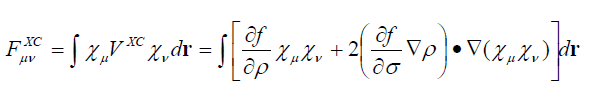
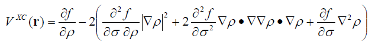

**DFT交换相关泛函库的使用方法**The use of DFT exchange-correlation functional libraries

文/Sobereva @[北京科音](http://www.keinsci.com/)  
 First release: 2013-Nov-10    Last update: 2019-Feb-10

## 1 前言

DFT大行其道的今天，写量子化学程序总是免不了要涉及DFT计算，而DFT的核心就是交换相关泛函。现有的交换相关泛函数目甚巨，每年都有新的泛函被提出。交换相关泛函形式往往比较复杂，要想求其导数更是件麻烦事（计算交换相关势时要用到），自行手写不仅费时间还容易出错。想在自己的程序里加入对各种各样的泛函的支持，最方便的方法就是直接用现成的交换相关泛函库。本文就介绍五个泛函库，并对其中两个的使用进行着重介绍，给出示例代码，但对于零碎的细节并不会一览无余的介绍，用户应在阅读本文后去阅读手册和相关网页。这些库都是免费的。

注意以下介绍的五个库对于杂化泛函都只能产生纯泛函的部分。也就是说，要想做杂化泛函计算，HF交换项部分得自己想办法计算，这要涉及到双电子积分，这些库是没法给出的。双电子积分是量化中最复杂的积分，图省事的话可以考虑用调用免费、现成的电子积分库libint来实现（<http://sourceforge.net/p/libint/home>），ORCA、PSI、CP2K也都用的是这个库。至于双杂化泛函，那还得自己整MP2的代码。

## 2 Density functional repository库

用这个库之前建议阅读一下CPL,199,557，这篇文章涉及到求解kohn-Sham方程的一些细节，特别是KS矩阵的交换相关部分。阅读这篇文章有助于了解这个库的设计思想。

这个库的网址是<ftp://ftp.dl.ac.uk/qcg/dft_library/index.html>。这是个比较老的库，到2006年就不更新了。支持的泛函不算很多，是LDA/GGA/hybrid_GGA级别的，meta-GGA的都没有。这个库完全使用Fortran77写的，一个优点是每个泛函的代码都是独立的。比如说自己的程序只想用PW91，那么就把PW91的代码从相应页面里拷贝出来插到自己的程序里并调用即可。

这个库的网址里还给出了每种泛函的定义以及计算原子时的参考数据，可以用来检验自己的代码算得对不对。实际上没必要用它的参考数据，直接和Gaussian的结果对比一下就行了，详见本文附录A。

这个库的子程序命名规则比较明确，例如uks_x_pbe，x就代表这个子程序用来计算开壳层形式的PBE交换泛函。计算相关部分就是c，如果是交换相关合在一起就是xc。闭壳层形式的子程序和开壳层是不同的，把uks换为rks即可。例如rks_xc_b97就是用来计算闭壳层形式下B97交换相关泛函。为了免得大家自己一个个去从网页上拷贝代码，笔者直接把这个库里常用的泛函的代码都合并在了同一文件DFTxclib.F里，可以从这里下载：[/usr/uploads/file/20150609/20150609211428_67937.rar](http://sobereva.com/usr/uploads/file/20150609/20150609211428_67937.rar)。其中包括这些子程序  
uks_x_lda  
uks_x_b88  
uks_x_pbe  
uks_x_pw91  
uks_c_vwn5  
uks_c_p86  
uks_c_lyp  
uks_c_pw91  
uks_c_pbe  
uks_xc_b97  
uks_xc_hcth407  
相应的rks的版本也在DFTxclib.F这个文件里。

值得一提的是这个库的代码并不是手写的，而是通过Knowles等人的dfauto程序通过计算机自动生成的。因此查看这个库里的代码，会发现很不符合人类的逻辑，代码很长，净是一大堆数值和搞不懂的变量名。之所以作者不手写而靠计算机自动生成，原因是这个库不仅产生泛函的数值，还产生泛函对电子密度和对sigma（见后文）的导数，以及混合导数，对于开壳层又分为两种自旋，情况会更为复杂。如果对各种泛函各个导数都一个一个地手推公式会非常困难，不仅很难保证不出错，代码写起来也极其劳神。关于dfauto和Maple的介绍见本文附录B。

这个库的子程序的调用方式都是标准、统一的，可参见<ftp://ftp.dl.ac.uk/qcg/dft_library/design.html#calling_convention>里的说明。对于闭壳层形式，需要提供的信息有  
rhoa1：总密度  
sigmaaa1：总密度梯度模的平方，称为σ，也即|▽ρ|^2=▽ρ·▽ρ  
返回的信息包括  
zk：泛函的数值。设交换相关能写为E_xc=∫f(ρ(r),σ(r))dr，zk就是指f的值  
vrhoa：泛函对总密度的一阶导数，即df/dρ（d代表偏导，后同）  
vsigmaaa：泛函对σ的一阶导数，即df/dσ  
v2rhoa2：泛函对总密度的二阶导数  
v2rhoasigmaaa：泛函同时对总密度的一阶导数和对σ的一阶导数  
v2sigmaaa2：泛函对σ的二阶导数

下面是个这个库里的典型的子程序的开头部分  
      subroutine rks_x_pbe  
      & (ideriv,npt,rhoa1,sigmaaa1,  
      &  zk,vrhoa,vsigmaaa,  
      &  v2rhoa2,v2rhoasigmaaa,v2sigmaaa2)  
 ...略  
       implicit real*8 (a-h,o-z)  
       integer ideriv,npt  
       real*8 rhoa1(npt)  
       real*8 sigmaaa1(npt)  
       real*8 zk(npt),vrhoa(npt),vsigmaaa(npt)  
       real*8 v2rhoa2(npt),v2rhoasigmaaa(npt),v2sigmaaa2(npt)  
 ...略  
ideriv=0时代表只计算泛函数值zk；=1代表把一阶导数vrhoa、vsigmaaa也计算出来；=2代表把二阶导数v2rhoa2、v2rhoasigmaaa、v2sigmaaa2也计算出来。  
npt代表输入多少个点的信息。从子程序定义可见，输入、输出的信息并不是标量，而是长度为npt的数组。也就是说，比如传进来5个点的密度值和σ值，程序就会计算并返回这5个点的泛函值和导数。之所以子程序设计成一次计算一批点的形式，是因为实际DFT计算时要用到格点积分方法，需要算数量很多的点，调用一次子程序就算完N个点比起调用N次每次只算一个点的效率明显要高。不过当然也可以让npt=1，一次就只计算一个点了。

特别要注意的是，这个库里的闭壳层形式的子程序算出来的导数不对。想得到正确结果，vsigmaaa和v2rhoasigmaaa都必须除以4，v2rhoa2必须除以2，v2sigmaaa2必须除以16。大家可以通过有限差分方法获得zk对密度和对σ的导数来验证这一点。

下面是一个例子，用户每次输入密度和σ，然后返回泛函值和导数  
program xctest  
 implicit real*8 (a-h,o-z)  
 real*8 rho(1),sigma(1),d1rho(1),d1sig(1),d2rho(1),d2rhosig(1),d2sig(1)  
 do while(.true.)  
  write(*,*) "Select functional:"  
  write(*,*) "0 LDA exchange functional"  
  write(*,*) "1 Becke 88 exchange functional"  
  write(*,*) "2 LYP correlation functional"  
  write(*,*) "3 HCTH407 exchange-correlation functional"  
  read(*,*) isel  
  write(*,*) "Input rho"  
  read(*,*) rho  
  write(*,*) "Input sigma"  
  read(*,*) sigma  
  if (isel==0) then  
   call rks_x_lda(2,1,rho,sigma,value,d1rho,d1sig,d2rho,d2rhosig,d2sig)  
  else if (isel==1) then  
   call rks_x_b88(2,1,rho,sigma,value,d1rho,d1sig,d2rho,d2rhosig,d2sig)  
  else if (isel==2) then  
   call rks_c_lyp(2,1,rho,sigma,value,d1rho,d1sig,d2rho,d2rhosig,d2sig)  
  else if (isel==3) then  
   call rks_xc_hcth407(2,1,rho,sigma,value,d1rho,d1sig,d2rho,d2rhosig,d2sig)  
  end if  
  write(*,"(' Value=',f17.12)") value  
  write(*,"(' d1rho=',f17.12,'  d1sig=',f17.12)") d1rho,d1sig/4D0  
  write(*,"(' d2rho=',f17.12,'  d2rhosig=',f17.12,'  d2sig=',f17.12,/)") d2rho/2D0,d2rhosig/4D0,d2sig/16D0  
 end do  
 end program  
对于LDA级别的泛函，由于不依赖于密度的梯度，所以输入σ的时候随便提供一个数就行了。输出的信息中也只有value、d1rho、d2rho有意义。  
像是B97和HCTH407都是交换和相关部分结合在一起的。如果想计算BLYP这样交换和相关部分彼此独立的泛函，就要分别调用rks_x_b88和rks_c_LYP并把结果加在一起。

有兴趣的话可以写一个基于.wfn或.fch文件计算整个体系的交换相关能的小程序，并不困难。笔者在《利用wfn文件计算电子密度的代码的编写方法》（<http://sobereva.com/182>）里面已经详细介绍了怎么读取.wfn文件获得波函数信息，并由此计算指定点的电子密度和梯度。在《密度泛函计算中的格点积分方法》（<http://sobereva.com/69>）中笔者介绍了如何通过Becke提出的多中心格点积分方法对特定函数在全空间进行积分。因此，把这两个帖子和本文内容结合在一起就可以写出代码了。也就是先载入波函数信息，在格点积分过程中对每一个点的位置计算电子密度和梯度，并调用泛函库的子程序求得这个点的泛函值，然后乘上积分权重进行累加，最终积分值便是交换相关能。

交换相关势就是交换相关能对密度的变分，即Vxc=δExc/δρ，计算它是求解KS方程中重要的一环。KS矩阵元中交换相关部分计算公式为  
  
其中χ代表基函数。这种矩阵元也是通过格点积分方式来计算的，其中要用到的f对ρ和对σ的导数，这在前面的例子中已经通过调用库里的子程序得到了，因此矩阵元可以比较容易地计算出来。

计算交换相关势在某个点的数值的计算公式为  
  
▽▽ρ就是电子密度的Hessian矩阵。可见计算某个点的交换相关势需要用到泛函的二阶导数（库里的子程序也都输出了）以及密度的二阶导数。Multiwfn程序（3.2.1版及以后。<http://sobereva.com/multiwfn>）的function.f90中DFTxcpot_close函数就是用来根据这个式子计算交换相关势的，有兴趣者可参阅相应代码。

上面只讨论了闭壳层形式。对于开壳层情况，alpha和beta部分不同，故要输入和返回的信息都明显增加，例如这是uks_x_pbe开头的定义  
      subroutine uks_x_pbe  
     & (ideriv,npt,rhoa1,rhob1,sigmaaa1,sigmabb1,sigmaab1,  
     &  zk,vrhoa,vrhob,vsigmaaa,vsigmabb,vsigmaab,  
     &  v2rhoa2,v2rhob2,v2rhoab,  
     &  v2rhoasigmaaa,v2rhoasigmaab,v2rhoasigmabb,  
     &  v2rhobsigmabb,v2rhobsigmaab,v2rhobsigmaaa,  
     &  v2sigmaaa2,v2sigmaaaab,v2sigmaaabb,  
     &  v2sigmaab2,v2sigmaabbb,v2sigmabb2)  
要输入的包括alpha密度ρ_α（rhoa1）、beta密度ρ_β（rhob1）、▽ρ_α·▽ρ_α（sigmaaa1）、▽ρ_β·▽ρ_β（sigmabb1）、▽ρ_α·▽ρ_β（sigmaab1）。由于输入的变量就有5个，所以输出的一阶导数、二阶导数和混合导数数量巨多，这里就不一一说明了，每一项的含义见<ftp://ftp.dl.ac.uk/qcg/dft_library/design.html#calling_convention>。开壳层形式的子程序产生的导数没有bug，可以直接用，不需要像闭壳层的情况那样还得除以特定的因子来修正。

## 3 Libxc库

Libxc库的网址是<http://www.tddft.org/programs/octopus/wiki/index.php/Libxc>，介绍这个库的文章见Comput. Phys. Commun. 183, 2272 (2012)。

这个泛函库一直在不断维护中，力图将所有已被提出的泛函全都支持，包括近几年大量提出的meta级别的泛函（依赖于动能密度或电子密度的拉普拉斯值），另外还支持大量动能泛函。目前这个库支持的泛函约200种。这个库已经被很多程序所使用，很多都是第一性原理的程序，包括Octopus，Abinit、CP2K、BigDFT、GAPW、Atomistix ToolKit、AtomPAW等。实际上这个库的前身是Octopus程序里面的计算泛函的部分，后来才独立出来成为单独的库。

这个库是由C语言编写的，但也带有Fortran的接口。虽然这个库支持的泛函数量极多，而且也能产生各种一阶、二阶导数，但是代码并不是机器自动生成的，而是完全靠手写的，主要是开发者嫌自动生成的代码太冗长、效率低、不易读。

这个库有一点我个人不太喜欢的地方是数据结构比较复杂，代码间相互依赖，没法像Density functional repository那样想用哪个泛函就把哪个泛函的代码拷出来放到自己的程序里直接调用就行，而必须先得把这个库的代码编译成库文件然后才能在自己的程序中调用，而且使用时还得做初始化之类的麻烦事。

Libxc的编译方式是下载后并解压，进入目录后运行  
autoreconf -i  
./configure FC=ifort  
make  
make install  
然后.lib库文件和.h头文件，以及Fortran用的.mod文件就会被安装到/opt/etsf下面的lib和include目录中。./configure这一步也可以自己指定安装目录。

下面是个Fortran90调用libxc的例子，和上一节的例子的用途和结果完全一致，即自行输入密度和σ，选择泛函，然后程序给出泛函的数值和导数。比如此文件叫做xctset.f90，编译的时候就用ifort xctest.f90 -I/opt/etsf/include /opt/etsf/lib/libxc.a -o xctest  
program xctest  
 use xc_f90_types_m       //必须写  
 use xc_f90_lib_m       //必须写  
 implicit real*8 (a-h,o-z)  
 TYPE(xc_f90_pointer_t) :: xc_func,xc_info    //必须写，定义libxc用到的指针

do while(.true.)  
    write(*,*) "Input rho"  
    read(*,*) rho  
    write(*,*) "Input sigma"  
    read(*,*) sigma  
    write(*,*) "Select functional:"  
    write(*,*) "0 LDA exchange functional"  
    write(*,*) "1 Becke 88 exchange functional"  
    write(*,*) "2 LYP correlation functional"  
    write(*,*) "3 HCTH407 exchange-correlation functional"  
    read(*,*) isel  
    if (isel==0) ifunc=XC_LDA_X  
    if (isel==1) ifunc=XC_GGA_X_B88  
    if (isel==2) ifunc=XC_GGA_C_LYP  
    if (isel==3) ifunc=XC_GGA_XC_HCTH_407

   call xc_f90_func_init(xc_func,xc_info,ifunc,XC_UNPOLARIZED)  //初始化

   select case (xc_f90_info_family(xc_info))  
    case(XC_FAMILY_LDA)  
      call xc_f90_lda(xc_func,1,rho,value,d1rho,d2rho,d3rho)  
    case(XC_FAMILY_GGA, XC_FAMILY_HYB_GGA)  
 !      call xc_f90_gga_exc(xc_func,1,rho,sigma,value)  
 !      call xc_f90_gga_exc_vxc(xc_func,1,rho,sigma,value,d1rho,d1sig)  
       call xc_f90_gga(xc_func,1,rho,sigma,value,d1rho,d1sig,d2rho,d2rhosig,d2sig)  
    end select

   write(*,"(' value=',f17.12)") value*rho  
    write(*,"(' d1rho=',f17.12,'  d1sig=',f17.12)") d1rho,d1sig  
    write(*,"(' d2rho=',f17.12,'  d2rhosig=',f17.12,'  d2sig=',f17.12)") d2rho,d2rhosig,d2sig  
    if (ifunc==XC_LDA_X) write(*,"(' d3rho=',f17.12)") d3rho  
    call xc_f90_func_end(xc_func)  //清理  
    write(*,*)  
 end do  
 end program xctest

例子中诸如XC_LDA_X、XC_GGA_C_LYP这都是在module libxc_funcs_m里面定义的整型变量，打开libxc的src子目录下的libxc_funcs.f90（或xcfuncs.h）就能看到定义，例如  
  integer, parameter :: XC_GGA_XC_B97_GGA1   =  96  !  Becke 97 GGA-1                             
  integer, parameter :: XC_GGA_XC_HCTH_A     =  97  !  HCTH-A                                     
  integer, parameter :: XC_GGA_X_BPCCAC      =  98  !  BPCCAC (GRAC for the energy)   
  integer, parameter :: XC_GGA_C_REVTCA      =  99  !  Tognetti, Cortona, Adamo (revised)   
  integer, parameter :: XC_GGA_C_TCA         = 100  !  Tognetti, Cortona, Adamo   
  integer, parameter :: XC_GGA_X_PBE         = 101  !  Perdew, Burke & Ernzerhof exchange      
因此例子中ifunc的值就是所选取的泛函在libxc当中的内部编号。

xc_f90_func_init子程序依据ifunc的值和选择的自旋形式，返回相应的xc_func和xc_info。例子中调用xc_f90_func_init时传入XC_UNPOLARIZED说明接下来计算泛函时是闭壳层形式的，如果用开壳层形式计算，就传入XC_POLARIZED。XC_UNPOLARIZED和XC_POLARIZED实际上是在module libxc_funcs_m里面定义的整型变量，对应的数值分别是1和2。

libxc在调用泛函的时候是根据类别来进行的，而不是由用户直接去调用相应的泛函的子程序。利用xc_info我们可以得到所选的泛函的一些信息，例子中将xc_info传入xc_f90_info_family函数返回的就是我们所选的泛函所属的类别编号，然后通过分支语句去调用相应类别的子程序。例子中XC_FAMILY_LDA、XC_FAMILY_GGA、XC_FAMILY_HYB_GGA都是module libxc_funcs_m里面定义的整型变量，数值分别为1、2、32。

如果所选的泛函是LDA类型的，就通过  
call xc_f90_lda(xc_func,1,rho,value,d1rho,d2rho,d3rho)  
形式调用，若是GGA或者杂化GGA级别，就通过  
call xc_f90_gga(xc_func,1,rho,sigma,value,d1rho,d1sig,d2rho,d2rhosig,d2sig)  
形式调用。可见不同类别的泛函的输入输出参数是不同的，但是相同类别的泛函的输入输出参数是一致的。调用对应类别的子程序，再给它们传入xc_func，就确切指定了到底要计算的是哪一个泛函的值。

libxc调用泛函时所需要输入的信息以及输出的信息和Density functional repository里的子程序一样。诸如GGA级别，就是输入密度、σ，然后返回泛函对密度、对σ以及对二者的混合导数。但对于LDA，libxc库还额外可以计算对密度的三阶导数。若计算时用的是开壳层形式，则也需要把alpha和beta的密度信息分别传入，详见libxc网页上的manual里的解释。libxc也可以同时计算很多点的值，但是上例每次只计算一个点，所以调用xc_f90_gga的时候第二个参数为1。

对于每类泛函其实libxc提供了不同形式的调用。例子中我们用xc_f90_gga算出了泛函值和一阶、二阶导数。如果只想获得泛函值，改用call xc_f90_gga_exc即可，显然比xc_f90_gga更省时。如果只需要泛函值和一阶导数，调用xc_f90_gga_exc_vxc就够了。

计算最后，要通过call xc_f90_func_end(xc_func)来进行清理工作。

特别注意的是libxc定义交换相关能的形式为E_xc=∫ρ*ε(ρ(r),σ(r))dr，给出的泛函值是ε项而非积分号里的整体，因此还需要再乘以ρ才和Density functional repository给出的泛函值一致。但libxc对泛函的导数的定义和Density functional repository则完全一样，数值能直接对应。

和上一节的例子相比，可见libxc在使用的时候还是略微繁琐的，架构有点复杂，笔者还是更喜欢Density functional repository的子程序的简单直接的调用方式。

## 4 MFM库（Minnesota Functional Module）

MFM库的网址为<http://comp.chem.umn.edu/mfm/index.html>，只支持明尼苏达系列泛函，随着这个泛函系列的不断发展这个库也在时不时更新，目前支持M05, M05-2X, M06-L, M06-HF, M06, M06-2X, M08-HX, M08-SO, M11, M11-L, MN12-L, MN12-SX, SOGGA, SOGGA11, SOGGA11-X, N12, N12-SX。

MFM库完由Fortran77编写，是手写的。输入的信息是alpha和beta电子的密度，它们的密度梯度和动能密度。这个库只能计算泛函值和对密度、σ和动能密度的一阶导数。

压缩包里面每种泛函对应一个.F文件，像Density functional repository库一样，每个泛函代码之间彼此独立，调用方便。由于这个库用处不大所以不再举例。

## 5 funclib库

funclib库下载地址为<http://www.theochem.kth.se/~pawsa/>，在JCC,28,2569(2007)有这个库的介绍。这个库后来没怎么更新，没有meta级别泛函。由于funclib支持的泛函远不及libxc全面，且同为C语言编写，所以funclib没什么优势和使用价值，这里不举例了。

funclib的代码和Density functional repository一样是通过计算机自动推导、生成的，但是用的是比maple历史更为悠久的著名计算机代数系统Maxima（<http://maxima.sourceforge.net>）。虽然Maxima的界面远不及maple，不过最大的好处是完全免费。

## 6 XCFun库

XCFun库的地址为<http://dftlibs.org/xcfun/>，由Ulf Ekstrom开发，Dalton、Dirac用的就是这个库。支持的泛函不多，主要优点是可以计算无限阶导数，另外也直接提供了计算LDA/GGA级别的交换相关势的函数。这个库是C++开发的，但是也提供了Fortran接口。这个库的介绍文档及其简陋，调用方式也不是一个泛函对应一个子程序，而和funclib稍微有点类似。

## 7 自写泛函代码

实际上自己手写泛函代码也不太困难，下面给出笔者自己写的计算指定点的B88和LYP泛函值的函数。其中gendensgradab是Multiwfn程序中用来计算给定位置的ρ_α、ρ_β、总密度ρ、|▽ρ_α|、|▽ρ_β|、|▽ρ|和▽ρ_α·▽ρ_β的子程序。  
!!!----- Integrand of Becke88 exchange functional  
 real*8 function xBecke88(x,y,z)  
 implicit real*8 (a-h,o-z)  
 real*8 x,y,z  
 call gendensgradab(x,y,z,adens,bdens,tdens,agrad,bgrad,tgrad,abgrad)  
 adens4d3=adens**(4D0/3D0)  
 bdens4d3=bdens**(4D0/3D0)  
 slatercoeff=-3D0/2D0*(3D0/4D0/pi)**(1D0/3D0)  
 slaterxa=slatercoeff*adens4d3  
 slaterxb=slatercoeff*bdens4d3  
 slaterx=slaterxa+slaterxb  
 redagrad=agrad/adens4d3  
 redbgrad=bgrad/bdens4d3  
 arshredagrad=log(redagrad+dsqrt(redagrad**2+1))  
 Beckexa=adens4d3*redagrad**2/(1+6*0.0042D0*redagrad*arshredagrad)  
 arshredbgrad=log(redbgrad+dsqrt(redbgrad**2+1))  
 Beckexb=bdens4d3*redbgrad**2/(1+6*0.0042D0*redbgrad*arshredbgrad)  
 Beckex=-0.0042D0*(Beckexa+Beckexb)  
 xBecke88=slaterx+Beckex  
 end function

!!!----- Integrand of LYP corelation functional  
 real*8 function cLYP(x,y,z)  
 implicit real*8 (a-h,o-z)  
 real*8 x,y,z  
 call gendensgradab(x,y,z,adens,bdens,tdens,agrad,bgrad,tgrad,abgrad)  
 parma=0.04918D0  
 parmb=0.132D0  
 parmc=0.2533D0  
 parmd=0.349D0  
 densn1d3=tdens**(-1D0/3D0)  
 parmw=exp(-parmc*densn1d3) / (1+parmd*densn1d3) * tdens**(-11D0/3D0)  
 parmdel=parmc*densn1d3+parmd*densn1d3/(1+parmd*densn1d3)  
 parmCf=3D0/10D0*(3*pi*pi)**(2D0/3D0)  
 tmp1=-parma*4D0/(1+parmd*densn1d3)*adens*bdens/tdens  
 tmp2a=2**(11D0/3D0)*parmCf*(adens**(8D0/3D0)+bdens**(8D0/3D0))  
 tmp2b=(47D0/18D0-7D0/18D0*parmdel)*tgrad**2  
 tmp2c=-(2.5D0-parmdel/18D0)*(agrad**2+bgrad**2)  
 tmp2d=-(parmdel-11D0)/9D0*(adens/tdens*agrad**2+bdens/tdens*bgrad**2)  
 tmp2=adens*bdens*(tmp2a+tmp2b+tmp2c+tmp2d)  
 tmp3=-2D0/3D0*tdens**2*tgrad**2+(2D0/3D0*tdens**2-adens**2)*bgrad**2+(2D0/3D0*tdens**2-bdens**2)*agrad**2  
 cLYP=tmp1-parma*parmb*parmw*(tmp2+tmp3)  
 end function

## 附录 A：

在Gaussian中，使用IOp(5/33=1)后程序就会在每一次迭代中输出DFT交换能和相关能，例如B3LYP下计算水的最后一轮迭代的输出：  
One-electron energy=-0.122935559078D+03（电子动能+核吸引势能）  
 1/2 <PG(P)>=          44.994396247255（由双电子积分模块得到的电子间作用能。即电子间经典库仑互斥能加上HF交换能）  
 Calling FoFDFT with Acc= 0.10D-09 ICntrl=  400011 IRadAn=       4.  
 Ex=          -7.116238484455 Ec=          -0.438937943288（DFT纯泛函的交换能和相关能。对于杂化泛函Ex不包含HF交换能）  
 1/2 <PG(P)> + E(ex) + E(corr)=          37.439219819512（即电子间总相互作用能）  
 E= -76.4089533399206     Delta-E=       -0.000000000005 Rises=F Damp=F  
总能量-76.4089533399206即是-0.122935559078D+03与37.439219819512之和再加上当前体系的核互斥能。

## 附录 B：

介绍dfauto程序的文章是Computer Physics Communications,136,310(2001)，实际上就是个bash脚本。用户通过Maple程序的语言格式写好泛函的定义，dfauto在读取后就可以自动调用当前系统中安装的Maple程序产生计算泛函数值以及各种导数的Fortran代码，导数的推导完全通过Maple的符号运算功能自动地实现。dfauto会控制Maple产生Fortran代码的过程并添油加醋，以使得代码的输入输出接口变得标准化。不过遗憾的是dfauto御用的是非常老的Maple 5，笔者尝试在Maple16上使用却通不过。

Maple的符号运算功能很强大而且能产生Fortran代码，在量化上很有用，这里就以LDA交换泛函作为例子简单说明一下。这个泛函形式极简单，就是常数乘以密度的4/3次方。在Maple中首先定义此泛函，即输入  
LDAx:=-cf*rho^(4/3):  
然后输入  
with(CodeGeneration):  
Fortran([value=LDAx,vrho=diff(LDAx,rho),v2rho=diff(LDAx,rho$2)]);  
程序就会输出计算此泛函数值以及计算它对密度的一阶和二阶导数的Fortran代码：  
value = -cf * rho ** (0.4D1 / 0.3D1)  
vrho = -0.4D1 / 0.3D1 * cf * rho ** (0.1D1 / 0.3D1)  
v2rho = -0.4D1 / 0.9D1 * cf * rho ** (-0.2D1 / 0.3D1)  
其中vrho正是LDA交换势。
