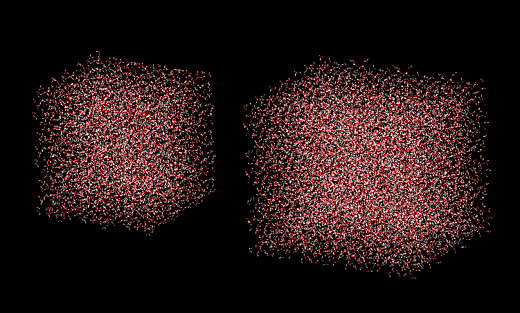
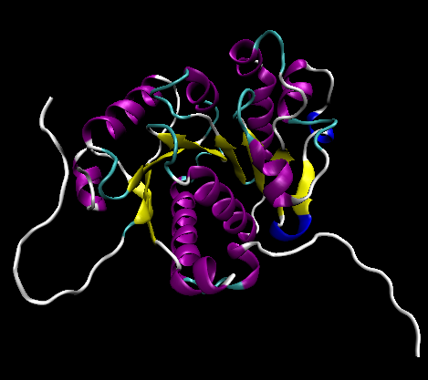
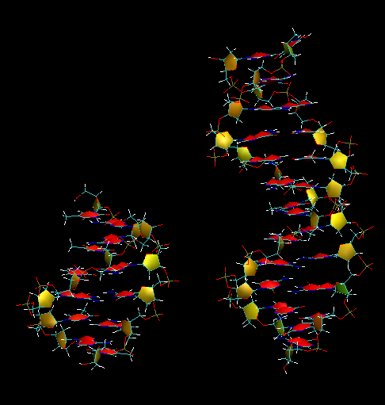
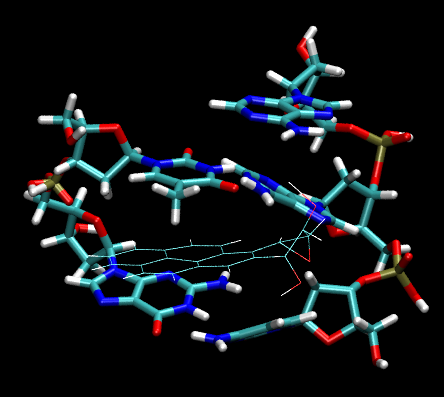
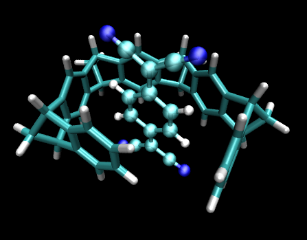
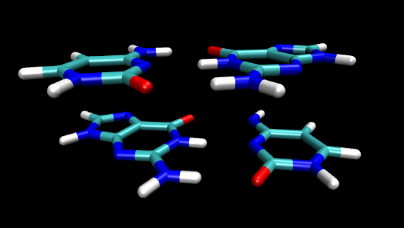
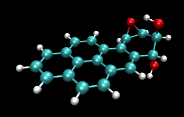

**后记：这篇文章成文时间很早，而理论方法和计算程序领域发展非常快，本文很多内容都已经过时了，已并非如今最佳选择。北京科音中级量子化学培训班（<http://www.keinsci.com/KBQC>）里面专门有一节“弱相互作用的计算与相关问题”，里面的内容与时俱进，介绍和推荐的方法都是最新的。另外，在“北京科音高级量子化学培训班”（<http://www.keinsci.com/KAQC>）里超级详细、系统地讲ORCA做各种计算的方法和各方面背景知识，学过一遍后本文涉及的所有ORCA支持的计算都可以轻松上手、做得游刃有余，欢迎参加。**

**大体系弱相互作用计算的解决之道**  
Solutions to the calculation of weak interactions in large systems

文/Sobereva @[北京科音](http://www.keinsci.com)  
First release: 2013-Dec-18   Last update: 2018-Jun-3

## 1 前言

以DFT-D为代表的一大类色散校正方法使得大体系弱相互作用的计算成为了可能，介绍和使用见《DFT-D色散校正的使用》（<http://sobereva.com/210>）。笔者曾在《乱谈DFT-D》（<http://sobereva.com/83>）一文的最后指出了不同计算能力下最推荐的计算方法，但这些推荐只是理论上的。而实际计算中，影响耗时的因素极多，除了理论上的计算量之外，还直接决定于计算程序的选择，以及数值上的加速方法。在本文中，笔者将从完全实用性的角度出发，讨论在普通计算条件下，如何选择最佳的计算级别准确研究大体系的弱相互作用问题。

想准确计算大体系弱相互作用，又不想盲目地傻拼计算量，必须需要“法宝”。下面一节将会简要介绍这样7个法宝，分别是：PM7、MOZYME、MOPAC程序、DFT-D、gCP、密度拟合近似&COSX，以及ORCA程序。然后在第3节通过综合运用这些法宝，给出对于不同数目原子的体系最适合使用的计算方法。在第4节，将会通过各种实例展示实际计算耗时并进行讨论。最后一节总结本文。

首先特别值得一提的是，靠最主流最常用的Gaussian这样的程序，即便用上了DFT-D，想准确处理大体系，那也只能一味地花费很高的代价傻算，就算降低到6-31+G**这样对于弱相互作用计算低得不能再低的基组，若无对称性（大的弱相互作用体系基本都没有对称性）在普通计算条件下处理上百个原子的体系都挺困难，此时弱相互作用计算准确度也比较差。然而，如果改用ORCA的话，将会感觉ORCA简直开了挂，发现曾经建立在脑中的“计算精度-计算耗时”方面的经验被完全颠覆，仿佛打开了一扇通往新世界的大门！

## 2 七个法宝

### 2.1 PM7半经验方法

对于巨大的体系，DFT无论结合什么法子，是无论如何也处理不动的（当然，SCC-DFTB这样的半经验层面上的DFT是另外一回事）。如果用力场，准确度往往很有限，普适性差，而且经常缺乏合适的参数。半经验方法往往是唯一的选择，尽管其重要性已经很大程度上被人们忽视和遗忘。

传统的半经验方法，诸如主流的AM1、PM3，以及后来重新参数化而成的RM1和PM6，对于弱相互作用都比较差劲，就连氢键这样带有主要静电成份的弱相互作用尚不好，就更别提范德华作用了。自从色散校正在从头算、DFT领域流行开来后，人们纷纷把半经验方法也结合上色散以及其它分子间作用的校正项，使得半经验方法对弱相互作用的表现能力有了质的飞跃。包括AM1-D、PM3-D、OM1/2/3-D、PM6-DH1、PM6-DH2、PM6-DH2X、PM6-DH+、PM6-D3H4和PM7。其中2007年由McNamara和Hillier提出的AM1-D和PM3-D用的人比较少。2008年提出的OMx-D系列只有其作者Walter Thiel的MNDO2005程序才能算，这东西不公开给大家用（笔者鄙夷这种行为），所以自然也流行不起来，据说OM2-D的弱相互作用计算准确度能达到DFT-D的水准。2009年提出的PM6-DH1是在PM6基础上加上了色散、氢键校正项，后来很快被2010年提出的改进版PM6-DH2所取代。2011年的PM6-DH2X则是在PM6-DH2基础上又增加了对卤-氧和卤-氮型的卤键校正。2012年又提出了PM6-D3H4，除了氢键、色散校正项外还引入了Pauli互斥校正项，可能这是目前最好的基于PM6对弱相互作用进行校正的方法。前述几种修正PM6的方法都是Hobza等人提出的，2010年另一个人Korth也提出了一种PM6加上氢键和色散校正的形式，名为PM6-DH+，比PM6-DH2好，但未必比PM6-D3H4好，另外此方法还存在势能面在一些过程中表现得不平滑的问题。PM7是PM3、PM6和MOPAC的作者J.J.P. Stewart于2013年提出的最新的半经验方法，改进了其上一代PM6存在的一些缺陷，从统计数据上看热力学性质计算并没什么显著提高，但是这次在训练参数的过程中着重地考虑了弱相互作用体系，并且引入了弱相互作用的校正项，使得弱相互作用计算比起PM6有了长足进步。PM7由于比较新，目前来说和PM6-D3H4、PM6-DH+相比较谁对于弱相互作用更准确还不好说，但应该在伯仲之间。目前来说，PM7是整体上最好的半经验方法，巨大体系弱相互作用计算个人最推荐PM7。不过即便从统计数据上看，PM7以及各种修正PM6的方法在弱相互作用计算误差上都很小，和DFT-D系列相比还是有差距，可靠性差距更大，所以对于DFT-D能算得动的体系最好先用DFT-D，但是半经验方法可以作为初算，比如估计一下大致的作用能、初步优化一下结构，或者做动力学、构象搜索之类的很耗时的任务。

**2015-Jul-18补充**：根据DOI: 10.1021/acs.jctc.5b00296对大体系相互作用能的测试，PM7虽然计算复合物结构还不错，但计算相互作用能比PM6-D3H4和PM6-D3（PM6简单地加D3校正）差不少。另外，在《PM7、PM6-DH+半经验方法在优化碱基对儿时的失败》（<http://sobereva.com/217>）一文中笔者发现PM7在优化碱基对儿时会误把两个碱基优化成不在同一平面，而PM6-D3H4和PM6-D3都没有这个问题。由于PM6-D3H4和PM6-D3也已经在MOPAC中支持了，因此现在笔者建议用PM6-D3H4或PM6-D3而非PM7。

**2018-Jun-3补充**：相比于使用上述半经验方法，Grimme提出的GFN-xTB方法往往更为理想，稳健性更强，普适性更好，十分推荐使用。GFN-xTB类似于半经验版本的DFT，可以通过Grimme开发的免费的xtb程序实现。xtb程序使用容易，而且效率比MOPAC更高，而且并行效率好得多。申请地址见<https://www.chemie.uni-bonn.de/pctc/mulliken-center/software/xtb/xtb>。GFN-xTB和xtb程序在《盘点Grimme迄今对理论化学的贡献》（<http://sobereva.com/388>）中有更多提及。xtb的基本用法在此文里有介绍：《将Gaussian与Grimme的xtb程序联用搜索过渡态、产生IRC、做振动分析》（<http://sobereva.com/421>）。

### 2.2 MOZYME技术

MOZYME是J.J.P.Stewart提出的一种基于定域化轨道加快半经验计算的技术，具体细节在这里不谈，可以参阅其原文IJQC,58,133(1996)。不像许多基于定域化轨道的方法，也就是仅限于作者自己发paper晒晒数据而无法真正投入广泛应用，MOZYME是有巨大实用意义的，加速效果是极其显著的，这将在后面的测试中看到。而且MOZYME是个黑箱方法，并不需要用户额外去考虑什么。MOZYME的存在使得半经验能方法处理的体系尺度大了两个数量级以上，能达到几万个原子的体系。而且MOZYME不光能用于单点计算，还能用于几何优化、搜索过渡态、动力学等需要导数的场合，不过只能用于闭壳层基态。对于大体系弱相互作用问题，MOZYME技术引入的误差通常是很小的（起码对于体系的尺度而言）。但对于极少数电子结构无法通过Lewis式表现的体系，有可能SCF过程会收敛到激发态上而不正确，不过这个问题对于生物分子这类成键方式典型的体系肯定不会出现。MOPAC的后期的商业版本以及免费版本中从2009版开始都支持MOZYME。MOZYME也仅在MOPAC中实现，是MOPAC的一个重要亮点。

### 2.3 MOPAC

MOPAC是最著名的专门做半经验计算的程序。到7.0版本一直是开源免费的，在90年代MOPAC成为Fujitsu公司的商业软件。后来MOPAC的作者Stewart离开了Fujitsu自己成立了公司并发布了MOPAC2007，然后又出了MOPAC2009，最新的是MOPAC2012，它对学术用户是免费的但不开源。MOPAC2012只是一个大的版本号，具体版本号在不断频繁升级。最新版本下载地址见<http://openmopac.net>，windows版只有5兆多，license可以免费索取。MOPAC2012已经是个非常成熟稳定而且功能相当全面的程序，手册撰写也很详细，见<http://openmopac.net/manual/index.html>。最新版的MOPAC2012支持的能较好处理弱相互作用的方法包括PM6-DH2、PM6-DH2X、PM6-DH+、PM6-D3（PM6结合DFT-D3校正）、PM6-D3H4、PM6-D3H4X、PM7。虽然有很多量子化学程序都能做半经验计算，包括Gaussian在内，但是能用半经验方法做的任务类型远不及MOPAC（诸如周期性计算），而且对新的半经验方法的支持程度远不如MOPAC，诸如Gaussian中能用的最好的半经验方法只有PM6，尚不支持任何考虑弱相互作用校正的半经验方法。MOPAC的MOZYME技术更是其它程序所没有的。MOPAC2012中把PM7和MOZYME组合使用可谓是对付巨大弱相互作用体系的一个利器。

MOPAC2012的安装方法见《MOPAC2012安装方法》（<http://sobereva.com/262>）。

MOPAC2012的使用比较简单，典型的输入文件例子如下：  
PM7 CHARGE=-10 MOZYME  
molecule  
All coordinates are Cartesian  
 O       4.71271832 0   9.26971072 0  -7.55066164 0  
 C       4.13662696 0   9.48826045 0  -8.82968461 0  
 C       2.75025629 0   8.84701245 0  -8.99475234 0  
...（剩余的坐标）  
第一行输入的是关键词。这里用PM7，电荷为-10，并且启用MOZYME技术（默认不启用）。第二、三行是用户随意定义的文字。坐标部分单位默认为埃。XYZ坐标后面的0代表这个原子坐标不做优化，如果所有坐标后面都是0就代表这是个单点任务，如果有的坐标后面是1，就代表当前任务是优化，并且优化这些写1的坐标。如果写1SCF关键词则无论是否有的坐标后面是1，都只做单点计算。

在Windows下，将输入文件保存为.mop为后缀，然后双击之就开始运算，并在当前目录下得到.out输出文件和.arc档案文件（只记录关键性信息）。现有的MOPAC结果的可视化工具都不很好用，对于大体系的优化，往往想看优化任务的轨迹来考察优化任务是否合理，这可以用笔者开发的mopac2xyz工具（<http://sobereva.com/212>）结合VMD实现。

注意半经验方法给出的能量不是绝对能量，而是生成焓，所以数量级上和从头算程序给出的体系能量相差甚远。但是求相对能量时和平常一样。比如求分子间相互作用能，直接把复合物的生成焓与每个片段的生成焓相减即可。

### 2.4 DFT-D

DFT-D已经在上文提到的《DFT-D色散校正的使用》和《乱谈DFT-D》中反复介绍了，这里就不再提了。

### 2.5 gCP

gCP是提出DFT-D的Grimme在JCP,136,154101(2012)提出的一种很简易的获得BSSE校正能的方法。笔者当初觉得这个方法没什么意思，有点胡搞，但后来发现，gCP对于帮助几百个原子的大体系弱相互作用计算实在是有重要意义。这里先谈一下BSSE问题。

BSSE（基组重叠误差）问题在《谈谈BSSE校正与Gaussian对它的处理》（<http://sobereva.com/46>）当中有详细讨论。BSSE本质上由于基组不完备所引起，会导致弱相互作用计算结果显著不准（半经验、SAPT方式计算无BSSE问题）。很大程度上解决BSSE问题的方法一种是使用含有较多弥散函数的基组，或者至少是分裂价数较多的基组，例如4-zeta基组的BSSE就很小了，因为最外层基函数已经体现出了半弥散特征；另一种是使用Counterpoise (CP)方法进行校正。但这两种做法都使计算量剧增。另外弥散函数较多时还会导致SCF收敛困难，而使用CP时则没法获得解析梯度，使得几何优化耗时极高，而且CP通常只能解决分子间BSSE问题，分子内BSSE问题很难靠CP解决。

之所以不含弥散函数的小基组在计算弱相互作用上结果差，其实关键因素就在于BSSE。普遍提倡在计算弱相互作用时加上弥散函数，其实从实效上讲就是在于减轻BSSE。换句话说，对于分子间相互作用的计算，弥散函数起到的作用和CP实际上是相仿佛的。这点从JCP,134,084107(2011)的图4上体现得非常清楚，cc-pVDZ+CP和aug-cc-pVTZ的平均误差很相近。所以说，如果用CP来解决掉BSSE问题，那么对于分子间相互作用计算就不太需要弥散函数了（虽然再加上弥散的话结果还能再改善一点点）。

gCP的全称是geometrical counterpoise，这是基于原子坐标和预先拟合的参数进行简单经验校正来获得BSSE校正能的方法，校正函数十分简单，就像DFT-D校正一样不需要额外耗时。而且gCP可以直接解决分子内BSSE问题，因此比起CP还更有优势。不过gCP毕竟只是近似方法，它得到的BSSE校正能的准确度和直接做CP相比还是会有一定偏差的。gCP的参数一方面决定于基组，一方面决定于理论方法。gCP已经向6-31G*、def2-SVP、def2-TZVP这样主流的双、三zeta基组和极小基MINIS（scaled MINI极小基）等基组拟合了参数。理论方法只分为两种，HF和DFT，不同的泛函对应的gCP参数相差很小，所以gCP对各种泛函使用了统一的参数。

gCP的实际效果很明显。比如用def2-SVP这种不含弥散函数的双分裂价基组计算弱相互作用原本是不可能的，精度不可接受，然而加上gCP后弱相互作用计算结果就和参考标准def2-QZVP较为接近了。而def2-TZVP，已经比def2-SVP强不少，加上gCP后结果还能进一步改善，而且比起def2-SVP结合gCP时更接近def2-QZVP。

gCP可以结合DFT-D3校正一起使用，完全没有矛盾，例如都加到BLYP上可以构成BLYP-gCP-D3。注意有些人误以为DFT-D参数当中就已经把BSSE问题给等效解决了，实际上根本不是这么回事！DFT-D3在拟合参数的时候是在def2-QZVP下进行的，此基组虽然还留有一点点BSSE问题，但问题已经很小了，所以DFT-D3的参数几乎没有等效解决BSSE问题，而且DFT-D3的函数形式本身也没法像gCP这样解决BSSE问题。因此，DFT-D3用来解决传统泛函弱相互作用描述差，gCP解决基组层面上的问题，gCP和DFT-D3一起用就把理论和基组的问题都解决了，使得便宜方法+便宜基组下的弱相互作用计算精度依然很不错，很适合对付大体系。

HF以及不同DFT方法结合gCP和DFT-D3后弱相互作用计算精度各不相同。BLYP-gCP-D3不是最好但也挺不错，强烈推荐使用。B3LYP-gCP-D3比它没明显优势，而且计算量更大，不建议用。虽然M06-2X本身计算弱相互作用很不错，但是gCP和它结合效果并不好。令人意外的是，HF-gCP-D3结合MINIS极小基居然计算结果相当不错，估计是恰好误差比较好地抵消了。大抵是由于这个发现，Grimme在JCC,34,1672(2013)提出一个所谓的HF-3c方法，相当于HF-gCP-D3-SRB/MINIX，SRB是额外引入的解决短程基组不完备性的校正项，MINIX是一种较轻原子用极小基而较重原子用双分裂价基的专为HF-3c特制的基组。HF-3c结果不错，已经被ORCA支持。但是笔者比较鄙夷HF-3c方法，物理意义差，结果好主要是误差抵消得好，对于特殊情况没准很烂，不算很靠谱，而且HF比起纯泛函计算量大得多（特别是使用密度拟合近似时，见后文）。

gCP的计算程序可以从这里下载：<https://www.chemie.uni-bonn.de/pctc/mulliken-center/software/gcp/gcp>。  
编译方式：假设用的是ifort，就把Makefile里的# FC = ifort去掉注释，并把-static去掉，然后make即可。  
典型的运行方式比如：./gcp water.xyz -level dft/svp，瞬间即得到gCP校正能。water.xyz是体系结构的xyz文件，-level后面接理论方法和基组，这里即假设计算级别为DFT方法结合def2-SVP，详见手册。加上-grad参数可以输出校正能的梯度，加上-hess可以输出它的Hessian。

### 2.6 密度拟合近似和COSX

密度拟合近似(Density-fitting approximation)是一种数值上的近似技术，可以大大降低处理双电子积分上的计算消耗，同时引入的误差可以基本忽略不计。密度拟合近似下的双电子积分的表达式从形式上类似于（但不相同）插入了RI(Resolution-of-the-identity，即1=∑|m><m|)，所以密度拟合近似在一些文献和程序中被称为RI近似。

密度拟合近似的关键是把原先的基函数φ（也叫轨道基函数）的乘积通过辅助基函数χ的线性组合来近似表达，即  
φ_p*φ_q≈∑[k]c_pq,k*χ_k  
组合系数c是通过拟合得到的，这是密度拟合近似名字的由来。注意这并非是对于电子密度来拟合，而是对于广义的密度，即基函数的乘积来拟合。拟合方式的方法很多，一般用的是通过最小化库仑积分误差来实现，即最小化这个双电子积分  
(ρ_pq-ρ'_pq|1/r12|ρ_pq-ρ'_pq)，其中ρ_pq=φ_p*φ_q是精确的乘积，ρ'_pq=∑[k]c_pq,k*χ_k代表拟合的乘积。

采用上面这种拟合方式时，(pq|1/r12|rs)这样的双电子-四指标积分就被直接转化为了通过(pq|1/r12|k)这种双电子-三指标的积分的组合来表达，积分本身的计算因此更简单了。对于HF、DFT中的库仑部分的计算，这种技术也避免了储存和处理四指标积分，而只需要储存和处理双、三指标的数据，故在构建HF/KS算符的过程上也省了大量时间，细节可以参看ORCA3.0手册6.2.2.3节。尽管三指标积分->四指标积分变换过程本身需要一点时间，但这和密度拟合技术带来的利益相比是微不足道的。由于纯泛函（即非杂化泛函）不含HF交换部分，只含库仑部分(J)，因此密度拟合近似令纯泛函的计算速度有了质飞跃，快了一个数量级以上，而且储存空间消耗也大为降低，这被称为RI-J技术。RI-J技术已经广泛普及，诸如Gaussian、Turbmole、ORCA、Molpro、PSI、Q-Chem等主流程序都已经支持它。

密度拟合技术也可以用在加速HF交换部分(K)的计算，称为RI-K，但由于基于三指标积分构建K的过程比构建J麻烦、耗时得多（可参见PCCP,4,4285(2002)），所以带来的加速效果明显不如用在库仑部分那么大，RI-K也没有RI-J那么流行，像Gaussian就不支持。如果密度拟合既用在J也用在K上面，就叫做RI-JK。对于杂化泛函或HF，虽然RI-JK会带来显著的速度提升，但是计算速度远不及纯泛函结合RI-J。由于RI-K方式计算K的速度和占据轨道数目存在正比关系，所以所用基组越大，RI-K带来的加速就越显著。而对于大体系（占据轨道数很多）使用小基组的时候RI-K就起不到多少加速作用。

密度拟合技术的另一个重要的应用是加速MP2，这称为RI-MP2。MP2任务在微扰计算部分主要的时间都花在了双电子积分变换过程，其中最耗时的一步变换的复杂度是O(N_occ*N_AO^4)，其中N_occ是占据轨道数目，N_AO是基函数数目。而使用密度拟合近似后，最耗时的变换成为了O(N_occ^2*N_vir^2*N_aux)，其中N_aux是辅助基函数的数目，这比起原先O(N_occ*N_AO^4)计算量大大降低了，因为N_AO=N_occ+N_vir，N_aux虽然大于N_AO但还是在一个数量级上的。整个MP2的计算过程中，对于大基组来说，实际上往往多数时间不是花在了微扰计算上，而是花在了HF迭代过程上。为了整体计算更快，RI-MP2任务中可以再结合RI-JK来加速HF部分的计算。现在很流行的双杂化泛函是杂化泛函的SCF能量与基于相应DFT轨道的MP2能量的线性组合，也可以同样地同时用密度拟合技术加速DFT和微扰这两部分的计算。密度拟合技术在量子化学上还有很多重要应用，由于和本文主题无关这里就不再多提了。

在ORCA中有个RIJONX，也叫RIJDX，实际上这就是指对于杂化泛函/HF只用RI-J加速库仑部分，而交换部分照常计算。ONX的全称是HFX calculated with O(N)，其含义是HF交换部分由于随距离衰减得比较快，因而涉及较远距离时可以对积分进行屏蔽，对于大体系K的计算量是O(N)，即随着基函数增加计算量是线性增加的，这实际上是比较理想化的情况。对于基组较大的时候，光是中、小体系就已经算不动了，即便对于很大体系有线性标度意义也不大。

与RI-K不同的加快交换部分计算的近似方法是COSX，这是ORCA的头目Frank Neese在Chem. Phys.,356,98(2009)中提出的，也是ORCA的一个重要亮点。COSX属于半数值积分方法，它在计算K的时候又做解析积分又做基于数值格点的积分。相比RI-K，COSX擅长处理大体系，体系越大比RI-K的优势就愈明显。通常来说，COSX在小体系（约30个原子以下）没RI-K快，40左右个原子时二者速度相仿佛，100个原子时COSX的耗时就完全和RI-K不在一个境界了，几百个原子时那就只能用COSX才算得动了。COSX比RI-K的好处还在于COSX的内存消耗要小很多，另外对于开壳层体系RI-K的速度比闭壳层时耗时加倍，而COSX则没这个问题。一般大小的格点下COSX引入的误差和RI-K相仿佛，都很小而基本可以忽略。对于杂化泛函的计算本来HF杂化部分就引入得比较有限，因此RI-K和COSX带来的误差就更小了。若想进一步减小COSX的误差，只要增加积分格点的数目就可以（在ORCA里用Gridx设，比如用Gridx4甚至Gridx5），当然耗时也会相应增加。RI-K比COSX有一个好处是误差总为正，而COSX的误差时正时负，因此求相对能量时RI-K的误差抵消得可能会稍微比COSX好一点。COSX和RI-J结合使用分别加速交换和库仑部分就叫做RIJCOSX。对于小体系大基组计算一般建议用RIJK来加速，对于大体系则建议用RIJCOSX。对几十个原子的体系通常RIJK和RIJCOSX对绝对能量引入的误差明显小于1kcal/mol，如果是求相对能量，误差还能抵消掉不少。

密度拟合计算必须得有辅助基组(Auxiliary basis sets，也称密度拟合基组）才行。辅助基组如同一般意义上的基组，它定义了每种元素原子所携带的辅助基函数的数目和特征。一般用的辅助基组用的都是普通的原子中心的高斯函数，既包含非收缩的也包含收缩的，所以和一般的基组在形式上无异。显然如果辅助基组是完备集，那么密度拟合近似就不再是近似，而是完全精确的了，当然这不可能做到。实际所用的辅助基组的尺寸必然是有限的。既不能太小，太小了没法较准确还原出轨道基函数的乘积，结果不准确；而太大的话计算量又太高。所以实际所用的密度拟合基组必须大小合适，并且最好是专门为特定基组优化过的。Ahlrichs系列基组和Dunning相关一致性基组以及其它个别基组都专门有人优化出了匹配的辅助基组。这些辅助基组根据用处主要分为三类，一种是带有/J后缀的(Coulomb fitting)，专门用于RI-J或者RIJCOSX；一种是/JK后缀的(Coulomb+Exchange fitting)，专门用于RI-JK；一种是/C后缀的(Correlation fitting)，专门用于RI-MP2。例如，def2-TZVPP就有def2-TZVPP/J、def2-TZVPP/JK和def2-TZVPP/C。/J、/JK和/C型辅助基组在优化GTF指数和确定收缩方式时的目标分别是令密度拟合近似在体系的库仑能、交换能和MP2相关能上引入的误差尽量小。无论是哪类密度拟合基组，其尺寸都要比标配的轨道基组要大，并且含有更高角动量函数。对于同一种轨道基组，这三类密度拟合基组的大小关系总是/C > /JK > /J，这是因为较少数量的辅助基函数就能让库仑能的计算误差在较低水平，而若想不给相关能带来明显误差，就不得不用更多以及含有更高角动量的辅助基函数。高级别密度拟合基组可以用在低级别轨道基组上，而且比使用标配的密度拟合基组结果更好，例如cc-pVTZ/JK和cc-pVTZ/C都可以用于在cc-pVTZ上做RI-J，而且比结合cc-pVTZ/J时稍微好一点点。再比如6-31G**可以用cc-pVTZ/J做RI-J或RIJCOSX，虽然cc-pVTZ/J不是给6-31G**优化的，但因为cc-pVTZ比6-31G**大得多，所以它的标配的辅助基组用于6-31G**毫无问题，尽管有些浪费。有的时候我们会砍掉一些意义不大的高角动量函数来降低计算时间，比如def2-QZVPP(-g,-f)代表从重原子和氢原子上分别去掉最高角动量函数g和f，这时没有标配的辅助基组，但是我们可以放心地直接用def2-QZVPP/J、/JK、/C。反之，高级别轨道基组结合低级别的辅助基组，比如def2-TZVP用def2-SVP/J结果就会较差，或者用/J代替/JK辅助基组做RI-JK计算也会带来较明显的误差。对于没有标配辅助基组的情况（特别是对于Pople系列基组，目前都没有标配的），也有自动的方法可以生成辅助基组，而且结果也可靠，但这样得到的辅助基组比起专门优化的辅助基组要大不少，故计算明显更耗时，所以建议在使用密度拟合计算时还是应尽量用那些有合适的辅助基组的轨道基组，def2-系列基组的辅助基组很全，因此往往是首选。最后值得一提的是在ORCA程序中，对于后HF任务，可以同时用两类密度拟合基组，即在SCF过程中使用/J或/JK，而在相关部分计算中使用更大的/C来保证精度损失较小。

### 2.7 ORCA

要问哪个量子化学程序最有前景，答案一定是ORCA。ORCA从90年代后期开始开发，是个非常优秀，功能全面，代码效率很高，不断迅速发展完善的程序，而且还是免费的（不过不开源）。从基态到激发态，从单点到几何优化，从大体系DFT计算到小体系高精度耦合簇计算，以及NEVPT2、MRCI等多参考态计算全都做得挺好。溶剂模型、标量相对论计算、NMR计算等ORCA也都支持。而且ORCA还逐渐支持其它多数程序没有的功能，诸如密度矩阵重整化群(DMRG)、F12显式相关计算、DLPNO-CCSD（号称能把耦合簇计算用到上百个原子）。特别是ORCA充分利用了密度拟合技术，并且结合独家的COSX方法，计算速度比起普通量化程序有了惊人的飞跃，更是极大程度地颠覆了基于DFT的弱相互作用计算的格局。在RI-J的时候ORCA还默认使用RI-split-J方法进一步加快计算，这不影响精度，对大基组时加速效果明显。另外ORCA上手也比较容易，手册写得比较详细，有原理介绍和实例。想必如果ORCA有个gview水准的图形界面，并且再有个Exploring Chemistry With Electronic Structure这样的教程书的话，将会打开初学者市场，从而对量子化学研究领域产生将难以估量的影响，Gaussian的市场肯定会严重缩水，而像Q-Chem、Turbomole等其它收费程序的生存空间就更小了。ORCA遭人诟病的是不支持利用对称性来加速计算（但可以判断对称性），实际上这不算大问题，密度拟合技术已经使ORCA比很多程序开对称性时快得多了。而且特别是对于大体系弱相互作用的计算，体系一般都是没有对称性的，所以不支持对称性并不是问题。

ORCA和Grimme有紧密的合作，所以DFT-D3、gCP以及HF-3c等Grimme提出的与弱相互作用相关的方法全都直接被ORCA所支持。

ORCA的主页是<https://orcaforum.cec.mpg.de>。虽然在上面免费注册一下后就可以直接下载，但下载速度可能比较慢，因此我也传了一份到百度网盘上：<http://pan.baidu.com/s/1eQh9nai>，这是Windows和Linux版的Orca 3.0.2版可执行程序，包括手册，以及并行计算需要的OpenMPI。

ORCA解压后就能直接用，运行方式如orca Mio.txt > akiyama.out，这里假设orca目录已经纳入了系统的PATH环境变量。ORCA是以MPI方式并行的，如果要并行运行，先到<http://www.open-mpi.org>下载最新的OpenMPI并安装到系统上，然后输入文件里写上pal2、pal3...pal8就代表2核、3核...8核并行，然后带着绝对路径去调用orca即可（不需要mpirun之类），例如d:\study\orca301\orca Love_live.txt > niconiconi.out。如果要用更多核就得在输入文件里写成%pal nprocs x end，x是调用的核数，无上限。

ORCA的输入文件写起来比较容易，例如  
!BLYP D3 GCP(DFT/SVP) def2-SVP def2-SVP/J pal4 nopop  
%maxcore 1000  
* xyz 0 1  
 O                  4.71271832    9.26971072   -7.55066164  
 C                  4.13662696    9.48826045   -8.82968461  
...略  
 C                  2.75025629    8.84701245   -8.99475234  
 C                  7.66851269    1.97163671    1.43096468  
*  
!后面的关键词代表用BLYP计算，带DFT-D3校正以及DFT/SVP级别的gCP校正，轨道基组为def2-SVP，def2-SVP/J作为RI-J的辅助基组。对于纯泛函ORCA是默认开启RI-J的，所以不用写额外关键词开启它。nopop是避免计算完之后输出一大堆特别冗长一般又没用的布居分析数据（这类分析最好用Multiwfn程序）。maxcore设定每个核最大的内存使用量(MB)，实际使用量可能超过之，比如此例可能总共会用到5G多，所以maxcore别设得太大，否则一旦物理内存不够而调用虚拟内存的话速度将巨慢。xyz代表输入的是笛卡尔坐标，默认为埃。0 1代表净电荷为0，单重态。

再比如关键词一行写成这样  
!RI-PWPB95 D3 def2-QZVPP def2-QZVPP/JK def2-QZVPP/C RIJK grid4 tightscf nopop pal4  
就代表使用PWPB95双杂化泛函，SCF步骤用def2-QZVPP/JK辅助基组做RI-JK来加速，方法名字前写上了RI-说明在微扰计算时也使用密度拟合近似来加速，并且基于def2-QZVPP/C辅助基组。由于此例计算精度要求高，用了tightscf来设严收敛限。

**2018-Apr-30补充**：注意，从ORCA4.0开始，辅助基组定义方式相较于ORCA3.0有了极大的变化。上文的def2-SVP/J应改为def2/J，而def2-QZVPP/JK应改为def2/JK。下文提到的def2-QZVPP(-g,-f)基组在ORCA4.0中也没法直接用相应关键词使用了。

ORCA中交换相关泛函的积分格点包含七个级别，从grid1到grid7精度依次增加。ORCA默认在DFT的SCF过程中使用较低质量的积分格点(Grid2)，而在最后计算最终能量时才切换到较高质量格点(Grid4)计算交换相关能，这称为multigrid方法，使得计算量又小精度又有保证。然而SCF过程中使用较低格点质量还是会给结果带来可以察觉到的误差的。为了不因为积分格点带来的误差污染了双杂化泛函+def2-QZVPP这么高级别的计算水准带来的优秀结果，上例使用了grid4关键词来让SCF过程也使用较好质量的积分格点，此时在计算最终能量时程序会自动切换到更高的Grid5。对于一般泛函下的计算一般不需要特意指定格点精度和调整收敛限，用默认的就行了，但对于频率计算等任务建议总是加上grid4 tightscf。如果还想进一步提高格点精度（虽然已完全没有必要），可以写grid5，并且还可以通过写上%method FinalGrid 6 end来让最后一次计算时自动切换到更高grid6。

顺带一提，ORCA计算后会产生.gbw文件，包含基组、轨道等信息。通过自带的工具orca_2mkl xx -molden可以将xx.gbw转换为molden输入文件。特别强大的波函数分析工具Multiwfn（<http://sobereva.com/multiwfn>）可以载入它来做波函数分析，包括各种各样的弱相互作用的分析，如RDG分析、AIM分析、定量分子表面静电势分析等等，参见《Multiwfn波函数分析程序的意义、功能与用途》（<http://sobereva.com/184>）、《Multiwfn支持的弱相互作用的分析方法概览》（<http://sobereva.com/252>）。使用Multiwfn的主功能0还可以很方便地查看分子轨道图形，见《使用Multiwfn观看分子轨道》[（http://sobereva.com/269](http://sobereva.com/（http:/sobereva.com/269)）。

### 2.8 杂谈其它的加速方法

直接用从头算算不动的体系人们有时考虑用杂化方法，比如通过ONIOM技术将半经验、分子力学和从头算结合三者相互组合。ONIOM，或者更一般的QM/MM技术对于研究大体系确实很有用，但是对于大体系的弱相互作用计算，笔者认为这些方法没有太大用武之地，原因很多。原因之一是PM7、PM6-DH+等方法结合MOZYME技术已经能处理很大体系了，用于生物大分子都没问题，结果也不错，所以遇上从头算算不动的情况直接用半经验就行了，用不着把方法进行杂化。用了杂化方法，可能由此带来的误差都比半经验方法本身的误差要大很多。怎么去划分不同理论级别处理的区域也是件麻烦事。而且若是靠比如ONIOM结合从头算与半经验，Gaussian现在支持的半经验又没有对弱相互作用算得好的，低级别区域弱相互作用考虑得太差也不行。如果是从头算或半经验与MM混合到一起用，又要涉及指定力场参数的问题，往往在操作上搞得很麻烦。总而言之，ONIOM、QM/MM对于大体系弱相互作用的研究很难派上用场。

还有一种技巧是使用混合基组减小计算量，比如一个大分子和一个小分子结合要算结合能，只把结合的区域附近的原子用带弥散的大基组，这样做没有问题，实现也容易。不过一般倒也没必要用，因为如果使用下一节推荐的方法，哪怕是大体系，也能算得挺快挺准。

另一种处理大体系常用的做法就是把体系简化成模型，只把关键区域抠出来（比如蛋白质活性位点），把边缘原子用比如甲基给饱和上，其余原子要么忽略要么用背景电荷方式来表现出静电作用。这么做完全可以，虽然表面上没QM/MM严格，但是省事不少。不过如何简化还是需要一定计算化学经验和化学直觉的，简化得过度结果不准，简化不够则计算量还是太大。

还有很多线性标度的方法都能帮助处理大体系，MOZYME前面已经提过了，这里主要说的是从头算/DFT层面上的线性标度方法。这种方法非常多，原理也不同，大致思想要么是基于定域化轨道，要么是把体系分成片段依次计算再组合上。无数人在这方面做了几十年的研究，相关paper无数，没完没了地晒加速比，但始终没产生多少实际应用价值。关键的原因就是方法不够黑箱化，能应用或者适用的体系非常狭窄，比如只对直链体系加速效果好而碰上复杂点的结构就哑火，有的方法处理不了含有大共轭的体系，有的方法则只限于比如很理想化的蛋白体系，等等。总之从原文数据上来看结果甚好，但是实际应用中到处碰壁，操作起来甚是麻烦。没有流行起来的另一个重要原因是被主流程序支持不够，主流的量化程序大多都没支持那些作者自吹是线性标度的方法，很大程度上也是因为这些方法实用性、实际效果差，相对而言较好的也就是FMO (Fragment MO)方法，已在GAMESS-US里被充分支持。总之现阶段来看那些线性标度方法表面上显得对于研究大体系弱相互作用很有用处，但绝大多数都停留在理论层面上，实际上应用价值不大，除非自己已经把这方面理论和操作研究得炉火纯青了，能玩得得心应手。

ORCA从3.0加入的DLPNO-CCSD(T)技术值得一提。CCSD(T)众所周知耗时极高，且随着体系尺度的增加计算量飙升，二十多个以上原子的体系都几乎算不动。DLPNO-CCSD(T)基于局域相关思想，是前身LPNO-CCSD(T)的改进版，令无论多大体系的CCSD(T)计算都有线性标度的效果，号称目前已经能把CCSD(T)做到650个原子的蛋白，而且此方法基本是黑箱，不需要用户调什么参数，很有前景。理论上说DLPNO-CCSD(T)对于精确研究大体系弱相互作用很有用。不过本文并不涉及DLPNO-CCSD(T)，因为它比起ORCA做双杂化泛函耗时远远要高得多，而且为了让CCSD(T)充分发挥效果必须得用颇大的基组，更是给计算雪上加霜，而且DLPNO技术本来也会带来一些误差，所以从实效上讲远不如双杂化泛函合算。

## 3 不同尺度弱相互作用体系的最佳计算方法

基于上面介绍的7个法宝，对于不同尺度的体系的弱相互作用研究（能量计算而非几何优化）笔者推荐的计算方法如下，从大体系到小体系排序，共分为8个档。这些体系假定是以C、H、N、O为主的有机分子。第1项是用MOPAC2012来做计算，2~6项用ORCA来做计算，列出的就是在ORCA中实际要写的关键词。对于7、8，用什么程序来做都可以，由于这属于小体系范畴所以在本文中不做讨论，值得一提的是ORCA的CCSD(T)计算效率是很高的。

1 >500个原子：PM6-D3H4结合MOZYME  
2 >300个原子：BLYP D3 GCP(DFT/SVP) def2-SVP def2-SVP/J  
3 >150个原子：BLYP D3 GCP(DFT/TZ) def2-TZVP def2-TZVP/J  
4 >60个原子：BLYP D3 def2-QZVPP(-g,-f) def2-QZVPP/J  
5 >40个原子：RI-PWPB95 D3 RIJCOSX def2-QZVPP(-g,-f) def2-QZVPP/J def2-QZVPP/C grid4 tightSCF（/J可改用/JK以减小密度拟合的误差）  
6 二、三十个原子：RI-PWPB95 D3 RIJK def2-QZVPP def2-QZVPP/JK def2-QZVPP/C grid4 tightSCF  
7 十几个原子：CCSD(T)/jul-cc-pVTZ或may-cc-pVQZ  
8 <10个原子：CCSD(T)/CBS （aug-cc-pVTZ->QZ外推。想更精确再加上counterpoise校正，耗时将增加近2倍）

用上面这些计算方法计算相应尺度的体系，在目前主流的Intel 4核CPU的机子上，一般都是可以在几个小时内计算完毕的。这些计算方法的弱相互作用计算误差和对应的体系的尺寸是正相关的。体系越大，可以忍受的绝对误差当然也就越大。无论是上面所列的哪个计算级别，对相应尺度的体系来说弱相互作用精度都是足以令人满意的。

如果计算能力比较好，比如有16核机子，或者不怕花时间，比如一个体系算几天也无妨，那么所用的计算级别就可以提高一两个档。反之，如果打算计算大批量体系（比如用于分子筛选的目的），或者用于初步估算结果，或者用于几何优化等，那么就可以把计算水准降低两、三个档。另外笔者特别推荐使用PM7或PM6-DH+对几十个或更多原子数目的体系进行优化，虽然几十个原子的体系用DFT也照样能优化得动，但由于在半经验下优化速度极快，几乎不费时间就能得到较好的初始构型，再接着用DFT来优化可以让收敛快得多。

这些推荐的计算方法里有一些值得说明和讨论的地方，前文中尚未提及，将在下面说说。

第8个档当中用了基组外推技术以达到完备集，完全消除因有限基组而导致的计算误差，这在《谈谈能量的基组外推》（<http://sobereva.com/172>）当中有详细讨论。在第7个档当中用了月份基组，这种基组把aug-cc-pVnZ系列基组的对结果影响不大的高角动量弥散函数适当地除去，大大节约了计算量，这在《谈谈弥散函数和“月份”基组》（<http://sobereva.com/119>）当中有详细讨论。在第5、6个档当中用了PWPB95-D3，这几乎是对于弱相互作用计算最好的双杂化泛函，好于双杂化泛函中最流行的B2PLYP-D3。

结合DFT-D3校正后密度泛函方法对弱相互作用计算精度整体来说是：双杂化泛函>杂化泛函>GGA泛函，计算耗时也是这个顺序。之所以上面推荐的方法中直接从双杂化泛函(PWPB95)直接切换到GGA泛函(BLYP)，而没有经过普通杂化泛函的过渡，是因为双杂化泛函的计算量不比杂化泛函多多少，额外多出的微扰部分的计算耗时往往还少于杂化泛函在SCF迭代过程上的耗时。所以如果用得起杂化泛函的话还不如干脆就用双杂化泛函来得到更好的精度。而GGA泛函不需要计算HF交换部分，靠RI-J技术可以让GGA泛函的计算速度比杂化泛函（哪怕已经用了RI-JK或RIJCOSX来加速）高好几倍甚至甚至一个数量级，所以杂化/双杂化泛函难以对付的大体系可以靠GGA泛函轻松地对付。虽然杂化泛函众所周知对于一般问题诸如热力学量的计算比起GGA泛函强得多，但是对于弱相互作用的计算，结合DFT-D3后它们的性能差异其实很小，例如B3LYP-D3只是比BLYP-D3在定量上略有点儿优势而已，更不会有什么定性差异。所以从实际角度来看杂化泛函+D3的性价比不高，故没有纳入推荐。

def2系列基组是Ahlrichs等人在2005年提出的，是Turbomole程序的御用基组，def2-QZVPP是其中最大的，和cc-pVQZ在一个级别。def2-QZVPP相对于def2-QZVP只是对于某些元素把高角动量基函数数目稍微增加了一点而已，对于C、H、N、O没有区别。def2-QZVPP(-g,-f)是def2-QZVPP的高角动量阉割版，这在前面已经提到了，阉割导致的精度损失几乎可以忽略。之所以推荐的计算级别中使用的是def2-QZVPP(-g,-f)或def2-QZVPP却没有使用对于弱相互作用计算很常用的aug-cc-pVTZ，这是有几个重要原因的：  
(1)def2-QZVPP(-g,-f)本身只比aug-cc-pVTZ大一点点而已，但aug-cc-pVTZ目前没有/J而只有/JK和/C辅助基组，aug-cc-pVTZ/JK比起def2-QZVPP/J大很多。用aug-cc-pVTZ/JK当辅助基组做RI-J和RIJCOSX计算比起用def2-QZVPP/J更耗时，所以从实际耗时上aug-cc-pVTZ吃亏。  
(2)aug-cc-pVTZ的弥散函数容易引基函数线性依赖问题导致收敛困难。而def2-QZVPP/(-g,-f)的最外层基函数是半弥散的，既适合弱相互作用计算，也不至于带来收敛上的问题。  
(3)DFT-D3参数本身是在def2-QZVP下拟合的，用在def2-QZVPP/(-g,-f)上也可以说是完美的，而aug-cc-pVTZ虽然本身很适合弱相互作用的计算，但对于使用DFT-D3校正的情况比起def2-QZVPP/(-g,-f)是没有优势的。尽管aug-cc-pVTZ的弥散函数使得BSSE问题比def2-QZVPP更小，但后者的BSSE问题其实已经很小了，而且这一丁点问题已经被等效地吸进DFT-D3的参数里了。  
第(3)点讨论也表明没必要，也不应该在DFT-D3校正结合def2-QZVPP/(-g,-f)使用时使用Counterpoise校正处理BSSE问题，不光是此基组BSSE问题已经很小，没多少校正余地，还因为DFT-D3参数已经等效地考虑了此基组残余的这点BSSE问题，再去做Counterpoise校正反倒会引入误差。而且做这个校正还会多花几倍的时间。

虽然本文讨论的是弱相互作用计算，但是上面推荐的8种计算级别就算是对于一般类型问题的研究也是十分理想的。但是此时def2-QZVPP就没必要用了，建议降到def2-TZVPP来节省时间。

MP2和双杂化泛函的积分变换过程是很耗储存资源的，对于大体系，光是储存在内存往往不够，还需要在硬盘上大量读写数据。在ORCA里可以指定积分储存方式来降低储存消耗，以尽量减少甚至避免因硬盘的读写而拖慢速度。储存方式包括UCDOUBLE、CDOUBLE、UCFLOAT和CFLOAT四种。UC代表不压缩数据，C代表压缩。压不压缩不影响结果，压缩后可一定程度减少储存资源的使用量（减少得比较有限）。DOUBLE代表双精度方式储存积分，FLOAT代表单精度方式储存积分，比双精度所需储存资源减小了一倍。对于单点计算，单精度储存积分完全没有问题，对结果的带来的误差笔者发现在1E-8a.u.级别，比密度拟合近似带来的误差小得多得多。不过据说个别情况下用单精度储存时MP2梯度和弛豫的密度对个别体系有误。显然CFLOAT是最省内存的模式，而默认的UCDOUBLE是最耗内存的。对于小体系用默认的UCDOUBLE就行，对于大体系，如果储存资源紧张或者长时间狂读写硬盘，建议用CFLOAT（直接写上这个关键词就行），尽管压缩/解压过程会耗费计算量，但是由于降低了硬盘读写量，而硬盘I/O速度又是计算机的瓶颈，所以对于整个计算是有加速效果的。

通常认为6-31+G*是计算弱相互作用的底限基组，再低就没可信度了，像是M062X/6-31+G*这种组合通常来说是穷得不能再穷的弱相互作用计算级别。而使用ORCA的话，在下面将会看到原本这种级别算起来都吃力的情况都可以享受def2-QZVPP(-g,-f)。而更大的体系，也不必窘迫地纠结于如何在有限的计算能力下以最好的方式设定弥散函数，gCP优雅地摆脱了弱相互作用计算对弥散函数的依赖性。

**2018-Apr-30补充**：对于一百多个原子的情况，目前笔者最推荐的是Grimme在2018年提出的B97-3c方法，而不再推荐上文提到的BLYP-gCP-D3。B97-3c在ORCA中已经支持，它是修改版B97纯泛函与mTZVP基组、D3校正、SRB校正的组合。SRB (short-range basis)用于校正纯泛函高估键长的问题。mTZVP是def-TZVP的修改版，减少了氢的极化而增加了氧的极化，对Ar之后用的是def2-TZVP。B97-3c没有gCP校正项，因为此项的效果在参数化过程中已直接等效体现进去了。B97-3c的耗时高于前面提到的HF-3c，而精度好得多。不过由于纯泛函在ORCA中可以充分利用RIJ加速，因此对于大体系其实比HF-3c耗时高得很有限。

## 4 实例

这一节将通过多个实例展现不同计算级别下的耗时，体系由大到小。计算条件就是普通的家用机的条件，CPU为Intel i7-2630QM(4核，最高频率2.5G)，双通DDR3-1333 16GB内存。系统为Win7-64bit。ORCA为3.0.1版，Gaussian为09W A.02版，MOPAC2012为13.331W版。Gaussian计算时都用了SCF=conver=6关键词，因为G09默认的Tight收敛限过严，所以适当降低点以节省时间（依然足够精确）。计算时间统计的是实际总耗时而非CPU时间，若未注明都是开启了四核并行。计算任务都是算体系的单点能。

下面实例中如果测试了多个计算方法，则方法前面打星号的是笔者推荐的用于这个体系的计算级别。

### 4.1 水盒子

两个水盒子的结构如下

 

水盒子1：12426atoms  
PM7 MOZYME 4threads 14.4min，-282616.10434 KCAL/MOL，内存用了1.2GB  
水盒子2：25095atoms  
PM7 MOZYME 4threads 98.6min，-576587.48001 KCAL/MOL，内存用了4.5GB

可见即便是一两万个原子的体系，在普通计算条件下，利用MOPAC2012结合它特有的MOZYME技术也照样能应付得了。如果内存足够大，做到几万个原子的体系也是有可能的，完全能计算纳米级别体系的弱相互作用。

### 4.2 ETK蛋白，3944个原子

PM7 MOZYME 1/4threads 323.8/325.5s -16765.64836 KCAL/MOL，用了300MB内存  
可见对于几千个原子的普通大小的蛋白，用MOPAC2012来计算易如反掌。同时也看到在目前的MOPAC2012 13.331W版里，对于MOZYME计算，用单线程和4线程实际上速度基本没有差异。由于并行化目前还没带来什么效果，为了最大程度利用计算资源，如果你有n个核，可以同时算n个任务。MOPAC原本是不支持并行的，在撰写本文时MOPAC2012才刚刚支持并行不久，估计是程序现阶段还没把MOZYME的并行化搞好。

其它半经验方法的耗时  
PM6-DH+ MOZYME 4threads 349.6s -16405.40799 KCAL/MOL  
PM6 MOZYME 4threads 342s -14168.08555 KCAL/MOL  
PM3 MOZYME 4threads 330s -10619.64239 KCAL/MOL  
RM1 MOZYME 4threads 295s -13358.60313 KCAL/MOL  
AM1 MOZYME 4threads 271s -10033.36276 KCAL/MOL  
可见，不同半经验方法耗时大致都在一个水平上。从生成焓来看，PM6-DH+和PM7的结果很接近，然而AM1和PM3则大大低估了生成焓，在很大程度上和它们表现弱相互作用很差有关。而RM1和PM6的结果则介于AM1/PM3和PM7之间，在侧面上说明RM1、PM6对弱相互作用的表现能力可能在AM1/PM3和PM7之间。

### 4.3 DNA

这是个DNA片段，左图共380个原子，含6个碱基对儿；右图共754个原子，含12个碱基对儿

 

754个原子  
PM7 4threads 超过7小时计算尚未完成  
PM7 MOZYME 1/4threads 58.88/57.8s -1161.85336 KCAL/MOL  
可见MOZYME极其重要，不用MOZYME根本没法算。

389个原子  
PM7 1/4threads 56.2s/34.6s -2463.90001 KCAL/MOL  
PM7 MOZYME 4threads 10.9s -2463.88277 KCAL/MOL  
*BLYP D3 GCP(DFT/SVP) def2-SVP def2-SVP/J  124min  
这样几百个原子的体系在MOPAC中不用MOZYME终于也能算了，并且并行化终于对计算速度有提升，但是并行效率还是很低。开了MOZYME后计算时间能省好几倍。MOZYME带来的误差可见非常之小，仅有0.117kcal/mol，对于几百个原子的体系完全可以忽略不计。  
得益于RI-J技术，在ORCA中，BLYP在def-SVP基组（大小与6-31G**相仿佛）下也能容易地处理这样好几百个原子的大体系！并且结合DFT-D3和gCP校正，弱相互作用计算准确度很不错。

### 4.4 DNA小片段-小分子复合物，196个原子

PM7 MOZYME 4threads 2.5s  
*BLYP D3 GCP(DFT/TZ) def2-TZVP def2-TZVP/J   91.4min  
BLYP D3 GCP(DFT/SVP) def2-SVP def2-SVP/J   21.7min  
对这样的约200个原子的体系，半经验计算只需要一眨眼的功夫，做几何优化也非常容易。BLYP在def2-TZVP级别也能很容易地计算，仅花了一个半小时，虽然比起用def2-SVP长了几倍，但还是值得的。

### 4.5 包夹复合物，92个原子

这实际上是Grimme的S12L弱相互测试集（Chem.Eur.J.,18,9955(2012)）中的体系2a。

*BLYP D3 def2-QZVPP(-g,-f) def2-QZVPP/J  58.3min  
BLYP D3 def2-QZVPP def2-QZVPP/J  116min  
BLYP D3 GCP(DFT/TZ) def2-TZVP def2-TZVP/J  20.3min  
B3LYP D3 GCP(DFT/TZ) def2-TZVP def2-TZVP/J RIJCOSX 126min  
在BLYP下，可见def2-QZVPP(-g,-f)比def2-QZVPP节省了一半时间，阉割掉的高角动量函数对于DFT计算准确度的影响很小，所以建议用def2-QZVPP(-g,-f)结合BLYP。如果降低一个计算档次用TZVP，那就更容易了，看完一话新番（而且还跳OP、ED），正好就算完了。这么大的体系，靠ORCA在QZ级别下做计算仅用1个小时，而要让Gaussian算还不知道得算到猴年马月去。  
杂化泛函B3LYP，即便靠RIJCOSX加速，计算耗时还是比相同基组下的开了RI-J的纯泛函多了好几倍，TZ下都比BLYP在QZ下慢，所以划不来，何况在D3+gCP校正下B3LYP几乎并不比BLYP强。

### 4.6 C60

B3LYP def2-TZVP(-f) def2-TZVP/JK RIJK 159.8min 11cyc -2285.47162975a.u.  
*B3LYP def2-TZVP(-f) def2-TZVP/J RIJCOSX 47.6min 10cyc -2285.47245742a.u.  
此例主要展示一下RIJCOSX和RI-JK的差异。可见对于这种大小的体系，RIJCOSX的计算速度已经完胜RI-JK。二者间能量差有0.00083（0.52kcal/mol），谁更接近准确值不好说，不过肯定都差得不大。

### 4.7 GCGC四碱基堆叠，57个原子

RI-PWPB95 D3 RIJCOSX def2-QZVPP(-g,-f) def2-QZVPP/J def2-QZVPP/C grid4 tightSCF 134.1/405.8min  
斜杠前是SCF步骤的耗时，斜杠后是总耗时。将近60个原子的体系，睡一觉的功夫，在QZ级别下双杂化泛函计算就完成了，这个级别下的弱相互作用计算精度已经很完美了。

### 4.8 多环芳烃，37个原子

BLYP D3 def2-QZVPP(-g,-f) def2-QZVPP/J grid5 （同时写上%method FinalGrid 6 end） 10.0min -996.4176595a.u.  
BLYP D3 def2-QZVPP(-g,-f) def2-QZVPP/J grid4 8min  -996.4176418a.u. Error=0.01kcal/mol  
BLYP D3 def2-QZVPP(-g,-f) def2-QZVPP/J 5.8min -996.4173819a.u.  Error=0.17kcal/mol  
B3LYP D3 def2-QZVPP(-g,-f) def2-QZVPP/J RIJCOSX grid4 gridx4 56.4min -996.1652457a.u.  
B3LYP D3 def2-QZVPP(-g,-f) def2-QZVPP/J RIJCOSX grid4 44min -996.1651966a.u. Error=0.03kcal/mol  
B3LYP D3 def2-QZVPP(-g,-f) def2-QZVPP/J RIJCOSX 42.3min -996.1650320a.u. Error=0.13kcal/mol  
B3LYP D3 def2-QZVPP(-g,-f) def2-QZVPP/JK RIJK grid4 35.2min -996.1646612a.u.  
RI-PWPB95 D3 def2-QZVPP(-g,-f) def2-QZVPP/JK def2-QZVPP/C RIJK grid4 tightscf 39.5/67.3min -996.1346210a.u.  
RI-PWPB95 D3 def2-QZVPP(-g,-f) def2-QZVPP/J def2-QZVPP/C RIJCOSX grid4 tightscf 57.2/87.6min -996.1351977a.u.  
*RI-PWPB95 D3 def2-QZVPP def2-QZVPP/JK def2-QZVPP/C RIJK grid4 tightscf 57.5/99.3min -996.1694133a.u.

可见BLYP在QZ级别下算这种大小的体系非常轻松，也就是B站看两个MAD的功夫。

测试中比较了积分格点对结果和耗时的影响。BLYP的计算以Grid5 + FinalGrid 6作为参考值，检验了其它格点设定下的误差。可见在grid4的时候结果已经非常精确了，没必要再提高到grid5。用默认的积分格点比grid4时快30%，但会因此带来误差(0.16kcal)，倒是完全属于可以接受的范围。

可以看到B3LYP的耗时比BLYP高了一个数量级。RI-JK对大体系的速度远不如RIJCOSX，但是对于原子较少的此例，RI-JK反倒还占了点优势。建议在几十个原子的范围内使用RI-JK。由于此例比C60要小，所以RIJCOSX和RI-JK间的结果差异更小，仅为0.23kcal/mol。标注的Error是相对于grid4 gridx4时的误差。可见RIJCOSX的格子设定对于结果影响甚微，用gridx4比用默认的格子耗时增加了不少，但是结果并没什么差异。对于杂化泛函的计算，由于用grid4额外增加的耗时相对于总耗时甚微，所以建议总是写上grid4，特别是打算做双杂化泛函计算时。

对于双杂化泛函，用RI-JK照样比RIJCOSX快。RI-JK时，使用def2-QZVPP(-g,-f)基组，SCF和微扰部分分别占了总耗时的58.7%和41.0%，微扰部分耗时比SCF部分还低。整个PWPB95计算时间比B3LYP仅多了不到一倍，而精度提升不少，所以用ORCA做双杂化泛函真是超划算！像这样几十个原子的体系强烈建议在PWPB95/def2-QZVPP(-g,-f)级别下做。把def2-QZVPP(-g,-f)提升到def2-QZVPP给总耗时带来了近一半的增加，虽然看似对绝对能量影响明显，实际上对相对能量影响甚微。如果你是完美主义者不喜欢阉割，不妨用def2-QZVPP。

用这个体系，我们也比较一下G09和ORCA的速度差异。斜杠前是平均每轮迭代的耗时。下面讨论的一律是平均每轮迭代的时间，因为影响迭代次数的因素复杂，总时间不易公平比较。  
  Gaussian09 A.02：  
BLYP/def2-SVP 0.29/3.8min 13cyc -995.123921070  
B3LYP/def2-SVP 0.48/5.3min 11cyc -995.505684  
M062X/def2-SVP 0.59/6.5min 11cyc -995.110736706  
BLYP/def2-TZVP 3.0/42.4min 14cyc -996.230052831  
B3LYP/def2-TZVP 9.3/102min 11cyc -996.593814788  
-----（括号内代表密度拟合带来的加速比）  
BLYP/TZVP 0.68/13.7min 20cyc -996.1872818  
BLYP/TZVP/Auto 0.34/4.8min(2.0x) 14cyc -996.1887121 Error=0.90kcal/mol  
BLYP/TZVP/TZVPfit 0.25/3.5min(2.7x) 14cyc -996.1908830 Error=2.26kcal/mol

  ORCA（noRI代表避免默认使用密度拟合）：  
BLYP def2-SVP noRI 0.47/5.6min 12cyc -995.12384177  
B3LYP def2-SVP noRI 0.5/5min 10cyc -994.92024998  
M062X def2-SVP noRI 0.6/4.2min 7cyc -995.10510837  
M062X def2-SVP noRI grid4 0.67/4.7min 7cyc -995.11062471  
BLYP def2-TZVP noRI 6.5/84.7min 13cyc -996.22983135  
B3LYP def2-TZVP noRI 7.7/77.3min 10cyc -996.00838771  
-----（括号内代表密度拟合带来的加速比）  
BLYP def2-SVP def2-SVP/J 0.06/0.72min 12cyc(7.8x) -995.12468812 Error=0.53kcal/mol  
BLYP def2-TZVP def2-TZVP/J 0.18/2.2min(36.1x) 12cyc -996.23055140 Error=0.31kcal/mol  
BLYP def2-SVP def2-SVP/JK 0.06/0.73min 12cyc(7.8x) -995.12417598 Error=0.21kcal/mol  
BLYP def2-TZVP def2-TZVP/JK 0.2/2.4min(32.5x) 12cyc -996.23023270 Error=0.25kcal/mol  
B3LYP def2-SVP def2-SVP/J RIJCOSX 0.25/2.5min(2.0x) 10cyc -994.9211858 Error=0.59kcal/mol  
B3LYP def2-SVP def2-SVP/JK RIJK 0.34/4.1min(1.5x) 12cyc -994.9203942 Error=0.09kcal/mol  
B3LYP def2-TZVP def2-TZVP/JK RIJK 0.98/11.8min(7.8x) 12cyc -996.0085860 Error=0.12kcal/mol

我们先考察不使用密度拟合时BLYP、B3LYP、M06-2X在def2-SVP和def2-TZVP下的平均每轮迭代时间，ORCA对于纯泛函速度慢于Gaussian不少，而杂化泛函和meta杂化泛函下两个程序速度在伯仲之间。计算耗时显然都是M062X>B3LYP>BLYP。ORCA下使用meta杂化泛函计算时务必加上grid4，否则由数据可见误差能达到3kcal/mol的程度，这是因为众所周知meta杂化泛函对格点敏感性较高（而G09所用的积分格点精度比ORCA高不少，所以不用做特殊考虑）。ORCA和Gaussian的BLYP及M062X结果相符程度较好，但B3LYP相去甚远，这是因为ORCA的B3LYP用的是25%的HF成份而非原文定义以及Gaussian中所用的20%成份。ORCA里写B3LYP/G才是用B3LYP的原始定义，此时def2-SVP下的结果为-995.5056201，和Gaussian的结果很相符。

比较可见，在Gaussian中用B3LYP/def2-TZVP算这个体系，每轮迭代的时间都足够ORCA启用RI-J时做一次BLYP/def2-QZVPP(-g,-f)任务！整个B3LYP/def2-TZVP的耗时在ORCA中做一次PWPB95/def2-QZVPP都绰绰有余！同时可见，随着基组从def2-SVP增大到def2-TZVP，Gaussian的总耗时增加一个多数量级，若让Gaussian做B3LYP/def2-QZVPP，耗时可能都够ORCA跑几十次PWPB95/def2-QZVPP了！

下面再来考察密度拟合给计算速度和结果带来的影响。通常大家不怎么提Gaussian的密度拟合，主要原因是Gaussian在这方面比较残疾，支持的密度拟合基组太少，而且加速不明显，另外也只支持RI-J，而不支持加速交换部分和MP2部分。Gaussian中自带的TZVP密度拟合基组是给老版本TZVP用的，写成BLYP/TZVP/TZVPfit形式来使用，比起BLYP/TZVP加速比仅仅是2.7x，虽然有效果，但是比较有限，而且引入的误差达到2.26kcal/mol，是不可忽略的。Gaussian也支持自动生成密度拟合基组，写上Auto即可，前文提到过这样自动生成的密度拟合基组较大，所以加速比降到2.0x，但是精度比标配的TZVPfit好，引入的误差为0.9kcal/mol。

再来看ORCA的密度拟合。RI-J使得使用/J辅助基组下BLYP/def2-SVP的计算速度达到noRI时的7.8倍，对于def2-TZVP，加速比则达到了36倍！和原先已经完全不在一个境界了。对于B3LYP，在使用def2-SVP基组时，RI-JK和RIJCOSX都没给计算速度带来质的提升，然而在def2-TZVP基组时，提升显著，速度是原先的7.8倍，但比起RI-J的提升幅度还是差得很远。原因在之前讨论过，密度拟合技术加速交换部分比起加速库仑部分难得多。另外测试结果也清楚体现出基组越大密度拟合带来的收益越显著，这在前面也已经讨论过。

密度拟合引入的误差和体系大小有一定关系，对这个体系ORCA的RI引入的误差<0.6kcal/mol，是完全可以接受的（别忘了实际关心的是相对能量，能抵消很多），这比起Gaussian的密度拟合的误差小得多。此例RI-JK的误差看起来甚小，既有巧合成份，一定程度上也得益于计算库仑部分用了比/J更大的/JK辅助基组，至少证明了RI-JK是很可靠的，在高精度弱相互作用计算中使用RI-JK是可以放心的。注意对于BLYP的计算，如数据所示，如果把/J辅助基组改成更大的/JK，RI-J虽然多耗时一点点，但是误差减小了。也即是说，RI-J和RIJCOSX计算中若想减少误差，使用比/J更大的/JK是个聪明的办法，尽管/JK原本是为了做RI-JK才提出的。

## 5 总结

大抵从2005年起，弱相互作用计算技术的发展就在飞速发展中，而且还在不断加速，benchmark文章已经满天飞，特别是DFT-D受关注度极高。但是，除了DFT-D，正如本文所介绍讨论的，还有很多其它理论方法、数值技术和程序上的进展都给弱相互作用计算的领域带来深刻变革，重要程度丝毫不亚于DFT-D。本文在第3节给出的推荐是笔者认为在撰文时最佳的用于各种尺度体系的弱相互作用计算方法。想必在几年之后，又有更多更好的方法、技术被提出并在主流程序中实现，本文推荐的方法届时肯定还需要根据实际形势进行一定调整。

值得一提的是，在《18碳环（cyclo[18]carbon）与石墨烯的相互作用：基于簇模型的研究一例》（<http://sobereva.com/615>）介绍的笔者的论文中对约200原子的非常大的复合物体系做了几何优化、振动分析和高精度弱相互作用计算，在里面有很多对计算级别选择的讨论，很建议读者一读，是对本文的补充。
