**注1**：经常有Multiwfn用户阅读本文不仔细导致操作不当，无法正确绘制出ICSS，故这里提供苯的ICSS计算涉及到的所有文件：<http://sobereva.com/attach/216/benzene.rar>。绘制不成功者请先尝试直接用这里的文件进行绘制，并仔细对照这里面的文件和自己算出来的文件。

**注2**：本文很多例子中利用了用户自定义函数-1来基于ICSS_ZZ格点数据做三线性插值绘制平面图、曲线图。而后来Multiwfn支持了更好的三维B-spline插值，得到的插值函数以及相应的图像明显更平滑，故建议把本文中设iuserfunc为-1的地方都改为-3来使用B-spline插值。

**2023-Aug-8重要补充**：Multiwfn后来专门加入了绘制一维NICS曲线图和二维NICS平面图的功能，比起用本文介绍的ICSS格点数据插值绘制方式步骤明显更简单，而且更关键的是耗时低得多得多。见《使用Multiwfn绘制一维NICS曲线并通过积分衡量芳香性》（<http://sobereva.com/681>）和《使用Multiwfn巨方便地绘制二维NICS平面图考察芳香性》（<http://sobereva.com/682>）。因此如果你只是要绘制曲线图或平面图，强烈推荐用这两篇文章里的做法而不建议用本文的做法。

## 通过Multiwfn绘制等化学屏蔽表面(ICSS)研究芳香性 **Using Multiwfn to study aromaticity by drawing iso-chemical shielding surfaces (ICSS)**

文/Sobereva @[北京科音](http://www.keinsci.com)  
First release: 2013-Dec-30  Last update: 2023-Aug-11

## 1 等化学屏蔽表面的含义

核独立化学位移(NICS)，以及其改进版NICS_ZZ是研究芳香性问题的极其重要的手段，可参见这两个博文中的介绍和讨论：《衡量芳香性的方法以及在Multiwfn中的计算》（<http://sobereva.com/176>）、《将核独立化学位移(NICS)分解为sigma和pi轨道的贡献》（<http://sobereva.com/145>）。

通常NICS的研究是0维的，也就是只考察特定的点上的NICS数值，最典型的就是研究环中心的位置。也有一些文章将NICS的研究扩展到一维，讨论在一条线上NICS值的变化。还有少数文章，在二维层面上讨论NICS，例如取一个垂直于并穿越环的截面，考察NICS值在这个平面各个位置上是如何分布的。而本文介绍的相当于是在三维层面上研究NICS的方法，也就是计算磁屏蔽值在三维空间中的格点数据，并绘制成等值面图，这被称为等化学屏蔽表面（ICSS, iso-chemical shielding surfaces），这是在J. Chem. Soc., Perkin Trans. 2, 2001, 1893-1898当中被提出的。这种研究方法比起传统的计算环中心NICS数值的研究方式直观形象得多，并且同时展现出更丰富的信息。

原文定义的ICSS对应的是NICS的原始定义，体现的是对外磁场的各向同性(Isotropic)屏蔽。对于平面体系，Org. Lett., 8, 863 (2006)已证明NICS_ZZ比起NICS更具有优势，更适合展现芳香性，因此笔者也定义了ICSS_ZZ，也就是相当于NICS_ZZ的等值面。这里Z方向是指垂直于环平面的方向，已经假设分子平面是在XY平面上，显然如果分子平面在YZ方向就要研究NICS_XX和ICSS_XX。另外笔者还定义了ICSS_ani，对应的是NICS_ani等值面。NICS_ani这里指的是磁屏蔽各向异性(anisotropy)值，定义为ε_3 - (ε_1 + ε_2)/2，ε代表磁屏蔽张量的本征值，由小到大排序。各向异性值越大的地方说明这个地方对不同方向外磁场的屏蔽能力差异越大。

特别注意的是，ICSS和NICS的符号定义是恰好相反的。NICS取的是磁屏蔽值的负值，也就是说，NICS越负，在这个点上对外磁场屏蔽程度越大，NICS越正则说明这个位置的去屏蔽程度越强。而ICSS直接展现的就是不同位置的磁屏蔽值，并没有取负号。

功能特别强大的波函数分析程序Multiwfn从3.2.1版开始加入了绘制ICSS、ICSS_ZZ（或ICSS_XX、ICSS_YY）和ICSS_ani的功能，是目前唯一公开的能够绘制ICSS的程序，可在此处免费下载<http://sobereva.com/multiwfn>。在本文下面将通过几个简单的实例介绍如何进行操作，同时讨论ICSS的意义。同时还介绍如何通过Multiwfn研究一条线上磁屏蔽值的变化，或研究特定平面上的磁屏蔽值的分布。本文所用的.gjf文件在Multiwfn程序的examples\ICSS目录下都已经提供了，平面或准平面分子的平面都是处在XY平面上。

**如果你的文章使用了ICSS，应引用其原文J. Chem. Soc., Perkin Trans. 2, 2001, 1893。如果你的文章使用了笔者提出的ICSS_ZZ、ICSS_ani，应引用ICSS_ZZ研究18碳环的文章Carbon, 165, 468 (2020)。**也推荐引用笔者的Chem. Eur. J., 28, e202300348 (2023) DOI: 10.1002/chem.202300348、J. Phys. Chem. C, 123, 18593 (2019)、Carbon, 165, 468 (2020)、Chem. Eur. J., 28, e202103815 (2022)，都是非常好的ICSS的应用范例**。当然，也别忘了*必须**同时*引用Multiwfn程序的原文。**

## 2 苯

Multiwfn自身没法做NMR计算得到空间中各个位置上的磁屏蔽张量。Gaussian虽然能做NMR计算，只要通过Bq原子就可以指定要计算磁屏蔽张量的位置，但是没法通过这种方式直接产生磁屏蔽值的格点数据。另外，Gaussian程序自身有限制，或者某种程度说存在bug，如果要计算的格点数据包含几万或者更多的点，那么就无法一次性把这些点都作为Bq写进一个Gaussian输入文件里，否则程序会报错，而必须分成多次处理，比如每个输入文件计算8000个点的屏蔽张量的。用Multiwfn研究ICSS时，程序会读取分子结构并由用户对格点进行设定，然后会生成一批Gaussian的NMR任务的输入文件，在使用Gaussian对它们计算后，Multiwfn将把Gaussian输出文件里的磁屏蔽张量信息进行汇总并转换成格点数据，然后就可以观看ICSS了。

先看最简单的例子，苯分子。首先准备一个当前体系的标准的Gaussian输入文件，形式如下所示  
%chk=./benzene.chk  
# b3lyp/6-31+g(d)  
[空行]  
test  
[空行]  
0 1  
 C                  0.00000000    1.39078800    0.00000000  
 C                  1.20445700    0.69539400    0.00000000  
 C                  1.20445700   -0.69539400    0.00000000  
 C                  0.00000000   -1.39078800    0.00000000  
 C                 -1.20445700   -0.69539400    0.00000000  
 C                 -1.20445700    0.69539400    0.00000000  
 H                  0.00000000    2.47288200    0.00000000  
 H                  2.14157800    1.23644100    0.00000000  
 H                  2.14157800   -1.23644100    0.00000000  
 H                  0.00000000   -2.47288200    0.00000000  
 H                 -2.14157800   -1.23644100    0.00000000  
 H                 -2.14157800    1.23644100    0.00000000

注意必须根据实际情况明确定义%chk。体系应当事先已经优化好，坐标以笛卡尔坐标表示。关键词里只需指定理论方法和基组（也可以加上一些帮助SCF收敛的选项之类），不要写opt、freq之类涉及任务的关键词。此文件里这些关键词将成为之后Multiwfn产生的做NMR任务的Gaussian输入文件里的关键词。

值得一提的是在使用Bq后无法开启对称性，Gaussian也因此不会自动调整体系朝向并由此带来坐标不对应的问题，所以不需要加上nosymm来手动关闭对称性，因为nosymm此时已经是默认的。计算NMR用B3LYP/6-31+G*是个比较不错的选择，不昂贵，精度也还不错。如果体系较大，算ICSS格点数据难以算得动，可以降到6-31G*，但不宜进一步降低。

启动Multiwfn后输入  
examples\ICSS\benzene.gjf   //这个自带的文件就是前面给出的那个gjf文件  
25  //离域性和芳香性分析  
3   //ICSS分析  
-10   //设定格点数据计算区域的延展距离  
12    //延展距离设为12 Bohr，也就是相对于边界原子向四周扩12 Bohr。延展距离不能太小，否则绘制出来的ICSS等值面会被截断。通常12 Bohr够大了  
1     //低质量格点。Gaussian接下来将总共计算约125000个位置的磁屏蔽张量。如果用更高质量的格点计算耗时将会很高  
n    //不跳过Gaussian输入文件生成的步骤  
现在Multiwfn以benzene.gjf文件作为模板，在当前目录下生成了NICS0001.gjf、NICS0002.gjf...共17个Gaussian NMR任务的输入文件，大家有兴趣可以自行打开看看了解一下内容，可见里面除了原子坐标外就是以Bq表示的每个格点的坐标。除了最后一个gjf文件外，每个文件中体系的原子数和Bq数加起来都为8000个。然后大家自行通过Gaussian执行它们，其中NICS0001.gjf必须作为第一个执行，因为它会产生chk文件，之后的gjf里都有guess=read关键词从这个chk里读取波函数作为初猜来节约时间。为了批量运行省事，在examples目录下提供了两个脚本runall.sh和runall.bat，前者和后者分别对应Linux和Windows系统，执行它们之后就可以调用g09批量执行当前目录下所有.gjf文件，并在当前目录下产生名字相同的.out文件。注意Windows版用户别忘了设定Gaussian的环境变量，否则调用Gaussian时会出错，设置方法参见Multiwfn手册附录1。

注：如果Gaussian运行时马上报错，可能是由于每个输入文件里原子数（包括Bq）太多所致。每个输入文件里的原子数的上限和内存大小以及Gaussian的版本密切相关。为解决此问题，可以将Multiwfn的settings.ini文件中的NICSnptlim参数改小些，比如改为5000，然后重启Multiwfn并重新生成gjf文件，此时每个gjf文件里实际原子和Bq数之和将为5000。由于总的点数是固定的，NICSnptlim越小则产生的gjf文件数目越多，总计算耗时也会越长（但也不是说NICSnptlim越大总耗时就一定越低，比如设成10万个反倒总运行时间还更长）。如果是G09 D.01版，一定要加上guess=huckel，否则NICSnptlim必须设得特别小才行。如果是G09 E.01版，.gjf直接运行不成功，用guess=huckel还是出错，则改用guess=core再试。G16不需要添加guess关键词。

用Gaussian运算后，假设生成的NICS0001.out、NICS0002.out...都放在了C:\ltwd\benzene目录下，那么在Multiwfn窗口中接着输入C:\ltwd\benzene\NICS，然后选择你感兴趣的量，Isotropic、Anisotropic分别代表将要产生各向同性和各向异性磁屏蔽值的格点数据，XX component、YY component和ZZ component分别代表将要产生X、Y、Z方向屏蔽值的格点数据。然后Multiwfn就会读取这些.out文件并把里面的磁屏蔽张量信息收集起来，产生你指定的量的格点数据。接下来，可以选-1重新选择并生成感兴趣的量的格点数据，可以选0退回出菜单，可以选1来观看你感兴趣的量的等值面，或者选2来把格点数据导出成cube文件以便用其它可视化工具来观看等值面。这里假设我们选的量是Isotropic，然后又选了1观看等值面，就会进入到一个图形界面，把等值面设为0.25后，就会看到下图，即ICSS

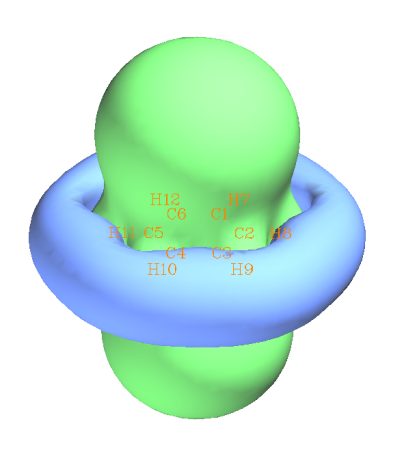

旋转一下体系，并从窗口上方的菜单选Isosurface style - Use transparent surface，可以得到俯视图

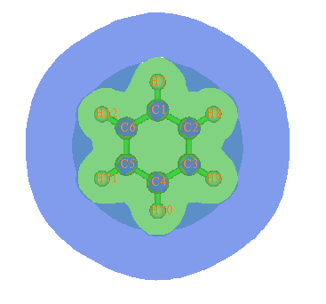

绿色等值面代表磁屏蔽值为0.25ppm的区域。蓝色等值面代表屏蔽值为-0.25ppm，或者说去屏蔽值为0.25ppm的区域。可以看出，在垂直于苯环的方向，等值面凸出来一大块，说明在苯的内部区域磁屏蔽较强，这是由于苯具有极强的芳香性，pi电子可以自由运动，外磁场令pi电子产生的磁感应环电流会在苯环内部区域显著抵消外磁场。同时从俯视图也可以清楚看到，即便是C-H键的区域，和pi电子没什么关系，外磁场却也被明显屏蔽了，因而也被绿色等值面所包围。其原因是构成C-H键的sigma电子在C-H键区域形成了局部感应环流，所以C-H键区域的外磁场也被很大程度屏蔽了，如下图所示。下图左边是分子平面上的情况，对应的是sigma电子的感应电流密度，每个sigma键都有局部环流；而右图是分子平面上方一定距离的图，体现的主要是高度离域的pi电子的感应电流密度。

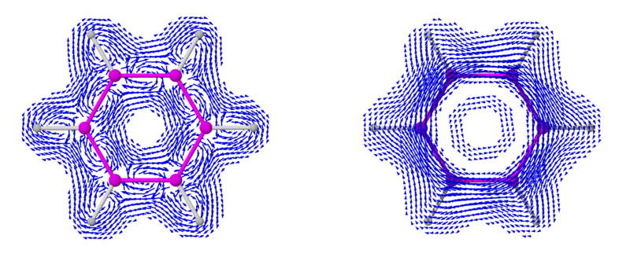

注：若想作电流密度图，可以参见《使用AICD程序研究电子离域性和磁感应电流密度》（<http://sobereva.com/147>）和《使用GIMIC计算和分析磁感应电流密度》（<http://sobereva.com/155>）。

为何ICSS图中在苯环四周出现了一圈明显的去屏蔽区域？从下面这张外磁场、感应电流和感生磁场的关系就很容易理解。

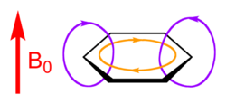

在加了外磁场（红色箭头）后，苯环整体形成了黄圈所示的pi磁感应环流，在苯环里侧，紫色所示的感生磁场方向和外磁场相反，产生了屏蔽。而在苯环外侧，pi环流产生的磁场和外磁场方向一致，对它产生了增强效果，因此苯环外侧对磁场是去屏蔽的。

我们看看ICSS_ZZ和ICSS图有什么区别。接着之前的分析，关闭GUI窗口后在Multiwfn窗口里选-1 Load another ICSS form，然后选5: ZZ component，Multiwfn会重新读取那些Gaussian的输出文件并产生ICSS_ZZ的格点数据，选1查看等值面并把等值面数值改为2，结果如下所示

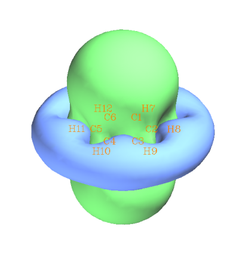

可见，和ICSS的图大同小异。但是此时的等值面绿色和蓝色表现的是对Z方向的外磁场产生2ppm的屏蔽和去屏蔽的区域，物理意思和ICSS有一定区别。对于平面体系的芳香性研究，笔者建议用ICSS_ZZ代替ICSS，道理和NICS_ZZ优于NICS一样。因为平面体系的芳香性应当靠对于垂直于分子平面的磁场的屏蔽能力来表现，而其它分量的影响理应是被去除的。虽然在此例中ICSS和ICSS_ZZ没太大区别，但是换成其它体系，差异有可能是定性的。

假设用户已经有了Gaussian的输出文件，想直接做ICSS分析，对于当前体系可以按以下步骤操作  
examples\ICSS\benzene.gjf  
25  //离域性和芳香性分析  
3   //ICSS分析  
-10   //设定格点数据计算区域的延展距离  
12    //延展距离设为12 Bohr  
1     //低质量格点  
y    //跳过Gaussian输入文件生成的步骤  
C:\ltwd\benzene\NICS      //将载入C:\ltwd\benzene\NICS0001.out、NICS0002.out...  
1   //选感兴趣的量，例如选Isotropic  
可见，重做ICSS分析的时候不需要再重新生成Gaussian输入文件了，但是在格点设定时必须和之前生成Gaussian输入文件时的格点设定完全一致，否则在载入之前得到的Gaussian输出文件时就会不对应，导致Multiwfn崩溃或者结果无意义。

## 3 环丁二烯

做法和苯的例子一样，请大家基于examples\ICSS\下的cyclobutadiene.gjf自行完成绘制。所得ICSS=0.5的图如下。为了清楚起见，用了两种显示方式

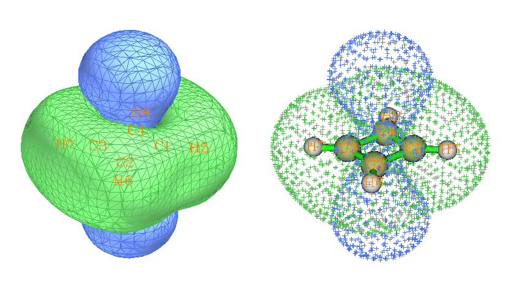

环丁二烯的情况和苯截然相反。环的内侧和上下部分都是去屏蔽区域，而环的周围都是屏蔽区域。这是因为环丁二烯是典型的4n电子反芳香性体系，pi环电流的方向和苯的情况是相反的。

可见，ICSS方式的研究比起计算特定点的NICS值生动得多，信息也更为丰富，可以掌握整个空间各个位置上对磁场的屏蔽或去屏蔽情况。而且也能避免对于一些结构复杂的体系选取计算NICS点的位置的困难。

## 4 环庚三烯(cycloheptatriene)

环庚三烯这个体系结构如下

虽然也是4n+2电子，但是表面上看共轭路径上隔着一个sp3的碳，并且是非平面的，于是Wiki英文百科上说此分子是非芳香性的，这种说法靠谱否？如果有芳香性，对外磁场又是如何屏蔽的？按照前述步骤算一下这个体系的ICSS，结果如下，ICSS=0.15和ICSS=0.25的都给出了

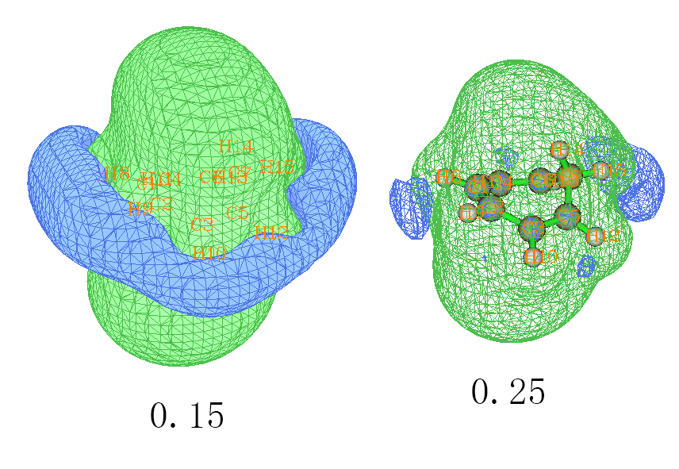

0.15的图和苯的情况很相似，也是环内侧有明显屏蔽，周围有去屏蔽区域。但是，如果把等值面数值增加到和苯的图一样，即0.25，那么去屏蔽的环状等值面就明显收缩并且断开了。这样的观测表明环庚三烯确实有芳香性，能够形成整体的环流而对内部区域的磁场造成明显屏蔽，但是程度要比苯更弱。我们也可以进一步通过Multiwfn计算多中心键级来考察一下。苯在B3LYP/6-31G*下的多中心键级为0.086，如果我们取环庚三烯的六个含有pi电子的碳（即1-2-3-5-6-4）在同样条件下计算多中心键级，结果为0.03，所以结论和ICSS的一致，环庚三烯有芳香性但比苯要弱。

## 5 丙烷

这回来看一个典型的非芳香性分子，它的ICSS=0.12、0.08和0.02的图如下

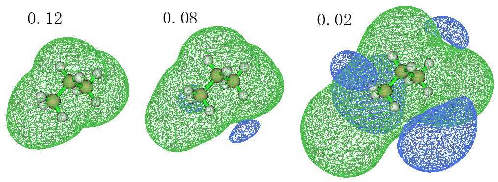

我们先看0.08的等值面，从中看到，分子主体被绿色等值面包围，这是sigma键的电子形成的局部环流产生的磁屏蔽效应。有屏蔽区域就伴随着去屏蔽区域，因为环电流不可能使得任何位置都处于屏蔽区域，所以在旁边还有蓝色去屏蔽区域。但是去屏蔽效应很弱，等值面数值在0.08时才看到一点而已，若把等值面数值调大到0.12就没有蓝色区域了。如果把等值面数值降低到0.02，则可以看到去屏蔽区域涉及空间范围其实很大，不过这些区域内去屏蔽程度非常弱。

## 6 pyracylene

这个体系光从下面的结构式来看很不好说这个分子是芳香性的还是反芳香性的，亦或是局部芳香性/反芳香性。我们通过ICSS_ZZ来研究下

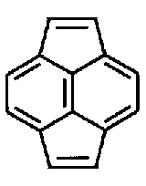

计算过程为  
examples\ICSS\pyracylene.gjf  
25  
3  
-10  
12  
4   //自定义每个方向的格点间距或格点数  
0.5,0.5,0.5   //每个方向格点间距为0.5 Bohr  
n  
之后和前面的例子一样，也是生成Gaussian输入文件（共35个），然后自行计算它们，再把它们载入到Multiwfn里。这个例子和之前唯一不同的是我们没用low quality grid，而是自定义了格点间距。因为low quality grid是指总点数约为125000个，但当前这个体系略大，因此计算的空间区域比前几例也都更大，因此如果还用low quality grid的话格点密度就偏低了，等值面显示效果可能就差了。所以这里我们直接指定格点间距，0.5bohr间距基本算是达到精度和计算量的平衡点。如果是更大的体系，诸如富勒烯，那么为了省时可以把格点间距设得更大一些。

这个体系的ICSS_ZZ图如下

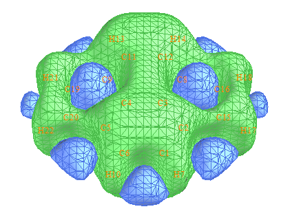

可见五元环是反芳香性的，而六元环有一定芳香性。定量讨论不同环的芳香性往往我们需要确定一个平面，例如分子平面上方1埃处，看不同环的NICS(1)ZZ值。而光从等值面图上我们难以比较某个平面上的屏蔽值分布。Multiwfn是十分灵活的程序，绘制指定平面上的屏蔽值，包括填色图、等值线图、地形图等等在Multiwfn中都可以做到。首先我们选2 Export the grid data to ICSSZZ.cub current folder把当前格点数据导出到ICSSZZ.cub文件中。然后把settings.ini里的iuserfunc改为-1，这样自定义函数就变为了通过格点数据插值获得的数值。启动新的Multiwfn，然后输入  
ICSSZZ.cub  
4    //绘制平面图  
100     //自定义函数。此时这个函数在任意一点的数值即是基于ICSSZZ.cub插值得到的值  
1    //填色图  
[回车]  
1    //XY平面  
1.89    //Z=1.89 Bohr，相当于Z=1埃  
在刚出现的图上点右键关闭之，并输入  
1    //更改色彩刻度  
-40,30  
4    //显示原子标号  
1    //文字为红色  
17    //设定显示文字的距离阈值  
2     //只要原子核距离作图平面小于2埃则这个原子的符号就显示在图上  
n  
2    //显示等值线  
-1    //重新作图  
此时会看到下图

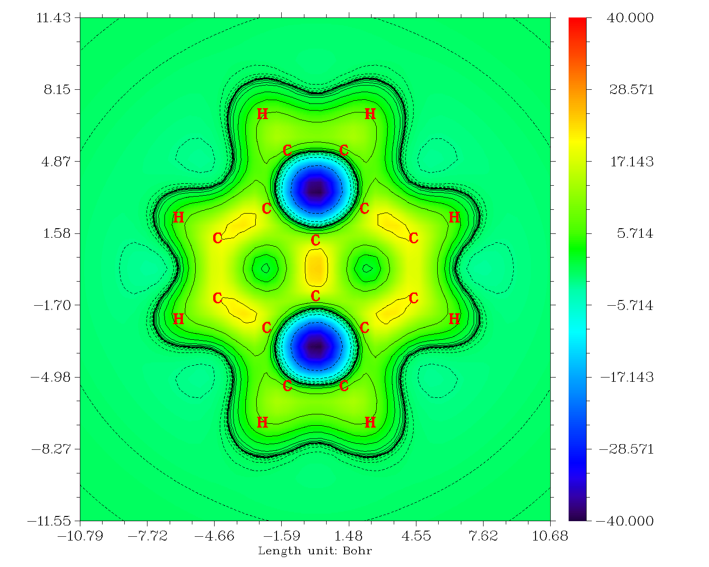

从这张图上我们可以清楚看出，在五元环上方1埃处，去屏蔽非常严重，达到-40ppm左右。实际上精确计算的五元环的NICS(1)ZZ值就是40.3476。而六元环上方1埃处，对应的颜色是绿色的，对照色彩刻度条就知道屏蔽值很低，也就比0大不了多少，实际上精确计算的六元环的NICS(1)ZZ值仅为-1.5543。我们还可以通过图形间接地看出六元环的pi电子分布很不均匀，其中边缘的C-C键上屏蔽值较高，体系中间的C-C间屏蔽值也较高，而边缘与中间的碳之间的屏蔽值较低，这表明pi电子在每个六元环上没有充分地离域化，而是分离成了两个定域性相对较高的区域，电子容易在这两个区域内形成环流。也正因为pi电子缺乏在六元环上的充分离域，没有使得六元环中心的上方出现较高的屏蔽值。

顺便作为对比，这里给出苯的分子平面上方1埃处的Z方向磁屏蔽值的填色图以兹对比。可见苯上方磁场被屏蔽得非常显著，相比之下，pyracylene的六元环的芳香性就很不显著了  
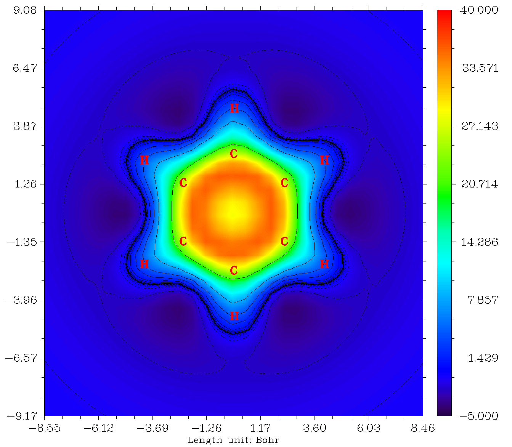

请大家自行研究pyracylene的ICSS，与上面讨论的ICSS_ZZ进行对比，在此例它们的差异还是挺明显的。另外请自行计算分子平面(Z=0)和分子平面上方2埃(Z=2)的XY平面的磁屏蔽值的填色图。

通过Multiwfn我们还可以研究从五元环和六元环中心开始，沿着分子平面垂直向上（即沿着Z方向）的磁屏蔽值的变化。首先我们先求出五元环和六元环的中心。返回主菜单后，选100，再选21，然后输入五元环的原子编号4,5,20,19,9，程序就给出了几何中心  
Geometry center (X/Y/Z):    0.00000000   -1.84880000    0.00000000 Angstrom  
（以Bohr为单位相当于0,-3.49,0）  
然后输入  
q   //返回  
0   //返回主菜单  
3   //绘制函数在一条直线上的变化曲线  
100   //自定义函数  
2    //自定义这条线的两端坐标  
0,-3.49,0,0,-3.49,12    //曲线的始端为五元环中心(0,-3.49,0），末端为向Z方向移动10Bohr的位置(0,-3.49,12)  
马上出现下面的图像，虚线代表y=0的位置

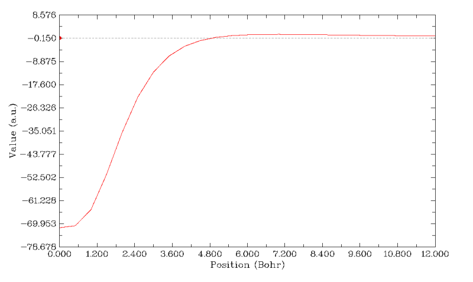

从图可见，五元环中心的Z方向磁场去屏蔽值极大，随着沿着垂直于分子平面方向移动，去屏蔽能力迅速下降，在5Bohr左右屏蔽值恰好为0。然后继续上升，屏蔽值成为微小的正值，再之后则十分缓慢地下降。成为正值绝非表明五元环呈现芳香性，而是由于其余区域电子造成的磁屏蔽效应恰延伸到了五元环上方较远的地方。大家作一下等值面数值较小的ICSS_ZZ图，比如ICSS_ZZ=2的图就能看到，此时蓝色的去屏蔽等值面被绿色的等值面给淹没了。之所以后来曲线又开始缓慢下降，是因为离体系越远，那些电子产生的磁屏蔽能力逐渐削弱。Multiwfn的文本窗口中可以看到一些有用的信息，比如曲线上最大、最小值  
Minimal/Maximum value: -0.71408290D+02  0.13046734D+01  
关闭图像后，如果用选项7，我们可以得到Y为指定值时X的位置，例如我们选7并输入0，结果为4.92Bohr，即屏蔽值恰为0的位置是五元环上方4.92Bohr处。如果用选项6，程序可以给出曲线上极大极小点，我们选择6之后程序发现此曲线上有一个极大点，位置是7Bohr处，屏蔽值为1.3ppm。

我们选2把曲线数据导出到当前目录下的line.txt，并改名为five.txt。然后再效仿上面的步骤，把六元环在垂直于环平面上的磁屏蔽值曲线作出来，同样导出到line.txt。然后在origin里利用这两个数据文件，作成同一张曲线图以便于对比，如下所示。注意在导出曲线数据时Multiwfn窗口上提示导出的数据文件中有5列，前三列是曲线上每个点的实际的X,Y,Z坐标，这对作图没用，在origin里作曲线图时要将最后两列分别用作X和Y，坐标单位为埃。

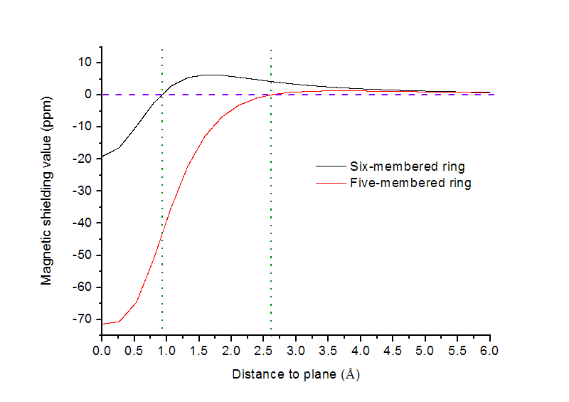

黑色曲线是六元环的结果，红色是五元环的，刚才已经见过了。绿色虚线把曲线与Y=0的相交的位置标明了。我们发现，六元环在分子平面处实际上磁屏蔽值也是负值，但是到了分子平面上方1埃处屏蔽值已经升到了正值（NICS(1)ZZ为-1.5543），随后在1.6埃处达到了最高值，约6点几ppm。随后随着距离平面渐远，屏蔽能力一直下降。所以，六元环有一些芳香性，且是pi电子引起。不过倒是不能武断地说六元环有sigma反芳香性，因为这可能是Paratropic电流太弱而不敌Diatropic电流所致的（详见PCCP,13,20500关于这两类感生电流的讨论）。

另外，由于我们已经有了ICSS_ZZ的格点数据，在Multiwfn中我们还可以直接通过插值计算指定点的数值。例如我们想计算3,-2.2,0.4处的值，就返回主菜单，选择主功能1，输入3,-2.2,0.4，然后选择输入的坐标单位，程序输出的User-defined real space function值就是这个点的Z方向磁屏蔽值了。当然受制于格点数据精度，这么算的结果和直接在Gaussian里用Bq指定位置来精确计算的会有一点偏差，但可以忽略。显然，只要我们已经有了ICSS_ZZ格点数据，想获得NICS(0)ZZ、NICS(1)ZZ就根本没必要再单独做一次NMR计算了，因为你只要在主功能1里输入环中心、环中心上方1埃处的坐标，将输出的User-defined real space function取负值后直接就分别是NICS(0)ZZ和NICS(1)ZZ了。

上面的曲线图，以及填色图的等值线上，都可以看到在某些部位不是很光滑，这是因为ICSS_ZZ的格点数据的格点密度不是很高，所以插值出来的结果准确度有限。想改进图像质量和精确度就得在ICSS计算过程中设定格点时用更密的格点。另外注意，插值不能超过格点数据的空间范围。例如这一节的例子，计算的ICSS_ZZ.cub的延展距离只有12 Bohr，所以想计算从环中心向垂直于环平面上延伸到20 Bohr的曲线图是不可能的，到了12 Bohr时曲线就会自动成为0，没有意义。

## 7 薁(azulene)

azulene的结构如下

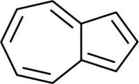

这也是个不做计算很难估算芳香性的体系。我们就来算一算ICSS_ZZ。作图过程和上一节一样。ICSS_ZZ=2的等值面图如下

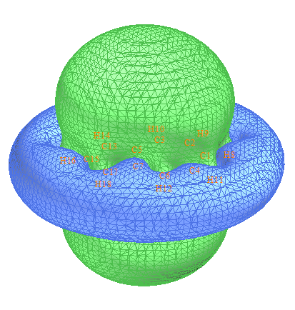

可见这个分子显示出明显的芳香性，无论是五元环还是七元环都被明显屏蔽，周围出现了和苯一样的一圈明显的去屏蔽区域。如果我们想研究五元环和七元环谁的芳香性更强，我们可以逐渐增加等值面数值，并以各种角度进行观察。ICSS_ZZ=30时的侧视图如下，左半边是五元环右半边是七元环，可以看出左半边的等值面比右半边鼓出一块，这表明五元环的芳香性要强过七元环，因为被屏蔽得更厉害。如果继续增加ICSS_ZZ值到30，得到下图的右图，可见此时在七元环上已经出现了窟窿，而五元环上还是被等值面覆盖着，也说明五元环芳香性显著更强。

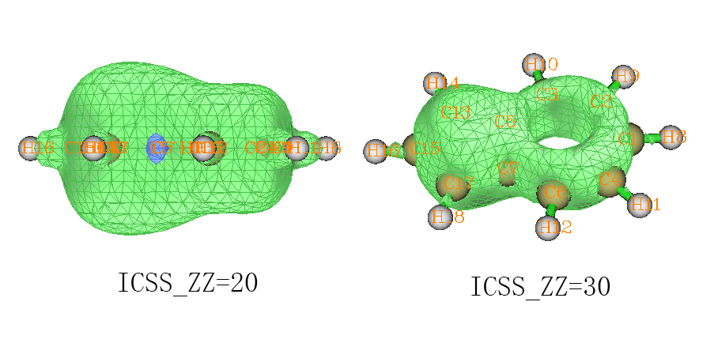

效仿上一节，作分子平面上方1埃处的填色图，如下所示，结果更明确了，七元环的对Z方向磁场的屏蔽能力比五元环差得远

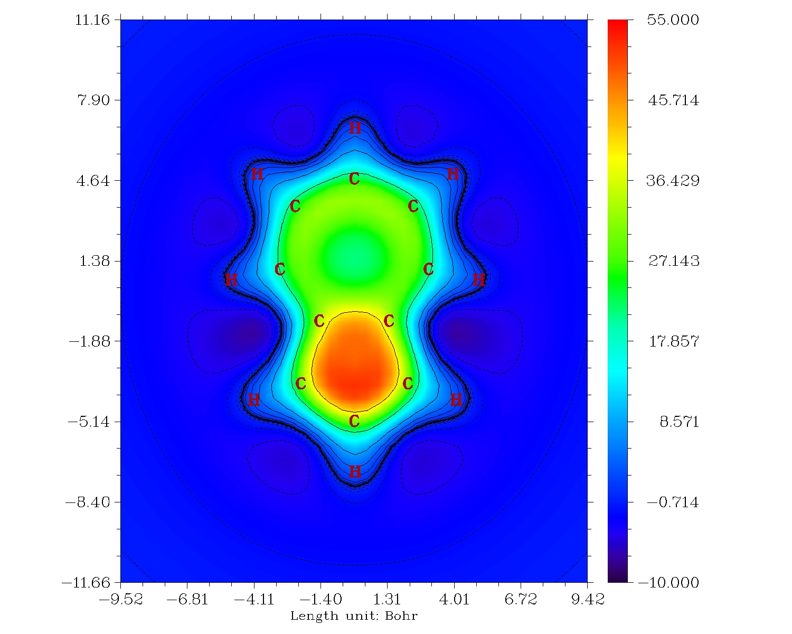

我们可以进而再作Z方向磁屏蔽值的横截面图，作图平面垂直于体系，并且穿过C1和C15原子，也就是X=0的YZ平面的填色图，结果如下。图中左半部分，也就是五元环部分，在环的中心区域虽然也有些对Z方向磁场的屏蔽能力，但是明显不如环上下区域屏蔽能力高，这是表现出这个环呈现pi芳香性而没有sigma芳香性。而图的右半边，显著体现出七元环的屏蔽能力很弱，环中心区域屏蔽值甚低，环的上下方只是比它微微强一点点。

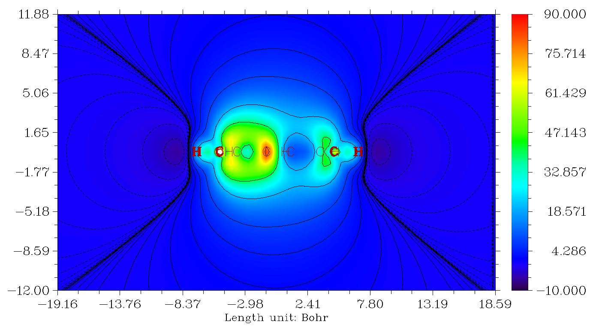

在ICSS的文献中，总是看到那种同时显示多个不同数值的ICSS等值面的图，并且做出了截面效果。每层截面其实本质上相当于上面的填色图上的等值线。不过通过多个等值面+截面方式显示，比起上面给出的填色图有时会显得更形象生动一些。这里就介绍一下怎么结合VMD 1.9.1作这种图。

首先，在获得当前体系的ICSS_ZZ格点数据后将之导出到ICSSZZ.cub文件里，然后启动VMD，将这个文件拖入至VMD主窗口。然后选Graphics-representations，然后点Create Rep新建显示方式，Drawing Method改为Isosurface，Isovalue改为2，Draw改为Solid surface，Show改为Isosurface，Coloring Method改为ColorID，并且选一种喜欢的颜色比如Red。之后，再次点击Create Rep并进行同样的操作，但是Isovalue改为4，ColorID改为另一种颜色。然后继续不断创建新显示方式，每次Isovalue数值增加一倍直到32，ColorID随意设定使之与之前的不同。最后再加一个等值面显示方式，令数值为-1，专用来表现去屏蔽的区域。然后选Extensions-Visualization-Clipping plane tool，点Active按钮，取消Normal follow view复选框。由于我们这次作的是平行于YZ平面的截面，所以把Normal（法矢量）改为1 0 0。虽然效果已经有了，但是分子自身也被截断了。因此，我们再次把ICSSZZ.cub拖进VMD主窗口，可以看到VMD主窗口中就又多了一个ID，并且开头写着T（Top）字样。切换回Clip Tool窗口，把Active按钮取消掉，此时分子结构没被截断了，我们再修改分子结构显示方式。进入Graphics-representations，确认第一栏已经切换到了ID=1的体系，把默认的Lines显示方式改为CPK。然后控制台窗口运行color Display Background white把背景改为白色，便得到下图

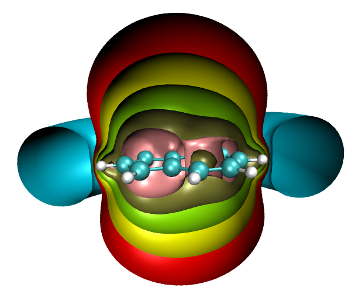

可见，如果只是研究一个数值的等值面，局限性是很大的。比如这张图上红色对应屏蔽值为2ppm。如果只考察这个等值面，结论只是体系整体有芳香性，却无法得知五元环和七元环各自芳香性的强弱。而到了棕绿色，即16ppm的ICSS_ZZ等值面上，我们才能发现五元环芳香性更强，从32ppm的ICSS_ZZ的等值面上这点体现得更为明显。所以，在通过ICSS讨论一个体系的磁屏蔽问题时，应当逐渐调整等值面数值来考察，以免有失偏颇。而将图片用于文献时，建议给出上图这样的多层ICSS等值面图，或者给出关键性截面上的填色图，这样才能将体系的磁屏蔽能力准确完整地展现出来。当我们再回首极为常见的NICS研究方法，即只是计算几个点上的NICS数据，这和本文的研究方式相比无疑显得太狭隘了。

## 8 卟啉

这是最后一个例子。利用examples\ICSS\里的porphyrin.gjf作ICSS_ZZ图，等值面数值设为25，结果如下所示

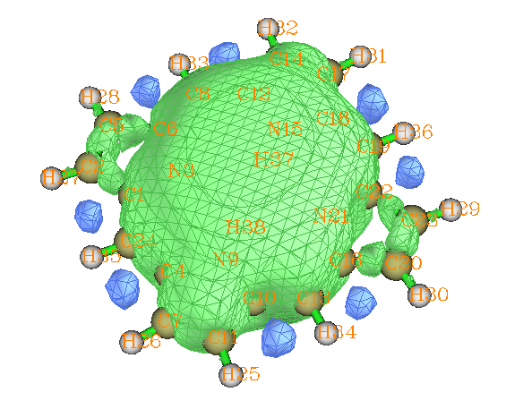

ICSS_ZZ显示体系中间一大块区域对Z方向磁场有显著的屏蔽，体现了卟啉有整体的大共轭效应故而有显著的芳香性。卟啉有四个五元环，从图中可以看到氮上不带氢的两个五元环有一大半露在外头，而氮上带着氢的两个五元环上方的等值则是和卟啉中间区域等值面直接相连的。这说明不带氢的五元环的外侧原子不是整体共轭路径的组成部分，而带着氢的五元环的外侧原子必定是整体共轭路径的一部分。这一点也可以利用Multiwfn绘制分子平面上方1.2Bohr处的LOL-pi图形来考察，LOL-pi可以清晰地把pi电子离域路径展现出来。绘制过程是  
porphyrin.fch  //此文件未提供，请自行生成。假设分子平面在YZ平面上  
100  
22    //设定所有sigma轨道占据数为0以去除其对LOL的贡献  
0  
2  
0   //回主菜单  
4  
10  
1  
[Enter]  
3  
1.2  
然后再按照前文的过程让原子标签显示出来，调整色彩刻度为0~0.66，得到下图（白色代表超过0.66处）

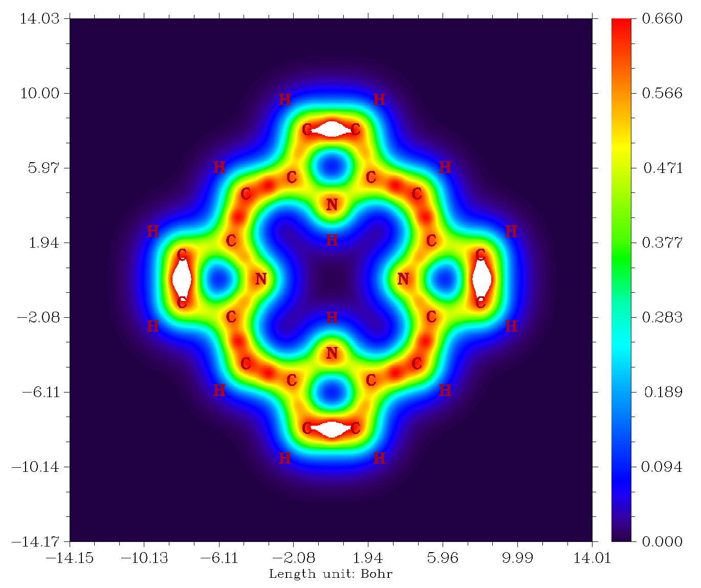

从图中可以看出一圈鲜明的pi电子共轭路径，经过含氢的五元环时倾向于走外侧，而经过不含氢的五元环时倾向于走内侧。之所以这么说是因为在这样的路径上LOL-pi值一直都比较大。假设随意选取一条路径，其中经过了LOL-pi很小的区域，那么电子在这里就不容易离域过去，这样的路径就肯定不是理想的共轭路径。虽然研究这类问题人们更多地使用ELF-pi，但至少对于此例LOL-pi比起ELF-pi的图像更为清晰。LOL和ELF虽然出发点不同，但其实体现的物理意义是相仿佛的。如果绘制电流密度图，也可以得到如上的分析结论。关于Multiwfn分析pi电子更多的介绍看《在Multiwfn中单独考察pi电子结构特征》（<http://sobereva.com/432>）。

## 9 总结&其它

本文主要介绍了ICSS，同时还结合磁屏蔽值在直线和平面上的分布以及LOL讨论了一些体系的芳香性问题。这些研究方法都非常实用而且直观形象，通过Multiwfn绘制起来也十分方便，完全可以作为像NICS一样的研究芳香性的常规手段，而且比NICS明显深入得多。实际上磁屏蔽信息和化学键还有着密切关联，特别是笔者发现数值很大的ICSS等值面和ELF/LOL、AICD等值面有着一些内在关联和相似性，笔者以后若有机会将会另撰文讨论此问题。

值得一提的是，笔者使用ICSS_ZZ方法充分考察了电子结构非常特殊的、具有双芳香性的18碳环体系，图像非常漂亮（如下所示），传递出的信息十分有价值。非常推荐大家仔细阅读相应的论文Carbon, 165, 468 (2020)中的讨论，这也可以作为ICSS的很好的例子进行引用。顺带一提，笔者对18碳环已开展了广泛研究，发表了诸多成果，**汇总见**[**http://sobereva.com/carbon_ring.html**](http://sobereva.com/carbon_ring.html)。

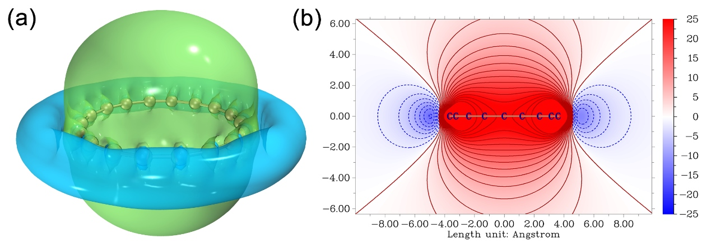

上文给出的平面图的色彩都是以彩虹方式变化的，实际上完全可以在Multiwfn主功能4绘制平面图之后通过相应选项将色彩刻度改成其它模式，并且加上等值线等效果，这样会漂亮得多得多，上面的18碳环研究文章里的图就是极好的范例。另外，如果想要得到更漂亮的等值面图，建议按此文的做法结合VMD来实现：《在VMD里将cube文件瞬间绘制成效果极佳的等值面图的方法》（<http://sobereva.com/483>），上面的ICSS_ZZ等值面图就是这么绘制的。

笔者还有很多文章都是ICSS_ZZ非常好的应用范例，**十分推荐仔细阅读并作为例子引用！**如下所示  
• 在Chem. Eur. J. (2025) DOI: 10.1002/chem.202404138中笔者利用ICSS_ZZ研究了16碳环的基态，以及三重态和五重态激发态的芳香性，通过ICSS图非常直观地展示了它们的芳香性差异，在《全面揭示16碳环（cyclo[16]carbon）非常奇特的激发态芳香性！》（<http://sobereva.com/741>）里对此论文做了深入浅出的介绍  
• 在Chem. Eur. J., 28, e202103815 (2022)中笔者利用ICSS_ZZ研究了18碳环衍生物C18-(CO)2、C18-(CO)4、C18-(CO)6的芳香性，通过ICSS图非常直观地证明了它们的芳香性并对它们的芳香性强弱进行了区分，在《深入揭示18碳环的重要衍生物C18-(CO)n的电子结构和光学特性》（<http://sobereva.com/640>）里对此论文做了深入浅出的介绍  
• 在《18碳环等电子体B6N6C6独特的芳香性：揭示碳原子桥联硼-氮对电子离域的关键影响》（<http://sobereva.com/696>）介绍的笔者的论文里使用ICSS_ZZ考察了18碳环的两种等电子体B6C6N6和B9N9的芳香性  
• 在《18个氮原子组成的环状分子长什么样？一篇文章全面揭示18氮环的特征！》（<http://sobereva.com/725>）介绍的笔者的文章中通过ICSS_ZZ论证了18氮环不具备芳香性，这和18碳环截然不同  
• 在《深度揭示互为等电子体的苯、无机苯和carborazine的芳香性的显著差异》（<http://sobereva.com/731>）介绍的笔者的文章中，通过ICSS_ZZ直观地论证了carborazine具有和苯类似的芳香性特征，而无机苯则近乎是芳香性的
