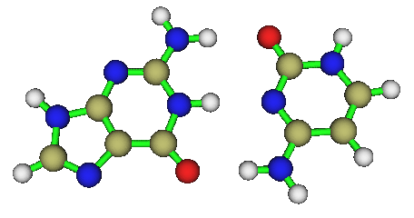
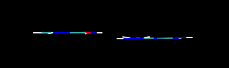
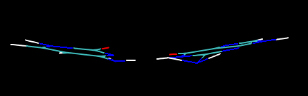

**PM7、PM6-DH+半经验方法在优化碱基对儿时的失败**Failure of PM7 and PM6-DH+ semi-empirical methods in optimizing base pairs

文/Sobereva @[北京科音](http://www.keinsci.com/)

First release: 2013-Dec-30 Last update: 2015-Jul-18

已在《大体系弱相互作用计算的解决之道》（<http://sobereva.com/214>）当中介绍过PM7和PM6-DH+，这两种方法专门考虑了弱相互作用，对于优化弱相互作用大体系是很合适的。

笔者最近优化了一个GC碱基对儿体系，如下所示

初始结构中这个碱基对儿是完全在同一个平面上的，真实情况也正是如此，然而用PM7优化后它们竟不在同一个平面上

用PM6-DH+优化也有这个问题。然而用更老的AM1、RM1、PM6，或PM6-DH2优化则都没有这个问题。至于PM3优化，结果则惨不忍睹！整体都弯了！虽然一般认为AM1和PM3半斤八两，对弱相互作用计算都很烂，不过对于这个体系的优化PM3可谓彻底失败，偏离平面不是一星半点，就连氨基都翘起来了而和单体自己不在同一个平面上。

优化用的是MOPAC2012 Version 13.331W，且都加上了PRECISE关键词以让优化收敛得可以足够精确。

这个碱基对儿的优化结果表明，虽然PM7专门考虑了描述弱相互作用，但是终究只是半经验的水准，对于精细的研究，不要对其期望过高。用作大体系的优化或小体系预优化没问题，但是想算精确了，DFT-D水平的优化还是有必要的。笔者在前一段期间高精度研究氢气、氮气二聚体问题时也发现PM7不理想，它没能给出正确的二聚体构型稳定性顺序，而B3LYP-D3则基本和CCSD(T)的结论一致，见此贴《静电效应主导了氢气、氮气二聚体的构型》（<http://sobereva.com/209>）和对应的文章J. Mol. Model., 19, 5387-5395。

对于GC碱基对儿PM7优化后偏离平面的问题，笔者给PM7和MOPAC的作者J.J.P. Stewart写了邮件进行咨询，很快得到了答复

Dear Prof Lu,

I have checked the GC base pair - you are correct. This is a bug that I   
did not know about. I agree that it is a bug.  
Thank you for the information that this bug also shows up in PM6-DH+.   
This is important, because PM7 uses a hydrogen bond function that is   
similar to the one in "-DH+".  
Just now work on adding "-D3H4" is being done in Prof Hobza's group. I   
will inform them of your discovery.  
For routine work, the error in "-DH+" looks small, but it is definite.   
I'll discuss possible ways of fixing this fault with Hobza's group.

Best wishes to you for 2014.

Jimmy

看来果然不是程序的bug，而是PM7、PM6-DH+用的那种弱相互作用校正形式作崇。希望PM7的后继者能解决此问题，使之成为更可靠的处理弱相互作用体系的半经验方法。

**2015-Jul-18补充**：目前的MOPAC已经支持了PM6-D3H4和PM6-D3，笔者测试了一下，优化出来的体系是平面的，没有上述问题。而且根据DOI: 10.1021/acs.jctc.5b00296测试结果，PM7的精度明显明显不如PM6-D3H4，比PM6-D3差得更多，因此现在笔者不再推荐PM7，而推荐PM6-D3H4和PM6-D3。
