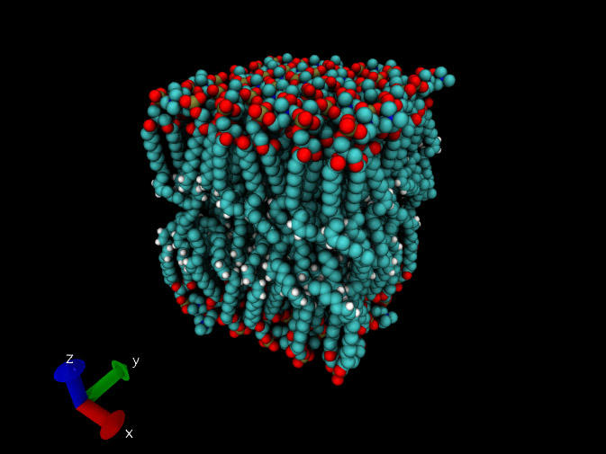

**注**：笔者后来开发了genmixmem，可以实现genmem的所有功能，还能生成混合膜，因此genmem已没有存在意义了。见《生成混合组分的磷脂双层膜结构文件的工具genmixmem》（<http://sobereva.com/245>）

**生成磷脂双层膜结构文件的小工具genmem**genmem: A small tool that generates phospholipid bilayer membrane structure files  
  
文/Sobereva@[北京科音](http://www.keinsci.com/)  2014-Feb-20

  
  
能够生成磷脂双层膜结构文件用于分子动力学模拟的程序不少，比如packmol（<http://www.ime.unicamp.br/~martinez/packmol/>）、CHARMM-GUI（<http://www.charmm-gui.org>）、VMD的Membrane Builder插件等等，可是各有缺点。Membrane Builder插件用起来方便，但是支持的磷脂类型太少。CHARMM-GUI支持的磷脂类型虽然不少，但是终究有限，没法对特殊的磷脂分子构建膜。packmol普适性最强，只要你提供了磷脂分子的结构文件，就能搭出膜来，这在《Sob谈生物膜体系的搭建》（<http://sobereva.com/23>）当中已经做了详细介绍。可是，packmol对于搭建膜体系时经常无法顺利收敛，此时它会输出迭代过程中找到的最好的结构，然而这样的结构时好时坏，磷脂经常分布得很不均匀，留下孔洞，可能造成模拟初期水分子钻进去捣蛋，而且个别磷脂分子之间还往往有极其严重的不合理接触。另外，packmol的运行时间也偏长。  
  
受够了packmol的气，于是笔者自行写了个生成磷脂双层膜结构文件的小工具genmem，磷脂分子由用户自行随意地提供。1.0版下载地址为：[/usr/uploads/file/20150610/20150610021914_17793.rar](http://sobereva.com/usr/uploads/file/20150610/20150610021914_17793.rar)。其中有预编译好的Windows下的可执行文件，示例文件，源代码也附上了。  
  
使用很简单。在程序目录下写个名为input.txt的输入文件，示例内容和注释如下  
ATB_opted.pdb   ;The path of input file (pdb file of lipid molecule)  
mem.pdb         ;The path of output file (pdb file of bilayer membrane)  
48.4            ;Length of box size (Angstrom)  
36              ;The number of lipids in each layer, should be square of an integer  
24              ;The index of the reference atom in your pdb file  
82,40           ;The Z position of the reference atom in layer 1 and layer 2  
1               ;0=Don't randomly rotate molecule, 1=randomly rotate molecule  
对于此例，只需要双击图标运行genmem.exe，程序就从ATB_opted.pdb中读取磷脂结构，产生双分子层，输出到当前目录下的mem.pdb，瞬间就运行完毕。每层的6*6=36个磷脂分子均匀分布在48.4*48.4埃的区域里。ATB_opted.pdb中第24号原子用于定位，第一层膜中每个磷脂的这个原子都位于Z=82埃的平面上，第二层膜中它都处于Z=40埃的平面上。最后一行的1代表让每个磷脂分子绕着Z轴随意旋转，如果是0，则每个分子都是保持相同朝向整齐地排列。  

输入的磷脂pdb文件中，应当事先人为地进行旋转，以让磷脂头部冲着Z轴正方向。并且最好尽量通过调整分子里的二面角让磷脂整体看起来比较直，以避免生成的结构中相互交错而导致不合理接触。

  
此程序其实很简单，并不会像packmol那样利用优化算法来让磷脂分子刚性地旋转以避免过近的接触。虽然genmem生成的膜结构中难免有些不合理接触，但这不是什么问题，因为MD之前做优化就能解决不合理接触。即便没法彻底解决掉某些局部区域的高压力，只要做MD一开始的时候用非常小的步长，比如0.4fs，稍微跑一下也就解决了。
