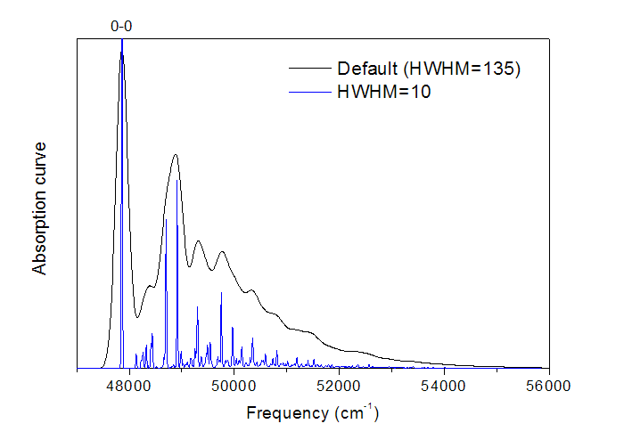

**后记**：本文内容已比较过时，仅适合Gaussian 09，不适合之后的版本。在**北京科音高级量子化学培训班（<http://www.keinsci.com/KAQC>）**里专门有一节“振动电子光谱的计算”，用90多页幻灯片极为系统深入讲解振动光谱的所有相关理论背景知识，并结合大量例子详细演示怎么用Gaussian和ORCA最新版本计算振动分辨的吸收、发射、光电离、ECD、CPL谱，并传授大量经验技巧，还同时讲解考虑振动耦合时的荧光和磷光速率的计算方法。信息量比本文讲的多一个数量级，欢迎参加！

**振动分辨的电子光谱的计算**  
Calculation of vibrationally resolved electronic spectra

文/Sobereva @[北京科音](http://www.keinsci.com)  
First release: 2014-Feb-24   Last udpate: 2016-Apr-15

## 1 原理

表面上看，光电子能谱、UV-Vis都只是电子态之间的变化的光谱（本文只讨论UV-Vis吸收光谱），吸收峰来自于电子态之间的跃迁。但是实际上每个电子态还对应诸多振动模式。比如从A电子态向B电子态跃迁的光谱，只要有对应频率的光射进来，电子实际上就会从A的振动基态跃迁到B的各种振动态上，它们的跃迁能是不同的。因此，一个电子态跃迁的峰，如果将光谱分辨率增加来获得精细结构，就会看到它是由许多与振动相关峰构成的。这称为振动分辨的电子光谱(Vibrationally-resolved electronic spectra)。

在0K下体系会处于振动基态。而在有限的温度下，A的振动激发态也会有一定分布，故也可以从A的振动激发态跃迁到B的各个振动态上。根据波尔兹曼分布，求出A的各个振动态的分布比例，将A的每个振动态向B跃迁的光谱进行权重叠加，就是实际温度下观测到的振动分辨的电子光谱。因此，振动分辨的电子光谱对温度的依赖性是可以理论计算的。

理论计算振动分辨的电子光谱需要考虑|电子基态v=0>到各种|激发态v=?>的"电子+核"波函数Ψ间的跃迁，v代表振动量子数，0对应振动基态。在基态和激发态任务中做振动分析分别得到这两个电子态下的各振动能级，并求差值，就得到了振动分辨的电子光谱中涉及的各种态之间的跃迁能。但光知道这是没用的，为了做出图来，我们关键要求的是每个这样的跃迁的振子强度，这就要知道各个Ψ之间的跃迁偶极矩，振子强度正比于跃迁偶极矩的模方。在BO近似下，跃迁偶极矩<Ψ'|μ|Ψ''>可以分离为电子波函数φ和核波函数ψ部分：<Ψ'|μ|Ψ''>=<ψ'|μ_e|ψ''>，其中μ_e为电子跃迁偶极矩<φ'|μ|φ''>.

μ_e显然是依赖于核坐标的，可以相对于激发态平衡结构进行Taylor展开，对它的处理导致了<Ψ'|μ|Ψ''>计算的三种方法：  
(1)FC(Franck-Condon)近似：μ_e只取Taylor展开的第一项，因此μ_e是个常量，即激发态平衡结构时的电子跃迁偶极矩。对于亮态的研究，通常这个假设已经足够给出合理结果了。  
(2)HT(Herzberg-Teller)方法：只取Taylor展开的第二项，μ_e故为核坐标的函数。通常不单独用这个方法，因为结果肯定和实际对不上，毕竟Taylor展开的第一项是最重要的。单独使用HT的场合仅在于讨论Herzberg-Teller效应对振动分辨的电子光谱的影响。不过，有的时候两个态之间由于电子态对称性的原因从电子跃迁偶极矩上看是严格跃迁禁阻的，但是若用比如HT方法把核振动也考虑进去后，两个态之间跃迁偶极矩就不再为0了，这使得跃迁有一定（但很小）的几率能够发生。所以如果要研究很弱的跃迁，特别是暗态，必须考虑HT。  
(3)FCHT方法：即FC和HT部分都算上，把Taylor展开的第一项（常数项）和第二项（一阶校正）都考虑。这样的结果适用范围显然比FC近似要宽。

PS：FC原理、FC因子（或称FC积分）、FC近似不要搞混，虽然有关，但是具体说的问题不同。FC原理是指的电子跃迁过程很短暂，核坐标来不及改变。FC因子是指的基态振动波函数和激发态振动波函数之间的重叠积分的平方。而FC近似则是计算振动分辨的电子光谱中用到的跃迁偶极矩的一种简化处理方式，假定μ_e为常量而不受核坐标影响。

非线型多原子分子中有3N-6个简正振动模式，谐振子模型下它们之间可以视为独立的，即体系振动波函数可写为每种振动模式的波函数的乘积。若每个振动模式的振动量子数v都为0，那么体系就处于振动基态。如果一种振动模式v>0，或者多个振动模式同时v>0，那么体系就处于振动激发态。这部分详细介绍可参见《浅谈VSCF求解分子振动问题》（<http://sobereva.com/203>）。由于v在谐振模型下是没有上限的，再加上这些振动模式的激发态之间可以有各种组合，因此电子激发态的振动态数目甚巨，把基态到所有这些态的振子强度都考虑是不可能的，计算量太大。好在如果两个态之间的FC因子如果很小，那么可知它们之间的跃迁偶极矩也会很小，因此对光谱图没什么影响，从而可以忽略。另外，也可以指定光谱的研究范围，如果两个态之间的能量差超过这个范围，那么也不必去计算它们间的振子强度。FCClasses是一种系统的预先筛选方法，会事先进行估计，并对跃迁进行分类，只算对实际光谱重要的态之间的跃迁。筛选阈值对应于计算量，一般只需要通过调节要算的积分数目这一个参数就够了，属于黑箱方法。

## 2 利用Gaussian09进行计算

Gaussian09开始可以利用Freq关键词计算振动分辨的电子光谱，其实就是把专门分析这个问题的FCClasses程序（<http://village.pi.iccom.cnr.it/Software>）给嵌入进去了。计算激发态的步骤用CIS或TDDFT都可以。虽然原理上计算振动分辨的电子光谱可以用非谐振模型，但是目前只支持谐振频率下计算振动分辨的电子光谱，因为非谐振效应需要考虑三阶或更高阶导数，Gaussian的激发态计算做不到这一点（CIS能做二阶解析导数，TD只能做一阶解析导数）。

下面以苯甲醚为例进行说明如何计算S0->S1的振动分辨的电子光谱。

用下面的输入文件优化S1激发态并做振动分析，saveNM关键词使得激发态振动信息存到chk里，并且产生前面讨论的FC方法计算μ_e时需要的激发态平衡结构的电子跃迁偶极矩。想要研究第几个电子激发态，root就写几。  
%chk=C:\gtest\anisole_exc.chk  
# cis(root=1)/6-31G* opt freq=saveNM

anisole S1

0 1  
 C                  2.28445000    0.32691600    0.00003800  
 C                  1.34343300    1.38142800   -0.00010400  
 C                 -0.03741900    1.09055200   -0.00003400  
 C                 -0.44320000   -0.26595700   -0.00005800  
 C                  0.49751700   -1.32326400   -0.00002000  
 C                  1.87678500   -1.02037200    0.00017600  
 H                  3.33003700    0.56133100   -0.00002300  
 H                  1.67739200    2.39758400   -0.00018600  
 H                 -0.75550500    1.88022800    0.00018000  
 H                  0.12880400   -2.32514600   -0.00027400  
 H                  2.60234200   -1.80568700    0.00035800  
 O                 -1.73605800   -0.64937600   -0.00027400  
 C                 -2.82140400    0.30027500    0.00020300  
 H                 -3.71931200   -0.29382400    0.00075700  
 H                 -2.78766600    0.92165900    0.88463800  
 H                 -2.78859800    0.92139000   -0.88445500

然后用下面的输入文件优化基态，并作基态的振动分析。freq=FC任务会使用FC方法基于当前的S0态的振动信息和刚才S1态的chk文件中的振动信息来计算S0的振动基态到S1的各个振动态之间的跃迁能、跃迁偶极矩，并换算成振子强度  
%chk=C:\gtest\anisole.chk  
# hf/6-31G* opt freq=FC nosymm

anisole S0

0 1  
 C                 -2.27936800    0.32609200    0.00008100  
 C                 -1.34379900    1.33903700   -0.00003400  
 C                  0.01378100    1.05103000   -0.00016100  
 C                  0.43663600   -0.26434700   -0.00020100  
 C                 -0.50250800   -1.28814500   -0.00003400  
 C                 -1.84702200   -0.99409200    0.00014300  
 H                 -3.32624700    0.55310300    0.00026000  
 H                 -1.66092300    2.36324200    0.00002000  
 H                  0.71962800    1.85453200   -0.00023700  
 H                 -0.14729200   -2.29705700   -0.00003400  
 H                 -2.56259500   -1.79229300    0.00028200  
 O                  1.75151800   -0.65529700   -0.00024100  
 C                  2.80692300    0.31779600    0.00026800  
 H                  3.72320000   -0.24943200    0.00040700  
 H                  2.76733600    0.94326200   -0.88309400  
 H                  2.76687800    0.94280000    0.88395800

C:\gtest\anisole_exc.chk        //刚才的激发态freq=saveNM任务的chk文件

FC计算过程中，在输出各种跃迁方式前会先输出0-0跃迁（S0振动基态->S1振动基态）能量  
Energy of the 0-0 transition:  47860.6879 cm^(-1)  
实际上这个值只要自行把激发态和基态的包含ZPE的能量相减就能得到。激发态计算的输出中会看到  
 Sum of electronic and zero-point Energies=           -344.222064  
基态计算的输出中会看到  
 Sum of electronic and zero-point Energies=           -344.440134  
故(-344.222064+344.440134)*219474.6363=47860 cm^-1

输出中诸如  
Initial State: <0|  
Final State: |15^2>  
     DeltaE =  1683.4671 | TDMI**2 = 0.1337E-01, Intensity = 0.4341E-01  
就是指从S0的振动基态跃迁到S1的振动激发态的情况。这个振动激发态对应于15号振动模式处于v=2的情况。DeltaE是跃迁能，不是绝对值，而是相对于0-0跃迁能的数值。TDMI是跃迁偶极矩的模的平方。

再比如这种情况  
Initial State: <0|  
Final State: |26^1;17^1>  
这里的S1的振动激发态是由26号振动模式处于v=1且17号振动模式也处于v=1的情况组合而成的。

最后Gaussian会输出通过高斯函数展宽模拟出的光谱  
 +------------------+  
 |  Final Spectrum  |  
 +------------------+

 Axis X = Energy (in cm^-1)  
 Axis Y = Intensity

 ------------------------------------------------------------  
...略  
       47476.6879        0.247451D-02  
       47484.6879        0.311828D-02  
       47492.6879        0.391045D-02  
       47500.6879        0.488005D-02  
       47508.6879        0.606049D-02  
       47516.6879        0.748991D-02  
       47524.6879        0.921152D-02  
...略

对这两列数据用origin直接作图即可，就是振动分辨的电子光谱了，如下图黑线所示。图中最高的峰对应于0-0跃迁。

将实验光谱和计算的光谱相互叠合，然后考察各种振子强度较大的跃迁方式的能量和强度，就能对实验光谱的峰的本质进行指认了。

## 3 额外的参数

基态计算时如果用freq=(FC,ReadFCHT)，则会读取控制计算的额外参数，见Gaussian手册Freq关键词的末尾部分。比较重要的有  
MaxOvr：激发态的振动量子数最大考虑到多少，默认是20。对于几何变化较大的电子跃迁来说，会涉及到较高量子数的振动激发态，光谱范围会比较宽，此时若不设大这个值，光谱就会不完整。  
MaxInt：每一类跃迁要计算的积分数，以百万为单位，默认为100，即10^8。FC/HT/FCHT计算的耗时不在于体系大小、基组、理论方法，而仅在于要算的积分数。因此这个值设得越大，所得光谱越准，但计算量也越大。  
SpecHwHm：计算结果展宽成光谱时用的半高半宽，默认为135 (cm-1)。  
PrtInt：默认为0.01，即曰如果跃迁模式的振子强度大于0-0跃迁的振子强度的1%，就在输出文件中输出这个跃迁模式。  
DoTemp：光谱计算时是否考虑温度，写上DoTemp则考虑温度。默认是0K下的，故初始态只考虑电子基态的振动基态。注意这个关键词虽然存在，但是在Gaussian中并不生效。  
NORELI00 SPECMIN=37900 SPECMAX=42000：这么写代表只计算跃迁能为37900cm^-1到42000cm^-1的部分。  
SPECRES：默认为8(cm^-1)。诸如上例的输出看到的，47476.6879、47484.6879、47492.6879...彼此间间隔都是8。数值越小光谱精度越高，但是计算也会越耗时。  
PrtMat：如果设为1，则会输出Duschinsky矩阵J；如果设为2，则会输出位移矢量K。  
（注：Duschinsky旋转或者称Duschinsky混合效应表现的是电子跃迁使得基态振动模式发生了线性混合（旋转）而产生激发态振动模式，表达为Q''=J*Q'+K。Q''_i和Q'_i分别代表电子激发态和电子基态的第i个简正振动坐标。如果基态和激发态振动模式完全一致，则J是单位矩阵，表示没有混合。J偏离单位矩阵若比较明显，说明激发态振动模式需要通过基态振动模式的显著的混合来表现）

这些额外参数在输入文件中的位置是  
[分子坐标]  
空行  
MaxInt=200 SpecHwHm=1 MaxOvr=100...  
空行  
[激发态chk文件路径]

我们往往需要不同的上述参数下的光谱结果。在重新计算时，为了节约时间，可以用readfc来直接读取chk文件里已经有的Hessian。例如，我们重新算上一节的例子，这次需要SpecHwHm设为10时的结果，输入文件可以这么写  
%chk=C:\gtest\anisole.chk  
# hf/6-31G* geom=check guess=read freq=(readfc,FC,readFCHT) nosymm

anisole S0

0 1

SPECHWHM=10

C:\gtest\anisole_exc.chk

将结果绘制的图像，就是前面的图中的蓝线，可见细节变得更清晰了。可以认为HWHM越大，就对应于分辨率越低的光谱，曲线就越平滑，振动效应在光谱中表现得越模糊。如果HWHM设得很大，这部分吸收就连成一个大的吸收峰了，就不叫“振动分辨”的电子光谱了。

另外，众所周知谐振频率和非谐振频率是有一定差异的，通常用频率校正因子来修正谐振频率。利用SclVec关键词还可以对基态和激发态的谐振频率进行校正，来近似得到非谐振模型的振动分辨的电子光谱，例子见Vibrationally-resolved electronic spectra in GAUSSIAN 09（idea.sns.it/files/idea/docs/vibronic_spectra_G09-A02.pdf）。具体来说是自己提供非谐振计算的电子基态的各个振动频率（G09中支持PT2方法得到非谐振频率），与当前的谐振模型计算的结果相除，就得到了每个振动模式对应的校正因子。通过基态的每个振动模式的校正因子，按照Duschinsky矩阵进行混合，就得到了激发态每个振动模式的校正因子了。当然了，直接对激发态做非谐振计算得到非谐振频率显然更准确，但是非谐振计算需要高阶导数，对于激发态来说难于实现，所以只能用这种方法间接地通过基态频率校正因子估算出激发态振动频率的校正因子了。

## 4 其它

前边讨论的和G09默认计算的都是吸收光谱，G09也能算振动分辨的发射光谱。输入文件和前面的例子一样，但是第二步即基态计算时写成freq(FC,emission)，注意此时不支持HT、FCHT方法。G09也能算电离过程中的振动分辨的光谱，也就是把激发态计算改成阳离子计算即可。G09里CIS和TDDFT都能用于FC，但是HT或FCHT只能用CIS，而且做CIS时必须用freq=numer，因为只有这样才会产生跃迁偶极矩导数信息。

对于很多体系，只要激发态和基态的平衡结构相差有些大，程序就会提示 ERROR: The Franck-Condon factor corresponding to the overlap integral between both vibrational ground states is too small: |<0’|0">|ˆ2 = x。这可以用readFCHT读取ForceFCCalc关键词强行进行计算，默认是x<10^-4就不计算了。出错的原因本质上是这种情况下FC方法不是很合用，几何变化太大。
