**注1：**笔者后来又撰写了《使用Multiwfn绘制构象权重平均的光谱》（<http://sobereva.com/383>），演示了如何使用Multiwfn超级便利地绘制构象权重平均的光谱，强烈建议在读完本文后阅读！

**注2：**笔者后来又撰写了《使用Multiwfn一键批量产生各类光谱图》（<http://sobereva.com/479>），配有演示视频，介绍了如何通过批处理脚本，实现一键或一条命令就把当前目录下所有文件的光谱图绘制出来，超级方便！

**注3**：Multiwfn支持基于理论模拟或者实验测定的UV-Vis光谱预测化学物质的颜色的功能，极具实用性且十分方便！见此文的详细介绍：《通过量子化学计算和Multiwfn程序预测化学物质的颜色》（<http://sobereva.com/662>）

**使用Multiwfn绘制红外、拉曼、UV-Vis、ECD、VCD和ROA光谱图**Using Multiwfn to calculate transition electric dipole moment between excited states and electric dipole moment of each excited state  
  
文/Sobereva @[北京科音](http://www.keinsci.com/)  
First release: 2014-Mar-19  Last update: 2023-Jun-16

## 1 前言

Multiwfn是功能最为强大的波函数分析程序，虽然光谱图的绘制并不是Multiwfn分内的事，但是由于光谱的绘制在计算化学中经常要涉及，为了方便量化研究者，笔者也给Multiwfn加入了绘制光谱的功能，目前此功能已经被很多研究文章所使用。Multiwfn的这个功能比起常用的GaussView绘制光谱的功能灵活、强大得多，可以满足高端用户的需求，而且支持的程序不限于Gaussian。目前也有其它一些绘制光谱的程序，和Multiwfn相比又弱又难用，毫无使用价值。此文将介绍在Multiwfn中绘制各类光谱的方法。由于很多人并不清楚理论计算产生光谱的基本原理，比如经常见到有人搞不懂振子强度和峰高、吸光度的关系，因此在第二节将首先介绍一些基本原理。如果急着马上就作出图来，可以直接看3.1节对输入文件的说明和第5节的例子。

除了本文介绍的这些光谱外，Multiwfn还具备灵活强大的绘制NMR谱的功能，见《使用Multiwfn绘制NMR谱》（<http://sobereva.com/565>）。Multiwfn还可以非常方便地绘制光电子谱，见《使用Multiwfn绘制光电子谱》（<http://sobereva.com/478>）。

Multiwfn可以在主页<http://sobereva.com/multiwfn>上免费下载。如果是第一次接触Multiwfn程序，建议先阅读《Multiwfn入门tips》（<http://sobereva.com/167>）、Multiwfn波函数分析程序的意义、功能与用途（<http://sobereva.com/184>）了解一些基本信息。

使用Multiwfn绘制各种光谱用于发表文章时请务必记得按照要求**恰当引用Multiwfn程序**，在程序主页、程序启动时的提示以及《Multiwfn FAQ》（<http://sobereva.com/452>）里都明确说了。

PS：由于Multiwfn在绘制光谱方面的强大、灵活和便利，目前已经有很多文章都利用了Multiwfn绘制了光谱，比如Chem. Asian J., 16, 56 (2021)、Org. Lett., 15, 3526 (2013)、Org. Chem. Front., 6, 1619 (2019)、Inorg. Chem., 58, 4253 (2019)、Tetrahedron, 75, 2797 (2019)、Mar. Drugs, 18, 58 (2020)、Anal. Chem., 91, 4780 (2019)、ChemPhysChem, 19, 2995 (2018)、J Raman Spectrosc., 50, 1405 (2019)、Anal. Chim. Acta, 1106, 88 (2020)。

## 2 理论光谱产生的原理

### 2.1 IR、VCD、ECD、UV/Vis光谱

物质的实验光谱是一条连续的吸收曲线，包含一大堆吸收峰，表现了对不同频率的光的吸收度的不同，一般用摩尔吸收系数(epsilon,ε)来衡量，含义是溶液浓度为1mol/L、液层厚度为1cm时的吸光度，单位是L/mol/cm。  
  
理论光谱计算给出的是离散的跃迁数据。比如做电子激发计算，程序会给出基态到各个电子激发态的跃迁能以及振子强度。比如下图，黑色的一条条竖线的横坐标位置就是电子激发能，竖线高度就是振子强度（对应右侧坐标轴）。

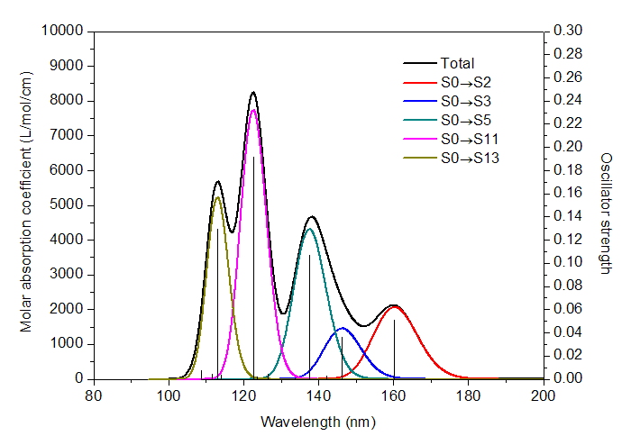

显然理论计算给出的离散的跃迁数据和实验给出的连续的吸收曲线完全不同，若想和实验光谱对应上，以预测实际光谱或者对实验光谱进行解释，就需要对理论得到的跃迁数据进行“展宽”成为峰形。先对每个跃迁进行展宽，比如图中160nm处的竖线对应S0->S2的跃迁，展宽后就是红色曲线，S0->S11展宽后就粉色曲线（由于跃迁方式很多，为了避免太乱，图中只示意了把振子强度大于0.01的跃迁展宽后的曲线）。把所有跃迁都这么进行展宽成为X-Y曲线后，再把所有曲线的Y值相加，所得到的总的曲线，即图中的黑色曲线，这就是理论预测或者说理论模拟出的光谱图。  
  
吸收曲线的每个峰往往对应于一个强度较大的跃迁。比如图中113nm左右有个峰，很显然就是对应于S0->S13的跃迁（振子强度为0.129）。但是峰的位置和具有较大强度的跃迁的能量却并不总是对应的，无论是实际光谱还是上述方式理论模拟出的光谱都是如此，因为所有跃迁都对附近范围的吸收曲线有贡献。例如上图中S0->S3的跃迁振子强度不算非常小，为0.036，但是黑色曲线在相应位置处(146.3nm)却没有峰。其原因从上图中容易理解，这是因为在S0->S3附近有个振子强度更大的跃迁S0->S5（振子强度为0.107），它对光谱的贡献（青色曲线所示）比起S0->S3的贡献（蓝色曲线所示）大得多，这导致S0->S3没有对应的峰，而被淹没进了最大值在138.2nm处的吸收峰了。这个例子也说明了考察每个跃迁对光谱的各自的贡献的用处，假设我们不把这些振子强度大的跃迁的贡献分别画出来，光谱图的内在结构是不容易搞清楚的，甚至导致对峰的本质的错误指认。这种绘制各个跃迁的独立的贡献的功能是GaussView这样的非专业程序所不具备的，在Multiwfn里则能实现。  
  
上面这个简单的例子讨论的是紫外光谱，这个产生光谱的过程对于红外、ECD（电子圆二色谱）、VCD（振动圆二色谱）也是一致的。这些光谱的理论计算都会给出一个个跃迁模式的能量和强度值，都得把它们各自展宽成曲线并相加才能得到能够和实验结果相对比的光谱。不同类型光谱计算给出的强度有不同的叫法，红外叫红外强度，UV-Vis叫振子强度，VCD/ECD计算叫转子强度（有正有负，对应于左、右两种圆偏振光）。在下文中我们统称为跃迁的“强度”。  
  
PS：这里顺带说一下单位。对于红外、拉曼和VCD谱，常用的单位是cm^-1；对于UV-Vis和ECD，常用的有1000cm^-1、eV和nm。1eV = 8.0655*1000cm^-1。eV为单位的能量的倒数乘以1240.7011就是nm为单位的能量，nm为单位的能量的倒数乘以1240.7011就是eV为单位的能量，因此nm和eV、cm^-1这样的能量单位并不是线性的转换关系。振子强度是没有量纲的，红外强度单位通常是km/mol（千米每摩尔），有时候也用1 esu^2*cm^2 = 2.5066 km/mol为单位。Gaussian输出的ECD转子强度单位是cgs (10^-40 erg-esu-cm/Gauss)，VCD转子强度单位是10^-44 esu^2 cm^2。  
  
给定一个跃迁的能量和强度，怎么把它像前面的图所示的那样展宽成峰形的曲线？这需要两个条件，一是展宽函数，它定义了曲线的函数形式；二是半高全宽FWHM(full width at half maximum)，它决定了展宽出的峰在高度为一半的位置的峰的宽度。很多地方也用HWHM，是指峰高一半处宽度的一半，HWHM=FWHM/2。显然FWHM越大，峰看起来也就越宽，FWHM越小，则峰看起来就越窄，如果FWHM是一个无限小的值，那么这就不是峰了，而是一个竖线了，相当于没做展宽。下面的图展示了FWHM为不同值的时候的吸收曲线  
  
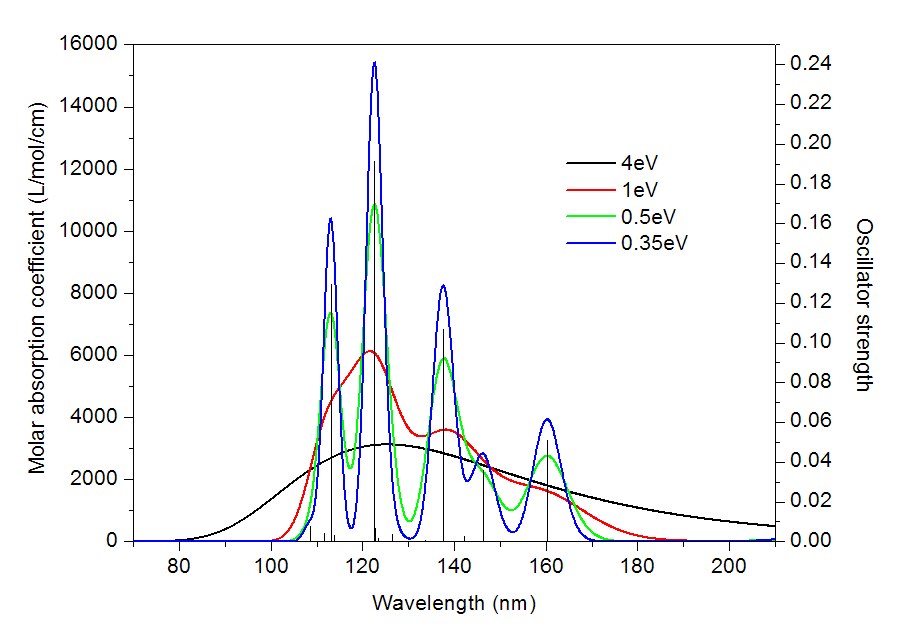  
  
可见，FWHM=4eV的时候，峰的特征根本看不见，整体就是一个大弧线，显然这样的光谱是没有意义的。FWHM减小为1eV的时候，峰的轮廓已经出来了，但还是比较含糊，或者说此时的光谱分辨率太低，连S0->S11和S0->S13跃迁对应的两个吸收峰都分辨不开。FWHM=0.5eV时，每个强度较大的峰都能看出来了，但是情况和之前一样，S0->S3和S0->S5跃迁区分不开，合并成了一个峰。FWHM进一步降低到0.35eV，这时候光谱分辨率足够高了，S0->S3和S0->S5跃迁都能看到各自的吸收峰了。实验光谱的分辨率是有限的，难以做到非常精细，所以理论模拟光谱的时候FWHM应当选择合适，以便于能够和实验比对。FWHM的选择带有一定任意性，如果不知道怎么设就用程序默认的就好了。顺带一提，对于UV-Vis光谱，如果分辨率特别高，不仅能看出电子态的跃迁，还同时可以看到不同振动态的跃迁，这称为振动分辨的电子光谱，有兴趣者可参考《振动分辨的电子光谱的计算》（<http://sobereva.com/223>）。  
  
说完了FWHM，再来说展宽函数。常用的展宽函数有下面三个，高斯函数、洛伦兹函数和Pseudo-Voigt函数。

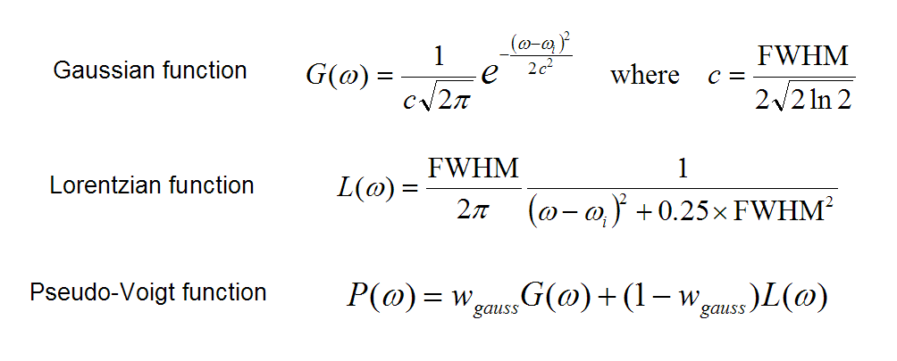

通常，电子光谱(UV-Vis、ECD)用高斯函数来展宽，振动光谱(红外、拉曼、VCD)用洛伦兹函数来展宽，洛伦兹函数衰减得比高斯函数要缓慢。Pseudo-Voigt函数则是高斯函数和洛伦兹函数的线性组合，组合系数是可调的。上面的公式中，ω就是光谱的横坐标，在给定了跃迁能量ω_i和FWHM之后，就立刻有了这个跃迁对应的吸收曲线的表达式。在ω=ω_i的位置处峰最高，而随着ω偏离ω_i函数值逐渐衰减。  
  
上面给出的函数都是归一化的，也就是说函数的积分值为1。展宽时当然也要把跃迁的强度考虑进去。这里有个重点务必记住：跃迁的强度正比于它对应的峰的积分面积。因此，如果A跃迁的强度是0.5，B跃迁的强度是0.1，那么A展宽出的峰的面积也就应当为B的5倍，所以我们要把振子强度乘到展宽函数前面去。值得一提的是，当FWHM相同时峰高正比于峰面积，所以A的峰高也相应地为B的5倍。  
  
我们有了展宽函数的数学形式，也知道了峰面积和跃迁强度的正比关系，展宽出来的吸收曲线怎么才能和实验光谱在定量上对应上？对于红外谱，通过比较红外强度单位和摩尔吸收系数的单位（见Multiwfn手册3.13.1节），可以推得如果以cm^-1为横坐标单位，L/mol/cm为纵坐标单位，则如果一个跃迁的红外强度为p，那么展宽出的曲线面积应当为100*p，也就是说把展宽函数再乘上100*p即可。对于其它类型的光谱则没有这样的形式上的关系，我们只能模拟出光谱的形状，其数值和实际光谱相差一个系数因子，只有通过将大量实验光谱和模拟光谱相对比才能得到这个因子。好在对于UV-Vis有人做过这件事，结论是：如果将1000cm^-1单位用于光谱的横轴，将L/mol/cm单位用于光谱的纵轴，那么1个单位的振子强度展宽出的曲线的积分面积应当为1/4.32*10^6。如果把eV作为横轴单位，则1单位振子强度应当展宽出面积为28700的曲线。有了这个关系，理论模拟的UV-Vis光谱就和实验光谱在定量上就有一定可比性了。不过，对于拉曼、VCD、ECD都缺乏这样的关系，所以只能简单地让p强度的跃迁展宽出积分面积为p的峰，得自己调刻度系数来使模拟的谱和实验谱吻合。  
  
量子化学理论计算出的跃迁都是一个个离散的，为什么实测的光谱是连续的，而不是仅在入射频率恰当与激发能精确一致的位置才有吸收，从而观测到离散的谱线？这个问题在一些分子光谱书里都有介绍，导致谱线具有有限宽度的原因有很多，比如(1)不确定原理导致的加宽，即激发态寿命是有限的，故而激发态能量有不确定性(2)由于分子的运动产生的多普勒效应导致的加宽(3)分子间碰撞产生能级位移导致的加宽(4)高辐射强度导致低能态的布居数耗尽导致的饱和加宽(5)柔性分子具有大量可及构象。  
  
理论模拟的光谱和实验光谱常有一定整体的偏差，为了能够尽量相符，我们往往需要一些调节。一是对光谱的高度进行scale，即乘上刻度系数，使模拟光谱的峰高能和实验光谱有较好的对应。通常想算准光谱的强度比起算准峰的位置更为困难，能定性符合就不错了，而且如上所述模拟光谱和实验光谱的本来就缺乏理论上的对应关系，所以做这样的高度的scale完全是合理且也是必要的。另外就是对模拟光谱的横坐标也进行scale或整体加减一个数值，以消除跃迁能量计算的系统性的偏差。比如CIS算的激发能通常偏高，一些研究中会被乘上0.72来修正，而振动光谱众所周知也需要乘上频率校正因子以解决计算方法的系统误差并同时等效地考虑非谐振效应，这点可参见《谈谈谐振频率校正因子》（<http://sobereva.com/221>）。另外，有时候还需要调节FWHM和展宽函数使结果更好地接近实验谱。这类调节并不算是弄虚作假，因为涉及到的问题是难以克服或者根本不可能克服的，这只是采取一些技巧以便于更好地分析和解释实验光谱。

### 2.2 拉曼光谱

拉曼光谱是散射光谱，横轴是散射光相对于入射光的频率，纵轴是散射光的强度。量子化学程序直接算出来的是每个振动模式的拉曼活性(Raman activity)，单位一般是Å4/amu（amu是原子质量单位）。拉曼活性是每个振动模式自身的特征，和入射光频率及温度无关。原理上来说，获得模拟的拉曼光谱应当先把每个振动模式的拉曼活性转换为每个振动模式的拉曼强度(Raman intensity)，拉曼强度是依赖于入射光频率和温度的。转换关系如下：

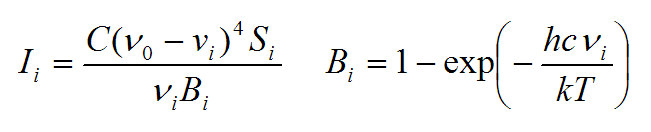

其中S_i、I_i、νi是第i个振动模式的拉曼活性、拉曼强度和振动频率（波数）。ν0是入射光频率（波数）。T是温度。h是普朗克常数，c是光速，k是玻尔兹曼常数。C是个常数，这无关紧要，我们感兴趣的并非吸收峰的绝对高度，故随便选取个值来让谱图纵轴数量级合适即可。使用上面这个公式时可以引用笔者的这篇深入研究各种尺寸碳环的振动光谱的文章：Chem. Asian J., 16, 56 (2021) DOI: 10.1002/asia.202001228，文中末尾的Computational Section就给出了这个公式。这篇文章在《揭示各种新奇的碳环体系的振动特征》（<http://sobereva.com/578>）里有深入浅出的介绍，看看里面的细节对于经常研究振动谱的人很有好处。

这样转换成拉曼强度后，再按照上一节所述方式通过洛伦兹函数进行展宽，就得到了可以和实验对照的拉曼光谱。注意，GaussView等程序绘制拉曼光谱时并不先转换出拉曼强度，是直接基于拉曼活性进行展宽，这么做显然是不严格的。不过，基于拉曼强度和活性展宽出的图的峰的位置都一样，而且每个峰的拉曼强度正比于拉曼活性，因此直接基于拉曼活性展宽出的谱图倒也并非没意义，和实际拉曼光谱在基本特征上还是相似的。但显然，基于拉曼活性和拉曼强度展宽出的谱图的具体形状还是有所不同，峰高不同。

还有一种拉曼光谱叫做预共振拉曼光谱，就是指入射光波长和体系的电子激发能非常接近时，拉曼信号会显著增强，利用这种技术可以使检出限明显降低。从理论计算角度来说，计算拉曼活性需要计算极化率对正则坐标的导数。常规拉曼计算时极化率用的是静态极化率，而计算预共振拉曼时极化率用的是含频极化率。获得严格的预共振拉曼光谱，不仅极化率要用含频极化率，而且之后还是要按照上述方式把拉曼活性转化成拉曼强度才行，即入射光频率是从两个方面影响最终的预共振拉曼光谱。

### 2.3 ROA光谱

ROA（拉曼光学活性）测的是散射的右旋圆偏振光与左旋圆偏振光强度的差值，即I_R - I_L。这是一种振动谱，因此横坐标的位置和IR是相同的。有手性的物质才有ROA信号，对映异构体的ROA谱正好呈镜像。ROA谱有不同形式，SCP (scattered circular polarization)是指入射光是线偏振光，散射光是圆偏振光；而DCP (dual circular polarization)是指入射光和散射光全都是圆偏振光。比较常研究的是SCP(180)形式的ROA谱，也叫做SCP backscattered ROA谱，即测量的散射的圆偏振光与入射的线偏振光的方向夹角是180度。Gaussian还能算SCP(90)和DCP(180)谱。ROA谱和Raman一样也是依赖于入射光频率的，绘制严格的ROA谱，也是要基于Gaussian给出的数据将ROA活性，使用与Raman活性->Raman强度相同的公式转换为真正意义的ROA强度。Gaussian在计算ROA的时候还顺带会给出当前入射光波长下的Raman SCP(180)、Raman SCP(90)、Raman DCP(180)数据，由Raman活性转换为Raman强度后对应散射的右旋圆偏振光与左旋圆偏振光强度的总和，即I_R + I_L。由于这时候的入射光波长肯定远远偏离电子激发能，无法引发共振，故这时得到的Raman谱可以叫做far from resonance拉曼谱。

## 3 Multiwfn绘制光谱的输入文件

### 3.1 Gaussian的输出文件

Multiwfn能够直接从Gaussian的输出文件中读取跃迁能和强度数据用于作图。绘制不同的光谱图所要求的关键词如下  
(1)对于红外光谱，需要写freq关键词。从G09 D.01开始，freq=anharm非谐振计算不仅给出非谐振频率还给出对应的强度，对于这样的Gaussian输出文件，Multiwfn在读入时会提示你要载入非谐振的数据还是谐振的数据。  
(2)对于拉曼光谱，写freq=raman关键词就可以了（由于长期以来以讹传讹，无数人居然误以为Gaussian的freq任务默认就计算raman，还每次都特意写上noraman以为这样会节省时间，这是弥天大误，Gaussian只对HF的freq任务才默认计算raman！！！）。若要绘制非谐振的Raman光谱，用freq(raman,anharm)的输出文件。  
如果要绘制预共振拉曼，应当还同时写上CPHF=rdfreq关键词，并在输入文件末尾空一行写上所有要算的入射光频率，比如300nm 400nm 500nm。如果不写单位，则默认是原子单位。  
(3)对于VCD光谱，写freq=VCD关键词就可以了。Gaussian从G16开始支持非谐振的VCD计算，用freq(VCD,anharm)的输出文件可以在Multiwfn里绘制非谐振的VCD谱。  
(4)对于UV-Vis和ECD光谱，直接用普通的TDDFT、TDHF、CIS、ZINDO、EOM-CCSD的输出文件即可，不需要再加其它关键词。不会做TDDFT者参看《Gaussian中用TDDFT计算激发态和吸收、荧光、磷光光谱的方法》（<http://sobereva.com/314>）。ECD的转子强度有两种表象，一种是长度表象，另一种是速度表象，前者依赖于原点而后者则不依赖，在完备基组下它们是一致的，但是在有限基组下则有些偏差，尽管定性一致，Gaussian会同时给出二者，在Multiwfn中可以选择读取哪种转子强度（GaussView作ECD图时用的是速度表象的转子强度）。  
(5)对于ROA光谱，写freq=ROA，并在输入文件末尾空一行写上所有要算的入射光频率，比如450nm 532nm 600nm。

对于上述非谐振的情况，Gaussian不仅会算出基频的数据，还会算出泛音和合频的数据，当你让Multiwfn载入非谐振数据的时候，基频总是会载入的，而泛音或合频的数据是否载入可以自由选择。

对于入射光频率不止一个的情况，载入预共振拉曼或者ROA数据的时候，可以选择载入哪个频率的。

### 3.2 ORCA的输出文件

Multiwfn能够直接从ORCA的输出文件中读取数据绘制IR、Raman、VCD、UV-Vis和ECD光谱。需要用到关键词参看Multiwfn手册3.13.2节的详细说明。对于UV-Vis和ECD，不仅支持ORCA的TDDFT、TDHF、CIS、ZINDO、EOM-CCSD、(DLPNO-)STEOM-CCSD的输出，还支持内嵌在ORCA里的能够快速计算很大体系的sTDA和sTD-DFT任务的输出。从ORCA 4.1开始ORCA支持了在TDDFT计算过程中考虑旋轨耦合(SOC)效应，只要在%tddft里加入dosoc true即可，非常容易。基于这样的输出文件，Multiwfn可以绘制考虑SOC后的UV-Vis和ECD光谱，例子见《使用ORCA在TDDFT下计算旋轨耦合矩阵元》（<http://sobereva.com/462>）。  

### 3.3 sTDA输出的文件

sTDA是Grimme提出的一种超级快速地计算大体系激发态的方法，Grimme也给出了同名的sTDA程序（<https://www.chemie.uni-bonn.de/pctc/mulliken-center/software/stda/stda>），此程序输出的stda.dat文件也可以作为输入文件来绘制UV-Vis和ECD光谱。

### 3.4 xtb输出的文件

GFN-xTB是半经验层面的DFT方法，可以快速计算几百甚至上千原子的大体系的能量，以及做优化和振动分析。GFN-xTB方法可以通过xtb程序实现（<https://github.com/grimme-lab/xtb/>），使用简介见《将Gaussian与Grimme的xtb程序联用搜索过渡态、产生IRC、做振动分析》（<http://sobereva.com/421>）。xtb 6.5及以后版本做振动分析任务（例如运行xtb test.xyz --ohess）后在当前目录下产生的vibspectrum文件可以作为Multiwfn的输入文件用来绘制红外光谱图。

### 3.5 CP2K输出的文件

可以使用第一性原理程序CP2K的振动分析的输出文件作为Multiwfn的输入文件用于绘制孤立或周期性体系的红外光谱和拉曼光谱。按照《使用Multiwfn非常便利地创建CP2K程序的输入文件》（<http://sobereva.com/587>）里所述，这样的CP2K输入文件敲几下键盘就能产生。也可以使用CP2K做TDDFT的输出文件当Multiwfn的输入文件来绘制UV-Vis谱，过程极为简单，此文有完整的例子：《使用CP2K结合Multiwfn对周期性体系模拟UV-Vis光谱和考察电子激发态》（<http://sobereva.com/634>）。

### 3.6 文本文件

考虑到很多人不是以上程序的用户，也为了灵活起见，以便于自定义，Multiwfn也支持从文本文件里直接读取跃迁能和强度，并且以这种方式输入数据还有个额外的好处，就是可以定义每个跃迁各自的FWHM，而不强制要求对所有跃迁在展宽时都用相同的FWHM。这样的文本文件的格式如下：  
numdata inptype  
 energy strength [FWHM]                   //1号跃迁的能量、强度和FWHM。FWHM不是必需要写的  
 energy strength [FWHM]                   //2号跃迁  
 energy strength [FWHM]                   //3号跃迁  
 ...  
 energy strength [FWHM]                   //numdata号跃迁  
  
其中numdata是跃迁的数目，也就是条目数。intype为1时只读取跃迁的能量和强度，FWHM由程序自动设定；intype为2时还同时读取每个跃迁的FWHM。跃迁信息应当按照能量从小到大排列。  
  
对于绘制红外、拉曼和VCD光谱，此文件里的能量和FWHM的单位必须都是cm^-1，而对于UV-Vis和ECD则必须以eV为单位。此文件里的强度单位对于红外、拉曼、ECD和VCD必须分别是km/mol, Å^4/amu, cgs (10^-40 erg-esu-cm/Gauss), 10^-44 esu^2 cm^2，这也正是Gaussian程序输出的默认的单位。而UV-Vis振子强度本身就是无量纲的。  
  
这种文本文件的一个例子如下。将它作为Multiwfn启动时载入的文件即可。  
6 2  
  81.32920        0.72170    8.0  
 417.97970        3.58980    8.0  
 544.67320       21.06430    8.0  
 583.12940       41.33960    8.0  
 678.66900       91.47940    8.0  
 867.37410        2.94480    8.0  

## 4 使用方法和选项

启动Multiwfn并载入输入文件后，进入主功能11，然后选择要绘制的光谱类型，然后就能看见一个菜单，选0就可以立刻绘制出光谱。图中既有模拟出的吸收曲线，对应左侧坐标轴；也显示出了各个跃迁，以一条条离散的竖线表示，数值对应于右侧坐标轴。另外还包含很多其它选项，下面依次介绍，对于不同类型的光谱选项的具体文字往往会不同。  
  
  -2 Export transition data to plain text file：把跃迁数据导出到当前目录下的transinfo.txt，格式和3.3节介绍的格式一样，因此用户可以自行修改里面的数值然后直接作为Multiwfn的输入文件。  
  -1 Show transition data：这个功能把跃迁数据直接显示到屏幕上，例如  
  Index  Freq.(cm^-1)  Intens.( km/mol   esu^2*cm^2)  
     1     81.32870            0.72170     0.28792  
     2    417.97970            3.58980     1.43214  
     3    544.67310           21.06430     8.40353  
     4    583.12940           41.33960    16.49230  
     5    678.66890           91.47940    36.49541  
很多人想把Gaussian输出文件里的跃迁数据给批量提取出来，但自己又不会写脚本去实现，那么就可以用Multiwfn的这个功能了。跃迁能量、强度整整齐齐地列出来，将它们从屏幕上直接拷贝下来，就可以很方便地进一步处理了。如果不知道怎么从屏幕上把数据拷贝下来，参见手册5.4节。  
  1 Save picture：把光谱图输出到当前目录下，和选项0看到的图一样。图像格式可以通过-4 Set format of saved graphical file选项来修改，默认格式也可以通过settings.ini里的graphformat来设。图像的宽和高由settings.ini里的graph1Dsize参数决定。吐血建议使用pdf格式保存图像，这样线条和文字都比用png等位图格式清晰平滑得多！虽然pdf格式一般没法嵌入文章里，但你把pdf用观看程序打开然后截图转成png格式，效果也比Multiwfn直接导出的png格式要好很多。  
  2 Export X-Y data set of lines and curves to plain text file：把模拟出的光谱曲线以X-Y数据点形式导出到当前目录下的spectrum_curve.txt中，而离散的竖线则导出到spectrum_line.txt里。把这两个文件导入到Origin之类的程序里作图，就可以得到和Multiwfn里产生的图同样的效果。由于Origin这样的程序可调选项更为丰富，因此如果你觉得Multiwfn直接给出的图的效果不满意，可以基于这两个文件在自己擅长的绘图软件中作出完全符合自己要求的图。  
  3 Set lower and upper limit of X-axis：设定光谱图的X轴上、下限和刻度间隔，默认是自动确定。自行设定的上下限可以反过来，比如既可以输入0,1000,100也可以输入1000,0,100，只不过图像左右反转了。  
  4 Set left Y-axis、5 Set right Y-axis：设定左、右侧Y坐标轴。需要输入起始值、终止值和刻度间隔。  
  6 Select broaden function：选择展宽函数，包括Gaussian、Lorentzian和Pseudo-Voigt。  
  7 Set scale ratio for curve：光谱图的刻度因子，设为k的话，那么最后光谱图的数值就会被乘以k。  
  8 Input full width at half maximum (FWHM)：设定FWHM。  
  9 Toggle showing discrete lines：在绘制的光谱图中是否把表示跃迁的离散的线显示出来。  
  10 Switch the unit of infrared intensity / Set the unit of excitation energy：对于红外，在km/mol和esu^2*cm^2两个红外强度单位之间切换。对于UV-Vis和ECD，设定光谱图中的能量单位，可以为eV、nm或1000cm^-1。  
  11 Set Gaussian-weighting coefficient：当展宽函数被选为Pseudo-Voigt时，就可以用这个选项来设定高斯函数的权重。  
  12 Set shift value in X：设定模拟的光谱图的X坐标的位移值。  
  13 Set colors of curve and discrete lines：设定图中的曲线以及离散的竖线的颜色。  
  14 Set scale factor for transition energies (or vibrational frequenices)：对所有或特定的跃迁能量乘以一个因子，主要用于实现施加频率校正因子的目的。  
  15 Output contributions of individual transitions to the spectrum：需要输入一个阈值，比如k。然后就像选项2一样会输出spectrum_curve.txt和spectrum_line.txt，只不过这次输出的spectrum_curve.txt里面还包含了所有强度绝对值大于k的跃迁产生的贡献。如果你输入0，然后输入一个光谱横坐标位置，则对此处贡献最大的10个跃迁的贡献值和贡献百分比会被输出。  
  16 Find the positions of local minima and maxima：列出光谱图中的极大值和极小值的位置和数值，这对于确定峰的准确位置很有用。  
  17 Other plotting settings：其它一些零碎的作图设置，例如切换是否显示谱图上的虚线网格、是否显示坐标轴上的标签、修改坐标轴标签和文字的尺寸、设置图例的位置、设置坐标轴的数值类型（浮点数、指数、科学计数法）、设置坐标轴保留的小数位等。  
  19 Convert Raman (or ROA) activities to intensities：对于绘制拉曼光谱，默认情况下绘制的是基于拉曼/ROA活性展宽的光谱。如果选了这个选项，并且输入温度和入射光波数，就会按前述公式把拉曼活性转换为拉曼强度。之后再作图看到的就是基于拉曼强度展宽的结果了。若再次选这个选项，并且输入的频率和温度和之前一样，则会转换成原先的拉曼活性，相当于逆操作。如果是ROA，用这个选项可以把Gaussian直接输出的ROA强度转换为真正意义的ROA强度。  
  20 Modify strengths：手动设定指定跃迁的强度数据。  
  22 Set thickness of curves/lines/texts/axes/grid：用于设置曲线、离散竖线、文字、坐标轴、虚线网格的粗细。  
  23 Set status of showing spikes to indicate transition levels：绘制光谱时可以在作图区域底部显示竖线来指示各个跃迁能级的位置（这和上述的离散竖线不一样，因为高度都相同），还可以通过设置颜色区分不同的跃迁类型。这个选项就是用来做具体设定的，见本文第8节的例子。

在光谱绘制界面里经常要进行诸多设置才能达到最满意的效果。为了避免日后重新绘制完全相同的图（或在此基础上进一步修改）时还得再重新输入一遍设置，在光谱绘制界面里允许用户输入s（意为save）来将作图设定保存到一个用户指定的文本文件里。日后再次启动Multiwfn，载入相同体系并进入光谱绘制界面后，只需输入l（意为load），然后选择之前保存的绘图设置文件，就能立刻恢复之前的作图设定。

Multiwfn绘制光谱的时候实际上是计算一系列点上的值，在当前的X轴范围内总共计算num1Dpoints个点。num1Dpoints是settings.ini文件里的参数，默认是3000。这个参数设定得越大，光谱越平滑，导出的X-Y数据点也就越多。通常默认数值足够了，再增加也看不出什么变化。

## 5 实例

下面给出Multiwfn绘制各种类型光谱的实例。请阅读完整，因为有不少用法和技巧是对各种类型光谱绘制都共通的，它们穿插在这些例子中介绍。

### 5.1 红外光谱

这个实例绘制NH3BF3的红外光谱。启动Multiwfn，然后依次输入  
examples\spectra\NH3BF3_freq.out   //程序自带的例子文件，是B3LYP/6-31G*下的振动分析  
11  
1         //红外光谱  
0      //在屏幕上显示光谱  
立刻可以看到下图

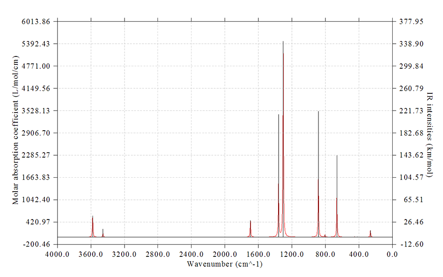  
在图上点右键就可以关闭图像。

在光谱显示出来的同时我们在文本窗口里可以看到光谱曲线的极值点位置和数值也被显示了出来：  
 Extrema on the spectrum curve:  
 Maximum    1   X:      3578.5262   Value:       585.2897  
 Maximum    2   X:      3454.4848   Value:       110.4777  
 Maximum    3   X:      1695.2317   Value:       460.3222  
 Maximum    4   X:      1359.1197   Value:      1717.7809  
 Maximum    5   X:      1303.1010   Value:      5467.1462  
 Maximum    6   X:       884.2948   Value:      1738.5775  
...略

注意极值点的位置的定位精度和前面提到的num1Dpoints参数有关，此参数值越大，数据点的间距越小，对于特别是尖锐的峰的描述越精确，峰的最大值的位置的定位精度也就越高。  
   
接下来我们随意地对图像进行一些调整，都不是必要的，纯粹只是示例一下而已  
14  //对频率乘上校正因子  
按回车选择所有模式  
0.9614   //对这些模式的跃迁能乘上B3LYP/6-31G*下的频率校正因子0.9614（低频区域的校正因子和这个值是显著不同的，这里为了省事就没有单独对高频和低频部分单独乘上各自的校正因子）。实际上这一步直接按回车也行，会自动用0.9614  
9  //不显示离散的竖线  
8  //修改FWHM  
20  //改为20cm^-1  
4 //修改左侧坐标轴  
2400,-200,200  //Y轴下端为2400，上端为-200，步长为200。此时得到的图是上下反转的，可以与纵轴为透过率的实验IR谱图对应  
y   //对应地修改右侧坐标轴的设定使得左右坐标轴的零点位置一致（选y或n无所谓，反正这里我们不绘制出离散的竖线）  
0   //重新作图  
结果如下所示  
 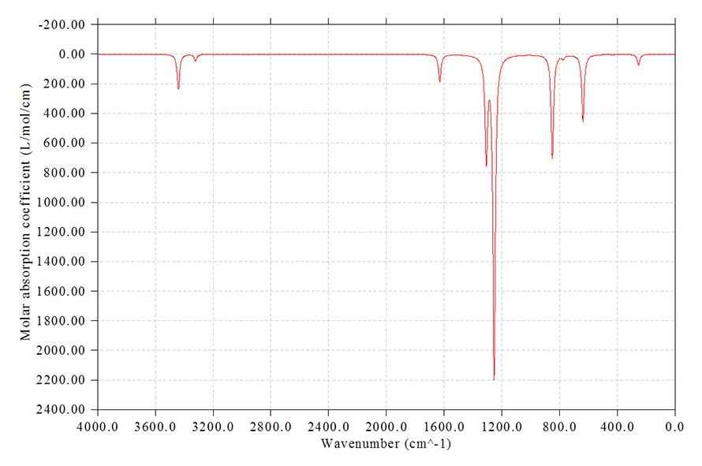

不仅当前的光谱图已经是考虑频率校正因子后的了，如果你现在用选项-1看跃迁数据，给出的值也已经是考虑校正因子后的情况了。如果你不再施加校正因子了，那么再次进入选项14，输入y（代表把频率恢复成原先的），然后校正因子输入为1即可。

你也可以对不同的振动模式设置不同的频率校正因子。进入选项14后对特定的一批模式设一个校正因子后，可以再次进入选项14，然后输入n（不把已校正过的频率恢复成原先的频率），然后再选另一批模式并设置校正因子。可以反复多次这样操作，效果会叠加。

### 5.2 拉曼光谱

和绘制红外光谱过程没什么区别。用第3节方式得到的Gaussian/ORCA的输出文件或文本文件作为Multiwfn的输入文件，然后进主功能11，然后选Raman，再选0绘图即可。比如苯胺的图  
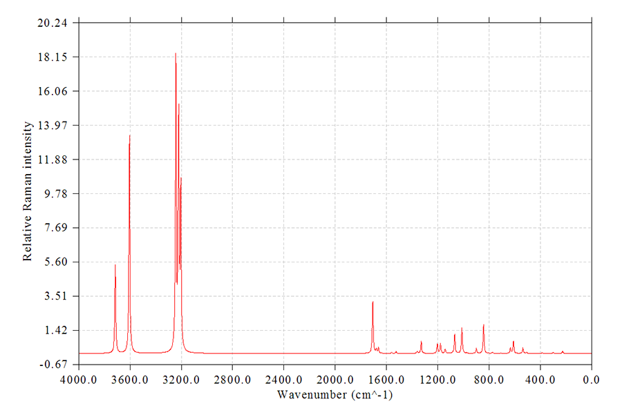  

上面的图是直接基于拉曼活性展宽产生的，若要更严格地绘制拉曼光谱，则应当先选择19，输入入射光波数和温度来转换成拉曼强度，然后再选0看到的就是基于拉曼强度展宽出的拉曼光谱了，此时峰的高度明显更为合理，更接近于实验。

如果要绘制预共振拉曼光谱，就把预共振拉曼计算的输出文件载入Multiwfn即可，进入绘制光谱界面前程序会让你选择载入哪个激发波长时的拉曼活性信息。然后，最好再按照如上方式把拉曼活性转化成拉曼强度，之后选0绘图。

对于谐振近似下计算的拉曼，强烈建议在绘图前乘上当前级别的频率校正因子以修正谐振近似对频率带来的系统性误差。

### 5.3 UV-Vis光谱

这一节我们我们用乙酸的TDDFT的输出文件为例子绘制UV-Vis谱，这也正是本文第二节讨论的那个光谱，用的是程序自带的例子文件，是B3LYP/cc-pVDZ TD(nstates=15)的输出。如果需要得到更完整的谱，nstates应该更大，但这里不追求得到准确的谱，只是示例罢了。启动Multiwfn后输入  
examples\spectra\acetic_acid_TDDFT.out  
11  //绘制光谱  
3  //UV-Vis  
0  //绘图  
然后就看到了图。  
  
这里介绍下怎么把数据导出来用Origin程序来重新绘制，这样专业的绘图程序在绘图时拥有更多更灵活的可调选项。选择2，曲线数据就导出到了当前目录下spectrum_curve.txt下面，屏幕上也明确提示了其中每一列数据是什么含义。这里第一列是波长(nm)，第二列是摩尔吸收系数。将spectrum_curve.txt直接拖到Origin窗口里（本文用的Origin 8），选择绘制曲线图，把A、B两列分别当成X和Y轴数据即可。Multiwfn还同时输出了spectrum_line.txt，把这里面的两列数据分别当成X和Y轴在Origin里绘制成曲线图，就得到了一条条离散的竖线表示出跃迁能和强度（实际上，每个竖线对应于一个往返的折线，比如对(5,0),(5,3.2),(5,0)这三个点绘制成曲线图，看起来就是在X=5的位置上出现了高度为3.2的竖线）。若在曲线图的那张图上点右键选New layer-(Linked) Right Y，在新增的这个Layer上绘制spectrum_line.txt的数据，经过一些细微的调整，就能得到下面的图  
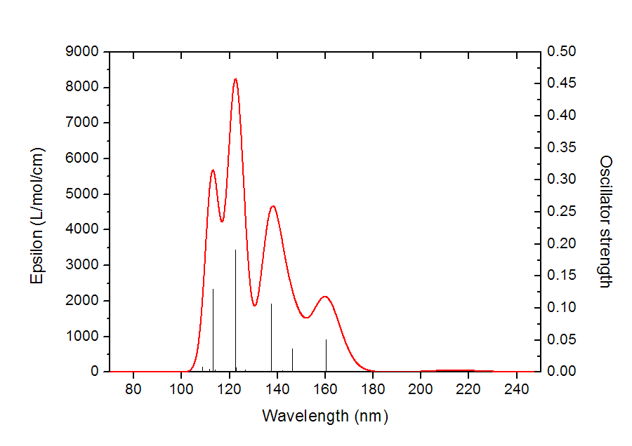  
  
如果想绘制出本文第二节给出的那种显示每个跃迁各自贡献的图，需要选15，然后输入阈值，强度绝对值大于这个阈值的跃迁对每个点的贡献会被输出到spectrum_curve.txt的第三列及之后的列当中，从屏幕上可以看到列的编号和跃迁模式的编号的对应关系：  
Column#   Transition#  
      3           2  
      4           3  
      5           5  
      6          11  
      7          13  
例如第6列的数据对应于基态到第11激发态的跃迁展宽出的曲线。而spectrum_curve.txt的前两列数据，以及同时输出的spectrum_line.txt，和选项2输出的完全一样。把这两个文件里的数据都放到Origin里作图，就能得到第二节的那种图了。examples\spectra目录下的acetic_acid_TDDFT.opj是那幅图的Origin 8的.opj文件，如果不知道怎么绘制可以直接参考这个文件。  
   
在Multiwfn中还可以特别方便地计算出特定位置由各个跃迁的贡献量。使用Multiwfn显示UV-Vis光谱时，在文本窗口看到了如下光谱极大点信息：  
 Maximum    1   X:       113.0588   Value:      5680.9864  
 Maximum    2   X:       122.5085   Value:      8239.4308  
 Maximum    3   X:       138.0728   Value:      4667.7944  
 Maximum    4   X:       159.7516   Value:      2123.3506  
 Maximum    5   X:       213.7324   Value:        48.5312  
假设这里我们要考察138.0728 nm的那个峰的主要贡献来源，就选择选项15，输入0，然后输入138.0728，之后对此处贡献最大的10个跃迁的贡献量和贡献百分比就被输出了，如下所示  
Sum of absolute values of all transitions:          4667.79444  
The individual terms are ranked by magnitude of contribution:  
  #Transition     Contribution      %  
        5          4273.59504     91.555  
        3           309.47511      6.630  
        4            68.05085      1.458  
        6            11.67756      0.250  
       11             2.33209      0.050  
        8             2.13478      0.046  
        7             0.22284      0.005  
        2             0.14507      0.003  
       10             0.10019      0.002  
        9             0.06091      0.001  
可见贡献最大的是S0->S5跃迁，S0->S3也有一定贡献但相对次要。  

对于其它类型的光谱，如下述的ECD等，同样可以以上述方式获得各个跃迁产生的独立贡献曲线和对某个波长处的贡献值。

用Multiwfn也能容易地绘制荧光光谱。根据Kasha规则荧光是从S1发射的（但也有违背Kasha规则的情况），因此和绘制吸收光谱的关键不同点是要把S1以上激发态的振子强度都设为0。具体来说是先做S1激发态优化任务，然后将输出文件载入Multiwfn，依次选11、3。然后进选项20，选择除了第一激发态以外的所有的态（比如算了5个态，就输入2-5），然后输入0使得它们的振子强度为0。然后再选0绘图，看到的就是荧光光谱了。

值得一提的是，在《一篇文章深入揭示外电场对18碳环的超强调控作用》（<http://sobereva.com/570>）一文中，笔者研究了电场对18碳环电子吸收光谱的影响，发现在0.0275 a.u.这较强电场下体系在600多nm处出现了一个新的峰。为了研究其本质，笔者对光谱曲线以上述方式用Multiwfn做了分解，得到如下图像。此图清晰地展现出S0->S6激发是这个吸收峰的主要贡献者，因此之后用Multiwfn分析这个激发的特征就能基本阐明这个新的峰是怎么来的了。具体分析见<http://sobereva.com/570>这篇文章。

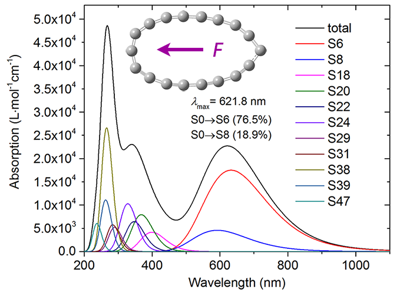

Multiwfn还可以对具有各向异性特征的体系绘制体系对不同方向打来的光的吸收光谱，对于深入认识这类体系的光谱本质特征非常有用，强烈建议看看此文：《使用Multiwfn计算特定方向的UV-Vis吸收光谱》（<http://sobereva.com/648>）。

### 5.4 振动圆二色谱(VCD)

这里来绘制S-methyloxirane的VCD谱，用的是程序自带的例子文件，是B3LYP/6-31G*下由freq=VCD关键词计算得到的。启动Multiwfn后输入  
examples\spectra\S-methyloxirane_VCD.out  
11  
5    //绘制VCD  
0    //显示光谱  
假设我们感兴趣的是700~1700cm^-1部分，想只看这部分，于是选3修改横坐标范围，输入1700,700,100，再选0重新作图，得到下面的图  
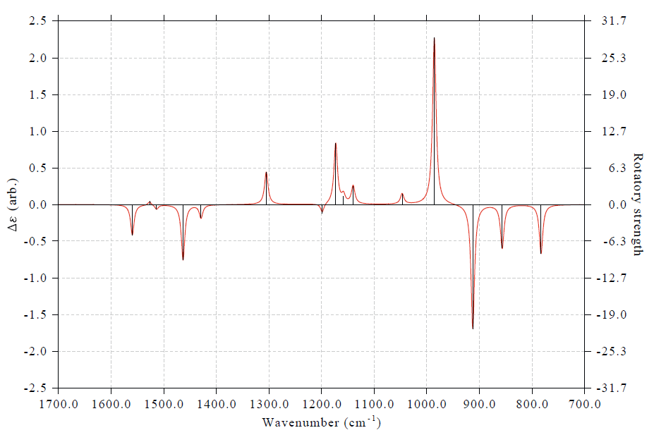  
对于杂化泛函结合谐振近似计算的VCD，建议在绘图前乘上当前级别的基频频率校正因子以修正系统性误差。  
  

### 5.5 电子圆二色谱(ECD)

这里用天冬酰胺为例子绘制ECD谱。启动Multiwfn后输入  
examples\spectra\Asn_TDDFT.out   //PBE1PBE/6-311G* TD(nstates=30)计算的输出  
11  
4   //绘制ECD  
2   //读取速度表象的转子强度  
0   //绘制图像  
结果如下  
 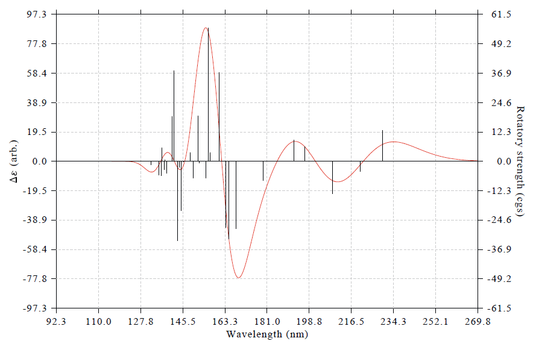  
两篇典型的使用Multiwfn绘制天然产物ECD光谱的文章见Org. Lett.,15,3526(2013)和J. Nat. Prod.,77,346(2014)。左侧坐标轴里的arb.是arbitrary unit（任意单位）的缩写。要知道VCD和ECD谱感兴趣的只是曲线的形状，而不是绝对数值，所以理论模拟的ECD谱的单位就应该标注为arb.（PS：以前有人问我怎么把坐标轴弄成和UV-Vis一样的L/mol/cm，这是毫无意义的问题）。

借这个例子的机会，笔者展示一下如何将光谱极值点非常方便地标注在图上。在绘图界面里接着输入  
16  //修改极值点标签显示设置  
1  //修改标签显示状态  
3  //显示极大点和极小点标签  
0  //返回  
4  //修改Y轴（因为显示了标签，为了避免标签露在外头，因此加大Y轴范围）  
-100,110,20  //Y轴下限、上限、刻度间隔  
y  //相应地缩放右侧Y轴  
0  //绘制光谱  
此时看到下图，可见极大和极小点的标签都已经清楚出现在了图上

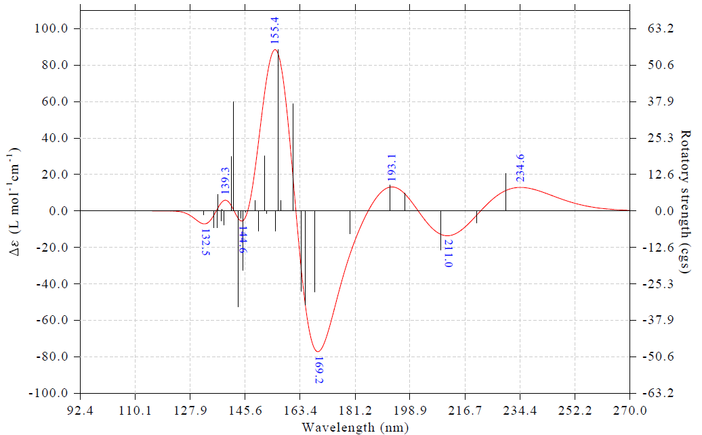

通过选项16里的子选项，可以对标签的标注情况做很多自定义和调整，这里随便做一些操作来进行演示。接着输入  
16  //修改极值点标签显示设置  
6  //切换标签内容为Y轴数值  
4  //切换为不旋转标签  
3  //设置标签的小数位数  
0  //0个小数位，即显示为整数  
2  //设置标签尺寸  
50  //令标签比默认的更大（默认是30）  
0  //返回  
3  //设置横坐标  
120,280,20  //调整下限、上限和标签间隔，使光谱主体特征充满画面  
0  //作图

此时看到下图

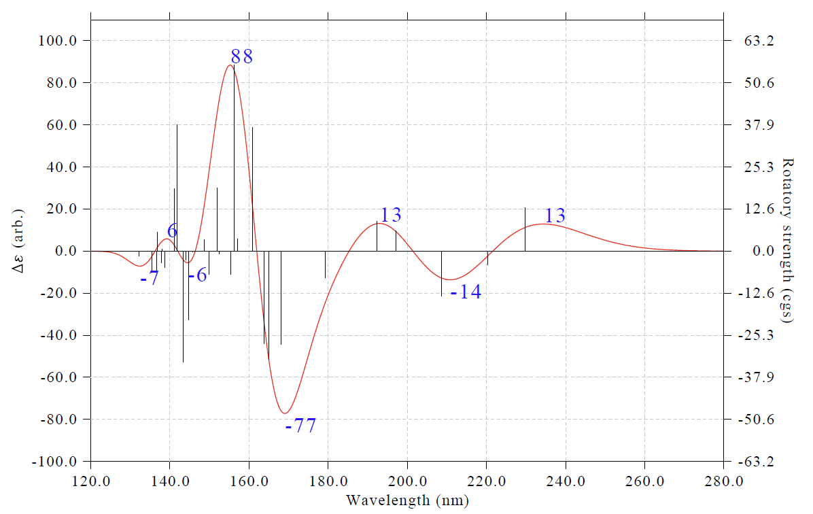

类似地，对其它类型光谱也都可以这样把极值点标签标注出来。我比较建议大家平时作图时都把标签标注出来，因为一般文献里都没有做这样的标注，若在你的光谱图里标注出来，相当于增添了一些亮点。

### 5.6 拉曼光学活性光谱(ROA)

这里用S-环氧丙烷为例绘制它在532nm入射光波长下的ROA SCP(180)谱。用的是B3LYP/aug-cc-pVDZ做freq=ROA计算的输出，考虑了500nm 532nm 600nm三种入射光波长。算ROA谱最好带弥散函数，这样才可能得到比较准确的ROA强度。  
  
启动Multiwfn后输入  
examples\spectra\S-methyloxirane_ROA.out  
11  
6   //绘制ROA  
2   //读取532nm的数据  
2   //读取ROA SCP(180)的数据  
14  //对频率乘上校正因子  
直接按回车选择所有频率  
0.97  //适合B3LYP/aug-cc-pVDZ的基频校正因子  
19  //把从输出文件直接读取的ROA活性转化为ROA强度  
532nm  //入射光波长  
按回车使用298.15K作为当前温度  
3  //修改横坐标  
3200,200,300  //横坐标上限3200，下限200，步长300cm-1  
0   //绘制图像  
此时会看到下图。实际用在文章当中，建议把纵坐标的数值标签给自行ps掉，因为对于ROA谱来说，数值的绝对大小并无意义，只有曲线形状、峰的相对高低是有意义的。

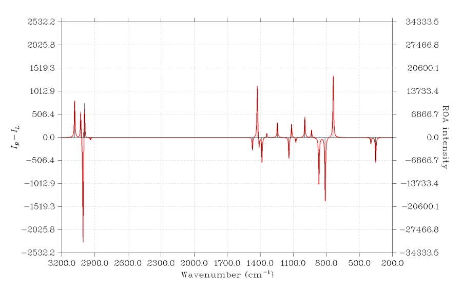

## 6 同时绘制多个体系的光谱

在Multiwfn中可以极为方便地同时绘制多个体系便于比较，只需要写一个multiple.txt文件，每一行是一个输入文件路径，然后后面空一格写对应的图例文字，之后以multiple.txt作为输入文件照常执行绘图步骤即可。例如同时绘制不同基组下计算的茜素染料的UV-Vis光谱以检验基组对结果的影响，我们用不同基组分别计算完之后，写一个multiple.txt，内容如下  
d:\basis_set\PBE0_6-31G.out 6-31G  
d:\basis_set\PBE0_6-31Gx.out 6-31G*  
d:\basis_set\PBE0_6-311Gx.out 6-311G*  
d:\basis_set\PBE0_TZVP.out def-TZVP  
d:\basis_set\PBE0_def2TZVP.out def2-TZVP  

启动Multiwfn，载入multiple.txt，然后按照常规步骤绘制UV-Vis图，就看到以下结果，不同基组下的结果差异一目了然

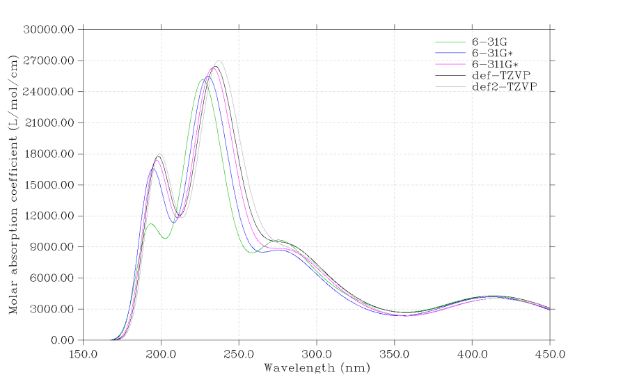

  

## 7 在绘图时考虑玻尔兹曼分布对光谱的影响

对于柔性分子，势能面有很多极小点。在有限温度下，分子并非只处于特定构象，而是在许多构象上都有一定的分布比例，当然能量越高的构象分布比例越低。分布比例可以通过玻尔兹曼分布公式来计算，具体方法见《根据Boltzmann分布计算分子不同构象所占比例》（<http://sobereva.com/165>）。不同构象下分子的光谱往往是存在差异的，因此对于柔性分子若想较为准确地模拟出它的实际光谱，就必须把构象的权重考虑进去。考虑构象权重的光谱可以在Multiwfn中极为容易地绘制，方法在《使用Multiwfn绘制构象权重平均的光谱》（<http://sobereva.com/383>）当中做了示例。

## 8 通过竖线指示跃迁能级和类型

Multiwfn允许在绘图区域底部增加竖线来指示跃迁能级位置和类型。实际体系中，往往有很多跃迁的强度值非常低，在理论模拟出的光谱上难以看到它们的位置，在实验上也难以观测到，这叫做“暗态”，但是它们可以被理论计算出来。如果想在图上也能体现出它们的存在，就可以在绘图区域底部在每个跃迁能级位置绘制一条竖线（竖线高度都是统一的）。另外，我们还可以对不同的跃迁能级使用不同的颜色，这样可以从图上一目了然地区分不同类型跃迁的能级分布情况。注：Multiwfn的这个功能仅对于绘制单个体系有效。

下面看一个具体例子，18碳环。对这个十分特殊的体系笔者做了大量研究工作，汇总见<http://sobereva.com/carbon_ring.html>，笔者对于它及其它尺寸的碳环做了深入的振动谱方面的研究，参看《揭示各种新奇的碳环体系的振动特征》（<http://sobereva.com/578>）。18碳环的振动模式有平面内的振动，也有偏离平面的振动。我们希望绘制它的红外光谱，并且在图上体现出所有振动模式的位置，同时通过颜色区分开平面内和偏离平面的振动。用到的18碳环的振动分析输出文件可以在这里下载：<http://sobereva.com/attach/224/C18_optfreq.out>。

启动Multiwfn，然后输入  
C18_optfreq.out  
11  //绘制光谱  
1   //红外光谱  
23  //用竖线指示跃迁能级的位置。之后用选项1~10可以分别设置10套竖线  
1   //定义第一套竖线  
1,2,5,6,9,10,13,14,15,18,20,21,24,25,26,27,32-48  //之前笔者根据GaussView显示的振动模式判断出的平面内振动模式的序号  
14  //用棕色显示  
2   //定义第二套竖线  
3,4,7,8,11,12,16,17,19,22,23,28,29,30,31  //偏离平面的振动模式的序号  
3   //用蓝色显示  
0   //返回  
0   //绘图  
此时绘制出的图和我们预期的一样，但是由于坐标轴范围还不是很理想，因此我们关闭图像后输入以下命令再做调整  
3   //调整横坐标  
2500,0,-300  //从2800到0 cm^-1，每300 cm^-1显示一次标签  
4  //设置左边纵轴范围  
0,3600,500  
y  //自动相应地调整右边纵坐标范围  
0  //重新绘图  
此时看到下图

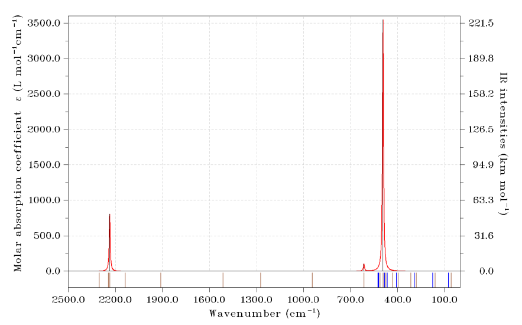

可见此体系有大量振动模式都是跃迁禁阻的，这是因为体系的高对称性所致。通过图下方的竖线，我们可以一目了然地看到实际的各个振动模式都在什么位置。棕色竖线是平面内振动模式，蓝色竖线是偏离平面的振动模式，由图可以清楚看出偏离平面的振动基本都在低波数范围，而平面内的振动则有不少是高频的。如果大家绘制的是电子光谱，还可以把比如n->pi*、pi->pi*跃迁，或者局域激发、电荷转移激发的那些模式以不同颜色区分。

当前体系有D9h高对称性，因此很多跃迁是简并的。我们还可以让竖线高度体现简并度，这样在写文章的时候向读者描述跃迁的简并情况就很直观方便了。接着上面的例子，输入以下内容  
23  //重新进入设置竖线的界面  
-3  //用竖线高度体现简并度  
0.2  //判断简并度的阈值，对于振动谱单位是cm^-1。如果有一批轨道彼此间跃迁能量相距小于这个阈值，则它们被认为简并，只有其中跃迁能最低的那个显示竖线，高度对应简并度  
0  //返回  
0  //重新绘图  
此时看到下图（图的上面部分同前）

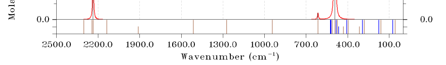

图的下方显示了坐标刻度，高度达到第一个刻度说明这个跃迁是非简并的（简并度为1.0），达到第二个刻度说明是二重简并的。可见当前大部分的竖线是全高的，只有少数是半高，因此当前体系绝大多数振动跃迁都是双重简并的。

上述这样的图用在文章里，对于展示跃迁特征、简并情况非常方便直观，使得比起普通的光谱图信息明显更丰富，非常鼓励大家使用。上图也正是笔者发表的论文Chem. Asian J., 16, 56 (2021) DOI: 10.1002/asia.202001228里的图，非常建议读者看看文章里的讨论，此文可在<http://sobereva.com/carbon_ring.html>里提及的网盘中下载。
