注：本文已经没什么意义了，用笔者后来开发的genmixmem工具来构建磷脂膜方便得多效果也明显更好，见<http://sobereva.com/245>。而本文的把蛋白嵌入膜的方法也不再推荐，建议使用GROMACS直接支持的membed方法，在北京科音(<http://www.keinsci.com>)举办的分子动力学与GROMACS培训班里会讲解和演示

**Sob****谈生物膜体系的搭建**Sob's talk on the construction of biofilm system

文/Sobereva @[北京科音](http://www.keinsci.com/)   写于约2008年

生物膜体系似乎很多人觉得比较难建，都得从网上下载别人现成的似的，甚至弄到一些就感觉如获至宝，其实生物膜体系仅仅结合chem3D和packmol就可以随心所欲地搭建。mdbbs上有个人问如何得到“把9个DPPS脂质分子嵌入到121个DPPC分子得到的膜，并且置于在5476个水分子中”，此文中我们就来建立这个体系。

我先说说膜的基本结构。膜脂是膜的基本骨架，膜脂主要包括磷脂、糖脂和胆固醇三种类型，而磷脂占整个膜脂的50%以上。磷脂主要包括脂肪酸链、甘油、磷酸酯三个部分，种类很多，在不同生物不同细胞中分布不同。

磷脂经常用四个字母表示，比如DPPS、DOPE之类的。磷酸酯的酯部分的不同，决定了后两个字母，比如PS就是磷脂酰丝氨酸（phosphatidyl serine），PE就是磷脂酰乙醇胺（phosphatidyl
ethanolamine，旧称脑磷脂），等等。而前两个字母和它们的脂肪酸链有关。在Wiki上有一个不错的缩写和完整写法的对照，我打印成了pdf发在这里。

[/usr/uploads/file/20150602/20150602215525_49469.pdf](http://sobereva.com/usr/uploads/file/20150602/20150602215525_49469.pdf)

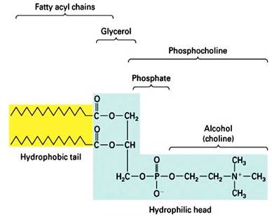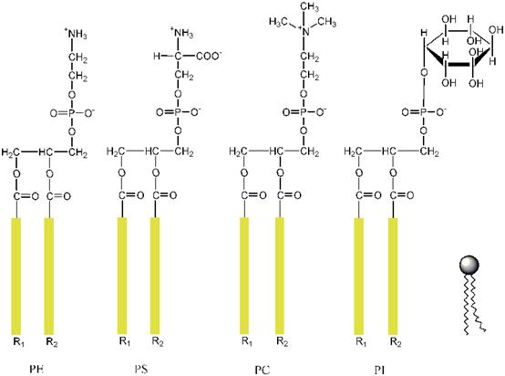

为什么要强调它们的名字呢？，最方便的方法就是直接在ChemBio3D里面输入！CCDC里面虽然有很多小分子晶体结构，但里面磷脂分子很少，所以CCDC没什么用，得自己搭。

这里先制作DPPC分子的结构文件，查找那个缩写大全.pdf，得知DPPC的完整写法是1,2-Dipalmitoyl-sn-Glycero-3-phosphocholine。我这里用的是ChemBioOffice 2008 Ultra 11.0.1。启动ChemBio3D之后，点击工具栏上的A按钮（图1），在空白处点一下，输入1,2-Dipalmitoyl-sn-Glycero-3-phosphocholine，回车，得到了DPPC（图2）

图1

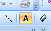

图2

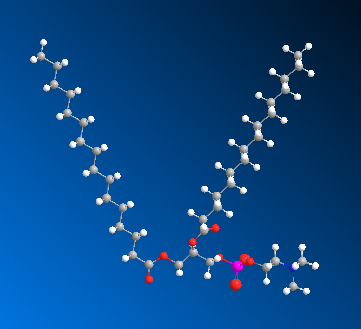

但是发现两个脂肪链相距太远，搭磷脂层的时候肯定会互相碰上，所以我们要把两个脂肪链并到一起。这里要用到ChemBio3D自带的MM2力场优化功能。点击Single Bond按钮，把两个脂肪链的碳原子每隔两个碳链接一次（图3）。

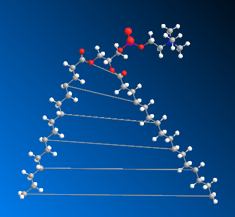

然后点击MM2优化按钮（图4）。

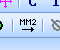

优化之后，两条链并起来了（图5）

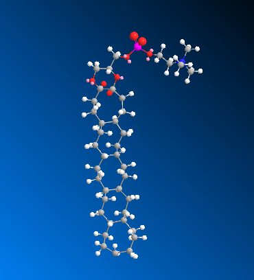

然后再把键打开，选择一个原子后，按住shift再点与之相连的另一条链的原子，两个原子呈黄色后，按Ctrl+B，键就断开了（图6）
。如果没断开而且还自动加了氢，应当在File-Model setting-Mode
building里面把rectify去掉。

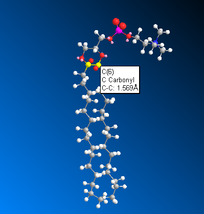

然后再点MM2按钮来优化。

但是还有个问题，就是磷酸胆碱那个部分比较歪，搭建膜的时候时候也会碍事，所以应当摆正。找到比较关键的二面角，按住shift连续点击四个原子，在某个原子上点右键选Display Dihedral
Measurement（图7）

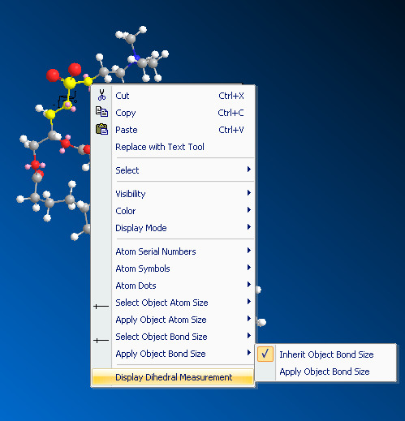

在左侧出现二面角数值，改成50（图8）

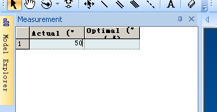

最终再优化一下，得到图9的样子，保存为a.mol2。（最好别保存为pdb，似乎chemBio3D有bug，尤其是MM2优化之后保存为pdb容易莫名其妙出错退出）

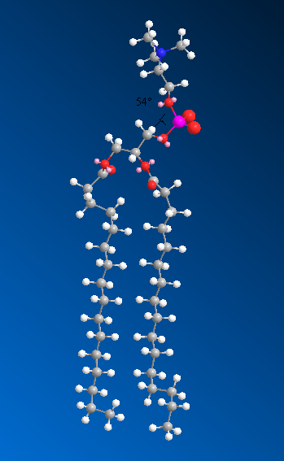

a.mol2里面的原子名是很荒凉的，最好走一遍prodrg赋上有意义的名字，而且生成的.itp还有用。把a.mol2的内容复制到prodrg2.5 beta里面（<http://davapc1.bioch.dundee.ac.uk/cgi-bin/prodrg_beta>），注意EM选NO，否则两条脂肪酸链往往又跑开了。

运行完之后，点击"Download everything as a gzipped tarfile or as a zip archive (read
00README in the archive)."里面的zip archive，把其中DRGFIN.PDB（加了全部氢）、DRGGMX.PDB（加了极化氢和芳香环上的氢，不含其它氢，与DRGGMX.ITP相对应）、DRGGMX.ITP（gmx会用到的top文件）提取出来。

用同样的方法得到DPPS的pdb和itp。

DPPC和DPPS的结构已经准备好了，现在用packmol建立磷脂双层体系模型  
在<http://www.ime.unicamp.br/~martinez/packmol>下载packmol和Input example文件。  
解压，直接输入make就可以编译，调用的是gfortran。如果要安装并行版本，输入make
parallel。编译得到packmol可执行文件。

把DPPS.pdb和DPPC.pdb都放到packmol可执行文件所在目录，并把example里面的water.pdb也拷到这个文件夹。

编写packmol的输入文件bi.inp，内容如下（不要把注释也写进去）：

tolerance 2.0         //原子间最近距离不得小于2.0  
filetype pdb  
output bilayer.pdb         //输出bilayer.pdb  
  
structure water.pdb          //设置第一层水   
  number 2738               //水分子数量  
  inside box 0. 0. 0. 72. 72. 25.       //定义2738个水分子所在的范围，水分子会取向随意地分布在这个范围内，六个数即x/y/z-min,x/y/z/-max。这些坐标凭直觉就能确定，我这里不用图来说明了。  
end structure  
  
structure water.pdb          //设置第二层水  
  number 2738  
  inside box 0. 0. 75. 72. 72. 100.  
end structure  
  
   
structure DPPC.pdb          //设置DPPC分子   
  number 61  
  inside box 0. 0. 20. 70. 70. 50.  //DPPC所在范围  
  atoms 28                  //DPPC的第28号原子，也就是胆碱的N  
    below plane 0. 0. 1. 25.   //前三个数定义一个平面，这里定义的就是Z方向，必须小于25埃的位置  
  end atoms                 //结束第28号原子的说明  
  atoms 1                   //脂肪链最末端的C  
    over plane 0. 0. 1. 48     //必须Z>48，这样限制了DPPC两端原子的坐标范围，所有DPPC分子的方向就基本定了，但应当留有一些任意旋转的余地，应该事先量一下这两个原子间的距离，在DPPC中是25.84，大于48-25=23，所以是可行的。如果想让DPPC取向再乱一些，定义的两个平面之间的距离应该再缩短。  
  end atoms  
end structure   
  
structure DPPC.pdb   
  number 60  
  inside box 0. 0. 50. 70. 70. 80.  
  atoms 1  
    below plane 0. 0. 1. 52.  
  end atoms  
  atoms 28  
    over plane 0. 0. 1. 75  
  end atoms  
end structure   
  
structure DPPS.pdb   
  number 5  
  inside box 0. 0. 20. 70. 70. 50.    //水、DPPC、DPPS定义的范围有交集，没有关系，packmol不会使它们之间位置产生冲突，会自动排列让它们避开，DPPS和DPPC定义同样的范围，会均匀地混合在一起。  
  atoms 27  
    below plane 0. 0. 1. 25.  
  end atoms  
  atoms 1  
    over plane 0. 0. 1. 48.  
  end atoms  
end structure   
  
structure DPPS.pdb   
  number 4  
  inside box 0. 0. 50. 70. 70. 80.  
  atoms 1  
    below plane 0. 0. 1. 52.  
  end atoms  
  atoms 27  
    over plane 0. 0. 1. 75.  
  end atoms  
end structure  
  

现在执行./packmol < bi.inp。packmol其实收敛得挺慢的，和体系、设定都有关系，不要故意去等，先干别的，等什么时候算完了再看结果，结果总是不错的。往往是超过了迭代次数上限自动停止，会输出带FORCE后缀的.pdb，实际上结果已经很好了。最终得到的结果（图10）：

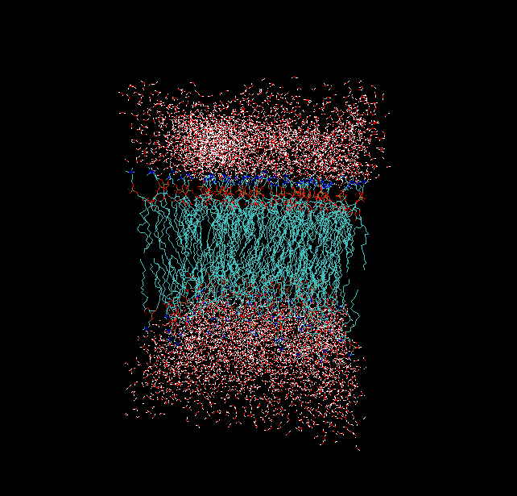

如果DPPS和DPPC混合得不是太均匀，不满意的话，可以再次运行。也可以用FIXED关键字来特别指定DPPS所在位置，见packmol的user guide。

体系分子越多定义越复杂packmol收敛越慢，做一个新的体系之前，最好先每个部分单独试验，很快就能得到结果，比如先不考虑水，只生成DPPS和DPPC部分看看能否得到正常结果。加上水之后收敛颇慢，加水的工序可以用gmx的genbox来做，然后用我写的grostat的反选功能和保留完整残基功能来去掉两个磷脂层疏水区的水。

其实还有各种各样的方法都可以建这样的体系，比如MS里面晶胞平移、leap里面平移、复制循环使用，gmx里面genconf等等，但都有种种缺点而且麻烦。上述过程是最佳途径。

得到的bilayer.pdb可能残基名、残基序号等等不如意，解决方法很多也很简单，不多说了。因为构建膜时候就是用的prodrg输出的pdb，所以和prodrg输出的.itp顺序都是一样的，用gmx跑的时候可以直接include prodrg得到的itp，这就避免了用网上下载的膜体系和prodrg输出的itp原子顺序不对的问题（可以用itp2rtp解决，见相应readme）。也可以用我写的itp2rtp，由itp生成用于.rtp的数据，再用pdb2gmx把膜读进去。

---

  

下面讨论一下把膜蛋白嵌入磷脂膜的方法

有一些专门的软件可以做效果也好，但这里我想说说简单直观的方法。

用我写的grostat可以做，确定好膜蛋白在膜中预计的坐标和它跨膜区域所占面积，启动grostat，读入膜的gro（可以用editconf直接在pdb和gro格式之间来回转换），选择反转柱形选择模式，输入柱的位置、半径，选择保留完整残基，然后再用VMD把膜蛋白拉入膜的圆柱形的洞里面，但是这样还是有点不够直观，跨膜部分的形状不一定就是标准圆洞形，故适用范围有限。不如下面的方法。

这是我发现的一个简单的直接用VMD在磷脂膜上挖洞放膜蛋白的方法。这里随便从RCSB弄一个膜蛋白举例，首先通过上面的方法得到一个双层DPPC，面积稍微大一些100*100埃^2，每层150个DPPC。然后用VMD同时打开这个膜蛋白和磷脂层的pdb，看看膜蛋白是否和磷脂层有重合，如果重合的话，按数字7，然后拖动膜蛋白使之不与磷脂层接触。然后用save
coordinate功能把膜蛋白保存成新的pdb。然后把这个新的pdb和磷脂层的pdb直接用文本编辑器合并到一起比如叫a.pdb，用gmx的editconf
-f a.pdb -o a2.pdb，这样a2.pdb里面的残基号都是顺着的，应当手动检查一下看看残基编号有无问题。

然后用VMD打开a2.pdb，建立一个层用new
cartoon显示蛋白，另一个层用line显示，所选的内容是all not same resid as (within 1.5 of protein)，然后按数字7打开fragment平移模式，按住shift拖动膜蛋白调好方向，然后用鼠标在不同视角下直接拖拉膜蛋白，使膜蛋白嵌入磷脂膜当中合适位置，就做好了。然后还是save coordinate功能，选择all not same resid as
(exwithin 1.5 of protein)，保存为新的pdb就可以了。图中是此法弄好的膜蛋白嵌入磷脂膜的结构。当然这个方法很粗糙，蛋白对周围磷脂的挤压等问题也没考虑，但是十分简便易行。

上面的选择范围all not same resid as (within 1.5 of
protein)代表的是与蛋白中任意原子距离小于1.5埃的原子，它所在的整个残基都不显示。注意within也包括了of后面即蛋白质自己的原子，所以这句话，不仅说明与膜蛋白相近的磷脂不以line来显示，膜蛋白本身也不以line来显示，免得看起来乱。而保存时候选择范围必须把within改成exwithin，是因为exwithin相对于within，不包含of后面内容中的原子，拆开来说，  
exwithin 1.5 of protein 选择的是：距离蛋白质任何原子1.5埃以内的非蛋白质自身的原子  
same resid as (exwithin 1.5 of protein) 选择的是：距离蛋白质任何原子1.5埃以内的非蛋白质自身的原子所在的整个残基  
all not same resid as (exwithin 1.5 of protein) 选择的是：全部原子除了距离蛋白质任何原子1.5埃以内的非蛋白质自身的原子所在的整个残基。换句话简单来说选择的就是：蛋白质自身、距离蛋白质1.5埃以外的DPPC。离蛋白质较近的DPPC被剔掉了。结果如图11所示，显示的是切面图。

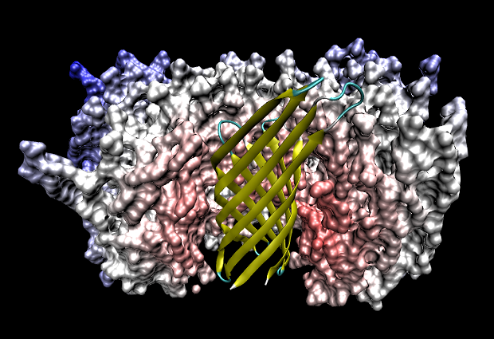

在这里介绍的最后一种方法是使用packmol，在构建的时候就直接把膜蛋白与磷脂混在一起而不是在建好了膜之后把膜蛋白塞进去。然而packmol基于文本操作不够直观，而且速度比较慢，但是效果更好，磷脂与膜蛋白帖得比较紧。

首先打开膜蛋白，比如a.pdb，按数字键7，按住shift拖动蛋白使蛋白位置比较好，一般让跨膜的轴垂直于Z轴，即与磷脂膜是垂直的。然后save coordinate到1.pdb，放到packmol可执行文件所在目录。

然后写一个in.inp然后 用packmol执行

tolerance 2.0                   //使得膜蛋白与磷脂膜分子之间距离不会小于2埃  
filetype pdb  
output bilayer.pdb  
  
structure 1.pdb   
number 1  
center                          //选择几何中心  
fixed 50. 50. 60. 0. 0. 0.      //说明将膜蛋白的几何中心固定到x/y/z为50,50,60的位置，后面三个数字控制膜蛋白的旋转角度，因为刚才已经用VMD修改了膜蛋白的朝向，与Z轴平行了（即垂直于磷脂膜），所以这里不用让它旋转。  
end structure  
  
structure dppc.pdb   
  number 150  
  inside box 0. 0. 20. 100. 100. 50.  
  atoms 28  
    below plane 0. 0. 1. 28.  
  end atoms  
  atoms 1  
    over plane 0. 0. 1. 48  
  end atoms  
end structure   
  
structure dppc.pdb   
  number 150  
  inside box 0. 0. 50. 100. 100. 80.  
  atoms 1  
    below plane 0. 0. 1. 52.  
  end atoms  
  atoms 28  
    over plane 0. 0. 1. 72  
  end atoms  
end structure

然后得到的结果如图12所示。

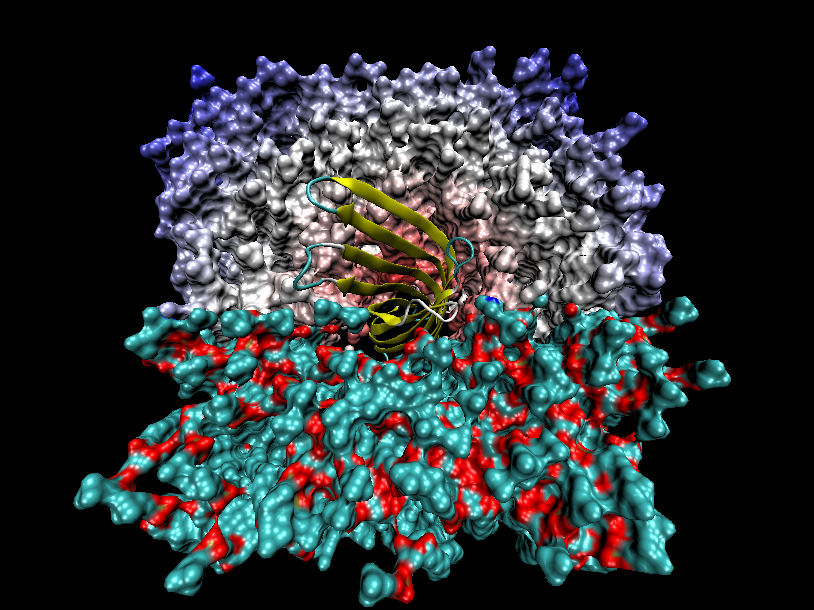
