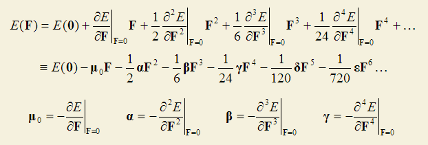
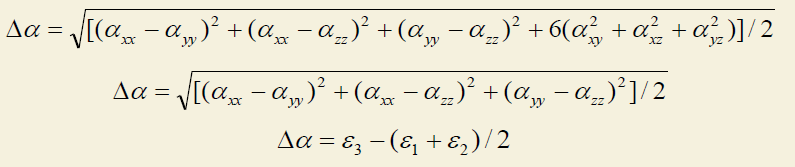
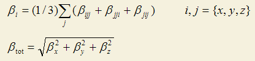
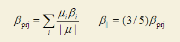
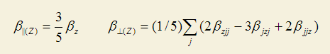

**使用Multiwfn分析Gaussian的极化率、超极化率的输出  
Using Multiwfn to analyze the polarizability and hyperpolarizability outputted by Gaussian**

文/Sobereva @[北京科音](http://www.keinsci.com)  
First release: 2014-Apr-27     Last update: 2023-Aug-11

## 1 前言

Gaussian中polar关键词是专门用来计算极化率α和第一超极化率β的，从Gaussian09 D.01开始也支持polar=gamma计算第二超极化率γ。Gaussian输出的很多信息总是令初学者很难看懂，（超）极化率的输出更是如此，内容杂乱，而且不同理论方法下输出的信息格式还差异很大，分析起来很不方便。Multiwfn的主功能24里的子功能1就是专门用来解析Gaussian的（超）极化率的输出的，使之简洁易懂。与此同时，Multiwfn还会计算一些对于分析（超）极化率十分重要的量，比如<α>、α的各向异性值、β在分子偶极矩方向的分量等等，这使得通过Gaussian研究（超）极化率变得方便得多。此文的目的就是介绍如何使用Multiwfn分析Gaussian的（超）极化率的输出。

顺带一提，在笔者讲授的北京科音中级量子化学培训班（<http://www.keinsci.com/KBQC>）中专门有一节“（超）极化率的计算”，极其详尽和细致讲解（超）极化率的计算所涉及的各种相关背景知识和实际计算方法，十分推荐需要做这部分计算的读者参加。

本文内容对应的是Multiwfn官网上的最新版本，可以在其主页<http://sobereva.com/multiwfn>上免费下载，不要用老版本。Multiwfn是最强大的波函数分析程序，此文介绍的只不过是它的一个附属功能而已。如果对Multiwfn不熟悉，建议阅读《Multiwfn FAQ》（<http://sobereva.com/452>）和《Multiwfn入门tips》（<http://sobereva.com/167>）。Multiwfn分析polar关键词输出的这个功能只支持Gaussian 09及之后版本，不支持更老版本。

Multiwfn的这个功能还支持计算与超瑞利散射(Hyper-Rayleigh Scattering, HRS)实验相关的各种量，在另一篇文章《使用Multiwfn计算与超瑞利散射(HRS)实验相关的量》（<http://sobereva.com/499>）当中做了详细介绍。

如果你使用了本文介绍的Multiwfn的功能，请在发表文章时提及研究中使用了Multiwfn提取Gaussian输出文件中的相关数据并计算了相关的量，并应当根据Multiwfn程序启动时提示的信息**恰当引用Multiwfn程序**。

## 2 Gaussian中（超）极化率的计算

这一节介绍在Gaussian中计算（超）极化率的基本原理和所需要的关键词。

将能量E对均匀外电场F进行Taylor展开得到如下式子

μ0就是分子的永久偶极矩矢量（无外场下的偶极矩）。α是分子的极化率，也称线性光学系数，是个3*3二阶张量。β是第一超极化率，也称分子的二阶非线性光学(NLO)系数，是个3*3*3的三阶张量。γ是第二超极化率，亦称分子的三阶NLO系数，研究得相对少一些。而更高的δ极少被讨论。（超）极化率数值和电场频率是相关的，外场频率为0的情况被称为静态（超）极化率；如果外场频率不是0，比如某一频率的光，对应的就是动态（超）极化率，或者叫含频（超）极化率。

Gaussian的polar关键词求这些量是通过导数方法，其原理很明确。如上式可见，求极化率要令能量对外场做两次导数，求第一超极化率要做三次导数。

求能量的导数分为三种情况：  
（1）解析导数。这种方法求导数又快又精确，但是编程实现很困难，特别是对于高级的后HF而言。这种方式求能量导数时需要用到分子轨道系数对外场的导数，这通过求解CPHF方程来实现。并且利用含频CPHF方程，可以得到动态（超）极化率。这种求（超）极化率的方式也被称为CPHF方法。  
（2）数值导数。这种方式通过有限差分方式得到能量的导数，也称为有限场(FF)方法。有限差分在所有数值算法书里都会介绍，比如求一个函数f在0处的导数可表示为f(0)=[f(0.001)-f(-0.001)]/(2*0.001)。通过这种方法求（超）极化率非常费时间，需要在不同数值、不同方向的外场下计算很多很多次单点，而且求高阶导数精度很差，因为每求一次数值导数都会由于数值噪音而累积误差，随着求导阶数增加误差迅速放大，做二阶以上导数时精度就很烂了（除非通过额外修正、外推等特殊方式处理）。另外，通过数值导数也没法求得动态（超）极化率。  
(3) 解析+数值混合导数。这就是基于低阶解析导数，再通过一次或多次有限差分求高阶导数以获得（超）极化率的方法。精度和速度介于全解析导数和全数值导数之间。

Gaussian在支持解析导数方面已经算是很好的，对于HF、DFT、半经验方法都能支持到三阶解析导数，因此可以全解析地得到静态和含频的α和β（而其它量化程序都很难对HF/DFT/半经验支持到这么高阶导数，通常也就能支持到二阶）。对这类支持三阶解析导数的方法，使用polar关键词就会直接给出α和β的结果。如果同时写上CPHF=RdFreq，并且在输入文件末尾空一行写上外场频率w，比如0.05 0.12 0.3或532nm 670nm（静态的情况总是会被计算，故不需要特意写），就会计算含频极化率α(-ω;ω)和含频第一超极化率β(-ω;ω,0)。如果要算的含频第一超极化率是SHG形式，即β(-2ω;ω,ω)，就写polar=DCSHG即可，此时CPHF=RdFreq可以忽略不写，并且此时β(-ω;ω,0)也会照样计算。

对于MP2等Gaussian只能支持到二阶解析导数的方法，可以全解析地计算α，但是若想计算β，就得再做一次有限差分才行。Gaussian中，此时直接写polar只会计算α，若还想得到β就得写polar=Cubic，会自动基于解析二阶导数做有限差分来得到三阶导数。

对于CISD、QCISD、CCSD、MP3、MP4(SDQ)等Gaussian只支持一阶解析导数的方法，直接写polar关键词会基于解析一阶导数做一次有限差分得到二阶导数，即α。若还想得到β就得写polar=DoubleNumer（等价于polar=enonly），会基于解析一阶导数做两次有限差分得到三阶导数。

对于CCSD(T)、QCISD(T)、MP4(SDTQ)、MP5等Gaussian只支持计算单点能的方法，写polar关键词会对能量做两次有限差分并由此得到α。对于它们在Gaussian里没有办法直接给出β。

注意对于HF、DFT、半经验以外的方法，Gaussian都没法给出含频（超）极化率。

若想得到更高阶导数计算更高阶超极化率，比如DFT下计算第二超极化率γ，需要基于其解析三阶导数做一次有限差分。从G09 D.01开始，对于支持三阶解析导数的方法可以用polar=gamma来算静态γ和动态的γ(-2ω;ω,ω,0)、γ(-ω;ω,0,0)，会基于解析三阶导数自动做有限差分来得到所需的四阶导数。末尾应空一行写上外场频率。

值得一提的是，利用Multiwfn，可以通过完全态求和方法基于Gaussian的CIS/TDHF/TDDFT计算的输出得到静态或动态的极化率和第一、二、三超极化率，见《使用Multiwfn基于完全态求和(SOS)方法计算极化率和超极化率》（<http://sobereva.com/232>）。Multiwfn还能图形化展现（超）极化率，见《使用Multiwfn通过单位球面表示法图形化考察（超）极化率张量》（<http://sobereva.com/547>）。

## 3 使用Multiwfn解析polar关键词的输出

对于上一节讨论的各种情况，polar关键词输出的信息都能被Multiwfn所解析。注意route section一定要写上#P，否则输出文件将无法被正确解析。

启动Multiwfn后，先输入Gaussian的polar任务的输出文件的路径，比如C:\CH3NH2_polar.out，然后进入主功能24，选1，之后会看到下面的菜单：  
-3 Set unit in the output, current: a.u.  
-2 Set output destination, current: Output to screen  
-1 Toggle loading frequency-dependent result for options 1 and 7, current: No  
0 Return  
1 "Polar" + analytic 3-order deriv. (HF,pure/hybrid DFT,semi-empirical)  
2 "Polar" + analytic 2-order deriv. (MP2,double-hybrid DFT,TDDFT,CIS...)  
3 "Polar=Cubic" + analytic 2-order deriv.  
4 "Polar" + analytic 1-order deriv. (CISD,QCISD,CCSD,MP3,MP4(SDQ)...)  
5 "Polar=DoubleNumer" or "Polar=EnOnly" + analytic 1-order deriv.  
6 "Polar" + energy only (CCSD(T),QCISD(T),MP4(SDTQ),MP5...)  
7 "Polar=gamma" + analytic 3-order deriv. (HF,DFT,semi-empirical)

选项1~7对应上一节提到的不同情况，当前你在什么情况下计算的就选哪种，然后Multiwfn就会输出分析的结果。比如你用了CCSD结合polar=doublenumer就应当选5。之所以要对此进行选择是因为不同情况下Gaussian的输出格式相差极大，Multiwfn必须知道你在什么情况下计算的，才能相应地对输出内容进行解析。选项1~7都可以给出α，只有1、3、5才会给出β，只有7才会给出γ。

如果在HF/DFT/半经验计算时用了polar CPHF=rdfreq或polar=DCSHG做了含频（超）极化率计算，或者用的是polar=gamma，默认情况下只会解析静态的（超）极化率。如果想让Multiwfn分析含频的，应当先选-1将其状态切换为Yes。当Gaussian输入文件里定义了多个频率时，如0.1,0.22,0.35，用户可以选择分析哪个频率下的结果。对于β，用户也可以选择分析β(-ω;ω,0)还是β(-2ω;ω,ω)，注意只有写了DCSHG时选择β(-2ω;ω,ω)才有意义。对于γ，可以选择分析γ(-2ω;ω,ω,0)还是γ(-ω;ω,0,0)。

默认情况下输出的单位是a.u.，如果选-3，也可以切换为SI或esu单位。默认情况下输出信息会显示到屏幕上，也可以选-2来更改为输出到当前目录下的polar.txt当中。

如果你使用的是DFT或MP2，且对当前体系又要做振动分析又要算极化率，那么没必要分别做freq和polar任务，只要做一次freq即可。用Multiwfn载入freq任务的输出文件，在Multiwfn此文介绍的界面里选择2 "Polar" + analytic 2-order deriv.即可提取极化率。

### 3.1 解析静态极化率和第一超极化率一例

下面就以分析甲胺在#P PBE1PBE/aug-cc-pVTZ polar关键词下得到的输出文件为例进行说明。  
当前例子用的是PBE1PBE，是DFT中常用的一种泛函，故对应的是前述第一种情况，因此当我们看到上面的菜单时应选1，然后马上会看到α和β的分析结果，下面将对各项的含义进行说明。我们先看α部分  
Dipole moment:  
X,Y,Z=   -0.506266    0.150290    0.000000   Norm=    0.528103

Static polarizability:  
XX=         25.04620  
XY=         -0.08830  
YY=         28.89110  
XZ=          0.00000  
YZ=          0.00000  
ZZ=         24.43580  
Isotropic average polarizability:         26.12437  
Isotropic average polarizability volume:       3.871231 Angstrom^3  
Polarizability anisotropy (definition 1):          4.18643  
Polarizability anisotropy (definition 2):          4.18363  
Eigenvalues of polarizability tensor:      24.4358      25.0442      28.8931  
Polarizability anisotropy (definition 3):          4.15314

如前所述，默认情况下所有输出的量都是以a.u.为单位。

极化率张量是个对称的3*3矩阵，故所以只有6个独立的矩阵元列了出来。每个体系的极化率的大小一般只用一个数值<α>来表示，也就是上面给出各向同性平均极化率，它是对XX、YY、ZZ取平均得到的。极化率也经常通过极化率体积来表示，上面也给出了。极化率并不是各向同性的，体系对不同方向射来的电场的响应是不同的。如上可见，Multiwfn也输出了极化率的各向异性值Δα，数值越大各向异性越强，球对称体系显然其值为0。各向异性可以以三种方式定义，分别如下所示，详见Multiwfn手册3.27.1节

ε代表极化率张量的本征值，它也被Multiwfn输出了出来。最常见的衡量极化率的各向异性程度是定义2，而定义3的形式一般是在衡量磁屏蔽张量各向异性时用的。

下面是第一超极化率部分的解析结果  
Static first hyperpolarizability:  
XXX=       13.173100  
XXY=        4.937890  
XYY=       13.647700  
YYY=      -35.484000  
XXZ=        0.000000  
XYZ=        0.000000  
YYZ=        0.000000  
XZZ=       -2.763570  
YZZ=        1.342190  
ZZZ=        0.000000

Beta_X=       24.05723  Beta_Y=      -29.20392  Beta_Z=        0.00000  
Magnitude of first hyperpolarizability:       37.836745  
Projection of beta on dipole moment:      -31.373491  
Beta ||     :      -18.824094  
Beta ||(z)  :        0.000000  
Beta _|_(z) :        0.000000

Gaussian的β的输出有个众所周知的问题，也就是符号是反的，即每个β元素的数值都应该乘以-1，至少直到G09 D.01版依然存在这个问题。有文章专门指出了这点，见《Gaussian程序计算的一阶超极化率的符号问题》（四川师范大学学报（自然科学版）,33,228）。这个问题在Multiwfn中已经被考虑进去了，Multiwfn输出的β的符号都是正确的。

β有3*3*3=27个元素。静态β满足Kleinman对称性，三个标号可以随意置换而完全不影响结果，比如xyy=yxy=yyx，只有10个元素是唯一的，所以Multiwfn也只输出了10个元素。

Beta_X、Beta_Y、Beta_Z衡量的是β在X、Y、Z方向上的分量。Magnitude of first hyperpolarizability体现了β的整体的大小。其定义分别如下所示

只有β在偶极矩方向上的投影值才是可以通过电场诱导二次谐波产生实验(EFISH)测量出来的，和实验值对比通常比的都是这个值。Multiwfn给出了β在偶极矩方向上的投影值（β_prj，一些文中也写为β_vec）。另一个文献中常见的量是Beta ||，||代表平行于偶极矩，它正比于β_prj

文献中常见的Beta ||(z)和Beta _|_(z)的定义如下所示，分别衡量的是平行和垂直于Z方向上的β的值

当偶极矩方向和Z方向一致时，Beta_Z=β_prj，Beta ||(z)=Beta ||。

值得一提的是，默认情况下，Gaussian会将输入文件里体系的坐标调整到标准朝向下，这通常会令体系发生旋转。Gaussian计算出的，也即Multiwfn所解析的，都是标准朝向下的结果，因此X、Y、Z可能和你的输入文件里的笛卡尔轴方向不对应。如果想避免自动调整到标准朝向，用nosymm关键词。

### 3.2 解析动态极化率和第一超极化率一例

此例使用Multiwfn解析polar关键词产生的动态（超）极化率。输入文件如下，分别计算外场为0.07和0.1 a.u.的情况。

#p PBE1PBE/aug-cc-pVTZ polar CPHF=RdFreq

test

0 1  
 C                 -0.55391731    0.43227932    0.14513431  
 H                 -1.29461381   -0.13844703    0.71478821  
 H                 -0.40071988    1.37810560    0.67504812  
 H                 -0.99858078    0.66864399   -0.83680924  
 N                  0.70741247   -0.31205725    0.11165308  
 H                  0.57479710   -1.18908235   -0.38659422  
 H                  1.39864521    0.20863272   -0.42322026

0.07 0.1

令Multiwfn载入输出文件，并进入主功能24里的子功能1后，先选-1切换成解析动态值，然后再选1。然后程序问载入哪个频率下的结果，此例我们选2，即w=0.07的情况。然后我们得到了w=0.07下的极化率输出。之后程序问分析β(-ω;ω,0)还是β(-2ω;ω,ω)的结果。由于没写DCSHG，我们只能选择β(-ω;ω,0)。输出如下

 Frequency-dependent first hyperpolarizability Beta(-w;w,0)  
 XXX=            16.334900  
 XYX= YXX=        7.369050  
 YYX=            16.593300  
 XZX= ZXX=        0.000000  
 YZX= ZYX=        0.000000  
 ZZX=            -2.918320  
 XXY=             8.947060  
 XYY= YXY=       15.473800  
 YYY=           -40.341800  
 XZY= ZXY=        0.000000  
 YZY= ZYY=        0.000000  
 ZZY=             1.240500  
 XXZ=             0.000000  
 XYZ= YXZ=        0.000000  
 YYZ=             0.000000  
 XZZ= ZXZ=       -2.796870  
 YZZ= ZYZ=        1.609830  
 ZZZ=             0.000000

 Beta_X=       29.34451  Beta_Y=      -30.96003  Beta_Z=        0.00000  
 Magnitude of first hyperpolarizability:       42.657048  
 Projection of beta on dipole moment:      -36.941911  
 Beta ||     :      -22.165146  
 Beta ||(z)  :        0.000000  
 Beta _|_(z) :        0.000000

和上一例相比，可见在含频外场下β值增大了。各项的含义和上例一致，不再累述。值得一提的是对于beta(-ω;ω,0)这种情况，只有i,j,k三个标号中的i,j可以互换，比如xyy=yxy≠yyx，张量的对称性没有静态β的那么高，故有18个独立的元素。不过，当外场频率不是很大时，Kleinman对称性是可以近似满足的，从上面的结果可见，诸如xyx和xxy相差不算很大。

假设我们要看w=0.1时的β(-ω;ω,0)，那么再次进入此功能，然后选1-3-1即可。

基于当前输出文件没法查看β(-2ω;ω,ω)，因为当前例子没写DCSHG。要看它的话应把polar后面加上=DCSHG重算一次，然后再进入此功能，并选择分析β(-2ω;ω,ω)情况的数据。

### 3.3 解析第二超极化率一例

这里我们对NH3计算第二超极化率γ。Gaussian输入文件是Multiwfn程序包里的examples\polar\NH3_gamma.gjf，内容如下

#p PBE1PBE/daug-cc-pVTZ polar=gamma  
[空行]  
pbe1pbe/aug-cc-pVTZ opted  
[空行]  
0 1  
 N                  0.00000000    0.00000000    0.11367600  
 H                  0.00000000    0.93902800   -0.26524400  
 H                 -0.81322200   -0.46951400   -0.26524400  
 H                  0.81322200   -0.46951400   -0.26524400  
[空行]  
532nm 680nm

想高精度计算小体系的γ，基组必须带非常充足的弥散函数，因此此例用了每个角动量加两层弥散的d-aug-cc-pVTZ，此基组非常昂贵。另外计算γ本身也很昂贵，所以哪怕是小体系，想高精度计算γ也需要给力的机子。polar=gamma关键词要求既计算静态的也计算动态的γ，如当前输入文件所示，对于动态的γ我们要计算的是532 nm和680 nm外场下的情况。

此例我们要解析γ(-2w;w,w,0)在680 nm下的结果。启动Multiwfn然后输入  
examples\polar\NH3_gamma.out  
24   //（超）极化率分析  
1  //解析Gaussian的(超)极化率的计算输出  
-1  //切换为载入动态(超)极化率（不选这个的话之后解析的将是静态的γ）  
7  //对应polar=gamma的情况  
2  //对应680 nm的情况  
2  //解析γ(-2w;w,w,0)形式的动态第二超极化率

输出信息如下  
 XXXX=     3091.740000  
 YXXX=        0.000000  
 ZXXX=        0.000040  
 XYXX=XXYX=        0.000000  
...略  
 YZYZ=YYZZ=     3677.510000  
 ZZYZ=ZYZZ=       -0.446631  
 XZZZ=        0.000000  
 YZZZ=       -0.400105  
 ZZZZ=    18072.400000

 Magnitude of gamma:       5998.270291  
 X component of gamma:     1574.323333  
 Y component of gamma:     1574.284000  
 Z component of gamma:     5569.774000  
 Average of gamma (definition 1), gamma ||:     8718.3813  
 Average of gamma (definition 2):     8737.028000  
 gamma _|_:     2875.049333

上面每一项的定义笔者就不在这里介绍了，因为在Multiwfn手册3.27.1节里已经写得非常详细了，这些量都是考察γ时经常要涉及的。

如屏幕上的提示所示，上面给出的gamma信息对应的是输入朝向下的，而之前提到的Multiwfn给出的alpha和beta都是标准朝向下的，这个差异要注意。
