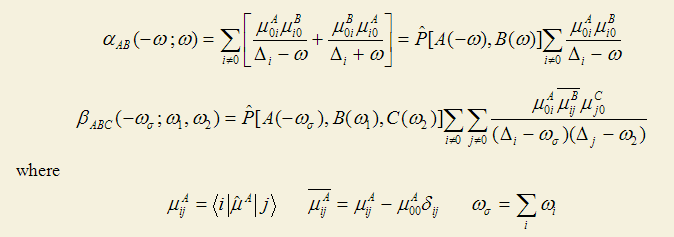
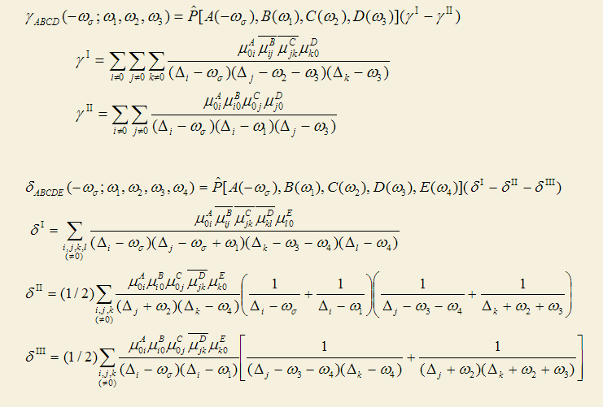
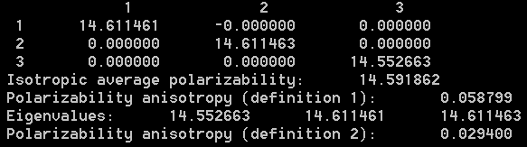
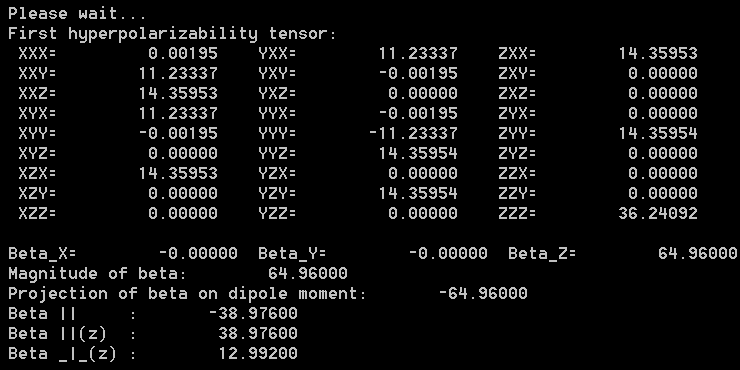
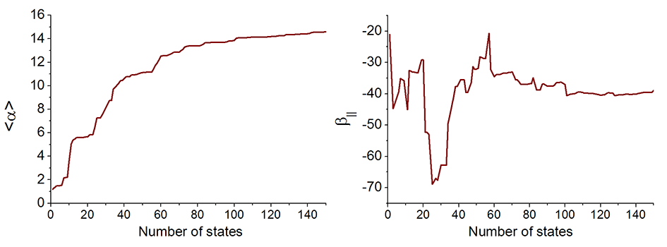
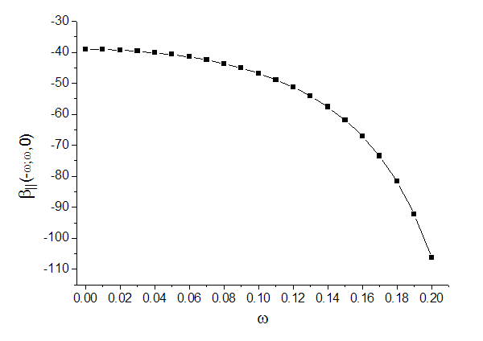
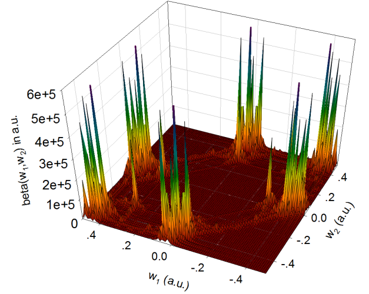

**使用Multiwfn基于完全态求和(SOS)方法计算极化率和超极化率**  
Using Multiwfn to calculate polarizability and hyperpolarizability based on sum-over-states method

文/Sobereva @[北京科音](http://www.keinsci.com/)

First release: 2014-Apr-27  Last update: 2023-Aug-11  
    

## 1 前言

完全态求和(SOS)是计算极化率和超极化率的常见方法。Multiwfn支持通过SOS计算静态/含频的极化率α、第一超极化率β、第二超极化率γ乃至第三超极化率δ。其中需要用到的各个态的能量及偶极矩，以及各个态之间的跃迁偶极矩，都可以利用Multiwfn基于Gaussian或ORCA的CIS、TDHF、TDDFT计算结果来产生。本文就介绍具体怎么实现。

虽然Gaussian直接可以用TD(SOS)关键词基于TDHF、TDDFT的结果做SOS计算，但是只能给出极化率，显然太局限了，而且对常用的CIS也不支持SOS计算。

Multiwfn可以在其主页<http://sobereva.com/multiwfn>上免费下载，请用最新版本。Multiwfn是特别强大的波函数分析程序，此文介绍的只不过是它的一个附属功能而已。如果对Multiwfn不熟悉，建议阅读《Multiwfn波函数分析程序的意义、功能与用途》（<http://sobereva.com/184>）和《Multiwfn入门tips》（<http://sobereva.com/167>）。

另外，在《使用Multiwfn分析Gaussian的极化率、超极化率的输出》（<http://sobereva.com/231>）一文中，介绍了怎么使用Multiwfn分析Gaussian的polar关键词产生的极化率和超极化率的输出，其中也介绍了一些（超）极化率的基本概念，有兴趣可以看看。polar关键词所用的导数方法是另一种最重要的计算（超）极化率的方法。

Multiwfn的SOS功能还可以做对于考察第一超极化率本质非常重要的双能级分析和笔者提出的三能级分析，在另一篇博文有专门说明：《使用Multiwfn对第一超极化率做双能级和三能级模型分析》（<http://sobereva.com/512>）。

## 2 SOS方法

SOS的具体原理这里不讨论，主要就是介绍一下实际的计算公式。α、β、γ、δ的SOS计算公式在J. Chem. Phys., 99, 3738 (1993)里都能找到。注意很多很多文献、书籍里给出的SOS公式都是错的。计算极化率和第一超极化率的公式如下

A,B,C...这样的标号用来表示方向{X,Y,Z}。ω是外场能量，为0时对应的是静态的（超）极化率。加和是对所有激发态加和，Δ代表激发态相对于基态的激发能。P表示对方括号里的项进行各种可能的置换。比如对于β，P的方括号里有三项，因此有3!=6种排列，要对这6种情况的结果加和。μ_A_ij代表i、j两个态的跃迁偶极矩的A方向的分量。i=j时对应的就是第i个态的偶极矩，故μ00就是基态的偶极矩。δij是kronecker符号，i=j时为1，否则为0。

类似地，第二、第三超极化率的公式为

可见，做SOS计算并不困难，公式都是现成的，只要提供各个激发态的激发能、偶极矩，以及各激发态之间的跃迁偶极矩就行了。通过ZINDO、CIS、TDHF、TDDFT等电子激发方法都能产生这些量。CIS(D)也可以，用于SOS时跃迁偶极矩依然是用CIS的，但激发能是通过二阶微扰修正的，以此更好地考虑电子相关效应。

整个SOS计算过程分为两部分(1)电子激发计算(2)依据SOS公式进行循环累加。对于(2)部分，α和β计算本身几乎不花时间，γ稍微耗点时间。对于δ，当考虑的态数很多时，从上式可见需要对激发态做四重循环累加，而且包含3^5=243个分量（尽管有些分量是相同的可以避免重复计算），故计算δ还是颇费时的。对于一般我们感兴趣的α、β和γ，SOS的整个计算花费主要都是用(1)上，特别是对于大体系、高质量基组的情况。注意(2)部分耗时本身和基函数数目无直接关系，只取决于考虑的态数，但(1)的耗时与基函数数目直接相关。

ZINDO是半经验方法，计算很快，SOS/ZINDO组合很廉价，经常用在计算有机大共轭体系NLO性质上。而原理上更精准的CIS/TDHF/TDDFT显然就耗时得多的多了。SOS原则上要对所有态进行求和，实际研究中虽然用不着考虑所有态，但一般也得在电子激发过程中计算40~120个态，远高于一般研究电子激发问题要求的态数。求解的态数越多，CIS/TDHF/TDDFT就明显越耗时。本来这类从头算方式的电子激发计算用在很大体系就比较困难，再加上为了做SOS又要计算那么多态，而且较准确计算β，特别是γ，又需要弥散函数丰富的较大基组，SOS结合CIS/TDHF/TDDFT能应用的尺度是很有限的。比起SOS，如果所有的导数都能解析地计算的话，用导数方法计算（超）极化率是更好的选择。不过支持高阶解析导数从编程角度来讲很困难，Gaussian能做到三阶解析导数（对应β）的方法只有HF、DFT和半经验，它们不支持四阶解析导数来由此产生γ。虽然基于三阶解析导数自行做一次有限差分也能得到静态的γ，但是没法得到含频的γ，这就不得不用SOS了。另外，只要有了SOS计算所需的信息，每次SOS的计算很快，只不过是做简单的循环及加减乘除而已，因此可以便利地研究α、β和γ随频率的变化，这是SOS的一个鲜明的优点。

## 3 Multiwfn的SOS计算功能

Multiwfn的SOS功能对应于主功能24里的子功能2，能够计算极化率和第一、二、三超极化率，计算效率很高，被充分地并行化（机子是几个核建议就在settings.ini文件里把并行线程数nthreads设成几）。而且还能十分方便地计算α、β、γ随着考虑的态数发生的变化以检验SOS的收敛性，以及α、β、γ随着外场频率的变化而发生的变化。

Multiwfn做SOS时要读取的信息包括基态和激发态偶极矩、激发能，以及所有态间的跃迁偶极矩。这些信息可以从两种渠道读取  
(1) 直接从Gaussian的ZINDO/CIS/TDHF/TDDFT输出文件中读取。不幸的是，TDHF/TDDFT任务的输出文件不包含激发态之间的跃迁偶极矩，而CIS和ZINDO虽然有alltransitiondensities关键词可以输出激发态之间的跃迁偶极矩，但是并没有办法一次性给出每个激发态的偶极矩（除非改Gaussian代码，比较复杂），而这些信息都是计算超极化率要用到的。故直接读取Gaussian输出文件，获得的信息只够计算极化率的，故此时Multiwfn也只输出极化率。

(2)文本文件。用户可以把各种各样量化程序产生的SOS计算所需信息按照类似下面的格式写到一个文本文件里，然后在Multiwfn启动时读取之并做极化率和超极化率计算。下面这个简单例子假设仅考虑两个激发态  
2      // 激发态数  
 1  1.1        // 第1个激发态，其序号以及激发能(eV)  
 2  3.2  
 0 0  0.845 0.2 0.4    // 0代表基态，此项的含义是基态偶极矩的XYZ分量(a.u.)  
 0 1  0.231 0.3 0.7    // 基态到第1激发态的跃迁偶极矩  
 0 2  0.112 0.564 0.21  
 1 1  0.021 0.465 0.0    // 第1激发态的偶极矩  
 1 2  0.001 0.3 0.11     // 第1到第2激发态的跃迁偶极矩  
 2 2  0.432 0.14 0.42    // 第2激发态的偶极矩  
可见，这种文本文件的意义很容易理解，也很容易编写。即先给出激发态数，然后给出每个激发态的激发能，然后做i;j>=i循环，给出各个态的偶极矩以及态之间的跃迁偶极矩即可。格式是自由格式，也就是小数位数多少都可以。  
（如果你只想计算极化率，那么1 1那行以及之后的行都可以不写，因为这部分信息用不到，但此时需要把第一行写为负数，例如上例写为-2，这样Multiwfn才能知道这一点）

Multiwfn可以直接基于Gaussian或ORCA的CIS/TDHF/TDDFT输出文件计算出所有态之间的跃迁偶极矩以及每个态的偶极矩，这在《使用Multiwfn计算激发态间的跃迁偶极矩和各个激发态的偶极矩》（<http://sobereva.com/227>）当中已经详细介绍过，利用这些信息就可以用SOS方法计算极化率和超极化率了。为了方便起见，在Multiwfn中这些信息可以直接输出成上述格式的文本文件，用于Multiwfn的SOS计算之目的。

下面就介绍一个完整的例子，利用Multiwfn基于Gaussian的CIS计算结果，通过SOS方法得到氨分子的极化率和第一、第二超极化率。对于SOS之目的，用TDHF相比CIS改进不大，而耗时增加了不少。TDDFT也同样比CIS更耗时得多，用的杂化泛函的杂化成份越小，通常超极化率的计算结果比CIS大得越多（这是因为激发能也往往越低，使SOS公式的分母因此变小）。至于这令结果更准了还是更差了，不好说。

## 4 实例：NH3的SOS/CIS计算

本例计算使用Gaussian 09W B.01。

输入文件的开头部分如下，完整的输入文件是Multiwfn的examples目录下的NH3_SOS.gjf。  
%chk=C:\gtest\NH3_SOS.chk  
# CIS(nstates=150)/gen IOp(9/40=5)  
[空行]  
CCSD/def2-TZVPPD opted  
[空行]  
0 1  
 N                  0.00000000    0.00000000    0.11461200  
 H                  0.00000000    0.93646700   -0.26742900  
 H                 -0.81100400   -0.46823400   -0.26742900  
 H                  0.81100400   -0.46823400   -0.26742900  
...[def2-TZVPPD基组定义部分略]

这里有几个要点，首先是计算的态数。前面已经提到过，计算SOS需要算很多激发态。通常来说，越低的激发态对SOS的结果影响越大（但个别高阶激发态可能也有很大影响），随着考虑的态数增加结果会逐渐收敛。此例考虑150个态已经足够了，结果肯定已经收敛了，下文还会专门检验这一点。做（超）极化率计算需要具有丰富弥散函数的基组才能得到较好定量结果，超极化率的阶数越高，对弥散函数的数量和角动量要求越高。基组这里用的是def2-TZVPPD（JCP,133,134105），是在def2-TZVPP基组上为了得到较好极化率而增加了弥散函数的版本，计算第一超极化率也够用了。由于这个基组不是Gaussian自带的，所以从EMSL基组库中拷出来，通过自定义基组方式使用。对于计算SOS之目的，写上IOp(9/40=5)是必要的。因为默认情况下只有大于0.1的MO跃迁系数会被输出到输出文件中，而较小的都不输出，这样的话Multiwfn基于这些系数算出的各个态的偶极矩以及它们间的跃迁偶极矩结果将会不准确。IOp(9/40=x)的含义是将系数大于10^-x的组态都输出出来，因此IOp(9/40=5)会把系数绝对值大于0.00001的组态都输出，这种情况下Multiwfn给出的结果就足够准确了（x设为大于5没意义，因为Gaussian输出时的格式只有5位小数）。计算过程中不要求必须用#P。

对于此例，假设要用TDDFT，就写成比如# TD(nstates=150) CAM-B3LYP/gen IOp(9/40=5)即可。

将计算后得到的chk文件用formchk转换成.fch文件，假设叫NH3_SOS.fch，并假设它和Gaussian输出文件NH3_SOS.out都在C:\gtest目录下。然后启动Multiwfn，依次输入  
C:\gtest\NH3_SOS.fch  
18    //电子激发分析功能  
5     //计算态之间的跃迁偶极矩  
C:\gtest\NH3_SOS.out  
 3     //将计算的结果，连同激发能等各种SOS所需信息，组合成Multiwfn的SOS功能所需的输入文件  
很快就计算完毕并在当前目录下生成了SOS.txt文件，其格式和上一节介绍的一致。

重启Multiwfn，依次输入  
SOS.txt  
24    //（超）极化率分析  
2      //用SOS方法计算（超）极化率  
屏幕上输出了每个态的激发能、基态偶极矩，并显示出SOS计算菜单。如屏幕提示所述，一切输出信息都以a.u.为单位。（超）极化率的a.u.、SI和esu单位的转换关系可参见手册3.27.1节末尾。

菜单中先选哪项都可以，没有顺序要求。假设我们先计算静态极化率，选择1，然后输入0（即外场频率为0），屏幕上立刻看到结果，如下所示。屏幕上的输出都可以直接拷贝到文本文件里，如果不知道怎么做，参考手册5.4节。

Multiwfn不仅输出了极化率张量，还输出了各种很重要的相关的量，它们的定义可参看前述的《使用Multiwfn分析Gaussian的极化率、超极化率的输出》或手册3.27.1节。从输出中可见，各向同性平均极化率<α>的结果为14.59，和实验值14.56(Mol. Phys.,33,1155)吻合得贼好。再来看看动态极化率。选1，输入外场频率0.0719，此时<α>的结果为14.86，比静态的有所增大。输入频率的时候默认都是以a.u.为单位，但如果你想以nm为单位输入频率也可以，见屏幕上的提示。

接下来计算第一超极化率β(-(ω1+ω2);ω1,ω2)。我们主要感兴趣的是β在偶极矩方向的分量β||，因为这是可以通过电场诱导二次谐波产生实验(EFISH)测得的，因此可以用于检验结果的准确性。

先来计算β(0;0,0)。选2，然后输入ω1和ω2的值，此时即输入0,0。输出如下

从输出中看到β||值为-38.98。手头没有相应的实验值，但可以和高精度CCSD(T)下计算的对比，其值为-34.3（JCP,98,3022），可见还是很接近的。

ω=0.0656下的β||(-2ω;ω,ω)是有实验数据的，值为-48.9±1.2。我们也通过SOS方法算算看。选2，输入0.0656,0.0656，从结果中看到β||值为-49.69，和实验吻合得相当好。

不过需要提醒的是，尽管这一节的例子和实验吻合得颇为不错，但对于其它体系情况远非总是这么乐观。SOS/CIS对小分子往往明显高估β，见A. Hernández-Laguna et al. (eds.), Quantum Systems in Chemistry and Physics, Vol. 1, p111）；也有明显低估的时候，比如JCP,125,024101研究的两种D-A型π共轭分子。

下面算一下第二极化率γ。选3，然后还是输入外场频率，这里输入0,0,0以得到静态γ。计算γ相对耗时一点，故程序默认不用所有的态，而允许你输入考虑多少态。这里把所有态都考虑，故输入150。程序输出了γ张量的全部分量，以及一些相关信息。通常主要感兴趣的是γ的平均值，结果为928.72。由于手头没有实验值，精度如何不清楚，但可能不会太高，一方面是SOS/CIS在定量上本身算不上多精确，CIS对电子相关考虑不足，另一方面是基组用得不算大。要想很准确计算第二极化率，有时得用到诸如d-aug-cc-pVTZ这样的程度（它比常用的aug-cc-pVTZ的弥散函数数目又多了一倍）。

虽然Multiwfn还能计算第三超极化率δ，但这里就不举例了，因为计算时间会很长。而且δ并不重要，计算δ对方法、基组要求也都会极苛刻。

前面已经提到过，做SOS很重要的一个问题是所用的态数必须足够多，SOS在原理上是要考虑所有激发态的。这也就是说，比如实际计算取了n个态，那么随着考虑的态数的增多，考虑到n个态之前结果就必须已经基本收敛了。我们来作一下静态极化率随态数的变化图。选择5，然后输入0，马上在当前目录下产生了alpha_n.txt文件。每一列的含义在屏幕上都已经清楚地提示了。将此文件直接拖入到Origin里，把第一列和第二列分别作为X和Y轴数据作曲线图，就得到下面的左图，展现了<α>随着态数增加的收敛性。类似地，若要研究静态β||的收敛性，选6，输入0,0，对输出的beta_n.txt里的第一列和第七列作成曲线图，就得到了下图的右图。另外还可以用选项7研究γ的收敛性。

从上图可见，无论是<α>还是β||，在100个态的时候都已经收敛了，继续增加态数结果变化很小，因此此例用了150个态是足够多的，或者说只取150个态不会造成明显的态截断误差。如果只是要得到定性正确的结果，实际上取70个态也勉强够了。SOS的收敛性和体系特征关系密切，需要用多少得实际进行检验，很多大体系往往取40、50个态就足够了。

用Multiwfn还可以方便地研究（超）极化率随外场频率的变化。如果要研究极化率，选15，然后输入频率的起始值、终止值和步长就行了，每个频率下的极化率都会被计算并输出到当前目录下的alpha_w.txt里，然后也是可以直接用origin对相应的列进行作图。对于研究β和γ随频率的变化，可以分别用选项16和17实现。由于β和γ分别涉及到两个和三个频率，存在倍频、差频、和频等情况，比较复杂，用户需要自行编写一个文本文件让Multiwfn载入，每一行对应一对儿要计算的外场频率。比如我们这里研究β(ω;ω,0)随着ω从0增加到0.2过程中的变化，步长为0.01。为了方便，我们用excel，在A1~A21单元格通过拖拉产生0.0,0.01,0.02...0.2序列，并令B1~B21等于0。然后选择“另存为”，格式选择文本文件（制表符分隔），保存到比如C:\freqlist.txt里面，文件内容应当是这样  
0 0  
 0.01 0  
 0.02 0  
 ...  
 0.19 0  
 0.2 0  
在Multiwfn里选16，然后输入C:\freqlist.txt。很快就算完了，结果输出到了当前目录下beta_w.txt下面。每一列含义在屏幕上也明示了。我们将此文件拖进Origin，对第一列(ω)和第8列(β||)进行作图，结果如下

程序还同时在当前目录下输出了beta_w_comp.txt，里面是beta的所有分量随频率的变化。

Multiwfn的SOS功能还可以对β(-(ω1+ω2);ω1,ω2)的两个入射光频率做二维扫描，得到下面这种图，对于讨论一些问题很有益，详见此帖<http://bbs.keinsci.com/thread-15455-1-1.html>。

Multiwfn的SOS功能的界面里还有很多其它选项，限于篇幅就不一一介绍了，一看相应的选项文字和屏幕上的提示就秒懂，请结合手册里的说明自行尝试。
