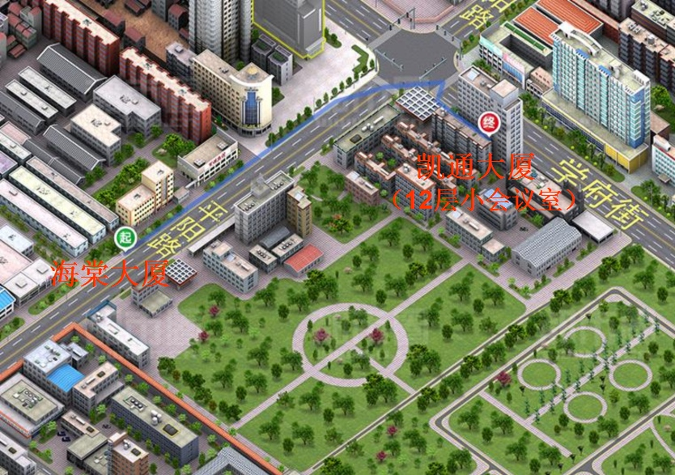
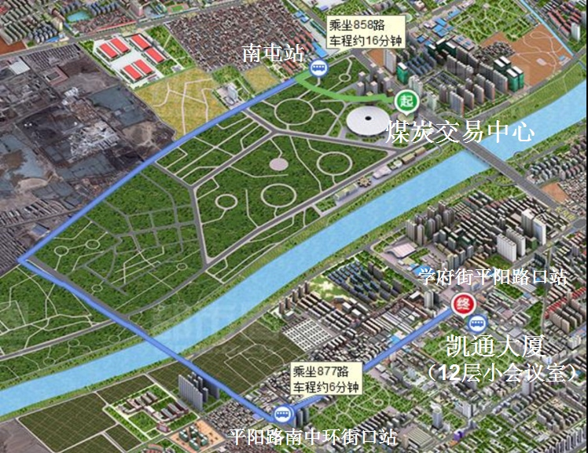
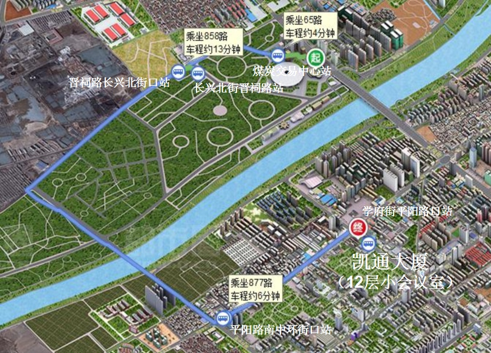

**第一届思想家公社理论与计算化学超会议的通知**

发布日期 2014-Jun-8

思想家公社QQ群（18616395）成立于2006年3月1日，目前成员已超过1000名，主要由从事理论、计算化学的研究生、青年教师所组成。此群讨论话题以理论、计算化学为主，也同时涵盖科研工作者的各方面的日常。  
  
鉴
于参加2014年6月13日山西太原的第十二届全国量子化学会议的群成员较多，借这次机会，思想家公社将于此会议前一天晚上举办“第一届思想家公社理论与
计算化学超会议”。本次会议的目的在于增进群成员的相互了解，增强群的凝聚力，给大家能够真正的畅所欲言的机会，平等、自由、活泼、融洽地共商理论与计算
化学发展战略。  
  
此次超会议形式上接近于茶话会，可以看成是把QQ群里的讨论在三次元的具现化。此次会议与普通的学术会议有着质的差异，故
称超会议（“超”字借鉴niconico超会议）。此会议坚决拒绝沉闷、死板、虚伪，不像通常的学术会议那样一个人在台上鼓吹自己的工作、忽悠台下被蒙在
鼓里的听众，而是大家并发地讨论/提问，说真话，讲实话。由于是小规模的内部讨论，因此可以随意地指名道姓地谈论、批评国内外任何有名气的人的工作，无需
担心得罪任何学术权威。次会议也坚决禁止按资排辈、倚老卖老，无论是还没入门的学生还是千人杰青长江院士之类，将一律平等。希望这次会议能成为以“实话实
说”为最大特色的理论与计算化学的会议，令与会者在短短两个小时的会议期间有真正的收获。如果以后还举办思想家公社理论与计算化学超会议，也将延续这一特
色。  
  
此会议没有明确安排，会议过程中可能会提供一些话题，供与会者们一起自由讨论。由于是第一次举办超会议，所以很多地方有待摸索。如果有什么好的建议，请联系sobereva@sina.com或在思想家公社群里提出。  
  
  
会议时间：2014年6月12日晚上6:50~8:50   
  
会议地点：山西省太原市凯通大厦12层小会议室  
  
参加方法：条件不限，无需注册，无需付费，来去自由，可中途随时加入  
  
  
会议主席：卢天 （思想家公社群主Sobereva之一）  
  
主办单位：北京科音自然科学研究中心  
  
特别鸣谢：思想家公社成员Wei(170759977)以及相关人员在租赁会议室上提供了关键性的帮助  
  
会议咨询：发邮件至sobereva@sina.com，或者在思想家公社QQ群里询问。  
  
  
注意事项：禁止吃零食、乱扔垃圾、抽烟、吐痰、说粗话、人身攻击、肢体冲突、睡觉。可化妆或蒙面以隐匿实际身份。茶水自备。

**交通路线：**

从海棠大厦出发

从煤炭交易中心出发（路线1）

从煤炭交易中心出发（路线2）

