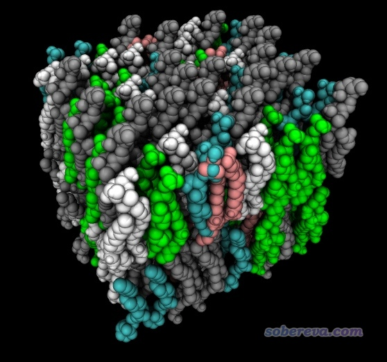

**生成混合组分的磷脂双层膜结构文件的工具genmixmem**  
genmixmem: A tool to easily generate structure file of phospholipid bilayer membrane with mixed component

文/Sobereva@[北京科音](http://www.keinsci.com)

First release: 2014-Jul-23   Last update: 2021-Nov-14

## 1 前言

构建磷脂膜的程序和办法不少，比如CHARMM-GUI、Packmol等等，但都有这样或那样的缺点。比如Packmol构建双层膜往往要迭代很多次才能收敛，得到的结构往往还有好多空隙。而CHARMM-GUI是在线程序，没法离线使用，而且支持的磷脂数目有限，碰上一些特殊的磷脂、双层膜中插入的小分子，CHARMM-GUI就没法用了，而且还只支持CHARMM力场。

为了能灵活、方便、快速地构建磷脂双分子膜，笔者专门开发了这个genmixmem程序。只要提供磷脂（或者胆固醇之类小分子）的结构文件，以及一些参数信息，程序就可以瞬间构建出磷脂双分子膜，尤其适合用于GROMACS中模拟的目的。

genmixmem最新的1.2版下载地址：<http://sobereva.com/soft/genmixmem_1.2.zip>  
其中有预编译好的Windows下的可执行文件（genmixmem.exe）、Linux下的可执行文件（genmixmem）、源代码以及示例文件。

如果此程序在你的文章中使用了，请这样引用：Tian Lu, genmixmem program, <http://sobereva.com/245> (accessed month day, year)

PS：笔者之前还写过《生成磷脂双层膜结构文件的小工具genmem》（<http://sobereva.com/222>），但genmem只能用于产生纯膜。genmixmem已经可以完全取代genmem的功能。

## 2 一个例子

此程序使用很简单。在程序目录下写个名为input.txt的输入文件，然后启动程序即可。下面直接给出一个例子输入文件，同时附带注释

mixmem.pdb     //输出文件名  
 5     //磷脂的类型数  
 64    //每层磷脂的数目  
 64    //让磷脂均匀排布在边长为多大的盒子里（埃）  
 0     //1=允许让磷脂绕Z轴随机旋转, 0=不允许, -1/-2/-3=在第二层里旋转45/90/180度  
 80.5,39.5     //参考原子所在的第一层和第二层的Z坐标位置  
 0     //是否让两层磷脂图案对称，0=不要求，1=要求  
 #  
 #下面是每个磷脂类型的结构文件，在每层中的数目，以及参考原子是几号原子  
 #  
 pdbinput\DGDG343z.pdb,20,27  
 pdbinput\LysoPGz.pdb,10,5  
 pdbinput\MGDG366z.pdb,14,26  
 pdbinput\PA342z.pdb,15,21  
 pdbinput\PC364z.pdb,5,24

对于此例，启动genmixmem后，程序就从指定的那些pdb中读取磷脂结构，根据指定的每种磷脂的数目和设定的相关参数产生双分子层结构，输出到当前目录下的mixmem.pdb。当前目录下还出现了mixmem.txt，内容是各个磷脂的残基名在mixmem.pdb里的出现顺序和数目。如果你要用GROMACS做当前体系的模拟，mixmem.txt里的内容应当都拷到拓扑文件的[ molecules ]字段里，这样就和mixmem.pdb精确对应上了。

此例中，每层的8*8=64个磷脂分子均匀分布在64*64埃的区域里，磷脂都是顺着Z方向。每种类型的磷脂的分布是随机的，每次运行程序给出的排布都会不同，因此可以用来产生大量不同的初始结构。此例在生成膜结构时没有允许磷脂分子绕着Z轴随机或以某种方式旋转。第一层和第二层膜中每个磷脂的参考原子分别要求出现在Z=80.5和39.5埃的平面上，参考原子选的是每个磷脂的丙三醇部分的中央那个碳（由于这个碳通常在磷脂的最关键的位置，所以通常用它当参考原子来对磷脂定位，当然也可以取别的原子）。此例用了5种磷脂，想增加或减少类型数的话，在输入文件末尾增加或删去磷脂定义，并且修改input.txt的第二行的数字即可。

此例得到的结果如下

如果读者用的是Linux版genmixmem，注意此例末尾5行应当写成这样  
"pdbinput/DGDG343z.pdb",20,27  
 "pdbinput/LysoPGz.pdb",10,5  
 "pdbinput/MGDG366z.pdb",14,26  
 "pdbinput/PA342z.pdb",15,21  
 "pdbinput/PC364z.pdb",5,24

## 3 相关使用细节

输入的磷脂pdb文件中，磷脂头部应当冲着Z轴正方向。旋转分子可以在VMD或GaussView等程序里做，也可以通过GROMACS的editconf命令来做，比如  
gmx editconf -f MGDG366.pdb -o MGDG366z.pdb -align -1 0 0 -princ -center 0 0 0  
如果之后发现MGDG366z.pdb里的头部方向恰好反了，就把上面命令里的-1改成1。

磷脂结构文件里的磷脂应当比较直，以避免生成的结构中相互交错而导致不合理接触。可以用可视化程序SAMSON（<https://samson-connect.net>）把磷脂拉直，里面有个twist工具实现这个目的超级方便，笔者录了一段演示视频请观看：<http://sobereva.com/attach/245/SAMSON_straighten.mp4>。可惜SAMSON目前免费版里面twist工具已经没法用了，需要花钱买收费版（虽然收费版也可以申请免费试用）。笔者还总结了其它几种把分子结构拉直的简便做法，见《利用Gaussian或ORCA程序把分子结构拉直的几种方法》（<http://sobereva.com/594>）。

虽然此程序目的是产生磷脂层，但组成并不限于磷脂分子，比如包含胆固醇等其它分子也都可以，只要设置对应的pdb文件即可。

普通的磷脂头部的面积在65 Angstrom^2左右，因此你可以由此大致估计盒子边长设多少合适。比如每层64个的话，盒子边长用sqrt(65*64)=64.5埃往往是个大致合理的数值。

genmixmem并不会像Packmol那样利用优化算法来让磷脂分子刚性地旋转以避免过近的接触。虽然此程序生成的膜结构中难免有些不合理接触，但这不是什么问题，因为MD之前做优化就能解决不合理接触。即便没法彻底解决掉某些局部区域的高斥力，只要做MD一开始的时候用非常小的步长，比如0.5fs，稍微跑一下也就解决了。

顺带介绍一个笔者做磷脂膜模拟的经验。如果在磷脂两端加水之后做MD的过程中发现有水钻进了磷脂膜的疏水部分，可以给水在Z方向加上限制势，跑几百ps之后磷脂分子就恰当地弛豫了，磷脂之间也没有什么缝隙了。此时去掉限制势再做常规模拟时，水分子也就没机会钻进磷脂膜的疏水区了。

## 4 关于创建磷脂膜的拓扑文件

在北京科音分子动力学与GROMACS培训班（<http://www.keinsci.com/workshop/KGMX_content.html>）讲生物膜模拟的部分我非常详细讲怎么基于genmixmem构建的膜结构做分子动力学模拟，包括拓扑文件的准备过程。鉴于也经常有genmixmem的用户在网上问我怎么得到做GROMACS模拟对应的拓扑文件，我这里就很简单地说一下。

专门为生物膜提出的力场有很多，如kukol（JCTC, 5, 615）、Poger（JCTC, 6, 325、JCC, 31, 1117）、54A8_v1（JCTC, 15, 5175）、Slipids（<http://www.fos.su.se/~sasha/SLipids/Downloads.html>）、Lipid17（<https://github.com/xiki-tempula/gmx_lipid17.ff>），等等。比如说你做膜模拟打算用kukol力场，在JCTC, 5, 615 (2009) DOI: 10.1021/ct8003468一文的补充材料里可以得到它支持的DPPC、DMPC、L-POPG、D-POPG、POPC磷脂的itp文件，以及预平衡好的各种膜的pdb结构文件。为了确保磷脂分子的拓扑文件里的原子顺序和膜结构里相应磷脂分子的原子顺序相一致（这是GROMACS能正常模拟所要求的），建议从力场作者预平衡好的整个膜的pdb文件里抠出来各类磷脂部分保存成磷脂分子的pdb文件（还要按照前述做法拉直），然后用它们基于genmixmem构建磷脂的结构文件。膜体系的top文件自己按照GROMACS拓扑文件一般规则手写就行了，比如构建的膜里面有POPC和DMPC两类磷脂，就要在里面恰当位置写上#include "popc_53a6.itp"和#include "dmpc_53a6.itp"，这俩itp是kukol膜力场文章补充材料里给的POPC和DMPC的itp文件（如果它们不在当前目录下的话要写实际的路径）。不同磷脂力场兼容不同的主力场，会用到里面的原子类型，比如kukol磷脂力场与G53A6力场兼容，它用到了G53A6里的原子类型，所以显然要把G53A6的主top文件forcefield.top也include。genmixmem运行完之后会在mixmem.txt里给出各个磷脂出现顺序，它与产生的磷脂膜结构文件里磷脂的出现顺序对应，要将它们拷到top文件的[ molecules ]里面。

下面一个典型的top文件例子，有64个DMPC和64个POPC，在genmixmem产生的磷脂膜结构的基础上还用gmx solvate加了SPC水（必须手动去掉出现在磷脂膜疏水区的水，最后剩下4455个），所以[molecules]最后有SOL 4455，而且还include了spc.itp。[ molecules ]里的POPC和DMPC分别对应popc_53a6.itp和dmpc_53a6.itp里定义的磷脂分子名字。

#include "gromos53a6.ff/forcefield.itp"  
#include "gromos53a6.ff/spc.itp"  
#include "popc_53a6.itp"  
#include "dmpc_53a6.itp"

[ system ]  
64 DMPC + 64 POPC in water

[ molecules ]  
POPC 1  
POPC 1  
DMPC 1  
POPC 1  
POPC 1  
POPC 1  
POPC 1  
POPC 1  
POPC 1  
DMPC 1  
POPC 1  
DMPC 1  
DMPC 1  
DMPC 1  
POPC 1  
POPC 1  
POPC 1  
POPC 1  
DMPC 1  
POPC 1  
POPC 1  
POPC 1  
POPC 1  
POPC 1  
POPC 1  
DMPC 1  
DMPC 1  
DMPC 1  
DMPC 1  
POPC 1  
POPC 1  
DMPC 1  
POPC 1  
POPC 1  
DMPC 1  
DMPC 1  
DMPC 1  
POPC 1  
DMPC 1  
DMPC 1  
POPC 1  
POPC 1  
DMPC 1  
DMPC 1  
POPC 1  
DMPC 1  
DMPC 1  
POPC 1  
DMPC 1  
DMPC 1  
DMPC 1  
POPC 1  
DMPC 1  
DMPC 1  
POPC 1  
POPC 1  
DMPC 1  
DMPC 1  
DMPC 1  
DMPC 1  
DMPC 1  
DMPC 1  
POPC 1  
DMPC 1  
DMPC 1  
DMPC 1  
DMPC 1  
POPC 1  
DMPC 1  
DMPC 1  
POPC 1  
DMPC 1  
DMPC 1  
DMPC 1  
POPC 1  
POPC 1  
POPC 1  
POPC 1  
POPC 1  
POPC 1  
DMPC 1  
DMPC 1  
DMPC 1  
POPC 1  
DMPC 1  
POPC 1  
POPC 1  
DMPC 1  
POPC 1  
POPC 1  
POPC 1  
DMPC 1  
POPC 1  
DMPC 1  
POPC 1  
DMPC 1  
POPC 1  
DMPC 1  
POPC 1  
DMPC 1  
POPC 1  
DMPC 1  
POPC 1  
DMPC 1  
POPC 1  
POPC 1  
DMPC 1  
POPC 1  
POPC 1  
DMPC 1  
POPC 1  
POPC 1  
DMPC 1  
DMPC 1  
DMPC 1  
DMPC 1  
DMPC 1  
POPC 1  
DMPC 1  
POPC 1  
DMPC 1  
DMPC 1  
POPC 1  
DMPC 1  
DMPC 1  
POPC 1  
POPC 1  
POPC 1  
SOL              4455
