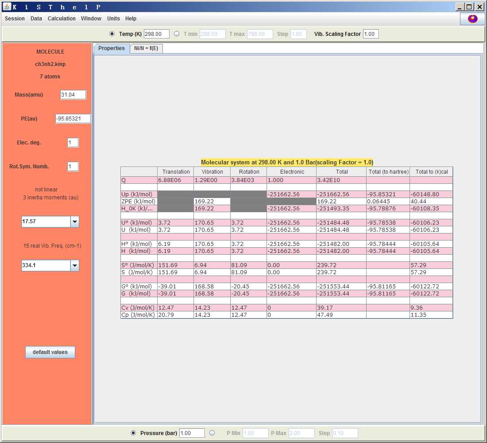
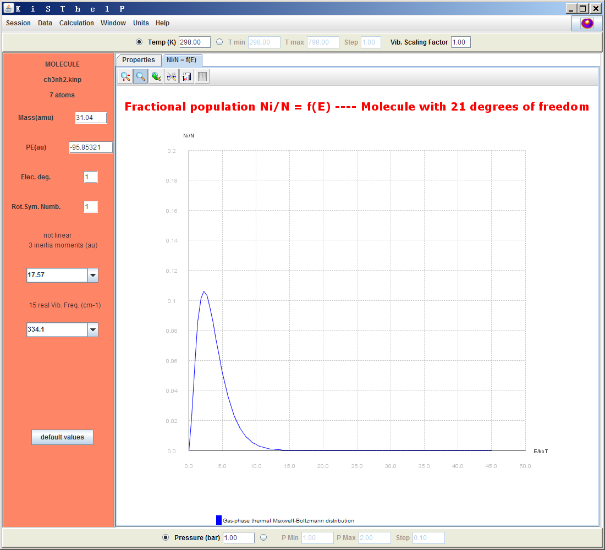
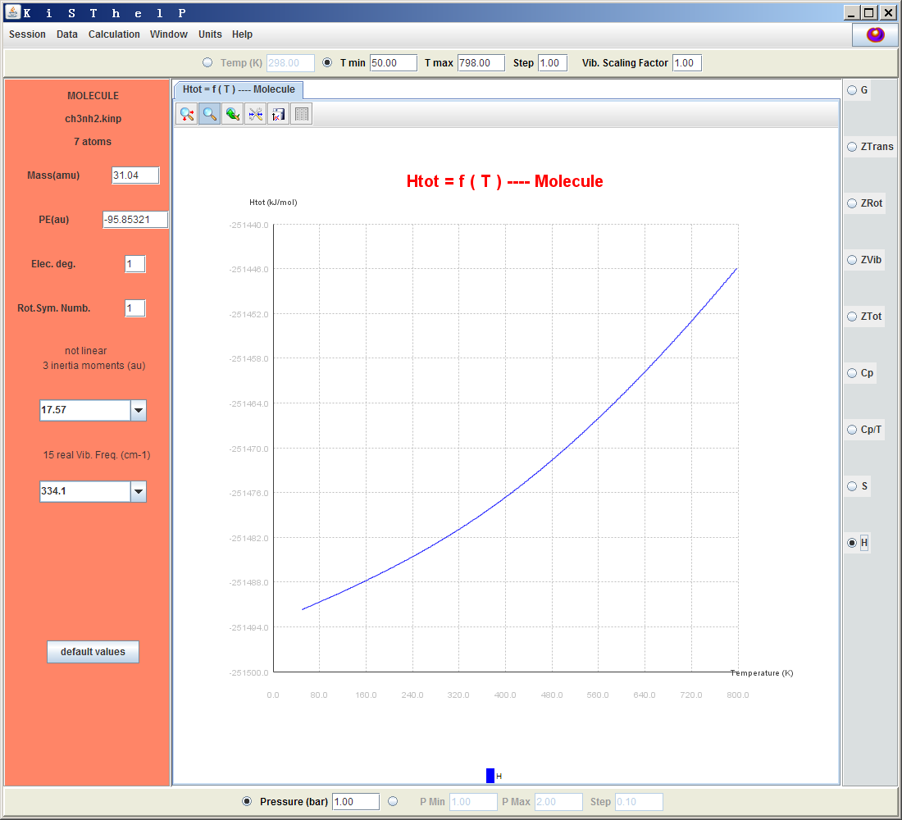
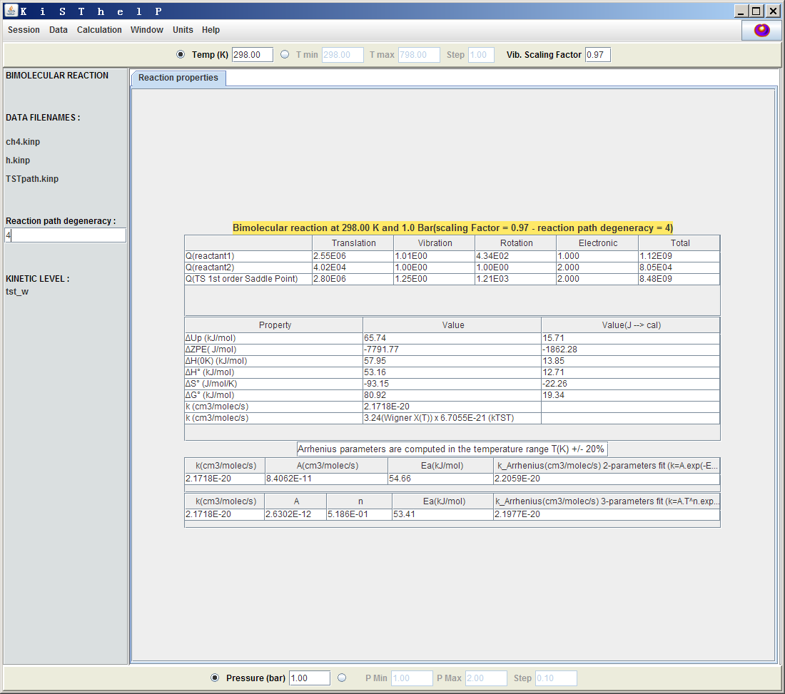
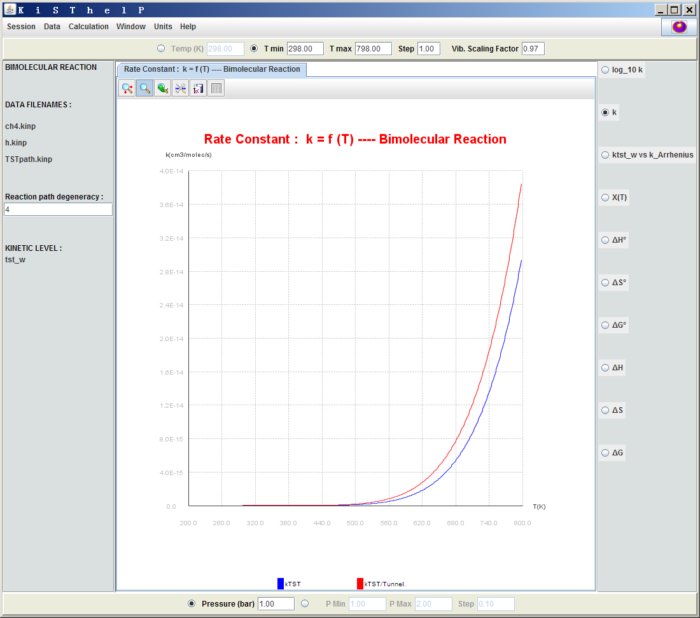
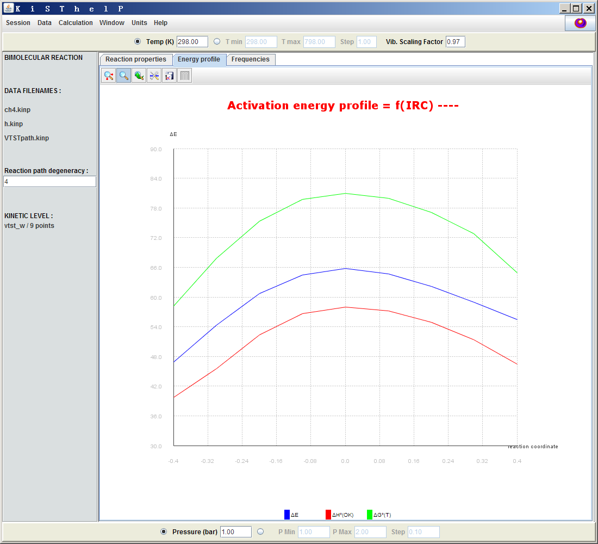
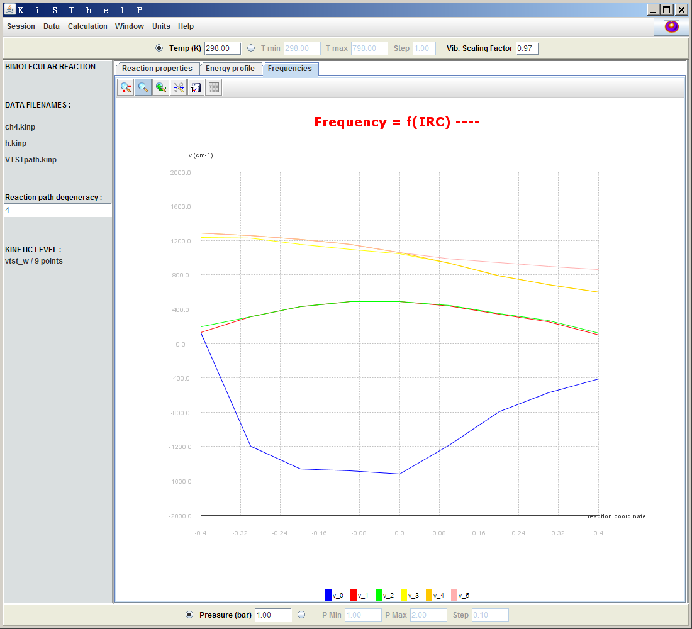

**后记**：对于计算反应速率常数，如果没有特别的要求，实际上通过《使用Shermo结合量子化学程序方便地计算分子的各种热力学数据》（<http://sobereva.com/552>）里介绍的我开发的Shermo程序计算出过渡态、反应物的自由能，求差得到自由能垒，然后代入我制作的《基于过渡态理论计算反应速率常数的Excel表格》（<http://sobereva.com/310>）表格中，并且利用表格里的单元格计算出隧道效应校正量，就足矣得到合理的反应速率常数。如今并没有多大必要用KiSThelP，用这个反倒还更复杂，还得装java运行环境，从结果上看也没什么特别显著的额外好处。而且Shermo程序在计算热力学量方面明显比KiSThelP强大灵活得多。

**使用KiSThelP结合Gaussian基于过渡态理论计算反应速率常数**  
Using KiSThelP combined with Gaussian to calculate reaction rate constants based on transition state theory

文/Sobereva @[北京科音](http://www.keinsci.com)  
First release: 2014-Jul-28    Last update: 2021-Feb-27

## 1 前言

计算基元反应的反应速率常数k是一个很重要的和实际应用密切相关的问题。常见的计算方法包括硬球碰撞模型、轨迹计算、过渡态理论以及RRKM理论。硬球碰撞模型虽然有重要的历史意义和理论意义，但精度太差，还需要额外的参数，没什么实际价值，但天朝的物理化学课程中通常都喜欢细讲这部分。轨迹计算就是通过从头算动力学（如BOMD、CPMD，甚至高大上的量子动力学）计算大量的轨迹，让分子或原子以不同动能、角度相互碰撞，看是否发生反应，将结果根据玻尔兹曼分布平均起来就能得到反应速率常数。这种方式最精确、最普适，但极为耗时、不易实现，日常问题研究中比较少用。RRKM算得挺准，但最大限制是只能用于单分子反应，诸如分子异构化等。过渡态理论(TST)是应用得最为广泛的计算反应速率常数的方法，它假定反应物由于与环境的能量快速交换而处于热力学平衡状态，其中分布于过渡态（连接反应物和产物的IRC上能量最大点）的反应物就会转化成产物。TST最初1935年Eyring等人提出后又有了发展，特别是变分过渡态理论(VTST)，其中包括CVT(Canonical variational theory)、ICVT（Improved canonical variational theory)、μVT(Microcanonical variational theory)。CVT使用最广，需要的势能面信息最少，同时相对来说也是VTST里面精度最低的，但好于原始的TST（特别是电子能量对能垒贡献很小甚至为0的情况，TST就很不合适了）。隧道效应对反应速率常数往往有不小影响，会增大k值，通常会计算出透射系数χ（有多种方式计算，准确度和计算难度直接相关），把它乘到过渡态理论得到的k上就得到了隧道效应校正后的结果（透射系数作为一个k的校正因子，也能够引入由于产物会重新返回产物导致k的降低的效应，但点这很难考虑，本文不涉及）。总的来说，过渡态理论有很好的实用性，通常可以得到不错的结果，但也有不太适用的情况，诸如高温（会偏离IRC较大，产物返回反应物几率高）、低压（反应物间的碰撞频率小而难以达到热力学平衡态）、动态效应强（如反应中间体存在很短暂，来不及达到热力学平衡态）等情况。

## 2 KiSThelP程序的功能和特点

大家提到计算反应速率常数的程序时，往往会先想到Truhlar他们的Polyrate。此程序历史悠久，在过渡态理论计算方面是功能最强大的，VTST类方法全支持，可以考虑多维隧道效应校正。但是这个程序使用较为复杂，量化初学者难以入手。2014年出现了一个叫KiSThelP的程序，目的也是基于过渡态理论计算反应速率常数，此程序完全开源免费，Java编写，可以在此下载<http://kisthelp.univ-reims.fr/download.php>，介绍它的原文为J.Comp.Chem.,35,82(2014)。KiSThelP的功能不及polyrate强大，只能做TST和CVT方式的VTST，隧道效应校正只能考虑一维的，但是有个最大的好处就是有简单易用的图形界面，能在Windows下用，而且支持Gaussian的输出文件。如果你只是想简单算一下反应速率常数，解决一些眼前的实际问题或者让文章内容更充实，又不想在反应速率常数的计算上涉水太深，那么KiSThelP就够用了，没必要花太多精力去钻polyrate。

KiSThelP有以下功能  
(1)计算热力学属性。  
(2)计算反应平衡常数。  
(3)通过TST或VTST（此程序里VTST特指CVT）计算单分子或双分子反应的反应速率常数。可以以Wigner或Eckart方式考虑隧道效应校正。  
(4)通过RRKM方法计算单分子反应速率常数。此时不支持隧道效应校正。  
以上数据和一些相关的量都会在图形界面里清晰地显示出来，而且可以很方便地绘制这些数据随温度和压力的变化图。而且可以随时在图形界面上调节诸如谐振频率校正因子、体系质量、振动频率等参数查看结果的变化，十分便利。如果不熟悉谐振频率校正因子的话，建议看看《谈谈谐振频率校正因子》（<http://sobereva.com/221>）。

KiSThelP的输入文件是.kinp私有格式，用文本编辑器打开就会看到里面记录了振动频率、对称数、体系质量、转动惯量、势能、是否为线型结构、电子态简并度这些描述体系特征的信息，格式不复杂，可以自己随意编辑。KiSThelP也支持读入Gaussian03/09（或NWChem、GAMESS）的freq任务的输出文件。

KiSThelP是Java写的，因此在Windows、Linux、Mac OSX上都可以用。对于Windows用户，需要先手动安装Java运行环境（Java Runtime Environment, JRE），网上一搜就能找到下载地址。装完之后双击kisthelp2014.jar即可启动。

下面将要介绍此程序的基本使用。由于计算反应平衡常数就是个ΔG=-RTlnK的关系式，自行手算就行了，所以不介绍怎么用此程序算平衡常数。RRKM涉及的门道较多，本文也不谈了。下面只介绍怎么算热力学属性和通过TST/VTST算速率常数。

本文用的是Gaussian 09W B.01和2014-May版KiSThelP。如果大家对热力学量、TST、CVT、隧道效应校正不熟悉，建议先看看KiSThelP原文中的一些初步介绍。下面的例子涉及到的文件，以及程序的原文都可以在这里下载：[/usr/uploads/file/20150610/20150610211532_58686.rar](http://sobereva.com/usr/uploads/file/20150610/20150610211532_58686.rar)。

## 3 用KiSThelP计算热力学数据

**重要提示**：本文的这一节如今已经没有实际意义了。2020年笔者正式发布的Shermo 2.0程序在计算热力学数据方面远比KiSThelP强大、灵活得多，有了Shermo之后就完全没必要用KiSThelP来算了热力学数据了。参看《使用Shermo结合量子化学程序方便地计算分子的各种热力学数据》（<http://sobereva.com/552>）。

这一节介绍用KiSThelP计算热力学数据。这里先用Gaussian在B3LYP/6-31G*下对CH3NH2做个freq任务，得到CH3NH2.out文件。

启动KiSThelP后，先在左上角选Session-New（无论用此程序做什么任务，都是先选这个）。之后选Calculation-Atom,Molecule。接下来可以选一个.kinp文件或者Gaussian的freq任务输出文件。这里就选刚得到的CH3NH2.out。程序会自动把此文件中的能量、频率等信息提取并转换成相同目录下的ch3nh2.kinp文件，并利用这些信息计算出热力学数据，如下所示。

可见平动、振动、转动和电子的配分函数Q，以及它们对体系的各种热力学数据的贡献都输出出来了，每种数据的总值分别以kJ/mol、Hartree、kcal/mol来显示。右上角带个圆圈的量代表纯气体标准态（1bar）下的值。在界面中可以修改各个参数，比如上方的Vib.Scaling Factor（谐振频率校正因子），改完之后按回车，表里的数据马上就更新了。点Ni/N=f(E)标签页可以看到体系处于不同能量范围的态的布居数曲线图。  

凡是这种图，使用图的左上角的按钮都可以对图进行缩放、调节坐标范围、导出图像、导出数据。

如果点击界面上方的T min左边的那个圆点，就可以对各种热力学属性随温度的变化来作图。界面右侧选择热力学属性，T min和T max设定温度范围。例如下面是焓对温度作图  

类似地，也可以令热力学属性对压力的变化作图。也就是选择界面下方P Min左边的圆点。

还可以令热力学属性同时对温度和压力的变化作图，也就是既选中T min左边的圆点也选择P Min左边的圆点，得到的就是二维曲面图。

如果想再分析其它体系，应先选Calculation-Reset将程序的状态重置。

KiSThelP计算热力学数据和Gaussian的freq任务输出的那些热力学数据是完全一致的。用KiSThelP的主要优势是可以方便、随意地修改各种参数并马上得到新的结果，还可以方便地令数据对温度和压力作图来考察环境的影响。

## 4 用KiSThelP做过渡态理论计算

KiSThelP做过渡态计算需要两类输入文件  
(1)反应物的输入文件（.kinp文件或freq任务的.out文件）。如果是单分子反应，输入文件就是那个反应物分子；如果是双分子反应，就需要分别载入那两个反应物分子。  
(2)反应路径.kinp文件。这种文件通过将IRC路径上各个点的.kinp或freq任务的.out文件合并来得到，记录了反应路径上各个点的信息。如果是TST计算，只需要获得过渡态的.kinp/.out文件，然后转换成反应路径的.kinp即可，也就是说此时的反应路径只包含一个点的信息。如果是VTST，则需要把过渡态以及它邻近的IRC路径上的诸多点（点越多、越密结果越准确）的.kinp/.out文件合并成反应路径的.kinp文件，因此计算量明显大于TST，操作步骤也更多。

Wigner方式的隧道校正很简单，基于过渡态的虚频就能得到，也就是说不需要额外算什么，是“免费”的校正。而如果用Eckart方式考虑隧道效应校正，还会让你手动输入逆向势垒，也就是说还得额外对产物做优化和振动分析。

下面就以气相下甲烷的氢抽取反应CH4+H -> CH3-H-H (TS) -> CH3+H2为例来介绍具体怎么使用KiSThelP。计算级别为M062X/6-311G**。

### 4.1 TST计算实例

首先用以下输入文件对反应物1进行优化和振动分析，得到CH4.out  
#p M062x/6-311G** opt freq

Reactant 1

0 1  
 C                 -0.00000000    0.00000000    0.00000000  
 H                 -0.00000000    0.00000000    1.09000000  
 H                 -0.00000000   -1.02766186   -0.36333333  
 H                 -0.88998127    0.51383093   -0.36333333  
 H                  0.88998127    0.51383093   -0.36333333

用以下输入文件对反应物2进行热力学计算，得到H.out  
#P M062x/6-311G** freq

Reactant 2

0 2  
H

用以下输入文件搜索过渡态结构，并进行振动分析，得到TS.out  
#P M062x/6-311G** opt(calcfc,ts) freq

TS

0 2  
 C                 -0.00000000   -0.00000000   -0.34155733  
 H                  0.00000000    0.00000000    0.89844267  
 H                  0.88112765   -0.50871929   -0.73043157  
 H                 -0.88112765   -0.50871929   -0.73043157  
 H                 -0.00000000    1.01743857   -0.73043157  
 H                 -0.00000000    0.00000000    1.86652082

启动KiSThelP，选Session-New，再选Data-Build R Path.kinp来构建用于TST计算的反应路径的.kinp文件。输入1，选择TS.out，然后在文件名的框里输入TSTpath，这样就得到了TSTpath.kinp。

选Calculation-k/TST/W-Bimolecular，依次选择CH4.out、H.out、TSTpath.kinp（遇到提示框时直接选OK），然后就看到结果了。这个过程中CH4.out和H.out也会被自动转换为ch4.kinp和h.kinp。

先不要马上就讨论结果。应该先确保窗口左侧的反应路径简并度设对了，默认是1。反应路径简并度σ可以根据这个式子来算（详见Theor Chem Account (2007) 118:813–826）：  
σ=σ(R)*n(TS)/ [σ(TS)*n(R)]  
这里σ(R)和σ(TS)指的是反应物和过渡态结构的转动对称数，n(R)和n(TS)指的是反应物和过渡态结构的手性异构体数目。在Gaussian计算时，只要点群识别对了，在freq任务输出文件中看到的Rotational symmetry number就是指的这个转动对称数，上面那篇TCA文章里的表2也给出了各种点群的转动对称数。对于当前的反应，甲烷是Td点群，转动对称数为12；过渡态是C3v点群，转动对称数是3，因此反应路径简并度为12/3=4。其物理意义也很容易理解，因为甲基的四个氢都可以被外来的氢原子所抽取。设完后，会看到表中的反应速率常数k成为了原先的4倍。

另外，最好也把谐振频率校正因子考虑进去，这会略微改进热力学属性以及反应速率常数的计算结果。M06-2X/6-311G**没有现成的校正因子，但是从<http://comp.chem.umn.edu/freqscale/version3b1.htm>上能找到M06-2X/6-31+G**的值（0.967），又由于对于其它理论方法6-31+G**和6-311G**的校正因子很接近，后者比前者略微大一点点，因此这里我们稍微估算一下，取0.97作为校正因子，输入到窗口右上方的Vib. Scaling Factor里面。

现在，窗口里的数据如下所示  

图中靠上的表列出了反应物1和2以及过渡态的配分函数，中间的表显示了过渡态的各种热力学数据相对于反应物的热力学数据的变化，并根据其中ΔG0（1bar标准态的活化自由能）通过过渡态理论得出反应速率常数（倒数第二行，2.17E-20）。最后一行显示了倒数第二行的数值具体是怎么来的，由图可见此例的Wigner隧道效应校正因子为3.24，即隧道效应使得反应速率常数增大到了原先的3.24倍。下方的表给出了根据阿伦尼乌斯公式拟合出的指前因子A和活化能Ea，以及基于拟合参数得到的反应速率常数k_Arrhenius，这个值和k符合得越好说明拟合得越准确，此例就拟合得较好。拟合所用的温度范围是当前设的温度的±20%以内。注意阿伦尼乌斯公式k=A*exp(-Ea/RT)只是一个k随T变化的经验、宏观层面上的公式，其中的A和Ea都只是根据理论或实验得到的k随T的变化而拟合得到的，不要和过渡态理论混淆，过渡态理论才是直接算出k的方法。基元反应的Ea和ΔG0虽关系密切，有相似的物理意义，但来源完全不同。而对于多步反应，每步都能算出一个ΔG0，但根据阿仑尼乌斯公式拟合出的则是一个整体的宏观的Ea。最后一行是根据用得较少的三参数的阿伦尼乌斯公式k=A*T^n*exp(-Ea/RT)拟合出的参数。

值得一提的是，在计算表中的ΔU、ΔH、ΔG等过渡态相对于反应物的热力学性质的变化的时候，反应物的热力学量来自于反应物1和反应物2的热力学量的直接加和，因此参考态取的是彼此间无限远离的反应物1和反应物2，而非它们在反应前通过弱相互作用形成的复合物。另外，在做TST计算时，反应物和过渡态在计算转动配分函数的时候转动对称数都被程序当成了1，因为转动对称数已经体现在了用户输入的反应路径的简并度里面。由于转动对称数直接影响转动配分函数，因此对于转动对称数不为1的体系，做TST时显示的它的转动配分函数（以及基于它得到的熵和自由能）与单独对它计算热力学属性时得到的值会存在差异。

可以令k以及ΔG、ΔS、ΔH、透射系数等数值对温度或者压强来作图，也就是点击T min或P min左边的按钮，然后在窗口右边选择对应的量。下面是隧道效应校正前(蓝线)和校正后（红线）的k随温度的变化曲线。

如果TST计算中要以Eckart方式做隧道效应校正的话，选Session-New，把Vib. Scaling Factor设好，选Calculation-k/TST/Eck，之后操作步骤和上述一样，只是程序最后会让你输入逆向反应的零点能校正后的势垒，即逆向的ΔH(0K)。为了得到这个量，对于当前例子，就需要分别对产物CH3和H2进行优化和振动分析，然后用KiSThelP得到过渡态的H(0K)并减去CH3和H2的H(0K)。计算过程中谐振频率校正因子应当和TST计算时用的一致。此例中CH3、H2和过渡态的H(0K)分别为-104471.17、-3041.43和-107458.94 kJ/mol，故逆向的ΔH(0K)为-107458.94-(-104471.17-3041.43)=53.66KJ/mol

反应物为单分子的情况，计算方法和上述一样，区别仅在于在菜单中选Unimolecular而非Bimolecular。

### 4.2 VTST计算实例

这一节来做CVT方式的VTST计算。除了反应物、过渡态的freq任务的输出文件外，VTST计算还需要IRC路径上在过渡态附近的几个点的freq任务的输出。因此我们首先做IRC计算。

执行下面这个文件得到IRC，正方向和逆方向皆10个点。结构来自上一节优化出的过渡态的结构。  
#p M062x/6-311G** IRC(calcfc,maxpoints=10)

IRC

0 2  
 C                  0.00000000    0.00000000    0.26935900  
 H                  0.00000000    0.00000000   -1.13595200  
 H                  0.00000000    1.05670600    0.51542100  
 H                 -0.91513500   -0.52835300    0.51542100  
 H                  0.91513500   -0.52835300    0.51542100  
 H                  0.00000000    0.00000000   -2.02646400

然后把过渡态和距离它最近的正向4个和逆向4个点的坐标提取出来，写成freq任务的输入文件。具体来说，在gview里打开IRC任务的输出文件，会看到21个帧，把第7~15帧分别保存成名为TS-4，TS-3，TS-2，TS-1，TS-0，TS+1，TS+2，TS+3，TS+4的.gjf文件，其中TS-0对应于过渡态结构，-和+代表逆向和正向。然后可以通过Ultraedit等程序批量修改关键词使之成为freq任务。然后批量执行它们。

之所以VTST要做IRC并计算频率，目的是得到IRC路径上的自由能变化，从而找出IRC路径上自由能的最大点位置，在这个点上按照TST公式得到的k就是VTST的k。而原始的TST是在过渡态结构上计算的，它相当于IRC上电子能量的最大点。由于IRC上自由能最大点和电子能量最大点的位置往往不会相差太远，所以做VTST并不需要从反应物到产物完整的IRC路径上各个点的信息，只要有过渡态附近的IRC上的点就足够确定自由能最大点位置了。所以我们既不用把maxpoints设得很大以保证IRC能一直延伸到反应物和产物，也不需要对距离过渡态太远的点做freq任务。但为了使得精度更高，在计算IRC的时候，可以把步长设得比默认小一点。步长默认是0.1amu^-0.5 bohr，可以通过IRC(stepsize=n)设为n*0.01amu^-0.5 bohr。步长设小的话，取的IRC点的数目就需要相应地增加。

启动KiSThelP，选Session-New，Data-Build R Path.kinp，选择TS-4.out，然后输入此结构在反应路径上的位置，输入-0.4。然后选TS-3.out，输入-0.3。以此类推，对于TS-0.out输入0.0。最后选的是TS+4.out，输入0.4。当9个文件都载入后，会让你输入要保存的反应路径的.kinp文件名，输入VTSTpath。

之后和上一节的操作完全一样。主菜单选Calculation，然后根据需要选k/VTST、k/VTST/W、k/VTST/Eck当中的一种，并选择单分子还是双分子反应，然后选反应物的.kinp/.out文件，最后选反应路径文件VTSTpath.kinp即可。

这里我们选k/VTST/W，输出的信息和上一节的类似，只不过热力学属性中多了一列Value (TS at ΔG0 Max)，这就是指的VTST的结果，即IRC路径上ΔG最大点位置的结果。而Value (TS at first-order saddle point)那一列就是TST的结果，和上一节的结果完全一样。

有趣的是，对于当前这个例子，VTST和TST的结果是相同的，也就是说，IRC路径上电子能量最大点位置和自由能最大点位置是一样的，这纯属巧合，在其它反应中或者其它计算级别中通常会有所不同。如果点击Energy profile标签页，会看到反应路径上ΔE（电子能量相对于反应物的变化）、ΔH0(0K)和ΔG0(T)的曲线图，如下所示。

可见对于此例这三条曲线数值不同，但形状相似，特别是最大点的位置是一样的，都是反应坐标为0的位置。定位精度和构建反应路径.kinp文件所用的点数有关，目前是9个点，相对粗糙，如果是比如用多达200个点，那么ΔG0(T)和ΔE的极大点位置的细微差异可能就能体现出来了，TST和VTST结果也将出现微小分歧了。（个人觉得KiSThelP应该在这个地方增加一个曲线拟合功能）

点击Frequencies标签页的话，将会看到体系每个振动频率随反应坐标的变化，如下所示。

在过渡态位置，即0.0处，可见只有一个虚频，也就是蓝色曲线。这个虚频在过渡态位置处数值最负（以负值代表虚数）。在IRC上与过渡态相距越远，这个虚频就变得越正，逐渐接近于0。当远到一定程度，比如-0.4那个点的位置，这个振动模式就不再是虚频了。其它各个振动模式的频率也在图中十分清楚直观地展现了出来，分析起来很便利。

## 5 总结&其它

虽然过渡态理论，特别是其原始版本，形式不复杂，自己去编程计算也不很困难，但是，就是这么简单的事情，却长期也没有个简单、易用的程序去计算，使量化初学者或外行人研究反应速率问题遇到很大的阻碍。KiSThelP可谓是很好地弥补了这一空白。虽然这程序不算很强大，但最基本、最重要的功能都有了，满足一般需求也够了，操作很便捷，结果清晰易懂，还能方便地绘图，不仅很实用，当成教学用的程序也非常适合。

这个程序的源代码包里有一些示例文件，感兴趣的话可以看看。程序的网站上还有教学视频，但是不够详细，很多地方根本没说清楚，而且录制时用的版本和当前版本在某些界面上也略有差异，感兴趣的话也可以看看。

前面举的例子是气相下的，对于溶液下反应。可以在隐式溶剂模型下做前述计算。

量化计算中，几何优化时选用的级别通常比计算单点时更低，从而在保证精度的前提下降低耗时，可参考《浅谈为什么优化和振动分析不需要用大基组》（<http://sobereva.com/387>）。在KiSThelP中计算k时如果也想这么做的话，应当先把Gaussian等程序的输出文件按前文所述的方式转换成kinp文件，然后把kinp里的势能部分的能量手动改为高级别单点能数据，然后在计算k的时候用kinp作为输入文件。

默认情况下，KiSThelP对每种振动模式都是以谐振子模型或结合谐振频率校正因子的方式来考虑。但是如果振动模式对应于大幅度内部转动，谐振子模型就不合适了，此时在KiSThelP里可以以受阻转子方式来考虑。这需要计算出势垒高度，然后写进.kinp里的相应的振动频率的后面，具体参见程序自带文档的介绍，示例文件里面也有相关的。

有的时候，反应物以不同构象参与反应，得到不同产物。例如B以不同构象B_1和B_2参与反应时分别得到C_1和C_2，可写为这样：  
[A][B]k1->[C1]  
[A][B]k2->[C2]  
如果要求k1和k2，应当这么处理：  
根据玻尔兹曼公式，可算出B_1和B_2在B中的比例w，即  
[B_1]=[B]*w1  
[B_2]=[B]*w2  
上式可写为  
[A][B_1]k1'->[C1]  
[A][B_2]k2'->[C2]  
其中k1=k1'*w1，k2=k2'*w2  
把A+B_1和A+B_2分别作为反应物，按本文过程由KiSThelP得到k1'和k2'。然后根据玻尔兹曼公式算出权重w1和w2，乘上去，就得到了不同方式反应的反应速率常数k1和k2。如果不熟悉玻尔兹曼权重的计算，可参见《根据Boltzmann分布计算分子不同构象所占比例》（<http://sobereva.com/165>）。
