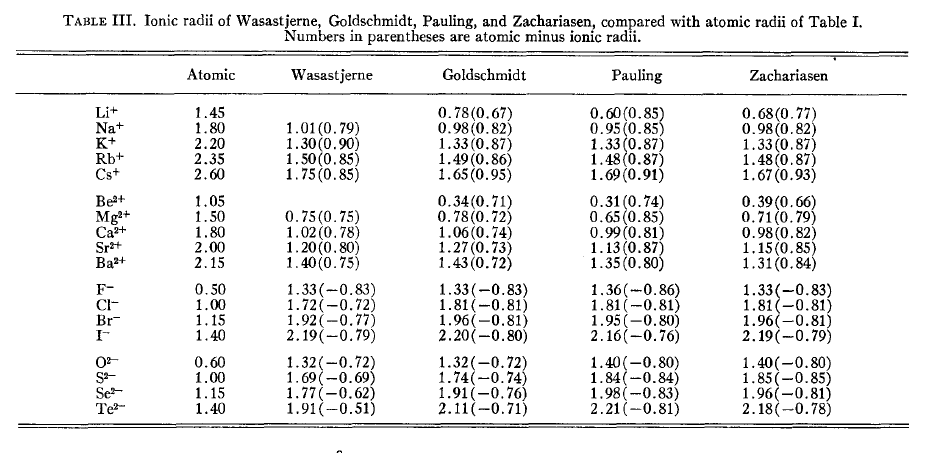
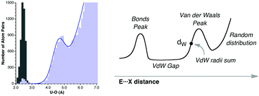

**简谈原子半径**Brief introduction to atomic radius

文/Sobereva @[北京科音](http://www.keinsci.com)  
First release: 2014-Oct-24  Last update: 2018-Apr-25

经常有人问原子半径的事，这里十分简略地谈谈。

## 1 共价半径

一般说原子半径的时候多数情况就是指共价半径。原子间形成化学键的时候，键的长度大体相当于这两个原子的共价半径之和。很多可视化程序判断是否成键就是根据这个规则判断的。例如在Multiwfn（<http://sobereva.com/multiwfn>）中，默认设置下，只要两个原子间距离小于它们的CSD共价半径和的115%就在两个原子间显示化学键。当然，这种仅从几何结构上判断是否成键的规则是很粗糙的，没有考虑电子结构。并且严格来讲，成键只能说强弱，而没有严格标准来判断有或没有。

原子在不同化学环境下的电子结构是不一样的，例如C有sp、sp2、sp3杂化，也可以和不同原子形成不同种类的键，过渡金属还有高自旋低自旋等等，每种情况都有不同的键长。然而，通常每一套半径的定义对于每个原子只有一个值，所以原子的共价半径应认为是考虑各种化学环境下的平均值。

下面介绍几种常见的共价半径。定义半径的文章太多了，这绝不是完整的汇总。

双原子分子键长的一半：这是最“纯正”的共价半径。虽然这种方式定义共价半径意义很明确，但是并不适合作为普适的共价半径定义。因为实际分子中，不同原子以不同形式的化学键相互连接，而双原子分子的成键方式却是固定的，比如氮气分子是三重键，而氮原子在多数分子中形成的是单键，因此用N2键长的一半当N的共价半径就有失偏颇。

CSD(Cambridge Structural Database)半径：2008年提出，原文是Dalton Trans., 2008, 2832-2838。这是很可靠的，而且我个人也很推荐用的共价半径。原子序号从1到96都有。其中的半径通过统计CSD剑桥结构数据库里面的数目庞大的分子晶体结构中的键长来得到。值得一提的是，对于碳，CSD半径是对sp、sp2、sp3状态分别给出的，对于Mn、Fe、Co，CSD半径是对高自旋和低自旋分别给出的。

Slater-Bragg半径：原文是J. Chem. Phys., 41, 3199 (1964)。这是对1920年的Bragg半径的改进，思路都一样，是根据晶体学测定的分子结构中的键长来统计得到的。

Pyykko半径：原文是Chem. Eur. J., 15, 186-197 (2009)。包含1-118所有元素的半径。取了一大堆分子，其中有的是实验测定的结构，有的是高精度方法计算出来的结构，然后通过拟合让原子半径加和与测试集中的键长差异尽量小。

Suresh半径：原文是J. Phys. Chem. A, 105, 5940-5944 (2001)。此方法对每种元素计算H3C-EH(n)这样的体系，E是要考察的元素，然后将C-E的键长减去乙烷中C-C的键长的一半就得到了E的共价半径。比如计算N的半径的时候就计算H3C-NH2的C-N键长，把它再减去乙烷C-C键长的一半。这种方式计算共价半径比较简单，效果也不错，但由于计算半径时考虑的只是单重键情况，所以这种方式适合估计的是不同原子间形成单键的键长。

最后顺带说一下，对于某个体系中的一个化学键A-B，如果我们要基于此来求A的半径和B的半径，最合理的办法就是计算原子核到AIM理论中的键临界点(BCP)的距离。这样得到的两个原子半径和就正好是这个化学键长。

## 2 离子半径

形成离子化合物的时候，原子的状态和形成共价键时候的差异实在太大，因此都用一套半径来描述显得不合理，故有人专门定义了离子半径。阳离子半径比起共价半径明显要小，而阴离子半径则比共价半径明显要大。离子半径加和值和离子间距离是比较吻合的。由于阳离子半径相对于共价半径的降低，以及阴离子半径相对于共价半径的增加，二者的数值大小比较相近，因此阴阳离子半径的加和与两个原子共价半径的加和差异通常不太大，所以有人认为有一套共价半径就足够用于讨论键长问题了，没必要单独考虑离子半径。

下图是Slater-Bragg半径和不同的人定义的离子半径的对比，括号里的值就是离子半径与Slater-Bragg半径的差值。

R.D.Shannon（不是搞信息熵的C.E.Shannon）离子半径对元素的各种价态、配位数的情况都单独列出了半径，通过对大量晶体结构统计得到，表格很长，见Acta Cryst., A32, 751 (1976)。配位数越高，离子半径也越大。

## 3 范德华半径

如果原子间是以范德华作用吸引到一起的，那么平衡状态下，原子间距离就大致是二者的范德华半径和。如果原子间非共价相互作用很强，比如氢键、卤键、pi-pi堆积等，那么会原子间的距离会明显小于范德华半径和，也就是彼此穿透了范德华表面。如果大于范德华半径和，就表明原子间相互作用很弱了，可以不做考虑（但并非没有，范德华作用随距离呈1/r^6方式衰减）。

测定范德华半径的方法很多。目前最常用、最广为接受的范德华半径就是bondi半径，原文见J. Phys. Chem., 68, 441 (1964)，主要是靠低温下晶体密度来推算出来的，同时考虑物质的其它方面的性质以加以验证。Rowland和Taylor在J. Phys. Chem., 100, 7384-7391 (1996)通过更多晶体数据对bondi半径进行了检验，发现bondi半径确实比较合理，其半径加和值和实际情况中原子接触距离较吻合，但是推荐对氢用1.09埃（bondi半径是1.2埃）。

最近一篇文章Dalton Trans., 42, 8617-8636 (2013)中作者通过统计CSD数据库里几百万个晶体中原子间距来得到范德华半径，姑且叫做CSD范德华半径，它把周期表基本覆盖全了，比bondi的全面很多。这种方式获得范德华半径的原理通过下图很容易理解，也就是统计数据库里某一元素E和探针原子X（通常用氧）之间距离的出现频数，会有两个峰，第一个峰对应成键距离，第二个峰和非键接触相关，利用后者的位置就能确定范德华半径。

其它人提出的范德华半径在此贴里有一览表：  
<http://bbs.keinsci.com/forum.php?mod=viewthread&tid=69&extra=page%3D1>  
更多的和范德华半径有关的讨论可参见Inorganic Materials, 37, 871-885 (2001)。

UFF力场是十分著名的普适型力场。一些计算化学程序、理论文章提及的UFF半径，对应于UFF原文J. Am. Chem. SOC., 114, 10024 (1992)的表1里的x_I那一列数值的一半。UFF半径可以认为是一种范德华半径。

从理论上也可以计算范德华半径。Bader将电子密度为0.001和0.002 a.u.的等值面分别定义为气相和凝聚相下分子的范德华表面。通过Multiwfn就可以很容易地计算，例子见本文文末的附录。不过这种方式定义的范德华半径比Bondi的要大出很多，会高估范德华作用导致堆积时原子的间距。

Boyd是专注于搞AIM分析的人，他在J. Phys. B: Atom. Molec. Phys., 10, 2283 (1997)提出了所谓的Boyd半径，其实没什么新意，就是效仿Bader的思路，不过是用电子密度=0.0001a.u.的位置来定义原子半径，然后使用经验公式对其进行scale来得到和一般范德华半径相符的半径大小。

## 4 其它

Pauling在他著名的《化学键的本质》里面也提供了共价、离子、范德华半径，但是只有很少几个元素，这被称为Pauling半径。

Hugo半径：原文是Chemical Physics Letters, 480, 127-131 (2009)。这种半径是推导出来的，计算公式是r=a0*√(I_H/I)，其中a0是氢的原子半径，I_H是氢的电离能，I是当前元素的第一电离能。虽然推导过程比较严格，计算出来的半径的变化趋势也基本正确，但是有极不合理的情况，比如得出的H的半径为1 Bohr，而Kr的半径居然为0.99 Bohr，竟比H还小！Hugo半径的大小比共价半径小很多。

Modified CSD半径：这是在Laplacian键级原文J. Phys. Chem. A, 117, 3100-3108 (2013)中顺带提出的一种特殊的半径定义方式，通过对CSD半径修改来得到，以更好地反映原子在实际分子中的特征。其思路容易理解。对同一周期元素（主族部分），越靠左的原子半径越大，但是电负性越小，因此在实际分子中越容易失电子而使半径变小；反之，越靠右的原子半径越小，但是电负性越大，在实际环境中越容易得电子而增大其半径。因此，Modified CSD半径把每一行的主族元素的半径都用第四主族元素的半径代替，这样的半径就近似考虑了原子在实际化学环境中的膨胀和收缩，更符合实际情况。利用这种半径来定义分子内原子的空间比起直接用CSD共价半径合理得多。

## 附：用Multiwfn计算原子半径一例

这里通过一个简单例子，说明怎么用Multiwfn计算基于电子密度等值面定义的半径。假设我们要计算用电子密度=0.002 a.u.等值面定义的Cl-的半径。Multiwfn可以从主页<http://sobereva.com/multiwfn>免费下载。不了解者建议看《Multiwfn FAQ》（<http://sobereva.com/452>）。使用的Multiwfn版本应当是2020-Feb-21及以后更新的。

首先我们要得到Cl-的波函数文件。比如这里我们用Gaussian来计算得到。输入文件如下

# B3LYP/aug-cc-pVTZ out=wfn  
[空行]  
Title Card Required  
[空行]  
-1 1  
Cl  
[空行]  
C:\Cl-.wfn

使用Gaussian运行之，之后就在C:\下得到了Cl-.wfn。然后启动Multiwfn，输入  
C:\Cl-.wfn  
12  // 定量分子表面分析  
1  // 修改定义分子表面的方式（默认是电子密度=0.001 a.u.）  
1  // 用电子密度等值面来定义  
0.002  // 用0.002 a.u.等值面  
6  // 开始分析  
10  // 测量所有表面顶点距离原子核最远和最近距离  
1  // 原子序号是1  
此时看到以下信息  
The closest distance to the point:    3.920433 Bohr (    2.074604 Angstrom)  
The farthest distance to the point:    3.921946 Bohr (    2.075405 Angstrom)

即表面顶点与原子核最远的是2.075埃，这个就可以作为Cl-的原子半径。当然，前面说了，电子密度=0.001 a.u.或0.002 a.u.都不是唯一的定义原子表面的方法。如果是要横向对比凝聚相下的相对半径差异，用上面方法计算的半径是比较有意义的。

值得一提的是，类似这种做法也被用于确定分子动力学直径，看《使用Multiwfn计算分子的动力学直径》（<http://sobereva.com/503>）。
