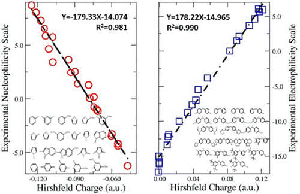

**用Hirshfeld电荷和信息增益研究亲电性和亲核性**  
Studying electrophilicity and nucleophilicity using Hirshfeld charge and information gain

Sobereva@[北京科音](http://www.keinsci.com/)   2014-Nov-1

对于化学体系，Shannon熵定义为-∫ρ(r)lnρ(r) dr，其中ρ是体系的电子密度。

划分分子成为原子空间的方法很多，如Hirshfeld、AIM、Becke、ISA等。Nalewajski和Parr在PNAS, 97, 8879 (2000)中指出，如果用Hirshfeld方式划分分子空间来定义原子（其密度记为ρ_A、ρ_B、ρ_C...），那么形成分子后，各个原子相对于它在孤立状态（密度记为ρ0_A、ρ0_B、ρ0_C...）的信息熵变，或者说原子的信息增益，都是最小的（如A原子的增益=-∫ρ_A(r)ln[ρ_A(r)ρ0_A(r)] dr）。同时分子整体的信息增益（即原子信息增益之和）也是最小的，这称为最小信息增益原理。在这篇文章发表后，和分子、原子的信息熵以及Hirshfeld划分相关的文章大量出现。

在最近的一篇文章Shubin Liu, Chuying Rong, Tian Lu, Information Conservation Principle Determines Electrophilicity, Nucleophilicity, and Regioselectivity, J. Phys. Chem. A 2014, 118, 3698-3704当中，作者指出在一阶近似下，Hirshfeld方式划分导致的分子信息增益恰为0，并称之为信息保守原理。并且，在一阶近似下，原子的信息增益和原子的Hirshfeld电荷是等价的！这将抽象的信息熵概念和计算化学工作者熟知的原子电荷直接联系了起来。

此文通过50个只含碳、氢的分子作为测试集，基于Multiwfn程序计算了信息增益和Hirshfeld电荷，发现它们与Mayr实验亲电亲核性标度有绝好的线性关系！如下图所示。并且发现Hirshfeld电荷不仅与亲电亲核反应速率密切相关，还能正确地预测出亲核、亲电反应活性位点。

但此文只考虑了含碳体系，为了检验是否这样好的关系对于其它元素也有效，在 周夏禹, 荣春英, 卢天, 刘述斌, 用Hirshfeld电荷定量标度亲电性和亲核性：含氮体系, 物理化学学报, 30(11), 2055 (2014) （<http://www.whxb.pku.edu.cn/CN/abstract/abstract28901.shtml>）一文当中，作者又使用了5 个不同类别的含氮体系共计40 个分子进行了研究。结果发现对所有五个含氮体系其Hirshfeld电荷与实验亲电亲核性标度之间仍然存在着很强的线性关联。但同时发现，这些相关性依赖于氮元素的化合价类型和键合环境，线性关系只能在同一类型中成立。

那么，Hirshfeld原子电荷，或者说一阶近似下的原子信息增益有什么用？通过上面的讨论，可以知道，起码对于含碳、氮的体系，只要计算出了Hirshfeld原子电荷，利用文中给出的关系式，就能得出对应的亲电亲核性标度，这与反应速率直接相关。并且还可以预测亲核亲电反应优先发生在哪个位点。
