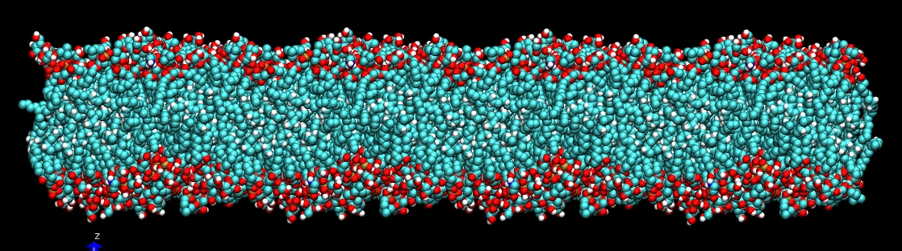
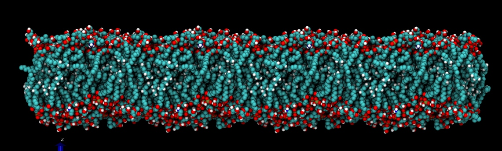
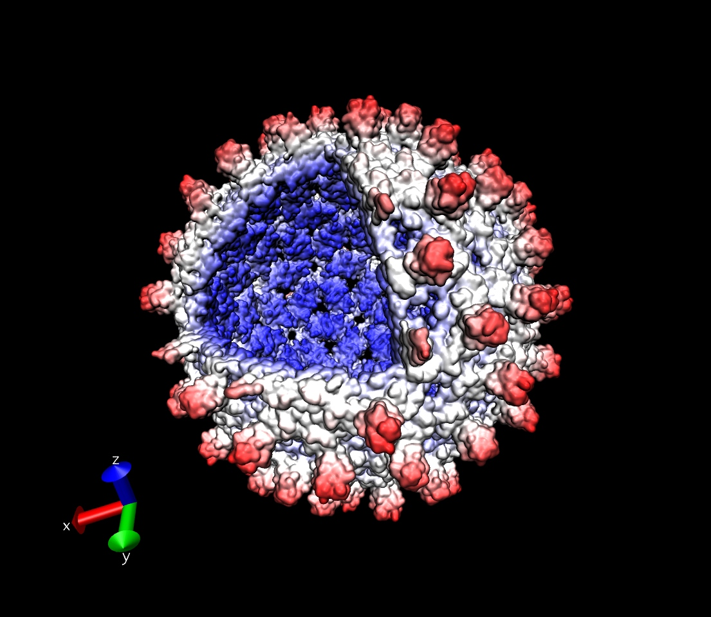
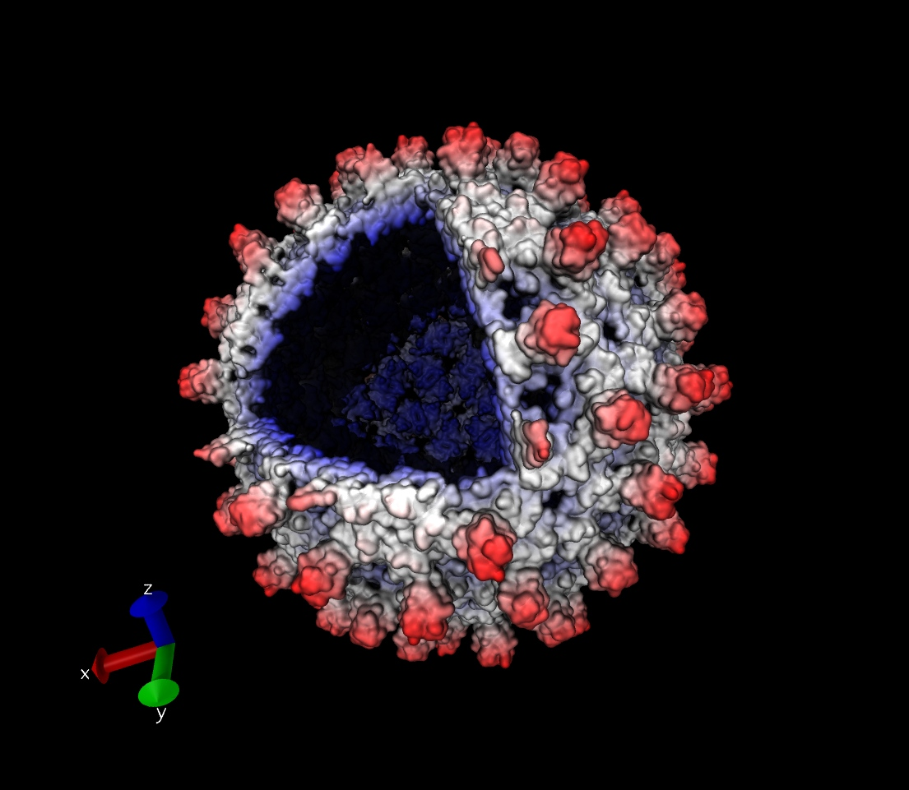

**VMD里使用环境光遮蔽改进渲染效果**  
Using ambient occlusion to improve rendering effect in VMD

文/Sobereva   2014-Nov-17

在较新版本的VMD里，可以使用ambient occlusion（AO,环境光遮蔽）来改进自带的Tachyon渲染器的渲染效果。这可以使体系在光线照射下呈现的阴暗区域柔和、自然地表现出来，丝毫不逊色于用povray渲染，甚至看着更舒服一些。

开启AO的做法很简单，在display setting里面把Shadows和Amb. Occl.打开，把Drawing method设为那种物体占的体积比较大的显示方式，比如VDW方式，材质设定为AO开头的比如AOEdgy。然后file-render，选择用内建的Tachyon渲染就行了。开了这两项之后会令Tachyon渲染耗时增加很多。

这幅图是直接用tachyon渲染的磷脂膜，看不出明暗，缺乏层次感

下面这是用上述方法开启AO后渲染的，层次清晰，也柔和多了

再看一个例子，这是病毒颗粒，用的是quicksurf方式来快速显示体系的表面，用radial方式着色（越靠外越红）。选择方式输入all not (z>20 and x>20 and y>20)来给体系开了个小口。

下图是没开AO时渲染的，病毒颗粒里面全都能看到

下面是开了AO渲染的，只有冲着开口的那一块内侧区域被光线照射才显露出来。颗粒外部区域看起来柔和多了，轮廓更为清楚。

在display setting里可以对Shadows和Amb. Occl.的程度进行调节，在graphics-material里可以再对材质特征进行调节。
