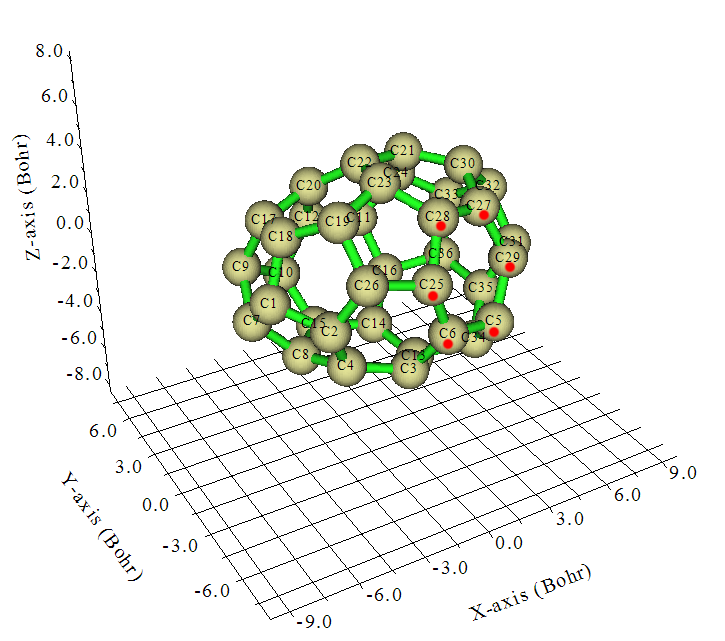
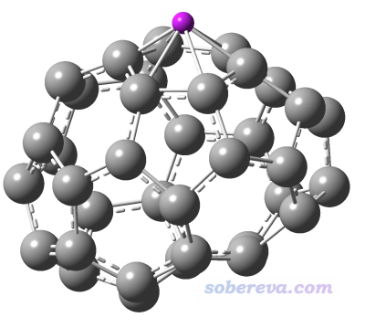

**利用Multiwfn计算倾斜、扭曲环的NICS_ZZ**  
Using Multiwfn to calculate NICS_ZZ of tilted and twisted rings

文/Sobereva @[北京科音](http://www.keinsci.com/)

First release: 2014-Nov-19  Last update: 2023-Aug-11

## 1 前言

NICS、NICS(1)_ZZ的定义在《衡量芳香性的方法以及在Multiwfn中的计算》（<http://sobereva.com/176>）的3.1节有详细介绍。NICS(1)_ZZ具体指的是垂直于环平面上方1埃处在垂直于环平面方向上的磁屏蔽值的负值。对于平面体系，这很好算，比如体系在XY平面上，那么先计算出环的中心，然后把坐标的Z值加1，放置个Bq原子（对于Gaussian来说），然后算NMR，读取Bq原子的磁屏蔽张量的ZZ分量取负号即可。但是，被研究的环如果不在XY/YZ/XZ平面上，或者环本身就是扭曲的而非完美平面，那么计算NICS(1)_ZZ就很麻烦了，光是确定要计算的Bq原子的位置就不好搞。比如下面的例子，C36的一个异构体，假设要研究红点标注的5,6,25,28,27,29这个六元环，它既是斜着的，又不是纯平面。

虽然也可以旋转这个团簇，让这个环正好基本平行于XY平面上，然后按照常规步骤算NICS(1)_ZZ，但是如果要研究的环很多，每研究一个环都这么转一次结构，实在太麻烦。而利用Multiwfn (<http://sobereva.com/multiwfn>)，则可以很方便地解决计算倾斜非平面环的NICS(1)_ZZ的问题。下面就以上面那个环作为例子，来演示一遍操作。

## 2 实例

C36的pdb文件，以及下文涉及的Gaussian的输入、输出文件可以在这里下载：<http://sobereva.com/attach/261/file.rar>。

我们先计算出环中心。有很多方法计算环中心，两种比较常用，其一是取环的质心，其二是取环的AIM理论中的环临界点(RCP)位置。由于前者不需要波函数文件，有结构就行了，为了省事我们此例就用质心。后者也可以十分方便快速地通过Multiwfn的拓扑分析功能得到，可参见《使用Multiwfn做拓扑分析以及计算孤对电子角度》（<http://sobereva.com/108>）。

启动Multiwfn，输入以下命令  
Fullerene_No.1-C2.pdb   // C36结构文件  
100   //其它功能（Part 1）  
21   // 计算各种基于几何结构的属性  
5,6,25,27-29   // 组成环的原子的序号，这些原子将会被用来计算各种基于几何结构的属性  
从输出文件中我们看到了此环的质心  
Center of mass (X/Y/Z):     0.96300000   -1.89100000    0.43750000 Angstrom

我们把质心坐标复制下来，退回到Multiwfn主菜单，然后输入  
25  //离域性与芳香性分析  
4   //辅助计算非平面体系的NICS_ZZ  
0.96300000   -1.89100000    0.43750000   //粘贴刚才的质心坐标  
因为这个环本身不是完全平面的，因此也没有办法唯一地定义一个平面来代表它。但可以通过环上的原子根据最小二乘法拟合出一个最具有代表性的平面。因此我们输入5,6,25,27-29，使Multiwfn根据环上的这些原子的坐标进行拟合。

屏幕上显示  
  RMS error of the plane fitting:    0.194520 Angstrom  
 The unit normal vector is    0.31391747   -0.90899632    0.27419245

 The X,Y,Z coordinate of the points below and above 1 Angstrom of the plane from  
 the point you defined, respectively:  
    0.6490825274   -0.9820036752    0.1633075459 Angstrom  
    1.2769174726   -2.7999963248    0.7116924541 Angstrom

告诉了平面的拟合误差（如果平面本身就是纯平的则误差为0）、此平面的单位法向量，以及从刚才输入的环中心沿着法向量向上和向下分别移动1埃后的坐标。这两个坐标就可以设为Bq原子来计算NICS(1)_ZZ了。假设整个体系大体是个平面，那么用这两个点的NICS(1)_ZZ值取平均是比较合理的。不过当前体系是笼状体系，所以我们只应当取处在环外的那个点来算NICS(1)_ZZ。

建议先别关Multiwfn，因为待会儿还得把算好的Bq点的屏蔽张量输进去。如果关了的话，之后还得重新做上述操作。

我们基于C36的结构创建一个Gaussian输入文件，然后把刚才得到的1.2769174726   -2.7999963248    0.7116924541这个点作为Bq原子的位置，此时输入文件如下（此文仅作为示例，纯粹为节省计算量用STO-3G，实际研究中决不能低于6-31G*，否则结果没法用）  
# B3LYP/STO-3G NMR nosymm  
[空行]  
Generated by Multiwfn  
[空行]  
 0 1  
C     -3.06300000   -0.54400000    0.11800000  
C     -2.20500000   -1.61200000   -0.25800000  
...[略]  
C      2.55900000   -0.14400000   -1.38400000  
C      2.29700000    1.21800000   -1.08100000  
Bq 1.2769174726   -2.7999963248    0.7116924541

用gview查看一下，可见Bq原子位置很合适，确实是在环平面上方1埃处

注意输入文件里的nosymm很重要，如果不写的话，Gaussian可能会自动旋转体系到标准朝向下，导致垂直于环平面的方向在计算前后不同，Multiwfn也就没法正确提取垂直于环平面方向的分量了。

用Gaussian计算此文件，看到NMR部分Bq原子的输出  
      37  Bq   Isotropic =    -6.1406   Anisotropy =    25.7238  
   XX=     0.0370   YX=    -0.4791   ZX=    -1.2514  
   XY=     3.5065   YY=   -23.1631   ZY=     7.3440  
   XZ=     7.0901   YZ=   -35.5524   ZZ=     4.7043  
   Eigenvalues:   -29.2734    -0.1570    11.0086

切换回Multiwfn窗口，将屏蔽张量依次输入进去：  
0.0370,-0.4791,-1.2514  
3.5065,-23.1631,7.3440  
7.0901,-35.5524,4.7043  
（秘籍：想图省事的话，把Gaussian输出文件的屏蔽张量那三行一次性直接粘贴到Multiwfn窗口里也可以）

最后会显示  
The shielding value normal to the plane is      -12.1124014284  
The NICS_ZZ value is thus       12.1124014284  
即NICS(1)_ZZ值为12.11（单位是ppm）。

其实本例在进入主功能25的子功能4之前可以不去特意用主功能100的子功能21。因为当前用的环中心就是几何中心，而且定义拟合平面用的原子就是环上的所有原子。对于这种情况，直接进入主功能25的子功能4，让你输入环中心的时候直接敲回车，之后输入环上的原子序号后，程序自动就会将这些原子的几何中心作为环中心。

## 3 其它事项

对于平面上方和下方1埃处的NICS(1)_ZZ都需要计算的情况，你在输入屏蔽张量的界面里，把平面上方1埃处的屏蔽张量粘贴进去，得到的就是上方1埃处的NICS_ZZ(1)，如果把下方1埃处的屏蔽张量粘贴进去，得到的就是下方1埃处的NICS_ZZ(1)。

顺带一提，虽然NICS(0)_ZZ我很不推荐，但如果非要算的话，步骤和上述一样，只不过把Bq放在环中心即可。要计算比如NICS(5)_ZZ也可以，也就是把环中心坐标加上5*单位法向量，就得到了要算的垂直于平面上方5埃处的点的坐标。之后的步骤和文中一样，输入那个点的屏蔽张量即可。

如果要研究的环有多个，那么按照上述步骤，确定出各个环要计算的Bq原子位置，都写进Gaussian输入文件里，只需要Gaussian算一次即可，而不需要每研究一个环都单独算一次。
