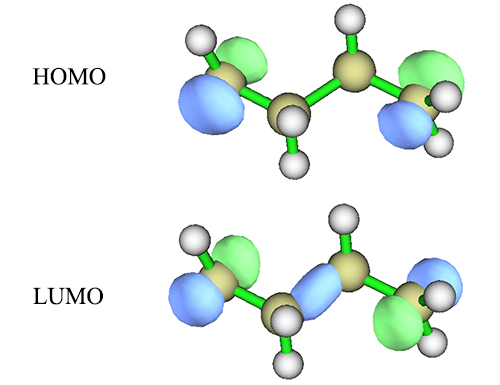
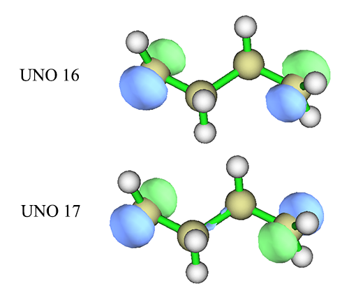
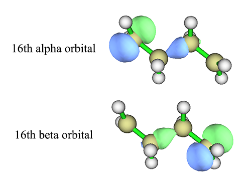
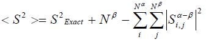

**CASSCF计算双自由基以及双自由基特征的计算**  
Using CASSCF to calculate diradicals and calculation of diradical characteristics

文/Sobereva@[北京科音](http://www.keinsci.com/)   2014-11-24

## 1 前言

双自由基就是指一个体系里有两个未成对儿电子，它们的自旋相反，因此是单重态的体系。

普通的单重态体系是闭壳层的，所有电子都是配对儿的。最理想的双自由基体系，是两个自旋彼此相反的单电子之间完全不配对儿，二者的空间分布彼此完全分离。而多数双自由基体系，情况介于二者之间，即两个单电子之间部分配对儿，分布没有完全分离。

本文主要讨论的是Yamanaka等人提出的双自由基特征y的计算。其数值从0到1，0对应闭壳层，越接近1说明体系双自由基特征越明显，1就是理想双自由基。本文还顺带讨论怎么用CASSCF计算双自由基体系。

文中的量子化学计算通过Gaussian 09完成，用到的Multiwfn可以在<http://sobereva.com/multiwfn>免费下载。本文对CASSCF的计算介绍仅仅是皮毛，在北京科音高级量子化学培训班（<http://www.keinsci.com/KAQC>）里有极其详细全面的CASSCF计算的讲解并给了巨量例子，欢迎参加。

## 2 CI波函数下的双自由基特征

### 2.1 理论

在笔者《小谈几种量子化学方法对氢分子解离过程的描述》（<http://sobereva.com/59>）一文中曾详细介绍了CI、RHF、UHF、VB方法对氢分子解离成两个氢原子过程的处理。文中提到，CI可以完美地描述这个过程。H2的CI波函数可以写为  
ψCI=c1*ψG+c2*ψD  
其中ψG是基态组态，即两个电子都占据H2的成键轨道（HOMO）的组态函数，ψD是两个电子都激发到H2的反键轨道（LUMO）的组态函数。ψCI也可以等价地用两个氢原子a、b的1s原子轨道来描述，记为Xa和Xb  
ψCI=[(c1+c2)*(|Xaα Xaβ|+|Xbα Xbβ|)+(c1-c2)*(|Xaα Xbβ|-|Xaβ Xbα|)]/2  
其中| |是slater行列式符号。诸如Xbα就代表Xb上占据α电子。

在H2平衡距离下，c1几乎为1，c2几乎为0。c1不完全为1是因为必须引入ψD才能体现电子动态相关。  
在解离过程中，c1不断减小，c2不断增大。  
当H2彻底解离为两个相距很远的氢原子后，成为完美的双自由基体系，两个氢原子各带一个电子且彼此自旋相反，空间上完全分离。此时c1=1/√2，c2=-1/√2，两个组态的权重（系数的平方）完全一致了。ψCI=(ψG-ψD)/√2这种波函数的形式不容易直接其物理含义，但是改写为用原子轨道表示，即(|Xaα Xbβ|-|Xaβ Xbα|)/√2，意义一下子就清楚了，这是正是两个氢原子各带的一个电子所构成的单重态自旋匹配波函数。

可见，双激发组态的权重c2^2越大，双自由基特征越强，和基态组态权重c1^2相同时就是完美双自由基。基于这个考虑，Yamaguchi在Chem. Phys. Lett., 33, 330 (1975)中将y=2*c2^2定义为双自由基特征，完美双自由基时c^2=1/2，故y恰为1。

### 2.2 CASSCF计算双自由基C4H8实例

CI波函数描述双自由基在形式上是完美的，实际中用的更多的是CASSCF波函数，即不光变分CI系数，还变分轨道系数。描述双自由基至少用CAS(2,2)，把那两个单电子轨道以相位相同和相位相反方式组合构成的两个分子轨道纳入活性空间里，这样才能产生合理描述双自由基所需要的ψG和ψD。

解离后的H2可以说是最最最简单、最完美的双自由基的模型体系，实际的双自由基体系还有许许多多其它的轨道，但是我们通常还是能从中找出与构成双自由基直接相关的两个分子轨道并将之纳入活性空间的，很多情况下这两个轨道就是HOMO和LUMO。比如C4H8这个体系，分子两头各缺一个氢，故必然是单电子出现的位点，在HF/6-31G*下计算后，HOMO和LUMO分别是（等值面数值为0.1）

回想H2的成键轨道和反键轨道的形态，很明显，这里HOMO就是分子两端的单电子轨道以相位相同方式组合，而LUMO就是以相位相反方式组合产生的。因此将这两个轨道弄进CAS(2,2)活性空间就可以至少定性正确描述这个双自由基了。值得一提的是，LUMO轨道中在分子中间也出现了一坨，这和表现双自由基关系不直接，但是问题不大，反正之后CASSCF还会对轨道变分。

这里我们就完整地算一下C4H8，看看它的双自由基特征是多少。本文用的C4H8的结构：  
C     -0.74742092    1.77656753    0.00000000  
H     -0.62438907    2.32965189    0.92333358  
H     -0.62438907    2.32965189   -0.92333358  
C     -0.74742092    0.30933780    0.00000000  
H     -1.24978876   -0.09122321    0.88294562  
H     -1.24978876   -0.09122321   -0.88294562  
C      0.74742092   -0.30933780    0.00000000  
H      1.24978876    0.09122321   -0.88294562  
H      1.24978876    0.09122321    0.88294562  
C      0.74742092   -1.77656753    0.00000000  
H      0.62438907   -2.32965189   -0.92333358  
H      0.62438907   -2.32965189    0.92333358

整个过程是  
第一步：#P HF/6-31G*  
第二步：#P CAS(2,2)/6-31G* guess=read  
我们做CASSCF时不需要调换轨道顺序，因为HOMO和LUMO就是要用的两个轨道。输出的信息中看到  
          Configuration         1 Symmetry 1 10  
          Configuration         2 Symmetry 4 ab  
          Configuration         3 Symmetry 1 01  
以及  
   ( 1)     EIGENVALUE    -156.0256130028  
 (    1) 0.7961444 (    3)-0.6051067 (    2) 0.0000000 (  
其中组态1就是ψG，组态3就是ψD。c1=0.7961444，c2=-0.6051067，故此体系的双自由基特征=2*(-0.6051067)^2=0.732。

### 2.3 用UHF的自然轨道做CAS

也经常有人用非限制性计算(UHF/UDFT)得到的自然轨道作为CASSCF的活性空间的轨道算双自由基，这种轨道称为UNO (UHF natural orbital)。这里也用C4H8来演示一下。如果不熟悉怎么用非限制性计算来计算双自由基，务必先看看《谈谈片段组合波函数与自旋极化单重态》（<http://sobereva.com/82>）。

我们先看看UNO轨道形状是什么样。先用#P UHF/6-31G* guess=mix计算来得到对称破缺波函数，此时UHF波函数就存到了check文件里，然后再用#P HF/6-31G* guess=(naturalorbitals,read,save,only)算一次。这说明，从check里读取波函数(read)，转化成无自旋自然轨道(naturalorbitals)，保存到check文件里(save)，然后任务就停掉(only)。之后把chk文件转化成fch，用文本编辑器打开fch文件，把第一行内容改为saveNO，再用Multiwfn打开此fch文件并进入主功能0。在图形窗口上方选orbital info.-show all，我们看到UNO轨道信息  
...[略]  
Orb:    13 Ene(a.u./eV):     0.000000       0.0000 Occ:  1.996827 Type: A+B  
Orb:    14 Ene(a.u./eV):     0.000000       0.0000 Occ:  1.996534 Type: A+B  
Orb:    15 Ene(a.u./eV):     0.000000       0.0000 Occ:  1.996049 Type: A+B  
Orb:    16 Ene(a.u./eV):     0.000000       0.0000 Occ:  1.123073 Type: A+B  
Orb:    17 Ene(a.u./eV):     0.000000       0.0000 Occ:  0.876927 Type: A+B  
Orb:    18 Ene(a.u./eV):     0.000000       0.0000 Occ:  0.003951 Type: A+B  
Orb:    19 Ene(a.u./eV):     0.000000       0.0000 Occ:  0.003466 Type: A+B  
...[略]  
（注：如果不把fch文件开头改成saveNO，那么占据数就会显示到能量ene那列去，如果只是为了看轨道倒是无妨，但如果还想用Multiwfn计算性质，如密度、静电势、ELF等，结果就错了）

从输出信息中看到，<=15号的UNO差不多都是双占据轨道，>=18号的几乎都是零占据的虚轨道。而RHF计算时原本是HOMO和LUMO的16、17号轨道现在占据数明显偏离整数，如下一节所示，这正是双自由基体系的明显特征。来看看它们的形状

对比HOMO和LUMO的图，会看到其实UNO 16和HOMO没明显差别，UNO 17和LUMO的主要差异在于分子中间的那一坨多余的区域没了（isovalue设小后还是会看到它的存在，只不过数值减小了很多），因此更纯粹地表现出分子两端的单电子轨道的组合。对于其它体系可能分子轨道和UNO的差异更大，如果届时从分子轨道中不好找出合适的用于CASSCF活性空间的轨道，就可以考虑用UNO。

接下来用#P CAS(2,2)/6-31G* guess=read做计算即可，这些UNO就被用作初猜轨道了，且UNO 16、17都处在活性空间。结果和上一节基于MO来做是一致的。

上面用UNO做CAS计算共经历了三步：  
#P UHF/6-31G* guess=mix  
#P HF/6-31G* guess=(naturalorbitals,read,save,only)  
#P CAS(2,2)/6-31G* guess=read

实际上可以化简为两步  
#P UHF/6-31G* guess=mix  
#P CAS(2,2,UNO)/6-31G* guess=read  
这代表，做CASSCF的时候，先从check文件中读取上一步的UHF波函数，自动转化为UNO，然后再用它作为CASSCF的初猜。

这里都是假定与HOMO、LUMO编号对应的那两个UNO是要被纳入活性空间的，但如果和实际情况不符，要取的是别的UNO，那么应该用guess(read,alter)来调换UNO轨道顺序，就像平时调换MO顺序做CASSCF那样。（无论是两步方法还是三步方法，都是这么用alter调换UNO顺序）

大家若有兴趣，可以在CASSCF做完之后观看一下chk里的轨道，会发现CASSCF优化出的16、17号轨道相较HOMO、LUMO，和UNO 16、17号在形状上明显更为接近，故此例使用UNO比用MO作为CASSCF初猜轨道可能更有优势。不过，如果基于MO做CASSCF就能正常收敛，如C4H8，其实没必要非得用UNO。

## 3 UHF波函数的双自由基特征

这里只讨论UHF的情况，UDFT的情况在处理上是完全一致的。

由于双自由基是单重态的，直接用UHF的结果和RHF是相同的，必须用guess=mix等关键词获得对称破缺解，这在《谈谈片段组合波函数与自旋极化单重态》（<http://sobereva.com/82>）已经谈了很多了，这里不再累述，只着重说说怎么计算UHF波函数的双自由基特征。

UHF波函数下，双自由基特征可以基于三种方法来计算：  
(1)基于alpha和beta轨道重叠来计算  
(2)基于<S^2>来计算  
(3)基于UNO占据数来计算  
对于H2这种理想体系，没有其它轨道影响，这三种形式是等价的，而实际情况由于其它轨道的影响，三种方式计算结果会有一定的差异。下面就分别谈谈这三种计算方式，并且用C4H8作为实例。

### 3.1 基于alpha和beta轨道重叠来计算

UHF波函数中alpha轨道彼此间是正交归一的，beta轨道彼此间也是正交归一的，但是alpha和beta轨道之间并非总是正交归一。对于双自由基体系，我们可以看成RHF波函数原本的一个双占据轨道（通常是HOMO）发生了分裂，形成空间分布并不重合的一个alpha轨道和一个beta轨道。二者空间分布分离越大，显然双自由基特征越强，这可以用它们重叠积分来衡量。

基于自旋投影UHF理论，Chem. Phys. Lett., 33, 330 (1975)中给出了UHF波函数双自由基特征表达式  
y=1-(2*T)/(1+T^2)  
其中T是空间发生分离的那一对儿alpha和beta轨道间的重叠积分。这个表达式和前面的y=2*c2^2形式是内在对应的。

这个重叠积分T有两种方式计算，一种是直接基于alpha和beta分子轨道计算，一种是基于双正交化轨道计算。大多数情况下二者结果相差不太多。然而，很多情况下并不只有一对儿alpha和beta分子轨道之间有明显分离，显然此时仅用一对儿alpha和beta分子轨道间的重叠积分计算双自由基特征就不准确了。我在《用于非限制性开壳层波函数的双正交化方法的原理与应用》（<http://sobereva.com/448>）里详细交代了什么叫双正交化，分子轨道经过双正交化变换后会令alpha和beta轨道间尽最大程度匹配，alpha和beta电子分布的不匹配性尽可能只体现在一对（至少是尽可能少数目的）alpha和beta双正交化轨道之间，显然这一对双正交化轨道之间的重叠积分用来算双自由基特征是最适合的。由于使用Multiwfn做双正交化变换并不花什么时间，因此我建议始终基于双正交化轨道计算双自由基特征。下面以C4H8为例具体演示一下怎么用Multiwfn实现基于分子轨道和基于双正交化轨道算前述的重叠积分T。不熟悉Multiwfn者建议阅读《Multiwfn入门tips》（<http://sobereva.com/167>），**使用Multiwfn这些功能发表文章时务必按照程序启动时的提示恰当引用Multiwfn原文**。  
  
我们先用# UHF/6-31G* guess=mix关键词计算体系得到对称破缺波函数，将记录它的chk文件用formchk转化为fch文件，这可以作为Multiwfn的输入文件。  
  
**(1)基于alpha和beta分子轨道算重叠积分**  
将fch文件载入进Multiwfn后进入主功能100，再进子功能5，选选项2，我们就得到了每个alpha分子轨道和序号对应的beta分子轨道的重叠积分：  
...[略]  
Overlap between the    13th alpha and beta orbitals:    0.986728  
Overlap between the    14th alpha and beta orbitals:   -0.961990  
Overlap between the    15th alpha and beta orbitals:   -0.995562  
Overlap between the    16th alpha and beta orbitals:    0.042710  
Overlap between the    17th alpha and beta orbitals:    0.149644  
Overlap between the    18th alpha and beta orbitals:    0.939765  
...[略]

前16号alpha/beta分子轨道都是占据轨道。可见第16号alpha和beta分子轨道的重叠积分的绝对值0.042710很小，说明这两条轨道分离很充分，而其它序号相同的alpha和beta占据轨道之间则重叠积分的绝对值都很接近1，因此第16号alpha和beta分子轨道的重叠积分0.042710就可以作为前式中的T。把T=0.042710代入y表达式，得到双自由基特征为0.915，比2.2节基于CAS(2,2)波函数得到的0.732大不少。  
  
这两条轨道，如下图所示，确实看上去是分别描述alpha和beta单电子的轨道。注意如《使用Multiwfn观看分子轨道》（<http://sobereva.com/269>）所说，在Multiwfn观看轨道的主功能0里，输入16显示的是16号alpha轨道，输入-16显示的是16号beta轨道。  

**(2)基于双正交化轨道算重叠积分**  
将fch文件载入Multiwfn后依次输入  
100  //其它功能（Part 1）  
12  //双正交化  
1   //双正交化占据轨道  
0  //不计算双正交化轨道能量  
此时从屏幕上可见  
Singular values of orbital overlap matrix:  
  1.0000   1.0000   1.0000   1.0000   0.9999   0.9999   0.9999   0.9998  
  0.9993   0.9991   0.9990   0.9990   0.9968   0.9965   0.9960   0.1231  
最后一个数对应第16号双正交化alpha轨道和第16号双正交化beta轨道间的重叠积分，可见有且仅有这一对轨道数值远小于1，说明这适合作为计算双自由基特征的重叠积分T。将之代入双自由基特征的表达式，得到结果0.757，和基于CAS(2,2)波函数得到的0.732相符很好！如果你想观看双正交化轨道，之后输入y，退回到主菜单然后进主功能0观看即可。

### 3.2 基于<S^2>来计算

波函数的自旋平方算符期望值<S^2>和精确值S^2_Exact=S(S+1)之间有如下关系（见Szabo的Modern quantum chemistry p107）

其中Nα和Nβ分别是alpha和beta电子数，S_ij是i号alpha和j号beta轨道重叠积分。由此式可见，如果每个alpha占据轨道都能和一个beta占据轨道唯一地匹配（积分值为1）而和其它的正交（积分值为0），那么<S^2>就是精确值S^2_Exact，RHF、ROHF波函数就属于这种情况。而对于UHF计算，只要由于自旋极化导致alpha和beta占据轨道分布发生分离，那么<S^2>肯定会偏离精确值，这就是常说的UHF波函数的自旋污染问题。

假设只考虑对应单电子的那一对儿alpha和beta轨道而忽略其它的，上式可简化为  
ΔS^2=<S^2>-S^2_Exact=1-T^2  
值得一提的是，双自由基体系S^2_Exact=0，因此对于理想双自由基，即T=0的情况，<S^2>应为1。

将T=√(1-ΔS^2)代入3.1节y的表达式，就可以得到基于<S^2>与精确值偏差量ΔS^2的双自由基特征表达式  
y=1-2*√(1-ΔS^2)/(2-ΔS^2)

不过这个式子往往没法用。比如C4H8这个体系在#P UHF/6-31G* guess=mix计算后输出的<S^2>=ΔS^2=1.0142，代入y表达式的话，根号里就成负值了。这是由于其它alpha和beta轨道间也出现了一定的分离，明显影响了体系的<S^2>所致，只考虑一对儿alpha和beta轨道不合适。

### 3.3 基于UNO占据数来计算

重叠积分T和UNO占据数也有直接联系。设只考虑对应单电子的那一对儿alpha和beta轨道而忽略其它的，则编号对应HOMO和LUMO的UNO的占据数（记为n_HOMO和n_LUMO）将分别为1+T和1-T，故T=(n_HOMO-n_LUMO)/2。因此，我们可以通过UNO占据数获得T再获得y。对于理想双自由基，n_HOMO和n_LUMO都将为1。

2.3节中我们已经看到了C4H8的UNO占据数了，n_HOMO=1.123073，n_LUMO=0.876927，故T=0.123，y=0.758。和3.1节直接通过重叠积分算出来的0.915有不小差别，这是因为这里得到自然轨道占据数的时候把其它轨道的影响也纳入进去了，结果倒是比较接近于CAS(2,2)得到的0.732。因此，如果不想做CAS，而想基于方便快速的UHF波函数来定量考察双自由基特征的话，通过UNO占据数计算是比较理想的选择。C4H8的0.7几的双自由基特征说明此体系是较明显的双自由基，尽管alpha和beta单电子分布还没有完全分离，离理想双自由基还有点距离。

实际上，只需要UNO占据数的话，并不需要2.3节那么多关键词而且分两步，只需要用#P UHF/6-31G* guess=mix pop=NO算一次就够了，会看到这样的输出  
                          16        17        18        19        20  
     Eigenvalues --     1.12307   0.87693   0.00395   0.00347   0.00317  
   1 1   C  1S          0.01911   0.00845  -0.07955   0.10559  -0.08133  
   2        2S         -0.04188  -0.01951   0.15207  -0.21148   0.16843  
Eigenvalues便是这些UNO的占据数，即UHF无自旋密度矩阵的本征值。

## 4 杂谈

相对于用CASSCF计算双自由基，UHF虽然不如它准确，但好处是快、方便，而且有自旋密度，通过自旋密度能直接看到未成对儿alpha和beta电子分布，只要在Multiwfn里进入主功能5后选自旋密度然后按提示操作就能得到自旋密度等值面图，单电子在什么位置一目了然。而CI波函数虽然精确、完美表现了两个单电子处于自旋相反的状态，但是却得不到自旋密度。

如3.2节的<S^2>公式可见，只要用UHF描述双自由基，就一定会出现自旋污染，而且对于理想双自由基偏差值高达1.0，于是就总有人盲目地批判UHF/UDFT有自旋污染，好像偏差值这么大就根本不能用似的，这是大错特错！<S^2>与理想值偏差大，虽然意味着波函数与真实波函数偏差大，但并不意味着能量不合理！对于H2完全解离这样的理想双自由基，UHF和FCI结果是一致的，尽管前者表面上看自旋污染达到1.0已经大得要命了。自旋污染对于DFT波函数更是难以讨论，本来DFT引入波函数的初衷就是为了获得可靠的动能密度而不是构造真实的波函数，故不应当根据波函数的合理性来讨论DFT结果的合理性。从实效上来讲，UDFT计算双自由基还是不错的。
