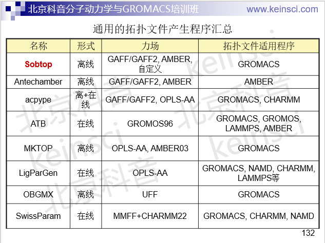

**几种生成有机分子GROMACS拓扑文件的工具**  
Several tools for generating GROMACS topology files of organic molecules

文/Sobereva@[北京科音](http://www.keinsci.com)  
First release：2014-Dec-9  Last update: 2024-Nov-5

本文把各种可以产生GROMACS拓扑文件的工具进行汇总。具体细节和实际使用例子笔者在北京科音分子动力学与GROMACS培训班里会详细讲（<http://www.keinsci.com/workshop/KGMX_content.html>）。

值得一提的是，这些程序有很多不能产生原子电荷，或者产生的原子电荷质量较差。RESP电荷是最适合分子动力学模拟使用的电荷之一，AMBER、GAFF、GLYCAM等力场将之作为御用的原子电荷，将RESP电荷与UFF力场结合使用也是得当的。Multiwfn是计算RESP电荷最简单、最好、最灵活而且完全免费的工具，原理、用法和实例见《RESP拟合静电势电荷的原理以及在Multiwfn中的计算》（<http://sobereva.com/441>）、《计算RESP原子电荷的超级懒人脚本（一行命令就算出结果）》（<http://sobereva.com/476>）、《RESP2原子电荷的思想以及在Multiwfn中的计算》（<http://sobereva.com/531>）。另外，OPLS-AA力场很适合结合1.2*CM5电荷使用，用Multiwfn的主功能7的子功能16直接就能计算出CM5电荷，将之手动乘以1.2即是1.2*CM5电荷，可以用Gaussian、ORCA等程序产生的fch/wfn/wfx/molden等格式作为Multiwfn的输入文件，详见《详谈Multiwfn支持的输入文件类型、产生方法以及相互转换》（<http://sobereva.com/379>）。如果你完全不会用Gaussian的话，可以直接用这个傻瓜式脚本，一行命令就能算出来：《计算适用于OPLS-AA力场做模拟的1.2*CM5原子电荷的懒人脚本》（<http://sobereva.com/585>）。另有专门结合ORCA用的傻瓜式脚本，见《ORCA结合Multiwfn计算RESP、RESP2和1.2*CM5原子电荷的懒人脚本》（<http://sobereva.com/637>）。

## • Sobtop（<http://sobereva.com/soft/Sobtop>）

这是我开发的GROMACS拓扑文件产生工具，主要产生GAFF/GAFF2、AMBER力场的拓扑文件，但由于其力场库可以自行非常方便地修改和扩充，因此Sobtop本质上是完全普适、通用的。Sobtop可谓是最理想、最灵活、最易用的产生GROMACS拓扑文件的工具。此程序用起来超级简单，什么额外的程序以及特殊的运行环境都不需要装，解压即用。Sobtop使用极其方便，照着屏幕上的提示敲几下键盘，itp、top和gro文件就产生了，另外也可以要求产生rtp文件。Sobtop的主页有非常详细的产生各类体系拓扑文件的例子，并给出了详细的相关要点的说明。从例子中你会体会到Sobtop的设计特别注重兼顾便利和灵活，初级用户会体会到它极其便利，而高级用户则会体会到通过Sobtop构建复杂体系拓扑文件特别灵活好用。

Sobtop可以产生任意体系的拓扑文件，有机和无机小分子、过渡金属配合物、聚合物、共价团簇、晶体、二维材料等等全都可以产生，孤立体系和周期性体系都支持。Sobtop可以用于包含任意元素的体系，那些GAFF/GAFF2/AMBER不支持的元素可以自动让Sobtop用UFF的，或者自己定义额外原子类型。对于GAFF/GAFF2/AMBER力场里缺失的成键相关参数，可以直接让Sobtop基于量子化学程序产生的Hessian矩阵通过不同方法自动算出来，也可以自己把其它方式得到的（如自己单独拟合、文献中找的）添到力场库文件里让Sobtop直接用。Sobtop运行效率特别高，甚至对于几千原子体系的拓扑文件都可以搞。

Sobtop极度灵活，提供许多不同的指认原子类型的方式，可以自动指认GAFF/GAFF2/AMBER原子类型，也可以手动指认，也可以自定义判断规则让Sobtop结合实际化学环境和成键关系判断，等等。Sobtop还提供了丰富的指认力场成键相关参数的方式，比如可以都用力场库文件里的，都用直接基于Hessian算出来的参数，或者一部分作为刚性（里面的参数都基于Hessian算出来的）而其余部分作为柔性（参数用力场库里的，可以考虑二面角的可旋转性），等等。Sobtop还可以调用Multiwfn或OpenBabel自动指认EEM、Gasteiger、MMFF94原子电荷，还可以载入Multiwfn计算RESP/RESP2等电荷产生的chg文件来获得原子电荷。Sobtop的设计在各方面都特别贴心，比如在产生的拓扑文件里非常详细地注释各个力场项的参数来源、是否是缺失的，在自己手动改和补参数时很方便。

有了Sobtop，下面介绍的acpype就没有任何使用价值了。acpype只适合产生GAFF能描述的那些有机和极少数无机体系，有特殊成键方式、有GAFF不支持的元素、周期性体系都没法搞；对很大体系耗时非常高；容易出现莫名其妙又不好解决的报错；还得有Python运行环境、安装臃肿的AmberTools...

• acpype  
这是一个Python脚本，可以在<https://github.com/alanwilter/acpype>下载。使用前必须在机子里安装AmberTools（免费），acpype会调用其中的Antechamber先产生Amber格式的拓扑文件然后再转成GROMACS的。acpype用法很简单，要处理xxx.mol2就执行./acpype.py -i xxx.mol2，算完后会新产生一个xxx目录，里头有_GMX后缀的.gro、.itp、.top，直接在GROMACS里用即可。默认情况下，产生的拓扑文件是基于GAFF力场的，另外也会输出_OPLS后缀的基于OPLS力场的文件，但属于实验性质不建议用。.mol2文件用常用的GaussView就可以产生（但必须确保在gview里看到的分子结构中没有诡异的成键方式），也可以通过OpenBabel或Antechamber将其它格式转成.mol2。默认情况下acpype分配的原子电荷是Antechamber产生的AM1-BCC，虽然能用，但明显不如RESP/RESP2电荷理想。建议大家按前述做法用Multiwfn计算出RESP或RESP2电荷，自行写入分子拓扑信息的[atoms]的原子电荷那一列。

如果你懒得为了用acpype而装臃肿庞大的AmberTools，可以用在线版<http://bio2byte.be/acpype/>，不过可能排队要排很久。所以如果你要快速处理较多小分子，还是建议用离线版acpype。

对于稍大的体系，用独立的acpype时强烈建议加上-c user选项以避免acpype自动算AM1-BCC原子电荷，否则在处理期间acpype所调用的Antechamber会先调用SQM程序用半经验方法进行优化然后再算这个电荷。然而SQM不仅慢，做优化还容易不收敛，导致半天也无法成功产生拓扑文件。更何况最后也是要替换为Multiwfn算的RESP/RESP2电荷，故计算AM1-BCC电荷没实际意义。同理，用在线版acpype也是建议把charge method设为user。

• Automated Topology Builder（ATB，<http://atb.uq.edu.au>）：生成GROMACS拓扑文件的在线工具，可以生成基于ATB开发者自行修改的GROMOS96 G54A7力场（扩充了原子类型）的GROMACS或GROMOS程序的拓扑文件。比PRODRG2更先进更可靠，解决了PRODRG2没法自动确定质子化态和charge group指认不准的问题以保证原子电荷可靠，并且能利用对称性保证电荷等价，另外没有PRODRG2那样对于每日提交的数目有限制。ATB虽然设计得不错，可以作为产生小分子GROMOS力场的GROMACS拓扑文件的首选，但它生成的原子电荷、确定的参数的可靠性也只是一般，不能保证总是很理想。如果要做很严谨的模拟研究，还是建议自行计算RESP电荷并且手动检查ATB给出的拓扑文件的合理性，有必要时适当调节。ATB网站上也有个分子库，包含巨量事先搞好的小分子的参数和拓扑文件，其中有的是别人之前提交过的分子，有的是经过专人手工处理过的分子，显然后者可靠程度更高。对于比较常见的分子，提交到ATB之前建议先搜索一下分子库，如果已经有的话就直接用。

• LigParGen（<http://zarbi.chem.yale.edu/ligpargen/>）：生成GROMACS, NAMD, CHARMM, LAMMPS等程序OPLS-AA力场的拓扑文件的工具。毕竟这是OPLS力场开发者自己搞的，因此原则上比MKTOP、TPPmktop更靠谱。可以通过SMILES字符串、.mol、.pdb文件进行输入（用pdb格式时老是报错，我建议用.mol），原子上限200个，可以顺带着让服务器对分子在OPLS-AA力场下做几何优化。分配的原子电荷是1.14*CM1A或1.14*CM1A-LBCC，前者是把CM1A电荷数值乘上1.14得到的，后者是在1.14*CM1A基础上再引入LBCC校正得到的，在J. Phys. Chem. B, 121, 3864 (2017)中已证明这两种原子电荷结合OPLS-AA模拟有机体系凝聚相可以得到不错结果。此服务器还可以输出PQR文件。

本文开头所述的Multiwfn可以计算的1.2*CM5电荷比LigParGen直接给出的电荷在多数情况下更适合做动力学模拟，特别是对于密度、蒸发焓的精度方面而言，这点在J. Phys. Chem. B, 121, 3864 (2017)的测试中充分体现了。而且对于一些分子，LigParGen给出的原子电荷加和不精确为0，而是比如0.0001，这导致此类分子数目较多时体系总电荷对整数有不可忽视的偏离，对模拟造成不良影响。因此建议大家将LigParGen给出的itp文件里的原子电荷部分替换为Multiwfn得到的1.2*CM5电荷。

• MKTOP：是个Perl脚本，可以在<https://github.com/aar2163/MKTOP/blob/master/mktop.pl>下载。支持OPLS-AA和AMBER03力场，电荷没法自动生成而必须自己提供。使用之前需要确保已经安装了Perl运行环境，并且要把mktop.pl脚本开头的GROMACS拓扑文件目录改成当前机子里实际的，比如$gromacs_dir="/sob/gmx2018.8/share/gromacs/top";。之后可以比如这样运行：./mktop.pl -i new.pdb -o new.top -ff opls -conect no。这代表处理当前目录下的new.pdb，产生名为new.top的拓扑文件，使用OPLS-AA力场，并且不使用.pdb里的CONECT字段记录的连接关系而是根据原子之间距离猜测连接关系。之后需要自行把原子电荷填到new.top的[atoms]字段里。我发现有时候此脚本指认的OPLS-AA原子类型是错误的，所以建议按照力场目录下的atomtypes.atp仔细看看指认的原子类型到底是否合理。  
注：以前MKTOP是有在线服务器的（<http://www.aribeiro.net.br/mktop/>），但是如今已经失效。

• OBGMX（<http://software-lisc.fbk.eu/obgmx/>）：生成UFF力场的gromacs拓扑文件的在线工具。由于UFF几乎涵盖整个周期表，因此不光有机分子，也可以使得Gromacs能够处理无机物、周期性体系，比如MOF。由于UFF的力场形式和Gromacs所支持的不完全兼容，此程序给出的参数实际上是对原UFF力场的近似。个别原子类型识别可能有误。电荷必须自己提供。  
2020-Dec-26注：此在线服务器目前已无法使用，但可以下载离线程序使用，见<http://bbs.keinsci.com/thread-21015-1-1.html>。

• SwissParam（<http://swissparam.ch>）：输入有机小分子mol2文件，生成用于CHARMM/NAMD和GROMACS模拟的拓扑、参数文件。力场参数基于MMFF，但只保留谐振项部分，因此只是MMFF的近似。原子电荷通过MMFF方法获得。范德华参数采用CHARMM22中最接近的原子类型。这样的参数比较粗糙，有优化的余地。

• ztop：计算化学公社论坛（<http://bbs.keinsci.com>）上钟成开发的拓扑文件产生工具，请在论坛首页搜索框里搜索ztop看他发的相关帖子了解此程序的特点和使用。

• CGenFF（<https://cgenff.com>）：能够生成CGenFF力场的GROMACS拓扑文件的在线工具，学术用户必须用edu邮箱才能注册。

以下在线程序已失效：

• PRODRG2（<http://davapc1.bioch.dundee.ac.uk/cgi-bin/prodrg>）：历史非常悠久很有名的生成Gromacs拓扑文件的在线工具。只支持GROMOS87/96力场，生成gromacs和其它一些程序的拓扑文件。原子电荷是根据基团指认的，如果基团识别不对那么电荷也不可靠。有在线版和离线版。可以选择自动优化分子结构。此工具在J. Chem. Inf. Model., 50, 2221 (2010)被曝光往往不能正确指认charge group，导致原子电荷分配也很不合理。而且又由于有了更好的ATB，因此如今强烈不推荐使用

• CGenFF（<https://cgenff.paramchem.org>）：先注册，上传有机小分子的mol2文件，即可生成基于CGenFF力场的CHARMM的拓扑文件。如果mol2是gview建的，一定要事先把里面的Ar替换成ar。上传文件的时候不要选Guess bond orders from connectivity和Include parameters that are already in CGenFF。如果文件处理正常，会立刻产生str文件，点击其链接之后把里面内容拷到比如Actos.str里面。进入网页里的More Info & Tools - Utilities，点击GROMACS conversion program，可下载把str文件转换为GROMACS格式的Python脚本cgenff_charmm2gmx.py。对于CentOS 7.2，应运行yum install numpy和yum install python-networkx把这个脚本所需的包装上。去<http://mackerell.umaryland.edu/charmm_ff.shtml#gromacs>里面下载用于GROMACS的CHARMM36力场文件，解压得到比如charmm36-nov2016.ff文件夹，将它和Actos.str、cgenff_charmm2gmx.py都放到当前目录，另外也把此文件夹拷到gromacs的top目录下。假设Actos.str里RESI后面的词是Molecu，最初上传的是Actos.mol2，则运行./cgenff_charmm2gmx.py Molecu Actos.mol2 Actos.str charmm36-nov2016.ff。在当前目录会产生molecu.top、molecu.prm、molecu.itp、molecu.pdb（从mol2转换过来的），适当调整itp和top里的分子名，调整itp里的残基名和结构文件相对应后，即可用于模拟。str文件里的力场参数有penalty指标，数值越大说明此参数可靠性越低，详见网页里的说明。

• TPPmktop（<http://erg.biophys.msu.ru/tpp/>）：在线工具，提供pdb文件，能产生OPLS-AA力场参数的GROMACS拓扑文件。速度比较快，但得到的拓扑文件里有时候会缺参数，或者出现额外的原子类型，需要再手工处理（需要引入额外的力场文件，但是笔者发现在网上下载不到）。此服务器有时候有其它任务在跑，此时无法提交任务，只能等过一阵服务器没任务时再提交。

另外说两个有关的程序

• YASARA AutoSMILES Server（<http://www.yasara.org/autosmilesserver.htm>）是在线版程序，离线的话得买YASARA（建模+可视化+动力学模拟工具）。可以计算AM1-BCC电荷、指认amber94/96/99力场参数。但是产生的文件只能用YASARA View打开，也就是说，拓扑文件相当于YASARA专用的。

• RED（RESP ESP charge Derive，<http://q4md-forcefieldtools.org/REDServer-Development/>）：专门生成RESP电荷的，也能搞力场参数。页面做得不是一般的糟糕，结构十分混乱，令我摸不到头绪，因此笔者也没怎么仔细研究。由于Multiwfn已经完美支持RESP电荷计算了，RED已没有必要使用了。

这里把各种程序做一下总结，是笔者讲授的北京科音分子动力学与GROMACS培训班中的一页幻灯片

