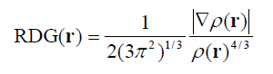
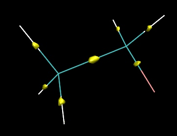
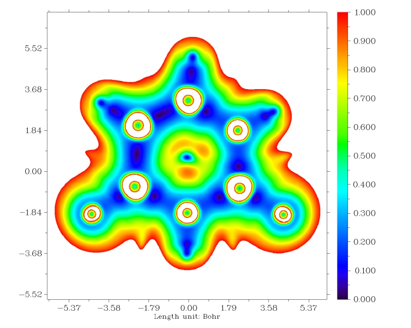
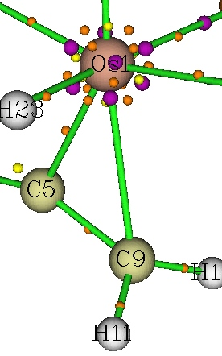
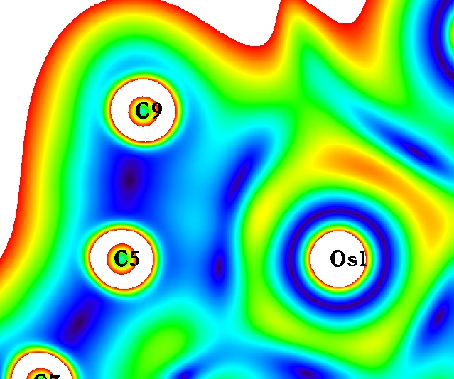
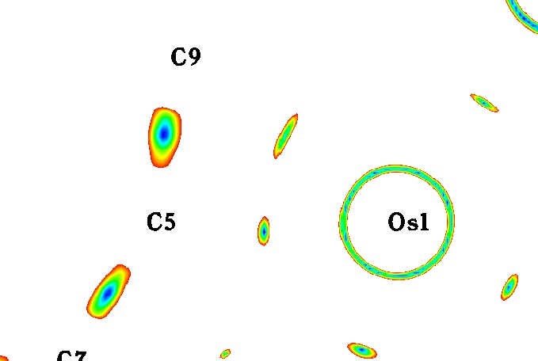

**利用约化密度梯度(RDG)考察AIM临界点的位置**  
Using reduced density gradient (RDG) to examine location of AIM critical points

文/Sobereva @[北京科音](http://www.keinsci.com/)

First release: 2014-Dec-14  Last update: 2022-Aug-17

约化密度梯度(RDG)定义如下

RDG把电子密度梯度转化为了无量纲的形式，用于GGA泛函中。RDG的其它用处想必很多人已经知道了，就是可以考察弱相互作用区域，这在《使用Multiwfn图形化研究弱相互作用》（<http://sobereva.com/68>）、《使用Multiwfn研究分子动力学中的弱相互作用》（<http://sobereva.com/186>）中都已经介绍过了。RDG还有一个不错的用处是可以帮助确定AIM临界点位置，或者解释为什么临界点存在或不存在。

AIM临界点就是指电子密度梯度（具体来说是它的模）为0的位置，介绍见《使用Multiwfn做拓扑分析以及计算孤对电子角度》（<http://sobereva.com/108>）。因此，如果图形化展现电子密度梯度模，就可以直观地看出临界点位置了，而用不着必须做临界点搜索。然而，电子密度梯度的数量级跨度太大，不便于分析，而RDG就没这个问题，数值范围较小，绘图比较方便。RDG=0的位置和电子密度梯度=0的位置是相同的。

Multiwfn (<http://sobereva.com/multiwfn>)可以极为方便地绘制RDG，本文使用3.3.6版。默认情况下，电子密度>0.05的区域的RDG会被自动设为100，原因在《使用Multiwfn图形化研究弱相互作用》中有介绍。为了让所有区域的RDG都能显示，我们先把settings.ini里的RDG_maxrho改为0。

我们这里用C2H5F作为例子，启动Multiwfn，输入  
examples\C2H5F.wfn  
5  
13  
3  
2   //如果想直接用Multiwfn自带的图形界面观看等值面这里就选-1，不过速度不是很快  
在当前目录下得到了RDG.cub，是RDG的cube文件。将之载入到VMD观看等值面，将等值面数值设为一个较小的值，比如0.07，得到下图

每个等值面里面都是数值很小，<0.07的区域。其中就有RDG=0的点，即AIM临界点位置。因此，可以直接观看数值很小的RDG等值面来考察哪里有AIM临界点。但注意，虽然原子核也是AIM临界点，但在上图中没有出现等值面，上图中等值面只展现了键临界点(BCP)的位置，这是因为原子核附近的RDG数值远大于BCP附近的，当前RDG数值设得太小，与原子核对应的等值面太小而看不到。

通过等值面图考察不算很精确。如果只需要考察一个平面，绘制RDG填色图是更好的方法。比如这里绘制尿嘧啶的图。启动Multiwfn依次输入  
examples\uracil.wfn  
4  
13  
1  
[ENTER]  
0  
2  
1  
0

  
从图中可见，在每个原子之间，以及环中心都有颜色非常深的一小块区域表现出相应位置RDG非常小，其中颜色最深的那个点对应RDG=0，正是AIM临界点位置。从图中也可以看出有的原子核的位置上也有个深蓝的小点，对应于核临界点位置（没显示出深蓝小点的原子纯粹是因为那个点太细微了，实际上是都有的）。

利用RDG图形，对于解释AIM临界点的存在与否问题很有用。比如前一阵子有位Multiwfn用户问我，为什么下图中Os1和C9之间的键临界点以及1-5-9三元环中的环临界点没有被Multiwfn搜索出来，表面看上去按理说应该是有临界点才对

他怀疑是临界点搜索方法不对或者搜索参数没用对。实际上，使用RDG图形分析，就可以方便地搞明白这个问题。先对1-5-9三元环绘制RDG填色图，色彩刻度是0~1。

图中可见，1-5-9三元环之间确实没有RDG很小的区域，所以不会有环临界点。但乍一看，奇怪的是，Os1和C9之间明明存在RDG很小区域，为何拓扑分析没找到键临界点？于是猜测到，Os1-C9之间虽然有RDG很小的区域，但其中却没有RDG小到为0的点。为了看清楚，把色彩刻度改为0~0.1再绘制一次，相当于把0~0.1数值范围内的特征进行放大。结果如下所示

 

这回Os1-C9之间并没有深蓝色，即RDG为0的点，因此可证实实际上并不存在对应的键临界点。

可见，当碰到搜索不出本该有的AIM临界点，或者想搞明白某些区域内到底有没有、有哪些临界点的时候，都可按照本文的方法对RDG作图来分析。

特别值得说明的是，笔者提出的IRI和IGMH分析可以对将各种相互作用都直观展现出来，包括没有AIM临界点因此无法通过AIM理论考察的相互作用，见《使用IRI方法图形化考察化学体系中的化学键和弱相互作用》（<http://sobereva.com/598>）和《使用Multiwfn做IGMH分析非常清晰直观地展现化学体系中的相互作用》（<http://sobereva.com/621>）。为什么IRI能有这种能力，见IRI原文里深入详细的分析：Chemistry—Methods, 1, 231 (2021) DOI: 10.1002/cmtd.202100007。
