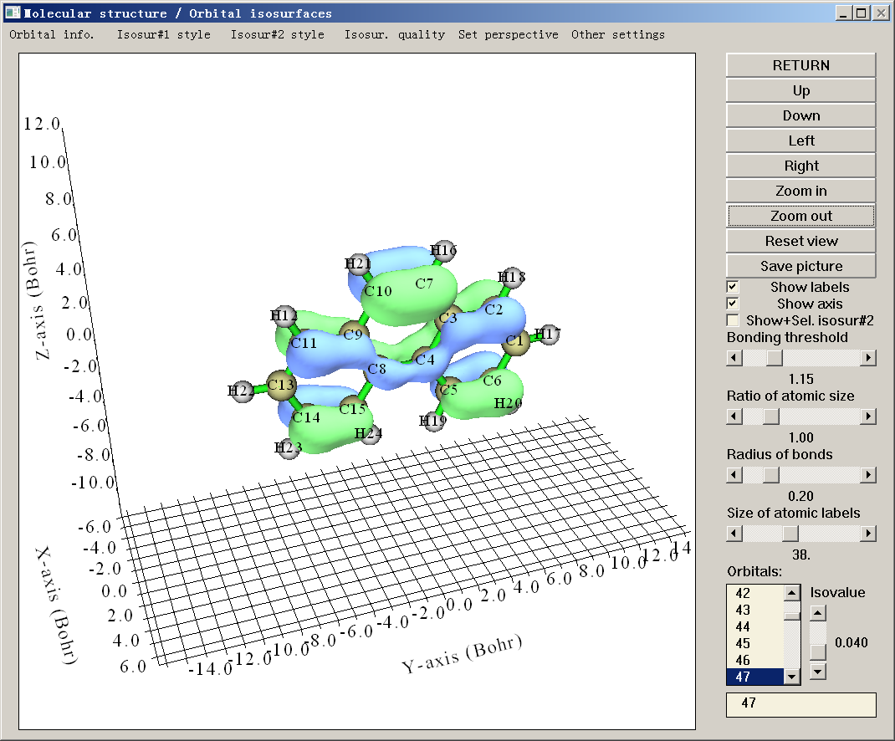
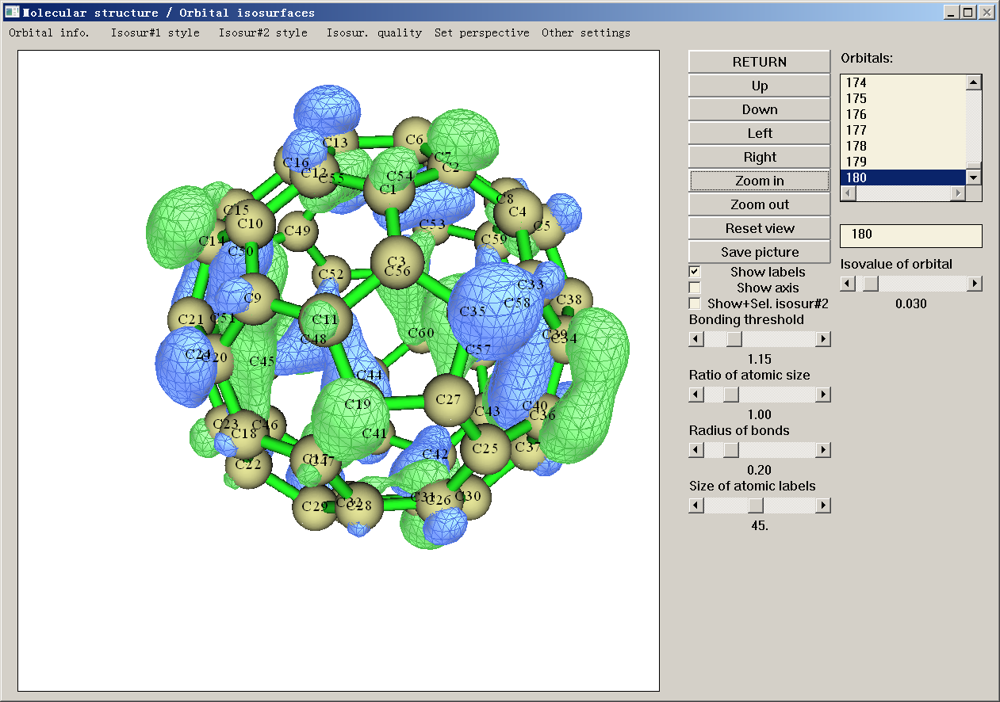
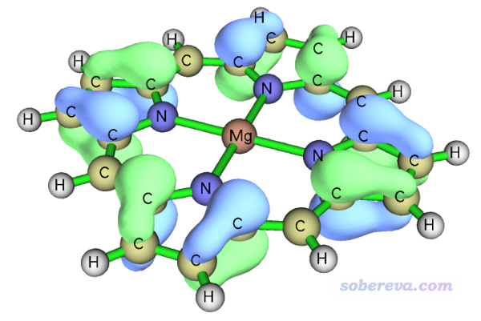
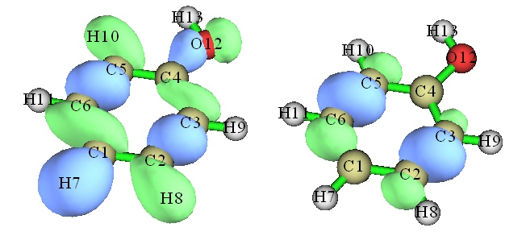
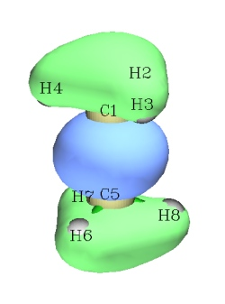
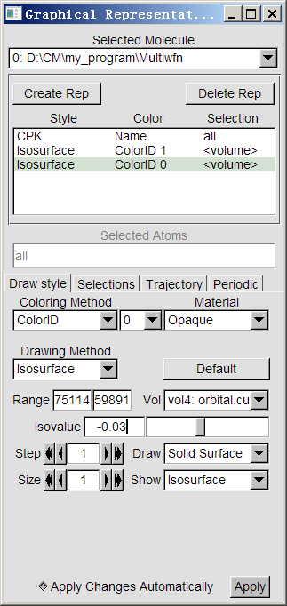
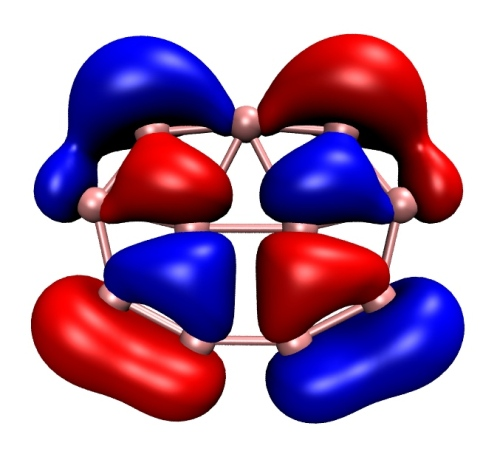
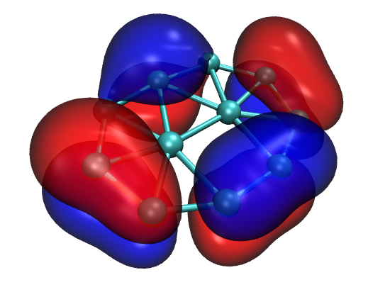
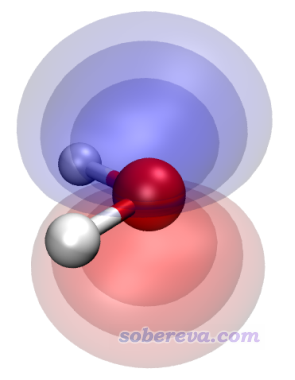

**补充**：笔者后来又写了一篇《使用Multiwfn+VMD快速绘制高质量分子轨道等值面图》（<http://sobereva.com/447>）和《用VMD绘制艺术级轨道等值面图的方法》（<http://sobereva.com/449>），并且配有演示视频，介绍了如何基于脚本非常方便快速地将Multiwfn与VMD相结合绘制效果极好的轨道图像。看完本文后请务必看这两篇文章。

**使用Multiwfn观看分子轨道**  
Using Multiwfn to visualize molecular orbitals

文/Sobereva @[北京科音](http://www.keinsci.com)

First release: 2014-Dec-16  Last update: 2025-Jun-4 

## 0 前言

能看分子轨道的程序极多。Multiwfn (<http://sobereva.com/multiwfn>)也具有观看分子轨道的功能，不仅速度是最快的、操作是最方便的、支持的量化程序几乎是最多的，还有很多其它可视化程序不具备的功能和特点，如果结合VMD使用还可以绘制出效果绝佳的图像。此文就介绍Multiwfn的观看分子轨道的功能以及如何与VMD联用达到更好效果。我相信一旦用熟了Multiwfn+VMD，读者就再也不想用其它程序看轨道了（PS：自从笔者开发了Multiwfn，就再也没用过gview来看轨道）。

本文的方法还可以用于看其它类型的轨道，如自然轨道、自然跃迁轨道、定域化轨道等等，输入文件里存的是什么轨道看到的就是什么轨道。关于观看NBO程序产生的各种轨道，在另一个帖子有专门介绍，此文不做涉及：《使用Multiwfn绘制NBO及相关轨道》（<http://sobereva.com/134>）。

如果不了解Multiwfn，强烈建议看《Multiwfn FAQ》（<http://sobereva.com/452>）和《Multiwfn入门tips》（<http://sobereva.com/167>）。**使用Multiwfn绘制轨道图用于发表文章时，必须按照Multiwfn启动时的提示对Multiwfn进行正确的引用，给别人代算时也必须明确告知对方要正确引用Multiwfn**。

另外，如果你关心的不是轨道波函数而是轨道的概率密度，参看《使用Multiwfn观看轨道概率密度》（<http://sobereva.com/704>）。

## 1 支持的输入文件

对于观看轨道的目的，如果是Gaussian、Q-Chem、PSI4用户，就用fch作为输入文件。如果是ORCA、Molpro、MRCC、NWChem、xtb、Dalton、deMon2k、BDF等程序的用户，用molden作为输入文件。如果是GAMESS-US的用户，把输出文件后缀改为.gms。如果不知道怎么生成这些文件的话，参见此文：《详谈Multiwfn支持的输入文件类型、产生方法以及相互转换》（<http://sobereva.com/379>）。

也有很多其它量子化学程序能生成.molden文件，比如Molcas、CFour、Turbomole等，这些程序生成的.molden文件不标准，对于这些情况需要先用molden2aim程序将之转换成标准的.molden文件，做法见Multiwfn手册5.1节。

Multiwfn也可以观看CP2K第一性原理程序算周期性体系产生的轨道，需要用CP2K产生的.molden文件并手动写入晶胞信息，详见《使用Multiwfn结合CP2K通过NCI和IGM方法图形化考察固体和表面的弱相互作用》（http://sobereva.com/588）。在《使用CP2K结合Multiwfn对周期性体系模拟UV-Vis光谱和考察电子激发态》（<http://sobereva.com/634>）里笔者还专门给了Multiwfn结合VESTA绘制好看的周期性体系分子轨道的具体例子。

Multiwfn做波函数分析时也经常用.wfn和.wfx文件，但是这样的文件不包含空轨道。如果你的目的只是看占据轨道，用这两种文件作为输入也是没问题的。

## 2 用主功能0直接看轨道

启动Multiwfn，输入文件名（比如D:\nico.fch），然后输入0，就会蹦出图形界面。同时会看到文本窗口中显示了原子坐标，还直接显示了HOMO、LUMO能量和gap，如下所示  
Note: Orbital    21 is HOMO, energy:   -0.246291 a.u.   -6.701930 eV  
   Orbital    22 is LUMO, energy:    0.003620 a.u.    0.098512 eV  
   HOMO-LUMO gap:    0.249912 a.u.    6.800442 eV    656.143012 kJ/mol

在图形界面中，直接点右下角的列表里的轨道序号，就立刻显示出轨道图形，方便至极！图中绿色和蓝色分别代表轨道相位为正和为负的部分。同时在文本窗口中还显示了这条轨道的能量、占据数和轨道类型。

用鼠标在轨道列表里点击一项之后，如果想挨个看其它轨道，也可以不用鼠标点击轨道编号，而直接用键盘的上下键快速切换，这对于从一大批轨道里找某些具有自己感兴趣的特征的轨道极其方便。

在窗口右下角的文本框里也可以直接输入要看的轨道的序号，按回车后就会显示相应轨道。而且为了尽可能地方便用户，如果你的体系是R/RO/U(HF/KS)波函数，Multiwfn还允许直接输入轨道标签，诸如h代表HOMO，l代表LUMO，h-1代表HOMO-1，l+2代表LUMO+2，ha-3代表alpha的HOMO-3，lb+2代表beta的LUMO+2，等等。

由于Multiwfn本身代码效率颇高，还做了并行化，对于较大体系（或基组很大）的情况比用gview看轨道快一个数量级以上。

Isovalue那个滑动条是用来调节等值面数值的，默认的0.05比gview默认的0.02要大，因此默认情况下等值面范围比gview里看到的要小。怎么设isovalue是随意的，只要能让图形充分展现出轨道特征就行。默认设置对于中、小体系一般是适合的，但对于大体系，特别是轨道分布范围很广的轨道，需要把isovalue设得比较小，比如0.02甚至更小，才能让轨道等值面能充分显示出来。

调整视角操作：  
• 旋转：用鼠标左键拖动，或点击界面右侧的Up/Down/Left/Right按钮  
• 缩放：鼠标滚轮滚动。也可按住Ctrl并用鼠标左键上下拖动  
• 沿屏幕旋转：按住Ctrl并用鼠标左键左右拖动  
• 平移：按住Shift并用鼠标左键拖动  
注：以上涉及鼠标拖动的操作仅限2025-Jun-3及以后更新的Multiwfn才可用。对于Linux版，必须先点击一下图像显示的区域，使得光标变成一个手，然后才能拖动。

点右上角的Return可以关闭图形窗口返回Multiwfn主菜单。点右侧的Save picture按钮就会把图像保存到当前目录下，图像的尺寸和格式可以分别用settings.ini里的graph3Dsize和graphformat调整（改过后重启Multiwfn才生效）。

图形界面上"Show labels"复选框可以控制是否显示原子的标签，"Show axis"控制是否显示坐标轴。如果选中"Show+Sel.isosur#2"复选框，那么在轨道列表中点击两个轨道，就可以让两条轨道都显示出来。第二个选中的轨道用黄绿色代表正相位，紫色代表负相位。

通过"Bonding threshold"滑条可以控制图中原子间成键的阈值。设为比如1.15就代表两个原子间距离如果小于它们的共价半径和的1.15被就认为成键。"Ratio of atomic size"设置图中原子球的大小，如果设为4.0，则原子球半径将恰等于原子的bondi范德华半径，如果设为0，则相当于不显示原子球。"Radius of bonds"设定键的粗细，设为0的话就不显示键了。"Size of atomic labels"设定原子标签的大小。Multiwfn里直接内置了三种显示风格，CPK、vdW和line，可以直接通过界面上方的Other settings里相应的选项使用，它们对应不同的原子球尺寸与键的粗细的组合。

如果想修改原子标签的颜色或修改键的颜色，分别调节settings.ini里的atmlabRGB和bondRGB参数即可。要设定的是红(R)、绿(G)、蓝(B)的分量，分量范围从0到1。比如黑色对应0,0,0，白色对应1,1,1，亮绿色对应0.0,1.0,0.0，暗红色对应0.3,0.0,0.0。如果想调节原子球的颜色，需要设定settings.ini里的atmcolorfile。比如atmcolorfile= C:\temp\color.txt代表从C:\temp\color.txt文件中读取原子的色彩设定，此文件需包括每个元素色彩的红、绿、蓝分量。建议大家直接基于examples目录下的模板文件element_color.txt来修改，想调节哪个元素的颜色就修改哪个元素即可，其它的不用动。

图形窗口上方中，点击Orbital info. - Show all，在文本窗口中就会一目了然地输出所有轨道的信息。例如：  
  Orb:    45 Ene(au/eV):    -0.259448      -7.0599 Occ: 2.000000 Type:A+B  
 Orb:    46 Ene(au/eV):    -0.221734      -6.0337 Occ: 2.000000 Type:A+B  
 Orb:    47 Ene(au/eV):    -0.210602      -5.7308 Occ: 2.000000 Type:A+B  
 Orb:    48 Ene(au/eV):    -0.036489      -0.9929 Occ: 0.000000 Type:A+B  
 Orb:    49 Ene(au/eV):    -0.030133      -0.8200 Occ: 0.000000 Type:A+B  
显示了a.u.和eV为单位的所有轨道能量、占据数和自旋类型。此例A+B就是Alpha+Beta，即闭壳层轨道。从这里也可以立刻看出47和48号分别是HOMO和LUMO，46是HOMO-1，49是LUMO+1。实际研究中往往需要一次性把轨道能量都拷贝出来作为一列数据，按照手册5.4节的方法，把文本窗口中轨道能量这列选上然后一复制即可做到这一点，极其方便！由于空轨道数目往往非常多，但高阶空轨道不是我们感兴趣的，所以Orbital info.里还提供了选项可以只输出占据轨道，或者输出最高到LUMO+10的所有轨道。

窗口上方中，点击Isosur#1 style菜单可以选择等值面显示风格，包括5种：固态(solid face)、网格(mesh)、透明(transparent)、固态+网格(solid face+mesh)、点(points)，如下所示  
  
并且菜单中有选项用于调节固态表面颜色、网格/点颜色以及透明度。当利用"Show+Sel.isosur#2"复选框同时显示了两条轨道时，可以用Isosur#2 style菜单里的选项调节第二条轨道的等值面设定。

点击轨道编号直到显示出等值面的过程中，实际上Multiwfn会先计算出相应的轨道波函数在整个空间中的格点数据，然后再基于格点数据根据一定算法产生等值面。格点数据的格点间距越小，或者说格点数越多，等值面越精细，但计算耗时也越长。格点数在Multiwfn里是固定的，默认的格点数对于中小体系而言是足够的，等值面比较平滑，计算量也不大。但是如果体系比较大，你发现等值面变得有棱有角，说明此时格点数不够大，为了改善图像质量应当增加格点数。做法是在图形窗口上方选择Isosur. quality，然后选择对应格点数较多的格点选项。如果想免得每次用Multiwfn时都调整的话，也可以直接在settings.ini里把nprevorbgrid改大。

个别时候，等值面显示效果不太好，比如颜色太暗、质感不好、正负相位颜色差异不够鲜明等。这种情况下，要么把显示方式改成其它的，要么选择窗口上方的Other settings里的Set lighting来调整光源的开启状态。有5个光源，默认时前3个是开启的。经过光源的调节，以及视角旋转，多数情况下总能得到满意的等值面（多开几个光源让等值面亮一些，同时用solid face+mesh把网格也显示上去，效果往往不错）。

如果波函数是非限制开壳层的话，alpha轨道和beta轨道是独立的。它们的编号在Multiwfn中是连在一起的，如果有x个基函数，那么前x个轨道都是alpha，后x个都是beta。在进入主功能0时文本窗口中上会提示  
Range of alpha orbitals:    1 -   19      Range of Beta orbitals:   20 -   38  
Note: Orbital     6 is HOMO of alpha spin, orbital    23 is HOMO of beta spin  
      HOMO-LUMO gap of alpha orbitals:    0.133291 a.u.    3.627031 eV  
      HOMO-LUMO gap of beta orbitals:     0.220021 a.u.    5.987063 eV  
比如要看第8条alpha轨道，在图形窗口里直接选8即可。如果要看第7条beta轨道，由于这里前19条轨道是alpha，因此应该从轨道选择列表里选择19+7=26号轨道。更方便的做法是通过轨道选择文本框来选择，beta轨道在这个文本框里以负值表示，比如看第7号beta轨道就输入-7即可，此时轨道选择列表也会自动切换到对应的第26号去。（轨道选择列表里选择beta范围的轨道时，轨道选择文本框里也会显示出对应的负值，其绝对值即此轨道在beta轨道中的序号。另外，在用前述Orbital info.里的选项显示轨道汇总信息时，对beta轨道不仅会显示总序号，也会输出从第一个beta轨道开始计的beta轨道序号。）

Multiwfn显示轨道等值面时实际上是先划定一个矩形盒子，在里面均匀分布的每个格点上都计算轨道波函数，然后再用特定算法产生等值面。程序是基于边缘原子的位置，在各个方向各延展一定距离来确定盒子范围的。默认的延展距离对于看一般的轨道是合适的，但对于查看里德堡轨道时，由于这类轨道弥散特征非常强，因此在默认设定下会看到轨道等值面被截断了。想让等值面显示完整的做法是选择图形界面右上方的Other settings里的Set extension distance，输入一个较大的值，比如12（单位是Bohr），然后再次点击轨道查看等值面，就会发现等值面完整了。

个别情况下，可能是屏幕分辨率等原因，Multiwfn的主功能0的图形窗口显示不全，轨道列表看不到，这个时候可以把settings.ini里的imodlayout设为1改用另一种界面布局避免此问题，效果如下。另外，当你使用1024*768分辨率的投影仪演示的时候，应当用imodlayout=2以确保界面能完整显示。

原子标签默认是同时显示元素符号和原子序号，可以要求只显示元素符号或者只显示原子序号，通过Other settings里的Set atomic label type选项来修改，也可以通过settings.ini里的iatmlabtype3D修改默认设定。

在界面上方Tools里有一些选项，包括：  
• 将当前绘图设置（颜色、视角、分子显示方式、绘制轨道用的格点数等等）保存到当前目录下的GUIsettings.ini。以后只要选择载入GUIsettings.ini的选项，就可以立刻恢复之前的绘图设置。如果定义了Multiwfnpath环境变量，则写入时是往此环境变量定义的目录下的GUIsettings.ini写入，读取的时候优先从此环境变量定义的目录下的GUIsettings.ini载入  
• 对体系中键长、键角、二面角进行测量  
• 超级方便地批量绘制轨道图形，强烈建议看此视频演示：《使用Multiwfn方便快速地批量绘制轨道图形》（<https://www.bilibili.com/video/av69765564/>）  
• 通过输入一个原子序号得到整个片段里所有原子序号。此功能在此文中用到了：《使用PSI4做对称匹配微扰理论(SAPT)能量分解计算》（<http://sobereva.com/526>）

如果嫌载入文件时输入路径比较费事，也有很多快速载入的方法，见《将文件快速载入Multiwfn程序的几个技巧》（<http://sobereva.com/237>）。

**总结****：用Multiwfn直接绘制出好看的分子轨道图的一般建议流程**  
·进入主功能0，选择要看的轨道，并且把isovalue设置恰当  
·点Show labels关闭坐标轴  
·把体系放大到合适，恰当旋转分子  
·把原子标签大小调整到合适。记得可以用菜单里的Other settings里的Set atomic label type设置标签类型  
·如果等值面渲染效果不好，可以用菜单里的Other settings里的Set lighting调整光源  
·选择菜单里的Isosur. quality，对中等体系设成High quality，对大体系设成Very high quality  
·点击Save picture。把得到的图像文件用Irfanview或者Photoshop打开，把图像尺寸缩小到原先的50%（这个过程会自动进行重新采样，可以等效实现抗锯齿效果），然后适当剪切图片。  
例如下图就是调整到比较合适的情况下得到的图，可见效果挺好的

笔者通常建议将默认的Solid face显示方式改为Solid face + Mesh然后再保存图像，这样保存出的图像看着明显更好，更有立体感。

## 3 显示轨道中指定原子贡献的部分

有时候出于特殊目的，只想显示轨道中指定的原子所贡献的部分而屏蔽其它部分，这用其它可视化程序是做不到的，但是在十分灵活的Multiwfn中可以直接实现。比如只想保留2、3、5、6号原子的贡献，那么在主菜单中选择6进入波函数修改功能，选择-3，输入2,3,5,6，这就会把所有轨道在其余原子上的展开系数都清零。然后再进入主功能0显示轨道时，就会发现其余原子上等值面都消失了。下图左侧是原先的轨道，右侧是只保留2、3、5、6号原子贡献时的情况。

注意，这种获得指定原子贡献的方法不适合用了含有弥散函数的基组的情况（但有另外的办法，稍复杂点）。实际上，不光是显示分子轨道，这么操作之后对于接下来任何基于实空间函数（如电子密度、ELF）的各种分析和绘图也都会产生相应的影响。这个操作是不可逆的，如果想要恢复初始状态，必须重启Multiwfn重新载入文件。主功能6里的-4和上面用的选项-3是相反的，在这个选项里选定的原子的贡献都会被排除。

## 4 绘制分子轨道的曲线图和平面图

使用Multiwfn可以十分方便地绘制轨道波函数在一条直线和一个平面上的图形。下图是程序自带的examples\ethane.wfn文件中第7号轨道

我们来绘制这个分子轨道波函数在1-5号原子连线上的变化。启动Multiwfn，依次输入  
examples\ethane.wfn  
3   //绘制曲线图  
4   //绘制轨道波函数  
7   //第7号轨道  
0   //调整延展距离。默认的值偏小，曲线图两侧会被明显截断  
4   //延展距离为4Bohr  
1  
1,5   //用1、5号原子核的连线定义直线  
然后马上得到了下图

曲线清楚地展现了第7号分子轨道波函数值是如何在1-5号原子连线上变化的。下方X轴上的两个小圆点代表1、5号原子核的位置。在图上点右键关闭它后，可以看到很多选项可以用来调节作图效果，玩玩就明白了，这里就不一一累述了。Multiwfn手册里有不少绘制曲线图的例子，参看手册4.3节。

然后我们绘制7号分子轨道在X=0的YZ平面上的等值线图。这个平面就是穿越6-5-1-2的平面。启动Multiwfn然后输入  
examples\ethane.wfn  
4   //绘制平面图  
4   //绘制轨道波函数  
7   //第7号轨道  
2   //等值线图  
[按回车]  
3   //YZ平面  
0   //X=0  
立刻得到下图

同样，在关闭图像后，后处理菜单可看到极为丰富的调节作图设定的选项。Multiwfn也能绘制填色图、地形图、梯度线图等其它类型的平面图。参见手册3.5节的介绍和手册4.4节的大量实例。

## 5 产生轨道波函数的cube文件

导出分子轨道的cube文件有两种做法，第一种就是用主功能5，这是Multiwfn中标准的计算实空间函数格点数据以及输出cube文件的功能。例如导出第30号轨道的cube文件，启动Multiwfn后输入  
examples\AdNDP\B11-.fch  
5  
4  
30  //30号轨道  
2   //这里用中等质量格点，约512000个点。如果是大体系，建议用高质量格点  
很快就算完了。选-1可以直接观看等值面，选2可以将格点数据导出到当前目录下的MOvalue.cub里面。

不过，如果要考察一大批轨道，对那么多轨道挨个做一遍上述操作分别导出为cube文件过程会比较繁琐，而且那么多cube文件看着也乱，在VMD里每看一个轨道还得载入一个cube文件也很不方便。为此，Multiwfn专门提供了一个选项，不仅可以一次性导出一大批轨道的cube文件，还可以把一大批轨道的格点数据存到同一个cube文件里，这样在VMD里看轨道就十分方便了。比如，我们把20、23以及25到30号MO全都导出到单个cube文件里，启动Multiwfn后输入  
examples\AdNDP\B11-.fch  
200  
3   //导出一批轨道的cube文件  
20,23,25-30  
2   //中等质量格点  
2   //选中的轨道的格点数据导出到单一cube文件里  
几秒钟Multiwfn就都算完了，结果导出到了当前目录下的orbital.cub里了。

在这个界面里，如屏幕上的提示所示，还可以基于HOMO、LUMO来选择要计算的轨道。比如输入h就代表选择HOMO、输入l就代表选择LUMO、h-3代表HOMO-3、l+2代表LUMO+2。对于非限制性开壳层波函数，还可以用比如ha-3代表alpha的HOMO-3、用比如lb+5代表beta的LUMO+5。不过这种方式选择轨道一次只能选择一个。

## 6 用VMD看轨道

**后记**：后来写的《使用Multiwfn+VMD快速绘制高质量分子轨道等值面图》（<http://sobereva.com/447>）中的操作方法明显比下文要简单得多，但是下文在细节方面写得详细，故仍然很值得仔细阅读。

Multiwfn虽然能在主功能0里方便地看轨道等值面图，但这个功能的最初设计目的只是为了用户在研究过程中能方便地看轨道。如果要求更好的显示效果、能够灵活地调节视角，建议将轨道波函数导出为cube文件，然后再用第三方更专业的可视化程序观看，其中最推荐的是VMD（<http://www.ks.uiuc.edu/Research/vmd/>），不仅免费而且效果很好，选项极为灵活，是Multiwfn最好的搭档。本文用的是VMD 1.9.1。这里我们用VMD观看上一节生成的记录了20、23以及25到30号MO的cube文件。

启动VMD，然后把orbital.cub直接拖到VMD Main窗口里，选择Graphics-Representation，把当前默认的显示方式的Drawing Method改为CPK，把Sphere Scale调小点免得过多地挡着轨道等值面。然后点击Create Rep新建个显示方式，Drawing Method设为Isosurface，然后Isovalue设为0.03，Draw设为Solid Surface，Show设为Isosurface，Coloring Method设为Color ID，旁边的下拉框中选择自己喜欢的作为轨道波函数正相位的颜色，比如红色。假设我们想看的是第27号轨道，就点击Vol旁边的下拉框，选择对应Orbital 27的那一项。现在，轨道的正相位部分就很好地显示出来了。然后再增加一个显示方式来显示它的负相位，也就是点击Create Rep，然后把新出现的显示方式的Isovalue设为-0.03，把色彩改为比如蓝色。此时这个轨道就完整地显示出来了。当前的VMD的显示方式设定窗口应当是这样：

文献插图通常需要白背景，将默认的黑背景改为白色的做法是选择Graphics-Colors-Display-Background-White。然后我们去掉默认显示的坐标轴，选VMD Main窗口中的Display-Axes-Off。最后保存图像，最好最省事的做法是先在图形窗口里调整好视角，然后选File-Render，下拉框里选Tachyon (internal, in-memory rendering)，然后点Start Rendering，得到下图。（如果打不开渲染出的tga文件，强烈建议用小巧、方便、强大的IrfanView图像浏览器并将之作为默认的看图工具，下载地址<http://www.irfanview.com>）

如果想切换到其它轨道，比如20号轨道，就选择对应正相位的显示方式，把Vol旁边的下拉框选择成相应的，然后再选择对应负相位的显示方式，也把Vol旁边的下拉框选择为相应的。

或许有人觉得用VMD看轨道有点麻烦，每次都得重做那么一大套设定，其实这是可以避免的。在你完全设定好观看等值面的显示方式后，选择Extensions-Visualization-View Master，然后点Create New，再选File-Save as，然后保存为比如ViewMO.tcl，这个文件里就包含了你之前调节显示方式的每一步操作。下回再想看轨道等值面的时候，只需在VMD里选择File-Load visualization state，然后选择那个.tcl文件，之前的显示方式设定就会完全恢复。不过，如果你的cube文件路径和之前的不同，应该用文本编辑器打开那个.tcl文件，将第五行的cube文件路径改为实际的。另外，如果cube文件内容发生了变化，通过载入.tcl恢复显示方式后，等值面可能并没有在图形窗口中出现，此时稍微调节一下设定即可，比如改一下Isovalue，或者把Step从默认的1改为2，等值面就又出现了，然后再把设定改回去即可。

如果是第一次用VMD，强烈建议多玩玩它的各种选项，会发现它惊人地灵活。比如把Material选项调节为EdgyGlass后用VMD自带的Tachyon渲染器渲染后可靠到这样的漂亮效果

## 7 总结&其它

直接使用Multiwfn的主功能0看轨道最方便，导出cube文件结合VMD来作图则效果最好而且最为灵活。对于较大的体系，用Multiwfn可以使研究效率加快很多，而且可能Multiwfn结合VMD都作出好多张漂亮的分子轨道图了，而gview连一个轨道还没算完呢！用熟了Multiwfn和VMD，一定再也不想用gview看轨道的功能了。

另外，按照《用VMD绘制艺术级轨道等值面图的方法》（<http://sobereva.com/449>）文中的做法，效仿文中的演示视频，可以让你在5分钟内就学会怎么将Multiwfn与VMD联用绘制出下面这样效果极赞的轨道图，完爆任何其它可视化程序的显示效果。

 Multiwfn与VMD相结合还可以得到下面这样多层叠加的图，更全面地展现轨道在三维空间中的分布情况，详见<http://bbs.keinsci.com/thread-16487-1-1.html>

顺带一提，在Multiwfn里也可以方便地查看轨道展开系数。载入文件后，进入专门检查波函数信息的功能（主功能6），然后选选项4，输入要看的轨道的序号，就会把这个轨道的展开系数以非常易读的格式输出出来，例如：  
 Basis func:    43  Cen:    5(N ) Shell:   21 Type: XY    Coeff:  0.00227189  
 Basis func:    44  Cen:    5(N ) Shell:   21 Type: XZ    Coeff:  0.00000000  
 Basis func:    45  Cen:    5(N ) Shell:   21 Type: YZ    Coeff:  0.00000000  
 Basis func:    46  Cen:    6(H ) Shell:   22 Type: S     Coeff: -0.05413524  
 Basis func:    47  Cen:    6(H ) Shell:   23 Type: S     Coeff: -0.96887226  
 Basis func:    48  Cen:    6(H ) Shell:   24 Type: X     Coeff:  0.00365756  
 Basis func:    49  Cen:    6(H ) Shell:   24 Type: Y     Coeff: -0.00057117  
 Basis func:    50  Cen:    6(H ) Shell:   24 Type: Z     Coeff: -0.00619254

可见基函数序号、基函数所属的原子（center）、所在壳层序号、基函数的类型、轨道展开系数都很清晰地给出了。用Gaussian的人都知道Gaussian里专门有个pop=full的关键词输出轨道系数，但对于实际体系，输出的这些内容往往会导致输出文件巨大，对大基组算稍大点的体系甚至有几百兆，又特占硬盘，打开又耗时，在里面一点点找真正自己想考察的轨道又很麻烦，远不如保留下来fch文件，然后用Multiwfn的这个功能看轨道系数信息省事。

Multiwfn还能计算轨道的体积，参见《使用Multiwfn计算轨道的体积》（<http://sobereva.com/734>）。
