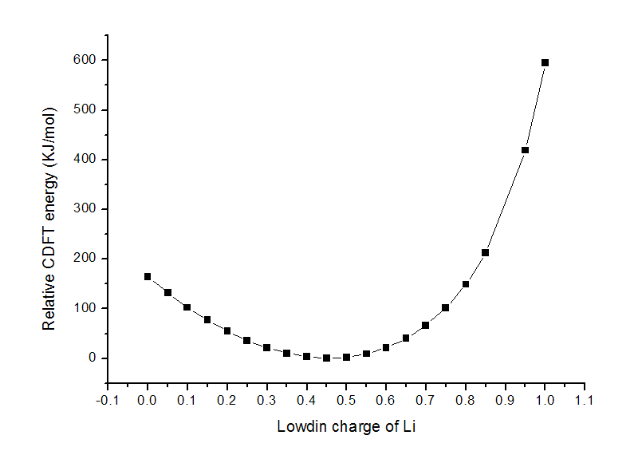

**注**：本文只是简要介绍NWChem里CDFT的用法。在北京科音高级量子化学培训班（<http://www.keinsci.com/workshop/KAQC_content.html>）里有对CDFT原理的详细得多的介绍，并给出了NWChem做CDFT的更丰富的例子和明显更深入具体的讲解，欢迎感兴趣者参加。

**谈谈约束性DFT(CDFT)**  
On the constrained DFT (CDFT)

文/Sobereva @[北京科音](http://www.keinsci.com/)

First release: 2014-Dec-29  Last update: 2024-Sep-20

## 1 原理

经常有人，特别是初学者会问量化计算中如何设定原子的电荷，他们想让某些原子或片段的电荷成为理想的整数。会问这个问题，大多都是对量化计算原理没搞透彻所致，笔者在《谈谈片段组合波函数与自旋极化单重态》（<http://sobereva.com/82>）一文的最后一节对此有过专门的讨论。一些初学者误以为通过设定初猜、利用gview里的片段设定就能达到目的，显然是错误的，不管初猜怎么定义，如果在SCF过程中不加约束的话，迭代至收敛后的电荷分布会和预期的初猜有明显不同。若想令最终的电荷分布与自己设定的一致，唯一办法就是在SCF迭代中进行约束，通常用的是拉格朗日乘子方法。对于DFT而言，这叫做约束性DFT(Constrained DFT, CDFT)，已经被广泛使用。

如今CDFT的标准实现方法是在PHYSICAL REVIEW A 72, 024502 (2005)中提出的。它在对能量变分时引入拉格朗日乘子Vc使得电子分布与期望的状态一致，这等价于在KS算符中额外引入了一个外势项Vc*w(r)，其中w(r)是用来定义约束的权重函数。比如令w(r)为A原子的权重函数用来定义A原子所属的空间范围，那么就可以设定约束令w(r)*ρ(r)的全空间积分等于人为指定的A原子的电子数。在SCF迭代求解过程中，轨道和Vc交替优化。即每一步，先在当前的轨道下优化Vc直到满足预设的约束条件，然后用Vc再构建KS算符产生新的轨道，如此往复。CDFT的过程，既可以看成是在约束条件下寻找能量最低的解，也可以视为寻找一个外势，最终得到的是在这个外势下的基态的解。

CDFT不仅可以约束某些原子的布居数等于特定值，也可以让自旋布居数，即alpha和beta电子数的差值等于特定值（对alpha和beta布居数分别做约束），或者让两个片段间的电子布居数或自旋布居数的差值恰为特定值。权重函数也可以有多种选择，而且原理上可以同时设定多个约束。

用CDFT时切不可盲目，一定要搞清楚原理，弄清楚自己使用CDFT的目的何在、所设定的约束有什么物理意义。CDFT用对了可以讨论一些常规方式DFT计算研究不了的问题，比如讨论某些电荷转移、电子离域问题，但用得不合理得话只会得到毫无意义的结果。

## 2 NWChem中CDFT的使用

CDFT在NWChem、CP2K、Q-Chem、CPMD、GPAW、BigDFT、OpenMX等程序中都已经实现了。由于Q-Chem是收费的，下面就用免费的NWChem来演示一下CDFT。本文使用的是NWChem 6.5，编译方法可参考《NWChem的编译方法》（<http://sobereva.com/270>）。顺带一提，CP2K的CDFT功能明显更为强大，对周期性体系也能用，而且能基于CDFT得到的两个单体间电荷转移前后的两个透热态波函数计算单体间的电子耦合，支持做CDFT-CI，能计算电荷转移能，等等。笔者讲授的北京科音CP2K第一性原理计算培训班（<http://www.keinsci.com/workshop/KFP_content.html>）里对CP2K做CDFT给出了丰富的讲解和例子，欢迎参加。

NWChem里实现CDFT很简单，在dft...end段落中加上比如cdft 2 5 charge 0.5 pop becke即设定2~5号原子的Becke原子电荷之和为0.5。也可以写诸如cdft 2 5 10 13 charge 0.5 pop lowdin来让2~5与10~13的Lowdin电荷差值为0.5。如果设定自旋布居数约束，把charge改为spin即可。NWChem的CDFT效率比较好，不比普通DFT计算多耗时多少。

注意计算原子电荷（或布居数）的方法很多，我写的《一篇深入浅出、完整全面介绍原子电荷的综述文章已发表！》（<http://sobereva.com/714>）和《原子电荷计算方法的对比》（<http://www.whxb.pku.edu.cn/CN/abstract/abstract27818.shtml>）文章里就介绍了很多种。因此，对于同一个约束条件，使用不同的布居分析方法最终得到的波函数并不相同。NWChem的CDFT支持Mulliken、Lowdin和Becke三种布居方法。默认是Lowdin，虽然从原理上并不比Mulliken可靠，但用在CDFT上比Mulliken要好不少，CDFT原文中也说了Mulliken布居下结果有问题。至于Becke布居，并不是严格定义的方法，它的合理性和锐度参数k以及选用的原子半径密切相关，我不清楚NWChem内部是怎么具体设的，因此怀疑其可靠性。注意，Mulliken和Lowdin方法都不适合含有弥散函数的情况，此时要么去掉弥散函数，要么就只能用不怕弥散函数的Becke布居了。

碰见CDFT不收敛时，建议在dft...end里加入一行convergence nolevelshifting，如果还不行，可以尝试其它布居方法，或者改改约束方式，或者改改基组和泛函。

NWChem中对电荷约束可以做几何优化（且是解析梯度），对自旋约束不行。NWChem可以施加多个约束，不过正常收敛的几率很低。使用Becke布居时，对于有对称性的体系，如果计算时出现vectors were symmetry contaminated  
，需要用noautosym关键词避免使用对称性，否则结果可能有问题或无法正常结束，使用Becke布居时几乎总要加noautosym。用Becke布居时有时候并行运算没法正常结束，此时应改用串行计算。

## 3 实例1：乙酸钠

这是个最简单的例子。我们先用以下输入文件用NWChem算一下乙酸钠在B3LYP/6-31G*下的能量以及原子电荷。结构已在此级别下优化过。  
start  
geometry  
 C                  0.00000000    0.52007900    0.00000000  
 O                 -1.13032800   -0.06349600    0.00000000  
 O                  1.11739200   -0.09103900    0.00000000  
 C                  0.03308100    2.04494400    0.00000000  
 H                  0.58076900    2.39854700    0.88048700  
 H                  0.58076900    2.39854700   -0.88048700  
 H                 -0.97577100    2.46220700    0.00000000  
 Na                -0.02552400   -1.94665100    0.00000000  
end  
basis  
* library 6-31G*  
end  
dft  
xc b3lyp  
mulliken  
end  
TASK dft

得到的能量为-390.839634985795，Na的Lowdin布居数为10.63，对应于原子电荷为11-10.63=0.37。其数值与传统化学概念上Na为1.0电荷相差不少，说明Na并没有把一个电子完完全全给了CH3COO-，或者说CH3COO-的电子有一部分转移向了Na+离子。

然后在dft...end当中插入  
 convergence nolevelshifting  
 cdft 8 8 charge 1.0  
再次运算，从输出文件中也可以看到此时Na的Lowdin布居数为10.0，即原子电荷确实为设定的1.0。并且能量为-390.589504441073，比之前没加约束时高了656.7KJ/mol。

如果想优化的话，把TASK dft改为TASK dft optimize即可。

可见，我们可以通过CDFT和常规DFT计算的能量差，来讨论离子之间或分子之间，电荷发生一定幅度转移前后能量改变了多少。

## 4 实例2：叔丁基碳正离子

叔丁基碳正离子，即C(CH3)3+这个体系，一般画结构式的时候正电荷都画在中间的碳上，并认为这个碳用sp2杂化，垂直于碳平面的p轨道（以下简称pz轨道）是空着的。实际上这种说法完全忽略了三个甲基的电子向那个空pz轨道的离域。我们这里也算算玩玩。

运行以下输入文件做常规B3LYP/6-31G*计算。体系结构已在此级别下优化。  
start  
charge 1  
geometry  
 C                  0.00000000    0.00000000    0.00000000  
 C                  0.00000000    1.46600800    0.00000000  
 H                  0.58581400    1.81844700    0.86660600  
 H                  0.58581400    1.81844700   -0.86660600  
 H                 -0.99127200    1.92058400    0.00000000  
 C                 -1.26960000   -0.73300400    0.00000000  
 H                 -1.16763900   -1.81875900    0.00000000  
 H                 -1.86772800   -0.40189400    0.86660600  
 H                 -1.86772800   -0.40189400   -0.86660600  
 C                  1.26960000   -0.73300400    0.00000000  
 H                  1.28191500   -1.41655300    0.86660600  
 H                  1.28191500   -1.41655300   -0.86660600  
 H                  2.15891100   -0.10182600    0.00000000  
end  
basis  
* library 6-31G*  
end  
dft  
xc b3lyp  
mulliken  
end  
TASK dft

能量为-157.554198182446，中心碳的Lowdin电荷为+0.30，可见，把1个正电荷画在中心碳上的做法和实际的差距很大，那个正电荷明显没有完全定域在中心碳上。

然后在dft...end当中插入  
 cdft 1 1 charge 1.0  
再次运算，看看人为让一个正电荷定域在中心碳上的结果怎样。结果为-157.460833435721，能量比不加约束时高了245.1KJ/mol。可以说，三个甲基的电子向中心碳离域，使得能量降低了245.1KJ/mol。此例表明恰当地利用CDFT可以用来计算离域化能。

需要特别注意的是，不同布居方法下得到的结果差异可能很大。比如此例，三种布居方法结果分别为  
Mulliken -157.551751877858  
Lowdin -157.460833435721  
Becke -157.460056500370  
Lowdin和Becke的差异不大，但Mulliken的数值却不太合理，能量仅比不加约束时高了6.4KJ/mol，明显偏小了。

CDFT计算时虽然使得中心碳的电荷为理想化的+1，但是，此时中心碳的pz轨道并非是空着的。如果在dft...end中使用  
mulliken  
print "mulliken ao"  
来查看每个基函数的布居数的话，就会看到CDFT计算后中心碳的两个pz基函数的Lowdin布居数之和为0.237，远非为0，尽管比普通计算时的0.437有所减小。原理上讲，CDFT也能使得某些基函数的布居数为指定的值，但是NWChem的CDFT尚不支持这种约束方式。

顺带一提，如果就是想考察周围原子向中心碳的空pz轨道的离域的话，可以用NBO分析，计算当前体系会看到中心碳有个占据数为0.409的LP*轨道，这就对应于那个空pz（由于周围电子已经明显向此轨道离域了，所以其占据数远比0大）。从E2分析中可以看到这三个甲基中都有两个C-H键的BD轨道向此LP*有很强的超共轭作用，每对儿的E2作用能皆为11.5kcal/mol。虽然E2是不能简单相加的，但是如果姑且这么算一下，3*2*11.5*4.186=288.8KJ/mol，倒也和CDFT给出的离域化能在数量级上相仿佛，但我认为有这种程度的相符多半是巧合。

## 5 实例3：LiF

这次我们计算LiF，令Li的Lowdin电荷逐渐从0变为1，步长0.05，看看能量是如何变化的。手写那么多输入文件显然麻烦，我们用shell脚本来实现。把以下内容拷贝到一个文本文件里，然后执行之。

for ((i=0;i<=20;i=i+1))  
do  
chg=`echo "$i*0.05"|bc`  
file=`printf "%4.2f\n" $chg`  
echo processing $chg...  
cat << EOF > LiF.nw  
start  
geometry  
 Li                  0.00000000    0.00000000    1.52885  
 F                   0.00000000    0.00000000    0.00000  
end  
basis  
* library def2-svp  
end  
dft  
XC b3lyp  
convergence nolevelshifting  
cdft 1 1 charge $chg  
end  
TASK dft  
EOF  
nwchem LiF.nw > $file.out  
done

执行过后，就出现了0.00.out、0.05.out ... 1.00.out一系列文件，文件名就是约束的Li的电荷。然后运行  
grep "Total DFT energy" *.out |tee t.txt  
把t.txt用ultraedit等程序的列模式进行编辑，去掉多余的列，然后导入到origin里作图，得到下图（没有0.9的值是因为此时计算没有收敛）

这个LiF体系正常DFT计算下Li的Lowdin电荷为0.46，这个数值也正是图中的最低点，约束设定的电荷偏离这个值越大，显然能量也越高，图中很好地表现了这点。

如果将Li的电荷约束为1.0并进行优化，键长会由1.52885埃增加到1.84477埃。虽说经过优化，CDFT能量有所降低，为-107.12133927a.u.，但也比不加约束时在平衡结构时的-107.33859717a.u.要高得多。

## 6 实例4：C4H8双自由基

双自由基的对称破缺DFT计算，在《谈谈片段组合波函数与自旋极化单重态》（<http://sobereva.com/82>）谈了很多了，CASSCF计算在《CASSCF计算双自由基以及双自由基特征的计算》（<http://sobereva.com/264>）中也谈了很多了，都用到了C4H8双自由基这个例子，不熟悉的话建议先看看。

C4H8双自由基直接用对称破缺B3LYP/6-31G*计算的话，末端两个碳的Lowdin自旋布居分别为0.919和-0.919。这里我们通过CDFT计算，让这两个碳原子自旋布居数之差恰为2.0。运行以下输入文件。odft必须写，否则会被当成闭壳层单重态计算。由于是对称破缺计算而当前体系又有对称性，故应当写noautosym避免使用对称性。  
start  
geometry noautosym  
 C                 -0.74400100    1.78566400    0.00000000  
 H                 -0.60282700    2.33865300    0.92499500  
 H                 -0.60282700    2.33865300   -0.92499500  
 C                 -0.74400100    0.30988100    0.00000000  
 H                 -1.25452600   -0.08746700    0.88463900  
 H                 -1.25452600   -0.08746700   -0.88463900  
 C                  0.74400100   -0.30988100    0.00000000  
 H                  1.25452600    0.08746700   -0.88463900  
 H                  1.25452600    0.08746700    0.88463900  
 C                  0.74400100   -1.78566400    0.00000000  
 H                  0.60282700   -2.33865300   -0.92499500  
 H                  0.60282700   -2.33865300    0.92499500  
end  
basis  
* library 6-31G*  
end  
dft  
xc b3lyp  
odft  
mulliken  
cdft 1 1 10 10 spin 2.0  
end  
TASK dft  
此例约束了两个末端的碳的自旋布居之差为2.0，由于体系本身就是对称的，这使得其中一个碳的自旋布居数恰为1.0，另一个为-1.0。从输出的Lowdin自旋布居上可以确认这一点。

我们也可以通过设定多个约束让体系末端两个CH2的自旋布居数分别为1和-1，即约束设定改为  
 cdft 1 3 spin 1.0 pop becke  
 cdft 10 12 spin -1.0 pop becke  
（Mulliken和Lowdin布居时这种约束设定下无法正常计算，故改用Becke布居）

## 7 实例5：H+ H-体系

最后，我们用CDFT和背景电荷两种办法计算一下H+ H-这个体系，相距5埃。NWChem输入文件如下  
start  
geometry noautosym  
 H                  0.00000000    0.00000000    0.00000000  
 H                  0.00000000    0.00000800    5.00000000  
end  
basis  
* library 6-31G*  
end  
dft  
xc b3lyp  
cdft 1 1 charge -1  
end  
TASK dft

结果为-0.567651263156。

然后在Gaussian里，计算H-体系，在与之距离5埃处放一个单位正电荷，输入文件如下  
#p b3lyp/6-31G* charge

test

-1 1  
H 0. 0. 0.

0. 0. 5. 1.0

结果为-0.5676521。可见，用CDFT计算H+ H-和计算H-但在附近放一个质子，两种方式计算结果是等同的，也体现了CDFT的合理性。
