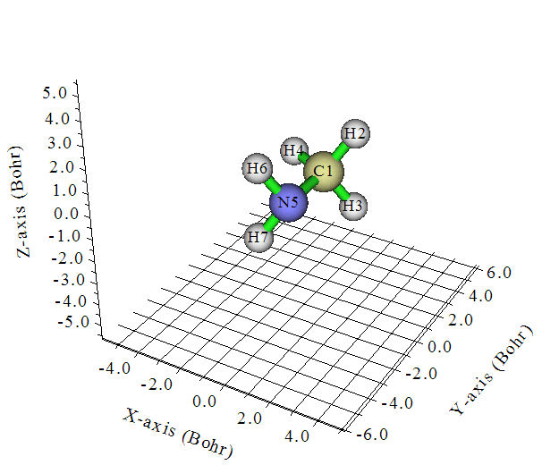
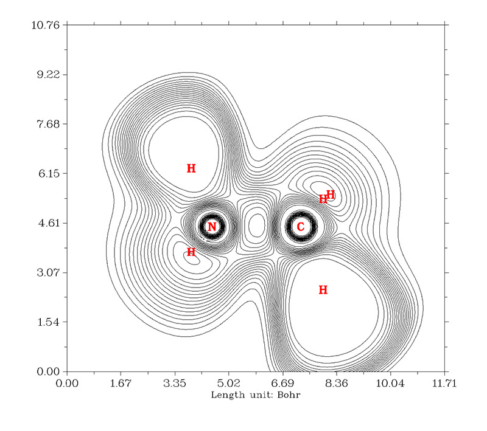
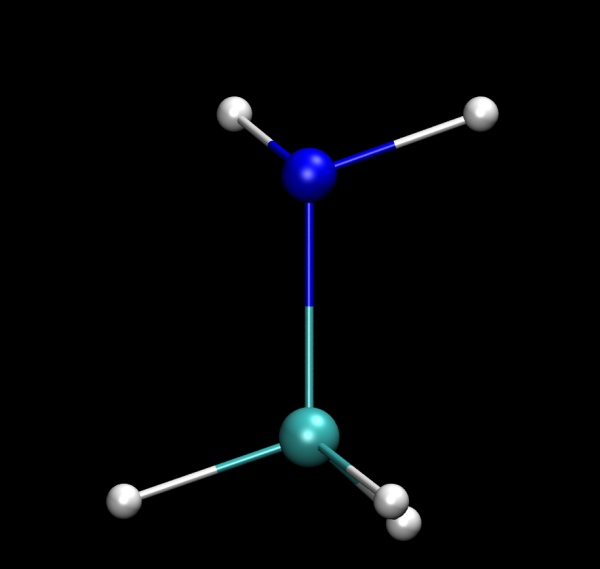
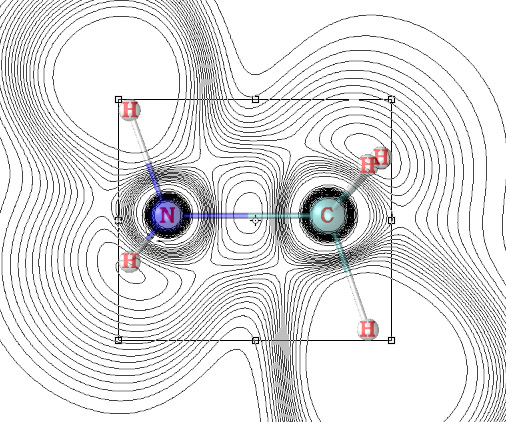
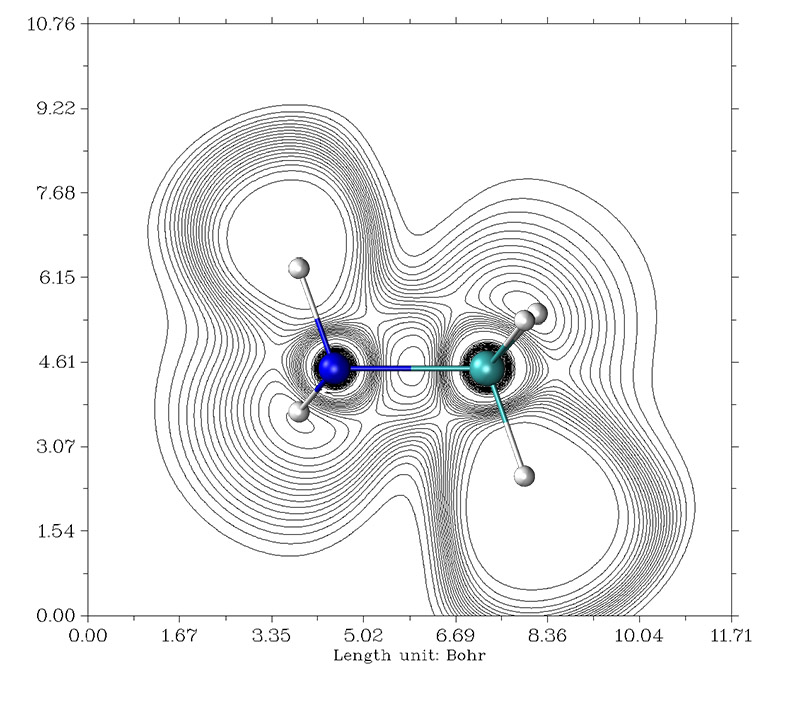

**将分子结构图和Multiwfn绘制的平面图准确合并的方法**  
A method to accurately combine the molecular structure map and plane map drawn by Multiwfn

文/Sobereva @[北京科音](http://www.keinsci.com/)   2014-Dec-31

Multiwfn的主功能4可以对各种实空间函数（如电子密度、ELF、自旋密度、静电势等）绘制出各种类型的平面图，尤其是填色图和等值线图非常常用。但这种图中，Multiwfn只会在图中相应位置显示元素名或序号，不会显示出分子结构，有时候把分子结构附上会令图像看起来更直观。如果作图平面恰好是XY,YZ,XZ平面还比较好办，但如果作图平面是斜着的面，就得用一些技巧了，这里通过实例来说明，我们绘制CH3NH2在C-N-H这个平面上的ELF图。本文使用的Multiwfn 3.3.6，可以从<http://sobereva.com/multiwfn>免费下载。

2018-May-25注：从3.6版开始，在绘制平面图（地形图除外）的后处理菜单中增加了选项8，可以直接将化学键绘制成连线，见<http://bbs.keinsci.com/thread-10079-1-1.html>。

我们先用Gaussian计算CH3NH2的fch文件  
%chk=C:\gtest\CH3NH2.chk  
#p b3lyp/6-31g(d)  
  
B3LYP/6-31G* opted  
  
0 1  
 C                  0.05159500    0.70381800    0.00000000  
 H                  0.59439800    1.06209400    0.88166000  
 H                  0.59439800    1.06209400   -0.88166000  
 H                 -0.94293100    1.18451300    0.00000000  
 N                  0.05159500   -0.76078400    0.00000000  
 H                 -0.45830300   -1.10306000    0.81258800  
 H                 -0.45830300   -1.10306000   -0.81258800

将fch文件载入Multiwfn，在主功能0里面我们看到C-N-H平面是斜着的。

我们下面绘制C1-N5-H6这个平面的ELF等值线图。退回到菜单，依次输入  
4  
9  
2  
[回车]  
4  
1,5,6

图像弹出后，我们看到图中的碳上还有两个氢的符号没出现，这是因为它们离作图平面太远了。这里我们让它们也显示出来，这在之后在photoshop(ps)里准确定位原子位置有益（对此例其实无所谓，但对其它体系不显示的话就可能难以在ps里定位了）。关闭图像，选17，输入一个很大的阈值10，这说明距离作图平面10埃以内的原子标签正常显示，然后输入y或n都行（输入y代表距离超过阈值的原子用较细的字体显示，n代表完全忽略掉）。选0将图像保存为DISLIN.PNG，这幅图主要用来在ps里定位用：

然后我们选1让原子标签不显示，再次选0输出图像成为DISLIN_1.PNG，这幅图之后将与分子结构图相合并。此时Multiwfn可以关了。

之后我们要得到一个分子结构图，令图中C1-N5-H6这个平面和屏幕恰好精确平行。如果你觉得自己的眼力很好也有耐心，可以直接在可视化程序里仔细旋转视角来满足这一点，但是通常很难做到，这就会导致分子结构图和Multiwfn作的平面图的原子位置对应不上。笔者建议先用VMD（<http://www.ks.uiuc.edu/Research/vmd/>）让C1-N5-H6这个平面恰好在XY平面上。具体做法是启动VMD，然后载入CH3NH2的结构文件（一般用pdb或xyz文件，比如用Multiwfn的主功能100里的子功能2就可以导出这些格式），之后把以下代码拷贝到VMD的文本窗口里来增加alignplane命令：

proc alignplane {ind1 ind2 ind3} {  
set atm1 [atomselect top "serial $ind1"]  
set atm2 [atomselect top "serial $ind2"]  
set atm3 [atomselect top "serial $ind3"]  
set vec1x [expr [$atm2 get x] - [$atm1 get x]]  
set vec1y [expr [$atm2 get y] - [$atm1 get y]]  
set vec1z [expr [$atm2 get z] - [$atm1 get z]]  
set vec2x [expr [$atm3 get x] - [$atm1 get x]]  
set vec2y [expr [$atm3 get y] - [$atm1 get y]]  
set vec2z [expr [$atm3 get z] - [$atm1 get z]]  
set sel [atomselect top all]  
$sel move [transvecinv [veccross "$vec1x $vec1y $vec1z" "$vec2x $vec2y $vec2z"]]  
$sel move [transaxis y 90]  
}

然后在文本窗口里执行alignplane 1 5 6，然后选择display-orthographic使用正交视角，此时看到C1-N5-H6恰好平行于屏幕了，此时图中的原子位置和DISLIN.png里已精确对应了。选Display-Axes-off关闭坐标轴，graphics-representation里适当调节分子结构显示方式。然后把图形窗口拉大一些，选file-render，下拉框选tachyon (internal)，点start render渲染出图像。结果如下

接下来，把前面得到的DISLIN.png和DISLIN_1.png都在ps里放到一个窗口里作为两个图层显示，且只让带标签的那个层显示。把VMD渲染出的图像也弄到ps里，选择“选择”-“色彩范围”，点击图中黑色背景，点击“反相”复选框，这时分子结构就被选中了，复制粘贴到Multiwfn绘制的平面图上作为新的图层，并且把透明度低一些，这样在定位时不会挡着原子标签。然后用ctrl+T对其旋转、缩放，直至原子核位置与Multiwfn平面图的原子标签准确对应上，比如下图这样

然后把带标签的那个图层关闭，并且将分子结构恢复为完全不透明，就得到想要的结果了，如下所示：

还有很多技巧可以进一步改进效果，比如上图中左下方的N-H键实际上是在绘图平面下方的，因此可以用ps把这个键改成透明的以体现这点。这些都是零零碎碎的调整，多摸索尝试就明白了，这里就不提了。
