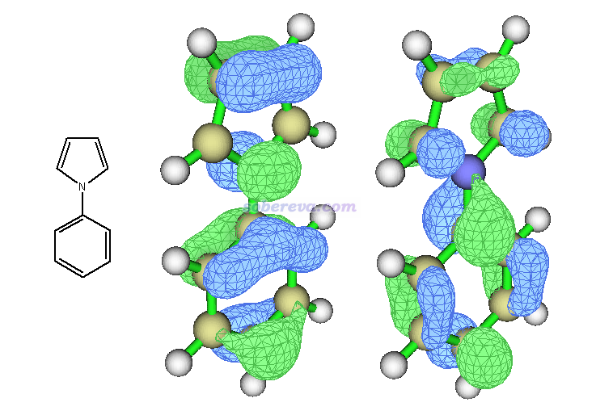
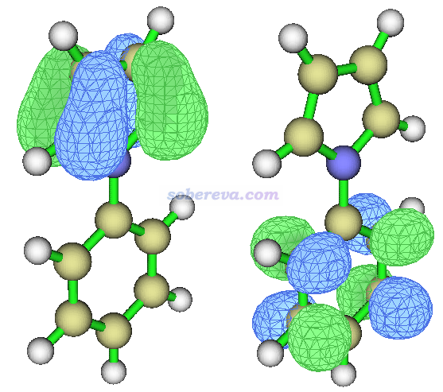
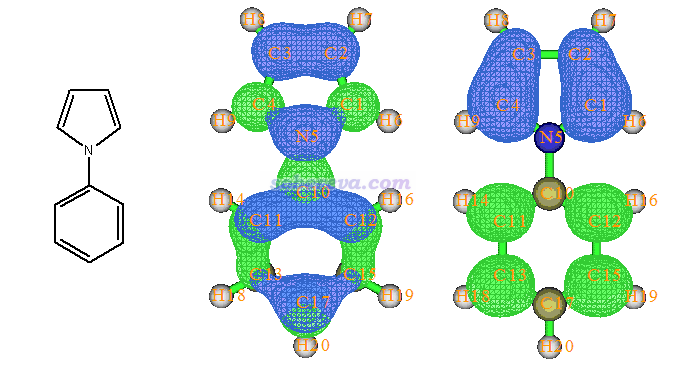
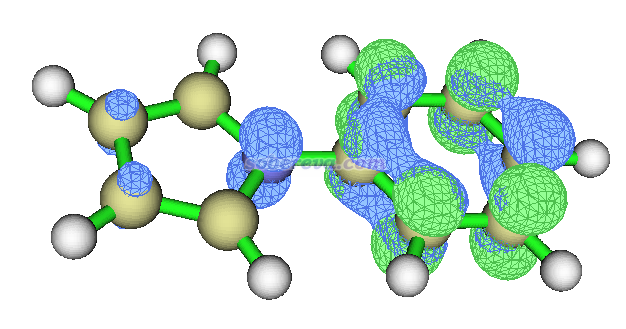
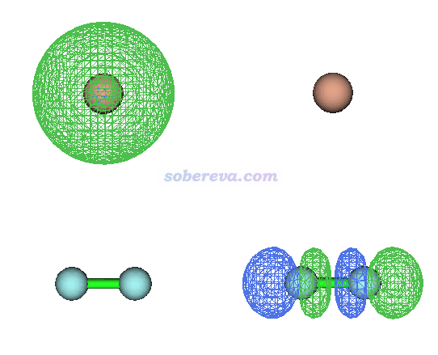
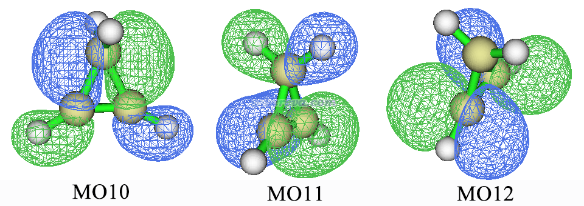
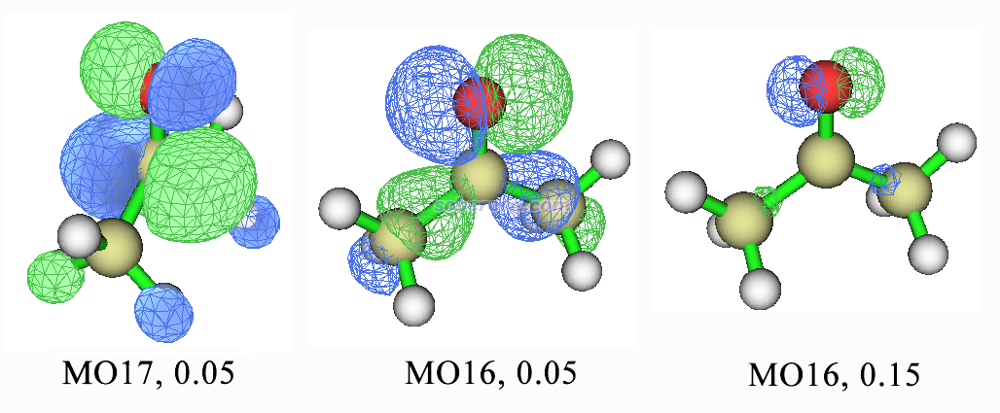
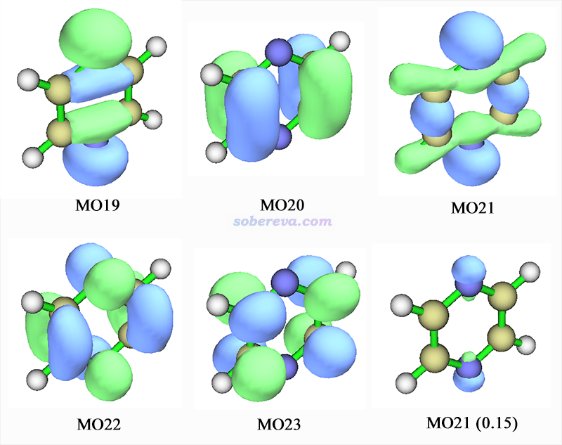
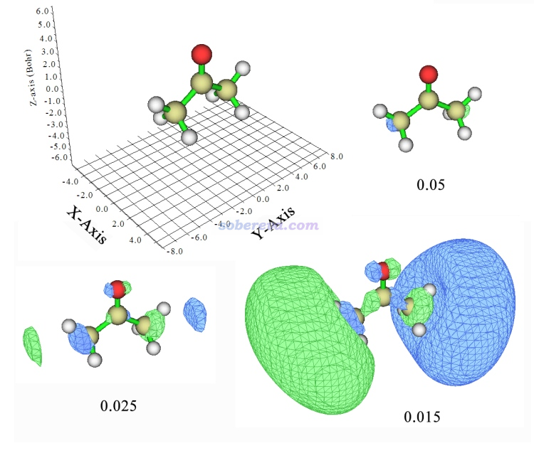
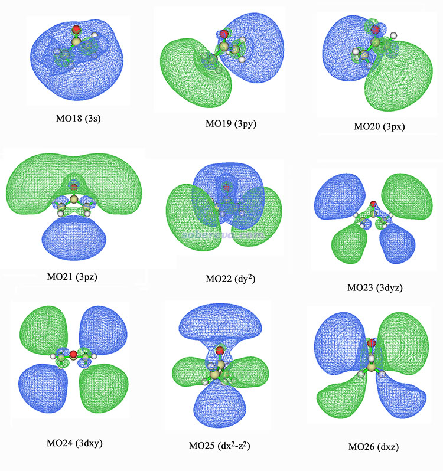

**图解电子激发的分类**  
Illustration of classification of electronic excitations

文/Sobereva @[北京科音](http://www.keinsci.com/)

First release: 2015-Mar-9  Last update: 2018-Sep-8  
 

电子垂直激发涉及许多类型。经常有人问怎么判断电荷转移激发，怎么指认激发类型等等，这个帖子就通过实例和图形进行介绍。

## 1 概述

电子激发有不同分类方式。对于UV-Vis光谱涉及的电子激发范畴，可以分为两大类  
(1)价层激发：电子从价层占据轨道激发到价层空轨道。这里说的价层轨道是指由价层原子轨道混合构成的分子轨道。  
(2)里德堡激发：电子从价层占据轨道激发到里德堡轨道。里德堡轨道是指那些分布十分弥散的空轨道。这样的轨道通常不表现出分子轨道特征，而是整体形状表现出类似原子轨道的特征，这在后文将通过图形进行展示。

价层激发又可以进一步划分。从电荷怎么转移的角度分，可以分为  
(1)局域激发(Local excitation, LE)：电子被激发前后其分布区域没有明显变化。虽然名字叫“局域”，但并非激发涉及的区域只能局限在体系的某个局部。比如电子被激发前后其分布范围都覆盖整个体系，也算局域激发，  
(2)电荷转移激发(Charge-transfer excitation, CT)：电子被激发后分布区域发生了明显转移。既可以在分子内转移，也可以在分子间转移。  
某些类型的体系的LE和CT还可以进一步划分，比如过渡金属配合物，LE激发可分为metal-centered transition (MC)、intraligand或ligand-centered transition (LC)。CT激发可以分为metal-to-metal charge transfer (MMCT)、ligand-to-ligand charge transfer (LLCT)、metal-to-ligand charge transfer (MLCT)、ligand-to-metal charge transfer (LMCT)。比如其中MLCT就代表被激发的电子是从金属向配体转移。

价层激发从轨道特征上也可以进行划分。对于主族原子，电子可以从占据的sigma、pi、n（杂原子提供的孤对电子）轨道激发到反键轨道sigma*和pi*。含pi电子和杂原子的有机分子是最常见的研究对象，其UV-Vis光谱感兴趣的范畴内主要出现的是pi->pi*和n->pi*，这是能量最低的两类激发。sigma->pi*和n->sigma*能量往往高一些。对于没有杂原子和pi电子的，比如烷烃，显然就只有sigma->sigma*了，由于sigma是能量较低的占据轨道，sigma*是能量较高的空轨道，所以这种类型激发能很高。对于过渡金属原子，d轨道也会参与，比如d-d、d-p金属内激发。

轨道特征和电荷转移方式这两种划分价层激发的方式并不矛盾。例如常见的pi->pi*和n->pi*都既有属于LE激发的情况也有属于CT激发的情况。

电子激发实际上是电子态的跃迁，如果用轨道跃迁来描述则通常需要涉及到许多轨道对儿，各占一定成分。可以计算各个轨道对儿跃迁的贡献，见《电子激发任务中轨道跃迁贡献的计算》（<http://sobereva.com/230>）。如果某个轨道对儿的贡献占绝对主导性，比如大于75%，那么可以通过分析这两个轨道的特征来判断激发的类型。如果没有哪个轨道对儿占绝对主导性，则需要通过别的方法进行考察。比如Multiwfn（<http://sobereva.com/multiwfn>）支持的electron-hole分析可以给出electron和hole的分布图，电子跃迁可以认为是从hole区域跃迁到electron区域，见《使用Multiwfn做空穴-电子分析全面考察电子激发特征》（<http://sobereva.com/434>），这个功能可以直接支持Gaussian输出文件作为输入。或者也可以做NTO分析，此方法对多数情况可以将电子态跃迁近似转化为单个NTO对儿的跃迁，见《使用Multiwfn做自然跃迁轨道(NTO)分析》（<http://sobereva.com/377>）、《跃迁密度分析方法-自然跃迁轨道(NTO)简介》（<http://sobereva.com/91>）。

PS：电子激发计算方法的选用在此文有详细讨论：《乱谈激发态的计算方法》（<http://sobereva.com/265>），这里对关键几点着重强调一下。CT激发和里德堡激发都有个共同的特点，就是被激发的电子在激发前后分布范围变化很大，或者说electron和hole重叠得比较小。对于这种情况，必须用范围分离泛函（如wB97XD），或至少是HF成份比较高的泛函（如M06-2X），方可得到合理的结果。对于里德堡激发的计算，所用基组必须有充足的弥散函数，如aug-cc-pVDZ，否则显然没法合理描述里德堡激发涉及的分布十分弥散的空轨道。

下面就通过各种实例用图像直观地展示各种类型的激发，并且着重说明怎么判断激发的类型。第二节涉及的是价层激发，第三节涉及的是里德堡激发，第四节讨论一下价层激发和里德堡激发间的关系。计算由Gaussian09完成，轨道图形皆由Multiwfn绘制（详见《使用Multiwfn观看分子轨道》 <http://sobereva.com/269>），若未注明轨道等值面数值皆为默认的0.05。

## 2 价层激发

### 2.1 局域激发与电荷转移激发

这里用N-苯基吡咯来说明LE和CT激发（为便于示例讨论，没有取极小点结构，而是平面的过渡态结构）。在cam-b3lyp/6-31+g(d)下做TDDFT计算，S0->S1跃迁输出为  
 Excited State   1:      Singlet-A1     5.0615 eV  244.96 nm  f=0.3935  <S**2>=0.000  
      36 -> 40        -0.10127  
      37 -> 40        -0.12755  
      38 -> 39         0.67269  
其中38号轨道（HOMO）向39号轨道（LUMO）贡献达到90%，占绝对的主导性，因此这里可以直接通过这两个轨道来判断激发类型。下图左侧是结构示意图，中间是HOMO，右侧是LUMO。

可见，HOMO和LUMO都是整体分布的，因此从HOMO向LUMO跃迁并不会令电子分布有明显的转移趋势，所以S0->S1是局域激发。

再看S0->S5的输出  
 Excited State   5:      Singlet-A1     5.9669 eV  207.79 nm  f=0.1674  <S**2>=0.000  
      37 -> 40         0.69064  
      38 -> 39         0.13261  
其中MO37->MO40贡献达到95%，因此也可以只看这两个轨道来讨论激发的特征，这两个轨道分别如下所示

可见37号轨道分布在吡咯上，而40号轨道分布在苯基上，因此S0->S5是个十分明显的CT跃迁，激发过程中电子从吡咯向苯基转移。

由于上述两个激发都有占绝对主导的轨道对儿跃迁，因此用Multiwfn的electron-hole分析得到的结论与直接观看轨道图形十分相似，如下所示，图片取自Multiwfn手册4.18.1节的例子。绿色代表electron分布，蓝色代表hole分布，这种图表示电子从蓝色区域激发到绿色区域。

但是有的激发，比如S0->S2，如下所示没有主导的轨道对儿。虽然MO38->MO40贡献是最大的，66.7%，但是只考虑它而忽略了其它轨道则容易造成判断不可靠，因此这个激发不适宜通过分子轨道来分析。  
 Excited State   2:      Singlet-B2     5.0739 eV  244.36 nm  f=0.0139  <S**2>=0.000  
      35 -> 40         0.14847  
      36 -> 39         0.32214  
      36 -> 46         0.10308  
      37 -> 39         0.15255  
      38 -> 40         0.57770  
而利用Multiwfn，不管有多少轨道对儿有不可忽略的贡献都没关系，都能转换成electron和hole分布，一目了然，如下所示

可见hole大部分出现在苯基区域，很少一部分出现在吡咯区域，而electron完全出现在苯基区域。由此可知电子跃迁后会有一点电子从吡咯流向苯基，有那么点CT特征，但是总的来说，还是LE特征更主要，因此适合归属为LE激发。

Multiwfn的electron-hole模块超级强大，不仅如上所示可以给出electron和hole分布，还可以做很多分析帮助判断CT程度，比如electron和hole质心的距离、electron与hole的重叠积分、绘制密度差图（即electron分布减去hole分布）、把electron和hole转换成更易于考察的平滑分布形式、轨道或片段对electron和hole的贡献等等。Multiwfn还能做很多重要的其它电子激发分析，如把振子强度分解为轨道对/基函数/原子的贡献、绘制跃迁密度和跃迁偶极矩密度、考察电子激发过程中片段间的电荷转移细节、计算衡量CT距离的Δr指数等，这里就不多谈了，感兴趣者参见《Multiwfn支持的电子激发分析方法一览》（<http://sobereva.com/437>）。

上面的CT是分子内的，下面我们看一个分子间CT激发的例子。此例Be和F2摆成T型，其能量最低的激发是Be的2s电子向F2反键sigma轨道发生电荷转移跃迁，100%由HOMO->LUMO所贡献，两个轨道图形分别如下所示。

可见此激发完全全将一个电子从Be转移到了F2上。此例注意F2的键长被人为拉长为了1.415埃以使得其反键sigma轨道能量比平衡结构下低得多，否则最低能量激发将对应于Be向自己的2p激发。

### 2.2 不同轨道特征的激发

这一节对几种常见的电子激发类型进行示例。若有人对sigma、pi、孤对电子，以及成键、反键轨道这些最基础的概念尚不明白的话，建议先看看结构化学书里的基础知识。

我们算一个简单的体系，环丙烯。在b3lyp/6-311g(d,p)下优化，然后用PBE0/def2-TZVP做TDDFT计算，前两个态输出如下  
 Excited State   1:      Singlet-B2     6.4794 eV  191.35 nm  f=0.0697  <S**2>=0.000  
      11 -> 12         0.69254

 Excited State   2:      Singlet-B1     6.5549 eV  189.15 nm  f=0.0011  <S**2>=0.000  
      10 -> 12         0.70538

可见其中只涉及到环丙烯的MO10、11、12，轨道图形如下

判断是什么类型激发前先要指认轨道类型。分子轨道往往有高度离域性、同时展现不同区域的不同特征，指认的时候要考虑主要特征而忽略次要特征。由上图可见，MO10是两个C-C sigma键的成键轨道，同时对C-H之间sigma键也有贡献，所以毫无疑问应该指认为sigma轨道。MO11主要表现的是C=C键的pi轨道，因为沿着键轴有个节面。虽然它也对亚甲基的C-H sigma键有贡献，但这里就忽略这个次要特征了，就当MO11是pi轨道了。MO12显然是C=C键的反pi（pi*）轨道，因为不仅沿着键轴有个节面，在垂直于键轴上也有个节面。因此，对于当前计算，第一激发态是pi->pi*激发，第二激发态是sigma->pi*激发。

下面一个例子是丙酮，这是B3LYP/def2TZVP下优化然后用B3LYP/aug-cc-pVTZ做的TDDFT计算。这个例子下一节将用来作为例子讨论里德堡激发，在这一节我们只讨论它的最低阶激发，是个典型的价层激发，如下所示：  
 Excited State   1:      Singlet-A2     4.4326 eV  279.71 nm  f=0.0000  <S**2>=0.000  
      16 -> 17         0.69737  
      16 -> 20         0.10527  
由于16->17（即HOMO->LUMO）激发占了将近100%的成份，就不考虑16->20了。为指认其激发类型，我们看看16、17号轨道的特征，如下所示

图中标注的小数是轨道等值面数值，在Multiwfn中默认是0.05。可见MO17是典型的pi*轨道。但在默认等值面数值下，MO16的特征指认起来看似有点困难（上图的中间那个），既有氧的孤对电子特征，也有C-C成键特征，此时如何指认？解决办法是逐渐增加等值面数值，增加到0.15后，图像如上图右侧所示，基本上只在氧的两侧有等值面了，也就是说这个轨道的孤对电子特征占其主要成分。因此丙酮的这个第一激发态应当指认为n->pi*跃迁。（可能有人会问为什么MO16 0.15的图会看出是孤对电子，原因是很简单：从等值面上看这既不是pi，也不是sigma，而是电子分布悬在氧的两边没干活儿，显然是没有配对儿的氧的孤对电子轨道）

再看这一节最后一个例子，吡嗪。这是在PBE0/def2-TZVP下做的TDDFT计算。我们考察以下几个激发  
 Excited State   1:      Singlet-B3U    3.9808 eV  311.46 nm  f=0.0044  <S**2>=0.000  
      21 -> 22         0.70620

 Excited State   3:      Singlet-B2U    5.4867 eV  225.97 nm  f=0.1000  <S**2>=0.000  
      18 -> 23        -0.23669  
      20 -> 22         0.66566

 Excited State   5:      Singlet-B1G    6.5598 eV  189.00 nm  f=0.0000  <S**2>=0.000  
      19 -> 23         0.70626

其中涉及的轨道图形如下。由于S0->S3激发中18->23的贡献仅有10%，就无视了。

MO21看起来比较复杂，也是既表现出成键也表现出孤对电子特征，但是把等值面数值调大到0.15后，如上图右下所示，只有氮原子旁边有等值面出现了，说明此轨道整体来说可指认为氮的孤对电子轨道。注意虽然MO22对于左侧和右侧两个碳原子间的pi键有贡献，但是MO22是空轨道，而且在C-N之间表现反键特征，所以还是要将之指认为pi*。现在知道了MO21和MO22的类型，我们也就知道S0->S1是n->pi*激发了。

S0->S3是20->22主导的。MO20明显是pi轨道，因此这个激发是pi->pi*激发。

19号轨道比较明显地表现出氮的孤对电子特征，若把等值面数值增大到0.15后，也是像MO21一样只在氮原子上面有等值面。MO23毫无疑问是pi*，因此S0->S5是n->pi*激发。

## 3 里德堡激发

前面提到，里德堡激发会将电子激发到很弥散的里德堡轨道上，这些轨道的形状和原子轨道有一定相似性，因此讨论里德堡激发时，经常会看到诸如n->3pz的表示。这里3pz就是指电子激发后所处的里德堡轨道的形状类似于pz，并且其主量子数为3。这一节用丙酮的里德堡激发态为例，介绍下怎么指认里德堡激发。

这里是在B3LYP/aug-cc-pVTZ下做的TDDFT计算，共算了10个态。注意如前文所述，B3LYP不足以给出合理的里德堡态激发能，用wB97XD会好得多。这里用B3LYP主要是因为发现在wB97XD下计算这些激发态时会有很多轨道对儿跃迁都明显参与其中，指认起来麻烦，而用B3LYP的话每个激发态都有起主导作用的轨道跃迁，故用作本文例子讨论起来比较方便。当然啦，实际研究中总会碰上在计算里德堡态时缺乏主导跃迁的情况，为了指认方便，可以尝试用NTO方法近似转化成单一轨道对儿跃迁的形式后再尝试指认。

此体系第一个激发态在上一节已经讨论过，是个价层激发。2~10号激发都是里德堡激发，输出如下所示  
 Excited State   2:      Singlet-B2     5.7706 eV  214.85 nm  f=0.0281  <S**2>=0.000  
      16 -> 18         0.70174  
   
 Excited State   3:      Singlet-A1     6.5920 eV  188.08 nm  f=0.0025  <S**2>=0.000  
      16 -> 19         0.70176  
   
 Excited State   4:      Singlet-A2     6.7367 eV  184.04 nm  f=0.0000  <S**2>=0.000  
      16 -> 17        -0.10656  
      16 -> 20         0.69461  
   
 Excited State   5:      Singlet-B2     6.8875 eV  180.01 nm  f=0.0127  <S**2>=0.000  
      16 -> 21         0.69013  
      16 -> 22        -0.12647  
   
 Excited State   6:      Singlet-B2     7.2194 eV  171.74 nm  f=0.0229  <S**2>=0.000  
      16 -> 21         0.12895  
      16 -> 22         0.68785  
   
 Excited State   7:      Singlet-A1     7.3734 eV  168.15 nm  f=0.0405  <S**2>=0.000  
      16 -> 23         0.70191  
   
 Excited State   8:      Singlet-B1     7.4827 eV  165.70 nm  f=0.0109  <S**2>=0.000  
      16 -> 24         0.70470  
   
 Excited State   9:      Singlet-B2     7.9218 eV  156.51 nm  f=0.0001  <S**2>=0.000  
      16 -> 25         0.70117  
   
 Excited State  10:      Singlet-A2     8.1019 eV  153.03 nm  f=0.0000  <S**2>=0.000  
      16 -> 26         0.69714

可见电子都是从MO16跃迁走的，前面已提到，这是氧的孤对电子轨道。

由于里德堡轨道分布得十分弥散，主要分布区域离分子主体较远，涉及的空间范围很大，但在这些区域内的数值不大，所以考察里德堡轨道特征的时候必须用较小的等值面数值才行。我们先看MO19，如下图所示，给出了三种不同等值面数值下的图形。

为了明确朝向，坐标轴也在图中显示了。这个轨道在Multiwfn默认的等值面数值0.05下看起来非常小，看不出什么特征。将等值面数值降低到0.025后，距离两端甲基比较远的地方开始出现了等值面。继续降低到0.015，两端的等值面变得相当大了，并且一头相位为正一头为负，其整体形状颇为类似于py原子轨道，因此，这个分子轨道就是py型里德堡轨道。由于此体系的价层轨道都是2s、2p这些主量子数为2的原子轨道构成的，显然这个弥散的里德堡轨道主量子数应是更高一层的3，因此这个激发应记为n->3py。

我们将计算得到的9个里德堡激发态涉及的所有轨道，即MO18~26号轨道的图形和对应的原子轨道类型都标注上了。为了清晰起见，有的图等值面数值为0.015有的为0.01。第4激发态中17号轨道也有参与，但贡献太小，所以这里忽略了。

由图可见，MO18应当被指认为3s轨道，因为等值面整体轮廓呈球状，和s轨道特征很像。因此，S0->S2激发应当记为n->3s。MO19、MO20、MO21都是整体轮廓显现出3p轨道特征，即有相位相反的明显的两个瓣。MO22~MO26展现的是3d轨道特征。其中MO23~MO26都是有四个瓣，一看就是d轨道的模样。而MO22看起来不是特别像常见的dz2原子轨道的形状，毕竟这是个分子没法要求其轨道看起来和原子轨道十分相似，为了指认它就需要脑洞全开，不要在意细节。从整体轮廓上看将MO22指认成dz2是合理的，因为都是两端相位相同、中间相位相反这样的特征。注意图中标注的轨道的x、y、z符号都是相对于实际计算中的笛卡尔坐标轴而言的（见前面图中笛卡尔轴和丙酮分子朝向的关系），因此图中有dx2-z2、dy2这样的标注。这和通常所用的d原子轨道符号dx2-y2、dz2不符，因此写到文献里的时候，应该把图中的z替换为y，y替换为z。

## 4 里德堡与价层激发的关系

关于价层激发、价层轨道与里德堡轨道、里德堡激发的关系，在这里再顺便多说几句。

上面讨论的轨道最高只涉及到MO26。再往上还会看到其它更高阶的里德堡轨道，比如MO27是4s。价层空轨道和里德堡轨道间能量有高有低，谁高谁低不一定。比如上面图中的里德堡轨道能量高于LUMO（MO17，pi*），但是低于能量较高的sigma*轨道。通常含pi键的体系最低的数个空轨道都是pi*。对于没有pi键的体系，LUMO往往就已经是里德堡轨道了，比如水分子、己烷（当然，前提是基组有弥散函数，否则只会看到sigma*）。

相应地，里德堡激发能和价层激发能谁高谁低也不一定。比如电子激发到能量通常较高的sigma*轨道，或者从相对较低阶的占据轨道向较低的价层空轨道激发，激发能都会大于很多里德堡激发。所以判断激发是价层激发还是里德堡激发不是看能量高低，而是看电子激发后分布是否很弥散。对于含pi键的体系，里德堡激发通常会高于最低阶的价层激发（类型一般为n->pi*、pi->pi*），对于有机大共轭体系一般感兴趣的能量范围内涉及的都是价层激发。对于没有pi电子的体系，最低的激发常常就已经是里德堡激发了。

前面提到过必须用带有充足的弥散函数的基组才能合理描述里德堡态。为说明这一点，这里用B3LYP结合不带弥散函数的TZVP计算丙酮，结果如下

 Excited State   1:      Singlet-A2     4.4553 eV  278.29 nm  f=0.0000  <S**2>=0.000  
      16 -> 17         0.70494  
   
 Excited State   2:      Singlet-B2     6.6967 eV  185.14 nm  f=0.0272  <S**2>=0.000  
      16 -> 18         0.70586  
   
 Excited State   3:      Singlet-A1     8.2111 eV  151.00 nm  f=0.0010  <S**2>=0.000  
      15 -> 17         0.26041  
      16 -> 19         0.65464  
   
 Excited State   4:      Singlet-A2     8.4564 eV  146.62 nm  f=0.0000  <S**2>=0.000  
      14 -> 17         0.70152

第一个激发态和aug-cc-pVTZ下计算的时候一样是n->pi*价层激发。aug-cc-pVTZ下激发能是4.4326eV，和这里4.4553eV基本一致，说明弥散函数并不怎么影响价层激发的激发能。第二个激发和aug-cc-pVTZ的时候一样也是16->18，虽然TZVP不含弥散函数，但最外层基函数是半弥散的，从MO18的轨道图上看依然能看出是3s特征。然而，由于弥散函数的缺失，TZVP下终究没法完全充分地展现MO18的弥散特征，导致激发能6.6967eV比aug-cc-pVTZ的时候5.7706eV高出不少，所以没有充足的弥散函数就不可能准确计算出里德堡激发态的能量。当前第三激发态也是里德堡态，其激发能8.2111eV也比aug-cc-pVTZ下6.5920eV高出很多。当前第四激发态与aug-cc-pVTZ的时候完全不一样，aug-cc-pVTZ时第四激发态是里德堡态，而现在却是14->17主导的价层激发，类型为sigma->pi*，其激发能高达8.4564eV是由于电子是从作为HOMO-2的MO14激发上来的。这个例子明确说明，如果没有弥散函数的话，价层激发和里德堡激发的能量顺序会发生变化，里德堡激发能量上升，这也使得在有限的计算的态数下会出现更多的价层激发。价层激发用不用弥散函数无所谓，对激发能计算精度影响不大，也因此，如果只想研究价层激发而忽略里德堡激发，那么可以故意使用没有弥散函数的基组来很大程度减少里德堡激发态的出现。
