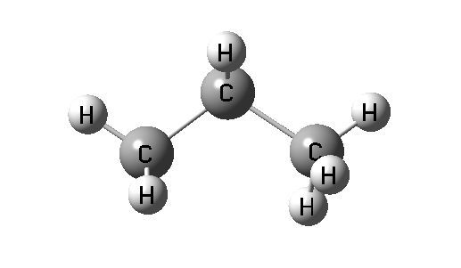
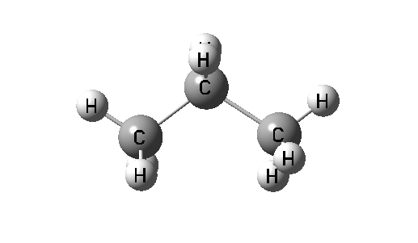

**GaussView观看Gaussian优化轨迹时避免结构跳变的方法**  
How to avoid structural jumps when viewing Gaussian optimization trajectories using GaussView

文/Sobereva @[北京科音](http://www.keinsci.com/)   2015-May-10

众所周知，用gview打开Gaussian优化任务的输出文件时，只要选了Read Intermediate Geometries复选框后再打开文件，就可以看到几何优化的轨迹，对于了解优化过程中结构是怎么变化的非常重要。但是，经常在播放优化轨迹时会看到结构突然跳变，比如瞬间发生大幅翻转然后又变回去，给考察结构变化带来了很大不便。比如下图是优化丙烷阳离子的过程，可见优化过程中分子发生了数次左右翻转，令人不悦

出现这类情况的原因是因为Gaussian默认情况下会把每一步的结构旋转平移成标准朝向（Standard orientation）所致的，有的时候优化过程中结构稍微变化一点，由于巧合，被弄到标准朝向后和上一步的坐标可能看上去朝向变化甚巨，即出现跳变。虽然用nosymm关闭对称性，也就不会被Gaussian自动搞到标准朝向了（弄到标准朝向的本意就是为了能够利用对称性），优化轨迹看上去也就变得连续了，但是这样的话就没法利用对称性加速计算了，显然不是什么好法子。  
2017-Jul-1补充：G16已经解决了此文示例的180度翻转的问题。但是由于相同原因导致突变比如90度，笔者发现G16起码A.03还是没能解决。

实际上，优化过程的每一步中，不仅输出Standard orientation坐标，还输出Input orientation坐标，这个是相对于初始输入文件里的朝向的坐标。gview对优化过程读取的是Standard orientation的坐标，这是可能出现跳变的，只要让gview改成读取Input orientation坐标，就可以避免优化轨迹出现跳变。

不过gview并没有提供选项来读取Input orientation坐标，我们只要自行修改输出文件，骗过gview，让gview在读取Standard orientation坐标时读取的是Input orientation坐标即可。具体做法是，打开优化任务的输出文件，把所有"Standard orientation:"替换成随意的什么字符让gview认不出来，然后把所有"Input orientation:"替换成"Standard orientation:"。之后用gview播放优化轨迹，就完全连续了，如下所示：

注意当原子数超过50的时候默认不输出Input orientation，需要用geom=printinputorient关键词来强行要求输出。
