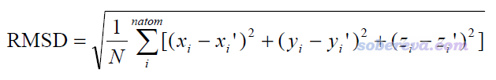
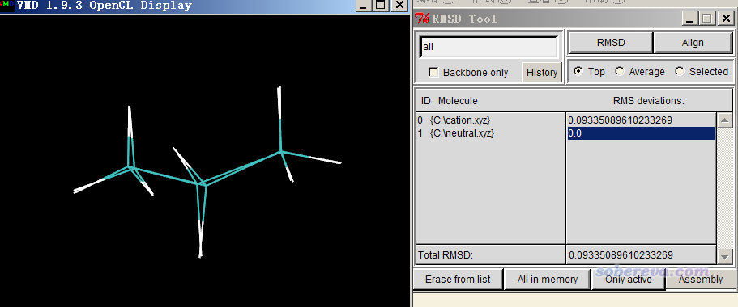
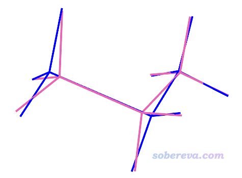
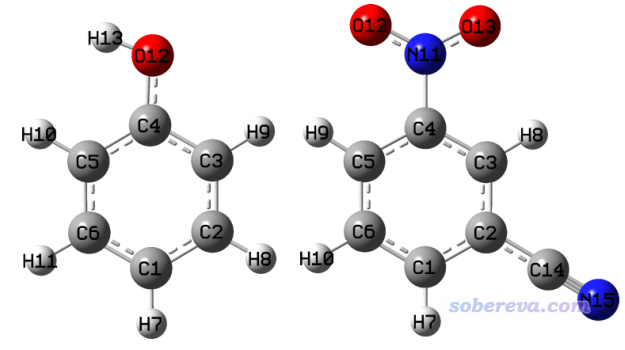
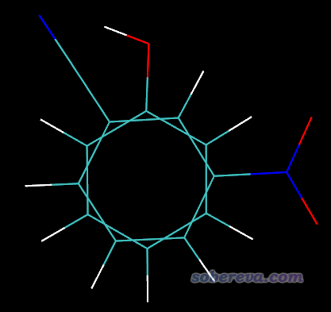
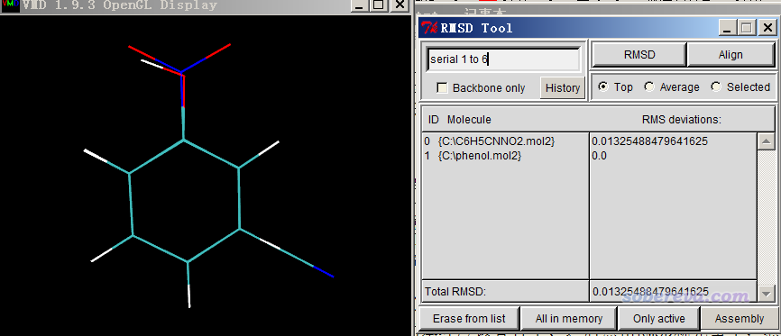

**在VMD中计算RMSD衡量两个结构间的差异以及叠合两个结构**  
Calculating RMSD in VMD to measure the difference between two structures and to superimpose two structures

文/Sobereva@[北京科音](http://www.keinsci.com)  
 First release: 2015-May-11  Last update: 2020-Feb-25

## 1 原理

RMSD（Root mean square displacement/deviation）搞分子模拟的人都很熟悉，但是搞量子化学的人可能好多都不知道。有人问怎么衡量激发态结构相对于基态的改变，虽然可以挨个比较键长键角的变化，但是若想用一个值衡量整体的结构改变程度，计算RMSD是最恰当也是最省事的，这里就简单说一下怎么算。对任意两个结构间都可以计算RMSD，比如可以衡量两种极小点构型的差异、电子激发/电离/外加电场前后几何结构的整体改变程度、形成复合物后单体结构的变化等等。

RMSD定义为

其中i循环所有原子，x_i和x_i'分别是第i个原子在第一个结构和第二个结构中的x坐标，y、z类似。

计算两个结构间的RMSD之前必须先进行叠合（align），相当于令一个结构平移和旋转来最小化两个结构之间的RMSD，不做这一步的话计算出的RMSD是不能衡量两个结构内部的差异的。

能计算RMSD、做叠合的程序不计其数，下面用免费的VMD程序（<http://www.ks.uiuc.edu/Research/vmd/>）的1.9.3版来演示，而且还将体现如何通过叠加图直观地展现两个结构之间的差异。

## 2 实例：中性和阳离子状态下的丙烷

本例演示如何计算丙烷在中性状态下和在+1阳离子状态下优化的结构之间的RMSD值，并且绘制出叠合后的图。

首先把中性的丙烷用量子化学程序优化，把优化后的结构保存成VMD能认的一种格式，比如pdb、mol2、xyz等。这里我们用很常用的xyz格式，见《谈谈记录化学体系结构的xyz文件》（<http://sobereva.com/477>）。我们创建一个名为neutral.xyz的文本文件，把优化后的中性丙烷坐标拷进去，并在第一行写上原子数，第二行是注释行（内容随便写）。具体内容如下  
    11  
Neutral  
6        0.000000    1.277193   -0.259856  
1        0.884678    1.321887   -0.907445  
1       -0.884678    1.321887   -0.907445  
1        0.000000    2.176504    0.367166  
6        0.000000    0.000000    0.586502  
1        0.877607    0.000000    1.247354  
1       -0.877607    0.000000    1.247354  
6        0.000000   -1.277193   -0.259856  
1        0.000000   -2.176504    0.367166  
1       -0.884678   -1.321887   -0.907445  
1        0.884678   -1.321887   -0.907445

类似地也优化丙烷阳离子，把结构存为cation.xyz，内容如下  
    11  
Ionized  
6       1.249671   -0.343789    0.000081  
1       1.315464   -0.947246    0.909976  
1       1.314553   -0.947793   -0.909563  
1       2.180924    0.290109   -0.000844  
6       0.192643    0.673245    0.000031  
1       0.022018    1.237089    0.919487  
1       0.022792    1.237187   -0.919539  
6      -1.442724   -0.286303   -0.000053  
1      -2.107101    0.577835   -0.000705  
1      -1.372956   -0.853783   -0.925484  
1      -1.373233   -0.852316    0.926316

PS：如果你用的是Gaussian，把优化任务最后一帧的结构转化为xyz格式最简单的方法是用Multiwfn（<http://sobereva.com/multiwfn>）。把Multiwfn的settings.ini文件里的iloadGaugeom设为1，然后用Multiwfn载入Gaussian优化任务的输出文件，选择主功能100的子功能2，就可以看见导出xyz文件的选项，选择即可。

启动VMD，把neutral.xyz和cation.xyz都拖到VMD Main窗口里载入。然后选择Extensions - Analysis - RMSD Calculator，把左上角的文本框的内容改为all，取消选择Backbond only复选框，然后点击Align，在图形窗口你会发现两个结构已经叠合了，重叠度较高。然后再点RMSD按钮，在RMSD Tool窗口下方显示的Total RMSD就是两个结构间的RMSD值。当前窗口看到的情况如下所示，可见RMSD是0.093埃。

做叠合和计算RMSD的时候，我们可以只对指定部分进行。比如我们不输入all，而是输入比如serial 2 to 4 8，那么点Align按钮时只会根据2、3、4、8号原子来做align，点击RMSD按钮时也只会计算这些原子间的RMSD。如果你对VMD的选择语句不熟悉，建议参看《VMD里原子选择语句的语法和例子》（<http://sobereva.com/504>）。

VMD还可以把两帧结构用不同颜色绘制出来便于直观比较。做法是选Graphics-Representation，在Selected Molecule里先选择对应中性的体系，把Coloring Method设为Color ID，在旁边选择13 Mauve，并把Thickness设为4使细线显示得更粗。然后在Selected Molecule里选择对应阴离子的体系，以类似操作把颜色设为蓝色并加粗细线。最后在文本窗口输入color Display Background white命令把背景改为白色，此时在图形窗口会看到下图，可见结构差异体现得十分清晰直观

## 3 实例：不同的取代苯体系

有时候我们想对两个主体结构相同，但某些部分不同的两个分子的局部区域计算RMSD来衡量局部结构的差异。本例就用苯酚以及间硝基苯腈为例进行说明，二者在B3LYP/6-31G*优化后的结构如下

二者的差异在于苯环上连的基团。本例我们要让两个分子的苯环部分相互叠合（只需考虑碳原子）并计算RMSD。为了能够正确叠合，一定要注意被叠合的部分要满足两个条件：(1)原子数相同 (2)原子顺序一致。由上图可见，这两个体系中的苯环上的碳都是按连接顺序排列的，所以可以直接做叠合和计算RMSD。如果其中一个体系的苯环上的碳是比如1,4,2,6,5,3这样交错排列的就没法直接做叠合了，而需要在叠合之前自行编辑结构文件，调整原子顺序使得条件(2)被满足。

还是先载入这两个结构到VMD里并进入RMSD Calculator，左上角的文本框输入serial 1 to 6（对应两个分子的苯环上的碳原子序号），取消Backbone only复选框，然后点Align。按理说此时两个分子的苯环应该被叠合了、之后再点击RMSD就完事了，然而当前的情况比较特殊，图形窗口里目前看到如下情况

显然还没有真正叠合好。这是VMD用的算法的缺陷，类似于优化落到了局部极小点而非全局最小点的意味。解决办法就是手动旋转其中一个分子，令其苯环部分的各个原子与另一个分子的苯环部分相应序号的原子整体比较接近，类似于提供一个更好的初猜。调节结构具体的做法是选Mouse - Move - Molecule，之后按住alt键并用鼠标左键拖动某原子就可以平移整个体系，按住alt+shift并用鼠标左键拖动某原子可以旋转整个分子，按住alt+shift并用鼠标右键拖动某原子可以令整个分子沿屏幕旋转。等调节得差不多了，再次按Align按钮，就会发现两个分子的苯环部分确实很好地叠合在了一起，然后再点击RMSD按钮，此时情况如下所示。

可见两个分子的苯环碳原子间的RMSD仅为0.013埃，体现出苯环非常刚，取代基对这部分结构的影响可以忽略不计。
