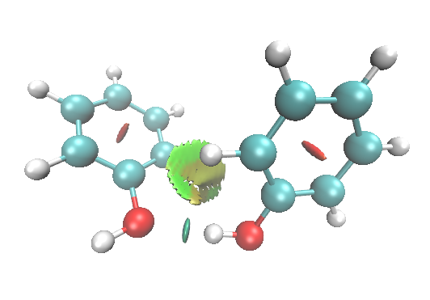
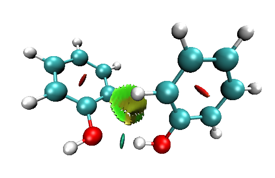
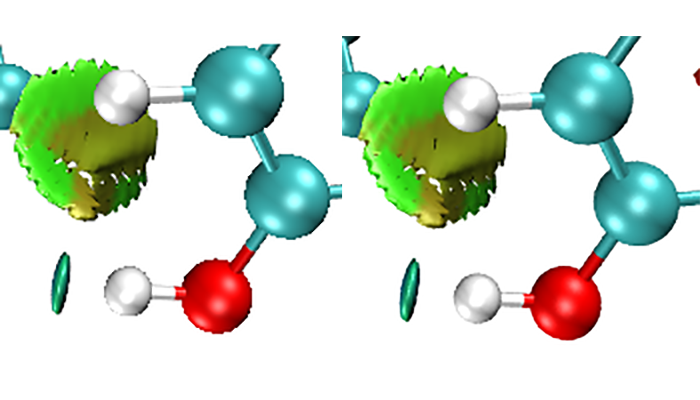
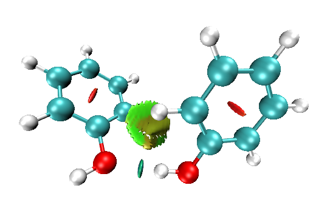
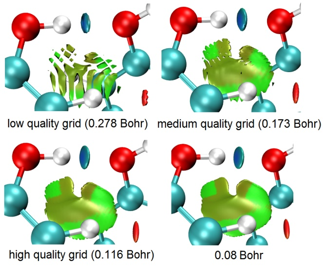
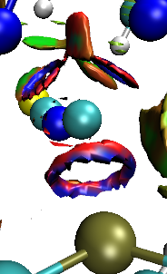
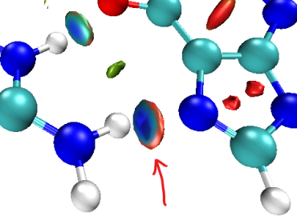

**用Multiwfn+VMD做RDG分析时的一些要点和常见问题**  
Some key points and common problems when using Multiwfn+VMD for RDG analysis

文/Sobereva @[北京科音](http://www.keinsci.com/)

First release: 2015-Jun-2  Last update: 2022-Mar-8

用Multiwfn (<http://sobereva.com/multiwfn>)结合VMD绘制RDG填色等值面图是研究弱相互作用的必不可少的法宝，广为流行，详见《使用Multiwfn图形化研究弱相互作用》（<http://sobereva.com/68>）。这里说几点RDG分析经常被问到的一些问题。其中很多讨论对于绘制IGM图、IGMH图、IRI图也是通用的，IGM方法介绍见《通过独立梯度模型(IGM)考察分子间弱相互作用》（<http://sobereva.com/407>），IGMH方法介绍见《使用Multiwfn做IGMH分析非常清晰直观地展现化学体系中的相互作用》（<http://sobereva.com/621>），IRI方法介绍见《使用IRI方法图形化考察化学体系中的化学键和弱相互作用》（<http://sobereva.com/598>）。所有这些方法的非常好的全面且深入浅出的介绍见《一篇最全面介绍各种弱相互作用可视化分析方法的文章已发表！》（<http://sobereva.com/667>）和《Angew. Chem.上发表了全面介绍各种共价和非共价相互作用可视化分析方法的综述》（<http://sobereva.com/746>）介绍的我的两篇重要的综述。

## 1 和改进图像质量有关的问题

这里的例子用的是大家习惯用的白背景（设置方法：Graphics-Color-Display-Background-white）。

### 1.1 关掉Depth cueing

默认情况下VMD是开着Depth cueing的，这可以使距离观测者越远的部分被雾化得越重，以突出离屏幕较近的部分。但是对于白背景的情况，在绘制RDG图时会使得图像变得有些朦胧，很多人都没注意到这个问题。如下图

建议选择Display-Depth cueing将这个设定关掉，图像就鲜艳、通透多了，如下所示

注：目前最新版本的Multiwfn里自带的RDG作图脚本默认就是将Depth cueing关闭的，故不需要自己改。

### 1.2 抗锯齿

VMD显示的图形在白背景下边缘的锯齿看起来往往比较明显，建议开启抗锯齿。如果Display里能选Antialiasing，点它就行了。如果这是灰色的，可以在显卡的驱动面板里强行开启抗锯齿（具体操作视显示芯片而定）。还一种方法就是用Tachyon渲染器渲染，也能起到抗锯齿的效果（具体步骤见第1.4节）。下图左边是默认情况，右边是用Tachyon渲染后有抗锯齿效果的情况，图片进行了放大，可见边缘圆润多了。

另外顺带一提，也可以先获得没有抗锯齿的大尺寸的图像，然后用ps等程序把尺寸缩小，在这个重新采样的过程中也会等效地实现抗锯齿效果。

### 1.3 光源

默认光源设定下，有些等值面可能看起来偏黑，不好看甚至影响对颜色的判断。此时可以选Display里面的Light 2或3开启没使用的光源，以使得暗处被照亮。还可以用Mouse - Move Light，选择新开的光源编号，然后在图形窗口中拖动来自行移动光源。上图把Light 3开启后，可见左侧苯环中央的梭型等值面从原来的暗红变成鲜红了。注：目前最新版本的Multiwfn里自带的RDG作图脚本默认就是开启Light 3光源的，故不需要自己改。

### 1.4 图像尺寸与渲染器

很多人都是直接用键盘的printscreen键直接截图再粘贴，或者用File-Render-Snapshot再点Start Rendering来得到图像的bmp文件，得到的效果都一样，都是屏幕上实际看到的。图像尺寸取决于窗口的尺寸，把窗口拉大，或者在窗口里把分子放大，都可以让图像中的体系更大（注意如果在窗口里把分子放得过太大，边缘区域会有透视畸变）。以这样的方式获得图像，显然图像的最大像素取决于屏幕的分辨率，屏幕分辨率低的话自然就不能得到高像素的图像文件。

VMD还可以用File-render-POV-Ray产生著名的POV-Ray渲染器的输入文件.pov，再用POV-Ray渲染，这样可以抗锯齿，也可以任意指定分辨率。但是需要独立安装POV-Ray，而且POV-Ray没法结合VMD渲染出RDG等值面图的填色效果（会看到等值面上都是灰白色），所以这里就不多说了。

作RDG图我比较推荐用Tachyon渲染。Tachyon是个渲染器，VMD已经将它附带了，不需要额外安装，只要选File-Render-Tachyon (interal, in-memory rendering)，点Start Rendering，就可以直接调用Tachyon渲染当前窗口里的图像，得到.tga文件，可以用IrfanView等看图程序或ps等图像编辑程序打开。用Tachyon渲染的图像默认就有抗锯齿效果。另外，如果显卡比较老或者驱动有兼容性问题，没法开启Display-Rendermode-GLSL的话，很多VMD里的效果都没法正确显示，比如最基本的透明效果，而使用Tachyon渲染则所有效果都可以正确表现出来。

按上述的方法调用Tachyon渲染出的图像和窗口尺寸相同。如果想渲染出更大尺寸的图像可按照此步骤：进入File-render，选择Tachyon，点Start Rendering，在VMD目录下就得到了Tachyon渲染器的输入文件vmdscene.dat。然后在VMD目录下建立一个文本文件，后缀为.bat，内容为  
tachyon_WIN32.exe vmdscene.dat -aasamples 24 -mediumshade -trans_vmd -res 1024 768 -format BMP -o vmdscene.bmp  
双击运行此bat文件就重新渲染得到了vmdscene.bmp。Tachyon命令行参数中-res控制分辨率。-aasamples越大锯齿越不明显。若想调节图像内体系的尺寸，修改vmdscene.dat里的zoom，越大则图像里的物体越大。

有的版本VMD里自带的Tachyon渲染器可能不叫tachyon_WIN32.exe，请读者将以上命令的此文件名改成实际Tachyon渲染器的可执行文件名。

## 2 其它问题

### 2.1 等值面边缘有锯齿、等值面中间有窟窿怎么办？

格点间距越小，等值面边缘就会越平滑，中间有窟窿的可能性就会越低。因此，指定用更高数目的格点，或者等价地，指定更小的格点间距就可以解决这个问题。如果你对Multiwfn的格点设置方面不了解，务必参看《Multiwfn FAQ》（<http://sobereva.com/452>）一文的Q39。在RDG分析的设定格点的界面里，low、medium、high quality grid这三个选项对应于不同的格点总数，这里low/medium/high质量都是对于中、小体系而言的。对于大体系，往往不得不用较大盒子尺寸的时候，此时即便high quality grid的格点数所对应的格点间距也会偏大，导致图像质量差。此时建议自行选择"4 Input the number of points or grid spacing in X,Y,Z, covering whole system"选项然后输入一个恰当的格点间距。下图对比了对于苯酚二聚体体系，不同的预置的格点选项（括号里是对于当前体系的默认盒子尺寸的格点间距），以及自设为0.08 Bohr格点间距时的图像。

PS：如果改用《使用Multiwfn做IGMH分析非常清晰直观地展现化学体系中的相互作用》（<http://sobereva.com/621>）介绍的IGMH方法考察弱相互作用，等值面边缘锯齿问题会比RDG方法轻得多得多。如果你想考察特定片段间相互作用，一定要用IGMH，远远比RDG灵活、理想。

### 2.2 色彩刻度的选择有任意性，如何设定合理？

任意性很大这是RDG的一个弱点。一般建议用-0.035~0.02，或者-0.03~0.02。下限越接近0，则吸引作用区域越容易显蓝色，反之越容易显绿色。虽然-0.04~0.02很常用，但这样设定下比如一些偏弱的氢键的区域就不怎么显蓝色了。

### 2.3 如何将不同体系的散点图用不同颜色作到一起？

对每个体系分别计算sign(lambda2)rho和RDG数据，在Multiwfn后处理界面选2 Output scatter points to output.txt将散点数据导出，后两列数据就是作当前体系散点图需要用的x,y数据。对多个体系都这样得到散点数据。然后把这些数据都导入到Origin里，作散点图，设定多个Layer，一个Layer对应一个体系即可，并用不同颜色区分。

### 2.4 体系比较大，可否分别计算体系的几个部分，然后同时显示出来？

可以。计算的时候通过合理设定格点数据的计算范围就可以只计算不同区域。VMD中显示多少填色等值面都行，互不冲突，作为不同的id即可。Multiwfn提供的作图脚本只能绘制一对func1.cub vs func2.cub对应的填色等值面图，若要同时绘制很多个，可以自己重新编写脚本，如果不会，建议还是在图形界面操作。已提供的那个RDG绘图脚本里的每一行命令都对应于图形界面的一个操作，只要自己弄会了怎么通过手动在图形界面操作来显示填色等值面图，就自然而然明白怎么再显示更多的填色等值面。简单来说，计算体系一部分后，得到func1.cub和func2.cub，把func2.cub拖进VMD，会产生一个id，然后载入func1.cub，载入的时候选择载入到func2.cub那个id里。然后进graphics-representation，点Create Rep新建一个等值面的层，将Drawing method改成isosurface，设置好isovalue（一般为0.5），Show设成Isosurface，Draw设成Solid Surface，然后Coloring method设为Volume，选择func1.cub，然后在Trajectory标签页把Color Scale Date Range设为合适的色彩刻度。类似地，计算体系的其它部分，得到func1.cub和func2.cub，将func2.cub拖进VMD自动又产生一个新id，之后也是如上操作就行了。这样多个id对应的填色等值面就可以显示体系的不同区域了。

### 2.5 散点图中有一些spike并未完全戳到底（虽然离底部很近），合理么？有物理意义么？

合理，这些spike一般也是有意义的。用AIM分析无法展现这些spike对应的作用，不会出现临界点，但是用RDG方法可以表现出来，照样可以显示出对应的等值面。一些弱相互作用不一定有对应的BCP，但用RDG方法可以被展现出来，这是RDG方法相对于AIM的一个优势。参看笔者发表的IRI方法原文Chemistry—Methods, 1, 231-239 (2021) DOI: 10.1002/cmtd.202100007里2.4节的深入讨论。

### 2.6 RDG分析能定量化么？

要想定量讨论，就看spike的位置，或者结合AIM定量分析，参看《AIM学习资料和重要文献合集》（<http://bbs.keinsci.com/thread-362-1-1.html>）里面的资料了解相关基础知识以及如何在Multiwfn里做AIM分析。顺带一提，对于氢键靠AIM理论可以准确地估计作用能，见《透彻认识氢键本质、简单可靠地估计氢键强度：一篇2019年JCC上的重要研究文章介绍》（<http://sobereva.com/513>）。也有人提出积分RDG等值面内部区域的做法（J. Phys. Chem. A, 115, 12983 (2011)），也通过Multiwfn强大的域分析功能实现，实例见手册4.200.14.1节。

### 2.7 能绘制周期性体系的RDG图么？

从Multiwfn 3.8版开始支持绘制周期性体系的RDG图，但不是所有主流的第一性原理程序都支持，通常建议结合CP2K实现。详情和例子见《使用Multiwfn结合CP2K通过NCI和IGM方法图形化考察固体和表面的弱相互作用》（<http://sobereva.com/588>）。另参考《使用IRI方法图形化考察化学体系中的化学键和弱相互作用》（<http://sobereva.com/598>）和《使用Multiwfn做IGMH分析非常清晰直观地展现化学体系中的相互作用》（<http://sobereva.com/621>）中提到的IGMH官方教程中的考察周期性体系的例子。

实际上你看过《使用Multiwfn非常便利地创建CP2K程序的输入文件》（<http://sobereva.com/587>）就会发现借助Multiwfn时CP2K的使用非常简单。如果你之前用的是别的第一性原理程序算的，可以把已有的结构用CP2K算个单点来得到Multiwfn支持的波函数文件绘制RDG图。

对于Multiwfn不直接支持的程序，可以基于promolecular近似来作RDG图，只需要坐标信息就够了。也就是用周期性体系计算程序优化好结构后，把得到的结构输出为.pdb、.xyz、.mol、.cif等普通的记录坐标的格式，载入到Multiwfn里，然后基于promolecular近似来做RDG分析。虽然结果肯定远不如基于波函数时的准确，但一般是定性正确的。

### 2.8 体系比较大，RDG等值面太多不便于分析，怎么只考察部分区域？

用Multiwfn的主功能13处理一下RDG格点数据把不感兴趣的部分屏蔽掉，参见Multiwfn手册4.13.4节的实例，在《使用Multiwfn结合CP2K通过NCI和IGM方法图形化考察固体和表面的弱相互作用》（<http://sobereva.com/588>）的3.6节也有这种做法的例子。要么就在Multiwfn让你设置格点的时候恰当设置，让计算格点数据的空间范围只涵盖你感兴趣的区域。还有一种办法是借助liyuanhe写的程序，见<http://bbs.keinsci.com/thread-16243-1-1.html>，其做法可以控制每个单独的等值面是否显示。

真正完美且明显更方便的做法是改用IGMH方法，直接就可以指定只考虑哪些部分间的相互作用，见《使用Multiwfn做IGMH分析非常清晰直观地展现化学体系中的相互作用》（<http://sobereva.com/621>），强烈建议用IGMH代替RDG！

### 2.9 一个体系有好多种相互作用，散点图上有好多spike，怎么区分哪个相互作用对应哪个spike？

区分方法有三：  
(1)用Multiwfn做AIM分析（见<http://sobereva.com/108>），可以得到各个弱相互作用区域对应的BCP的sign(lambda2)rho值，然后跟散点图对照一下，就知道哪个spike对应什么位置了。  
(2)设定格点数据计算范围的时候，让计算的盒子中心处在某个弱相互作用区域中央，适当调节盒子的延展范围，让计算的空间区域恰好囊括那个弱相互作用区域。然后得到的散点图的spike就只对应那个弱相互作用了。  
(3)从散点图中可以看到每个spike对应的sign(lambda)2rho范围。假设一个spike大约在-0.034到-0.03，想弄清楚这个spike对应哪个RDG等值面，就可以选-3 Set function2 value where the value of function1 is out of a certain range，然后输入-0.034,-0.03，然后输入一个很大的值比如100。这样sign(lambda)2rho小于-0.034或大于-0.03的格点的RDG值就被设为了100，再做RDG等值面图的时候，就只出现这个弱相互作用对应的等值面了，其它弱相互作用区域的等值面就被屏蔽掉了。（顺带一提，利用这个屏蔽方法去掉无关区域，往往可以使得RDG值设定得较高也不会出现其它无关区域，这样RDG等值面可以变得比丰满，从而减少锯齿、窟窿现象）  
(4)用<http://sobereva.com/399>文中的做法绘制带有填色效果的散点图，这样通过对比等值面的颜色和散点图的颜色就可以判断对应关系。但是当多个spike出现位置都相近的时候显然就区分不开了。

### 2.10 老师，您看我的散点图（发来图片...），能说明其中有弱相互作用么？

绝对不要光看散点图！要先看RDG填色等值面图，弱相互作用在什么位置、什么特征一目了然。有那么直观的等值面图不看干嘛非要只看一张特别抽象的散点图？光给出散点图的话别人都不知道你的体系是什么结构。仅当需要定量考察、对比的时候才应当结合散点图一起看。

### 2.11 能用其它程序作RDG图么？

VMD作出来的RDG填色等值面图效果又好又方便。Chemcraft也能作填色等值面图，但是难看多了。Jmol、Gabedit、AIMALL等其它一些程序也开始支持绘制RDG填色等值面图了，但是比VMD效果差得太远，而且计算速度也远不如Multiwfn快、操作不如Multiwfn方便，也没法给出散点图、屏蔽等值面、利用promolecular近似等等。Multiwfn+VMD是RDG分析的黄金组合。另外，基于Multiwfn输出的格点文件用Pymol也可以绘制RDG填色图，着色效果更鲜亮一些，感兴趣可以看<http://bbs.keinsci.com/thread-15756-1-1.html>。

### 2.12 作图时往往看到里面蓝外面红的环状等值面，是怎么回事？

此图是一个典型情况：

这种情况一般出现在相互作用很强的两个原子间。settings.ini文件的默认设置是RDG_maxrho=0.05，这即是说将电子密度大于0.05 a.u.的区域屏蔽掉，因为这样就可以只把体系中弱相互作用区域，也就是电子密度较小的区域展现出来。但是有些弱相互作用其实强度已经甚强了，甚至已经不属于弱相互作用的范畴，而是较弱化学键的范畴，这种情况下两个原子相互作用区域的中央部分电子密度会超过0.05 a.u.，而在外围部分电子密度小于0.05 a.u.，因此默认情况下这块相互作用区域的RDG等值面的中间部分就会被屏蔽掉，而只剩下周围一圈。这种环状区域往往看着很碍眼，可以直接ps掉，也可以索性把RDG_maxrho设为0，不对任何区域进行屏蔽，此时就会看到完整的圆片形等值面了，但这时候在化学键区域会出现没有什么意义的等值面。

如果你想把当前体系中所有相互作用无论强弱全都清晰地在一张图里展现出来，**强烈建议使用笔者提出的IRI方法**，见《使用IRI方法图形化考察化学体系中的化学键和弱相互作用》（<http://sobereva.com/598>）。上图那种情况已经涉及到化学键程度的相互作用了，用IRI明显比用RDG合适得多。

### 2.12_2 为什么蓝色等值面外面一圈是红色的？

此图是一个典型情况：

这是由于投影到等值面上的函数sign(lambda2)rho自身的特征所致，这个函数的sign(lambda2)部分不是一个平滑的函数。在某些地方，lambda2的数值非常接近0，此时它的符号是正还是负在化学意义上并没有本质的区别，但是lambda2的轻微变化就会影响sign(lambda2)rho的符号、使之发生突变。像上面那张图，等值面外圈蓝色一下子变成红色就是这种突变。那一圈是红色显然没有任何化学意义，无法做任何化学上的解释，因此直接无视掉就完了。如果想避免出现那圈红色就加大RDG等值面数值，让等值面稍微收缩一点，避免RDG等值面涉及到sign(lambda2)rho为正的区域而被投影成红色。

### 2.13 为什么有的弱相互作用区域没显示出来？

有些弱相互作用实际上强度很强，比如那种键能都能超过100 kJ/mol的共价成分已经较明显的氢键，其相互作用区域电子密度已经很大了，这时候默认的RDG_maxrho=0.05太小，会导致这些地方被屏蔽掉。适当调大RDG_maxrho，重新作图即可（或者改用前述的IRI代替RDG，所有类型相互作用都能清晰展现而不需要设置阈值。我总是建议用IRI代替RDG方法）。记住，使用RDG方法前一定要优化结构，对于从晶体中截取的结构，氢原子的位置是不准的，若不优化氢，可能会由于氢的位置距离氢键受体原子太近从而没能出现它们之间的等值面（即这部分的电子密度被严重高估了）。

### 2.14 怎么在第三方程序里绘制RDG散点图？

在Origin里的绘制过程看此视频的演示：《用Multiwfn+Origin绘制RDG(NCI)方法的散点图》（<https://www.bilibili.com/video/av27535384>）。通常来说更推荐在gnuplot里绘制，又方便，又免费，又有着色效果，看《绘制有填色效果的用于弱相互作用分析的RDG散点图的方法》（<http://sobereva.com/399>）。

### 2.15 为什么我的散点图里面spike上的点显得比较散？意味着什么？

不要想太多，这不体现什么化学意义上的问题。比较散说明落在弱相互作用区域的格点比较少而已，要么是格点间距偏大，要么是弱相互作用区域比较小。如果想看起来密集一些，在第三方程序里绘制散点图的时候可以让点的尺寸加大一些，或者在RDG分析前设定格点的那一步把弱相互作用区域的格点间距改小一些。关于格点设定方面的基本知识和相关问题，看《Multiwfn FAQ》（<http://sobereva.com/452>）第3节的相关条目。

### 2.16 怎么我绘制出来的RDG等值面都是灰色或黑色的？

三种可能：  
(1)VMD和显卡有兼容性问题导致颜色没显示出来。尝试去下载当前显卡的最新的显卡驱动并装上，或者找其它的用了与你当前机子不同显卡的机子尝试。或者用Tachyon渲染器渲染，这样看到的图像就是纯软件产生的了而不依赖于显卡了，因此颜色肯定能照常显示。  
(2)cub文件太大而你用的是Windows 32bit版VMD，由于内存可用量限制而无法载入，载入时注意看VMD文本窗口的提示。可以用64bit版VMD再试。  
(3)cub文件有问题而无法载入。检查cub文件是否以正确的名字存在于正确的目录、大小和内容是否正常。

### 2.17 怎么得到高清晰度的色彩刻度条以用于我的文章当中？

最新版Multiwfn程序包的examples目录下已提供（RGB_bar.png）。

### 2.18 RDG、IGM、IGMH、IRI这些图形化相互作用分析方法该如何选用？

参看《使用Multiwfn做IGMH分析非常清晰直观地展现化学体系中的相互作用》（<http://sobereva.com/621>）第3节的详细讨论。
