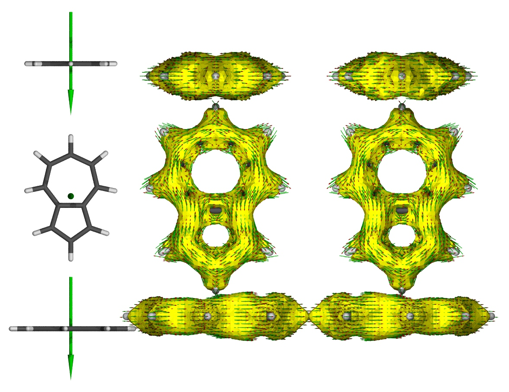
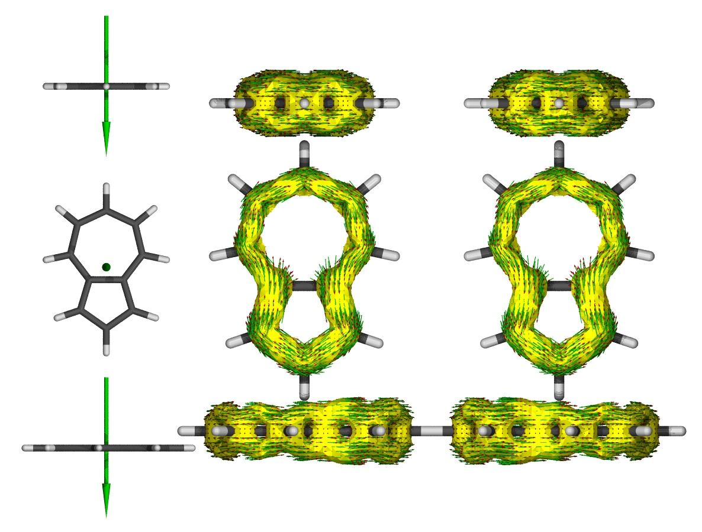
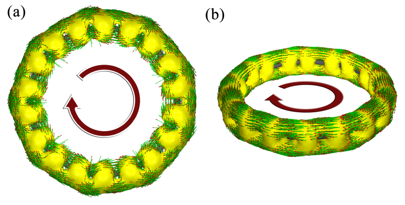

**使用AICD 2.0绘制磁感应电流图**  
Drawing magnetic induction current map using AICD 2.0

文/Sobereva @[北京科音](http://sobereva.com/北京科音)

First release: 2015-Jun-13  Last update: 2024-Jan-26

以前写过一篇帖子《使用AICD程序研究电子离域性和磁感应电流密度》（<http://sobereva.com/147>），那个帖子当时用的是1.5.7.1版。AICD本身用起来简单，但是使用前必须自行编译高斯，这使得绝大部分用户都无缘使用AICD。好在从Gaussian09 D.01开始直接提供了IOp(10/93)选项来输出AICD所需的电流密度张量数据，并且AICD 2.0版开始可以直接读取这些数据绘图，比原先实在方便太多了，这使得AICD能够广泛普及开来。这个帖子就说下AICD 2.0结合G09 D.01的使用方法。老版本的AICD的输出文件和各个选项在2.0版里完全没变，2.0也没有什么新增的选项，所以本帖仅仅用薁分子做个演示，更多内容请看上面的帖子。

## 1 安装AICD 2.0

注：由于原版的AICD 2.0与Gaussian 16兼容性有问题，而且与比较新的gcc编译器的兼容也有问题（像CentOS 6.x这种老系统带的gcc没问题，而CentOS 7.x的就不行了），因此这里给的是<http://bbs.keinsci.com/thread-13577-1-1.html>里提供的修改版AICD包，安装方法也是针对这个修改版而言的。

在这里下载修改版AICD 2.0：<http://sobereva.com/soft/AICD-2.0.0-modified.tar.gz>。

将这个AICD 2.0包解压到任意一处，比如/sob/AICD-2.0.0，然后进入此目录，输入make。然后在用户目录的.bashrc文件里添加alias AICD=/sob/AICD-2.0.0/AICD。重新登录终端或输入bash使之生效。现在就可以在任意目录下直接通过AICD命令调用AICD了。

如果运行时提示无权限的问题，运行chmod +x /sob/AICD-2.0.0/* -R给此目录下所有文件加可执行权限。

## 2 计算薁

输入文件azulene.gjf内容如下。NMR=CSGT必须写，IOp(10/93=1)代表输出电流密度张量到坐标后面的那个文件里，此例是test.txt。

%chk=./azulene.chk  
# b3lyp/6-31g(d) nmr=csgt iop(10/93=1)

b3lyp/6-31g(d) opted

0 1  
 C                  0.00000000    0.00000000    2.50418951  
 C                  0.00000000    1.26637425    1.91156618  
 C                  0.00000000    1.59417912    0.55241750  
 C                  0.00000000   -1.26637425    1.91156618  
 C                  0.00000000    0.75015229   -0.55452268  
 C                  0.00000000   -1.59417912    0.55241750  
 C                  0.00000000   -0.75015229   -0.55452268  
 H                  0.00000000    0.00000000    3.59316833  
 H                  0.00000000    2.10900376    2.59929497  
 H                  0.00000000    2.66005032    0.32418052  
 H                  0.00000000   -2.10900376    2.59929497  
 H                  0.00000000   -2.66005032    0.32418052  
 C                  0.00000000    1.15011348   -1.90182297  
 H                  0.00000000    2.17701495   -2.24803140  
 C                  0.00000000    0.00000000   -2.70850570  
 H                  0.00000000    0.00000000   -3.79360290  
 C                  0.00000000   -1.15011348   -1.90182297  
 H                  0.00000000   -2.17701495   -2.24803140

test.txt

用g09 < azulene.gjf > azulene.out运行此文件，在当前目录下得到azulene.out和test.txt。

## 3 产生感应电流图

我们把外磁场垂直于环平面加。若打开azulene.out会看到垂直于分子平面的是x轴，即外磁场矢量应为1 0 0。我们输入  
AICD -m 4 -b 1 0 0 -pov azulene.out  
此时AICD就会根据azulene.out和test.txt里的信息生成AICD格点数据，并且产生文件名以azulene_40000_0.050_1_0_0_Aniso_4.4为开头的5个文件。将这5个文件拷到Windows系统下，安装好Povray渲染器，然后打开RenderMich.pov后缀的那个，渲染，即得到下图，包含多个视角：

可见是有明显环电流产生的。

## 4 只获得特定轨道的贡献

也可以只获得特定轨道对AICD的贡献，写上IOp(10/93=2)，并且在输入文件末尾写上要考虑的轨道编号即可。

比如薁这个分子，我们想得到所有pi轨道对AICD的贡献。首先我们先找出pi轨道编号，虽然可以挨个看轨道图来找，但对于轨道比较多的体系会比较劳神。对于薁这样纯平面的体系找pi轨道的最方便的方法是用Multiwfn (<http://sobereva.com/multiwfn>)。将薁这个体系的fch文件载入Multiwfn，依次输入100、22、2（因为当前体系平行于YZ平面）。程序马上就给出了所有pi MO的编号，我们把占据数为2.0的那5个复制到前面azulene.gjf的末尾去（从命令行窗口直接复制数据的操作见Multiwfn手册5.4节）。此时azulene.gjf内容如下

%chk=./azulene.chk  
# b3lyp/6-31g(d) nmr=csgt IOp(10/93=2)

b3lyp/6-31g(d) opted

0 1  
[坐标，略]

test.txt

26  
31  
32  
33  
34

为了简便，上面也可以写成26 31-34。之后用前述方法绘图，结果如下

十分值得一提的是，用上面的做法不仅可以得到不同轨道对AICD的贡献，也可以得到不同轨道对磁屏蔽值、磁化率的贡献（即它们可以严格分解成轨道的贡献）。比如某体系有13个轨道，用上面的关键词，分别选择1-5号轨道，以及6-13号轨道，二者得到的磁屏蔽值或者磁化率的加和和直接算整体时的结果是一样的。因此，可以利用这个方法考察NICS-sigma和NICS-pi。关于这点，我专门写了篇文章介绍：《基于Gaussian的NMR=CSGT任务得到各个轨道对NICS贡献的方法》（<http://sobereva.com/670>）。

对于非限制性开壳层（U）形式的计算，IOp手册里没写清楚怎么指定要考虑的轨道。我这里根据我读源代码以及实际测试做出的理解介绍一下。比如计算三重态水分子，原本一共有6个占据的alpha轨道和4个占据的beta轨道，在你设置要考虑的轨道时，记住beta占据轨道的序号是排在alpha占据轨道后面的，而不用管alpha和beta的空轨道。比如，如果你要让原先的那10个占据轨道都被考虑，输入文件末尾就写1-10。如果你只想考虑alpha占据轨道当中后三个、beta占据轨道中第2个，就应该写4-6 8。之所以是8，是因为6+2=8，即原本的alpha占据轨道数目加上要考虑的这个beta的序号。空轨道不用管，比如你把11、12等序号超过原先占据轨道总数的轨道也纳入的话，不会影响结果。

对于非平面体系，没法严格定义哪些是sigma轨道、哪些是pi轨道，或者说判断pi轨道的方式有很大含糊性、人为任意性。但是也没关系，强大的Multiwfn可以给出各个轨道的pi成份，超过特定阈值（比如80%）的轨道你都可以姑且当做pi轨道。关于怎么用Multiwfn计算pi成份，看《Multiwfn已支持计算任意轨道的pi成份》（<http://bbs.keinsci.com/thread-13110-1-1.html>）。

## 5 其它

如果对本文有任何不清楚的地方，或者想弄明白AICD的各种选项、细节以及相关理论，请看《使用AICD程序研究电子离域性和磁感应电流密度》（<http://sobereva.com/147>）。

笔者通过此文的方法考察了电子结构非常特殊的18碳环体系，得到了漂亮的图像和很有意义的结果，充分揭示了此体系由in-plane和out-of-plane电子产生的双芳香性特征。文章介绍见《一篇最全面、系统的研究新颖独特的18碳环的理论文章》（<http://sobereva.com/524>），其中与成键和芳香性有关的研究部分后来发表在了Carbon, 165, 468 (2020)，非常建议大家阅读和引用，这是AICD很好的应用实例。

此外，以下博文介绍的笔者的研究论文中都使用了AICD来直观展现体系的感生电流，是AICD的非常好的应用范例，**建议仔细阅读里面的讨论，并十分推荐作为AICD的应用范例引用！**  
• 《全面揭示16碳环（cyclo[16]carbon）非常奇特的激发态芳香性！》（<http://sobereva.com/741>）中介绍的笔者深入研究C16碳环的超级独特的基态和激发态芳香性的文章  
•《深入揭示18碳环的重要衍生物C18-(CO)n的电子结构和光学特性》（<http://sobereva.com/640>）中介绍的笔者研究C18-(CO)n的电子离域和芳香性特征的文章  
•《不寻常的环[18]碳前驱体C18Br6的电子结构和芳香性》（<http://sobereva.com/664>）中介绍的笔者研究C18-Br6的电子结构的文章  
•《18碳环等电子体B6N6C6独特的芳香性：揭示碳原子桥联硼-氮对电子离域的关键影响》（<http://sobereva.com/696>）介绍的笔者研究B6N6C6芳香性并与B9N9对比的文章  
•《18个氮原子组成的环状分子长什么样？一篇文章全面揭示18氮环的特征！》（<http://sobereva.com/725>）介绍的笔者研究18氮环的芳香性的文章  
• 《深度揭示互为等电子体的苯、无机苯和carborazine的芳香性的显著差异》（<http://sobereva.com/731>）介绍的笔者研究苯及其等电子体无机苯和carborazine的芳香性差异的文章

有另外两个也非常知名、常用的考察磁感生电流的程序GIMIC和SYSMOIC，与AICD有很强的互补性，强烈建议读者仔细看《考察分子磁感生电流的程序GIMIC 2.0的使用》（<http://sobereva.com/491>）和《使用SYSMOIC程序绘制磁感生电流图和计算键电流强度》（<http://sobereva.com/702>）。

有人问我除了考察感生电流外还有没有其它可视化研究芳香性的方法，实际上在Multiwfn中支持很多，如ICSS、LOL-pi、AdNDP，分别参看  
 通过Multiwfn绘制等化学屏蔽表面(ICSS)研究芳香性  
<http://sobereva.com/216>  
使用Multiwfn巨方便地绘制二维NICS平面图考察芳香性  
<http://sobereva.com/682>（<http://bbs.keinsci.com/thread-39020-1-1.html>）  
 在Multiwfn中单独考察pi电子结构特征  
<http://sobereva.com/432>（<http://bbs.keinsci.com/thread-10610-1-1.html>）  
 使用AdNDP方法以及ELF/LOL、多中心键级研究多中心键  
<http://sobereva.com/138>  
Multiwfn还支持非常丰富的定量考察芳香性的方法，参见《衡量芳香性的方法以及在Multiwfn中的计算》（<http://sobereva.com/176>）。顺带一提，各种芳香性分析方法，在笔者讲授的“量子化学波函数分析与Multiwfn程序培训班”（<http://www.keinsci.com/WFN>）的“芳香性与离域性分析”一节里有超级全面、完整、系统的讲解并给了大量实例，**非常推荐想一次性充分透彻学习芳香性和电子离域性分析的读者们参加！**

使用感生电流分析芳香性有很多要注意的问题，我专门写了一篇博文，推荐阅读 《使用NICS和磁感生电流考察芳香性时的一些易被忽视的重要问题》（<http://sobereva.com/743>）。
