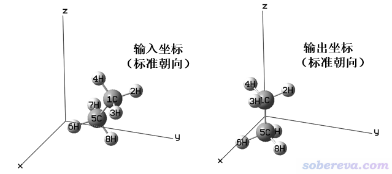

**谈谈Gaussian中的对称性与nosymm关键词的使用**On the symmetry in Gaussian program and the use of nosymm keyword

文/Sobereva @[北京科音](http://www.keinsci.com)

First release: 2015-Jun-27   Last update: 2021-Nov-21

经常有人问Gaussian中的nosymm关键词怎么用、什么时候用，网上也有很多帖子、资料都涉及nosymm，但是很多都明显错误，误人子弟。还有很多人乱用nosymm，不仅没什么意义还白浪费了大量时间。故写此文澄清一下nosymm的用法，以正视听。

## 1 关于利用对称性

为了更好地理解nosymm，首先说说对称性问题。

没对称性的分子所属点群就是C1，有对称性的分子则属于比C1更高阶的点群。量化计算中电子积分的计算是很耗时的部分，对于有对称性的分子，要算的电子积分中会有很多是等价的，利用对称性的话就可以避免计算大量重复的积分，从而大大节约时间。一些计算在其它部分也能利用对称性显著节约时间，如积分变换、导数计算等，而且不光能节约时间，很多时候还能显著降低对内存/硬盘的占用。对称性越高的体系，利用对称性可以带来越多的加速，例如用XEON E5-2650v2 16核+G09 D.01在CCSD(T)/def2-TZVP级别下计算面对面构型的苯二聚体单点能，在实际的D6h点群下（这属于很高阶的点群）计算只用一个半小时，而不启用对称性的话则需要多达两天半才能算完。

启动对称性还有个好处是Gaussian可以显示出轨道、电子态、振动模式的不可约表示。如果不启用对称性，即总是当成C1对称性来算，即便体系本身有对称性，不可约表示也会都显示为A，此时轨道的不可约表示就只能基于等值面图判断、电子态的不可约表示需要自己再对占据轨道的不可约表示做直积得到、振动模式的不可约表示也只能基于正则振动坐标的箭头图来判断了，这就麻烦多了。另外，允许程序利用对称性，且正确判断出了实际点群的时候，还可以确保不同不可约表示表示的分子轨道在SCF过程中不发生混合，这对于考察一些问题以及SCF收敛有时会有帮助。

由于利用对称性时有上述优点，所以Gaussian默认是启动对称性的。计算一开始时会自动根据一定算法和阈值判断输入文件里分子的点群。比如苯分子，如果输入文件里的结构完全或几乎满足D6h对称性，那么Gaussian就会把它判断为D6h对称性，并按照D6h的情况来做后续计算。如果输入文件里的结构偏离D6h略明显，但接近其它更低阶的点群，就会被判断为更低阶的点群，比如C2v，也可能完全判断不出对称性，即判断为C1。

输入文件里的坐标称为输入朝向（Input orientation）。Gaussian为了判断和利用对称性，会先把输入文件里的坐标调整到标准朝向（Standard orientation）下，然后再进行点群的判断及后续的各种计算。这个调整过程会把体系进行平移，使原子核电荷中心处于笛卡尔坐标原点，并且根据一定规则对体系进行旋转，具体规则这里不细谈，感兴趣的读者可以看手册里Standard Orientation Conventions这一节的介绍。例如，在计算苯分子的时候，如果你在gview里把分子摆成歪斜着并且中心偏离原点，若在计算过后用gview打开输出文件，就会看到分子已经处在了XY平面，并且苯分子中心被挪到了笛卡尔坐标原点，这就是苯分子在标准朝向下的坐标。值得一提的是，哪怕体系没有对称性，即C1点群，Gaussian也会照样把体系弄到标准朝向下导致体系被平移和旋转。下面是一个示意图

将体系弄到标准朝向会带来一些麻烦的问题。有些时候，我们必须要求体系的位置和朝向是和输入文件里一致的。比如，我们要沿着某个键的键轴加用field关键词外电场，我们设好了外场矢量，但是如果体系朝向被Gaussian旋转到标准朝向了，那么外电场的方向就不合我们的意愿了（除非输入文件里的坐标已经是标准朝向的坐标），显然结果无意义。再比如，我们按照《使用Multiwfn作电子密度差图》（<http://sobereva.com/113>）用Multiwfn作二聚体和两个单体之间的密度差图来考察单体形成复合物后电子是怎么转移的，这就要求复合物里面的坐标和单体中的坐标完全一致。如果在计算中允许Gaussian自动把体系平移旋转，那么最后得到的单体及复合物的.wfn/wfx或.fch文件中，单体的原子坐标和它在复合物里的坐标就不对应了，显然密度差图也就毫无意义了。Multiwfn里作CDA分析（《使用Multiwfn做电荷分解分析(CDA)、绘制轨道相互作用图》<http://sobereva.com/166>）和ETS-NOCV分析（《使用Multiwfn通过ETS-NOCV方法深入分析片段间的轨道相互作用》<http://sobereva.com/609>）也同样要求整体和片段中的原子坐标必须对应。

## 2 nosymm的用处

理解了上面关于对称性的讨论，就很容易理解nosymm的带来的好处和坏处了。nosymm的含义是：让Gaussian在计算中完全不利用对称性。

nosymm的用处1：用了nosymm后Gaussian就不会再试图去判断和利用对称性，因此也就不会把体系搞到标准朝向下，这就确保了实际计算过程中的坐标和输入文件里的坐标一致，从而可以避免前面说的诸如外加电场、作密度差图、CDA、ETS-NOCV分析时遇到的问题，所以做这些任务的时候总要加上nosymm。

nosymm的用处2：做几何优化、柔性扫描的时候，Gaussian会把每一步的坐标都调整到标准朝向，这往往导致笛卡尔坐标变化不连续（但内坐标变化是连续的），导致在GaussView里观看优化、扫描轨迹过程中体系朝向会发生剧烈跳变，从而难以考察结构变化过程。解决方法有二，其一就是用nosymm，这样优化的每一步的结构都不会被弄到标准朝向下，而只会输出Input orientation坐标，gview也只会读这些坐标，优化/扫描过程的轨迹看起来就连续了。其二就是不让gview去读取每一步的standard orientation坐标（默认情况）而改为读取input orientation坐标，方法见此文《观看Gaussian优化轨迹时避免结构跳变的方法》（<http://sobereva.com/289>）。

nosymm的用处3：nosymm还有个情况也应该加，也就是做对称破缺计算的时候（详见《谈谈片段组合波函数与自旋极化单重态》<http://sobereva.com/82>），如果体系本身是有对称性的，那么加上nosymm往往才能得到对称破缺态。比如将乙烯扭转到90度让pi键被破坏，此时是双自由基状态，如果直接用UB3LYP/6-31G* guess=mix可能因为波函数对称性的约束还是得到闭壳层波函数，而加了nosymm就可以得到双自由基状态了。

**nosymm只有以上三个用处，如果你的情况不属于这三个，就别用nosymm！！！**对于有对称性的体系，用nosymm带来的坏处是很明显的，首先是不能利用对称性来加速计算，其次是没法显示不可约表示。有些人不懂nosymm有什么用就总是盲目地写上nosymm，往往没带来任何益处，当体系有对称性时还因此白浪费了大量计算时间。我总是向初学者强调：**如果不清楚某些关键词是干什么的，就一律不要写！！！** 没看过此文的话建议看看：《常见的多余的和被滥用的Gaussian关键词》（<http://sobereva.com/331>）。

## 3 关于几何优化中维持/破坏对称性

经常有人问在Gaussian的几何优化中怎么维持对称性、怎么破坏对称性，这里明确说一下。首先弄清楚两个事实：

（1）在默认的允许利用对称性时，即便优化一开始把体系判断成了高对称性，优化过程中也可能对称性发生降低甚至变为完全没有对称性。原因要么是因为当前计算级别下低对称性的能量更低，有可能由于一些数值层面的问题破坏了对称性（用弥散函数时容易出现此问题，DFT格点积分精度不够高时也可能会出现此问题，尤其是对M06-2X这种对积分格点精度要求高的泛函来说。参考《密度泛函计算中的格点积分方法》<http://sobereva.com/69>）。

（2）在使用nosymm禁止使用对称性时，一开始的高对称性结构也依然可能继续保持下去。例如，计算D3h对称性的NH3（原子都处在同一平面，呈正三角形），即便写了nosymm，最后优化出来还是D3h结构，这是因为体系中原子都处在一个平面上，优化过程中受到向平面外的力的分量为0，因此会平面结构会一直保持。

所以，对称性是否会在优化中改变，或者说对称性是否会被限制在初始对称性下，和是否使用nosymm没必然的关系。

如果你想在优化过程中100%保证对称性肯定不发生改变，唯一做法是用内坐标描述结构，而且根据对称性来写内坐标，使得对称等价的坐标共享相同的变量（比如苯，让六个C-C键都共享一个键长变量），且优化的时候用opt=z-matrix让Gaussian在内坐标下优化。当然，这么按照对称性写内坐标对于原子数较多的体系是很麻烦的事情，往往还要借助虚原子。PS：虽然Gaussian里有IOp(2/16=2)可以让优化过程中对称性发生改变时沿用旧对称性，但实际发现不怎么奏效。

对于有对称性的体系的计算，一般的考虑方式是：先让初始结构在gview里做对称化成为你期望的点群，然后用Gaussian优化，查看输出文件确保任务最开始时判断对了实际点群（如果没判断对，用symm=loose）。如果优化过程中点群发生了不希望的降低，且你用了弥散函数，把弥散函数去掉重新优化看看；对于DFT，可以进一步提升积分格点精度再试（如G09的用户可以加int=ultrafine试试，G16的用户可以加int=superfine试试）。如果重新优化后对称性还是出现了下降，换成其它你觉得对此体系也靠谱的泛函，也可以尝试不依赖于积分格点的MP2（前提是适合当前体系）或CCSD（量力而行）。如果对称性还是下降了，那么有极大的可能性高对称性结构确实是不稳定的，最后收敛到的低对称性的结构才是真正的极小点，因此此时若非要保持高对称性则结果没有物理意义。如果最后虽然判断出的对称性下降了，但肉眼观看结构时发现和高对称性的结构几乎看不出什么区别，那么你就当这个结构是高对称性的结构即可，写文章时也可以说它是有高对称性的，对称性的下降可能只是一些很trivial的数值因素引起结构的十分细微的变化，无需在意（之后你甚至可以再做个对称化变成高对称性后直接算后续的单点之类任务）。

如果你刻意允许优化过程中对称性发生变化从而避免被限制在初始的对称性（因为初始的对称性可能不一定是实际极小点结构所具有的），一般做法是人为破坏初始结构中的对称性。比如一个平面体系，你怀疑实际结构不是平面的，那你就随便稍微扭曲其中的一个二面角，或者利用《Multiwfn中非常实用的几何操作和坐标变换功能介绍》（<http://sobereva.com/610>）里介绍的功能产生对所有原子随机位移后的结构，这样初始结构就没有对称性了，优化时也不可能被强行维持在有对称性的结构上。如果优化后肉眼上看结构又自发变得有对称性了，那就是说明此体系在当前级别下极小点结构就是有对称性（如果你是讲究的人，建议对称化后再重新做优化，结构精度会稍微更高，还能同时给出不可约表示）。另外，你也可以先对有对称性的结构直接做几何优化+振动分析，如果发现优化后的结构仍有对称性但是有虚频，且虚频的振动模式是会导致对称性方式破坏的，就按照虚频模式稍微调节一下结构然后继续优化，通常得到的就是无虚频且对称性比之前更低的实际极小点结构了。

## 4 其它问题

有人问symm=loose、veryloose是干嘛的。前面提到了，Gaussian会通过一定算法和阈值来根据输入文件里的坐标判断体系的点群。默认的判断标准比较严，即坐标稍微有些偏离点群对称性，就认不出来相应的点群。这有时候会带来些麻烦。比如说，在gview里，选择自带的库里的C60，将它对称化后会看到被gview识别成了Ih点群，但是保存成Gaussian输入文件，然后在Gaussian计算时就会发现被Gaussian判断成了C1点群（也可能判断成别的，和版本有关）。这是因为输入文件里的笛卡尔坐标数值精度有限，我们需要用稍微宽松一点的判断标准，即symm=loose关键词，才能让Gaussian判断出它的实际点群Ih，此时计算速度和C1时完全不在一个数量级。symm=veryloose代表使用更宽松的判断标准。

另一个流行的量子化学程序ORCA不会利用对称性加速计算，因此也不会像Gaussian那样把体系弄到标准朝向下，因此没有类似nosymm这种用途的关键词。也有其它一些程序有类似于Gaussian的做法，比如PSI4程序也会自动把体系搞到标准朝向下，如果想实现nosymm的效果，需要写nocom要求不允许平移，以及noreorient不允许旋转朝向，例如：  
molecule MOL {  
nocom  
noreorient  
C      0.00000000   -0.74034185    0.01363083  
H      0.87837906   -1.12996571   -0.50403292  
...  
}
