**2019-Aug-24补充**：本文介绍的是考察某个笛卡尔轴方向的(超)极化率密度，如果你想考察体系偶极矩方向的(超)极化率密度，最好先旋转体系使得偶极矩平行于某个笛卡尔坐标轴，具体做法见《让体系(跃迁)偶极矩平行于某个笛卡尔轴的方法》（<http://sobereva.com/507>）。

**重要提示**：后来写的《使用Multiwfn极为方便地绘制(超)极化率密度和三维空间对(超)极化率的贡献》（<http://sobereva.com/683>）介绍了Multiwfn于2023-Aug-11新加入的专门计算(超)极化率密度的功能， 远比下文介绍的利用Multiwfn的自定义操作的方式计算简单得多得多得多！因此下文的内容只需要看原理介绍和分析讨论即可，操作步骤就完全不用看了，操作应按照<http://sobereva.com/683>说的做。

**使用Multiwfn计算（超）极化率密度**

Using Multiwfn to calculate (hyper)polarizability density

文/Sobereva @[北京科音](http://www.keinsci.com/)

First release：2015-Sep-13   Last update：2020-Oct-15

（超）极化率密度对于研究考察（超）极化率的本质特征非常有益，可以图形化直观展现体系不同区域对（超）极化率的贡献。将超极化率密度作出图来放到论文里，可以给（超）极化率计算文章增色很多，讨论能够更深入。本文就介绍一下什么是（超）极化率密度，以及具体怎么用Multiwfn去计算。Multiwfn可在<http://sobereva.com/multiwfn>上免费下载，不了解着建议阅读《Multiwfn入门tips》（<http://sobereva.com/167>）。Gaussian使用G09 D.01。本文涉及的输入文件都可以在此下载：<http://sobereva.com/attach/305/file.rar>。

笔者的许多文章都利用了（超）极化率进行分析，是这种分析方法的很好的应用实例，非常欢迎大家阅读和作为范例引用：  
• J. Comput. Chem., 38, 1574 (2017)  
• Carbon, 165, 461 (2020)  
• J. Phys. Chem. C, 124, 7353 (2020)  
• J. Phys. Chem. A, 124, 5563 (2020)  
• J. Phys. Chem. C, 124, 845 (2020)  
• Carbon, 187, 78 (2022)，内容介绍：《理论设计由18碳环与锂原子构成的电场可控的光学开关》（<http://sobereva.com/630>）  
• Phys. Chem. Chem. Phys., 24, 7466 (2022)，内容介绍：《深入揭示18碳环的重要衍生物C18-(CO)n的电子结构和光学特性》（<http://sobereva.com/640>）  
• Chem. Eng. J., 515, 163236 (2025)，内容介绍：《从18碳环的硼氮取代物中理论筛选出具有优异光学性质的分子：一篇CEJ期刊文章介绍》（<http://sobereva.com/742>）  
• ChemPhysChem, 26, e202500009 (2025)，内容介绍：《深入探究18碳环与碱金属离子复合物的结构、相互作用与光学性质》（<http://sobereva.com/745>）  
• Phys. Chem. Chem. Phys., 27, 11993 (2025)，内容介绍：《理论设计基于18碳环的donor-π-acceptor型非线型光学材料：探究18碳环作为新的pi-linker的潜力》（<http://sobereva.com/751>）

本文先介绍基本概念，然后用个很简单的小分子甲醛来演示怎么计算第二超极化率密度。

## 1 基本概念

不了解（超）极化率及其在Gaussian中的计算的话可以先看这里的简单介绍《使用Multiwfn分析Gaussian的极化率、超极化率的输出》（<http://sobereva.com/231>）。  
  
对体系偶极矩向外电场进行Taylor展开得下式  
  
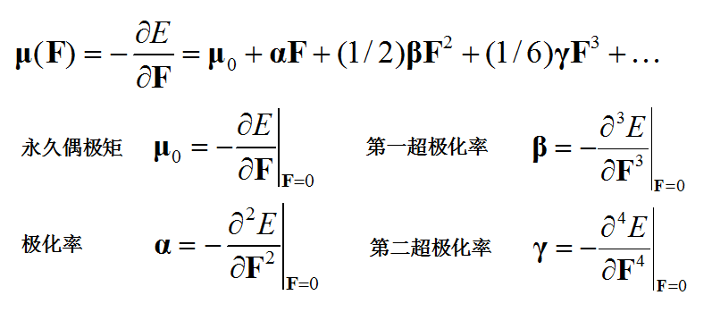  
  
对电子密度函数也可以向外电场进行Taylor展开，其中ρ(n)体现出电子密度对外场的n阶响应。其中ρ(0)就相当于无外场时的电子密度分布。  
  
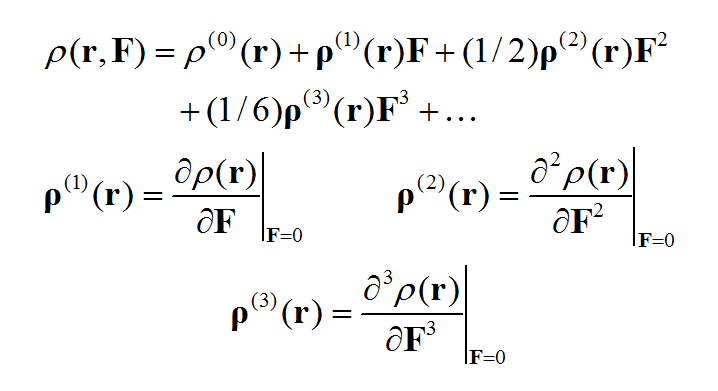  
  
基于偶极矩（电子贡献的部分）与电子密度的关系，进行对比我们就知道各阶（超）极化率和ρ(n)是怎么对应的。通过ρ(n)可以考察体系不同区域对（超）极化率数值的贡献，这被称为（超）极化率密度。  
  
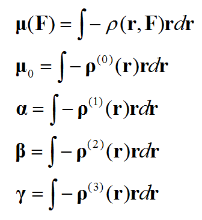  
  
计算不同的（超）极化率密度过程大同小异，本文我们只讨论计算和绘制上面列出的阶数最高的，即第二超极化率密度。搞明白这个后绘制极化率密度、第一超极化率密度也就是小菜了，举一反三即可，计算公式在文末给出了。  
  
第二超极化率密度ρ(3)是三阶张量函数，第二超极化率γ是个四阶张量，我们不可能把每个分量都讨论一遍，否则太费劲。我们这里只关注最重要的一个分量，zzzz。具体写出来是这样：  
  
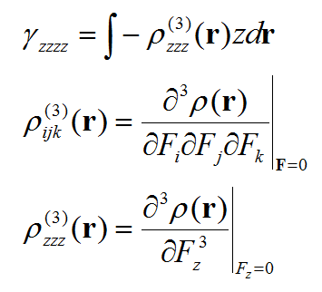  
  
我们一旦把ρ(3)zzz这个函数图形绘制出来，就能考察体系不同区域对γzzzz的贡献了。计算这个密度对外场z分量的三阶导数我们需要用有限差分的方法。具体计算公式如下所示  
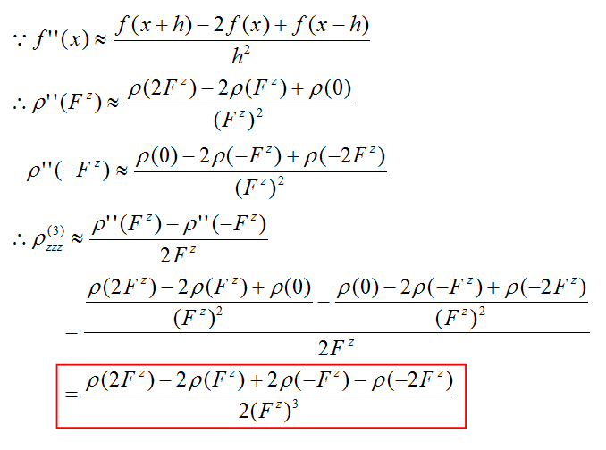  
图中开头的是有限差分求二阶导数的公式，我们将它代入有限差分求一阶导数的公式就得到了有限差分求三阶导数的公式。最后的红框就是我们实际通过做密度差以及密度和求ρ(3)zzz的公式了。括号里的Fz代表在z方向外加微量电场（数值大小对应差分步长）时的结果。差分步长过大过小都会造成结果精度的下降，根据测试用0.003 a.u.左右比较不错。  
  
利用Multiwfn的实空间函数自定义操作功能，结合Gaussian等程序产生的波函数文件，就可以很容易地根据上式得到ρ(3)zzz图像了。下面我们用甲醛作为实例来演示计算。  
  
  

## 2 计算γzzzz

讨论ρ(3)zzz前，我们先用Gaussian把γzzzz给算出来，当然这一步不是必需的。既然讨论的是分量，就必须把分子朝向先明确了。本文用的示例分子甲醛的朝向如下，结构已在B3LYP/TZVP下优化。  
  
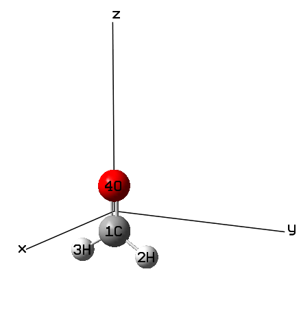  
  
算γ的输入文件如下。这会基于HF的解析三阶导数做一次有限差分得到γ对应的四阶导数。  
  
# HF/aug-cc-pVTZ polar=gamma  
  
B3LYP/TZVP opted  
  
0 1  
 C                  0.00000000    0.00000000   -0.52710800  
 H                  0.00000000    0.93885600   -1.11413900  
 H                  0.00000000   -0.93885600   -1.11413900  
 O                  0.00000000    0.00000000    0.67386600  
  
0.0  
  
末尾的0.0代表外场为0，即我们计算的是静态的γ。显然用HF算超极化率肯定不准，但本文只是示意而已所以无所谓。从结果末尾可见γ的zzzz分量为0.145571D+04 a.u.，即1455.71 a.u.。  
  
  

## 3 产生波函数文件

下面我们获得不同大小外电场下的波函数文件。  
  
虽然一般加电场计算的时候都要用nosymm避免Gaussian把分子自动调整到标准朝向下（否则实际外加电场方向将和期望的不符），但当前例子里的坐标已经是在标准朝向下了，所以不用写nosymm。  
  
我们总共要得到四个波函数文件，分别是外场为-2Fz、-Fz、Fz、2Fz的情况。这里我们用0.003a.u.外场为步长。我们先计算-2Fz，于是外场就是-0.006a.u.，对应field=z+60关键词（提醒一下，Gaussian中field关键词定义的外场方向和一般定义是反过来的）。输入文件如下：  
  
# HF/aug-cc-pVTZ field=Z+60 out=wfx  
  
B3LYP/TZVP opted  
  
0 1  
 C                  0.00000000    0.00000000   -0.52710800  
 H                  0.00000000    0.93885600   -1.11413900  
 H                  0.00000000   -0.93885600   -1.11413900  
 O                  0.00000000    0.00000000    0.67386600  
  
C:\H2CO-2FZ.wfx  
  
算完上面这个任务后，改成field=Z+30再次计算得到H2CO-FZ.wfx，改成field=Z-30得到H2CO+FZ.wfx，改成field=Z-60得到H2CO+2FZ.wfx。这样所需的四个外场下的波函数文件就都齐了。  
  
实际上Gaussian能产生的.wfn、.wfx、.fch都可以作为Multiwfn的输入文件，结果都一样。但是当外场很小时（特别是小到0.001 a.u.程度时），可能是因为.wfn格式的数据记录有效位数相对有限的原因，结果和.wfx偏差较大，所以这里用数值记录精度更高的.wfx格式，当然用fch也是可以的，记录精度同样很高。  
  
  

## 4 通过自定义运算获得ρ(3)zzz

Multiwfn的主功能3、4、5，即绘制曲线图、平面图、等值面图的功能都可以设定对实空间函数的自定义运算，作密度差是其最常见的应用，有兴趣可以看《使用Multiwfn作电子密度差图》（<http://sobereva.com/113>）。本文算ρ(3)zzz是自定义运算的一个很特殊也很能证明其价值的应用。我们按照ρ(3)zzz计算公式的分子定义自定义操作的运算顺序，然后除以分母就行了。  
  
启动Multiwfn，然后依次输入  
C:\H2CO+2FZ.wfx   //首先载入ρ(3)zzz计算公式的分子中的第一项ρ(2Fz)  
5      //计算格点数据并显示等值面  
0      //自定义操作  
5      //接下来对5个文件进行操作  
-,C:\H2CO+FZ.wfx     //公式中的-2ρ(Fz)项，通过减两次来表现  
-,C:\H2CO+FZ.wfx  
+,C:\H2CO-FZ.wfx     //公式中的2ρ(-Fz)项，通过加两次来表现  
+,C:\H2CO-FZ.wfx  
-,C:\H2CO-2FZ.wfx    //公式中的-ρ(-2Fz)项  
1    //电子密度  
2    //中等质量格点  
然后程序开始计算密度数据并按照上述定义的规则进行运算，算完之后，我们要让格点数据除以分母，即2(Fz)^3项。对于当前情况，这一项是2*0.003^3=0.000000054。接着输入  
6    //除以某个值  
0.000000054  
-1   //观看等值面  
在蹦出的图形窗口中将isovalue设大一些，这里设为0.5，如下所示  
 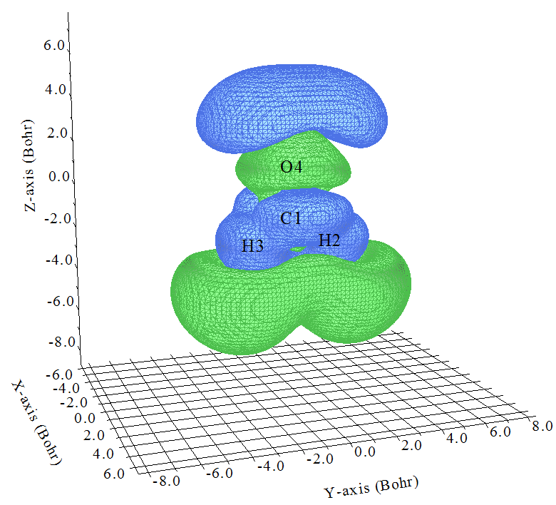  
  
这就是ρ(3)zzz啦！第一节已经给出了ρ(3)zzz和γzzzz的关系，即各个位置的ρ(3)zzz乘上相应位置的-Z再全空间积分就是γzzzz，因此我们容易想象体系不同位置对γzzzz的贡献。比如在原点附近（大约C=O中央），Z接近于0，所以这部分区域即便等值面挺大，即ρ(3)zzz数值不小，在乘了-Z后对γzzzz的贡献也不会太大。而O的上方有一大块蓝色（负值）等值面，Z的数值也不小，和-Z相乘后肯定那部分电子对γzzzz有较大正贡献。在两个H下方有一大块绿色（正值）区域，那部分Z为不小的负值，故乘上-Z后也对γzzzz有较大正贡献。  
  
这么考察还稍微有点费劲，我们可以把已经得到的这个ρ(3)zzz乘上-Z之后再考察图形，这样就能更直观看到不同位置的贡献了，因为直接一积分就是γzzzz了。我们可以用Multiwfn的格点数据处理功能实现。我们关闭图形窗口，然后输入  
0    //返回主菜单  
13   //处理格点数据  
11   //对格点数据进行操作  
20   //乘上坐标变量（此功能在2015年9月13日及之后更新的Multiwfn版本中才有）  
Z    //乘上Z坐标  
11   //对格点数据进行操作  
5    //乘上个常数  
-1   //乘以-1。此时格点数据就相当于-Z*ρ(3)zzz的格点数据了  
-2   //观看等值面  
数值为1.0的等值面如下所示  
   
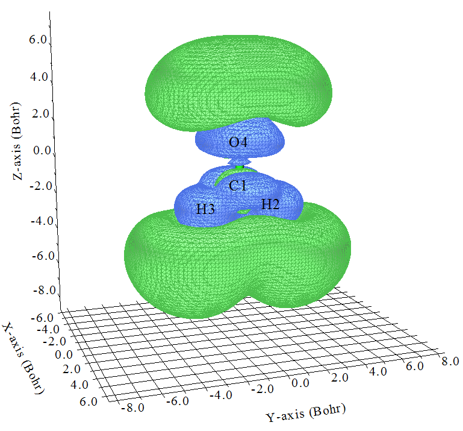  
  
这下考察起来更容易了，也就是图中绿色等值面越大的区域对γzzzz的贡献越正，蓝色等值面越大的区域对γzzzz的贡献越负。可见，在分子价层区域，基本上都是负贡献，而在O、H外围区域有着很大的正贡献，并且显然明显超越了负值区域，这是为什么当前体系的γzzzz是一个很大正值（前面计算结果为1455.71 a.u.）。对于一个较大体系，通过这么张图，立刻就能解释清楚γzzzz为什么大或者为什么小，为什么正或者为什么负，各个区域贡献一目了然，太爽啦！放到论文里自然会加分。  
  
这张图也引出一个很重要的问题，也就是计算γ的基组一定要有充足的弥散函数！！！如果没有弥散函数，那么可以想象，上图中分子边缘弥散程度较高的绿色区域就没法合理描述，此时γzzzz肯定会被低估，甚至为负值！为了证明这点，我们在cc-pVDZ下进行计算，结果仅为26.4 a.u.，而在6-31G*下计算，结果为-108.85 a.u.，连符号都错了。而加入弥散函数成为6-31++G*后，结果为726.27 a.u.，虽然定量上很烂，但趋势基本对了。  
  
不同的基组下、不同的理论方法下，γzzzz不同，显然-Z*ρ(3)zzz也相应地不同，因为后者全空间积分就等于前者。因此，我们也可以通过比较-Z*ρ(3)zzz图来考察为什么不同基组、不同的理论方法下结果有异。我们还可以用一个高精度级别下计算的-Z*ρ(3)zzz和一个较烂级别下计算的-Z*ρ(3)zzz作差值图（用Multiwfn主功能13的子功能11做两个格点数据间的相减运算即可），马上就能知道较烂的级别是因为在什么区域描述不好而导致结果不好。此时误差就不再仅仅是一个数值了，我们可以洞察内在真相。  
  
-Z*ρ(3)zzz的积分是γzzzz，我们也可以很容易地通过数值验证这一点。关闭刚才的图形界面，然后进入选项17，再输入1，就得到了当前格点数据在全空间中的统计信息，其中  
Integral of all data:                    1429.5132718689  
就是基于立方格点积分的结果。这个值和我们第二节通过导数方法得到的γzzzz值1455.71 a.u.很接近。如果我们之前在计算格点数据时在设定格点的界面中将延展距离设大到10 Bohr，并且用更好的格点（high quality grid），则结果为1459.43 a.u.，非常接近导数方法计算的结果了。  
  
  

## 5 绘制ρ(3)zzz和-Z*ρ(3)zzz的平面图

我们也可以利用Multiwfn的主功能4十分容易地绘制ρ(3)zzz和-Z*ρ(3)zzz的平面图，自定义运算的设置方式完全一样。我们先绘制甲醛分子平面上的ρ(3)zzz等值线图。  
  
C:\H2CO+2FZ.wfx  
4      //绘制平面图  
0      //自定义操作  
5      //有5个文件将要与当前文件相运算  
-,C:\H2CO+FZ.wfx  
-,C:\H2CO+FZ.wfx  
+,C:\H2CO-FZ.wfx  
+,C:\H2CO-FZ.wfx  
-,C:\H2CO-2FZ.wfx  
1   //电子密度  
2   //等值线图  
[回车]   //用默认的格点设定  
0   //调整延展距离  
10   //设为10 Bohr  
3   //YZ平面  
0   //X=0  
关闭图像，然后选  
-7  //将数据乘上个值  
18518518.5185185   //即分母0.000000054的倒数  
-1  //重新绘图  
  
结果如下，实线和虚线分别代表正值和负值部分。后处理菜单还有大量选项可以调节绘图效果。  
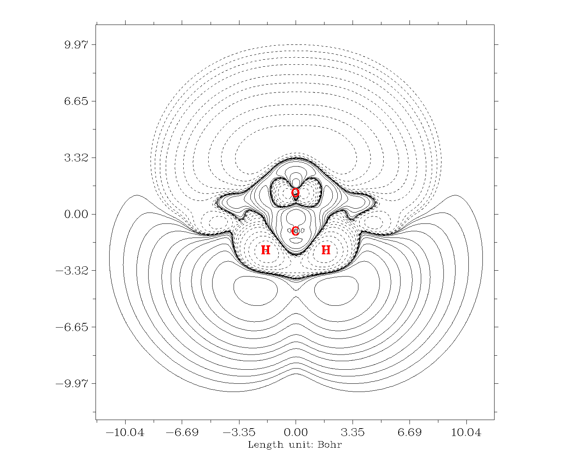  
  
  
再来绘制-Z*ρ(3)zzz的等值线图。关掉Multiwfn，把settings.ini的iuserfunc设为23，因为从手册2.6节可以看到设为23时用户自定义函数等价于-Z*ρ(r)，因此我们直接对用户自定义函数进行自定义操作就直接得到了-Z*ρ(3)zzz。绘图步骤和上面一样，唯一不同的是选择实空间函数的时候选100（用户自定义函数）。结果如下

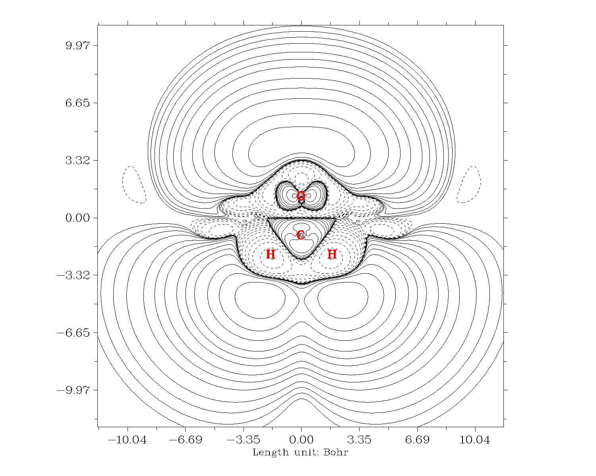  
也可以作成填色图+等值线图，绘图类型选绘制填色图然后后处理菜单再把等值线打开就行了：  
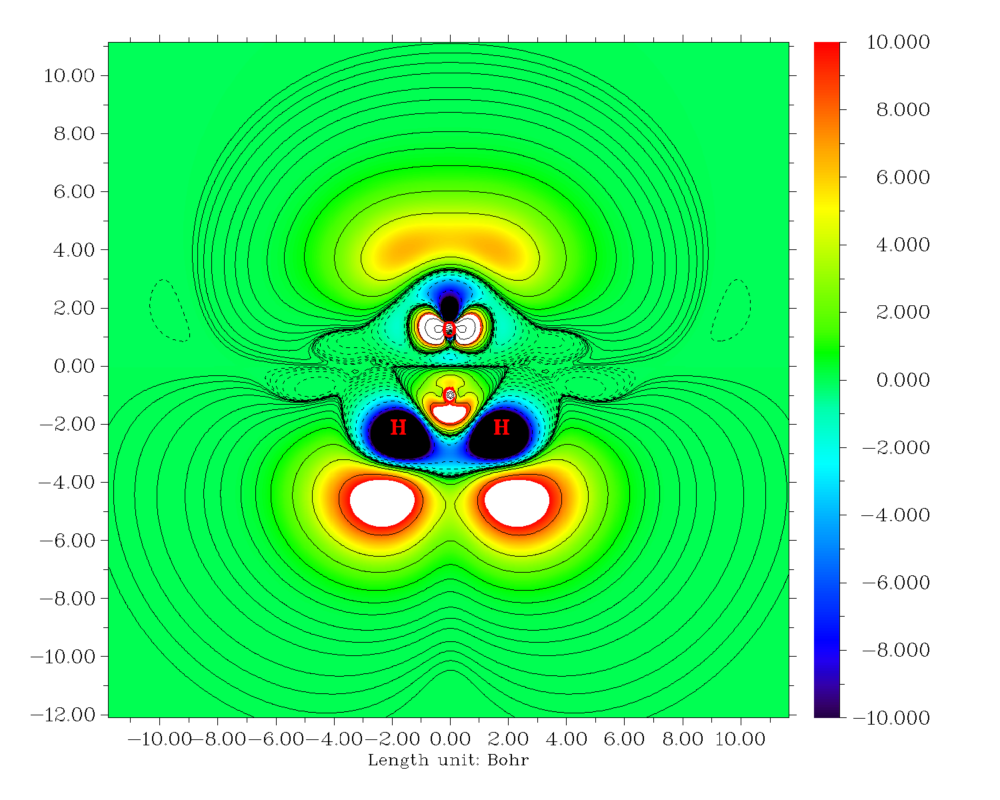

## 6 快速导出ρ(3)zzz和-Z*ρ(3)zzz的格点数据

在前述分析中的主功能5的后处理菜单中，以及在主功能13中，都有相应的选项将当前内存里的格点数据导出成cube文件，便于进一步通过第三方可视化程序如VMD去绘制等值面图等等。由于一套计算流程的操作步骤较多，可能有人嫌每次输入麻烦，其实可以通过以重定向方式运行Multiwfn来使得整个过程方便许多，这方面更多信息见手册5.2节。

建立一个文本文件，比如叫hyperdens.txt，里面是在Multiwfn中为了产生ρ(3)zzz和-Z*ρ(3)zzz的cube文件所需要敲入的每一条命令。此文件在本文的文件包里已经提供了。首先确保前述的.wfx文件都已经放到C:\下了，hyperdens.txt放到Multiwfn当前目录下了，然后在命令行窗口里运行Multiwfn < hyperdens.txt，则程序hyperdens.txt里每一行命令就会传递给Multiwfn。很快，当前目录下就产生了density.cub，这是ρ(3)zzz的cube文件，也产生了-Zrho3zzz.cub，这是-Z*ρ(3)zzz的格点文件。

## 7 计算原子对超极化率的定量贡献

可能有人想分析各个原子对超极化率的定量贡献，实际上这可以通过在原子空间内对超极化率密度进行积分得到，这里演示一下。首先我们把settings.ini里的iuserfunc的数值设为-1并保存文件，之后Multiwfn里第100号实空间函数将对应于基于内存里的格点数据进行插值得到的函数。

启动Multiwfn，载入-Z*ρ(3)zzz的格点文件（比如上一节产生的-Zrho3zzz.cub就是），然后依次输入  
15  //模糊空间分析  
1  //在原子空间内进行积分。目前默认用的原子空间划分方式见选项-1中的文字提示  
100  //此函数目前对应于基于-Z*ρ(3)zzz的格点数据插值出来的函数  
输出信息为  
   Atomic space        Value                % of sum            % of sum abs  
     1(C )           80.42330427             5.643648             5.643648  
     2(H )          428.30264522            30.055833            30.055833  
     3(H )          428.19625953            30.048367            30.048367  
     4(O )          488.10117815            34.252152            34.252152  
 Summing up above values:       1425.02338717  
Value下面的值就是各个原子的贡献值，同时程序还给出了对总值的贡献比例，可见处在体系中央的碳贡献不大，但边缘的H、O贡献都很大。所有原子加和值为1425.023，这和之前在主功能13里基于立方格点积分得到的1429.513略有偏差，这是正常的，毕竟积分方式不同。通过效仿本节的做法，还可以计算原子对ρ(3)zzz的贡献。

## 附录

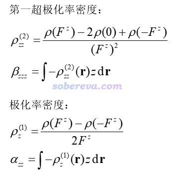
