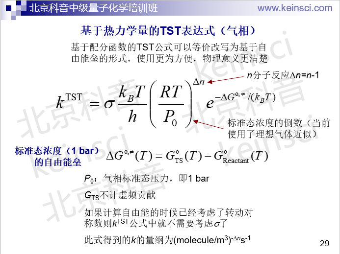
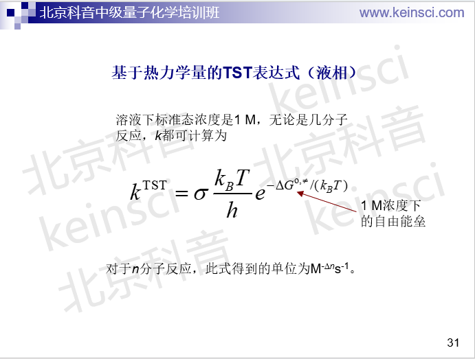
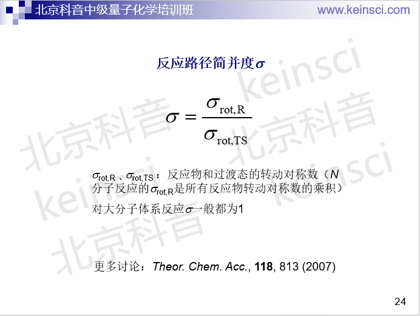

**基于过渡态理论计算反应速率常数的Excel表格**  
Excel spreadsheet for calculating reaction rate constant based on transition state theory

Created by Sobereva @[北京科音](http://www.keinsci.com)

First release：2015-Dec-10  Last update：2020-Jun-7

这个是笔者基于过渡态理论计算单分子和双分子反应速率常数的Excel表格，把自由能垒（过渡态与反应物的自由能之差），或者反应物和过渡态的配分函数填进去，并且填入反应温度T、反应路径简并度σ和透射系数κ就可以得到反应速率常数。单分子和双分子反应都支持。如果你不会算自由能的话，看《使用Shermo结合量子化学程序方便地计算分子的各种热力学数据》（<http://sobereva.com/552>）。

其中第三个工作表是用来计算隧道效应透射系数κ的表格，支持三种比较简单的方法。可以把这里算出来的κ填入计算反应速率常数的表格中的κ的位置。

表格使用方式非常简单，而且表格里有详细注释，稍微一看就明白。

[**http://sobereva.com/soft/TSTcalculator.xlsx**](http://sobereva.com/soft/TSTcalculator.xlsx)

鉴于网上经常有人问我表格里涉及的公式，这里我直接把我讲的培训里相关的三页给出。关于反应速率常数详细的计算介绍和例子在北京科音中级量子化学培训班（<http://www.keinsci.com/workshop/KBQC_content.html>）里我会详细讲，欢迎参加。还老有人问我为什么式子里是kT而不是RT，显然是用波尔兹曼常数(k)还是理想气体常数(R)要看你在式子里用的G是什么单位、带不带/mol，指数项必然是无量纲的。

如果你是用Shermo计算的自由能，由于Shermo自动就会判断点群和转动对称数，从而在给出的自由能里直接体现出相应效果，因此此时在这个excel表格里的σ总是填1就可以了。

如果你对反应速率常数计算知之甚少，建议阅读一下此文：《谈谈如何通过势垒判断反应是否容易发生》（<http://sobereva.com/506>），对理解此表格非常有益。

如果你想做变分过渡态理论(VTST)计算，而且如果只需要其最简单的形式，即正则VTST，那么需要你把TS以及TS相邻的一批IRC点取出来（比如总共取15~20个），取其中自由能最高的那个作为实际的过渡态，并将这个点的自由能与反应物的求差作为自由能垒代入以上表格。

如果使用此表格计算k发表文章，**请这样引用**：Tian Lu, TSTcalculator, <http://sobereva.com/310> (accessed 月 日, 年)
