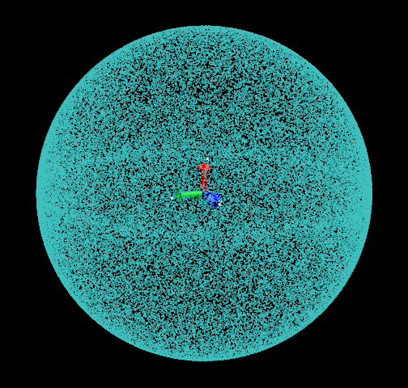
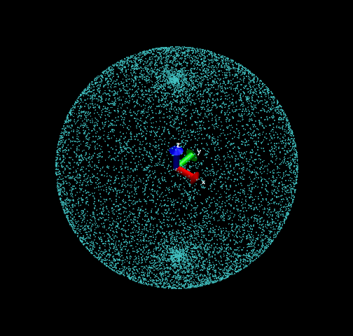
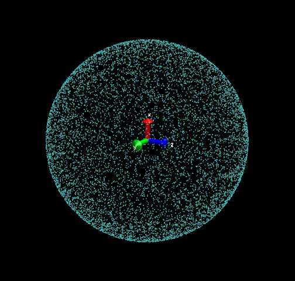

**在球面上随机均匀分布点的算法**Algorithm for randomly and uniformly distributing points on a sphere  
  
文/Sobereva @[北京科音](http://www.keinsci.com) 2015-Dec-12

  
  
写个程序时遇到一个问题，需要得到在一个单位球面上随机分布一批点的坐标，想了想办法，第一个办法是选取一个起始点(1,0,0)，然后依次绕着X、Y、Z轴随机旋转一定的角度，Fortran代码如下  
x=1  
y=0  
z=0  
!Step 1: Rotate about Z axis  
call RANDOM_NUMBER(rotval)  
rotval=rotval*2*pi  
xtmp=cos(rotval)*x-sin(rotval)*y  
ytmp=sin(rotval)*x+cos(rotval)*y  
x=xtmp  
y=ytmp  
!Step 2: Rotate about Y axis  
call RANDOM_NUMBER(rotval)  
rotval=rotval*2*pi  
xtmp=cos(rotval)*x-sin(rotval)*z  
ztmp=sin(rotval)*x+cos(rotval)*z  
x=xtmp  
z=ztmp  
!Step 3: Rotate about X axis  
call RANDOM_NUMBER(rotval)  
rotval=rotval*2*pi  
ytmp=cos(rotval)*y-sin(rotval)*z  
ztmp=sin(rotval)*y+cos(rotval)*z  
y=ytmp  
z=ztmp  
  
点不是很多的话，看起来还蛮均匀，能用，但点数多了就会发现点的分布并不均匀，100000个点时如下所示，可以隐约看到有一个环状分布比较密集。  
  
  
  
出现此问题的原因是，虽然第一步得到了一个均匀随机的环状分布，但是第二步的时候在球的两极已经有点的聚集现象了，第三步时把这个问题弱化了，但是聚集的两极经过绕着X轴转一圈后，还是略微形成了环状密集分布区域。  
  
  
感觉不够完美，又在网上找找有没有什么其它方法，看到一个做法，对应的Fortran代码：  
call RANDOM_NUMBER(rotval)  
theta = pi*rotval  
call RANDOM_NUMBER(rotval)  
phi = 2*pi*rotval  
x=sin(theta)*cos(phi)  
y=sin(theta)*sin(phi)  
z=cos(theta)  
试了下，发现很坑爹，点在两极严重聚集。给出这样算法的人真是不负责任，10000个点时分布如下所示  
  
  
  
  
于是搜英文资料，发现一个页面很好，http://mathworld.wolfram.com/SpherePointPicking.html，专门介绍了获得球面上随机分布点的算法，没想到还专门有算法解决这个问题。其中最简单实用的Marsaglia的方法，非常好。过程是，在(-1,1)区间内随机取两个值x1和x2，若这两个值的平方和大于等于1则重新选取。然后球面上的点的x、y、z的坐标用x1和x2就可以很简单得到，Fortran代码如下  
do while(.true.)  
    call RANDOM_NUMBER(x1)  
    call RANDOM_NUMBER(x2)  
    x1=2*(x1-0.5D0)  
    x2=2*(x2-0.5D0)  
    if (x1**2+x2**2<1) exit  
end do  
x=2*x1*dsqrt(1-x1**2-x2**2)  
y=2*x2*dsqrt(1-x1**2-x2**2)  
z=1-2*(x1**2+x2**2)  
  
10000个点的时候分布如下，非常均匀完美  
  

