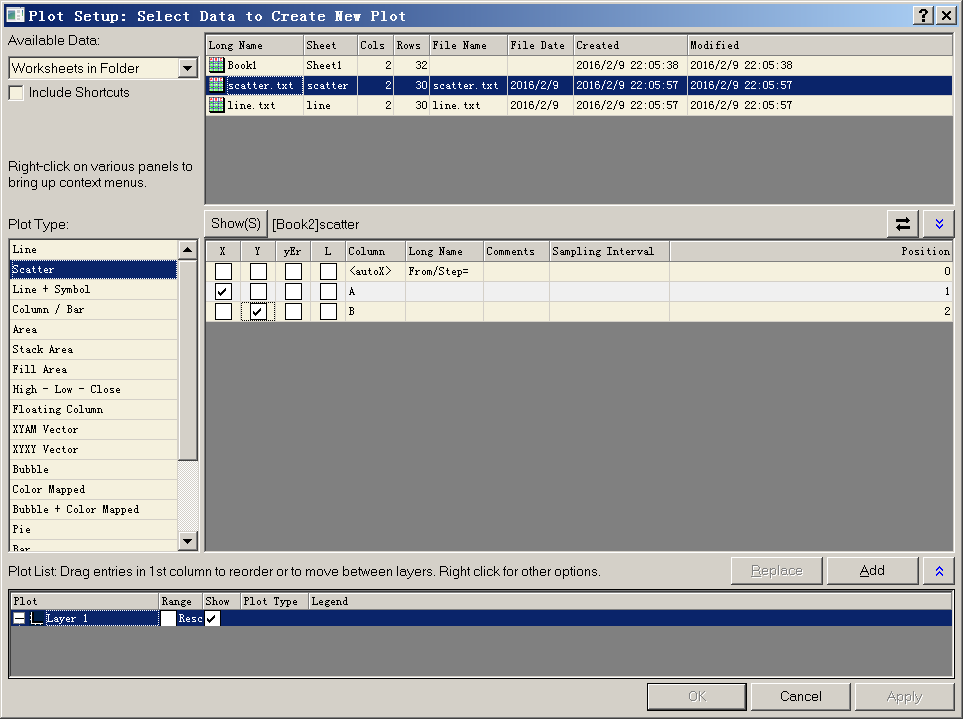
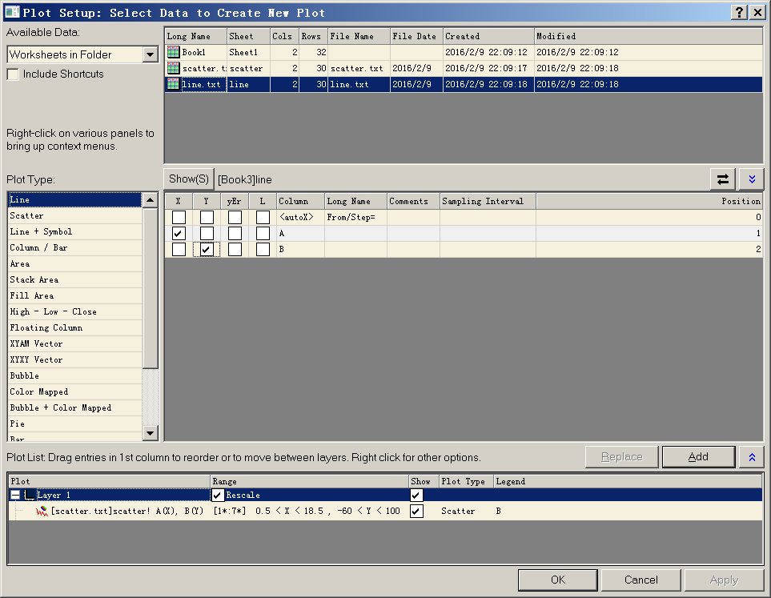
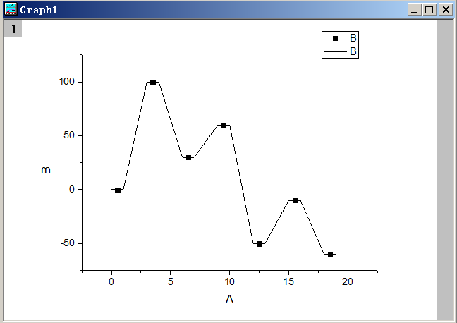
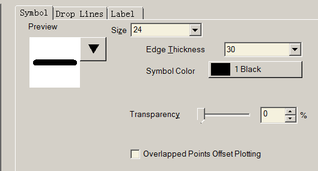
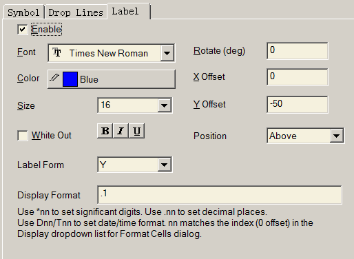
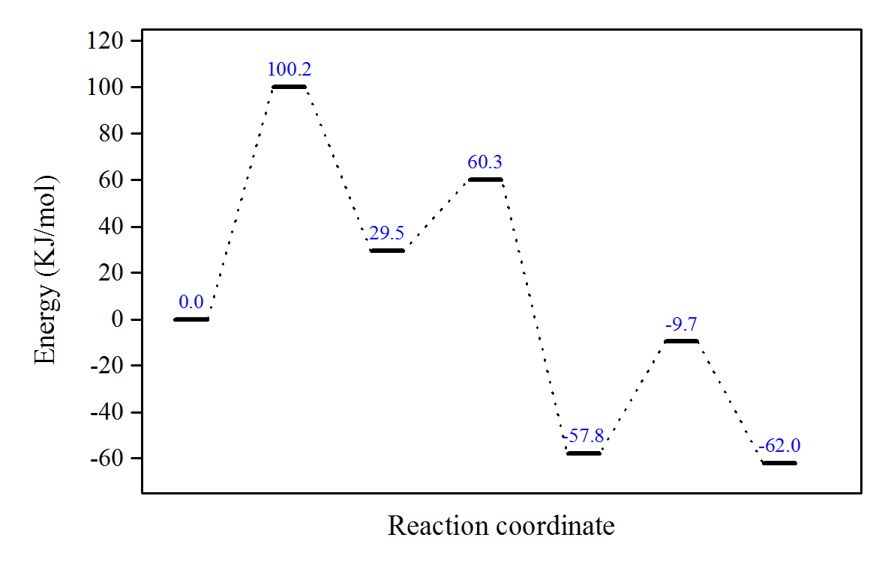

**PS**：鉴于有一些人看完了本文还是觉得操作上吃力，笔者专门录了个视频予以演示：<https://www.bilibili.com/video/av28653613>

**在Origin中绘制能量折线图的方法**The method of drawing energy profile map in Origin  
  
文/Sobereva @[北京科音](http://www.keinsci.com/)   2016-Feb-9

  
  
很多讨论反应机理的文章都会给出能量折线图，用于描述反应过程中过渡态、中间体的能量以及连接关系。这种图中，纵坐标是能量，横坐标是反应坐标，每个过渡态或中间体在图中在相应位置用一个横杠表示，相邻的这些结构用实线或虚线连接。有一些现成的小工具可以绘制这种图，比如liyuanhe写的基于Python写的小程序（<http://bbs.keinsci.com/forum.php?mod=viewthread&tid=2675>），以及energy_plot.py（<http://homepage.univie.ac.at/felix.plasser/chemprogs/python.htm>）。有些人用chemdraw画这种图，显然是不合适的，横杠位置摆放只能靠肉眼估计，间距也不均匀，过程也麻烦。比较合理的做法是用Origin。本文介绍怎么用Origin结合笔者写的一个辅助小工具作这种图，练习过一遍后会发现整个流程挺简单，而且可以用Origin的丰富的选项定制出自己想要的效果。本文用的是Origin 9.0。  
  
此文要作的图里从左到右有7个能量值，单位为KJ/mol，如下所示，第一个值作为零点。  
0.0  
100.2  
29.5  
60.3  
-57.8  
-9.7  
-62.0  
  
为了作图方便，这里用笔者写的enepro程序产生与上面对应的在Origin作图中要用的数据文件。在这里下载enepro：[/usr/uploads/file/20160209/20160209231002_56859.rar](http://sobereva.com/usr/uploads/file/20160209/20160209231002_56859.rar)。其中.exe是编译好的可执行文件，.f90是源代码。解压后，将里面的输入文件input.txt写成下面这样。第一行是横杠的宽度，第二行是横杠之间的间隔，这里相当于将二者长度设成了1:2。从第4行起就是依次写上能量值了，单位随意。  
  
1  //Bar width  
2  //Spacing between bars  
=====Below are energies=====  
0.0  
100.2  
29.5  
60.3  
-57.8  
-9.7  
-62.0  
  
双击启动enepro.exe，就会读取当前目录下的input.txt，并在当前目录下产生scatter.txt文件，用于绘制横杠，以及line.txt文件，用于绘制折线。  
  
启动Origin，将scatter.txt和line.txt都直接拖进Origin窗口。然后点击绘制散点图的按钮，选成下图这样，然后点Add，以加入散点作图数据。  
  
  
  
然后再选成下图这样，再点Add，以加入折线作图数据。  
  
  
  
此时窗口下方Plot List里已经有两套数据了。点OK，得到下图  
  
  
  
之后要调节的主要是(1)边框与横、纵坐标说明 (2)坐标刻度 (3)连线的样式 (4)图例 (5)散点图的符号 (6)增加数据点标签。前4项不需要多说，大家摸索一下就能调成想要的效果。要修改后两项，应当双击图中数据点符号，然后把Symbol标签页里的符号改为横杠，Edge Thickness加大使之比较粗，并且适当调节Size，使得数据点符号正好覆盖住折线的相应位置，本例设定如下所示：  
  
  
  
然后选择Label标签页，选上Enable，以让数据点的具体数值显示出来。可以设定字体颜色、相对于数据点的位置和偏移量。Display Format框里输入.1代表保留一位小数。本例设定如下所示：  
  
  
  
都设好后最终效果如下所示  
  
  
  
为了以后作图方便，我们把当前好不容易设好的作图设置保存为主题。在图的边框外侧点右键选Save Format as Theme，然后设一个名字，比如energy_profile，点OK。以后再以完全相同（一定要完全相同！）的步骤作这种图后，就可以直接按F7打开Theme Organizer，选择之前保存的energy_profile主题，就能将当前图像立刻套用上以前设定的作图样式，之后只需要再修改极个别地方即可。  
  
另外，这种折线图上还经常把分子结构附上去。这个很简单，在chemdraw里画好结构，ctrl+C，然后在origin里ctrl+V即可。也可以把其它现有的图片文件直接贴到origin里（图上点右键选Insert Images from Files），或者把剪切板里的图像ctrl+V直接粘进去。另外，Origin在界面左侧一列中也提供了在图上画直线、箭头、添加文字的工具，基本用不着再ps了。  
  
还有些情况需要在图上用不同颜色显示多条路径，这也很简单。把对应于其它路径的scatter.txt、line.txt也导入Origin当前的项目中，双击之前作图窗口左上角的灰色的含有“1”字的方框，然后点plot setup，再把对应另外路径的数据也加入到当前作图数据列表里即可，过程和前面如出一辙。
