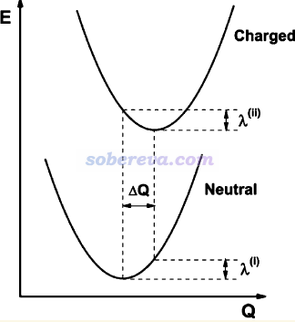
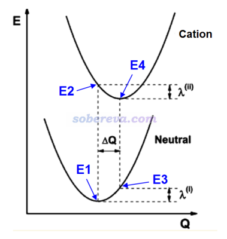
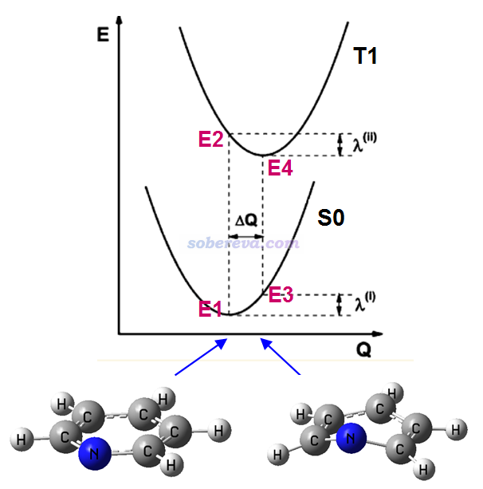
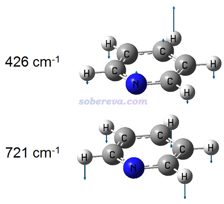
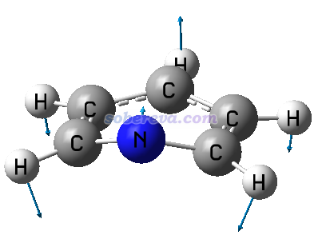
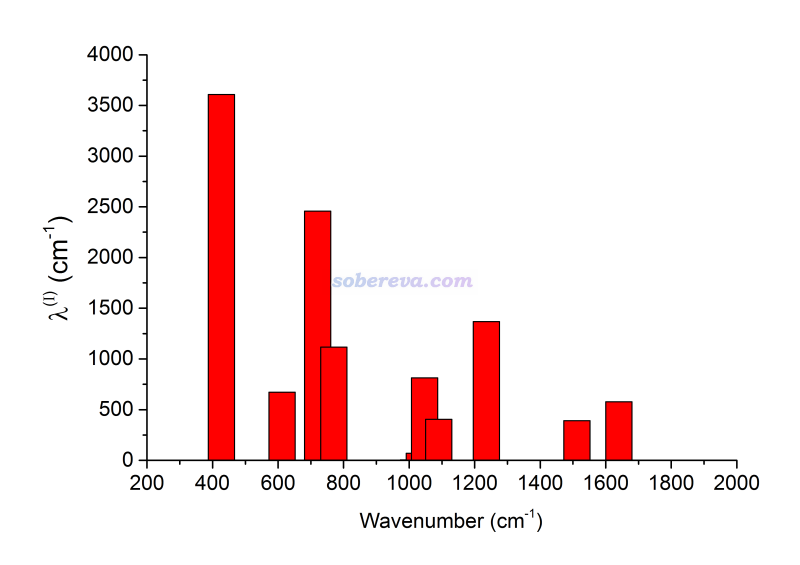
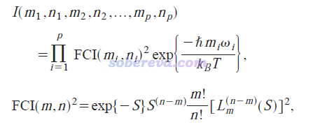

**2024-Oct-21补充**：Gaussian 16计算振动电子光谱的功能直接就能给出Huang-Rhys因子，非常好用，也没有dushin程序那样有时莫名其妙无法载入文件的问题。在北京科音高级量子化学培训班（<http://www.keinsci.com/workshop/KAQC_content.html>）里讲授振动电子光谱的部分专门给了具体讲解和例子。

**使用Dushin分解重组能和计算Huang-Rhys因子**Using Dushin program to decompose reorganization energy and calculate Huang-Rhys factor  
  
文/Sobereva @[北京科音](http://www.keinsci.com)  2016-May-30

  
  
经常有做电荷转移的人问怎么用Dushin程序、怎么算重组能、怎么把重组能分解为各个振动模式的贡献、怎么计算Huang-Rhys因子，本文就结合实例专门说说这些问题。  
  

## 1 重组能(reorganization energy)的计算

重组能是基于Marcus理论计算电子转移速率的关键的量，具体分为内重组能和外重组能，前者衡量电子得/失后（或更广义来说，电子态改变后）因几何结构的弛豫导致的体系能量变化，外重组能则对应将周围环境分子重新极化所花费的能量。外重组能不好算，溶液下往往经验性地取0.2~0.6eV，晶体下则会小一个多数量级，也有些文章专门讨论怎么算，如JPCL,1,941(2010)、JACS,130,12377(2008)，本文我们只说内部重组能。  
  
看这张示意图，有中性和带电状态两个势能面  
  

  
图中重组能有两部分，λ(I)和λ(II)。做Marcus理论计算时说的重组能是指二者绝对值之和。注：重组能的计算方式和定义可能令一些人混淆，可参考<http://bbs.keinsci.com/thread-35003-1-1.html>回帖里的讨论。  
   
具体来说，如果charged态是带+1电荷的情况，算出来的重组能用λ+表示，也称空穴重组能λh。如果charged态是带-1电荷，算出来的重组能用λ-表示，也称电子重组能λe。  
  
根据上面的示意图，很容易知道怎么计算λh和λe。例如计算λh，对应的示意图：  

  
需要以下步骤  
(a) 优化中性状态结构  
(b) 在(a)的结构下算中性状态的能量E1  
(c) 在(a)的结构下算阳离子状态的能量E2  
(d) 优化阳离子状态结构  
(e) 在(d)的结构下算中性状态的能量E3  
(f) 在(d)的结构下算阳离子状态的能量E4  
重组能为  
λ(I)=|E3-E1|  
λ(II)=|E2-E4|  
λh= λ(I)+λ(II)  
  
类似地，我们可以算电子态改变过程的重组能。本文我们实际算一个例子，考察吡啶的基态单重态S0和第一三重态激发态T1之间的两种重组能λ(I)和λ(II)，示意图如下：  

可见，S0和T1态优化的结构有明显不同，前者原子是在同一个平面上的，是C2v对称性，后者就弯折了，是Cs对称性。  
  
通常做单点计算比几何优化用的级别要高，但为了省事，此例优化和单点计算都用B3LYP/def2SVP在G09 D.01下做。实际上，也只有几何优化和单点都在同一级别时算出的重组能和后文提到的用dushin做重组能分解的结果才有可比性。算出来的图上四个点的能量：  
E1=-248.1053119 Hartree  
E2=-247.9505667 Hartree  
E3=-248.0570726 Hartree  
E4=-247.9706883 Hartree  
重组能为  
λ(I)=E3-E1=30.27 kcal/mol  
λ(II)=E2-E4=12.63 kcal/mol  
可见，从S0平衡结构垂直跃迁到T1后，结构弛豫对应的重组能为12.63 kcal/mol，这个值比从T1垂直返回S0之后结构弛豫对应的重组能30.27 kcal/mol小很多。这也暗示了，在S0-T1极小点结构之间的方向上，S0极小点处的势能面曲率大于T1极小点处的，因为以相同方式位移，S0态能量变化λ(I)比T1态能量变化λ(II)大得多。  
  
  

## 2 重组能的分解

对于上面吡啶的例子，在S0极小点结构下做freq任务，可以得到S0下的3N-6个正则坐标。S0和T1两个极小点之间的位移ΔQ可以分解为这些正则坐标的贡献，第i个模式的贡献记为ΔQ_i。谐振势公式是E=(1/2)*k*x^2，基于这个公式，我们也可以将λ(I)分解为各个正则模式的贡献，即λ_i=(1/2)*k_i*(ΔQ_i)^2，这里k_i代表相应振动模式的力常数。当然了，谐振模型终究只是对实际势能面的近似，所以∑λ_i并不精确等于λ(I)，但能定性相符。类似地，在T1极小点结构下做freq得到3N-6个正则坐标后，也可以得到它们对ΔQ和λ(II)的贡献。  
  
S0和T1极小点下分别得到的3N-6个正则坐标是不同的，彼此间是线性变换关系，这个关系也叫Duschinsky旋转或者称Duschinsky混合效应，可表达为Q''=J*Q'+ΔQ，这里Q'和Q''分别代表两个电子态极小点下的正则模式，J称为Duschinsky矩阵，记录了Q'与Q''间线性变换的组合系数。如果两个态极小点下振动模式完全一致，则J是单位矩阵，说明没有混合；J偏离单位矩阵越大说明混合越强烈。  
  
提醒一下，对重组能分解时候都是基于末态极小点结构的正则模式来做分解，所以分解λ(I)要用S0极小点处的正则模式，分解λ(II)要用T1极小点处的正则模式。而不能用比如T1极小点处的正则模式分解λ(I)，因为原理上说不通。  
  
做重组能的分解和计算Duschinsky矩阵并不复杂，也有现成的程序可以做，下面介绍的Dushin就是其一。  
  
  

## 3 Dushin程序的使用

Dushin程序由Reimers开发的，关于程序的一些原理细节可以看JCP,115,9103(2001)，引用Dushin程序也应当引这篇文章。Dushin程序源代码包可以在这里下载：<http://bbs.keinsci.com/forum.php?mod=viewthread&tid=319>。Dushin程序有自带的说明文档README，但写得比较抽象，这里用人话说一下：  

#### 3.1 编译方法

Dushin是Fortran写的，机子里得有Fortran编译器才能编译，Dushin默认的是ifort编译器（gfortran应该也行，我没试）。  
  
在Linux下编译的过程是：下载后解压，把compile里的ifort -g plot-modes.for subs.o recalc-freq.o proj0freq.o bmatred.o ddiag.o dmpower.o dmatinv.o -o ~/bin/plot-modes这一行前头加上#给注释掉，因为压缩包里并没有带plot-modes.for文件，这个本身也用不上。然后执行./compile，就会调用ifort进行编译，编译好的可执行文件会产生在用户主目录的bin目录下面，包括dushin、displace和compare-geom三个文件。然后可以在控制台直接输入dushin看是否能启动，如果不能则需要把这个bin目录添加到$PATH环境变量里。  
  
为了便于那些不会编译或不会Linux的人使用，笔者编译了一份Windows版，下载链接：[/usr/uploads/file/20160531/20160531072934_58293.rar](http://sobereva.com/usr/uploads/file/20160531/20160531072934_58293.rar)。ifort编译好的Linux版可以在这里下载：[/usr/uploads/file/20160531/20160531072918_96449.zip](http://sobereva.com/usr/uploads/file/20160531/20160531072918_96449.zip)。  

#### 3.2 使用方法

Linux版：进入含有输入文件的目录，直接输入dushin即可运行。  
Windows版：把输入文件拷入dushin程序目录下，双击dushin.exe即可运行。运行完毕后会自动关闭窗口，如果不想让窗口自动关闭就自己进DOS然后输入dushin来执行（在dushin.exe所在目录窗口下按住shift点右键选“在此处打开命令行窗口”）。  

#### 3.3 输入文件

dushin的运行需要提供原子坐标、量化程序计算出的Hessian等信息，宣称支持许多量化程序，本文只考虑Gaussian的情况。G94、G98、G03、G09的输出文件dushin都支持。  
  
dushin.dat是dushin程序的主输入文件，dushin启动时就会载入当前目录下的dushin.dat。下面是输入文件的例子，详细的参数介绍见README：  
1 2  
.  
  
2 1 'S0 freq' 'S0_freq.out'  
0 1 'T1 freq' 'T1_freq.out'  
第一行第一项设定使用什么坐标进行分析，一般设1就行；第二项设定怎么匹配多个输入文件里的原子顺序，一般设2就行。  
第二行是指定输入文件所在目录，如果就放在了当前目录下就写.就行。  
第三行是空行。  
第四行开始定义输入文件。第一项是参考类型，对于第一个文件此项必须设2，之后的文件如果此项是1，代表Duschinsky矩阵是相对于第一个文件计算的，如果是0，代表是对后一个参考类型为1或2的分子计算的。第二项就设1就行了，第三项是这个文件的标签可以随意设，第四项是Gaussian freq任务输出文件名。  
  
一般来说，写dushin.dat的时候就把上面这个例子里面的标签名、文件名改一下就行，其它不用管。  
  
上面dushin.dat中S0_freq.out、T1_freq.out是Gaussian的freq任务的输出文件，都放在当前目录下。计算时用的关键词是#P freq b3lyp/def2svp，注意必须用#P，而且P必须大写，否则dushin无法正确识别其中的信息。算完后把.chk用formchk转换为同名的.fch文件，也放在当前目录下。（对于Linux版，后缀用默认的.log和.fchk也可以被dushin识别）  
  
注意如果用的是Windows版Gaussian，一定要手动在输出文件最开头插入这么一行： Entering Gaussian System, Link 0=g09，否则dushin无法识别文件。  

#### 3.4 输出文件

dushin启动后会在屏幕上会输出大量信息，其中大部分都是用于调试的，用户不用管。程序会在当前目录产生一大堆输出文件，主要有用的就这两个：  
  
dushin.out：包含主要输出信息的文件。其中Dushinsky matrix, ncs 2 in terms of ncs 1下面输出的是第二个输入文件的正则坐标(normal coordinates, ncs)是怎么由第一个输入文件的正则坐标组合而成的，包括组合系数和贡献百分比，只有贡献较大的会被输出。下面还会输出Dushinsky matrix, ncs 1 in terms of ncs 2，是描述第一个输入文件的正则坐标怎么由第二个输入文件的正则坐标组合而成的。再往下是Displacement: in terms of nc of 1 THEN of nc of 2，前几列是把位移和重组能按照第一个输入文件中的正则模式分解的结果，后几列是按照第二个输入文件的正则模式分解的结果。Q是指位移在此正则坐标上的分量，lam是每个正则模式对重组能的贡献量λ_i(cm^-1)。末尾total reorg energy (cm**-1, kcal/mol)就是∑λ_i，前两个值单位是cm^-1，分别是第一个和第二个输入文件的正则坐标对重组能贡献的加和，后两个值只不过是把单位换成了kcal/mol。  
  
supplem.dat：包含了被计算的体系的正则坐标、频率，Duschinsky矩阵，各正则模式对位移和重组能的贡献（eV）。其实和dushin.out差不多，只不过输出格式、单位变了变。  

## 4 实例：对吡啶S0-T1的重组能进行分解

我们在B3LYP/def2SVP级别下将电荷和自旋多重度设为0 1和0 3来分别优化吡啶的S0和T1态结构，之后用得到的结构分别做freq计算，得到Gaussian输出文件和fch文件。然后按3.3节的介绍恰当地写个dushin.dat文件。之后把dushin.dat、两个Gaussian输出文件和两个.fch文件都放在当前目录下，启动dushin，由于体系小计算量很低，马上就运行完毕。本例用到的dushin输入输出文件在这里都提供了，请自行查看：[/usr/uploads/file/20160531/20160531072953_56861.rar](http://sobereva.com/usr/uploads/file/20160531/20160531072953_56861.rar)。  
  
输出文件很容易理解。比如我们这里考察对λ(I)的分解，前面提到过λ(I)是T1垂直返回S0态后因结构弛豫造成的能量变化，末态是S0平衡结构，所以要看对S0正则模式的分解结果。从输出文件中看到S0的3N-6个正则模式中对重组能贡献量最大的两个模式是427和721 cm^-1，贡献值分别高达3607.6和2456.7 cm^-1，对位移贡献分别达到4.112和2.610埃，对应的输出信息为：  
   8 B1  freq=   427. Q=  4.112 lam=  3607.6 A"  freq=   342. Q=  0.000 lam=     0.0  
  11 B1  freq=   721. Q=  2.610 lam=  2456.7 A'  freq=   592. Q=  2.058 lam=  1252.4  
  
为什么这两个模式贡献会这么大，用gview看一下振动矢量就知道了，如下所示  

  
在本文前面的图片我们看到过，吡啶T1极小点结构相对于S0极小点结构，氮原子往上翘了很多，而周围的氢原子则下移了许多，导致分子就像是沿着中间稍微对折了一下，而从上面的振动矢量可见，按照这样方式振动，正是会导致分子以这种方式发生扭曲，所以这两个振动模式对重组能和位移的贡献都很大。此分子的386 cm^-1的振动模式也是偏离平面的扭曲模式，但从振动模式上明显会发现它并不会对S0-T1间结构变化产生任何贡献，所以对重组能的贡献也为0。  
  
从输出文件中的Duschinsky矩阵中我们可以了解S0极小点和T1极小点下正则模式之间的联系。比如有这么一行输出：  
   8 B1    427.  0.8697    75.6   100.0   7 A'    289.  
意思是S0极小点下427 cm^-1这个模式有75.6%都是由T1极小点下289 cm^-1那个模式贡献的，而100.0是代表T1的所有正则模式对S0这个模式的贡献和是100%，程序为了避免信息量太大就没输出那些贡献很小的T1正则模式。我们来看一下T1这个289 cm^-1模式的振动矢量  
  

  
可见，这个模式的振动矢量和前面S0的427 cm^-1的振动矢量非常相似，这也解释了为什么贡献值能高达75.6%。  
  
输出文件末尾显示S0极小点的各个正则模式对λ(I)以及T1极小点的各个正则模式对λ(II)的贡献总和分别为32.87和18.23 kcal/mol，这和我们第一节直接按照定义算出来的值30.27和12.63 kcal/mol有一定偏差，但差异还算是可以接受范围。  
  
自行整理一下数据格式，就可以在Origin等程序里绘制不同频率的振动模式对重组能的贡献，使贡献量一目了然，这种图经常出现在文献中。下图是S0振动模式对λ(I)的贡献图  
  
  
  
顺带一提，本例的dushin.dat里的输入文件部分是这么写的，  
2 1 'S0 freq' 'S0_freq.out'  
0 1 'T1 freq' 'T1_freq.out'  
如果调换次序写成  
2 1 'T1 freq' 'T1_freq.out'  
0 1 'S0 freq' 'S0_freq.out'  
实际上结果还是一样，只不过输出的顺序改了一下而已。所以写的次序无所谓。  
  
  

## 5 计算Huang-Rhys因子

Dushin程序并不直接输出Huang-Rhys因子，自己简单算一下即可。第i个振动模式对应的Huang-Rhys因子为S_i=λ_i/(h*ν_i)，这个量是无量纲的。计算时应先把振动模式对重组能的贡献λ_i转换为以J为单位，振动频率ν_i转换为以s^-1为单位。比如S0的427 cm^-1模式的λ_i=3607.6 cm^-1，它对应的Huang-Rhys因子即为3607.6/219474.6363*2625500/6.02214179E23 / (427*2.99792458E10*6.6260696E-34)=8.45。这里分子部分先从cm^-1转为Hartree再转为J/mol再转为J。  
  
顺带一提，利用Huang-Rhys因子，可以计算振动态跃迁对应的Franck Condon因子，结合振动能级的改变量，做Lorentzian展宽，就可以获得振动分辨的电子光谱。在JCP,120,7490(2004)当中的式8给出了谐振模型下计算相对强度值的具体公式，是同时考虑p个正则模式的情况：  

式中Franck-Condon积分（FCI）的平方就是FC因子，L是Laguerre多项式，m_i和n_i是分别是第i个振动模式在初态和末态时的振动量子数，S是Huang-Rhys因子，指数项是通过Boltzmann分布计算体系处在各振动态的比例来考虑温度效应。这个式子一个很大的局限性是假定没有Duschinsky混合，即J为单位矩阵，实际中也只能用在Duschinsky混合很轻微的情况，否则初态和末态下也根本没法将振动模式一一对应。上面吡咯的例子S0的721 cm^-1模式对重组能有很大贡献，但是它的Duschinsky混合很强，T1的正则模式对它贡献最大的两个是45.3%和39.0%，此时明显不能用上面的公式，对这种Duschinsky混合不可忽略的情况绘制振动分辨谱可以按此文的做法：《振动分辨的电子光谱的计算》（<http://sobereva.com/223>），或者自己用FCclasses程序。另外，上面那篇文章中10式是8式在只考虑一个正则模式从振动基态发生跃迁的特例，也就是Dushin程序README里提到的exp(-S) * S^n / n!，但这个用处不大，毕竟只有一个正则模式主导重组能且Duschinsky混合可忽略不计的情况极少。
