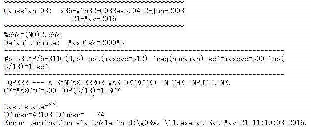
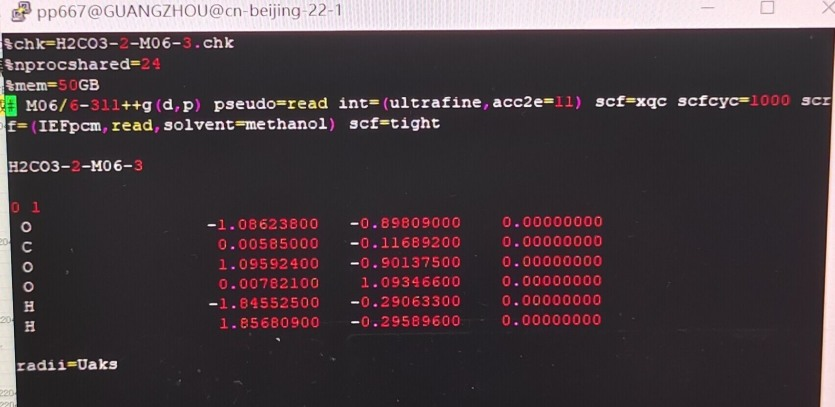

**常见的多余的和被滥用的Gaussian关键词**Common redundant and abused Gaussian keywords  

文/sobereva @[北京科音](http://www.keinsci.com)

First release: 2016-Jun-5  Last update: 2024-Sep-6

  
  
我平日网上给别人解答无数Gaussian问题，总看到大量初学者的Gaussian输入文件里的关键词写得特别污，令我不吐不快。往往越是菜鸟，多余乃至有害的关键词用得越凶，往往还导致自取其辱。这基本都是盲目听信网上一些伪高手（小白装大神）的后果，真正有益的经验技巧没学到，倒学了一身坏毛病（比如把maxcyc=几百、5/13=1之类当成每次必用关键词），并以讹传讹。  
  
再重申一遍Sobereva的剃刀原理：如无必要，勿增关键词（<http://bbs.keinsci.com/forum.php?mod=viewthread&tid=2743>）。达到同一个计算目的，用的关键词越少，通常体现经验越丰富。  
  
  

#### 1 scf=maxcyc=几百，或scfcyc=几百

《解决SCF不收敛问题的方法》（<http://sobereva.com/61>）文中专门批斗过，见红字部分，故不再多说。用这个的一看就是菜鸟。  
  

#### 2 freq=noraman

Gaussian仅对于HF做振动分析时才默认计算raman，别的理论方法默认根本不算raman活性，写了也白写，但却成了大量菜鸟每次必写的。非HF方法做freq时写这个关键词的人是什么心态？大抵如此：“我不需要算raman，所以我写了noraman，让程序做freq任务时不默认地算raman，从而节省了时间，我多机智！”  
  

#### 3 IOp(5/13=1)

饮鸩止渴、掩耳盗铃的逃避（而不是解决）SCF不收敛的方法，《解决SCF不收敛问题的方法》（<http://sobereva.com/61>）文中对此进行了残酷的批判。<http://bbs.keinsci.com/forum.php?mod=viewthread&tid=3344>帖子中，官方也明确表态使用5/13=1是愚蠢的。用IOp(5/13=1)基本可以与“我是超微小白！”划等号。  
  

#### 4 scrf里写CPCM或PCM或IEFPCM

Gaussian里scrf默认就用PCM，也等价于写IEFPCM，显然写PCM或IEFPCM纯属多余。有些人盲目效仿文献，明明默认的PCM原理更严格，非要专门写CPCM用CPCM，完全莫名其妙！PS：对于算能量（激发能不算）的场合，应尽量用SMD模型。关于这些问题，仔细看《谈谈隐式溶剂模型下溶解自由能和体系自由能的计算》（<http://sobereva.com/327>）。  
  

#### 5 不需要nosymm的时候写nosymm

很多菜鸟总乱用nosymm，老是写这个。什么时候该用nosymm，以及nosymm到底有什么用，看此文《谈谈Gaussian中的对称性与nosymm关键词的使用》（<http://sobereva.com/297>）。  
  

#### 6 scf=tight

从G09开始SCF收敛限默认就是tight，还老见有人写这个，毫无意义。  
  

#### 7 乱用int=fine、int=ultrafine、给非DFT设定格点

对DFT计算才牵扯到交换-相关泛函的积分格点，而HF、半经验、后HF等方法根本不牵扯到积分格点，却看到有些人对这些方法还设什么int=fine或ultrafine，纯属多余，毫无意义。  
G09对DFT默认就是int=fine，有很多G09用户还写这个，纯属多余。  
从G16开始默认是int=ultrafine，因此G16用户想用ultrafine时也没必要再写这个。  
注：只有明尼苏达系列泛函如M06HF、M06-2X等对于积分格点才比较敏感，因此碰见SCF或几何优化不收敛时用ultrafine格点才是值得优先考虑的。而对其它的泛函诸如B3LYP之类用fine格点就已经足够了，用ultrafine只会徒增耗时。  
  

#### 8 opt=maxcyc=几百、optcyc=几百

《量子化学计算中帮助几何优化收敛的常用方法》（<http://sobereva.com/164>）文中专门批斗过，见红字部分，故不再多说。用这个绝大多数都是菜鸟。  
  

#### 9 test

根本毫无意义，却看到不少人写个这个无用的关键词。  
  

#### 10 sp

sp代表做单点计算，默认就是干这个，却见到一些人还写sp，纯属多余。  
  

#### 11 方法名前写U、R

自旋多重度为1的时候默认就是R（限制性闭壳层），自旋多重度大于1的时候默认就是U（非限制性开壳层），平时根本没必要专门去写这个。仅当自旋极化单重态的计算的时候才有必要明确写一下U，见《谈谈片段组合波函数与自旋极化单重态》（<http://sobereva.com/82>）。有时看个别菜鸟居然计算闭壳层单重态体系也写个U，额外浪费不少时间，结果和默认的R完全一样。  
  

#### 12 激发态计算时写root=1，以及非限制性开壳层参考态时写singlet、triplet、50-50

CIS、TD等计算的时候默认就是root=1，所以感兴趣的是第一激发态的时候没必要写这个。  
  
做CIS、TD前需要先做SCF得到参考态波函数（通常得到的是基态波函数）。singlet、triplet、50-50关键词可以指定激发态算单重态、三重态或者都算，但很多初学者却不知道，这仅对于参考态波函数是闭壳层的时候才有意义！参考态是非限制性开壳层时，这仨关键词根本不起作用，此时程序会算出的激发态都不是自旋纯态，哪个态对应什么自旋多重度需要根据输出的<S**2>来确定。  
  

#### 13 freq=numer

这代表基于一阶解析导数做有限差分得到二阶导数来做频率计算。明明很多人用的方法有二阶解析导数（如MP2。而DFT连三阶解析导数都有），算频率却写个freq=numer，相比直接写freq不仅白浪费了几十乃至几百倍的耗时，精度还降低了。  
  

#### 14 scrf里写solvent=water

scrf默认就是水做溶剂，写这个纯属多余，老见到有人写。  
  

#### 15 用opt=calcall的时候还写freq

opt=calcall的时候最后一步的Hessian也是精确计算的，所以程序直接就自动做振动分析了。故此时再写freq是多余。  
  

#### 16 density关键词的乱用

有三种情况：  
(1)density含义是产生/导出/分析当前级别下的波函数，否则默认用SCF的。比如MP2 density会产生MP2波函数，否则默认用HF的；再比如B3LYP/TZVP TD(root=2) density会产生第二激发态的TDDFT波函数，否则默认用基态DFT波函数。很多人不懂density到底怎么用，居然做SCF类型计算（半经验/HF/DFT/MCSCF）也写density，纯属多余。  
(b)density写成density=current：density默认就是density=current，即使用当前级别的密度，所以没必要特意多写=current。  
(c)out=wfn/wfx时写density：从G09 C.01开始，对后HF计算用out=wfn或wfx的时候默认用了density关键词，所以density此时可以不写。但为了避免一些菜鸟用的是以前版本却又不知道写density，导致导出的波函数对应的是SCF波函数，所以给新人传道时还是写上density保险。  
  

#### 17 scrf=externaliteration

外迭代在隐式溶剂模型下做后HF或TD/CIS算激发态时候才用得着，详见此文《谈谈隐式溶剂模型下溶解自由能和体系自由能的计算》（<http://sobereva.com/327>），很多人都没搞懂externaliteration是什么意思就乱用，经常看到有人用SCF类型的理论方法时居然还写externaliteration。  
  

#### 18 polar=enonly（等价于polar=DoubleNumer）

是指计算超极化率的时候基于解析一阶导数做两阶有限差分得到三阶导数。常用的DFT明明在Gaussian里面有三阶解析导数，却看到一些人用DFT计算第一超极化率的时候竟然写polar=enonly，真是令人发指！比直接写polar白白糟蹋了大量计算资源，结果精度还更低了。更多信息参看《使用Multiwfn分析Gaussian的极化率、超极化率的输出》（<http://sobereva.com/231>）。  
  

#### 19 用gen pseudo=read

很老版本Gaussian中自定义基组+赝势要写gen pseudo=read，后来版本提供了更方便的关键词genecp。明明这一个关键词就完事了，可现在还总是见到有人用老式写法。  
  

#### 20 scf=conver=6（等价于scfcon=6）

在《解决SCF不收敛问题的方法》中说过，单点计算（指HF、普通泛函和半经验的情况。双杂化、后HF、TDDFT等除外）可以放心把SCF收敛限用这个从G09开始默认的8（即SCF=tight）降到6，有降低不收敛几率和降低耗时之用，因为6的时候能量收敛得已经足够准确了。但是很多人在几何优化、频率计算、超极化率计算等涉及能量导数计算的时候也用这个关键词，这就很糟糕了。能量的导数计算牵扯到波函数、波函数的导数，能量收敛得足够准确不代表波函数已经收敛得很准确，故涉及导数计算的时候用这个降低SCF收敛限可能导致极小点/过渡态定位精度不够、几何优化时震荡、频率计算不准等问题。虽说也不是几何优化时就一定不能用scf=conver=6，但用的场合应当是SCF实在不好收敛（如过渡金属团簇），而且对优化精度要求不高的时候。。  
  

#### 21 IOp(1/8=x)、IOp(6/7=3)

IOp(6/7=3)相当于pop=full、IOp(1/8=x)相当于在opt里定义maxstep，明明有对应的关键词，却还老看到有人在输入文件里直接写这俩IOp。有对应关键词的场合不要写IOp，否则自己容易记错，别人看这输入文件的时候还得查IOp表。  
顺带强调一下，优化极小点时用maxstep定义步长上限的时候一定要带着notrust，即opt(maxstep=x,notrust)，否则步长上限会随着优化进行自发发生变化而导致设定没起到作用。然而洒家经常看到有人用maxstep却不写notrust。而对于优化过渡态，本身默认就是用了notrust的，因此opt=TS任务还写notrust那是完全多余的。  
  

#### 22 scf=xqc或scf=qc

在《解决SCF不收敛问题的方法》中介绍过。很多人看到不收敛上来就用这个，甚至将之当成平日计算默认使用的关键词，这样做是很糟糕的！用qc（二次收敛）做迭代比一般方式迭代每步多花好几倍时间，虽然收敛的可能性高了不少，但是远不如先尝试其它解决不收敛的办法。而且，如果迫不得已只能用qc方式才能收敛，也极有可能最后得到的波函数并不稳定，此时也暗示很可能当前体系结构、方法、自旋多重度、基组等是不合适的。  
  

#### 23 int=Acc2E=12

这个目前用的人还不多，但是预感以后会有很多菜鸟总写这个，原因是Exploring Chemistry With Electronic Structure Methods第三版提供的输入文件里几乎每个都带着这个。写这个可以比默认时增加点双电子积分精度，官方的人号称这对用弥散函数时的收敛有帮助，但实际没什么用处（除非是中、大体系，用弥散函数奇多的基组如LPol系列），而且比较一下用弥散函数情况下默认和用了这个关键词最后收敛的能量，会发现并没有显著区别。  
注：从G16开始int=Acc2E=12已经成为默认了，因此更没必要手动写，此时反倒是写int=acc2e=10（G09默认的）可以在几乎不牺牲精度的情况下降低耗时。  
  

#### 24 NMR=GIAO

Gaussian支持GIAO、CSGT、IGAIM等方式计算磁性质，GIAO是默认的也是最好的，算NMR就写个NMR就完了，但有时候却看到别人写NMR=GIAO，多余，还有些人竟没有特殊理由却写NMR=CSGT。  

#### 25 guess=huckel

Gaussian默认的SCF初猜方式通常情况是最佳选择，除非碰见不收敛之类，否则根本没比必要自行去让程序用其它的初猜方式，却经常见到有人习惯性地写guess=huckel（用扩展huckel方法产生初猜）。其它初猜方式通常由于不如默认的，只会导致需要更多步才收敛，甚至难收敛、不收敛。

#### 26 gfinput、gfprint

这是用来输出基组详细定义的关键词，然而频繁在初学者的输入文件里看到。明明这些初学者连基组定义都读不懂，搞不明白什么是收缩度、收缩系数、GTF指数等概念，根本不可能去利用这些基组定义额外干什么，还用这些关键词打印出基组定义干嘛？完全毫无意义。

#### 27 把rwf无意义地分割

是不是会看到有人的输入文件里对rwf做无意义的分割，比如%rwf=1,199000mb,2,199000mb,3,199000mb,4,199000mb。这真是莫名其妙，没事分割rwf作甚？完全多此一举，毫无意义。分割rwf有意义的情况仅在于单一读写rwf文件的分区空间不足的情况，比如你要算一个大型后HF任务，假设rwf总共要产生估计300GB，若/sob/scr只剩200GB，不够写入完整的rwf，而幸好/sob/scr2还有300GB可以用，那么你可以写比如%rwf=/sob/scr/,180GB,/sob/scr2/,280GB，说明在/sob/scr/里写满180GB rwf文件后，接下来再写rwf文件时则往/sob/scr2/里面写。

#### 28 pop=full

这个关键词用来输出所有轨道的展开系数。很多人的输入文件里老带着这个，然而他们之后却根本不去自行考察轨道系数，那写这个何用？对于稍微大一点的体系，用了这个关键词之后都会导致输出文件巨大（原本也就几百K、几兆可能会变成几十兆、几百兆），此时输出文件里绝大部分全是轨道系数信息，这搞得打开文件、传输文件耗时都高了很多，想找个重要的数据都会被这一大堆系数信息碍事。这个关键词别加，如果你真是以后可能需要看一下轨道系数，把fch文件留下来就行了，用笔者开发的Multiwfn (<http://sobereva.com/multiwfn>)载入.fch文件后，进主功能6的选项4，直接就能把指定的轨道的所有系数信息全都输出出来，这比你通过文本编辑器在输出文件里找对应的轨道的某些系数方便得多得多。

**29 QST任务里写noeigen**

大家知道，在opt=TS任务中一般都需要写noeigen，在这里我专门说了：《简谈Gaussian里找过渡态的关键词opt=TS和QST2、3》（<http://sobereva.com/460>）。有的人居然对QST2、QST3任务也自作聪明地写noeigen，这是毫无意义的。因为QST方法在计算时根本就不会自动对每一步做Hessian矩阵本征值检测！

**30 SCF或TD里写direct**

direct这个选项对于不同关键词有不同含义。对于SCF来说，默认的算法就是direct，因此写SCF=direct根本毫无意义。对于TD计算，默认的算法也叫direct，这也是最理想的算法，故也毫无写的必要。

**31 scrf里乱写read**

scrf里写read代表从输入文件末尾读取自定义溶剂的信息，这在《谈谈隐式溶剂模型下溶解自由能和体系自由能的计算》（<http://sobereva.com/327>）里我也说了。我时不时看到有人在scrf里写了read，但输入文件末尾根本就没有任何自定义溶剂信息，此时写read显然毫无意义，完全莫名其妙。而且此时如果输入文件末尾还写了其它信息，还会导致Gaussian试图把其它信息当做自定义溶剂读取而导致报错。

最后，来看网上答疑时我看到的一个典型的被伪高手或网上/实验室祖传坑爹教学资料毒害的菜鸟制造的笑柄，以及一个典型的反面教材：

值得一提的是，目前社会上有很多水平又差，还倒处开培训骗钱的机构，从那里学不到有用的，反倒学一大堆错误的东西。比如某机构讲Gaussian的视频里，胡写一堆关键词，简直是把初学者都带沟里去了，见《某机构讲Gaussian的直播，不能直视》（<http://bbs.keinsci.com/thread-21551-1-1.html>）。

再次诚心告诫初学者，除了计算化学公社论坛、思想家公社QQ群、sobereva.com，切勿随意听信其它地方乱七八糟的关于Gaussian的讨论，否则极容易被误导！怎么真正正确地学习Gaussian，看《谈谈学量子化学如何正确地入门》（<http://sobereva.com/355>）。
