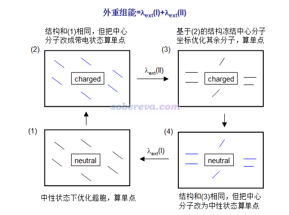
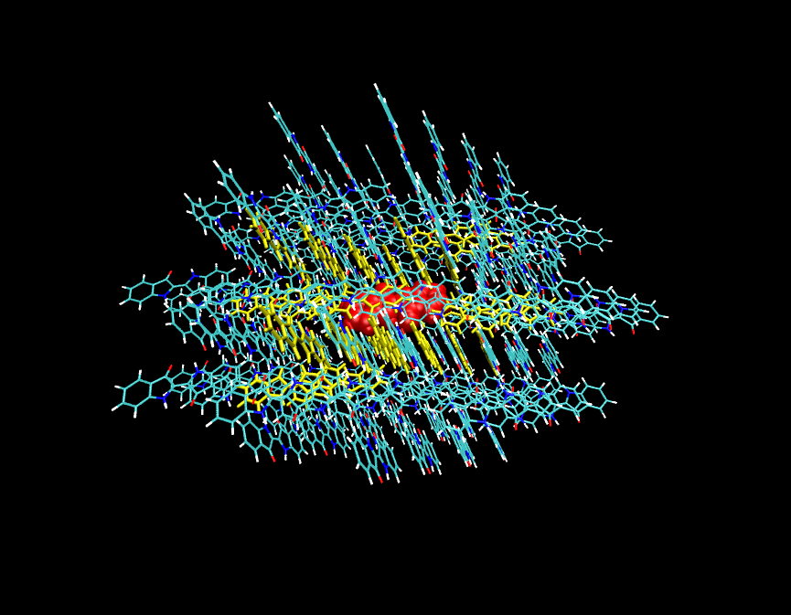
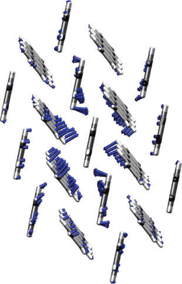
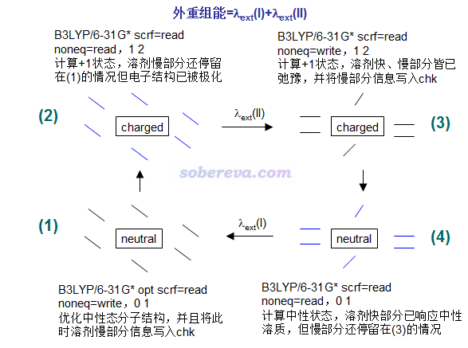

**乱谈外重组能的计算**On the calculation of external reorganization energy  
  
文/Sobereva @[北京科音](http://www.keinsci.com)  2016-Jun-8

  
  
重组能对Marcus理论计算电子转移速率很重要，内重组能是大家最关注的，计算方式在此文也谈了：《使用Dushin分解重组能和计算Huang-Rhys因子》（<http://sobereva.com/330>）。外重组能是分子得/失电子或电子态改变后引发环境分子几何结构弛豫造成的能量变化，其计算关注度低一些，讨论其计算方法的文章不多，此文就胡乱对外重组能的计算发表点个人观点。  
  
和溶液状态不同的是，晶体状态下，环境分子没法自由运动，所以晶体状态和溶液状态下计算外重组能的方式差异很大，因此本文分别来谈。  
  
  

## 1 晶体下外重组能的计算

### 1.1 基本流程

在分子晶体中发生一次电子/空穴转移，会令一个分子带电，同时一个分子回到中性状态。外重组能可以按下图这么算，在(1)和(2)->(3)的过程中共优化两次，共算四个单点。注意有的文章如JPCL,1,941对外重组能的定义是λext(I)和λext(II)的平均值。  
  

  
图中黑色粗框代表分子晶体的晶胞。图中蓝线代表环境分子的电子结构已被中心分子的电荷分布所极化，与此同时中心分子电子结构也被环境分子极化了，但环境分子结构还没来得及弛豫。  
  
这种方式计算的分子晶体的重组能一般在0.01eV的数量级，见JPCL,1,941和JACS,130,12377的例子（后者主要是讲极化能的计算，很靠后部分才牵扯到外重组能）。之所以很小是由于受到晶体环境的束缚，环境分子很不容易发生结构变化。  
  
上图看起来原理不复杂，但在实际计算时有很多具体问题：  
  

### 1.2 计算细节

#### 1.2.1 计算模型怎么构建

通常需要先找到分子晶体的cif文件，在此基础上来创建计算模型。没有实验晶体结构就只能通过晶体结构预测程序了。  
  
计算一般在PBC下进行。实际计算时绝对不能像上图中这样中心分子附近只有几个环境分子，而是要把素晶胞展成复晶胞，选择最接近中心处的分子令其电荷发生变化。复晶胞用得越大结果越准确，因为这样中心分子对附近环境分子的极化效果表现就越真实，同时边界效应越弱，即边界分子状态和bulk状态越相符。但是复晶胞取大了计算量也猛升，因此要根据分子大小、计算级别、计算姬的性能、程序的选用、对精度的要求等酌情而定。  
  
如果由于程序、方法的限制等原因在PBC下计算不方便，也可以用团簇模型当孤立体系计算，比如下图这样。即取一大团分子，在上图(2)->(3)过程中让中心分子（红色）冻结，让与它最近的一些分子（黄色）允许在优化中弛豫。而最外层的分子（细线表示），在(1)和(2)->(3)的优化中始终保持冻结，以此来表现bulk环境。  
  
  
关于复晶胞或团簇应该取的大小，可以参考下面的JPCL,1,941中的一个图片  

这是蒽分子晶体，让中心的蒽分子带电并保持结构固定，周围分子结构发生了弛豫，原子移动方向以箭头表示。图片为了让移动方向看起来明显把箭头画得比实际移动距离大得多。从图中可见第一配位层的结构弛豫程度远大于第二配位层的，也可以想见第三配位层的结构几乎完全不变。所以，最起码也应该让中心分子附近有两层，第一层无论是电子结构还是几何结构都可以充分弛豫，由此来充分表现环境分子对中心分子电荷改变的响应，而第二层就用来近似表现bulk边界。更理想的是中心分子附近有三层，此时中心分子电子态的改变产生的影响靠最里面两层已经很充分表现了，最外层分子和bulk情况已经几乎一致了。  

#### 1.2.2 用什么理论方法算

量子化学方法来算：  
量化方式来算外重组无疑精度是最理想的，但很难实现。如果用DFT，优化那么大复晶胞或者团簇太花时间。虽然半经验或者DFTB容易算得动（尤其是借助MOPAC的MOZYME），但还是有一个关键问题是没法让指定的电荷只局域在中心分子上而不离域到其它分子。DFT的话，靠CDFT方式虽原理上可以实现，见《谈谈约束性DFT (CDFT)》（<http://sobereva.com/271>），但是搞这么大体系太困难，而这种约束方式还没有程序能对于半经验来做。另一个可以考虑的做法是用GAMESS-US支持的片段有效势，把带指定电荷的中心分子由有效势来描述，但是可惜这没法表现环境分子对中心分子电荷的极化（除非再人为加个迭代步骤能让片段有效势与环境分子电荷分布自洽，但实现起来很耗时麻烦），而且计算量也同样巨大。  
  
分子力场来算：  
这是最可行的算外重组能的级别，不仅速度足够快，而且一大好处是便于描述定域的电荷。例如，可以将中心分子的电荷设置为它在带电状态下计算出的CHELPG拟合静电势电荷，而周围分子的电荷都设成在不带电状态下算出的原子电荷。分子力场也是多种多样，对于外重组能的计算要从三个方面考虑：  
(a)对成键项的描述：这关乎到能否优化出合理的结构。UFF之流精度比较烂，用MM2/3、MMFF94之类高精度有机分子力场最理想。不过，由于λext(I)和λext(II)的结构变化过程是相反的，即成键项的变化会抵消，因此外重组能计算精度对成键项的描述精度敏感性不很高。  
(b)对范德华作用的描述：不同力场半斤八两，不值得一说。  
(c)对静电作用的描述：这是对外重组能计算精度影响最为关键的。可极化力场平时用得远不如固定电荷力场普遍，但计算外重组能时应当尽量用可极化力场，无论是基于浮动电荷方式还是考虑原子极化率都可以。力场的可极化对外重组能的计算之所以这么重要，是因为给中心分子加上一个单位净电荷后，会强烈对周围分子电子结构产生极化效果，同时周围分子也会反过来极化中心分子，这个效应在量化计算时随着自洽迭代就自然而然体现了，而对于分子力学计算则必须通过可极化力场来表现。在JPCL,1,941中，是基于MM3力场加上可极化项，而点电荷用的是对静电作用描述较好的CHELPG。在JACS,130,12377中，则是用Gaussian基于B3LYP与UFF结合做电子嵌入的ONIOM(QM:MM)，以迭代方式让QM区域的MK拟合静电势电荷与MM区域的QEq电荷达到自洽（具体来说，是先让QM描述的中心分子的初始电荷设为单独计算时得到的CHELPG电荷，然后在Gaussian算QEq电荷时固定QM原子的电荷不变去确定MM原子的电荷以表现环境分子对中心分子电荷分布的响应，然后再将MM原子的QEq电荷作为背景电荷来算QM区域的密度分布，进而得到QM原子更新的CHELPG电荷，再反过来计算MM原子的QEq电荷，不断如此循环以达到QM的CHELPG电荷与MM的QEq电荷间完全自洽，某种意义上类似SCRF自洽反应场的过程。这是通过作者自己额外的代码实现的，Gaussian本身直接做不了这个QM区电荷与MM的QEq电荷的自洽迭代）。  
  
QM/MM来算：  
这个是个很好的算外重组能的做法，对QM与MM区域之间静电描述比直接用固定电荷的力场准确，如果把QM与可极化力场搞一起就更完美了。前面说的电子嵌入方式的ONIOM(QM:MM)结合电荷自洽过程描述可极化效果也算此类。不过洒家觉得靠QEq虽然可以等效令UFF表现极化效果，但它描述静电作用的准确度还是不很理想，QEq对静电势的描述能力在《原子电荷计算方法的对比》（<http://www.whxb.pku.edu.cn/CN/abstract/abstract27818.shtml>）中测试过。  

#### 1.2.3 用什么程序算

如果以量化方式来算，为了表现电荷定域在中心分子，CDFT的话只有NWChem和Q-Chem可选，如果用片段有效势只能用GAMESS-US。  
如果是以分子力学来算，MM3结合额外的可极化设定，或者用AMOEBA可极化力场，无论是当PBC还是团簇来算都可以用Tinker。买了Material studio的人可以用Forcite靠COMPASS来算，不过没有可极化效果。Gaussian直接用UFF可以按照团簇来算，并且把中心分子的原子电荷固定为拟合静电势电荷来确定其余原子的QEq电荷可以粗略表现可极化效果，但必须像JACS那篇文章一样通过额外方式做迭代才能更充分描述中心分子与环境分子间的相互极化。如果在Gaussian里用电子嵌入的方式做ONIOM(QM:MM)可以把MM原子与QM原子之间的静电相互作用描述得更准确。Amber自身就能做QM/MM，支持PM6等半经验和可极化力场，用来算外重组能估计不错。其它还有很多程序都可以用来前述方式算外重组能，这里就不一一说了。  
  

### 1.3 关于重组能的拆分

重组能的拆分这一点在大多文献中说得不够清楚、确切，这里专门说一下。  
  
对于晶体来说，总重组能的计算过程为：  
a 优化中性状态晶胞结构  
b 将中心分子设成带电状态，对a的结构做单点  
c 将中心分子设成带电状态，以a的结构为初始结构对晶胞做优化  
d 将中心分子还原成中性状态，对c的结构做单点  
然后总重组能=|d-a|+|b-c|。  
  
对上面的流程，如果我们优化时冻结环境分子，得到的就是内重组能；如果优化时冻结中心分子，即1.1节的过程，得到的就是外重组能。注意这样得到的内重组能和外重组能之和并不是总重组能！因为中心分子结构变化必会和环境分子的结构变化产生耦合，因此正确的拆分是：总重组能=内重组能+外重组能+耦合项。  
  
然而，文献里看到的都是这么拆分的：总重组能=内重组能+外重组能。显然这种划分方式并不确切，除非在计算的时候，把耦合项给纳入到了内重组能或外重组能当中。比如纳入到外重组能的话，那么就需要计算总重组能和内重组能，然后求差值来得到外重组能，而不是直接按1.1节的方式来计算外重组能。  
  
很多文章虽然研究的是晶体内的电子/空穴转移，但是算的却是分子在孤立状态的重组能。前面提到的《使用Dushin分解重组能和计算Huang-Rhys因子》也是算的吡咯在孤立状态的重组能。JACS,130,12377中指出气相算的分子孤立状态的重组能可以作为分子晶体环境下内重组能的较好近似。所以，如果研究分子晶体中电荷转移速率问题时嫌按照上文计算太麻烦，干脆就只计算分子在孤立状态的重组能，这在步骤上容易多了，耗时也低多了。  
  
  

## 2 溶液下外重组能的计算

  
溶液下算外重组能可以用显式溶剂模型也可以用隐式溶剂模型。  
  
用显式溶剂模型的话，计算外重组能的步骤、方法选用等方面和上面说的完全一样，只不过不太适合用PBC来算，而更适合按照团簇来算。计算时必须考虑各种溶剂层排布方式，这是非常麻烦的事情，为此通常得做动力学模拟来得到一批溶质+溶剂微结构，都分别计算外重组能之后再取平均。  
  
用隐式溶剂模型来算外重组能就很方便也很快捷了，这牵扯到非平衡溶剂效应。溶剂的快部分对应于溶剂的电子结构改变，慢部分对应于溶剂的结构和朝向的改变。只让溶剂的快部分响应溶质的话，相当于溶剂-溶质之间电子结构已经相互极化到自洽，但溶剂几何结构还没弛豫。而快部分和慢部分都响应溶质的话，就相当于溶剂的电子结构和几何结构都充分弛豫了。这两种情况的能量差正是外重组能。关于非平衡溶剂效应以及使用方式的介绍，参见《Gaussian中用TDDFT计算激发态和吸收、荧光、磷光光谱的方法》（<http://sobereva.com/314>）。一般靠隐式溶剂模型表现非平衡溶剂都是用于电子垂直跃迁过程的研究，但计算外重组能其实也正好用得着。  
  
隐式溶剂模型下计算外重组能流程如下  

  
图中给出了对应的Gaussian09的关键词，noneq=xxx是写在坐标末尾后空一行处。0 1、1 2是电荷与自旋多重度设定，假定计算的是溶质在中性和带+1电荷之间变化的外重组能。图中虽然画了溶剂分子，但那只是示意，在隐式溶剂模型下溶剂分子是当做没有具体结构的连续介质考虑的。  
  
按照上面的计算流程，这里举一个萘分子在水中的外重组能的实例，相关文件见<http://sobereva.com/attach/333/file.rar>。下面是每一步的能量  
(1)-385.8964554  
(2)-385.6405968  
(3)-385.6810581  
(4)-385.8560789  
λext(I)=27.2114*(-385.8560789+385.8964554)=1.10eV  
λext(II)=27.2114*(-385.6405968+385.6810581)=1.10eV  
故外重组能为λext(I)+λext(II)=2.20eV。  
  
在氯仿下计算的结果  
(1)-385.895197  
(2)-385.6473217  
(3)-385.6668006  
(4)-385.8762549  
λext(I)=0.53eV  
λext(II)=0.52eV  
故外重组能为1.05eV。趋势是溶剂的介电常数越小外重组能也就越小。
