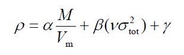
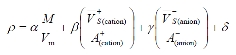
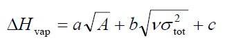
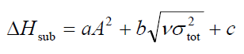
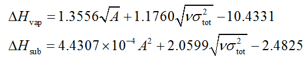
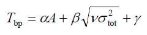
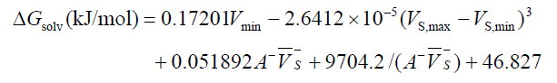

**使用Multiwfn预测晶体密度、蒸发焓、沸点、溶解自由能等性质**Using Multiwfn to predict crystal density, heat of vaporization, boiling point and solvation free energy  
  
文/Sobereva @[北京科音](http://www.keinsci.com/)

First release: 2016-Jun-21  Last update: 2020-Jan-7

  
 利用分子表面积、体积，连同基于分子表面上静电势分布定义的各种指标（统称为GIPF描述符），如静电势极大、极小点数值、静电势的方差和平均值等等，可以用来预测分子凝聚相的各种性质，不少文献给出了专门的预测公式。本文就专门说说怎么使用Multiwfn程序预测这些性质。很多文章理论研究自行设计的新分子时都是利用Multiwfn来进行这种预测。本文说的分子表面都是指电子密度=0.001 a.u.的等值面，分子范德华体积指的是其中包含体积。  
  
阅读后文之前一定要先阅读《使用Multiwfn的定量分子表面分析功能预测反应位点、分析分子间相互作用》（<http://sobereva.com/159>）以及Multiwfn手册3.15.1节了解一些基本知识。Multiwfn可在<http://sobereva.com/multiwfn>免费下载。不了解Multiwfn的话建议看看《Multiwfn入门tips》（<http://sobereva.com/167>）和《Multiwfn波函数分析程序的意义、功能与用途》（<http://sobereva.com/184>）。  
  
   

## 1 分子晶体密度预测

讨论分子晶体密度预测方法的文章很多，本文用的方法和这四篇相关，有兴趣可以看看：  
(a)Rice et al., J. Phys. Chem. A, 111, 10874 (2007)：这篇提出了可以把分子范德华体积换算成密度量纲来预测晶体密度。共测试了289个体系，包含180个普通中性分子、38个高氮分子、71个离子晶体，发现对于只含CHNO的中性体系预测得挺准。不过对于含其它元素的，以及离子晶体误差大一些。  
(b)Politzer et al., Mol. Phys., 107, 2095 (2009)：这篇提出了对(a)文中方法的改进，预测公式引入了范德华体积以外的描述符。对一批只含CHNO的中性分子，用文中的(7)式预测的晶体密度的平均绝对误差为0.036 g/cm^3，比只依赖于分子范德华体积进行预测误差小了30%。  
(c)Politzer et al., Mol. Phys., 108, 1391 (2010)：这篇提出专门适合预测有机离子晶体密度的公式，这对于研究炸药之类很有用。  
(d)Rice et al., J. Comp. Chem., 34, 2146 (2013)：这篇用了较大的测试集测试Politzer在上两篇文章里提出的密度预测公式，测试结果证实将分子表面静电势相关的描述符引入预测公式确实对提高精度有帮助。  

下面我们就结合具体例子介绍下利用Multiwfn预测晶体密度的操作。

### 1.1 中性体系

上面的文章(b)里推荐的预测中性体系密度的公式为  

M是分子质量，Vm是分子范德华体积，括号里面那项是分子表面总静电势的方差σ2tot乘上电荷平衡度ν。在B3PW91/6-31G**级别优化体系和做波函数分析下，密度以g/cm^3为单位、νσ2tot以(kcal/mol)^2为单位时，向实验数据拟合出的参数为α=0.9183, β=0.0028, γ=0.0443。之所以是在B3PW91这个泛函下拟合的（而不是最常用的如B3LYP），纯属作者Politzer一直以来的癖好，并无特殊好处。  
  
我们用著名的炸药RDX（浑名黑索金）作为中性体系的例子。PS：《重装武器》里的手斧貌似就是RDX。其实验晶体密度有的说是1.806有的说是1.82g/cm^3。其结构式为：  

  
我们使用和Politzer用的相同的级别B3PW91/6-31G**用Gaussian对这个体系进行优化，然后将所得chk文件转换为fch文件。启动Multiwfn，输入此fch文件路径，之后输入12进入定量分子表面分析功能，再输入0用默认设定进行计算。默认情况下分子表面用的就是电子密度=0.001 a.u.的等值面，和前面几篇文章一致。算完后得到如下结果：  
Volume:  1379.32761 Bohr^3  ( 204.39531 Angstrom^3)  
 Estimated density according to mass and volume:    1.8045 g/cm^3  
 Minimal value:    -20.75385 kcal/mol   Maximal value:     45.96479 kcal/mol  
 Overall surface area:         729.58496 Bohr^2  ( 204.30463 Angstrom^2)  
 Positive surface area:        398.13142 Bohr^2  ( 111.48817 Angstrom^2)  
 Negative surface area:        331.45354 Bohr^2  (  92.81646 Angstrom^2)  
 Overall average value:    0.00982246 a.u. (      6.16369 kcal/mol)  
 Positive average value:   0.03289853 a.u. (     20.64416 kcal/mol)  
 Negative average value:  -0.01789579 a.u. (    -11.22978 kcal/mol)  
 Overall variance (sigma^2_tot):  0.00049125 a.u.^2 (   193.43735 (kcal/mol)^2)  
 Positive variance:        0.00041232 a.u.^2 (    162.35692 (kcal/mol)^2)  
 Negative variance:        0.00007893 a.u.^2 (     31.08042 (kcal/mol)^2)  
 Balance of charges (nu):   0.13485811  
 Product of sigma^2_tot and nu:   0.00006625 a.u.^2 (   26.08659 (kcal/mol)^2)  
 Internal charge separation (Pi):   0.02598527 a.u. (     16.30602 kcal/mol)  
  
第一行告诉你电子密度0.001a.u.等值面内部的体积，即范德华体积是204.39531 Angstrom^3，下一行告诉你把这个数据直接按照M/Vm等效地换算为密度结果是1.8045 g/cm^3。虽然计算方式如此简单，但是结果和实验值符合得极好！具体换算过程是：1埃=1E-8cm，每个RDX分子所占体积是(1E-8)^3*204.39531 cm^3，每个RDX分子质量为222.11634/6.02214179E23 g，因此密度为222.11634/6.02214179E23/(1E-24*204.39531)=1.8045 g/cm^3。  
  
Multiwfn输出的Product of sigma^2_tot and nu就是上面说的νσ2tot。我们按照前面图中的公式，把分子表面上静电势的影响也考虑进去再进行计算，密度为  
0.9183*1.8045 + 0.0028*26.08659 + 0.0443 = 1.77 g/cm^3  
结果相对于实验值的差异反倒比直接用M/Vm来计算大了点。但光从这一个例子不能说考虑了静电势的影响后结果会变差，根据文章测试从统计来看还是有改进的，只不过正如Politzer文章里说的，对于M/V结果恰好挺准的时候，考虑静电势的校正项反倒会令结果略微恶化。  
  

### 1.2 离子体系

对于离子晶体，直接按照M/Vm方式预测密度会有较大误差，在前述文章(c)中作者提出按照这种方式来预测：  

β后面括号中的分子代表阳离子的分子表面静电势为正的区域的平均静电势，分母为这些区域的面积；γ后面括号中的分子代表阴离子的分子表面静电势为负的区域的平均静电势，分母为这些区域的面积。在B3PW91/6-31G**下，当静电势以kcal/mol为单位，面积以埃^2为单位，密度以g/cm^3为单位，向实验数据拟合的参数为α=1.0260, β=0.0514, γ=0.0419, δ=0.0227。根据文中的测试，按照这个公式预测密度平均绝对误差仅为0.033g/cm^3。  
  
下面我们就用1:1型离子晶体叠氮化铵（阳离子NH4+，阴离子N3-）示例一下，其实验密度为1.346g/cm^3。用B3PW91/6-31G**分别对NH4+和N3-优化，得到fch文件，载入Multiwfn后也是先输入12再输入0。NH4+的结果为  
Volume:   202.60123 Bohr^3  (  30.02241 Angstrom^3)  
 Estimated density according to mass and volume:    0.9977 g/cm^3  
 Minimal value:    164.83607 kcal/mol   Maximal value:    180.62353 kcal/mol  
 Overall surface area:         169.42489 Bohr^2  (  47.44381 Angstrom^2)  
 Positive surface area:        169.42489 Bohr^2  (  47.44381 Angstrom^2)  
 Negative surface area:          0.00000 Bohr^2  (   0.00000 Angstrom^2)  
 Overall average value:    0.27371398 a.u. (    171.75826 kcal/mol)  
 Positive average value:   0.27371398 a.u. (    171.75826 kcal/mol)  
 Negative average value:          NaN a.u. (          NaN kcal/mol)  
 Overall variance (sigma^2_tot):  0.00004471 a.u.^2 (    17.60463 (kcal/mol)^2)  
 Positive variance:        0.00004471 a.u.^2 (     17.60463 (kcal/mol)^2)  
 Negative variance:        0.00000000 a.u.^2 (      0.00000 (kcal/mol)^2)  
 Balance of charges (nu):   0.00000000  
 Product of sigma^2_tot and nu:   0.00000000 a.u.^2 (    0.00000 (kcal/mol)^2)  
 Internal charge separation (Pi):   0.00567588 a.u. (      3.56167 kcal/mol)  
这里Positive surface area就是前面提到的分子表面上静电势为正值区域的面积，Positive average value就是这个区域的静电势平均值。  
  
N3-的结果为  
Volume:   365.13961 Bohr^3  (  54.10812 Angstrom^3)  
 Estimated density according to mass and volume:    1.2896 g/cm^3  
 Minimal value:   -139.23748 kcal/mol   Maximal value:   -131.34857 kcal/mol  
 Overall surface area:         259.87905 Bohr^2  (  72.77356 Angstrom^2)  
 Positive surface area:          0.00000 Bohr^2  (   0.00000 Angstrom^2)  
 Negative surface area:        259.87905 Bohr^2  (  72.77356 Angstrom^2)  
 Overall average value:   -0.21750181 a.u. (   -136.48456 kcal/mol)  
 Positive average value:          NaN a.u. (          NaN kcal/mol)  
 Negative average value:  -0.21750181 a.u. (   -136.48456 kcal/mol)  
 Overall variance (sigma^2_tot):  0.00001397 a.u.^2 (     5.49999 (kcal/mol)^2)  
 Positive variance:        0.00000000 a.u.^2 (      0.00000 (kcal/mol)^2)  
 Negative variance:        0.00001397 a.u.^2 (      5.49999 (kcal/mol)^2)  
 Balance of charges (nu):   0.00000000  
 Product of sigma^2_tot and nu:   0.00000000 a.u.^2 (    0.00000 (kcal/mol)^2)  
 Internal charge separation (Pi):   0.00311483 a.u. (      1.95459 kcal/mol)  
这里Negative surface area就是前面提到的分子表面上静电势为负值区域的面积，Negative average value就是这个区域的静电势平均值。  
  
总体积是阴、阳离子体积的加和，即30.02241+54.10812=84.13053埃^3。总相对原子质量是18.03846+42.02010=60.05856，只按照M/Vm来估算的话密度就是60.05856/6.02214179E23/(1E-24*84.13053)=1.185g/cm^3，和实验值偏差较大。  
  
若代入到前面考虑阴阳离子表面静电势的式子，结果为  
1.0260*1.185 + 0.0514*(171.75826/47.44381) + 0.0419*(-136.48456/72.77356) + 0.0227 = 1.346 g/cm^3。绝了！这结果和实验值惊人地吻合！当然这次纯属是撞大运，对于其它体系还是会有一点误差的，不过至少例证了这种预测方法是颇准的。

顺带一提，在《详谈Multiwfn的命令行方式运行和批量运行的方法》（<http://sobereva.com/612>）中详细介绍了如何将上面的数据提取过程和预测公式的计算包装成脚本，从而对某个分子的波函数文件可以实现一键密度预测，建议看看。  
 

## 2 蒸发焓、升华焓预测

在J. Phys. Chem. A, 110, 1005 (2006)，作者给出了预测含CHNO的分子的蒸发焓和升华焓的公式。蒸发焓公式为：  

其中A是分子表面积。在B3LYP/6-31G**级别下优化分子结构，B3LYP/6-311++G(2df,2p)下计算做波函数分析，面积以埃^2为单位，蒸发焓以kcal/mol为单位，νσ2tot以(kcal/mol)^2为单位时，拟合出来的参数a = 2.130，b = 0.930，c = -17.844。根据文中测试RMS误差为3.1 kcal/mol。  
  
升华焓公式为：  

其中a = 0.000267，b = 1.650087，c = 2.966078。根据文中测试RMS误差为2.1 kcal/mol。  
  
这里我们还用RDX为例子。这次我们在Gaussian里直接用# B3LYP/6-311++G(2df,2p)//B3LYP/6-31G**作为关键词进行计算，将结果转化成fch文件，还是按上一节做分子表面静电势分析。由于本次fch文件里的基组比上一节的6-31G**大了许多许多，所以Multiwfn计算静电势的耗时会颇长，一般Intel 4核得约20分钟。如果嫌慢就按照一开始说的方法通过设置cubegenpath参数来让Multiwfn自动借用cubegen来计算静电势就行了，耗时会少一个数量级以上。Multiwfn给出的结果如下：  
Volume:  1440.01752 Bohr^3  ( 213.38863 Angstrom^3)  
 Estimated density according to mass and volume:    1.7285 g/cm^3  
 Minimal value:    -19.99318 kcal/mol   Maximal value:     50.00839 kcal/mol  
 Overall surface area:         749.90235 Bohr^2  ( 209.99408 Angstrom^2)  
 Positive surface area:        416.24686 Bohr^2  ( 116.56101 Angstrom^2)  
 Negative surface area:        333.65549 Bohr^2  (  93.43307 Angstrom^2)  
 Overall average value:    0.01158552 a.u. (      7.27003 kcal/mol)  
 Positive average value:   0.03455435 a.u. (     21.68320 kcal/mol)  
 Negative average value:  -0.01706890 a.u. (    -10.71091 kcal/mol)  
 Overall variance (sigma^2_tot):  0.00051831 a.u.^2 (   204.09253 (kcal/mol)^2)  
 Positive variance:        0.00044197 a.u.^2 (    174.03591 (kcal/mol)^2)  
 Negative variance:        0.00007633 a.u.^2 (     30.05662 (kcal/mol)^2)  
 Balance of charges (nu):   0.12558124  
 Product of sigma^2_tot and nu:   0.00006509 a.u.^2 (   25.63019 (kcal/mol)^2)  
 Internal charge separation (Pi):   0.02653619 a.u. (     16.65172 kcal/mol)  
  
这里看到，根据M/Vm估出来的密度是1.7285 g/cm^3，明显不如上一节B3PW91/6-31G**估出来的接近实验值，所以绝非用大基组结果就好，因为其中有误差抵消的巧合在内。  
  
代入到蒸发焓的公式，结果为2.130*sqrt(209.99408)+0.930*sqrt(25.63019)-17.844=17.73 kcal/mol。  
  
代入到升华焓的公式，结果为0.000267*209.99408^2+1.650087*sqrt(25.63019)+2.966078=23.09 kcal/mol。此值和实验值26.8 kcal/mol比较接近，说明预测准确度还成。  
  
在Int. J. Quantum Chem., 105, 341 (2005)中Politzer等人通过向NIST查到的30个实验蒸发焓和66个实验升华焓拟合了标况下的蒸发焓和升华焓的预测公式，平均误差分别为2.0 kcal/mol和2.8 kcal/mol。相对于前述JPCA那篇的公式关键好处在于适用的元素更广，可用于含有C、H、O、N、F、Cl、S体系的。公式如下，每一项的单位和上述相同

大家感兴趣的话可以用Politzer的式子也预测一下RDX的升华焓和蒸发焓。注意他们在拟合参数的时候是在B3PW91/6-31G**进行的，所以大家还得在这个级别下再做一次表面静电势分析。

## 3 沸点和临界性质

在J. Phys. Chem., 97, 9369 (1993)中作者给出了预测有机分子沸点和临界温度/体积/压力的公式。预测沸点的公式如下：  

其中α=2.736, β=33.31, γ=-72.05，是在HF/STO-5G*//HF/STO-3G*级别下拟合的，其它方面同上。  
  
我们用上面的式子对苯的沸点进行预测  
Overall surface area:         420.87971 Bohr^2  ( 117.85834 Angstrom^2)  
 Product of sigma^2_tot and nu:   0.00001021 a.u.^2 (    4.01847 (kcal/mol)^2)  
代入公式，得2.736*117.85834 + 33.31*sqrt(4.01847) -72.05 = 317.18K。其实验沸点为353.3K，偏离实验有点大。可能原因一方面是那个预测公式可靠度本身就有限，而且当年计算条件落后，它们拟合参数用的级别太烂；另一个可能原因是他们用的STO-3G*、STO-5G*直接在Gaussian09里面用时并不是对应的他们当时实际用的基组（这俩基组带星号具体代表什么，文中并未说明，不知是什么鬼，实际上在G09中对STO-nG带星号和不带是完全一样的）。  
  
再来算个乙酸的  
Overall surface area:         308.13678 Bohr^2  (  86.28710 Angstrom^2)  
 Product of sigma^2_tot and nu:   0.00013329 a.u.^2 (   52.48615 (kcal/mol)^2)  
结果为2.736*86.28710 + 33.31*sqrt(52.48615) -72.05 = 405.35K，和实验沸点391.1K比较接近。  
  
  

## 4 溶解自由能

溶解自由能通过隐式溶剂模型很容易计算，见《谈谈隐式溶剂模型下溶解自由能和体系自由能的计算》（<http://sobereva.com/327>）。而在J. Phys. Chem. A, 103, 1853 (1999)中作者提出了对有机分子预测水中的溶解自由能（水合自由能）的公式：  

静电势单位都是kcal/mol。其中的参数是对于B3P86/6-31+G**级别优化和波函数分析的情况向实验来拟合的。式中Vmin是指整个三维空间中静电势最小的数值，Vs,max和Vs,min分别是分子表面上静电势最大和最小点数值。A-是分子表面静电势为负值区域的表面积，Vs-上面带一个横杠是指静分子表面静电势为负值区域的静电势平均值。  
  
这里用苯酚作为例子预测其水合自由能。对它在B3P86/6-31+G**下优化和做定量分子表面分析，结果如下  
 The number of surface minima:     3  
    #       a.u.         eV      kcal/mol           X/Y/Z coordinate(Angstrom)  
      1 -0.02708400   -0.736993  -16.995483       0.144864  -1.152264   1.957787  
      2 -0.02708765   -0.737093  -16.997774       0.177172  -1.141436  -1.956363  
 *    3 -0.04117381   -1.120396  -25.836976       1.510535   3.362206   0.028759  
  
  The number of surface maxima:     5  
    #       a.u.         eV      kcal/mol           X/Y/Z coordinate(Angstrom)  
      1  0.02554682    0.695164   16.030883      -3.342025  -2.278454   0.048218  
 *    2  0.08663577    2.357479   54.364812      -1.946071   3.097000   0.021567  
      3  0.02200159    0.598694   13.806218       0.069391  -4.282483   0.042709  
      4  0.02253021    0.613078   14.137932       3.338105  -2.322365   0.021761  
      5  0.01865089    0.507517   11.703623       3.449724   1.099448  -0.000188  
这里可知Vs,max和Vs,min分别是54.364812和-25.836976 kcal/mol。  
  
预测公式涉及的分子表面上的静电势相关的量为  
Minimal value:    -25.83698 kcal/mol   Maximal value:     54.36481 kcal/mol  
 Negative surface area:        242.41979 Bohr^2  (  67.88446 Angstrom^2)  
 Negative average value:  -0.01748812 a.u. (    -10.97397 kcal/mol)  
  
为了获取Vmin，我们要计算涵盖整个分子三维空间的静电势格点数据，找到其中最小点数值。启动Multiwfn并载入输入文件后，进入主功能5，选择静电势，再选择Medium quality grid。算完后，屏幕上会看到极小点数值和位置  
The minimum is -0.59120100E-01 at   1.82413   5.61762  -1.15668 Bohr  
这个静电势值-0.05912 a.u.转换下单位就是-0.05912*627.51=-37.098 kcal/mol。

将上面的量代入到预测公式里，得到的水合自由能为0.17201*(-37.098) - 2.6412E-5*(54.364812+25.836976)^3 + 0.051892*67.88446*(-10.97397) + 9704.2/(67.88446*(-10.97397)) + 46.827 = -24.86kJ/mol。这个值和实验值-27.67 kJ/mol有不到3 kJ/mol的偏差，精度还算可以。而文献中这个体系按照预测公式算出来是-26.45 kJ/mol，和实验值只差一点几kJ/mol。之所以这里计算结果和文献里不同，一方面是Gaussian程序版本不一样，另一方面是Multiwfn和他们当年用的程序在分析分子表面时用的算法、数值设定有差异（Multiwfn的绝对更准），还有一方面是获得Vmin的方式不同，这对结果影响不小。他们拟合的参数确切来说只是对他们当年用的具体计算方式才是最合适的。  
 

## 5 其它

分子体积、表面积连同分子表面静电势定义的描述符还能用来预测许多其它性质，例如  
一级/二级/三级/四级胺的pKb：J. Chem. Inf. Model. (2020) DOI: 10.1021/acs.jcim.9b01173  
C60在不同溶剂中的可溶性：J. Phys. Chem., 99, 12081 (1995)  
有机分子融化热、表面张力、液体/晶体密度：Chem. Phys., 204, 289 (1996)  
有机分子在明胶中的扩散系数：J. Phys. Chem., 100, 5538 (1996)  
不同阴离子与NH4+、Na+、K+形成的晶体的晶格能：J. Phys. Chem. A, 102, 1018 (1998)  
  
还有其它乱七八糟的性质如粘性等也可以这么预测。在J. Mol. Struct. (Theochem), 425, 107 (1998)等文献中还能查到很多关系式，这里就不再举例了，总之牵扯到的和分子表面有关的量都包含在Multiwfn的输出信息里了，代入公式就能算了。
