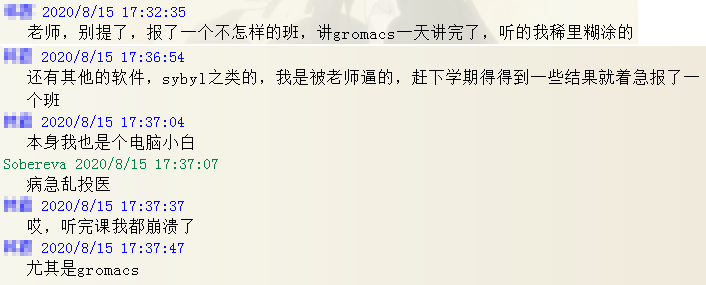
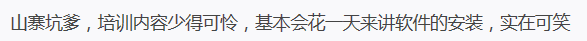
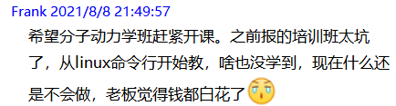
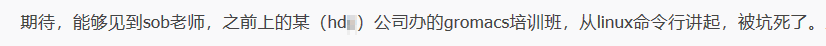
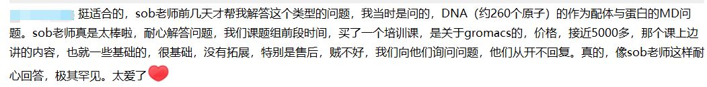
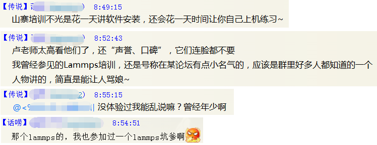
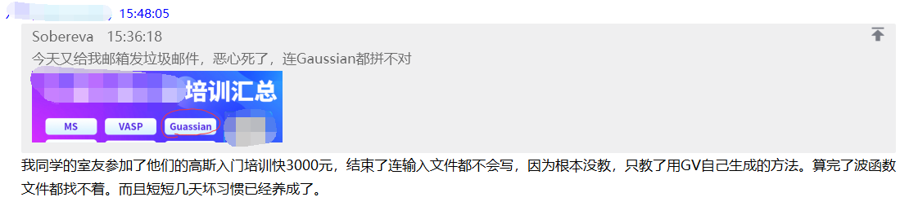
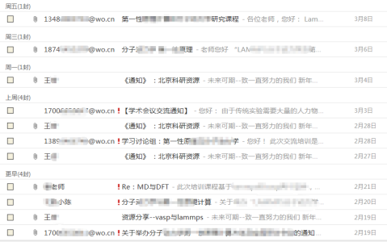
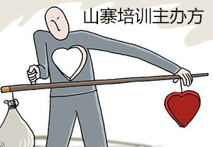

**辨别山寨坑钱科研培训的关键九点**  
Nine key points to identify poor and deceitful scientific research training

文/Sobereva(3)

First release: 2016-Jun-26  Last update: 2023-Jul-19

## 0 前言

现在很多利益熏心的人看中了科研群体，网络上的山寨坑钱的科研培训、会议的通知越来越多，很多人都向我反映了这一点，有很多警惕性不高但又想学知识的人都上了当，白花了宝贵的时间和金钱。本人历来嫉恶如仇，对于坑害科研工作者的行为更是零容忍，此文就专门说说怎么辨别山寨科研培训。我说得出来的正规的计算化学类的培训有：北京科音办的培训、知名大学自己办的培训（比如南大暑期学校。有些机构仅仅是在大学里租个场地绝对不算此类）、刘述斌教授在湖南师大开的培训、一些国际知名程序开发者在高校办的讲习班、中科院超算中心之类政府机构开的培训。除此以外的任何培训，参加前都一定要按照本文的方法判断是不是骗钱的培训。

可能有些人对本文内容还不以为然，觉得培训差能差到哪里去？笔者十几年来在互联网上常年解答巨量计算化学问题，频繁和大量计算化学工作者接触，自己也亲自长期讲授计算化学培训，很多去过山寨坑钱的培训的人向我表示，有的这种培训就是找水平很业余的在校学生随便讲讲（水平甚至还没有一些学员自己高），参加之后有想骂人的冲动；有的培训虽然找来的还是业内小有名气的老师，但参加后感觉其水平真是不敢恭维（笔者不知道是其水平就是很烂还是根本对培训这种事就不上心）；有的培训本来就没什么实质内容，几天的培训幻灯片总共才一百多页，还是粗制滥造的，甚至居然讲Linux最基础使用还讲半天（这还号称是“高级班”！）；还有的培训只是给学员播放一下录像，大多数时间都是让学员自己练习，连请人讲课甚至都省了！他们总体感觉就是，去之前和去之后基本没有什么区别。时间也浪费了，钱也浪费了。还有更糟的情况，有的人在群里表示过"关键参加完垃圾培训班，心里会留下阴影，会影响今后自信心"。例如下面就是有个人病急乱投医参加了一个山寨培训后跟我诉苦

两个上过不同山寨培训的当的人的参后感

被山寨GROMACS培训坑了多达近5000元的人在群里的发言（PS：我天天在网上不留余力地免费义务答疑，那些山寨培训收了钱都完全不回答学员问题，真是天壤之别！）：

某天大家在群里谈起被山寨培训坑的一段对话

某天群里有人提到室友被低水平培训毒害的后果

笔者之前看过一个视频，讲一个曾经在民办学校的老师的自我独白，那老师说：“我负责的事，就是把学生忽悠来，让他们交钱，再把学生打发走”。他们的目的根本就不是让学生学到有用的知识，也根本从来没考虑过口碑。所以，参加者一定要关注培训质量，别看见什么培训就都想去参加。我很负责地说，如今市面上的培训大多数都是骗钱的，纯粹以盈利为目的。对他们来说，学员参加后不找有关部门投诉就已经算万事大吉了。大家特别需要认清一点，也就是计算化学绝对不是在哪里学都可以。山寨骗钱培训和高水准的计算化学培训之间可不是70分和90分的差距，而是10分和90分的差距，真是有天壤之别。参加山寨培训不是少学点、钱花得不值的事，而是基本什么也没学到，还受一肚子气。

甚至有些名义上还算正规的公司，培训办得也是糟糕透顶。比如某机构请的某知名计算程序开发者之一讲的培训的一些人的参后感：<http://bbs.keinsci.com/thread-20785-1-1.html>，我真想不到培训居然能办成得如此糟糕，让参加过的人这么后悔。还有一个通过大肆发广告而有一点知名度的机构，某天有人在群里发了个这个机构的在线直播讲Gaussian的视频的一个截图，都看得我吐血了，一大堆低级错误，简直就是专门给别人讲怎么错误地使用Gaussian，见此帖：<http://bbs.keinsci.com/thread-21551-1-1.html>，干嘛要花钱去学错误的东西？

下面就详细谈谈怎样辨别社会上的山寨骗钱坑爹培训、这类培训都有什么特征。不满足的项目越多，说明是山寨、坑钱、坑爹的可能性越高。

PS：有的山寨骗钱机构的人被本文戳中痛点、揭露无耻行为后，居然还有他们的人跑到笔者管理的QQ群里说什么清者自清，说笔者是丑化他们的形象。甚至有这种机构在他们建立的低端QQ群里散布谣言来损害笔者形象。请大家仔细阅读本文，对照他们的行为，理性明辨他们的丑陋无耻是真实的还只是我主观或者别有用心地说的。

  

## 1 培训的通知方式光明正大、合乎最基本的道德底限

为了增加培训的影响力，主办单位怎么可能不做个正规的培训通知网页？培训网页不贴出来，明摆着培训有问题，甚至有些东西是虚假、见不得人的，都根本不敢在明面上公之于众！有的山寨公司不放出培训通知的理由居然是“害怕被其它公司抄袭”，谁会抄他们的低劣培训通知，真是搞笑。  
  
水准低劣的山寨培训公司，哪有自己的正规的宣传渠道？脑子里只想着坑钱，就是做一锤子买卖，哪会顾及自己的形象？这些公司全都是很不要脸、不知廉耻地偷鸡摸狗暗中疯狂宣传。**最典型的行为就是假装科研工作者，频繁地偷偷摸摸混进各种和科研学术相关的****QQ群****里疯狂发小广告，三天两头地发，说哪哪哪要办某某某培训，要参加培训的私聊或者打电话、加QQ、扫二维码、看上传的附件、看某个古怪网址，这种100%就是山寨培训！还有大量办坑钱培训的公司，把培训的通知肆无忌惮地疯狂往他们混入的学术QQ群的群成员的QQ邮箱里****发****，或者往不知哪里搞来的科研工作者的邮箱里发，而且每次发邮件还用不同的邮箱、标题还变着花样，加黑名单都滤不掉****，邮件里更是不可能给你留下“退订”按钮**。下面就是一家典型的山寨公司，短短十几天内，居然往我邮箱里发了超过10封宣传他们培训的邮件，每次发件人都不同，标题各种变（估计是为了规避垃圾邮件过滤机制），还不让你退订，这还有没有点最基本的道德底线！？

这些山寨机构还花样频出。有的机构还把垃圾培训广告的宣传文件的文件名伪装成学习资料（比如“Lammps入门.pdf”之类），然后偷偷传到论坛、QQ群文件里，让想学知识的人上当，无耻到没有下限。还有的山寨机构跑到各个学术群、论坛里发加微信群的二维码，你一旦扫码加进去了，就会被他们的垃圾广告所骚扰。

在笔者管理的6000人的计算化学QQ群，这类公司也是隔三差五就派人假装自己是科研人员求教知识，进来之后趁着群主不在线的时候就疯狂发广告，严重扰乱群秩序，屡禁不止，这样的机构已经明显引起公愤！（之前这公司还派人跑到笔者建立的计算化学公社论坛发小广告，都被笔者毙掉了）你想想，主办公司就这种鬼鬼祟祟漫天帖小广告的道德水准你还敢去？这种山寨机构的培训能讲成什么样？如果邮箱收到这种邮件，一定要点举报垃圾邮件，尽可能杜绝相同的邮件发到更多人邮箱里。如果是有人私窗给你发培训通知，一定要向群的管理员举报，将之踢出去！

现在还有一家非常卑劣的山寨机构，盗取了大量非知名高校的edu邮箱来肆意发垃圾培训邮件轰炸学术群体的电子邮箱，遭到科研工作者们的唾骂。这种盗取并滥用edu邮箱已经是严重的违法犯罪行为！大家如果收到edu邮箱发来的垃圾邮件，请搜索相应学校的电子邮件管理部门的页面，寻找管理员的电子邮箱，把你收到的垃圾邮件的截图作为附件向他们报告，告知他们的edu邮箱已被不法分子盗用并滥用，请他们及时予以封禁处理、避免损害学校声誉。

垃圾培训信息骚扰的不是几个QQ群，而是几乎所有科研学术群。笔者呼吁所有科研学术群的群主联合起来，联合构建一个QQ黑名单，以“云”的方式将所有疯狂滥发广告的QQ号都彻底从正经讨论学术问题的QQ群里清除掉。注：根据山寨团伙过往行为和笔者的长年斗争经验，笔者已经总结了一个多达上百人的山寨培训团伙相关人员的QQ名单，学术QQ群的群主们若有需要可以向笔者索取，可用来在审核加群的时候过滤这些山寨机构的人，以免自己的群老被这些人频繁骚扰。

我还听说，有某穷凶极恶的培训公司由于在群里发垃圾培训信息被踢，这些人竟然通过管理员的群资料里的信息威胁管理员，这些恶人的行为真是令人发指！   

## 2 收费公道

办骗子培训的公司良心都让狗吃了，丧心病狂，眼睛里只有钱，这类培训往往收费极其高昂，比如三天的培训就敢要三千多甚至四千！即便一个培训是正规的，定价超贵，也可见这个公司从根本上就没想过造福科研工作者，以这种态度办培训，其质量我只能呵呵了。有良心、怀着推广科学知识的理念办的培训，价格大多都是公道的，不会让人有黑心到要抢银行的感觉，以这样的态度去办培训传授知识，参加者肯定能学到很多东西（比如北京科音的培训，本着尽可能最大程度传授知识的理念开办，对于自费学生，4天的培训学生价才一千六左右，即便是6+3.5天的中级量子化学培训班的培训费用也不到2000元，费用只有那些黑心培训的1/3）。   
  
有些山寨公司定价高昂，自己还给自己开脱：反正能报销，定多贵都行。难道公家的钱、纳税人的血汗钱都是白来的？不是学员自己腰包里的钱就好意思骗了？   
  
话说，笔者还看到过某公司的某计算化学类的培训，居然几天就上万！而且看培训通知，培训内容相当空洞，就是重复一篇老文献里的例子，叙述还有明显错误，显得很业余。这种培训，我看9成就是用来和一些高校勾结把经费套现才名义上开的，根本连培训都算不上，想学知识的千万别上当。   
  
还有的培训，还说参加过一次之后能再免费参加一次。能这么说的举办方，通常培训非常烂。本来他们就招不来什么人，不像那些精品高质量培训每期都能满员，因此也不在乎让之前的学员免费再来。而且这些培训往往就是给学员放一下事先录的录像了事，所以“免费再参加一次”对于他们而言没任何损失。那些培训本来办的就够差的了，上一次当都已经心疼时间、路费、住宿费了，即便免费哪还有人愿意来第二次？  
  

## 3 有每一次往届培训照片、培训成体系

有实力、高水准机构每次成功举办过培训之后，都会发个新闻稿，把培训的照片、记录发上去，来彰显公司实力、成就。若你在这家公司主页上看到他们曾经办过有很多人参加的相同、类似主题的培训，有照片（且必须是**每一届**都有照片），并且新闻稿很正规、有内容，那么这个培训的可疑度应该不太高。  
  
真正值得参加的精品的培训，一般肯定不会只办一届，而是会不断地举办。毕竟从主办方的角度来说，如果花了非常大精力准备了一期高质量培训，那么他们肯定会希望这个培训未来能有更多人参加，因此会不断地办下去，并且真真正正靠口碑效应吸引新的学员。如果你看到某个公司虽然之前办过一些培训，但是五花八门，明显给人感觉是打一枪换一个地方，比如一会儿搞流体力学培训、一会儿搞量化培训、一会儿搞java培训、一会儿搞Ansys培训之类，都没有个基本方向也没有系统性，那明显这个公司就是捞一笔是一笔，培训肯定是粗制滥造的，反正他们根本没有指望去靠培训质量积累口碑。  
PS：笔者见过有个公司很搞笑，在完全相同的时间同时办Lammps、VASP、GROMACS、Amber四场培训。这公司本身就是前面提到的那种各种地方都疯狂发小广告而臭名昭著的公司，一个培训还办不好还同时办四个，可想而知对培训不负责任到什么程度、有多想捞钱。像这种公司就是打散弹枪，网撒大了，总能捞着几个小白上当受骗。其实稍微动动脑子就很容易知道培训是什么真实水准。  
  
有些山寨机构，确实“好像”培训很有体系，比如在他们网站上看他们xxx培训班的通知，写着第五届、第六届、第七届什么的，但是你去他们主页仔细看看，他们有历届培训的照片么？有相关页面报道么？根本没有，这是因为他们的绝大部分培训根本连办都没办过，通知发布之后根本都没人报名，最后就不了了之了，归根结底还是培训口碑差，价格还巨黑，没有那么多傻子会来上当。这些山寨机构顶多是随便在主页里、报名表里放几张不知道是什么培训的照片，也不知道里面的人是哪来的，估计大部分都是他们自己人或者雇来的群众演员，或者从别人那里盗来的照片。  
  

## 4 培训信息详细、正规、无漏洞

凡是培训通知开头写的是“各企事业单位：”的，都是山寨公司。正经从事科研行业的机构，办培训时候通知开头才不会这么写，这么写明显让搞科研的人觉得很莫名其妙。还有大量山寨机构，发的通知最上方的文字都是大红字，搞得跟红头文件似的，简直是在搞笑，显得他们自己一点科研涵养都没有。  
  
**给出讲师的介绍是有质量的培训的基本前提**。培训质量好坏关键就是看讲师的水准，当然也看讲师对培训的重视程度。讲师如果只是一个名不见经传，没有什么成果的人，多数情况培训质量肯定也不怎么样。如果只是写比如张老师、鲁老师，而不公布全名的话，这样的培训我认为肯定有问题。这样含糊其辞地介绍培训讲师，大抵是有什么背后原因，比如是瞎编一个讲师，或者从网上某处抄来某个搞科研人员的个人简介，或者雇佣这个讲师本身是违法的等等。还有的山寨机构的培训通知里写“授课教师是中科院、清华等单位的专家”，这种描述明显有诈，如果真是专家，怎么不光明正大写出名字增加培训吸引力和可信度？而且不列出名字，何以证明是中科院、清华的人？就算讲课的人真的是中科院、清华的，其所谓的“专家”顶多也就是中科院、清华的在读学生而已，不要指望学生阶段的授课者能有多少经验积累。  
  
还有的培训甚至连是谁讲都完全不写，这种培训很可能就是那种给学员播授课视频打发学员的那种。都没个真人的授课老师，有问题谁给你解答？另外，我还见过一个北京的山寨机构，在培训宣传里对讲师做了些简介，写得像模像样（但估计大多都是瞎编的），特别搞笑的是居然通知里还不明确给出讲师的名字，居然说讲师名字要上课的时候才公布，正经机构哪有办培训还办得这么偷鸡摸狗的？连讲师的名字都要被隐匿的山寨机构，讲师被他们雇去讲课的时候真的会上心给你讲么？  
  
要凭借自己平时的防骗经验，仔细看看培训信息有没有漏洞。如果培训通知写得很粗糙，或者有很多错字病句，甚至培训要讲的程序名都能拼错（比如有的山寨培训把charmm拼成charm、gromacs拼成gomacs等），用语、措辞等方面看着也不像搞过科研的人写出来的，那肯定是坑爹培训。我甚至见过有个北京的骗子公司，培训通知里的图是从我博文<http://sobereva.com/163>里盗来的，真是无耻至极。  
  

## 5 机构名字靠谱

办培训的单位的名字应当和科研、科技相关，看看正规的跟计算化学相关的国内公司或机构，无一例外都是如此。有些公司闻所未闻，光看名字就跟科学、科技、技术、科研、学术八竿子打不着，而是什么顾问啊、管理啊、咨询啊、认证啊之类，这种公司办的培训你敢去么？另外，有的山寨机构故意把名字起得特别像政府下属机构，以便于骗钱。比如中国科学院影响非常大，于是就有不法机构起名为比如中国XX科学院之类。大家一定要谨慎辨别，差一个字就能有天壤之别，不清楚的时候一定要多搜搜。  
  

## 6 有内容充实、信息真实的网站

培训机构如果连个网站都没有，那么几乎一定是假的。公司的网站都没有，也说明公司实力弱爆了。如果不知道某个公司是否有网站，搜索引擎一搜便知。  
  
对于境内的网站，工信部要求在页面最下方列出ICP备案号，如果备案号也没有，100%是骗子。但千万不要以为写了备案号就不是骗子！我发现很多骗子公司的网站最下方给的备案号根本就是假的！去工信部的网站<https://beian.miit.gov.cn>，输入域名（比如keinsci.com），看看备案没有。如果备案了，再看看公司名称、ICP备案号和实际网站里的信息是否一致。如果不符，那这个公司明显是在干违法勾当，绝对是骗子！  
  
如果公司有网站，一定要仔细看看网站内容，千万别光看首页。山寨骗子公司，网站制作无一例外都很粗糙。也有的虽然看着光鲜，但明显是用现成模板套的，很多栏目都是空的，总共也没多少像样的文字。因为这些公司根本就没有什么实力背景，从网站上找不到什么跟公司的成果、活动、事迹有关的“实实在在”的信息。如果看起来网站内容不少，但是网站内容大多数都是从别的网站上转载来的，根本和其公司的活动毫无联系，那明显也是在遮羞！这样的公司是什么水准不必多说。  
  
有些山寨机构，对科研、学术一无所知，但为了假装显得自己有点学术水平，从网上随便搜来一些免费的文档、手册，从别人博客里窃取一些文章（居然还不要脸地打上个他们自己的logo）放到自己网站上去，想彰显自己不是外行，这真是欲盖弥彰，这种伎俩太低级了！  
  
有的公司明明连个像样的实体地址也没有，居然名字里还带个“国际”二字显得很高大上似的，还在网站上挂上个大楼的照片，让人家以为好像整栋楼都是他们的，还假惺惺地从网上找来一些看起来好像很像厉害科研工作者的照片，还谎称自己单位都是中科院专家团队...我觉得这些也就骗骗研究生以下水平的人还行，如果你是>=研究生水平，再上这种当真说不过去。一个非山寨的机构，顶多在主页上稍微夸大一下自己的能力也就罢了，但绝对不会造假到这种程度。  
  
如果公司网站光是主页就丑得要命，特别是比如图片比例压缩失调、图片模糊，那一定是非常low的公司，培训质量也一样low。  
  

## 7 公布具体培训地址

我看过的培训通知太多了，我还从没见过哪家正规的单位办培训，通知里连具体的培训地址都不写出来的。如果培训通知里连具体地址都不直接公布（比如只告诉你是在北京、上海），而是只有在诸如打过电话甚至交完钱之后才告诉你具体地址，9成是个山寨培训。原因大抵在于：这些山寨公司几乎招不来什么参加者，要是参加者太少，他们就不开了，所以在确定培训能开之前也不会向场地方预定培训地点，因此也就无从公布具体地址了。这种连培训地址都无法公布的培训，明显是水平很差的坑钱培训，否则不可能招不来人，而好的培训大家都抢着报（比如北京科音的第九届初级量子化学培训班刚开始正式报名才1分钟就报满110多人而提前截止了报名）。  
  

## 8 公司已正式注册

培训方必须有个正式的公司，要不然几乎一定是假的。虽然有人说，一些知名高手并没有自己的公司，他就是自己办私人培训，去了也能学到东西，但是要注意，没有公司的话，参加培训的费用是拿不到发票的，也没有正式邀请函，不仅培训费报不了销，连宾馆、路费一般也报不了。  
   
公司是否是正式注册的而不是瞎编出来的，最简单的查验方法就是去国家企业信用信息公示系统，网址为<http://www.gsxt.gov.cn>。  
   

## 9 无不良评价，而且最好有历届学员的积极评价

如果对一个培训不了解，大家可以到网上搜搜这个培训，看看之前参加过的人在网上对这培训有什么评价、感想。有真正有实力、高水平的机构都敢于把自己办的培训的学员评价公开，比如北京科音都专门有培训班的讨论区：<http://bbs.keinsci.com/forum-43-1.html>，和山寨机构的天壤之别一看就能充分知晓。

也要特别注意，有不少邪恶、卑鄙的像跳梁小丑一样的山寨公司搞不正当竞争，看到高水准高影响力的机构成功举办培训、使得他们没有生存空间而非常眼红，于是刻意在一些低端QQ群里肆意散布歪曲事实的谣言，试图抹黑、丑化对方（笔者就通过他人的截图知晓过这种事情，比如笔者和学术同行开展学术合作一起发文章，毫无利益往来，居然被北京的某山寨机构偷摸摸地在某垃圾QQ群里造谣说笔者“卖论文”以试图诋毁笔者声誉，这种机构的行为何等卑微恶毒！）要分辨流言的真假、是非，就必须要结合前面提到的8条。如果确认是假的，强烈建议把谣言报告给主办机构或网络监管部门，以免让坏人得逞。如果一个机构居然敢对信誉极高、光明正大办高水准培训的另外一个机构刻意造谣抹黑，毫无疑问这个机构必定是为得利不择手段的山寨黑心的机构，大家一定要分辨清楚！

有些垃圾培训机构已经臭名昭著，在各个学术群里就像过街老鼠，只要他们的人一发培训信息就人人喊打，显然这种机构的培训可千万不能参加！

## 其它

另外值得一提的是，有些机构的培训在培训后还提供证书，比如什么“计算化学证书”之类，甚至还能去某些不知名网站上查询到证书信息，显得挺有含金量似的。实际上这种东西完全就是搞笑的，含金量完全是负值。如果把这种东西拿出去给别人看，若对方稍微有点常识，都会被笑话；如果去高校、科研单位应聘，把这种证书拿出来说事，印象分还会被大打折扣。我国早已经取消掉当年大部分职业资格证了，甚至连会计证之类看似很重要的资格证都废除了，一个不知名的机构提供的什么“计算化学证书”之类的证能有何用？事实上，凡是给这种证书的机构，几乎没一个正经的，都是把学员当傻瓜。证书查询网站也都是他们自己造的，只要你给钱就把你的证书信息录入进去。我之前还看到北京某家山寨骗钱培训机构提供的分子模拟证书的照片，上面的英文真是错误百出，甚至连working都拼成了woking！可想而知，这种山寨机构有多坑人，去参加这种水准机构的培训怎么可能不是在浪费时间金钱。

还值得一说的是，网上有一些机构录的收费的计算化学视频，往往好几百一个，甚至一套几千块钱。这种东西，大家谨慎判断，别轻易购买。这种视频经常是粗制滥造的，比如我之前在网上看到有卖GROMACS视频的，从购买者评论来看，讲授者居然连个像样的ppt都没做，用鼠标现写，被吐槽“又臭又长”。我还看过个第一性原理程序的付费视频当中的免费的introduction部分，是一个在读博士，用着极为简陋、总共没几页的幻灯片，磕磕绊绊、进度极慢地讲，看他的教学简直像看笑话一样，而其视频付费部分没几个小时就要500块！与其花钱看这种低劣教学视频还不如自己用Google去网上搜教学资源自学效果好呢！

还有的山寨培训机构，竟然创建虚假学术网站，直接爬其它学术论坛的讨论内容贴到上面去，试图让别人通过搜索引擎误打误撞进入后看到他们在网站上发的垃圾广告，这里就已经曝光过：<http://bbs.keinsci.com/thread-12198-1-1.html>。这些山寨机构真是何等的没有下限、在蒙骗科研工作者上是何等地绞尽脑汁！

最后说一句，维护科研工作者的利益人人有责。我们应该积极支持良心机构办的培训，促进科研同行的研究水平，而让山寨、骗钱的培训在网上无处现形，不仅自己不去相信那些培训，而且还要积极揭发、举报，免得更多人受害。

