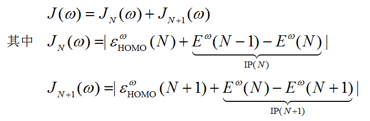
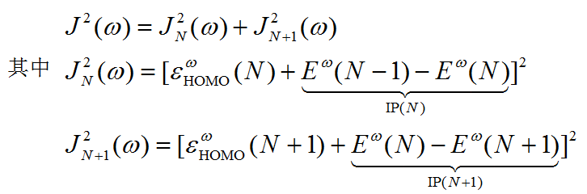
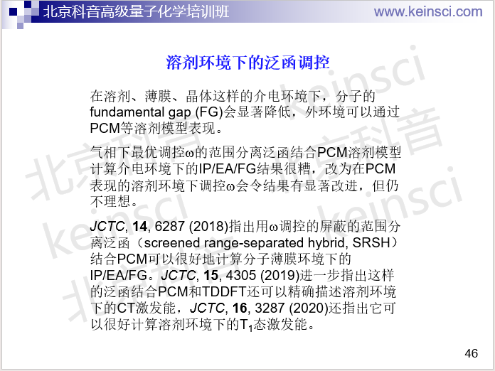

**注**：**在北京科音高级量子化学培训班（**[**http://www.keinsci.com/KAQC**](http://www.keinsci.com/KAQC)**）中专门有一节“DFT泛函的调控”，其中笔者用了50多页幻灯片对DFT泛函的调控做极尽全面系统和深入的讲解，信息量是本文的5倍以上，十分推荐对这部分内容感兴趣的读者参加！**

**优化长程校正泛函w参数的简便工具optDFTw**

OptDFTw: A utility for optimizing the w parameters of long-range correction functionals   
文/Sobereva @[北京科音](http://www.keinsci.com/)  
First release: 2016-Sep-20  Last update: 2024-Nov-12

## 1 简介

这几年优化长程校正泛函的w参数（其实是ω，为打字方便就写成w）的做法很火，文章接连不断，有兴趣者可以看看钟成等人的综述《最优化“调控”区间分离密度泛函理论的研究进展》（DOI: 10.3866/PKU.WHXB201605301）。对w进行调节的一种较好方法是使当前w下计算的HOMO轨道能量尽可能接近电离能。这么做的物理思想是对于精确的交换相关泛函，HOMO能量精确等于电离能，即Koopmans定理完全满足。这么调节w之后，长程校正泛函可以很好地计算激发能、(超)极化率、fundamental gap、单-三重态激发态能量差等问题（但也并非万能，比如有大小一致性问题、JPCB,119,1202发现有的体系的超极化率即便w经过优化还是算不好）。w对体系依赖性大，针对一个体系优化的w，对于另一个体系就往往很不适合，所以对每个被计算的体系都需要优化w，导致比普通泛函计算要多花不少代价。  
   
这里提供笔者写的极其简单易用的优化w参数的工具optDFTw，以及附带的对w做扫描的工具scanDFTw。  
用于Gaussian09版的下载地址：<http://sobereva.com/soft/optDFTw_1.0_g09.zip>  
用于Gaussian16版的下载地址：<http://sobereva.com/soft/optDFTw_1.0_g16.zip>  
其中.exe的是Windows版可执行文件，没后缀的是Linux版可执行文件。

若文章使用这两个程序，请引用：Tian Lu, optDFTw program v1.0, webpage: <http://sobereva.com/346>。

这两个程序目前只支持Gaussian程序。只支持中性体系的计算。Windows下运行之前需要在系统中添加GAUSS_EXEDIR环境变量使之指向g09.exe或g16.exe所在目录，并且在PATH环境变量里也添加这个目录，使得能通过命令行方式顺利调用Gaussian。  
 

## 2 optDFTw程序

此程序涉及两个量，J和J^2，都是衡量N电子态以及N+1电子态时HOMO能量与电离能的偏差之和。注意J^2不是J直接取平方  
  
  
  
  
  
令J或J^2函数最小化就找到了最优的w。由于J^2对w更敏感，所以optDFTw优化的是J^2。这个程序是基于Brent算法来最小化J^2的。优化过程是迭代过程，令w收敛到0.0001就已经足够精确了，这一般只需要十来圈，如果收敛到0.001一般也就<=十圈。  
  
使用optDFTw程序前首先要编辑一个Gaussian的长程校正泛函的单点任务文件作为模板，存到当前目录下template.gjf中，比如  
%mem=60GB  
 %nproc=16  
 # LC-wPBE/6-311+G**  
  
 test  
  
 0 1  
  C                  0.00000000    0.00000000   -0.52710800  
  H                  0.00000000    0.93885600   -1.11413900  
  H                  0.00000000   -0.93885600   -1.11413900  
  O                  0.00000000    0.00000000    0.67386600  
  
基组可以是混合基组，照常写即可。泛函可以是比如LC-wPBE、LC-BLYP等标准长程校正泛函，wB97、wB97XD等近程HF成分不为0的泛函可能也能用但结果未必可靠（数据自行负责）。之后在optDFTw运行过程中，就会基于这个文件产生对应不同电子数的N.gjf、N-1.gjf、N+1.gjf，并调用Gaussian进行运算，然后从输出文件中读取计算J^2所需的HOMO轨道能量和体系总能量。在Gaussian中用长程校正泛函计算时，将IOp 3/107和3/108都设为MMMMM00000就相当于用了w参数为MMMMM/10000的范围分离泛函，所以每一步optDFTw都是靠这俩IOp来实现不同w下计算的。  
  
在template.gjf准备好后直接启动optDFTw就可以进行对w的优化。Brent优化算法需要给定初始的w范围以及初猜，给得越合适越可能用较少步数收敛，范围一定要能够把实际的w值囊括在此范围中。默认的w下限是0.05（不能写0，否则Gaussian没法运行），默认上限是0.6（一般足够大了），默认的w收敛限是0.0001，默认的初猜值是上下限的中间值。如果要自己设这些参数，需要以命令行方式运行，即：  

optDFTw [下限] [上限] [初猜] [收敛限]

没设的参数会自动用默认值。迭代次数上限是100，如果要改的话需要改源代码里的maxit参数。  
  
下面是实际运行的输出例子（随便选的分子，和上面的示例输入文件不对应），可见每一轮对N、N+1、N-1体系分别算一次单点。经过14轮，最终优化的w是0.373547 Bohr^-1，之后在Gaussian中使用此范围分离泛函时就应当写IOp(3/107=0373500000,3/108=0373500000)了。  
  
 Lower limit: 0.050  Upper limit: 0.600  Init w: 0.325  Tol: 0.00010  
  
  The initial point:  
  Running: g09 N.gjf N.out  
  Running: g09 N-1.gjf N-1.out  
  Running: g09 N+1.gjf N+1.out  
  w:    0.325000   J:        0.0158995406   J^2:        0.0001837031  
  
  Iteration:     1  
  Running: g09 N.gjf N.out  
  Running: g09 N-1.gjf N-1.out  
  Running: g09 N+1.gjf N+1.out  
  w:    0.430041   J:        0.0179941437   J^2:        0.0001839521  
  
  Iteration:     2  
  Running: g09 N.gjf N.out  
  Running: g09 N-1.gjf N-1.out  
  Running: g09 N+1.gjf N+1.out  
  w:    0.219959   J:        0.0661930709   J^2:        0.0026101120  
  
 ...略  
  
  Iteration:    13  
  Running: g09 N.gjf N.out  
  Running: g09 N-1.gjf N-1.out  
  Running: g09 N+1.gjf N+1.out  
  w:    0.373584   J:        0.0024404394   J^2:        0.0000039539  
  
  Iteration:    14  
  Converged!  
  
  The final w:    0.373547 Bohr^-1    J^2:        0.0000039466  
  
  

## 3 scanDFTw程序

scanDFTw程序是在指定范围内按照指定步长对w进行扫描，对每个w会输出J和J^2值。运行前需要以和optDFTw同样的方式编写template.gjf放到当前目录下。默认从0.05扫到1.0，步长是0.05。如果自行调节设定，用命令行方式运行：  

scanDFTw [下限] [上限] [步长] [iverb]

  
iverb默认为0，如果想同时输出每个w值的HOMO轨道能量和体系总能量则设为1。比如scanDFTw 0.3 0.5 0.02 1。下面是输出例子，可见最优的w在w=0.35附近。  
w:    0.050000   J:      0.20647538   J^2:      0.02246148  
 w:    0.100000   J:      0.15601700   J^2:      0.01319407  
 w:    0.150000   J:      0.11338736   J^2:      0.00721878  
 w:    0.200000   J:      0.07836289   J^2:      0.00359102  
 w:    0.250000   J:      0.04967293   J^2:      0.00151705  
 w:    0.300000   J:      0.02609101   J^2:      0.00045375  
 w:    0.350000   J:      0.00661196   J^2:      0.00004245  
 w:    0.400000   J:      0.00958336   J^2:      0.00004770  
 w:    0.450000   J:      0.02312111   J^2:      0.00031436  
 w:    0.500000   J:      0.03450162   J^2:      0.00073904  
 w:    0.550000   J:      0.04413207   J^2:      0.00125304  
 w:    0.600000   J:      0.05233264   J^2:      0.00181038  
 w:    0.650000   J:      0.05936051   J^2:      0.00238061  
 w:    0.700000   J:      0.06541519   J^2:      0.00294496  
 w:    0.750000   J:      0.07066110   J^2:      0.00349063  
 w:    0.800000   J:      0.07522949   J^2:      0.00400930  
 w:    0.850000   J:      0.07921135   J^2:      0.00449682  
 w:    0.900000   J:      0.08271471   J^2:      0.00495013  
 w:    0.950000   J:      0.08577732   J^2:      0.00536856  

若optDFTw或scanDFTw调用Gaussian计算时意外中断，显然是Gaussian计算出错，自行打开屏幕上提示的Gaussian的out文件，根据末尾的报错信息结合Gaussian使用常识自行判断怎么解决，不要在群里或论坛里问我。>90%的概率是SCF不收敛，参考《解决SCF不收敛问题的方法》（<http://sobereva.com/61>）试图在模板文件里加帮助收敛的关键词，或者尝试其它基组、几何结构等方式解决。也可能是净电荷/自旋多重度设置不对、Gaussian运行环境有问题、内存不够等原因，自行看报错提示判断。

## 4 溶剂效应的考虑

为避免一些人犯错，这里特别一提，如果你要在之后的研究中考虑隐式溶剂模型，那么w调控的时候不要直接带着溶剂模型。参考北京科音高级量子化学培训班（<http://www.keinsci.com/KAQC>）下面这页ppt。在培训里有具体做法的专门的介绍

[图片下载失败: http://sobereva.com/images/346.png]

[图片下载失败: http://sobereva.com/images/346.png]

[图片下载失败: http://sobereva.com/images/346.png]
