**谈谈自旋密度、自旋布居以及在Multiwfn中的绘制和计算**Spin density, spin population as well as their plotting and calculation in Multiwfn  
  
文/Sobereva @[北京科音](http://www.keinsci.com)

First release: 2016-Nov-9    Last update: 2023-Dec-7

自旋密度和自旋布居都是量化里非常重要也很简单的概念。鉴于很多初学者总是问相关的问题，这里专门说说其概念以及怎么计算。阅读本文后读者会充分认识到使用Multiwfn是做自旋密度分析、布居分析的最灵活、强大的工具。此外，自旋密度和自旋布居的概念、计算和分析，在笔者讲授的“量子化学波函数分析与Multiwfn程序培训班”（<http://www.keinsci.com/workshop/WFN_content.html>）中会做比此文全面充分得多的介绍和讲解。  
  

## 1 自旋密度

### 1.1 基本概念

对于开壳层体系，Alpha电子密度分布和Beta电子密度分布是不同的，为了考察未配对电子（或者说单电子）在三维空间中的分布情况，定义了自旋密度(Spin density)的概念：  

**自旋密度 = Alpha电子密度 - Beta电子密度**

  
显然，对于三维空间中某个点，自旋密度若为正，说明此处Alpha电子比Beta电子多；为负则说明此处Beta电子比Alpha电子多。对于闭壳层体系，由于Alpha和Beta电子完全匹配，二者密度处处相同，所以没有自旋密度。对自旋密度进行全空间积分，结果是Alpha与Beta电子数的差值。  
  
初学者经常问一个含糊不清、令人难以回答的（或者说需要打好多字才能严谨地回复的）问题：“怎么计算自旋密度？”。自旋密度是个三维实空间函数，具体要计算哪个位置的自旋密度？到底打算怎么考察它？究竟想怎么表征其分布？必须说清楚！  
  
有不同方式的来分析、表征自旋密度的分布。一般通过等值面图来考察。下面我们来看一些开壳层体系的自旋密度等值面图，看看它能说明什么。图中绿色代表正值，蓝色为负值。等值面数值调节为了能尽可能清楚体现自旋密度分布特征的情况。图片皆为笔者开发的Multiwfn基于Gaussian09产生的波函数文件绘制的。  
  
这是三重态卡宾(CH2)的自旋密度图。可见没成对的Alpha单电子主要绕着碳分布，并且集中分布在它没成键的区域（对比甲烷结构可知本来能再形成两个共价键的）。  

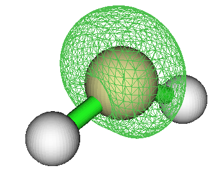

  
这是NO的自旋密度图，可见单电子是在垂直于分子轴的p轨道上。回忆N2有两个pi成键轨道和一个sigma成键轨道，NO比N2多一个电子，故这个电子应该呆在pi反键轨道上（sigma反键轨道能量太高）。从图上也确实看出了pi反键轨道的特征。  

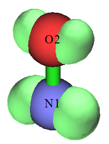

  
下图是把乙烷拉开一定距离，使得C-C键充分断开，然后通过非限制性开壳层计算得到的自旋密度。可见左边的甲基带着一坨Alpha单电子，右边甲基带着一坨Beta单电子。当两个甲基距离足够近的时候，这两坨自旋彼此相反的单电子就会配对形成C-C键，变成闭壳层状态。类似这样把共价键拉断后的电子结构特征和双自由基体系是相同的，有关计算上的讨论见《谈谈片段组合波函数与自旋极化单重态》（<http://sobereva.com/82>）  

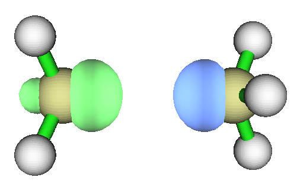

  
把乙烯的两个亚甲基扭成彼此成90度时的自旋密度如下。此构型下显然乙烯的pi键已经破坏了，两个碳各悬着一坨单电子在p轨道上。  

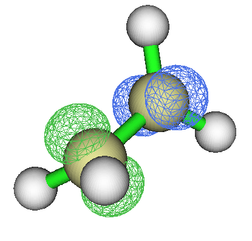

  
这是双核过渡金属配合物，呈现反铁磁性耦合特征。此例两个过渡金属各带一部分单电子，且两个过渡金属带的单电子自旋相反。  

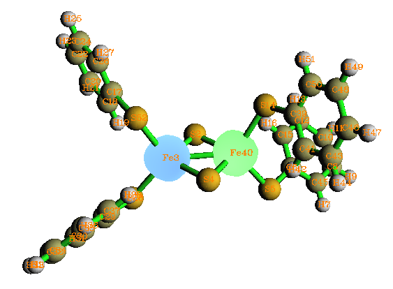

  
下图是甲基自由基进攻乙烯得到丙烯自由基反应的过渡态结构下的自旋密度。可见在此结构下，单电子已经不完全在甲基上了，而是有一部分已经出现在了乙烯上。而且还可以看到乙烯上出现了一块beta密度占主导的区域，可想而知随着反应进行，这个碳的beta单电子就可以和甲基上alpha单电子配对形成新的共价键了。  

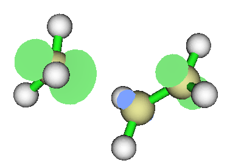

  
这是HOO自由基的自旋密度，可以视为把双氧水弄走一个氢。可见自旋密度最大的正是丢了氢的氧原子。这个氧单电子最多，最活泼，如果有另一个自由基和HOO碰上，肯定也是最先在这个地方成键。  

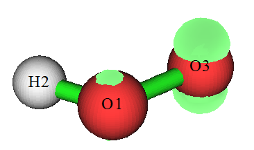

  
这是Li@Calix[4]pyrrole的自旋密度。此体系是把带着一个单电子的Li原子塞到闭壳层的Calix[4]pyrrole的笼中。这个体系中单电子是怎么分布的？凭化学直觉不好说，而从自旋密度图上立刻就知道Li原本的单电子分布位置发生了很大变化，不是再绕着Li核了，而是鼓出去并弥散在了很大一片区域。  

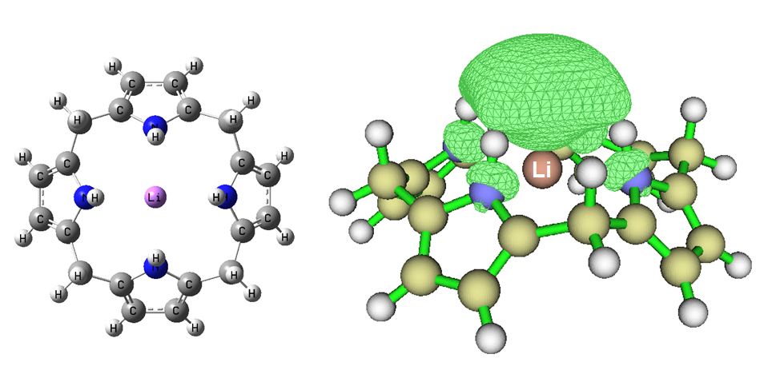

  
  

### 1.2 与自旋密度相关的问题

使用CASSCF、TDDFT等方法是没法得到被计算的态的自旋密度的，比如哪怕你用TDDFT算三重态激发态也是得不到其自旋密度的，这和理论方法的形式有关系。用这些理论方法时要考察单电子分布只能用Multiwfn计算odd electron density，它和自旋密度一样可以图形化或定量展现单电子分布，而且对任意能产生密度矩阵的方法都适用，但它不像自旋密度那样可以通过正、负体现单电子是alpha还是beta自旋。详见《使用Multiwfn计算odd electron density考察激发态单电子分布》（<http://sobereva.com/583>）。

还有一个与自旋密度密切相关的函数叫做自旋极化参数函数ζ，洒家最早看到此函数是在Density functional theory of atoms and molecules (Parr,Weitao Yang)一书中，其定义为

ζ=(ρAlpha-ρBeta)/(ρAlpha+ρBeta)

  
可见和自旋密度的差异是多了分母项，分母就是总电子密度。这个函数体现了不同位置处未成对电子占总电子的比例。在某个位置若此函数值为0，说明此处没有单电子，若在某个位置此函数值达到上限1.0，说明这个地方的电子全是单电子。我们看看丁烷双自由基的自旋密度和自旋极化参数函数的等值面图：  
  

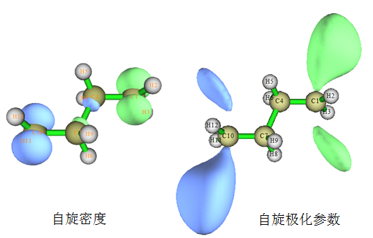

  
可见这两种函数都体现了Alpha和Beta单电子分别集中分布在丁烷双自由基的两端。但是自旋密度等值面明显离核比较近，因为离核较远处无论是alpha还是beta电子都很少了。  
  
下面也顺带提一下自旋密度与概念密度泛函的一点联系。福井函数是预测化学反应位点极为重要的实空间函数，简要介绍和应用可参见笔者的《亲电取代反应中活性位点预测方法的比较》（<http://www.whxb.pku.edu.cn/CN/abstract/abstract28694.shtml>）。福井函数用于预测亲核反应位点时的具体形式是f+，定义为：  

f+ = ρ(N+1)-ρ(N)

N代表体系中性状态时的电子数，体系在N+1电子态时是自由基状态。f+从形式上可以近似视为表现了相对于N电子态再增加一个电子时，这个多出来的单电子是怎么分布的。因此，f+可以近似计算为N+1电子态下的自旋密度。有的人（如RSC Adv., 3, 1486），非要定义一个所谓的Parr函数P，其具体用于亲核反应的形式(P+)的定义就是N+1电子态下的自旋密度。  
  
类似地，福井函数用于预测亲电反应位点时的形式f- = ρ(N)-ρ(N-1)可以近似计算为N-1电子态的自旋密度，对应于Parr函数中的P-。  
  
另外提一下，对于限制性开壳层(RO)形式的计算，明确区分了双占据和单占据轨道，因此此时的自旋密度可以对所有单占据轨道波函数求模方再加和得到，因此容易讨论轨道对自旋密度的贡献。但是RO下的自旋密度明显没有非限制性开壳层(U)得到的准确，一些相关讨论可参看Pople等人的Int. J. Quantum Chem., 56, 303。  
  
利用原子核处的自旋密度可以计算原子对超精细耦合常数的Fermi contact项的贡献，参见J. Phys. Chem. A, 101, 3174 (1997)。  
   

### 1.3 绘制自旋密度

下面老夫介绍下如何用Multiwfn程序绘制自旋密度，本文用的是3.3.9版，以后版本可能选项会有所不同，以所用版本实际屏幕提示和手册为准。对于最常用的Gaussian程序来说用.wfn/.wfx或.fch文件作为Multiwfn的输入文件即可，产生这些文件的做法在Multiwfn手册第四章开头有明确说明。Multiwfn可以在<http://sobereva.com/multiwfn>免费下载，使用入门参见《Multiwfn入门tips》（<http://sobereva.com/167>）。下文用的例子是Multiwfn自带的示例文件三重态甲酰胺的.wfn文件。  
  

### 1.3.1 等值面图

这一节我们绘制三重态甲酰胺的自旋密度等值面图。启动Multiwfn，依次输入  
examples\formamide-m3.wfn  
5    //计算格点数据  
5    //自旋密度  
2    //用中等质量格点，总共算约51200个点。对于较大体系，建议选3用高质量格点（对于很大体系则建议选4并输入较大格点数），否则等值面可能不平滑  
  
此时Multiwfn开始计算自旋密度格点数据，算完后屏幕上看到的Summing up positive value and multiply differential element是全空间积分值，结果和2.0很接近，即对应三重态时Alpha比Beta多的两个电子。  
  
输入-1可以进入图形界面观看自旋密度等值面，各个选项按钮功能不言自明不再累述。选图形界面菜单中的Set lighting里的Enable all，并将Isosurface style设为Use solid face+mesh后看到的图形如下，可见单电子主要在氧上，其次是碳上。  
  

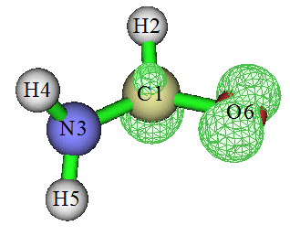

如果想保存图片，可以点RETURN关闭图形窗口后选1。如果想把自旋密度格点数据导出成cube文件(.cub)以便在VMD等第三方可视化程序中显示等值面，选2。

将Multiwfn与免费的VMD程序（<http://www.ks.uiuc.edu/Research/vmd/>）相结合可以绘制出更漂亮的自旋密度等值面、视角可以更自由调节，过程见笔者录制的演示视频“使用Multiwfn结合VMD绘制自旋密度等值图”（<https://www.bilibili.com/video/av26312131>）。更好的、步骤明显省事得多，而且还可以达到绝佳的绘制效果的做法是直接用笔者写的VMD脚本，见《在VMD里将cube文件瞬间绘制成效果极佳的等值面图的方法》<http://sobereva.com/483>），其绘制过程之简单、效果之好完爆任何一个其它的可视化程序！  
    
如果想绘制前述的自旋极化参数函数的等值面，把Multiwfn目录下的settings.ini里的ipolarpara设为1，保存文件并重启Multiwfn。之后，实空间函数5就不再是自旋密度而是自旋极化参数函数了，因此再按照前述步骤绘制出的等值面图就是自旋极化参数了。默认的等值面数值不适合考察这个函数，大家需要手动调节等值面数值直到便于观看，比如调为0.7。绘制自旋极化函数的平面图、曲线图也是设好ipolarpara后再按照后文绘制自旋密度的步骤操作即可。

### 1.3.2 平面图

这里我们绘制三重态甲酰胺的N3-C1-O6三个原子定义的平面上的自旋密度填色图+等值线图，这能十分充分地展现指定平面上的自旋密度分布细节信息。启动Multiwfn并输入  
examples\formamide-m3.wfn  
4   //绘制平面图  
5   //自旋密度  
1   //填色图（想绘制什么类型的平面图就选什么）  
[按回车用默认格点数]  
4   //用三个原子定义作图平面  
3,1,6  
当前看到的图像效果还不太理想。我们右击图像关闭之，选1，然后输入色彩刻度下限和上限，即-0.1,0.06。我们输入的色彩刻度上限比默认的上限数值要低一些，这会使得不同区域数值的大小能更好地通过色彩区分开。然后选2，让等值线图也同时显示在填色图上以便于定量考察。之后选-1重新显示图像，我们看到效果极好。图中越红的地方自旋密度越正，白色区域代表数值超过了当前色彩刻度上限的区域  

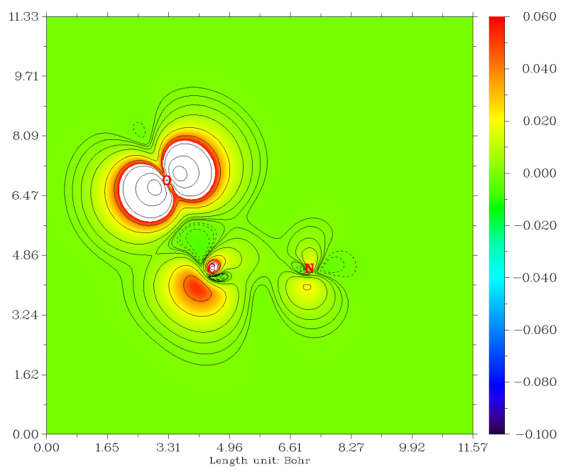

  
想保存图像就关了图像后选0。  

### 1.3.3 曲线图

最后，我们将三重态甲酰胺的碳-氧键上的自旋密度绘制成为曲线图。启动Multiwfn输入  
examples\formamide-m3.wfn  
3   //绘制曲线图  
5   //自旋密度  
1   //通过两个原子核定义作直线来作图  
1,6  
马上看到曲线图。图中虚线是数值为0的位置，X轴上的红点是原子核位置，左边的是C1，右边的是O6，可见自旋密度在原子核处还是很高的。  

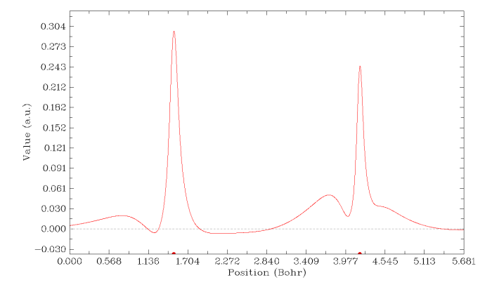

  
Multiwfn提供了很多选项对作图效果进行各种调整、改进，在屏幕上提示得极为简单易懂，手册相应章节也有介绍，这里就不多说了。而且平面图、曲线图绘制后，在菜单中也都可以看到有选项用来导出原始数据，可以很容易地再导入到sigmaplot、origin等程序里重新绘图。  
  
  

## 2 自旋布居

### 2.1 基本概念和计算原理

自旋密度是三维函数，每个点一个数值。而我们往往想讨论某个片段、某个原子、某个原子轨道带多少单电子，这就需要做自旋布居分析(Spin population analysis)，有很多具体算法，分析结果定量不同但一般定性一致。其中，Mulliken、SCPA、Bickelhaupt、NPA等方法可以得到基函数、原子轨道、原子、分子片段的自旋布居数，而Hirshfeld、Becke、Voronoi、AIM方法只能得到原子和分子片段的自旋布居数。自旋布居数的定义是Alpha布居数减Beta布居数，比如某个原子的自旋布居数是0.3，就是说明这个原子带的Alpha电子比它带的Beta电子多0.3个。显然正的布居数对应带Alpha单电子，负的布居数对应带Beta单电子。  
  
这里很简单地提一下计算原理，详细介绍和对比分析参见笔者的《分子轨道成分的计算》（化学学报,69,2393，<http://sioc-journal.cn/Jwk_hxxb/CN/abstract/abstract340458.shtml>）。Mulliken、SCPA、Stout-Politzer、Bickelhaupt这几种方法原理类似，它们做自旋布居分析时可以认为是先通过某种方式计算出每个基函数的自旋布居，然后把每个原子的所有基函数的自旋布居加和就得到了原子的自旋布居，而原子的自旋布居再进一步加和就得到了分子片段的自旋布居。如果想得到原子轨道的自旋布居，就得弄清楚基函数和原子轨道的对应关系，比如6-31G*是每个价层原子轨道用两个基函数来描述，故把那两个基函数的自旋布居相加就得到的对应的原子轨道的自旋布居。这几种方法分析速度都很快，Stout-Politzer和Bickelhaupt不推荐用，Mulliken和SCPA的结果通常合理，但关键要注意的是用的基组死活都不能有弥散函数，否则结果根本没法用！  
   
Hirshfeld、Becke、Voronoi和AIM方法是把分子空间以不同方式划分成一个个原子空间，然后在空间中对自旋密度进行积分来得到原子自旋布居数。之后可以再加和成分子片段的自旋布居数。AIM计算耗时很高，也没什么特别的好处，不建议用。Voronoi的物理意义不强，不建议用。对于只需要原子/片段的自旋布居数而不需要原子轨道的自旋布居数的时候，笔者十分推荐用Hirshfeld或Becke方法进行计算，原理十分简单清晰，而且可靠性高，也不怕有弥散函数。  
  
想必看过以上文字的人早已分清自旋密度与自旋布居的关系了。令笔者经常浑身难受的是老看到有人问“怎么算原子的自旋密度”，明摆着这些人根本没搞懂最基本的概念。原子怎么算自旋密度？到底算哪个点的自旋密度？是原子核位置的还是原子核附近具体某个点的？如果要考察原子带多少单电子，要计算的是“原子自旋布居”，那绝对不叫“原子自旋密度”！关于这点，笔者以前在《量子化学中的一些常见不良写法和用词》（<http://sobereva.com/298>）就专门明确强调过了。  
   

### 2.2 在Multiwfn中计算自旋布居

在Multiwfn中可以实现基于Mulliken、SCPA、Stout-Politzer、Bickelhaupt、Hirshfeld、Hirshfeld-I、Becke、Voronoi、AIM的自旋布居分析，下面就说说其中常用方法的具体计算流程。

PS：之前老有人问怎么他用Multiwfn按下文的例子操作程序不输出自旋布居（Spin pop.），那是因为他的输入文件记录的是闭壳层波函数，闭壳层体系自旋布居全都精确为零，输出这个显然毫无意义，Multiwfn当然不输出！

### 2.2.1 Mulliken/SCPA/Lowdin等

实际上Gaussian在做开壳层体系计算的时候末尾直接就会输出原子的自旋布居数，如  
 Mulliken charges and spin densities:  
               1          2  
     1  C    0.162279   0.781603  
     2  H    0.139270  -0.012974  
     3  N   -0.708466   0.140471  
     4  H    0.333784   0.035523  
     5  H    0.344143   0.001055  
     6  O   -0.271011   1.054322  
这里第二列就是原子自旋布居。可见Gaussian开发者多糊涂，居然把spin populations写成了spin densities！而且，居然Exploring Chemistry With Electronic Structure Methods第三版里面作者在讨论相关问题的时候也用spin density这个词来说原子，真是严重误人子弟！  
  
在Multiwfn中，可以很方便地通过Mulliken、SCPA、Lowdin等方式做自旋布居分析，比Gaussian输出的详细多了。用Mulliken、SCPA、Lowdin分析时不能用.wfn/.wfx文件，必须含有基函数信息的文件，比如.fch、.molden等，详见《详谈Multiwfn支持的输入文件类型、产生方法以及相互转换》（<http://sobereva.com/379>）。这里还是以三重态甲酰胺为例。  
  
启动Multiwfn，输入  
formamide-m3.fch  
7   //布居分析  
5   //Mulliken分析（如果用SCPA，选7；用Lowdin，选6）  
1  
程序依次输出以下内容：  
Population of basis functions：基函数的布居数  
Population of shells：基函数壳层的布居数  
Population of each type of angular moment orbitals：每种角动量基函数的布居数  
Population of atoms：原子的布居数  
输出中的Spin pop.那一列就是自旋布居，是Alpha pop.和Beta pop.之差。  
  
原子布居输出结果和Gaussian一致，我们来看看输出的各个原子各角动量基函数的布居情况  
    Atom    Type   Alpha pop.   Beta pop.    Total pop.   Spin pop.  
    1(C )    s      1.64782      1.51428      3.16210      0.13354  
             p      1.63876      0.99055      2.62931      0.64821  
             d      0.02309      0.02323      0.04631     -0.00014  
    2(H )    s      0.42388      0.43685      0.86073     -0.01297  
    3(N )    s      1.77929      1.78117      3.56046     -0.00188  
             p      2.12848      1.99169      4.12017      0.13680  
             d      0.01669      0.01114      0.02783      0.00556  
    4(H )    s      0.35087      0.31535      0.66622      0.03552  
    5(H )    s      0.32846      0.32740      0.65586      0.00106  
    6(O )    s      1.99532      1.98659      3.98191      0.00873  
             p      2.66628      1.62313      4.28940      1.04315  
             d      0.00107     -0.00137     -0.00030      0.00244  
  
    Total    s      6.52563      6.36164     12.88727      0.16399  
             p      6.43352      4.60537     11.03888      1.82815  
             d      0.04085      0.03299      0.07384      0.00786  
从数据中可见，体系总共的两个单电子，其中1.828个都在体系中原子的p轨道上。具体来说，O6的p轨道贡献了1.04个，C1的p轨和s轨分别贡献了0.648和0.133个，在N3上只有极少量单电子。  
  
各个原子轨道上自旋布居是多少？其实这也很容易得到，仔细看《利用布居分析判断基函数与原子轨道的对应关系》（<http://sobereva.com/418>）。我们一旦按照此文提到的过程判断出了基函数与原子轨道的对应关系，就可以把Multiwfn输出的基函数的自旋布居加和成原子轨道的自旋布居了。  
  

经常有人问体系的磁矩怎么算，这里顺带说一下。分子的磁矩来自于电子自旋以及电子的轨道运动，前者是分子磁矩最主要的贡献者。若体系的alpha电子数减beta电子数为n，并且将电子的自旋g因子近似为2（精确值是2.0023193），则分子的电子自旋磁矩的z分量（μZ）就为-n*μ_B，这里μ_B=e*h_bar/(2m_e)是玻尔磁子。因此，μZ可以分解成原子轨道、原子、片段或者三维空间中各个点的贡献。比如某d原子轨道上自旋布居为0.4，就说这个d原子轨道对μZ贡献是-0.4μ_B；若某点自旋密度为x，就可以说这个点的单电子对μZ的贡献是-x*μ_B。所以，对于上面三重态甲酰胺的例子，μZ=-2*μ_B，我们可以说C1对体系μZ的贡献是-0.78*μ_B，其中p轨道贡献-0.64*μ_B，其它的是s轨道贡献的。另外，电子磁矩的总大小|μS|的计算方式是2*μ_B*sqrt(S*(S+1))，此处体系的电子自旋量子数S等于alpha减beta电子数再除以2。|μS|显然没法分解为体系不同部分的贡献。单重态体系S=0，故电子自旋磁矩总大小为0。而对于单重态双自由基，总的电子自旋磁矩也为0，但可以视为有局部电子自旋磁矩。  
  
如果在做布居分析之前先用主功能7里面的选项-1定义片段，那么做如上分析时，还会输出片段的电荷以及片段的自旋布居。

### 2.2.2 Hirshfeld/Becke

在Multiwfn中使用Hirshfeld或Becke方法计算原子自旋布居时用.wfn、.fch、.molden等各种Multiwfn支持的含有波函数信息的文件皆可。还是用三重态甲酰胺的例子，启动Multiwfn后输入  
formamide-m3.fch  
15  //模糊空间分析。默认是用Becke方式划分原子空间，如果想用Hirshfeld方式，选-1再选3  
1   //在各个原子空间内积分指定实空间函数  
5   //自旋密度  
结果如下  
  Atomic space        Value                % of sum            % of sum abs  
    1(C )            0.69370502            34.685254            34.685254  
    2(H )            0.01750339             0.875170             0.875170  
    3(N )            0.19357310             9.678656             9.678656  
    4(H )            0.03433842             1.716921             1.716921  
    5(H )            0.00590491             0.295246             0.295246  
    6(O )            1.05497500            52.748754            52.748754  

Value这一列就是原子自旋布居，和上一节Mulliken分析结果定性一致。% of sum这一列是相应行的数值占所有数值加和的百分比，可见O6贡献了单电子的一半以上。

如果在主功能15里面先选-5，把某个片段里的原子定义为计算时被考虑的原子，那么再按照以上操作后，跟着输出的Summing up above values的数值就是这个片段的自旋布居。

### 2.2.3 AIM

如前所述，笔者不推荐用AIM方法做自旋布居分析，不过姑且也说一下基本流程。也是用.wfn/.wfx/.fch/.molden作为输入文件皆可。启动Multiwfn后输入  
formamide-m3.fch  
17   //盆分析  
1    //产生盆  
1    //用电子密度零通量面作为划分盆的依据  
2    //中等质量格点  
7    //在盆中对指定实空间函数进行积分  
5    //自旋密度  
结果为  
    Atom       Basin       Integral(a.u.)   Vol(Bohr^3)   Vol(rho>0.001)  
     1 (C )       4          0.67507872       376.036        74.955  
     2 (H )       5          0.02216879       587.073        45.094  
     3 (N )       2          0.20244172       553.973       115.300  
     4 (H )       6          0.03091178       362.484        28.203  
     5 (H )       1          0.00400347       312.129        27.089  
     6 (O )       3          1.06545431       754.626       118.934  
Sum of above integrals:             2.00005879  
Integral下面的数值就是相应原子的自旋布居，和前面其它方法算得也相仿佛。这里显示总积分值很接近2.0，说明结果的积分精度是没问题的，如果偏离实际值很多，就说明积分格点设置不合理，需要在设定格点的那一步做适当调整。

## 3 其它

原子的自旋布居还可以通过对原子着色的方式直观展现，见《使用Multiwfn+VMD以原子着色方式表现原子电荷、自旋布居、电荷转移、简缩福井函数》（<http://sobereva.com/425>）。

如果你想了解自旋密度是怎么由轨道构成的话，那么一定要仔细看《用于非限制性开壳层波函数的双正交化方法的原理与应用》（<http://sobereva.com/448>）。简单来说，对于限制性开壳层(RO)计算，自旋密度就是各个单占据轨道自旋密度的加和，自旋布居也相当于是这些单占据轨道中被考察对象所占的成份的加和。但是RO计算耗时高、局限性大、难收敛、结果差，因此一般我们都是用非限制性开壳层(U)形式计算开壳层体系，但此时所有轨道都会对自旋密度有所贡献，这就很难从轨道角度考察自旋密度的构成了。不过，将这些非限制性轨道用Multiwfn做双正交化变换后，就只有极少几条轨道会对自旋密度有所贡献，讨论起来就方便多了。

自旋密度还可以通过自旋自然轨道的方式考察，这是一种比较独特的考察方法，见《在Multiwfn中基于fch产生自然轨道的方法与激发态波函数、自旋自然轨道分析实例》（<http://sobereva.com/403>）。
