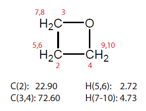
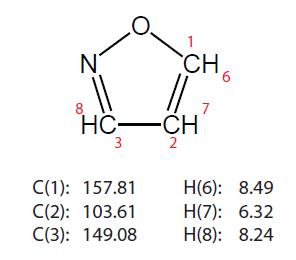
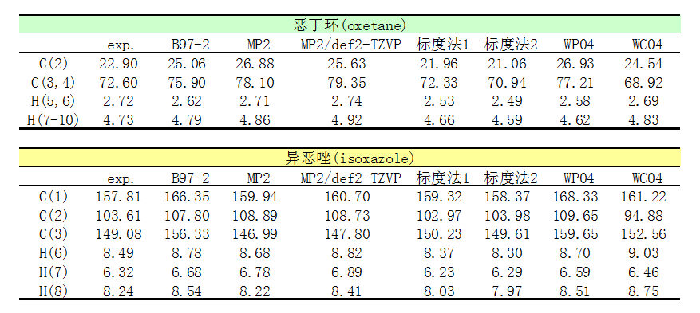

**2021-Oct-24重要****补充**：本文中对泛函选择的说法已经过时了。后来笔者发现用revTPSS泛函结合pcSseg-1计算NMR相当好而且很便宜，详见《revTPSS泛函结合pcSseg-1基组是计算NMR很好的选择》（<http://sobereva.com/623>），性价比不输于本文介绍的标度法，精度更明显强于本文提到的其它方法，如B97-2、KT2、MP2。

**谈谈如何又好又快地计算NMR化学位移**Introducing how to calculate NMR chemical shifts well and quickly  
  
文/Sobereva @[北京科音](http://www.keinsci.com)

First release: 2016-Nov-10  Last update: 2020-Oct-8

**摘要**：本文重点介绍一种又便宜又准确的计算有机分子13C和1H化学位移的方法，英文叫scaling，笔者把它翻译成标度法。第一节首先会说一些和NMR计算有关的乱七八糟的知识，然后在第二节介绍标度法，最后在第三节给个实例对比标度法相对于一般计算方式的优势。

如果想绘制NMR谱的话，最佳的做法是使用Multiwfn程序绘制，易用、灵活、强大而且免费，见《使用Multiwfn绘制NMR谱》（<http://sobereva.com/565>）。而且在Multiwfn里还可以直接使用标度法得到化学位移，方便极了。

## 1 相关知识

量子化学程序计算NMR时会计算每个原子核位置的磁屏蔽张量，这是3*3矩阵，表现出原子核附近的电子对不同方向磁场的不同屏蔽，比如Gaussian输出的（单位为ppm）：  
     11  H    Isotropic =    31.8273   Anisotropy =    10.7602  
   XX=    30.2103   YX=     2.1740   ZX=    -2.1740  
   XY=     2.2346   YY=    32.6358   ZY=    -5.2595  
   XZ=    -2.2346   YZ=    -5.2595   ZZ=    32.6358  
由于分子在溶液中会随意旋转，所以我们一般关注的是各向同性磁屏蔽值σiso，它对应于磁屏蔽张量的三个对角元的平均值，也即上面输出的Isotropic =    31.8273。  
  
量子化学计算NMR化学位移的最标准的做法是先计算参考物质四甲基硅烷(TMS)的碳、氢的σiso作为参考值，然后再在相同级别下计算自己要研究的物质的碳、氢的σiso，和参考值求差值即得到化学位移。优化显然可以和计算NMR用不同级别。  
  
对于这种标准计算方式，有大量文章研究了不同基组、理论方法下的计算精度，如JCTC,10,572(2014)、JCP,138,024111(2013)。精度和耗时都是：CCSD(T)>CCSD>MP2>DFT>=HF。DFT里面算NMR最好的泛函是KT2（Dalton支持），其次一般认为是B97-2（在Gaussian里写为B972）。不过，这些测试都是用高精度理论计算的结果作为参考值，将结果拿去和实验结果对比，往往又是另一番风景了。后面会看到MP2到了实际中就怂了。半经验方法也可以算NMR。Walter Thiel等人搞的MB3和Hyperchem支持的TNDO是专门用来算NMR的半经验方法，不过很少被使用。Gaussian09目前最高支持用MP2来算NMR，想用耦合簇级别算NMR得用Dalton、CFOUR等程序。  
  
另外，JCTC,10,572中提出了GIAO-SCS-MP2方法，思路类似SCS-MP2，但专门用来算NMR，结果比MP2有显著改进，甚至接近CCSD(T)。原理是把磁屏蔽张量分解成：HF贡献+c1*自旋相同贡献+c2*自旋相反贡献，c1、c2向CCSD(T)精确计算值来拟合。可惜此方法目前没有被公开的程序支持，可能以后的Q-Chem会支持吧。  
  
与磁相关的属性在量化程序中有GIAO、IGLO、CSGT、IGAIM这几种计算形式，完备基组下结果相同，但有限基组下会有差异，随基组增加收敛性快慢不同。GIAO是公认首选，也是Gaussian默认的。所以一些人做NMR计算时候在NMR后面写个=GIAO纯属多余。  
  
再说下计算NMR用的基组。6-31G**、def2-SVP这个档很糙，6-311G(2d,p)还凑合，def2-TZVP比较理想，def2-QZVP或cc-pVQZ就完美了。使用弥散函数没有任何意义，几乎不会对结果有任何改进还暴增耗时。  
  
计算NMR最最最最理想的基组是Jensen搞的pcS系列，原文见JCTC,4,719(2008)。后来为了节约pcS在主流量化程序里的耗时，Jensen在JCTC,11,132(2015)中把pcS从广义收缩转化成了片段收缩版本，称pcSseg，它们在EMSL基组库上都能下载到定义。pcSseg系列特别适合结合DFT计算磁屏蔽值。pcSseg-1大小和6-31G**相近，NMR计算精度却和def2-TZVP、cc-pVTZ差不多。pcSseg-0大小和3-21G相仿佛，精度虽明显不如pcS-1，但是却比6-31G**整体还好一点。另外还有pcSseg-2，比pcSseg-1大不少，但对NMR改进有限，不算很划算。  
  
总的来说，在Gaussian下计算NMR，一般用B97-2即可，基组建议用pcSseg-1，如果懒得从EMSL上拷定义就用def2-TZVP。注意，算NMR的时候MP2比DFT的昂贵程度远远远远高于算单点的时候！切勿小看MP2算NMR的耗时，哪怕只是结合pcSseg-1这种不太大的基组用于中等体系！  
  
溶剂环境是会对化学位移计算结果有一定影响的，因此NMR计算时应当通过PCM、SMD等隐式溶剂模型表现溶剂环境。不过，由于NMR大多是在（氘代）氯仿下测的，其极性比较小，因此是否用溶剂模型，对结果精度影响相对有限，而且由于一些误差抵消方面的巧合因素，可能不带溶剂模型反倒结果更好点。不过鉴于使用隐式溶剂模型并不会增加太多耗时，为了严谨起见，计算时还是用隐式溶剂模型表现实际溶剂环境为宜。几何优化时用不用隐式溶剂模型无所谓，因为氯仿环境下和气相下优化的结构一般不会有什么差异。  
  
  

## 2 标度法与WC04、WP04泛函

按照以上方式计算，哪怕用了较好方法和较高质量基组，也考虑了溶剂效应，但算出来的化学位移往往还是和实验值差异不小。一个原因是没考虑构象分布的影响，这点本文不涉及，这对于柔性大分子一般才牵扯到，另一大原因就是理论计算的结果和实验值有系统性误差，应当通过某种形式的校正来消除。这其实和频率校正因子（见《谈谈谐振频率校正因子》<http://sobereva.com/221>）的做法在某种意义上很相似。  
  
标度法是用来计算化学位移的一种又准又便宜的方法，用这种方法计算化学位移(δ)的方式是

δ=(截距-σiso)/(-斜率)

其中截距和斜率都是事先拟合好的标度参数，拟合方式是对一批有机分子，让特定级别下以这种方式算的化学位移和实验化学位移尽可能相同。  
  
不同文献报道了不同级别、不同方式得到标度参数，在这个网站上有汇总：<http://cheshirenmr.info>。进入后点击左侧的Scaling Factors，可以看到一个索引，说了网页中每个表格对应的是什么情况。表格#1、#2...对应不同数据来源，每个子表对应不同具体情况，如不同溶剂、不同程序。  
  
表格里数据很多，这里作为例子，我们只关注G09下基于气相优化的结构结合SMD溶剂模型表现氯仿环境时候算化学位移的情况，其对应的表是Table #1b（以后网站可能会更新，表格序号也许会变）。要找到最合用的级别，一方面是看RMSD值（相对于实验值的均方根误差），另一方面是看计算用的基组。RMSD又低，基组又小的级别是我们需要的。当前我们看到B3LYP/6-31G*在气相优化结构，然后B3LYP/6-31G*结合SMD表现氯仿环境计算NMR的时候RMSD很低，甚至比一大批更大基组下的RMSD还低，所以这明显是很理想的计算级别。此级别下算氢谱的截距是32.2109，斜率是-1.0157，因此我们直接把这个级别下算出来的氢的σiso代入这个公式就直接得到化学位移了：δ=(32.2109-σiso)/1.0157。对于算碳的化学位移也是用相应的标度参数即可。这个做法真是超简单，不仅可以用小基组，连计算参考物质TMS的过程都省了。到底这个做法准不准？下一节我们通过实例测试一下便知。  
  
可以注意到表中还有一个耗时低且RMSD也低的级别是M06-2X/6-31G*优化气相结构，然后mPW1PW91/6-31G*结合SMD溶剂模型表现氯仿环境计算NMR。这个耗时和误差与上面B3LYP/6-31G*那个半斤八两，但考虑到M06-2X耗时还是高于B3LYP不少，而且这还得牵扯到用两个泛函，所以我建议用上面B3LYP/6-31G*的级别来做标度法计算。不过，鉴于M06-2X描述弱相互作用比B3LYP好很多，所以如果弱相互作用可能明显影响体系结构的话，我倒建议用mPW1PW91//M06-2X这个。  
  
从表格中可以看到，用了大基组结果未必比小基组下的好，甚至结果精度可能不增反降。所以用标度法的时候切勿盲目用大基组，哪怕你的计算资源有地方没处用。从一些RMSD上也看到，加了弥散函数后结果并没改进，这也说明弥散函数对计算NMR从各种意义上都是毛用也没有。所以切勿效仿一些人计算NMR时也用弥散的做法。  
  
值得顺带提一下的是WC04和WP04泛函，这是在JCTC,2,1085(2006)中Cramer等人提出的专门算氯仿下化学位移的泛函。WC04专用于算碳，WP04专门算氢，P代表proton。它们在B3LYP基础上对参数进行了优化，通过一批有机分子作为训练集，使得在用6-311+G(2d,p)基组结合IEFPCM溶剂模型表现氯仿时的计算的化学位移尽可能接近氯仿下的实验值。这两个泛函在Gaussian中的用法是：  
WC04：BLYP IOp(3/76=1000007400,3/77=0999900001,3/78=0000109999)  
WP04：BLYP IOp(3/76=1000001189,3/77=0961409999,3/78=0000109999)  
显然，用这两个泛函算化学位移时，TMS参考数据也得分别在这两个泛函下算。  
  
WC04和WP04泛函虽然在原文的测试中精度明显胜于其它泛函，但是相对于其它一些泛函用标度法计算化学位移的时候在精度上就没有什么优势了。而且，这俩泛函参数化的时候还是结合的6-311+G(2d,p)基组，用它的代价比较高（而且其弥散函数纯属多余，但由于是在这个基组下拟合的参数，故用这俩泛函的时候不得不带弥散函数）。所以，有了标度法，WC04和WP04就没什么用武之地了。

## 3 实例

这里我们用Gaussian09程序，以两个随便找的有机小分子为例，对比一下MP2/pcSseg-1、MP2/def2-TZVP，以及B97-2/pcSseg-1用标准方法计算的氢和碳的化学位移，以及用标度法算的结果。标度法考虑前面提到的两种：(1)B3LYP/6-31G*优化和计算NMR (2)M06-2X/6-31G*优化，mPW1PW91/6-31G*算NMR。另外，我们也用WC04和WP04结合标配的6-311+G(2d,p)基组计算一下结果。结构优化都在气相下完成，算NMR的时候都用scrf(SMD,solvent=chloroform)关键词表现氯仿环境。除了标度法(2)的情况外优化TMS和被研究的分子都在B3LYP/6-31G*下完成。  
  
测试分子1是恶丁环(oxetane)，其氯仿下化学位移如下  

  
测试分子2是异恶唑(isoxazole)，其氯仿下化学位移如下  

  
下面是化学位移计算结果。表中的MP2是指用的基组和B97-2一样都是pcSseg-1的情况。  

  
从表中可见，B97-2的结果差强人意。MP2虽然文献里表明其比B97-2更准，但是实际上阵后发现，其精度，特别是碳的，并不比B97-2好，着实令人失望，多花那么多时间根本不值得。pcSseg-1和def2-TZVP结果差异不算太大，往往尺寸更小的pcSseg-1的结果比def2-TZVP还更准。标度法1计算代价很低，结果却相当不错，完虐B97-2和MP2，碳的化学位移误差大多都在1ppm以内，最大相差1.5ppm，而氢的化学位移误差都在0.21ppm以内。标度法2算异恶唑的碳的化学位移很准，但其它项目不如标度法1。专为算氢谱优化的WP04泛函算碳谱很差，算氢谱则和B97-2半斤八两。专为算碳谱优化的WC04表现也不算多好，比标度法的精度还是差远了。  
  
通过以上数据看出，B3LYP/6-31G*气相下优化，然后B3LYP/6-31G* scrf(SMD,solvent=chloroform)计算磁屏蔽值，再用标度法转化成氢和碳的化学位移，不仅很便宜，而且结果和实验相符相当理想，强烈推荐大家作为平时计算NMR的标准方法。
