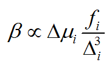

**注**：后来笔者专门写了《使用Multiwfn对第一超极化率做双能级和三能级模型分析》（<http://sobereva.com/512>），讲解怎么通过Multiwfn实现双能级分析和笔者提出的“三能级分析”，本文读者必看！

**谈谈计算第一超极化率的双能级公式**On the dual-level formula for calculating the first hyperpolarizability  
  
文/Sobereva @[北京科音](http://www.keinsci.com/)

First release: 2017-Feb-21  Update history: 2019-Aug-6

SOS是计算（超）极化率常用方法之一，介绍见《使用Multiwfn基于完全态求和(SOS)方法计算极化率和超极化率：（<http://sobereva.com/232>）。  
   
双能级公式是对SOS简化而来的。研究D-A体系的第一超极化率(β)问题时，研究者总喜欢用双能级公式来解释β值的内在本质，以及解释对体系做不同修改（如替换不同原子或基团）时β的变化趋势。双能级公式表示为：

其中Δi是指基态到第i激发态的激发能，Δμi是第i激发态相对于基态的偶极矩变化，fi是基态到第i激发态的振子强度（与跃迁偶极矩密切相关）。从双能级公式，我们可以考察激发能、偶极矩变化和振子强度这三个方面是如何一起决定β的大小的。  
  
双能级的“双”指的是使用SOS公式时，简化到只考虑基态和第i态。第i态称为关键态（crucial state），它一般选择为具有明显振子强度的最低激发态。因为双能级公式的分母是激发能的三次方，所以β会随着激发能的增加迅速减小，所以选取关键态的时候并不是看振子强度谁最大。更严格的选择关键态的做法是对最低一批激发态依次使用双能级公式，用哪个激发态算出来的β最大就把谁当成关键态。  
  
有人疑惑：双能级公式具体是怎么从SOS公式简化得到的？为什么用上面的双能级公式算出来的β值和我用导数方法得到的（比如在Gaussian里用polar关键词得到的，见<http://sobereva.com/231>）相差达到一个数量级？我专门写了一个文档，对双能级公式推导过程做了详细说明，见：[two_level.pdf](http://sobereva.com/attach/two_level.pdf)  
  
从文档中可见，如果你要用上述双能级公式算的β和精确的β在定量层面上对比，一定要乘上系数9，即β=9*Δμi*fi/(Δi)^3，不考虑系数9则显然结果能差上一个数量级。文献里用双能级公式时主要是用来解释β变化趋势的，所以把系数给省掉了。也有很多人用双能级公式时候是直接学别人的用法，根本就不知道其实这里还有个系数9。f是无量纲的，如果这个式子中Δμi和Δi都用原子单位，则β也是原子单位。  
  
双能级公式的适用范围有无限制？从上述讨论和文档中可知明显是有的。使用条件如下：  
(1)有确切的关键态。如果不管把哪个态取为关键态都与SOS公式得到的或者导数方法得到的β相差极大（前提是已经考虑了系数9），比如也就其几分之一甚至更小，那么说明在SOS公式中有多个态都对结果产生明显影响，没法简化到双能级公式来说事。此时SOS中的多个自身项（i=j）或耦合项（i≠j）都可能对β有很大贡献，分析起来会很麻烦，但还是可以分析的。有兴趣者可以改改Multiwfn的SOS计算代码，输出各项的贡献，然后从大到小排序来找关键项并进行讨论。  
(2)单一方向性。如果双能级公式用来解释β的总大小，则体系的β应当主要来自某一方向。假设是Z方向，则β总大小应当约等于βZZZ，而其它分量可以忽略。此时必定基态偶极矩顺着Z方向，从基态激发到关键态对应的偶极矩变化也对应Z方向，跃迁偶极矩也只有Z方向是显著的。  
典型的D-A体系是可以较好满足上述条件的。  
  
有人问双能级公式里面Δμ到底怎么计算，是计算成|μi|-|μ0|还是|μi-μ0|，这里μ是偶极矩矢量。实际上，当上述条件(2)能够精确满足时，电子激发时偶极矩只在基态偶极矩方向变化，这两种计算Δμ的方式结果完全一样。当两种结果不同时，首先意味着双能级公式并不精确适用，也难以说这两种计算方式哪种更合理一点（但非要说的话，还是建议用|μi|-|μ0|，标量间运算更直观一些）。

值得一提的是，如果你用的是比如TDDFT做的计算，激发态偶极矩应当使用非弛豫密度而非弛豫密度。这俩密度是什么关系，在这里说了：《使用Multiwfn做空穴-电子分析全面考察电子激发特征》（<http://sobereva.com/434>）。对于Gaussian的TDDFT计算，如果你用density关键词，末尾输出的偶极矩对应的是root选定的态的弛豫密度的情况，如果用density=rhoci关键词，末尾输出的偶极矩对应的是root选定的态的非弛豫密度的情况，这是双能级公式分析时应当用的。也可以按此文《使用Multiwfn计算激发态间的跃迁偶极矩和各个激发态的偶极矩》（<http://sobereva.com/227>）的方法一次性算出来所有激发态的偶极矩，这对应的也是非弛豫密度的情况。
