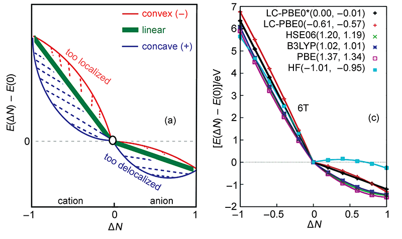
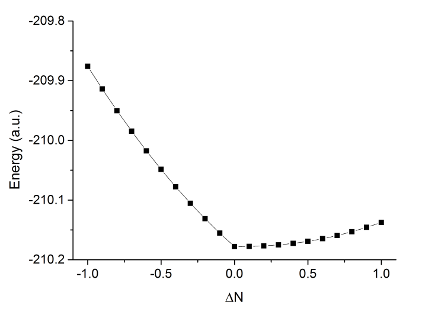
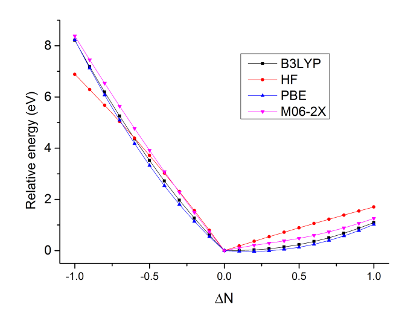
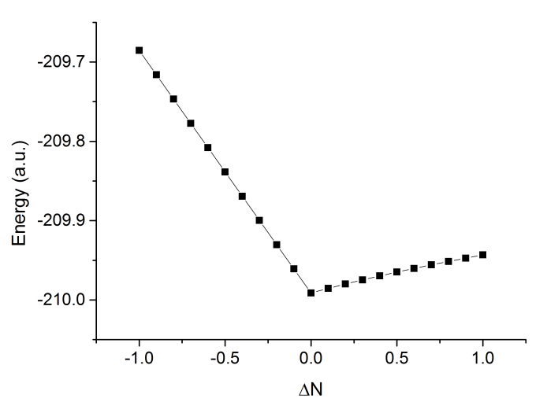

**使用NWChem做分数占据数的DFT计算**Using NWChem to perform fractional occupation DFT calculation  
  
文/Sobereva @[北京科音](http://www.keinsci.com)   2017-Feb-25

  
  

## 1 前言

分数占据数(Fractional occupation number, FON)计算是指被计算的体系有的轨道占据数不为整数，也因此允许整个体系的电子数不为整数。这看似有点超现实，实际中体系电子数不可能为非整数，毕竟电子不可分割，但对于DFT（或HF）计算是可以实现的，而且在程序实现上超简单。大家知道，常规DFT计算的时候都是已知电子数，根据每一轮迭代时解出的KS轨道能量从低往高填充，然后用占据轨道构建用于下一轮迭代用的密度矩阵以及计算体系能量。而FON计算时，有的轨道依然是整数占据，有的则是自设的分数占据数（这有点像自然轨道），构建密度矩阵时考虑所有这些占据数不为0的轨道即可，除此以外不需要对程序做任何修改。FON计算既可以是限制性计算，轨道占据数允许在[0,2]范围，也可以是非限制性计算，alpha/beta轨道占据数允许在[0,1]范围。  
  
做FON计算有一些特别的用处，很重要之一就是考察各种近似的交换-相关泛函存在的自相互作用误差(self-interaction error, SIE)导致的离域性误差(delocalization error)问题。这里引用doi: 10.3866/PKU.WHXB201605301中的一张图，图中ΔN指相对于中性状态时电子数的改变，纵坐标是相对于中性状态时体系能量的变化。  

  
理论上，如果交换-相关泛函是精确，那么体系能量随电子数的变化应当如图中绿线所示，是精确的折线。但是HF成份较低的泛函存在较大的SIE问题，导致电子离域性过强，所以从右图上可看到PBE、B3LYP等泛函的曲线都往外凸，而且HF成份越低凸得越厉害。HF交换势则完全没有SIE问题，但是在图中看到其曲线往里凹，高估了电子定域性，也不很合理。近年来比较火的w调控方法则可以对范围分离泛函的HF交换势掺入的方式优化到一个较理想的情形，它使得HOMO轨道能量和体系电离能尽可能接近（对于精确泛函二者则严格相同），从而极大程度解决SIE问题，使得对超极化率、中/大体系激发能等方面精度提升很多，图中可见经过w调控的泛函LC-PBE0*的曲线确实相当平直。更多和w调控的讨论见《优化长程校正泛函w参数的简便工具optDFTw》（<http://sobereva.com/346>）。  
  
如今大量使用w调控的文章都纷纷绘制如上的图像讨论不同泛函的SIE，本文就介绍怎么在NWChem中做FON计算并绘制如上的图像。  
  
  

## 2 在NWChem中做分数占据数计算

NWChem是为数不多的能支持FON计算的量化程序，开源免费。编译方法参看《NWChem的编译方法》（<http://sobereva.com/270>）。  
  
NWChem中支持分数占据数的DFT计算。不是光指定一个总电子数就完了，而必须在DFT段落中用fon关键词来指定占据方式。下面的语句是个用于闭壳层FON计算的设定例子：  
fon partial 2 electrons 0.8 filled 5  
代表有两个轨道是分数占据的，0.8个电子均分给这两个轨道。另外有5个双占据轨道。因此此体系一共有0.8+5*2=10.8个电子。  
  
对于开壳层体系，需要分别对alpha和beta轨道定义占据数，比如  
fon alpha partial 2 electrons 0.8 filled 6  
fon beta partial 1 electrons 1 filled 5  
ODFT  
这代表有6个占据数为1.0的alpha轨道，另有0.8个电子均分给两个alpha轨道。占据的beta轨道有6个，占据数都为1.0（含义上等价于fon beta partial 0 electrons 0 filled 6，但不能这么写否则程序报错）。ODFT必须写，指明做开壳层DFT计算（O代表Open）。  
  
在NWChem中普通的计算都是通过charge关键词指定体系净电荷以及在DFT字段中用mult关键词指定自旋多重度来让程序知道电子是怎么排布的。而做FON的时候我们是自行指定电子排布方式的，因此不需要再写charge和mult了。  
  
  

## 3 对吡咯做分数占据数计算

这里我们对吡咯体系做FON计算。吡咯总共36个电子，因此中性状态下alpha和beta轨道各有18个占据轨道。假设我们当前研究体系有36.7个电子的情形，则多出来的0.7个电子应当被视为处在一个alpha轨道上（可以姑且视作是处在中性状态下的alpha LUMO轨道上，但注意36.7个电子计算和36个电子计算得到的轨道形状和能量都是不同的）。B3LYP/6-31G*时输入文件如下，结构是事先在B3LYP/6-31G*下对中性状态优化的。  
GEOMETRY  
 C                  0.00000000    1.12552000    0.33154500  
 C                  0.00000000    0.71275300   -0.98347600  
 C                  0.00000000   -0.71275300   -0.98347600  
 C                  0.00000000   -1.12552000    0.33154500  
 N                  0.00000000    0.00000000    1.12233100  
 H                  0.00000000    0.00000000    2.13032900  
 H                  0.00000000    2.11411400    0.76778100  
 H                  0.00000000    1.36093100   -1.84951800  
 H                  0.00000000   -1.36093100   -1.84951800  
 H                  0.00000000   -2.11411400    0.76778100  
END  
BASIS  
* library 6-31G*  
END  
DFT  
fon alpha partial 1 electrons 0.7 filled 18  
fon beta partial 1 electrons 1 filled 17  
odft  
XC b3lyp  
END  
TASK DFT ENERGY  
  
输出信息和普通单点计算没什么区别，计算速度和普通单点计算也没什么差异，有个别地方值得说一下。以下是迭代过程中随便取的一部分  
     FON applied  
     tr(P*S):    0.3670000E+02  
 d= 0,ls=0.0,diis     5   -210.0871635921 -3.83D-04  1.03D-04  6.20D-05     3.8  
                                                     5.87D-05  3.40D-05  
这里tr(P*S)后面的值对应的是当前体系电子数，由于密度矩阵是按照自设的分数占据方式构建的，当前这里显示有36.7个电子。  
  
然后值得说的是输出的轨道信息部分，从alpha轨道部分可以看到，前18个轨道占据数都是1.0，从20号轨道开始占据数都是0，而第19号轨道，占据数是我们设的0.7：  
 Vector   19  Occ=7.000000D-01  E= 1.739512D-01  Symmetry=b1  
再看beta轨道部分，会看到前18个都是1.0占据，其余的都是0占据。  
  
有兴趣的话可以通过FON计算体系净电荷为-1、0、+1状态的能量，和我们通过常规UKS方式计算的结果进行对比。你会发现，当电子数为整数的时候，两种方式结果是完全一样的。比如吡咯体系净电荷为+1时设定为  
fon alpha partial 1 electrons 1 filled 17  
fon beta partial 1 electrons 1 filled 16  
odft  
结果为-209.872709779915（这里我们令alpha电子数>beta电子数是习俗。若设成alpha电子数为17，beta为18，则结果也一样）。直接用charge 1结合mult 2做常规UKS计算，结果为-209.872709372573，可见和FON计算一样（微小的数值差异可以忽略）。  
  
  

## 4 对吡咯体系考察不同泛函的离域性误差

下面我们在B3LYP/6-31+G*级别下对吡咯计算和绘制能量随电子数的变化，以考察不同泛函的离域性误差。考虑的电子数变化区间是ΔN=[-1,1]，步长是0.1。  
  
虽然可以直接手动去不断地改输入文件并计算各个电子数时候的能量，但是这样太费事。为了省事，我们通过shell脚本自动完成。这里提供两个脚本，一个是run1.sh，用来扫描ΔN=[-1,0)区间，另一个是run2.sh，用来扫描ΔN=[0,1]区间。  
  
以下是run1.sh，将其内容复制到一个文本文件里，用chmod加上可执行权限，然后用./run1.sh，则这个脚本就会不断地改变FON设定并产生NWChem输入文件input.nw，并调用NWChem自动执行之。任务会依次产生n1.0.out、n0.9.out ... n0.1out，对应于ΔN从-1.0变化到0.1  
for ((i=0;i<10;i=i+1))  
do  
chg=`echo "$i*0.1"|bc`  
chgtmp=`echo "1.0-$i*0.1"|bc`  
file=n`printf "%4.2f\n" $chgtmp`  
echo processing $file...  
cat << EOF > input.nw  
GEOMETRY  
 C                  0.00000000    1.12552000    0.33154500  
 C                  0.00000000    0.71275300   -0.98347600  
 C                  0.00000000   -0.71275300   -0.98347600  
 C                  0.00000000   -1.12552000    0.33154500  
 N                  0.00000000    0.00000000    1.12233100  
 H                  0.00000000    0.00000000    2.13032900  
 H                  0.00000000    2.11411400    0.76778100  
 H                  0.00000000    1.36093100   -1.84951800  
 H                  0.00000000   -1.36093100   -1.84951800  
 H                  0.00000000   -2.11411400    0.76778100  
END  
BASIS  
* library 6-31+G*  
END  
DFT  
fon alpha partial 1 electrons 1 filled 17  
fon beta partial 1 electrons $chg filled 17  
odft  
XC b3lyp  
END  
TASK DFT ENERGY  
EOF  
nwchem input.nw > $file.out  
done   
  
以下是run2.sh，运行方式同上。任务会产生0.0.out、n0.1.out ... 1.0.out文件，对应ΔN从0.0变化到1.0。  
for ((i=0;i<=10;i=i+1))  
do  
chg=`echo "$i*0.1"|bc`  
file=`printf "%4.2f\n" $chg`  
echo processing $file...  
cat << EOF > input.nw  
GEOMETRY  
 C                  0.00000000    1.12552000    0.33154500  
 C                  0.00000000    0.71275300   -0.98347600  
 C                  0.00000000   -0.71275300   -0.98347600  
 C                  0.00000000   -1.12552000    0.33154500  
 N                  0.00000000    0.00000000    1.12233100  
 H                  0.00000000    0.00000000    2.13032900  
 H                  0.00000000    2.11411400    0.76778100  
 H                  0.00000000    1.36093100   -1.84951800  
 H                  0.00000000   -1.36093100   -1.84951800  
 H                  0.00000000   -2.11411400    0.76778100  
END  
BASIS  
* library 6-31+G*  
END  
DFT  
fon alpha partial 1 electrons $chg filled 18  
fon beta partial 1 electrons 1 filled 17  
odft  
XC b3lyp  
END  
TASK DFT ENERGY  
EOF  
nwchem input.nw > $file.out  
done   
  
执行以上两个脚本，都算完了之后，运行grep "Total DFT energy" *.out，就会把能量从所有的输出文件中提出来。把内容拷到文本文件里，再用ultraedit之类工具改成如下这样格式：  
 0.00   -210.177778579314  
 0.10   -210.177659716794  
 0.20   -210.176820011604  
 0.30   -210.175152111372  
 0.40   -210.172599674556  
 0.50   -210.169127332116  
 0.60   -210.164712722296  
 0.70   -210.159342627221  
 0.80   -210.153010888050  
 0.90   -210.145717291579  
 1.00   -210.137466938372  
-0.10   -210.155373098208  
-0.20   -210.131259526415  
-0.30   -210.105428293496  
-0.40   -210.077870858885  
-0.50   -210.048579636682  
-0.60   -210.017547727497  
-0.70   -209.984769772638  
-0.80   -209.950240400890  
-0.90   -209.913955349549  
-1.00   -209.875911118025  
  
然后把此文件拖到Origin里，会被导入成列两数据，在第一列标题上点右键选Sort Worksheet - Ascending对ΔN排序。然后做成折线+散点图，如下所示  
  

  
可见中性状态能量最低，得电子也会导致能量上升，电子亲和能为负。  
  
接下来我们把其它泛函的结果计算出来作到同一张图上来对比。我们考察HF、M06-2X、PBE，把脚本中的b3lyp分别改为HFexch、m06-2x、xpbe96 cpbe96然后重新运行脚本即可。由于每种泛函得到的绝对能量有系统性偏差，为了作在一张图上好比，我们把每个泛函不同电子数时的能量都减去这个泛函在ΔN=0时的能量，使得四个泛函的曲线在ΔN=0处重合。最后作出的图如下：  
  

  
可见HF成份越低的泛函，尤其是纯泛函，曲线往外凸得越厉害，说明SIE问题越大。M06-2X的曲线相对比较直，SIE问题不显著，但这不代表M06-2X对其它体系曲线也能这么直。HF则在左半边的图中往里凹了，说明高估了电子定域性。  
  
下面我们来看看使用如今热门的w调控方法得到的泛函结果如何。我们对LC-wPBE泛函在6-31+G*下计算最优的w值，使用optDFTw程序来实现非常容易，详见《优化长程校正泛函w参数的简便工具optDFTw》（<http://sobereva.com/346>）。最后得到的最优的w值为0.300047。  
  
在NWChem中，LC-wPBE在调用的时候是在DFT字段里写如下内容（手册里是这么写的，但实际上标准的LC-wPBE的w参数应为0.4）  
xc xwpbe 1.00 cpbe96 1.0 hfexch 1.00  
cam 0.3 cam_alpha 0.00 cam_beta 1.00  
其中cam就是w参数，cam_alpha和cam_beta就是分别对应范围分离泛函的alpha和beta参数。我们下面要使用经过w调控的LC-wPBE对ΔN进行扫描，于是把run1.sh和run2.sh中XC b3lyp替换以下内容  
xc xwpbe 1.00 cpbe96 1.0 hfexch 1.00  
cam 0.300047 cam_alpha 0.00 cam_beta 1.00  
然后运行这两个脚本。  
  
将结果作图，如下所示  
  

  
可以看到曲线明显非常直，说明w调控是有效的削弱SIE问题的方法。  
  
  

## 5 计算p轨道占据数平均化的碳原子

前面我们看到的是只有一个轨道是分数占据的计算，下面我们看个多个轨道都是分数占据的例子。众所周知碳原子基态组态是s2p2，占据的两个p轨道和没被占据的p轨道的轨道能量是不同的，体系的电子密度也不是球对称分布的。但是三个p轨道在原理上是等价的，在现实中观测到的碳原子密度也是球对称的。如果我们做FON计算，就可以还原这种情况，输入文件如下，我们令体系中2个电子平均地摊在三个p型alpha轨道上，而alpha和beta s轨道的电子占据方式则不变。  
GEOMETRY  
 C                 0. 0. 0.  
END  
BASIS  
* library 6-31G*  
END  
DFT  
fon alpha partial 3 electrons 2 filled 2  
fon beta partial 1 electrons 1 filled 1  
odft  
XC b3lyp  
END  
TASK DFT ENERGY  
  
从输出文件中可看到如下信息。确实，三个占据数为2/3的alpha p轨道的轨道能量是相同的，衡量径向延展广度的r^2算符的期望值也是相同的  
 Vector    3  Occ=6.666667D-01  E=-2.232569D-01  
              MO Center= -6.4D-17, -1.0D-17, -8.4D-17, r^2= 9.8D-01  
...略  
 Vector    4  Occ=6.666667D-01  E=-2.232504D-01  
              MO Center= -2.8D-16, -6.2D-17,  1.6D-16, r^2= 9.8D-01  
...略   
 Vector    5  Occ=6.666667D-01  E=-2.232504D-01  
              MO Center=  7.7D-16,  1.5D-16,  2.8D-16, r^2= 9.8D-01  
...略  
总能量为-37.808815282934。  
  
如果做常规的UKS计算，设mult 3，则对应的三个alpha p轨道信息为  
 Vector    3  Occ=1.000000D+00  E=-2.527187D-01  
              MO Center=  9.5D-17,  4.7D-16, -1.0D-15, r^2= 9.6D-01  
...略   
 Vector    4  Occ=1.000000D+00  E=-2.527186D-01  
              MO Center=  6.2D-16, -4.9D-16, -5.5D-16, r^2= 9.6D-01  
...略   
 Vector    5  Occ=0.000000D+00  E=-1.388507D-01  
              MO Center=  5.3D-16,  1.8D-15,  3.5D-15, r^2= 1.1D+00  
...略   
明显，没占据的p轨道能量显著高于占据的p轨道，而且从r^2上看，其延展程度也更高。总能量为-37.846279559548，比FON计算时略低，根据变分原理这是更优的解，所以要得到碳的真实基态能量还是得做常规UKS计算。而至于实际中为什么观测到的碳原子的密度是球对称的，应理解为其真实的密度矩阵是不同p轨道占据方式对应的密度矩阵的线性叠加，牵扯到系综密度矩阵的概念了，这里就不多说了。
