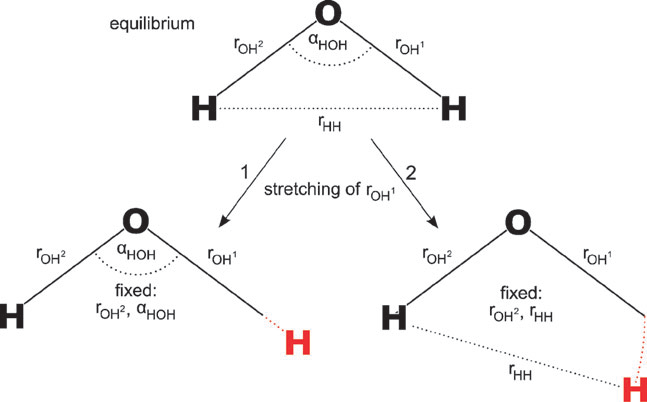
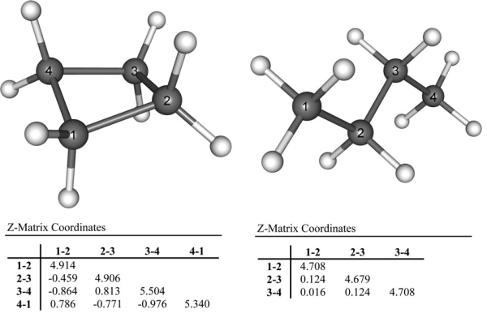
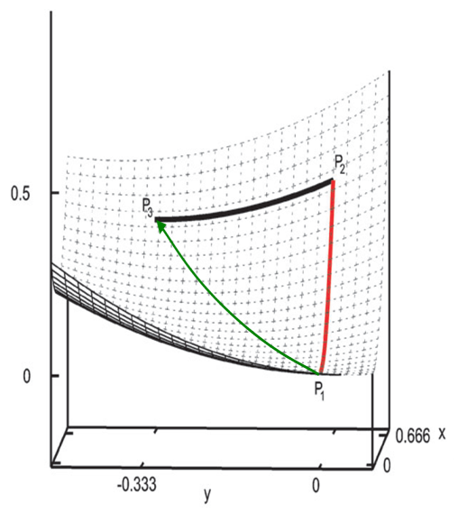
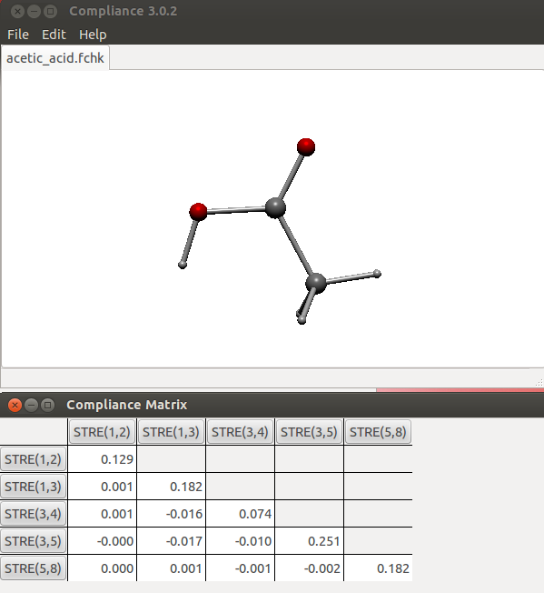
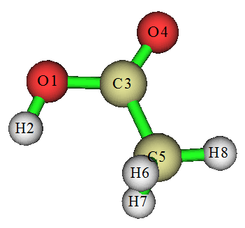
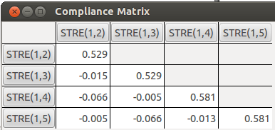
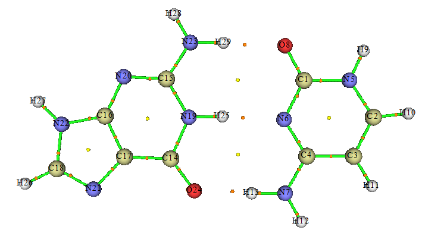
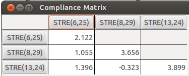

**通过柔性力常数考察键的强度**Investigate strength of bonds through relaxed force constants  
  
文/Sobereva @[北京科音](http://www.keinsci.com)   2017-Mar-1

  
  

## 1 关于键强的衡量

键的强度是化学研究者十分关心的问题。但键的强度不是一个确切的可观测量，只是一个概念，具体衡量方式多种多样，常见的有  
(1)键解离能(BDE)  
(2)键级、AIM理论定义的BCP上的性质  
(3)键长  
(4)键方向上的力常数  
  
其中，BDE定义为H(片段1)+H(片段2)-H(整体)，这里H指焓，整体和片段结构都是分别优化的。BDE意义很明确，而且实验可测，但它作为键强衡量标准也存在问题：  
(1)结果依赖于片段的电子态的选取。这有一定任意性。比如乙烷断裂成俩CH2，卡宾用单重态还是三重态对应的BDE结果是不同的。不过一般都是用片段的基态，以和实验BDE相对应  
(2)把片段的变形能给误纳入到对键强的衡量中去了。这里说的变形能是指片段从它在整个分子中的结构变化到孤立状态下的结构过程的能量的变化。倒是也可以不优化片段来避免这个问题，但就不要用焓而要用电子能量了，此时结果和实验BDE是没法直接对应的（事实上，纯理论方式研究键能一般就是用单点能相减，且不优化片段结构）  
(3)很多体系很难拆分成合适的片段来只让BDE反映感兴趣的键的强度，环状体系是典型。比如环丙烷，把一个C-C键充分拉开以打断它势必也导致其它变量产生显著改变，因此能量变化不是对应单个C-C键的。广义来说，对于两个片段间存在多个键的时候，都很难计算出其中感兴趣的键的BDE（虽然有时也可以设计一些特殊的计算路径来估算出感兴趣的键的BDE，但比较麻烦也有任意性）  
相对于以上三点，BDE衡量键强度最大的弊端其实是：BDE反映的是整体和片段间的相对稳定性，这和单个键的强度原理上其实没有必然关系。这点在DOI 10.1002/qua.25359一文章做了不错的讨论。举一个例子：在CBS-QB3级别下计算二硅烯(就是把乙烯的碳换成硅，注意其极小点不是平面结构)的Si-Si键断裂后变成两个SiH2的过程，得到的标况下焓变是256.2 kJ/mol，而计算乙硅烷的Si-Si键断裂变成两个SiH3过程的焓变则是317.1 kJ/mol。可见BDE的结果明显和实际键强冲突。二硅烯中Si-Si就算说不上是双重键，但也肯定比乙硅烷的Si-Si单重键强，从键长上看前者也比后者明显要短，但BDE顺序却是反过来的。此例BDE的失败原因在于单重态SiH2过于稳定，导致二硅烯解离所需能量相对较小。  
  
用键级能否衡量键强，这要看用的什么键级，诸如Mulliken键级烂得一塌糊涂。Mayer或Wiberg键级物理本质体现的是原子间共享的电子对数，对同类键（比如某个碳氧键与另一个碳氧键对比），它们与键强有一定正相关性，但完全没法对不同类型键进行横向对比。笔者提出的拉普拉斯键级与键强度有比Mayer/Wiberg键级明显好得多的对应关系，但适用体系有局限性，主要用于有机体系。关于键级和键强更多的讨论参阅拉普拉斯键级原文：J. Phys. Chem. A, 117, 3100 (2013)。对于同类键，AIM理论定义的BCP上的性质，如电子密度、势能密度的绝对值等也与键强度有正相关性，但光靠BCP性质说事有时不靠谱，而且同样没法对不同类型键横向比较。  
  
拿键长讨论键强度很常见，也很少受到质疑，而且是实验可测的量，但也只能局限在同类键的比较上。  
  
在很多文献中对于同类键使用键的振动频率来考察键的强度，上面的JPCA文章中也有例子。当使用谐振近似的时候，根据原子质量和振动频率，可以直接解出键的力常数。当然，键的力常数也可以通过量子化学方法很容易地计算出来。简单来说，键的力常数就是在键的平衡位置上，体系势能对键长的二阶导数（注：本文说的力常数一概没有体现原子质量，坐标是非质权的），反映出在键方向上势能面的曲率。曲率越大，则键伸缩单位长度时体系势能提升得越多，反映出键的刚性越强，也可以因此认为键强越强。这点在观念上很容易被接受，但注意键的刚性显然不是键强度的唯一表征方式。用力常数衡量键强时可以在不同类型键之间横向对比，而且不像BDE那样需要以片段作为参考态，因而避免了任意性或不合理性。  
  
对于双原子分子，使用力常数讨论键强很简单，但到了多原子分子，由于内坐标或冗余内坐标的定义有任意性，坐标之间还有耦合，事情就比较麻烦了，直接从诸如Gaussian等量化程序频率分析给出的Hessian矩阵中往往就没法直接找到能较好反映键强的力常数项了。一个比较好的解决方法是Compliance matrix方法，下一节将对其进行介绍，更多的细节可以看综述Chem. Soc. Rev., 37, 1558 (2008)  
  
  

## 2 Compliance matrix方法的原理

要获得键的力常数，最简单的做法是直接取Hessian矩阵的对应的对角元。比如用Gaussian，使用内坐标方式书写gjf里的坐标，然后在使用#P的情况下做freq任务，这时候在输出文件中会看到Force constants in internal coordinates字段，这即是内坐标下的Hessian矩阵。假设输入文件里4-1键对应第5个内坐标，那么在Hessian矩阵中找第5个对角元，就得到了4-1键的力常数。这种做法看似简单却有很大问题：  
  
(1)gview等程序自动生成的内坐标中往往没有要研究的键，自己调整内坐标定义又比较麻烦。虽然自动产生的冗余内坐标对所有邻近的原子都添加距离项，并且也可以自己随意添加冗余内坐标，但是冗余内坐标下的Hessian矩阵有任意性，缺乏物理意义而没法用，而且Gaussian也不输出出来。  
  
(2)Hessian依赖于内坐标的定义方式。例如对于H2O体系，考虑两种内坐标定义，一种是用两个H-O距离项和一个H-O-H角度项定义，另一种是用两个H-O距离项和一个H-H距离项定义。在这两种内坐标定义下O-H键的力常数是不同的，原因如下所示：  

由图可见两种内坐标下O-H坐标改变时对应的实际O-H键的移动方式是不同的。在左图中，O-H键就是按照原先键轴方向伸缩。而在右图中，由于O-H坐标改变时另外两个距离项是不变的（内坐标间是没有线性依赖的，其中一个改变必定不会影响其它变量），所以H是斜着走的。可见内坐标的不同定义会影响键的力常数的数值，而且由于内坐标在定义时往往是不满足点群对称性的，还可能因此造成空间上等价的键对应的力常数不同。  
  
(3)直接使用Hessian对角元作为键的力常数等于忽略了变量间耦合的影响，这会导致其没法定量准确反映键强（如后文所示，会高估力常数），甚至结论定性错误。比如下图的例子，由于环张力，环丁烷的C-C键理应弱于丁烷C-C键，而直接用内坐标下的力常数不仅错误地判断前者比后者强，还看到四个C-C键的数值没有等价性，和点群对称性不符。  

  
从上述三点，明显知道直接用Hessian矩阵对角元作为键的力常数是不合适的。关于变量间的耦合，这里再多说一些。大家都知道刚性扫描(rigid scan)和柔性扫描(relaxed scan)的区别，刚性扫描时只有被扫描的变量发生改变，而柔性扫描时其它变量是允许自发弛豫到相应坐标方向上受力为0的位置的，明显柔性扫描的势能曲线更有实际意义，因为更符合真实情况，而刚性扫描的曲线只有理论意义。Hessian矩阵对角元实际上对应的是键的“刚性”力常数（rigid force constant），它相当于键长伸缩时不允许其它坐标弛豫情况下的力常数，相当于刚性扫描曲线的曲率；而真正能较好衡量键强的应当是“柔性”力常数（relaxed force constant），它对应键长伸缩时其它坐标可以自发弛豫情况下的力常数，相当于柔性扫描曲线的曲率。为了更直观地说明这点，看下面的模型势能面f(x,y)=x^2+y^2+x*y：  

假设x是感兴趣的键的坐标，刚性力常数对应的是图中红线路径对应的势能曲线的曲率。若令f对y求偏导并求负值，结果是-2y-x，这正是体系在y方向的受力。若要求y一直为0，则体系在x方向运动时受到向图中左侧的力是x，因此当x运动到越大的位置，体系越倾向于向左走（直到y方向的极小点）。所以真实情况下，x改变时y由于有受力是会自发弛豫的，因此x从0变到0.666的过程中y会自发从0变化到-0.333去，故x方向的柔性力常数对应的是按照图中绿色曲线运动时f vs x曲线的曲率，可见它明显要小于红线的曲率，说明刚性力常数会由于没有考虑变量间的耦合所引发的其它变量的弛豫而高估了键强。  
  
现在知道了，衡量键强要用柔性力常数。拟合力场参数的时候基本都是用的柔性扫描，然后再对势能曲线拟合出力常数，这样的力常数正是柔性力常数。但是这么来得到柔性力常数比较麻烦和耗时，扫描的每一步都相当于做一次限制性优化。  
  
一种很方便、快捷的获得柔性力常数的方法是compliance matrix方法。compliance matrix下面用C来表示，它的定义很简单，就是Hessian矩阵的逆矩阵。位移列矢量Q和受力列矢量G可通过C联系起来：Q=CG。根据这个关系，从C上引出两个概念：  
(1)Compliance constant：是C的对角元。第i对角元体现i坐标上受到一个单位的力时导致i坐标的位移，数值越小键越强  
(2)Compliance coupling constant：是C的非对角元。(i,j)体现i坐标上受到一个单位力时j坐标的位移距离。这体现出变量在运动上的耦合  
  
我们还是用前头的模型势能面f(x,y)=x^2+y^2+x*y来示例以便于理解。此体系的Hessian为  
| 2 1 |  
| 1 2 |  
其逆矩阵，即C为  
|2/3 -1/3|  
|-1/3 2/3|  
当体系x方向受力为1，y方向受力为0时，则对应的G为列矢量(1 0)，将它右乘到C上，就得到位移列矢量Q=(2/3 -1/3)，即x=2/3、y=-1/3。由于我们这里让y方向受力为0，所以相当于在x方向位移的同时也在y方向充分弛豫。注意，x与y变量在势函数中的耦合，体现在Hessian矩阵具有非零矩阵元上。如果势函数中x与y没有耦合，则Hessian为  
| 2  0 |  
| 0  2 |  
其逆矩阵，即C为  
|1/2  0 |  
| 0  1/2|  
利用此时对应的C再如上去计算G=(1 0)时所对应的Q，会发现x=1/2、y=0，即在x方向没之前走得远了。可见，势函数中x与y存在耦合并且允许y坐标相应地发生弛豫，会明显影响x受到单位力时所能移动的距离。为什么会这样容易理解，因为存在耦合时x方向的受力为-2x-y，这是依赖于y坐标的，显然y是否允许弛豫会影响x受到特定大小受力时能移动的幅度。所以，C矩阵中对应某个键的对角元能直接反映出在现实情况下（即其它几何变量允许弛豫时）给这个键单位外力时它所能伸展的距离。（这里想再明确一下，Hessian的非对角元体现的是势函数中变量间的耦合，它由此带来C的非零对角元，表现出变量间在运动上的耦合）  
  
在compliance matrix方法中，柔性力常数被直接定义为C矩阵对角元的倒数，搞懂了上面讨论的C的对角元的物理意义，就自然而然知道这是为什么。  
  
用C代替Hessian讨论的优点还在于，C不依赖于内坐标的定义，并能够保证等价的键对应的C对角元的等价性。对于使用冗余内坐标时，虽然C并非没有任意性，但也有专门的方法可以合理构建它，可以将任意原子间距离项纳入其中，从而直接考察任意原子之间的柔性力常数。另外，实际分子的C矩阵的非对角元相对于对角元通常较小，明显小于Hessian的情况，因此对角元的物理意义也更为清楚。  
  
利用C矩阵并进而得到柔性力常数是考察键强度的利器，在内坐标下实现很容易，就是求Hessian的倒数，但到了冗余内坐标下略麻烦，好在有现成的程序Compliance可以计算，用Gaussian（g03和g09经测试都兼容）做freq产生的fchk文件作为输入即可，用起来很简单。下面对其使用进行介绍。  
  
  

## 3 Compliance程序的安装

Compliance程序源代码可以在<http://www.oc.tu-bs.de/Grunenberg/compliance.html>上免费下载。本文用的是撰文时最新的3.0.2版。  
  
Compliance只能在Linux下运行。编译起来比较麻烦，主要是因为这是图形程序，依赖于GTK库，想编译出来必须把库文件都给找全了。虽然笔者很鄙夷Ubuntu，不过Ubuntu下倒是能把此程序所需要的库都给弄齐，所以这里说在Ubuntu下怎么编译。笔者用的是VMware下装的Ubuntu 12。由于笔者的Ubuntu之前还装过其它东西，所以不排除按照以下步骤安装时还会提示缺一些东西，随机应变即可。  
  
在控制台下运行  
sudo apt-get install gcc  
sudo apt-get install g++  
sudo apt-get install gtkmm-2.4  
sudo apt-get install libgtkglextmm-x11-1.2-0  
sudo apt-get install libgtkglextmm-x11-1.2-dev  
sudo apt-get install liblapack-dev  
在software center里搜gmm，把libgmm++-dev装上。  
把Compliance压缩包解压，进入其中，运行  
./configure  
make  
sudo make install  
程序会被安装到/usr/local/bin/compliance。运行compliance即可启动。  
  
  

## 4 Compliance程序的使用

compliance这个程序居然没有自带的帮助文件，怪哉！笔者也只能摸索着用，所以下面的功能介绍或许并不全面、严谨。  
  
启动compliance后会看到图形界面，在左上角选File - Open，在新窗口的右下角格式选.fchk，载入Gaussian做freq产生的.fchk文件，然后就会看到分子结构了。可以用右键上下拖动体系以缩放，用左键拖动来旋转。  
  
之后要做的事是添加感兴趣的坐标，程序会把这些坐标对应的compliance matrix（C矩阵）显示出来。compliance程序是主要用来考察键的，虽然也可以考察键角但貌似只是实验性的，可靠性有限。在图上点击右键，可以看到有Stretching、Bending、Torsion三种模式。当处于Stretching（Bending）模式时，在图上点击两个（三个）原子成为粉色，再点右键选Add/Remove coordinate，则这个键长（键角）项就会被添加。所有已添加的变量所构成的C矩阵会显示在另一个窗口里。对于键长项单位是 埃/mdyn，要得到柔性力常数就把C矩阵对角元求倒数即可。至于Torsion模式选了也没用，目前compliance程序并不支持考察扭转项。  
  
选中键长或键角后，也可以点击右键后选Toggle animation，会播放这个坐标振动的动画，连带着其它坐标也会运动。估计就是把完整的C矩阵的相应的列作为了振动坐标来演示。  
  
点击C矩阵的列或行的标题，会把坐标对应的原子在图形窗口中高亮为粉色，再次点击标题可以播放动画。  
  
Edit菜单下有个Auto force adjust，似乎并不影响结果，只影响观看动画时候的振幅，关掉的话振幅可能比较离谱。  
  
  

## 5 实例

### 5.1 乙酸

这里看一个简单例子，乙酸。用# B3LYP/6-31G* opt freq关键词计算，把chk转换成fchk文件（如果是Windows版，转化出来是fch，后缀自行改成fchk即可），然后载入Compliance程序。  
  
把乙酸中O-H、C-O、C=O、C-C、C-H（三个C-H特征相近，只需加入一个）都加入。如果只需要研究其中的某些键，可以只加入相应的，加入多少不会影响C矩阵数值，只不过没加入的不会显示而已。当前C矩阵如下  

  
此程序不好之处是显示不了原子标签，所以给出下图以便对照  

  
在当前C矩阵中，对角元数值越小说明对应的键强度越大。为了对比更方便，我们把这些对角元取倒数得到柔性力常数(mdyn/埃)：  
O-H：7.75  
C-O：5.49  
C=O：13.51  
C-C：3.98  
C-H：5.49  
从数值上，可看到C=O比C-O明显要强，这很合乎化学直觉。原理上柔性力常数是可以对不同类型键来横向比较键强度的，所以从上述数值中也能了解不同类型键的相对强度。虽然可能有些和化学直觉以及BDE值不符，比如从数值上看O-H比C-C强不少，有点难以从常识上理解，但由于键强也没有唯一标准去衡量，所以也没法说结果不合理。  
  
  

### 5.2 顺铂（顺式二氯二胺合铂）

顺铂里面有Pt-N和Pt-Cl两种配位键，我们尝试用柔性力常数看看哪个配位键强度更大。用B3LYP泛函，对Pt用SDD，其余的用6-311G*，所得C矩阵如下，其中1-2、1-3对应Pt-Cl键，1-4、1-5对应Pt-N键  

从图中可见，Pt-Cl键对应的C矩阵对角元比Pt-N更小，说明键强更强，但强得不多。另外，1-2、1-3对应的对角元相同，1-4、1-5对应的对角元也相同，因此compliance matrix方法考察化学键可以保证化学等价的键结果的等价性。  
  
  

### 5.3 GC碱基对

下面来看鸟嘌呤(G)和胞嘧啶(C)形成的氢键二聚体。在M062X/6-311G**级别下优化并算了频率，然后用Multiwfn做了AIM分析，如下所示，图中桔黄色的点是键临界点  

  
在Chem. Phys. Lett., 285, 170 (1998)中，Espinosa等人提出对于X-H...O （X=C,N,O）型氢键可以用H...O间临界点的势能密度绝对值的二分之一作为氢键键能。根据笔者的经验，这个关系确实比较准确。G、C之间有两个N-H...O氢键和一个N-H...N氢键，虽然并没有证据表明Espinosa的关系也能较好用于N-H...N型氢键，但我们还是试图使用这个关系来对比这三个氢键的强度。通过Multiwfn可以得到键临界点上的势能密度，根据Espinosa方法估计出来的氢键强度为：  
N23-H29...O8：27.8 kJ/mol  
N19-H25...N6：33.5 kJ/mol  
O24...H13-N7：43.1 kJ/mol  
  
我们再来看看氢键中涉及到的两个H...O和一个H...N构成的C矩阵  

  
对应的柔性力常数为（给出的是氢原子和氢键受体间的值）：  
N23-H29...O8：0.273  
N19-H25...N6：0.471  
O24...H13-N7：0.256  
可见弱相互作用对应的柔性力常数明显小于化学键，比乙酸例子中的值小了一个数量级左右（典型化学键与氢键的BDE的比例也和这个差不多）。  
  
对当前体系，不幸的是，势能密度估算的氢键键能和柔性力常数并没有正相关性，甚至对于两个相同类型的N-H...O氢键，两种方法给出的强度关系都是反着的。再看氢键距离，H29...O8的距离是1.902埃，而O24...H13距离是1.768埃，明显后者应当比前者强，但柔性力常数却是前者比后者大，因此对此例若通过柔性力常数判断氢键强度明显就被误导了（虽然Chem. Soc. Rev.文章图7里面两个氢键强弱关系是对的，但没道理M062X/6-311G**这么适合优化氢键的级别结果却不对，所以还是分析方法的问题）。另外，N19-H25...N6的柔性力常数显著大于另两者，若说它的强度明显更大也没法解释得通。  
  
为什么compliance matrix方法判断这个体系氢键强度这么烂，会明显造成误判，在Compliance程序里播放一下三个氢键对应的振动动画就容易理解了（实际上也对应于对三个氢键做柔性扫描的轨迹）。中间那个氢键在伸缩时会连带着旁边两个氢键一起伸缩（因为允许其它坐标的弛豫），确实我们从C矩阵的第一列非对角元上也可以看到它与另外两个氢键在运动上的耦合很大，因此它运动起来费劲，体现为柔性力常数比较大。而两边的氢键，播放动画时会看到它的伸缩也会明显牵动中间氢键发生伸缩，但另一头的氢键不怎么动，因此运动所受阻碍相对较小，体现出的柔性力常数就没那么大了。这里可见，虽然柔性力常数总是有物理意义的，但也并不是说什么时候都能和键的强度对应起来。  
  
当前这个例子绝对不是说柔性力常数不适合衡量弱相互作用强度，而是说，对于一些特殊情况应当结合动画予以恰当的解释，不能盲目地从数值上讨论键强。如果某个坐标和其它坐标对应的C矩阵的非对角元（即Compliance coupling constant）比较小，那么相应的对角元（Compliance constant）是可以较好衡量这个坐标的刚性的；如果这个坐标对应键，则可以用来讨论键的强度。
