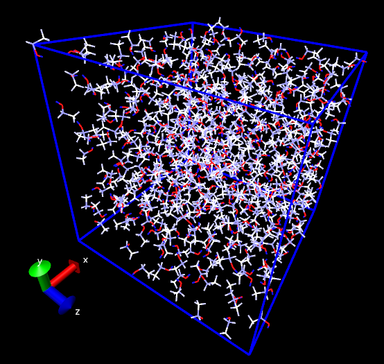
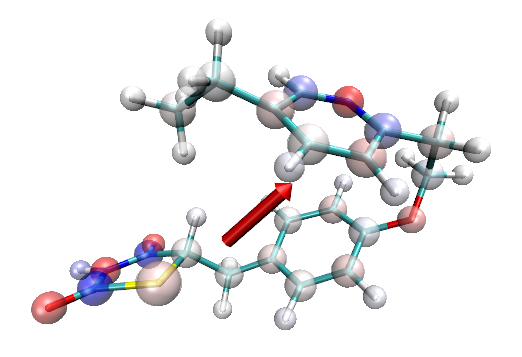

2023-Jun-8注：推荐用<http://bbs.keinsci.com/thread-37839-1-1.html>里介绍的VMD载入tpr文件的插件，比本文的做法更方便。VMD载入tpr文件后直接就有了tpr中的原子电荷信息。

**将GROMACS的原子电荷信息读入VMD的方法**Method to load GROMACS atomic charge information into VMD  
  
文/Sobereva @[北京科音](http://www.keinsci.com/)

First release: 2017-Mar-27  Last update: 2022-Apr-12

VMD可以载入GROMACS的gro、trr、xtc文件，但不会载入速度、受力、电荷。以前写过怎么让VMD把GROMACS产生的速度和受力载入并绘制出来的博文：  
《使VMD实时显示gromacs轨迹中原子的受力》（<http://sobereva.com/36>）  
《使VMD读入Gromacs产生的trr轨迹中速度信息的方法》（<http://sobereva.com/117>）  
有很多VMD里面的插件，比如显示偶极矩、计算静电势、绘制红外光谱的插件都依赖于原子电荷，有时候我们还需要编写依赖于原子电荷的脚本、使用依赖于原子电荷的选择语句，因此把GROMACS模拟时用的原子电荷载入VMD也是非常重要的，这里说说怎么做。  
   
首先在这里下载笔者开发的gmxoutchg程序：<http://sobereva.com/soft/gmxoutchg_1.1.rar>  
其中gmxoutchg.exe是Windows版可执行文件，没后缀的gmxoutchg是Linux下可执行文件，gmxoutchg.f90是源文件。经测试此程序兼容GROMACS 2016.1、2018.8和2019.3版，对其它版本兼容性未经测试。  
  
tpr文件里蕴含了模拟所需的一切信息，包括原子电荷。用GROMACS里的dump命令将二进制的tpr文件转化成文本文件dump.txt，执行以下命令：  
gmx dump -s test.tpr > dump.txt  
  
然后将dump.txt放到gmxoutchg.exe所在目录下，运行gmxoutchg.exe，程序就会解析其中的数据，在当前目录下产生charge.txt。其中包含体系所有原子的原子电荷，顺序和结构文件里的原子顺序完全一致。其中第一列、第二列、第三列分别是原子电荷、分子序号、原子序号。  
  
将charge.txt放到VMD目录后，在载入对应的结构/轨迹后，可以用以下tcl脚本将原子电荷从charge.txt中读入。  
  
set sel [atomselect top all]  
 set natom [$sel num]  
 set rdchg [open "charge.txt" r]  
 set chglist {}  
 for {set iatm 0} {$iatm<=[expr $natom-1]} {incr iatm} {  
  gets $rdchg line  
  scan $line "%f" chg  
  lappend chglist $chg  
  }  
 $sel set charge $chglist  
 close $rdchg  
  
如果想验证是否正确载入了，可以用[atomselect top all] get charge命令把所有原子的原子电荷输出出来（当然，也可以把all换成选择语句只输出指定部分的原子电荷）。  
  
也可以将Coloring method设成Charge，直接从颜色上检验是否正确载入了。下面是乙醇盒子，在默认色彩刻度(RWB)下越红代表原子电荷越负，越蓝代表原子电荷越正。  

  
顺带一提，对于一些体系通过恰当设定显示方式，可以令原子电荷分布一目了然。比如下图的分子，一个显示方式设为Licorice并且把键调细，另一个显示方式是CPK，把圆球调大，用透明材质，用charge来着色，效果挺不错。  

  

有了原子电荷信息可以直接使用VMD的依赖于原子电荷的插件了，比如Extensions-Visualization-Dipole Moment Watcher可以观看基于原子电荷计算的偶极矩矢量，就是上图的红色箭头。

PS：还有一种把原子电荷载入的方法是使用  
gmx editconf -f nico.tpr -mead nico.pqr  
这样nico.tpr里对应的原子电荷就被输出到了nico.pqr的电荷那一列了，pqr文件里还有原子半径信息，把nico.pqr载入VMD时也会读入其中的原子电荷。但这种做法致命缺点是原子电荷保留精度太低，只有两位小数，当涉及一些静电作用的分析时误差可能较大。
