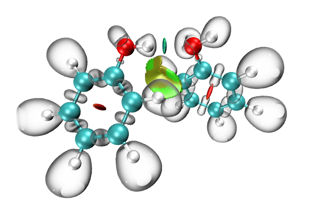
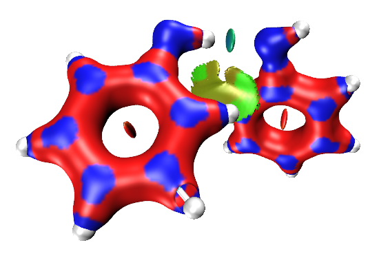
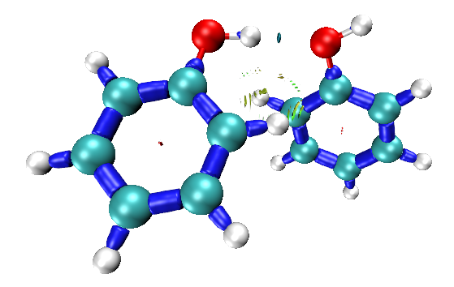
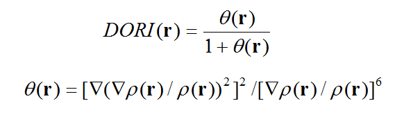
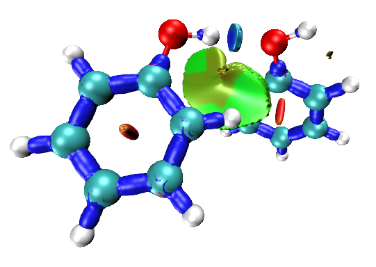
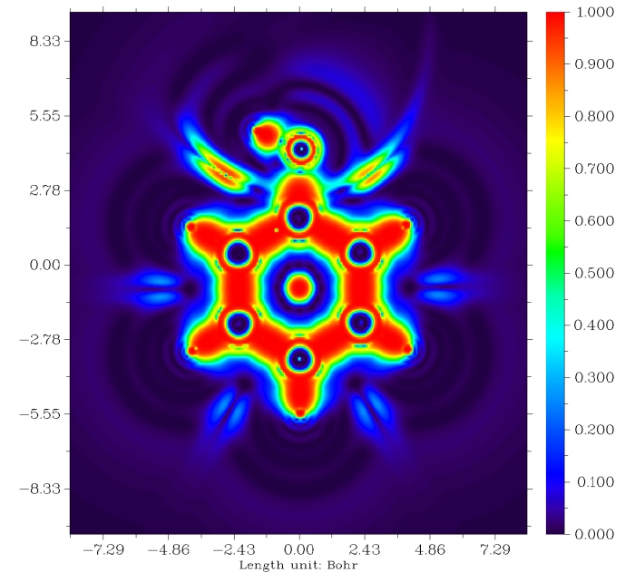
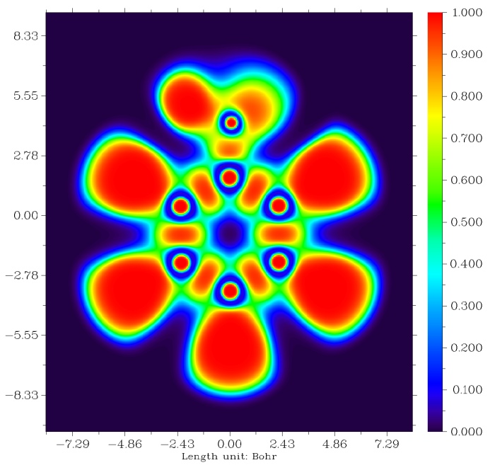

**重要提示**：此文介绍的DORI这个函数已经没有任何使用价值了，强烈不建议使用！在《使用IRI方法图形化考察化学体系中的化学键和弱相互作用》（<http://sobereva.com/598>）里介绍的笔者提出的IRI方法比DORI定义简单得多而图像效果却好得多，已完全取代了DORI。所以请不要再看DORI这篇文章了，直接看介绍IRI的这篇博文就行了。

**使用DORI函数同时考察共价和非共价相互作用**Using DORI function to simultaneously study covalent and non-covalent interactions

文/Sobereva @[北京科音](http://sobereva.com/www.keinsci.com)

First release: 2017-Apr-7   Last update: 2018-Feb-26

RDG（约化密度梯度）和ELF（电子定域化函数）大家都熟悉，前者适合用来考察非共价相互作用，见《使用Multiwfn图形化研究弱相互作用》（<http://sobereva.com/68>）；后者可以考察共价作用，见《电子定域性的图形分析》（<http://sobereva.com/63>）。如果想把共价和非共价相互作用一起考察，一个显而易见的做法是把ELF和RDG结合使用，同时显示二者的等值面，比如J. Chem. Theory Comput., 8, 3993-3997 (2012)中的例子，在这篇博文里也用了这种方式讨论：《通过键级曲线和ELF/LOL/RDG等值面动画研究化学反应过程》（<http://sobereva.com/200>）。  
  
我们看苯酚二聚体的ELF+RDG的例子，输入文件就是Multiwfn程序(在<http://sobereva.com/multiwfn>可免费下载)自带的examples目录下的PhenolDimer.wfn。RDG填色图的绘图过程和Multiwfn手册3.22.1节完全一样。之后又用主功能5计算了ELF格点数据并导出为了.cub文件，载入到了VMD里，把等值面数值设为了0.85以透明方式同时显示了出来，效果如下  
  

  
可见，确实共价作用和非共价作用区域都同时显示了。但是这种方法有两个不足，首要的是必须RDG和ELF分别计算，步骤稍微多一点；次要的是，氢原子上ELF等值面过于膨胀，稍微有点碍眼，可能挡住RDG等值面，还容易被盒子边缘截断。  
  
  
实际上，RDG函数并非不能用来展现共价作用区域。我们把settings.ini里的RDG_maxrho改为0.0，使得不自动把电子密度>0.05的地方屏蔽掉，然后照常作RDG填色图，看到的是下面这样（RDG数值为常用的0.5）  
  

  
虽然共价作用区域确实展现出来了，但是太膨胀，并不好看。我们把RDG等值面数值改为0.2，这回共价作用区域看起来清楚了，但是非共价作用区域等值面过度收缩，显示效果很烂了  
  

  
因此，单凭RDG，没法同时很好地展现共价和非共价相互作用。  
  
  
为了能够让共价和非共价相互作用区域通过一个实空间函数能同时较好展现，在J. Chem. Theory Comput., 10, 3745 (2014)中，作者提出了Density Overlap Regions Indicator (DORI)函数，姑且可以翻译为“密度重叠区域指示函数”。这个函数定义如下  

此函数的值域和ELF一样为[0,1]，还有个额外好处是它是完全依赖于密度的而非依赖于轨道的，即不管任何计算级别只要能算出密度就可以用，原则上还可以直接用高精度的晶体衍射的实验密度。另外，如果把sign(lambda2)rho函数也通过不同颜色投影到DORI等值面上，也可以像RDG填色图那样考察不同弱相互作用的特征。关于DORI的更多原理的讨论看原文，这里就不提了，这里只说怎么通过Multiwfn+VMD绘制DORI图。  
  
2017年4月1日之后更新的Multiwfn开始支持DORI，它作为自定义函数20出现。从3.5版开始，在主功能22里还专门把DORI分析作为子功能5出现。下面演示绘制DORI填色图的过程。  
  
启动Multiwfn，依次输入  
examples\PhenolDimer.wfn  
20   //图形化分析弱相互作用  
5    //DORI分析  
-10  
0    //延展距离设为0避免浪费格点在无关的地方上  
2    //中等质量格点  
3    //导出格点数据  
现在把当前目录下产生的func1.cub、func2.cub，以及examples目录下的VMD作图脚本DORIfill.vmd都拷到VMD的目录下。然后启动VMD，在文本界面运行source DORIfill.vmd，立即看到下图（此脚本设置的DORI等值面数值是0.95。根据体系的不同，需要自行调节等值面数值达到最好图像效果）  
  

  
可见，此图中非共价相互作用区域的图像和RDG填色图大同小异，共价作用区域也展现得很清楚（和RDG=0.2时的等值面极为相似），由于共价键区域电子密度都很大，所以填的颜色是蓝色。DORI比起ELF展现共价作用区域有一个好处是，氢的附近不会有一大坨弥散的等值面，因此看着比较清爽。更多DORI例子可以看其原文。  
  
  
DORI在考察电子定域性上能否取代ELF？这里我们对苯酚分子单体作个图，和ELF对比一下看看。先把Multiwfn目录下的settings.ini里的iuserfunc改为20，然后启动Multiwfn，依次输入以下命令来绘制苯酚平面上的DORI函数填色图  
examples\Phenol.wfn  
4  
100  
1  
[回车]  
1  
0  
立刻看到如下图像  

  
然后再用相同的方式绘制ELF图，如下所示  

  
对比发现DORI和ELF既有相同也有不同。二者都把共价键的存在性充分表现了出来，但是DORI的图像特征过于复杂，“噪音”多，因此对DORI做拓扑分析是不可能的，否则会出现巨大数目且很密集的临界点，这是DORI的明显不足。而且，DORI并没有反映出氧的孤对电子区域，也没有把原子内层电子的高定域性充分反映出来。因此DORI用来展现共价键出现位置还行，但并不能像ELF那样能够直接反映出不同区域电子定域性的高低。
