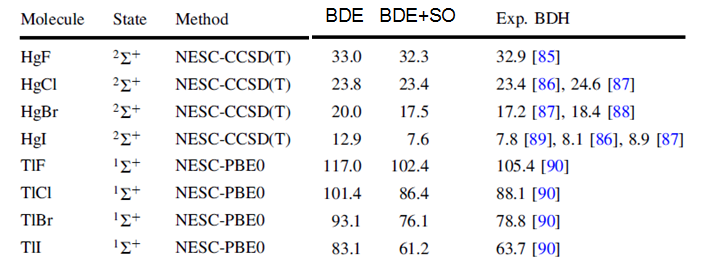

**用NWChem做SODFT在DFT计算中考虑旋轨耦合效应**Use NWChem to do SODFT and consider spin-orbit coupling effect in DFT calculations  
  
文/Sobereva @[北京科音](http://www.keinsci.com)  
First release: 2017-Apr-12   Last update: 2024-Oct-9

  

## 1 前言

众所周知，对重原子构成的体系，尤其是从第五周期开始（H,He算第一周期，下同），需要考虑相对论效应，否则结果可能严重错误。相对论效应分为标量和旋轨耦合两部分。标量相对论效应好考虑，用相对论赝势时即可等效体现，多数主流量化程序如Gaussian也支持标量相对论哈密顿，结合专为标量相对论计算优化的全电子基组即可（见《在赝势下做波函数分析的一些说明》<http://sobereva.com/156>）。  
  
比较棘手的是旋轨耦合的考虑，本文只说单个态的旋轨耦合问题。最直接的考虑方式是做全电子二分量相对论计算，但比较耗时，且支持它的ADF、Turbomole都是收费的，而免费的Dirac等程序则比较小众且功能局限性大。Gaussian里有个DKHSO方法倒是可以在全电子单点计算时考虑标量+旋轨耦合效应。一种常用的又便宜又好的考虑旋轨耦合的做法是使用相对论赝势，但不仅要包含我们平时常用的标量势，还同时要考虑旋轨势，这种方式做DFT称为Spin-orbit DFT (SODFT)，Molpro、Turbomole、NWChem都支持。本文介绍使用其中免费的NWChem程序做SODFT的方法，并会以TlCl和HgI的解离能计算做为例子。在NWChem中，SODFT有解析梯度，因此能够容易地优化分子结构，不过Hessian只有数值的（只考虑标量势的话倒是有解析Hessian）。NWChem的SODFT还一个不足之处是没法利用对称性加速计算。  

NWChem的安装方法看此文：《NWChem的编译方法》（<http://sobereva.com/270>）。本文使用NWChem 6.6版。

顺带一提，如果读者对相对论量子化学计算感兴趣，欢迎参加北京科音高级量子化学培训班（<http://www.keinsci.com/workshop/KAQC_content.html>），我在里面专门用100多页幻灯片非常系统详细讲相对论计算的各种知识。

  
  

## 2 SODFT计算时赝势和赝势基组的选择

赝势包括标量势、旋轨势和核极化势。标量势部分是我们最常使用的，所有相对论赝势都提供了标量势，但不是所有赝势都给出了旋轨势。给出了旋轨势的赝势比较常见的有Stuttgart赝势和CRENB赝势，对周期表覆盖得都比较全面。后者很老，精度也不比前者好，所以本文将会用前者。Stuttgart赝势也分多种，包括HF系列（赝势不体现相对论效应），WB系列（基于Wood-Boring准相对论计算的数据搞的）和DF系列（基于Dirac-Fock全相对论计算的数据搞的），我们一般都用M版（拟合赝势时考虑多个价电子），如MDF。  
  
除赝势外还要考虑赝势基组。基于Stuttgart赝势的常用的几种选择有：  
1 Stuttgart赝势的标配基组。缺点是对于大多数元素，不像下面几种给出了不同档次基组的定义，选择余地小。  
2 cc-pVnZ-PP系列：结合的是Stuttgart小核MDF赝势  
3 def2系列：从第五周期开始是赝势基组，结合的是Stuttgart小核赝势，对s、d、镧系元素用的是MWB，对p元素用的是MDF  
4 dhf系列：和def2都是Weigend主要搞的，只定义了五、六周期的s和d族元素，p族元素和def2定义相同。此系列分为dhf和dhf-2c两种，前者主要用于做一分量计算（即常规的赝势下的计算），把def2对s、d元素用的标量势从MWB改为MDF并重新调整了赝势基组定义，由此使结果略好了一点点；后者在前者基础上增加了额外的p,d基函数，使得带着旋轨势做计算时结果更好  
  
以上赝势基组中，做SODFT时能用dhf-2c就用dhf-2c，毕竟是给此目的专门优化的。对于本文要考察的元素，Tl、Hg、I都可以用dhf-2c，我们用其中TZVP级别的就够了，即dhf-TZVP-2c。虽然也有更好的dhf-QZVP-2c，但对于DFT计算升到QZ级别意义并不大。对于Cl，由于相对比较轻，其引起的旋轨耦合效应不会给结果带来明显影响，所以我们不对它用赝势，而对它用def2-TZVP全电子基组。  
  
  

## 3 计算TlCl

本文我们要尝试重复下面图中的TlCl和HgI的数据，数据来自Theor. Chem. Acc., 130, 633-644 (2011)。图中BDE是键解离能，单位是kcal/mol。键解离能的计算是用解离后的原子的焓减去分子的焓。图中BDE下面的列是文中只考虑标量相对论的计算结果，BDE+SO是考虑旋轨耦合后的。  

  
我们先算TlCl。由于文中用的是PBE0，所以我们也用PBE0，此泛函对这类体系是比较合适的。我们用的键长直接取实验值，大量双原子分子的实验平衡距离可以在NIST网站<http://webbook.nist.gov/chemistry/>上很容易地查到，注意勾选Constants of diatomic molecules，之后数据页面里r_e就是平衡距离了，对此分子是2.484826埃。  
  
首先我们得获取赝势和赝势基组定义。def2和dhf系列在Turbomole基组库<https://basissets.turbomole.org>里是最全的（EMSL上的不仅不全，而且没有旋轨势）。在此网站里面选上Tl，然后选dhf-TZVP-2c，输出格式就用默认的Turbomole（没直接提供NWChem的比较可惜）。给出的数据包括基组部分、标量势部分和旋轨势部分。  
PS1：值得一提的是，当选择dhf-TZVP-2c的时候，对于非第五、六周期的元素，自动给出的是def2对应档次基组的定义  
PS2：此网站输出格式里只有选Turbomole或Molpro这两种支持旋轨势的程序时输出内容才有旋轨势，我们这里不选Molpro是因为没有Turbomole的格式那么容易手动改成NWChem的格式  
  
然后我们把Turbomole格式的基组、标量势和旋轨势的定义都改成NWChem的格式，不知道NWChem的格式怎么写就RTFM。一个较大区别是Turbomole里把收缩系数放在第一列，指数放在最后一列，和NWChem的顺序是反过来的。最终TlCl的SODFT任务的输入文件如下  
  
start  
PRINT low  
geometry noautosym  
 Tl     0.00000      0.00000     0.00000  
 Cl     0.00000      0.00000     2.484826  
end  
basis "ao basis" spherical  
Cl library def2-TZVP  
Tl  s  
  729.65038145      0.13672829828E-03  
  46.665548707      0.60443439951E-02  
  20.970448726     -0.20022066697  
  14.149588677      0.40801678488  
Tl  s  
  20.730134285     -0.71861135918E-01  
  6.1527631309      0.98057508445  
Tl  s  
  1.5757324480       1.0000000000  
Tl  s  
 0.74980169458       1.0000000000  
Tl  s  
 0.19536816194       1.0000000000  
Tl  s  
 0.70878767298E-01   1.0000000000  
Tl  p  
  15.383852616      0.61717949180  
  14.814929544     -0.72859235151  
  6.7261253658      0.40438195364  
Tl  p  
  1.9626182149      0.43157661160  
  1.0331857851      0.39230403853  
 0.53837445996      0.14007406820  
Tl  p  
 0.24446611676       1.0000000000  
Tl  p  
 0.90785377260E-01   1.0000000000  
Tl  p  
 0.33401321498E-01   1.0000000000  
Tl  d  
  57.606819928      0.16054811114E-03  
  9.7368866667      0.24456562496E-01  
  6.9256201679     -0.69914775031E-01  
  2.1396230731      0.19496269490  
  1.0836187110      0.29731629705  
  0.52356298209     0.23728708102  
Tl  d  
 0.23842309375       1.0000000000  
Tl  d  
 0.95000000000E-01   1.0000000000  
Tl  f  
 0.28435             1.0000000000  
Tl  f  
  0.95               1.0000000000  
Tl  p  
  32.0             -0.0005  
  16.0             -1.0  
Tl  p  
  8.0              -1.0125  
  4.0               0.7450  
Tl  p  
  2.0               1.0  
Tl  d  
  3.0               1.0  
END  
ECP  
Tl nelec 60     
Tl ul  
2      1.00000000            0.00000000  
Tl s  
2     12.16780500          281.28466300  
2      8.29490900           62.43425100  
Tl p  
2      7.15149200            4.63340800  
2      5.17286500            9.34175600  
2      9.89107200           72.29925300  
2      9.00339100          144.55803700  
Tl d  
2      7.13021800           35.94303900  
2      6.92690600           53.90959300  
2      5.41757000           10.38193900  
2      5.13868100           15.58382200  
Tl f  
2      5.62639900           15.82548800  
2      5.54895200           21.10402100  
2      2.87494600            2.91512700  
2      2.82145100            3.89690300  
Tl g  
2      6.67905700           -7.49453400  
2      6.70683500           -9.54057500  
2      7.20928400           -7.79799200  
2      7.07096400           -9.25952400  
END  
SO  
Tl p  
2          7.151492       -9.266817  
2          5.172865        9.341756  
2          9.891072     -144.598506  
2          9.003391      144.558037  
Tl d  
2          7.130218      -35.943039  
2          6.926906       35.939729  
2          5.417570      -10.381939  
2          5.138681       10.389215  
Tl f  
2          5.626399      -10.550326  
2          5.548952       10.552010  
2          2.874946       -1.943418  
2          2.821451        1.948451  
Tl g  
2          6.679057        3.747267  
2          6.706835       -3.816230  
2          7.209284        3.898996  
2          7.070964       -3.703809  
END  
dft  
 xc pbe0  
end  
task sodft  
  
输入文件还是很容易理解的，照常定义基组部分，ECP段落指定标量势部分，SO字段指定旋轨势部分，最后task里写上SODFT就行了。noautosym写不写无所谓，由于SODFT不支持对称性，不写它时程序也不会利用对称性来加速。  
  
然后我们运行此任务，输出文件里这部分即是SODFT能量：  
Total DFT energy =   -632.863447528456  
在笔者的Intel 4核i7-2630QM机子下，做这个计算耗时是20.8s，若只考虑标量势是10.8s，可见考虑旋轨势还是会增加不少耗时，不过一般完全承受得起，总比做全电子二分量相对论计算来考虑旋轨耦合效应便宜得多。  
  
之后我们把TlCl的文件分别改写为Tl和Cl的文件，二者都是二重态，所以在dft字段里面要写上mult 2。算出的结果是Tl=-172.724034492809，Cl=-459.997396831618。因此基于单点能算的键解离能是627.51*(-459.997396831618-172.724034492809+632.863447528456)=89.116 kcal/mol。  
  
到此还没完，我们还得计算焓的热校正量对解离能的修正。我们就不用SODFT算频率了，就直接在Gaussian里用# PBE1PBE/def2TZVP opt freq scale=0.982关键词对TlCl优化和做振动分析就完了，这里0.982是ZPE校正因子（为了省事我们不单独考虑升温对焓影响那部分的校正因子）。实际上我们查不到PBE0/def2-TZVP级别的校正因子，但由于J. Phys. Chem. A, 111, 11683 (2007)中给出PBE0结合6-311+G(2df,p)这样不错级别基组的校正因子是0.9824，所以有理由认为0.982对于PBE0结合def2-TZVP是基本合适的。计算后得到的焓的热校正量输出为  
Thermal correction to Enthalpy=                  0.004388  
对于Tl和Cl没必要做振动分析，因为单个原子只有平动对焓有贡献，且是精确已知的，即5/2*RT，常温下对应0.002360 Hartree。所以常温下焓的热校正量对TlCl键解离能的贡献可以计算为627.51*(0.002360+0.002360-0.004388)=0.208 kcal/mol。  
  
最后，得到TlCl的常温下键解离能是89.116+0.208=89.324 kcal/mol，这和前面贴出来的实验值88.1 kcal/mol相符极好！（对普通DFT泛函来说能达到1kcal/mol程度误差着实难能可贵）  
  
  

## 4 计算HgI

HgI是二重态，解离后会生成单重态的Hg和二重态的I。HgI的键长在NIST上查不到，虽然某些文献里估计能查到，但这里不深究，就直接用PBE0/def2-TZVP级别来优化键长，之后再做单点计算。优化后键长是2.75663埃。（当然，若要求更精确，可以直接用SODFT优化。笔者也试了下，i7-2630QM上耗时336s，结果是2.76379埃。可见对此体系是否考虑旋轨耦合对结构影响很小，对TlCl测试过也是如此）。  
  
我们使用上一节的方式，获取Hg和I的dhf-TZVP-2c赝势基组定义以及对应的标量势和旋轨势，写成HgI的PBE0的SODFT任务的单点输入文件，如下所示：  
  
start  
PRINT low  
geometry noautosym  
 Hg     0.00000      0.00000     0.00000  
 I      0.00000      0.00000     2.75663  
end  
basis "ao basis" spherical  
I  s  
  5899.5791533      0.24188269271E-03  
  898.54238765      0.15474041742E-02  
  200.37237912      0.42836684457E-02  
  31.418053840     -0.39417936275E-01  
  15.645987838      0.96086691992  
I  s  
  11.815741857      0.57815778954  
  6.4614458287      0.37374293124  
I  s  
  2.3838067579       1.0000000000  
I  s  
  1.1712089662       1.0000000000  
I  s  
 0.32115875757       1.0000000000  
I  s  
 0.12387919364       1.0000000000  
I  p  
  185.43362455      0.83127824000E-03  
  20.091408146      0.63991653000E-01  
  9.7577022390     -0.27791138000  
I  p  
  13.068307912     -0.49793790382E-01  
  3.5818714205      0.38212490511  
  2.0282441852      0.70447564804  
  1.0181492146      0.33781067803  
I  p  
 0.46673773115       1.0000000000  
I  p  
 0.19242597960       1.0000000000  
I  p  
 0.74508878495E-01   1.0000000000  
I  d  
  124.20341062      0.65671747209E-03  
  34.587311801      0.51648185674E-02  
  12.767328064     -0.19881371307E-01  
  4.7745100133      0.21386794109  
  2.4582209028      0.43405444707  
  1.1923708147      0.37850637882  
I  d  
 0.52883971906       1.0000000000  
I  d  
 0.17008164307       1.0000000000  
I  f  
   0.44141808    1.00000000  
I  f  
   2.18           1.0000000000  
I  p  
     12.0              -0.3  
      6.0               1.0  
I  d  
      2.0               1.0  
Hg  s  
  48.013786990      0.58613168385E-02  
  21.239875095     -0.17590367988  
  15.876100879      0.35780354753  
Hg  s  
  5.4837607070       1.0000000000  
Hg  s  
  1.5480592128       1.0000000000  
Hg  s  
 0.72425230437       1.0000000000  
Hg  s  
 0.16369906863       1.0000000000  
Hg  s  
 0.57211615334E-01   1.0000000000  
Hg  p  
  23.291760168     -0.83564430982E-02  
  13.028969569      0.83703058587E-01  
  6.5100040792     -0.31023833705  
Hg  p  
  1.8167935815       1.0000000000  
Hg  p  
 0.90079391013       1.0000000000  
Hg  p  
 0.41304090835       1.0000000000  
Hg  p  
 0.11845879331       1.0000000000  
Hg  p  
 0.36084184656E-01   1.0000000000  
Hg  d  
  15.176302343      0.60654575178E-02  
  6.7004896493     -0.59880306300E-01  
  1.9144256118      0.31411145584  
 0.88641552102      0.45081091161  
Hg  d  
 0.38364767725       1.0000000000  
Hg  d  
 0.14936891490       1.0000000000  
Hg  f  
     0.79569           1.0  
Hg  p  
  19.3582           0.0635  
   8.7992          -0.4607  
Hg  p  
   3.9996           0.8853  
Hg  d     
   2.7000000000        1.0000000000  
END  
ECP  
I nelec 28  
I ul  
2        1.000000         0.000000          
I s  
2       40.033376        49.989649          
2       17.300576       281.006556          
2        8.851720        61.416739          
I p  
2       15.720141        67.416239          
2       15.208222       134.807696          
2        8.294186        14.566548          
2        7.753949        28.968422          
I d  
2       13.817751        35.538756          
2       13.587805        53.339759          
2        6.947630         9.716466          
2        6.960099        14.977500          
I f  
2       18.522950       -20.176618          
2       18.251035       -26.088077          
2        7.557901        -0.220434          
2        7.597404        -0.221646          
Hg nelec 60     
Hg ul  
2      1.0000000      0.0000000          
Hg s  
2     12.4130710    275.7747970          
2      6.8979130     49.2678980          
Hg p  
2     11.3103200     80.5069840          
2     10.2107730    161.0348240          
2      5.9398040      9.0834160          
2      5.0197550     18.3677730          
Hg d  
2      8.4078950     51.1372560          
2      8.2140860     76.7074590          
2      4.0126120      6.5618210          
2      3.7953980      9.8180700          
Hg f  
2      3.2731060      9.4290010          
2      3.2083210     12.4948560          
Hg g  
2      4.4852960     -6.3384140          
2      4.5132000     -8.0998630          
END  
SO  
I p  
2       15.720141        -134.832478        
2       15.208222         134.807696        
2        8.294186         -29.133096        
2        7.753949          28.968422        
I d  
2       13.817751         -35.538756        
2       13.587805          35.559839        
2        6.947630          -9.716466        
2        6.960099           9.985000        
I f  
2       18.522950          13.451079        
2       18.251035         -13.044039        
2        7.557901           0.146956        
2        7.597404          -0.110823        
Hg p  
2        11.31032000 -161.01396700       
2        10.21077300  161.03482400       
2         5.93980400  -18.16683200       
2         5.01975500   18.36777300       
Hg d  
2         8.40789500  -51.13725600       
2         8.21408600   51.13830600       
2         4.01261200   -6.56182100       
2         3.79539800    6.54538000       
Hg f  
2         3.27310600   -6.28600100       
2         3.20832100    6.24742800       
Hg g  
2         4.48529600    3.16920700       
2         4.51320000   -3.23994500       
END  
dft  
 mult 2  
 xc pbe0  
end  
task sodft  
  
之后稍作修改，得到Hg和I的PBE0-SODFT任务输入文件。计算后将能量求差，得到基于电子能量的BDE：  
627.51*(-295.746562477964-153.684090186717+449.448365018831)=11.115 kcal/mol  
  
如前面的图所示，HgI的解离能的三个不同来源的实验值为7.8、8.1、8.9 kcal/mol，当前算的和哪个都想差甚远，因此PBE0对此体系不够给力。对这种情况，我们可以在DFT级别计算出旋轨耦合对BDE的校正，然后加到CCSD(T)/def2-QZVP这样只考虑标量相对论的高计算级别得到的解离能上。为此，我们把上面用的HgI、Hg、I输入文件里的sodft改成dft（之后SO段落可以删掉，不删也无所谓），这样计算就只利用标量势部分了，旋轨耦合效应就不考虑了。结果为  
627.51*(-295.697077663054-153.500765444841+449.222674994391)=15.582 kcal/mol  
因此，旋轨耦合对BDE的校正量为11.115-15.582=-4.467 kcal/mol。  
  
在CCSD(T)/def2QZVP级别算的HgI解离过程的电子能量变化：  
627.51*(-153.2231386-297.2662532+450.5085777)=12.039 kcal/mol  
  
用Gaussian在PBE0/def2-TZVP下做振动分析，得到常温下焓的热校正量对HgI键解离能的贡献：  
627.51*(0.002360+0.002360-0.004277)=0.278 kcal/mol  
  
put together，得到HgI的常温下的BDE：  
12.039-4.467+0.278 = 7.85 kcal/mol  
可见结果和实验符合得极好！  
  
  

## 5 SODFT方式计算BDE总结

前面HgI的例子很有代表性，说明想准确计算重原子的键解离能，最简单省事的过程就是：  
1 用较合适的泛函，在def2-TZVP或相似级别的结合相对论赝势的赝势基组（如cc-pVTZ-PP，但不划算）下进行优化和做振动分析，得到焓的热校正量对BDE的影响。注意应考虑ZPE校正因子  
2 用较合适的泛函，在1的结构下用dhf-TZVP-2c赝势基组与配套的MDF标量势+旋轨势做SODFT计算，再去掉旋轨势做普通DFT计算，利用差值得到旋轨耦合对BDE的影响  
3 基于1的结构，在尽可能高的级别下计算考虑了标量相对论效应的单点，由此得到基于电子能量算的BDE。体系很小时计算级别一般用CCSD(T)结合def2-QZVP或cc-pVQZ-PP赝势基组，赝势只考虑标量势部分。可以把结果再外推到CBS。  
最后把1、2、3相加，就得到了特定温度下的键解离能。  
  
上面说的是体系只含第五、六周期s,d,p族元素的情况。对于体系存在其它元素时，笔者认为应当这样考虑：  
 对前三周期的元素，就用全电子基组就行，不需要考虑相对论效应。  
 对第四周期元素，考虑相对论效应有益。分为两种情况：  
  (a)Cu之前的：Stuttgart赝势没有给出这些元素的旋轨势，cc-pVnZ-PP也没有给出这些元素的定义，def2对这些还是全电子基组。要考虑相对论效应就用Stuttgart赝势结合其标配赝势基组就完了。非要也考虑旋轨耦合那就用CRENB标量势+旋轨势结合CRENBL赝势基组吧。  
  (b)Cu~Kr：用cc-pVnZ-PP赝势基组，结合对应的MDF标量势和旋轨势。从EMSL上取cc-pVnZ-PP定义的时候赝势部分只有标量势部分，旋轨势得从Stuttgart赝势的官网<http://www.tc.uni-koeln.de/PP/clickpse.en.html>上自行取，输出格式必须选molpro，要选小核的MDF版本（比如Br要选ECP10MDF）。输出的赝势里前几行是标量势（和EMSL上cc-pVnZ-PP直接带的一致），后几行是旋轨势。  
 对于镧系、锕系及一些第七周期的元素，就用Stuttgart赝势官网上小核标量势+旋轨势结合标配的赝势基组。情况较复杂。有的有MWB有的有MDF有的都有（优先用后者），有的有旋轨势有的没有旋轨势（没有的话就没辙了）。  
  
另外，上面说的第1步的优化+振动分析，如果求准确，可直接用SODFT来做，但是由于SODFT只有半数值频率，体系稍大一点就会极为吃力。对于第3步高精度的考虑标量相对论的单点，不是必须用相对论赝势，用高质量全电子基组并使用较好的标量相对论哈密顿（LUT-IOTC、DKH3等）也可以，只不过耗时会高不少而且精度也未必更好。
